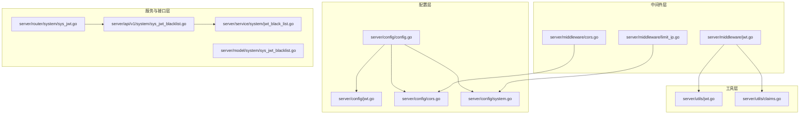
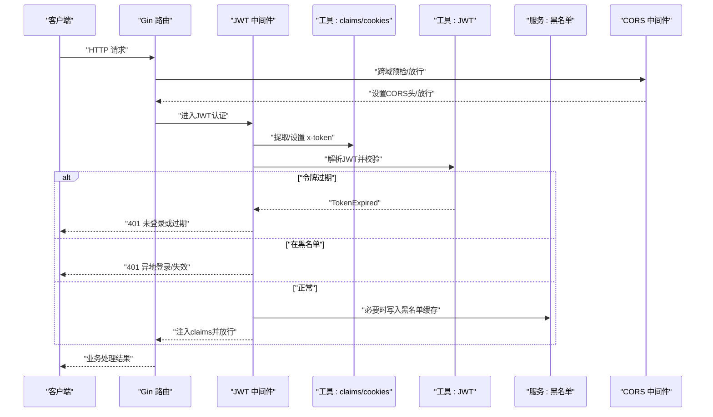
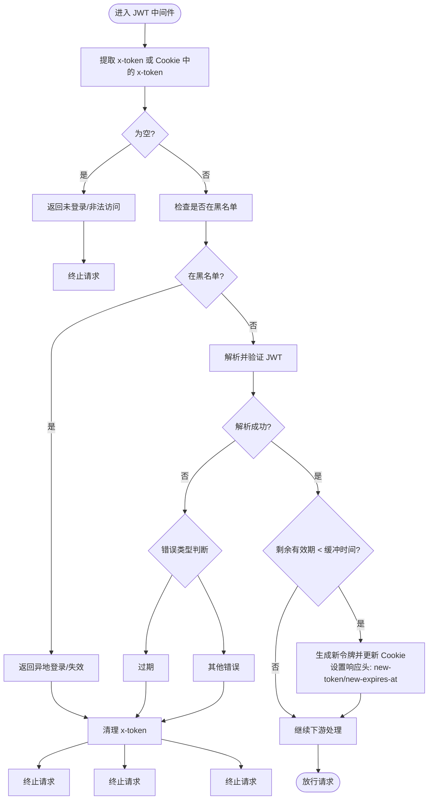
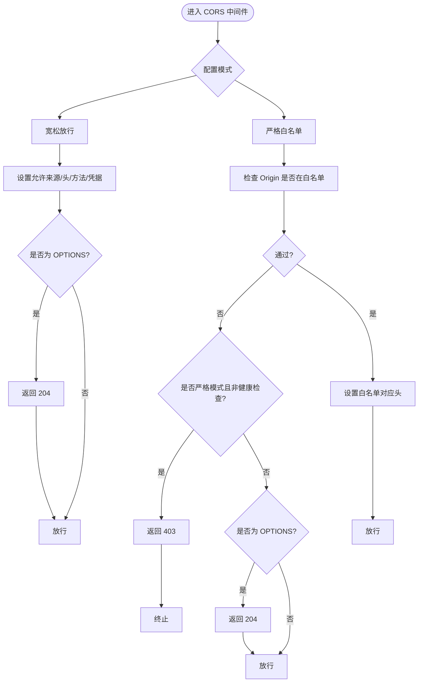
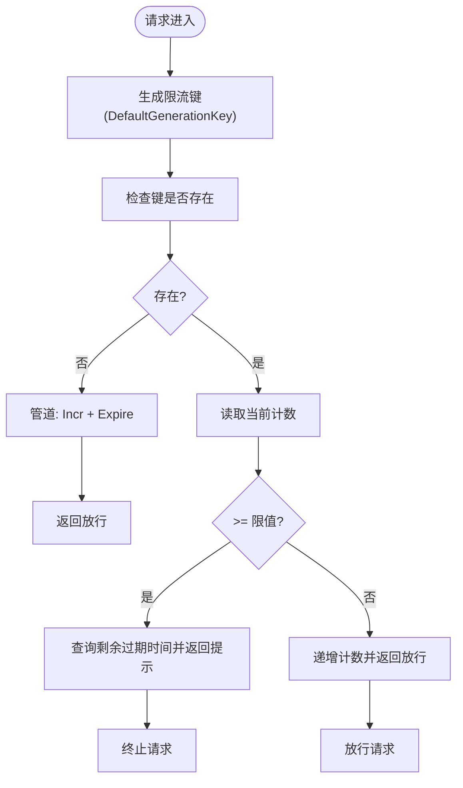
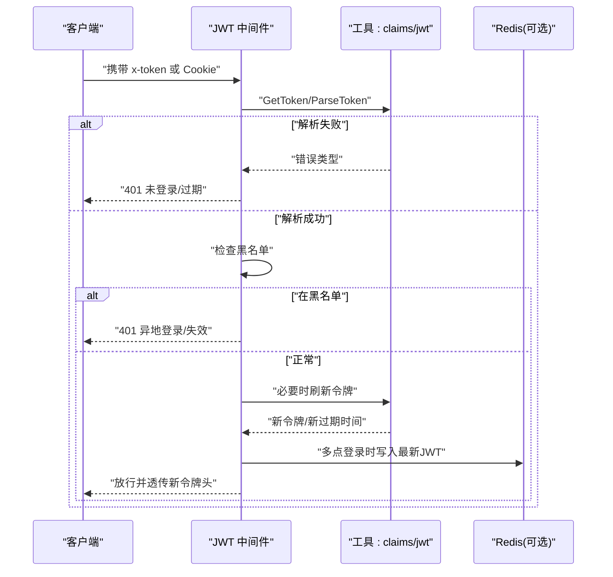
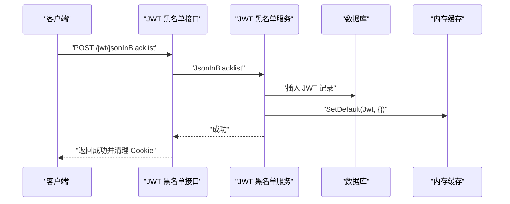
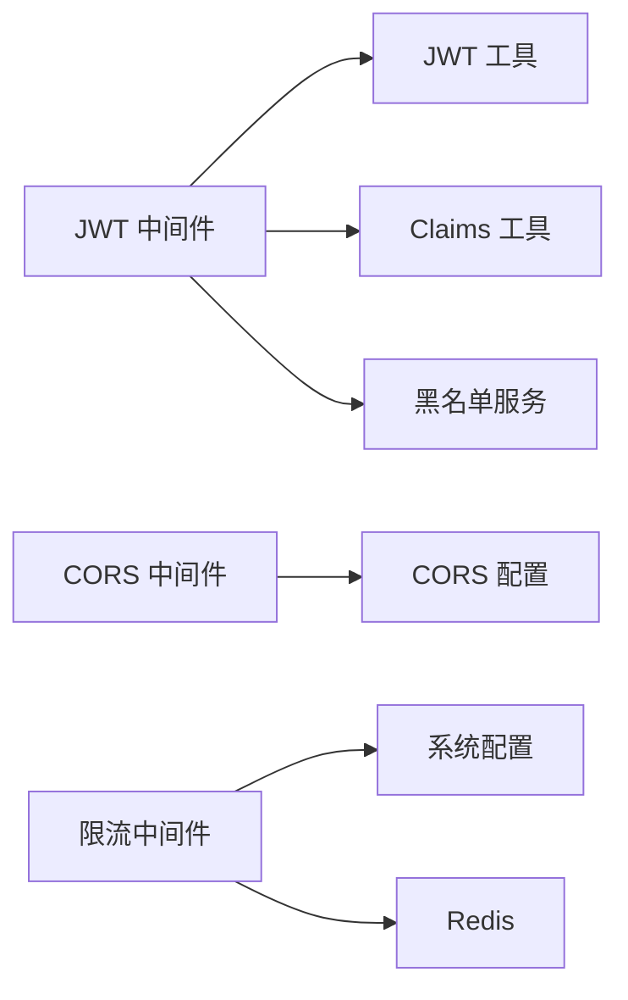

# API 安全认证

<cite>
**本文引用的文件**
- [server/config/jwt.go](file://server/config/jwt.go)
- [server/config/cors.go](file://server/config/cors.go)
- [server/config/system.go](file://server/config/system.go)
- [server/config/config.go](file://server/config/config.go)
- [server/middleware/jwt.go](file://server/middleware/jwt.go)
- [server/middleware/cors.go](file://server/middleware/cors.go)
- [server/middleware/limit_ip.go](file://server/middleware/limit_ip.go)
- [server/utils/jwt.go](file://server/utils/jwt.go)
- [server/utils/claims.go](file://server/utils/claims.go)
- [server/service/system/jwt_black_list.go](file://server/service/system/jwt_black_list.go)
- [server/router/system/sys_jwt.go](file://server/router/system/sys_jwt.go)
- [server/api/v1/system/sys_jwt_blacklist.go](file://server/api/v1/system/sys_jwt_blacklist.go)
- [server/model/system/sys_jwt_blacklist.go](file://server/model/system/sys_jwt_blacklist.go)
- [server/model/system/request/jwt.go](file://server/model/system/request/jwt.go)
</cite>

## 目录
1. [引言](#引言)
2. [项目结构](#项目结构)
3. [核心组件](#核心组件)
4. [架构总览](#架构总览)
5. [详细组件分析](#详细组件分析)
6. [依赖分析](#依赖分析)
7. [性能考量](#性能考量)
8. [故障排查指南](#故障排查指南)
9. [结论](#结论)
10. [附录](#附录)

## 引言
本文件聚焦于 API 安全认证体系的技术实现，涵盖 JWT 认证机制（生成、验证、刷新、黑名单管理）、CORS 跨域策略（宽松放行与严格白名单）、IP 限制与速率控制、认证中间件工作流程以及安全最佳实践。内容基于仓库中的实际实现进行梳理，并提供可视化图示与定位路径，便于开发者快速理解与落地。

## 项目结构
围绕安全认证的关键目录与文件如下：
- 配置层：JWT 参数、CORS 模式与白名单、系统限流参数等
- 中间件层：JWT 认证、CORS 处理、IP 限流
- 工具层：JWT 签发与解析、Token Cookie 管理、Redis 交互
- 服务与接口层：JWT 黑名单入库、拉黑接口、路由组织

图表来源
- [server/config/config.go:1-41](file://server/config/config.go#L1-L41)
- [server/config/jwt.go:1-9](file://server/config/jwt.go#L1-L9)
- [server/config/cors.go:1-15](file://server/config/cors.go#L1-L15)
- [server/config/system.go:1-16](file://server/config/system.go#L1-L16)
- [server/middleware/jwt.go:1-90](file://server/middleware/jwt.go#L1-L90)
- [server/middleware/cors.go:1-74](file://server/middleware/cors.go#L1-L74)
- [server/middleware/limit_ip.go:1-93](file://server/middleware/limit_ip.go#L1-L93)
- [server/utils/jwt.go:1-106](file://server/utils/jwt.go#L1-L106)
- [server/utils/claims.go:1-149](file://server/utils/claims.go#L1-L149)
- [server/service/system/jwt_black_list.go:1-53](file://server/service/system/jwt_black_list.go#L1-L53)
- [server/api/v1/system/sys_jwt_blacklist.go:1-34](file://server/api/v1/system/sys_jwt_blacklist.go#L1-L34)
- [server/router/system/sys_jwt.go:1-15](file://server/router/system/sys_jwt.go#L1-L15)
- [server/model/system/sys_jwt_blacklist.go:1-11](file://server/model/system/sys_jwt_blacklist.go#L1-L11)

章节来源
- [server/config/config.go:1-41](file://server/config/config.go#L1-L41)
- [server/config/jwt.go:1-9](file://server/config/jwt.go#L1-L9)
- [server/config/cors.go:1-15](file://server/config/cors.go#L1-L15)
- [server/config/system.go:1-16](file://server/config/system.go#L1-L16)

## 核心组件
- JWT 配置与模型
  - JWT 配置项：签名密钥、过期时间、缓冲时间、签发者
  - Claims 结构：包含基础用户信息与注册声明（受众、生效/过期时间、签发者）
- 认证中间件
  - 令牌提取、黑名单校验、解析与过期判断、自动刷新与响应头透传
- CORS 中间件
  - 宽松放行与严格白名单两种模式，按配置动态决定允许来源与暴露头
- 速率限制中间件
  - 基于 Redis 的滑动窗口/计数器限流，支持自定义键生成与检查逻辑
- 黑名单服务与接口
  - 将当前令牌加入黑名单并同步到缓存；提供拉黑接口

章节来源
- [server/config/jwt.go:1-9](file://server/config/jwt.go#L1-L9)
- [server/model/system/request/jwt.go:1-22](file://server/model/system/request/jwt.go#L1-L22)
- [server/middleware/jwt.go:16-77](file://server/middleware/jwt.go#L16-L77)
- [server/middleware/cors.go:10-63](file://server/middleware/cors.go#L10-L63)
- [server/middleware/limit_ip.go:16-62](file://server/middleware/limit_ip.go#L16-L62)
- [server/service/system/jwt_black_list.go:22-29](file://server/service/system/jwt_black_list.go#L22-L29)
- [server/api/v1/system/sys_jwt_blacklist.go:22-33](file://server/api/v1/system/sys_jwt_blacklist.go#L22-L33)

## 架构总览
下图展示从请求进入至响应返回的认证与跨域处理主干流程，以及与配置、工具、服务的交互关系。

图表来源
- [server/middleware/jwt.go:16-77](file://server/middleware/jwt.go#L16-L77)
- [server/utils/claims.go:42-55](file://server/utils/claims.go#L42-L55)
- [server/utils/jwt.go:62-88](file://server/utils/jwt.go#L62-L88)
- [server/service/system/jwt_black_list.go:22-29](file://server/service/system/jwt_black_list.go#L22-L29)
- [server/middleware/cors.go:10-63](file://server/middleware/cors.go#L10-L63)

## 详细组件分析

### JWT 认证机制
- 令牌生成
  - 基于 HS256 签名，使用配置中的签名密钥
  - Claims 包含基础用户信息与注册声明（受众、生效/过期时间、签发者），缓冲时间为配置项
- 令牌解析与验证
  - 解析时区分过期、格式错误、签名无效、尚未生效等错误类型
  - 若解析失败，根据错误类型返回相应提示并清理令牌
- 自动刷新与响应头透传
  - 当剩余有效期小于缓冲时间时，生成新令牌并更新 Cookie，同时在响应头中返回新令牌与过期时间
  - 支持多点登录时将最新 JWT 写入 Redis 并设置与 JWT 相同的过期时间
- 黑名单管理
  - 中间件在每次请求时检查令牌是否在内存缓存黑名单中
  - 拉黑接口将当前令牌写入数据库与内存缓存，同时清除客户端 Cookie

图表来源
- [server/middleware/jwt.go:16-77](file://server/middleware/jwt.go#L16-L77)
- [server/utils/claims.go:42-55](file://server/utils/claims.go#L42-L55)
- [server/utils/jwt.go:48-88](file://server/utils/jwt.go#L48-L88)
- [server/utils/jwt.go:95-105](file://server/utils/jwt.go#L95-L105)
- [server/service/system/jwt_black_list.go:22-29](file://server/service/system/jwt_black_list.go#L22-L29)

章节来源
- [server/utils/jwt.go:13-106](file://server/utils/jwt.go#L13-L106)
- [server/utils/claims.go:14-65](file://server/utils/claims.go#L14-L65)
- [server/middleware/jwt.go:16-77](file://server/middleware/jwt.go#L16-L77)
- [server/service/system/jwt_black_list.go:22-29](file://server/service/system/jwt_black_list.go#L22-L29)
- [server/api/v1/system/sys_jwt_blacklist.go:22-33](file://server/api/v1/system/sys_jwt_blacklist.go#L22-L33)
- [server/model/system/request/jwt.go:8-22](file://server/model/system/request/jwt.go#L8-L22)

### CORS 跨域策略
- 宽松放行模式
  - 对任意 Origin 返回对应来源，允许常见头与方法，暴露关键响应头，允许凭据
  - 对所有 OPTIONS 直接返回 204
- 严格白名单模式
  - 仅当请求来源与配置白名单完全匹配时才放行
  - 未通过检查且非健康检查路径时返回 403
  - 仍对 OPTIONS 进行短路放行（非严格模式下）

图表来源
- [server/middleware/cors.go:10-63](file://server/middleware/cors.go#L10-L63)
- [server/config/cors.go:1-15](file://server/config/cors.go#L1-L15)

章节来源
- [server/middleware/cors.go:10-63](file://server/middleware/cors.go#L10-L63)
- [server/config/cors.go:1-15](file://server/config/cors.go#L1-L15)

### IP 限制与速率控制
- 限流算法与实现
  - 基于 Redis 的计数器/滑动窗口思路：首次访问创建键并设置过期时间，后续累加计数
  - 达到阈值时返回剩余冷却时间提示，未达阈值则递增
  - 默认键规则：前缀 + 客户端真实 IP
- 配置参数
  - 限流周期（秒）与阈值来自系统配置
- 防护效果
  - 有效抑制暴力破解、爬虫与高频刷接口等行为
  - 通过集中式 Redis 实现跨实例一致性

图表来源
- [server/middleware/limit_ip.go:27-62](file://server/middleware/limit_ip.go#L27-L62)
- [server/middleware/limit_ip.go:64-92](file://server/middleware/limit_ip.go#L64-L92)
- [server/config/system.go:8-9](file://server/config/system.go#L8-L9)

章节来源
- [server/middleware/limit_ip.go:16-93](file://server/middleware/limit_ip.go#L16-L93)
- [server/config/system.go:1-16](file://server/config/system.go#L1-L16)

### 认证中间件工作流程
- 请求拦截
  - 提取请求头 x-token，若不存在则尝试从 Cookie 中读取并解析
- 令牌解析与权限验证
  - 解析失败按错误类型处理；过期或无效统一返回未登录
  - 检查黑名单，命中则清空 Cookie 并终止
- 响应处理
  - 若即将过期，生成新令牌并写入 Cookie，同时在响应头透传新令牌与新过期时间
  - 支持多点登录时将最新 JWT 写入 Redis

图表来源
- [server/middleware/jwt.go:16-77](file://server/middleware/jwt.go#L16-L77)
- [server/utils/claims.go:42-65](file://server/utils/claims.go#L42-L65)
- [server/utils/jwt.go:48-88](file://server/utils/jwt.go#L48-L88)
- [server/utils/jwt.go:95-105](file://server/utils/jwt.go#L95-L105)

章节来源
- [server/middleware/jwt.go:16-77](file://server/middleware/jwt.go#L16-L77)
- [server/utils/claims.go:42-65](file://server/utils/claims.go#L42-L65)
- [server/utils/jwt.go:48-88](file://server/utils/jwt.go#L48-L88)

### 黑名单管理
- 拉黑流程
  - 接口接收当前令牌，写入数据库与内存缓存，同时清理客户端 Cookie
  - 服务层加载数据库中的黑名单到内存缓存，供中间件快速判断
- 数据模型
  - 黑名单表字段包含唯一标识与 JWT 文本

图表来源
- [server/api/v1/system/sys_jwt_blacklist.go:22-33](file://server/api/v1/system/sys_jwt_blacklist.go#L22-L33)
- [server/service/system/jwt_black_list.go:22-29](file://server/service/system/jwt_black_list.go#L22-L29)
- [server/model/system/sys_jwt_blacklist.go:7-11](file://server/model/system/sys_jwt_blacklist.go#L7-L11)

章节来源
- [server/api/v1/system/sys_jwt_blacklist.go:14-33](file://server/api/v1/system/sys_jwt_blacklist.go#L14-L33)
- [server/service/system/jwt_black_list.go:22-53](file://server/service/system/jwt_black_list.go#L22-L53)
- [server/router/system/sys_jwt.go:9-14](file://server/router/system/sys_jwt.go#L9-L14)
- [server/model/system/sys_jwt_blacklist.go:7-11](file://server/model/system/sys_jwt_blacklist.go#L7-L11)

## 依赖分析
- 组件耦合
  - JWT 中间件依赖工具层的令牌解析与 Cookie 管理，以及服务层的黑名单缓存
  - CORS 中间件依赖配置层的模式与白名单
  - 限流中间件依赖系统配置与 Redis
- 外部依赖
  - golang-jwt/jwt/v5 用于签名与解析
  - Redis 用于限流与多点登录 JWT 存储
- 循环依赖
  - 未发现循环导入；模块职责清晰

图表来源
- [server/middleware/jwt.go:16-77](file://server/middleware/jwt.go#L16-L77)
- [server/middleware/cors.go:30-63](file://server/middleware/cors.go#L30-L63)
- [server/middleware/limit_ip.go:44-62](file://server/middleware/limit_ip.go#L44-L62)
- [server/utils/jwt.go:26-30](file://server/utils/jwt.go#L26-L30)
- [server/utils/claims.go:42-55](file://server/utils/claims.go#L42-L55)
- [server/service/system/jwt_black_list.go:22-29](file://server/service/system/jwt_black_list.go#L22-L29)

章节来源
- [server/middleware/jwt.go:16-77](file://server/middleware/jwt.go#L16-L77)
- [server/middleware/cors.go:30-63](file://server/middleware/cors.go#L30-L63)
- [server/middleware/limit_ip.go:44-62](file://server/middleware/limit_ip.go#L44-L62)

## 性能考量
- JWT 解析与并发
  - 新令牌生成采用并发控制，避免同一旧令牌并发刷新导致的竞态
- 多点登录
  - 使用 Redis 存储最新 JWT，确保切换设备后旧令牌立即失效
- 黑名单缓存
  - 内存缓存加载数据库黑名单，减少数据库压力
- 限流
  - Redis 原子操作与管道提升吞吐，避免热点键竞争

[本节为通用性能讨论，不直接分析具体文件]

## 故障排查指南
- 401 未登录或非法访问
  - 检查前端是否正确传递 x-token 或 Cookie 中的 x-token
  - 确认签名密钥与 Issuer 配置一致
- 401 登录已过期
  - 前端应在过期前触发刷新；检查缓冲时间与过期时间配置
- 401 您的帐户异地登陆或令牌失效
  - 当前令牌已被拉黑；确认是否重复登录或调用了拉黑接口
- CORS 403 或跨域失败
  - 严格白名单模式下需核对 Allow-Origin 与请求来源是否完全一致
  - 健康检查路径需单独处理
- 频繁请求被限制
  - 检查系统限流配置与 Redis 连通性；确认键生成规则是否符合预期

章节来源
- [server/middleware/jwt.go:19-45](file://server/middleware/jwt.go#L19-L45)
- [server/middleware/cors.go:50-58](file://server/middleware/cors.go#L50-L58)
- [server/middleware/limit_ip.go:81-87](file://server/middleware/limit_ip.go#L81-L87)

## 结论
本项目通过明确的配置层、中间件层与工具层协作，实现了完整的 API 安全认证闭环：JWT 令牌生成与解析、自动刷新、黑名单管理；CORS 宽松与严格两种模式；基于 Redis 的 IP 限流；以及完善的中间件工作流。结合本文提供的最佳实践与排障建议，可帮助团队构建安全可靠的 API 接口系统。

[本节为总结性内容，不直接分析具体文件]

## 附录

### 配置项与参数参考
- JWT 配置
  - 签名密钥、过期时间、缓冲时间、签发者
- CORS 配置
  - 模式（宽松放行/严格白名单）、白名单列表（允许来源、允许方法、允许头、暴露头、是否允许凭据）
- 系统限流配置
  - 限流周期（秒）、限流阈值、是否启用多点登录、是否启用 Redis

章节来源
- [server/config/jwt.go:3-8](file://server/config/jwt.go#L3-L8)
- [server/config/cors.go:3-14](file://server/config/cors.go#L3-L14)
- [server/config/system.go:8-10](file://server/config/system.go#L8-L10)
- [server/config/config.go:35-40](file://server/config/config.go#L35-L40)