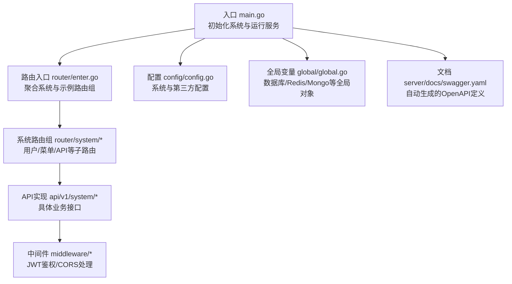
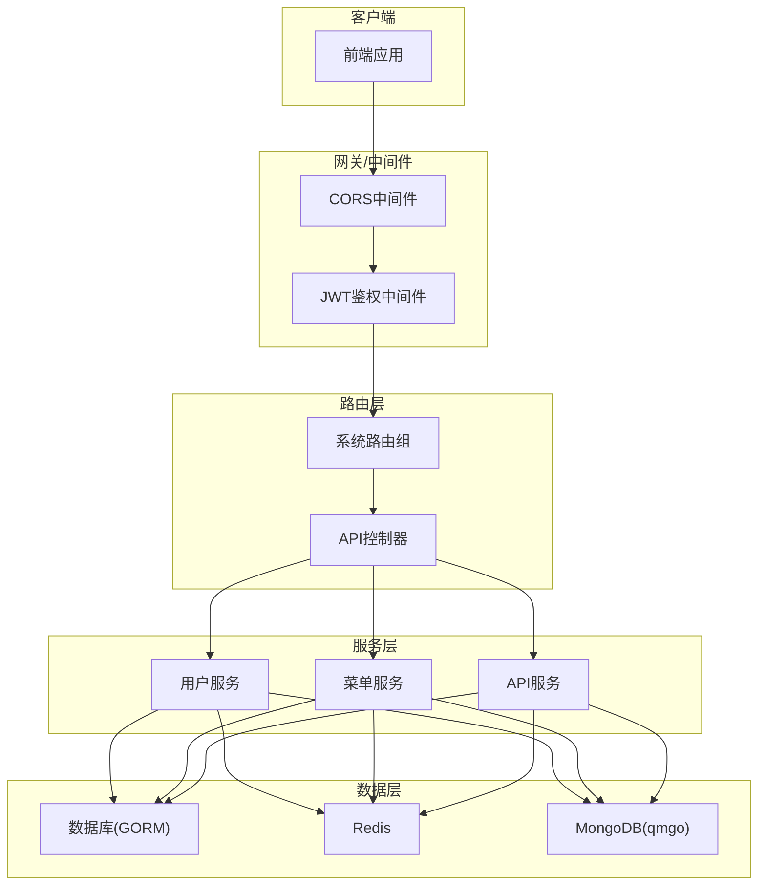
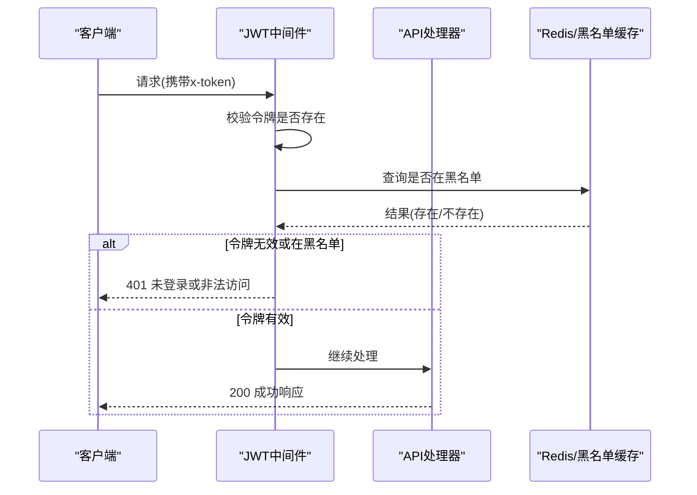
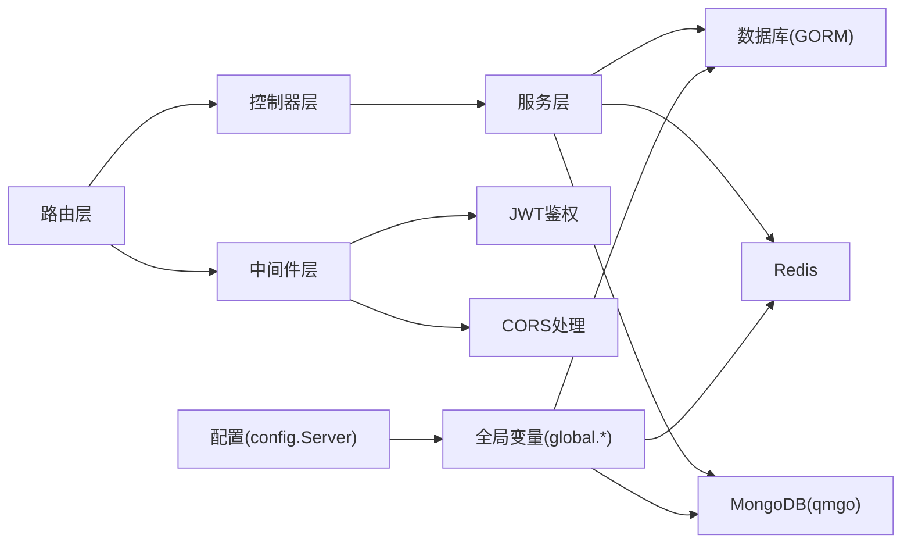

# API 接口参考

<cite>
**本文引用的文件**
- [server/main.go](file://server/main.go)
- [server/docs/swagger.yaml](file://server/docs/swagger.yaml)
- [server/router/enter.go](file://server/router/enter.go)
- [server/router/system/enter.go](file://server/router/system/enter.go)
- [server/router/system/sys_user.go](file://server/router/system/sys_user.go)
- [server/router/system/sys_api.go](file://server/router/system/sys_api.go)
- [server/router/system/sys_menu.go](file://server/router/system/sys_menu.go)
- [server/router/system/sys_auto_code.go](file://server/router/system/sys_auto_code.go)
- [server/router/example/exa_file_upload_and_download.go](file://server/router/example/exa_file_upload_and_download.go)
- [server/api/v1/system/sys_user.go](file://server/api/v1/system/sys_user.go)
- [server/api/v1/system/sys_api.go](file://server/api/v1/system/sys_api.go)
- [server/api/v1/system/sys_menu.go](file://server/api/v1/system/sys_menu.go)
- [server/api/v1/system/sys_auto_code.go](file://server/api/v1/system/sys_auto_code.go)
- [server/api/v1/example/exa_file_upload_download.go](file://server/api/v1/example/exa_file_upload_download.go)
- [server/middleware/jwt.go](file://server/middleware/jwt.go)
- [server/middleware/cors.go](file://server/middleware/cors.go)
- [server/config/config.go](file://server/config/config.go)
- [server/global/global.go](file://server/global/global.go)
- [repowiki\zh\content\API文档\API文档.md](file://repowiki/zh/content/API文档/API文档.md)
- [repowiki\zh\content\API文档\系统管理API.md](file://repowiki/zh/content/API文档/系统管理API.md)
- [repowiki\zh\content\API文档\认证授权API.md](file://repowiki/zh/content/API文档/认证授权API.md)
- [repowiki\zh\content\API文档\文件存储API.md](file://repowiki/zh/content/API文档/文件存储API.md)
- [repowiki\zh\content\API文档\测试管理API.md](file://repowiki/zh/content/API文档/测试管理API.md)
- [repowiki\zh\content\API文档\插件MCP API.md](file://repowiki/zh/content/API文档/插件MCP API.md)
</cite>

## 目录
1. [简介](#简介)
2. [项目结构](#项目结构)
3. [核心组件](#核心组件)
4. [架构总览](#架构总览)
5. [详细组件分析](#详细组件分析)
6. [依赖分析](#依赖分析)
7. [性能考虑](#性能考虑)
8. [故障排查指南](#故障排查指南)
9. [结论](#结论)
10. [附录](#附录)

## 简介
本文件为测试管理平台的完整API接口参考文档，基于Swagger自动化文档生成系统，覆盖系统管理、认证授权、文件存储、测试管理、插件管理等主要功能模块。文档按功能模块组织，为每个API提供HTTP方法、URL路径、请求参数、响应格式与错误码说明，并包含认证方法、请求示例与响应示例。同时提供API版本管理、速率限制与安全考虑说明，以及API测试工具与调试方法。

## 项目结构
后端采用Go语言与Gin框架，通过Swag注解自动生成OpenAPI文档；路由按模块化组织，系统相关接口集中在system路由组下，配合中间件实现JWT鉴权与跨域处理。

**图表来源**
- [server/main.go:30-35](file://server/main.go#L30-L35)
- [server/router/enter.go:8-13](file://server/router/enter.go#L8-L13)
- [server/router/system/enter.go:5-27](file://server/router/system/enter.go#L5-L27)

**章节来源**
- [server/main.go:16-35](file://server/main.go#L16-L35)
- [server/router/enter.go:1-14](file://server/router/enter.go#L1-L14)
- [server/router/system/enter.go:1-54](file://server/router/system/enter.go#L1-L54)

## 核心组件
- 文档生成与入口
  - Swagger注解与入口文件：通过入口文件的注解生成OpenAPI文档，定义标题、版本、安全定义与基础路径。
  - 文档输出：自动生成swagger.yaml与swagger.json，供前端与工具使用。
- 路由与控制器
  - 路由分组：系统路由组包含用户、菜单、API等子路由，统一挂载操作记录中间件。
  - 控制器：各模块API实现位于api/v1/system目录，遵循Swagger注解规范。
- 中间件
  - JWT鉴权：从请求头读取令牌，校验黑名单与过期，必要时刷新令牌。
  - CORS：支持宽松放行与严格白名单两种模式，处理预检请求。
- 配置与全局
  - 配置结构：集中管理JWT、日志、Redis、Mongo、数据库、跨域等配置。
  - 全局对象：数据库、Redis、Mongo、配置、日志等全局变量。

**章节来源**
- [server/main.go:23-29](file://server/main.go#L23-L29)
- [server/docs/swagger.yaml:1-800](file://server/docs/swagger.yaml#L1-L800)
- [server/middleware/jwt.go:16-77](file://server/middleware/jwt.go#L16-L77)
- [server/middleware/cors.go:10-62](file://server/middleware/cors.go#L10-L62)
- [server/config/config.go:3-40](file://server/config/config.go#L3-L40)
- [server/global/global.go:25-42](file://server/global/global.go#L25-L42)

## 架构总览
系统采用"路由-控制器-中间件-服务-模型"的分层架构，Swagger注解贯穿接口定义，确保文档与代码一致。

**图表来源**
- [server/router/system/sys_user.go:10-27](file://server/router/system/sys_user.go#L10-L27)
- [server/router/system/sys_menu.go:10-28](file://server/router/system/sys_menu.go#L10-L28)
- [server/router/system/sys_api.go:10-34](file://server/router/system/sys_api.go#L10-L34)
- [server/middleware/jwt.go:16-77](file://server/middleware/jwt.go#L16-L77)
- [server/middleware/cors.go:10-62](file://server/middleware/cors.go#L10-L62)
- [server/global/global.go:25-42](file://server/global/global.go#L25-L42)

## 详细组件分析

### 认证与安全
- 认证方式
  - API-Key（Header）：通过请求头携带令牌，键名为"x-token"。
  - JWT：中间件负责解析、校验与续签。
- 跨域策略
  - 宽松放行：允许任意Origin、Header与方法。
  - 严格白名单：仅对白名单中的Origin放行，非GET健康检查接口拒绝。
- 速率限制
  - 通过配置中的IP限制参数实现限流（系统配置字段包含计数与时间窗口）。

**图表来源**
- [server/middleware/jwt.go:16-77](file://server/middleware/jwt.go#L16-L77)
- [server/main.go:26-28](file://server/main.go#L26-L28)

**章节来源**
- [server/middleware/jwt.go:16-77](file://server/middleware/jwt.go#L16-L77)
- [server/middleware/cors.go:10-62](file://server/middleware/cors.go#L10-L62)
- [server/config/config.go:603-632](file://server/config/config.go#L603-L632)

### 用户管理接口组（SysUser）
- 登录
  - 方法与路径：POST /base/login
  - 请求体：用户名、密码、验证码
  - 成功响应：用户信息、JWT令牌、过期时间戳
  - 错误码：400 参数错误；401 用户名或密码错误；403 验证码错误或用户被禁止登录
- 修改密码
  - 方法与路径：POST /user/changePassword
  - 请求体：旧密码、新密码
  - 成功响应：修改成功提示
  - 错误码：400 参数错误；401 旧密码不正确
- 注册账号
  - 方法与路径：POST /user/admin_register
  - 请求体：用户名、昵称、密码、角色ID等
  - 成功响应：返回用户信息
  - 错误码：400 参数错误；500 注册失败
- 获取用户列表
  - 方法与路径：POST /user/getUserList
  - 请求体：分页参数
  - 成功响应：分页结果（列表、总数、页码、每页数量）
  - 错误码：400 参数错误
- 设置用户权限/权限组
  - 方法与路径：POST /user/setUserAuthority | /user/setUserAuthorities
  - 请求体：目标用户与角色ID
  - 成功响应：修改成功
  - 错误码：400 参数错误；401 权限不足
- 删除用户
  - 方法与路径：DELETE /user/deleteUser
  - 请求体：用户ID
  - 成功响应：删除成功
  - 错误码：400 参数错误；403 无法删除自己
- 设置用户信息/自身信息
  - 方法与路径：PUT /user/setUserInfo | /user/setSelfInfo
  - 请求体：用户信息（昵称、头像、手机、邮箱、启用状态等）
  - 成功响应：设置成功
  - 错误码：400 参数错误；500 设置失败
- 设置用户界面配置
  - 方法与路径：PUT /user/SetSelfSetting
  - 请求体：配置键值对
  - 成功响应：设置成功
  - 错误码：400 参数错误；500 设置失败
- 获取用户信息
  - 方法与路径：GET /user/getUserInfo
  - 成功响应：用户信息
  - 错误码：500 获取失败

**章节来源**
- [server/api/v1/system/sys_user.go:20-99](file://server/api/v1/system/sys_user.go#L20-L99)
- [server/api/v1/system/sys_user.go:163-196](file://server/api/v1/system/sys_user.go#L163-L196)
- [server/api/v1/system/sys_user.go:198-227](file://server/api/v1/system/sys_user.go#L198-L227)
- [server/api/v1/system/sys_user.go:229-262](file://server/api/v1/system/sys_user.go#L229-L262)
- [server/api/v1/system/sys_user.go:264-303](file://server/api/v1/system/sys_user.go#L264-L303)
- [server/api/v1/system/sys_user.go:305-329](file://server/api/v1/system/sys_user.go#L305-L329)
- [server/api/v1/system/sys_user.go:331-364](file://server/api/v1/system/sys_user.go#L331-L364)
- [server/api/v1/system/sys_user.go:366-412](file://server/api/v1/system/sys_user.go#L366-L412)
- [server/api/v1/system/sys_user.go:414-447](file://server/api/v1/system/sys_user.go#L414-L447)
- [server/api/v1/system/sys_user.go:449-473](file://server/api/v1/system/sys_user.go#L449-L473)
- [server/api/v1/system/sys_user.go:475-492](file://server/api/v1/system/sys_user.go#L475-L492)
- [server/api/v1/system/sys_user.go:494-516](file://server/api/v1/system/sys_user.go#L494-L516)

### 菜单管理接口组（AuthorityMenu/Menu）
- 获取用户动态路由
  - 方法与路径：POST /menu/getMenu
  - 成功响应：菜单树
  - 错误码：500 获取失败
- 获取基础菜单树
  - 方法与路径：POST /menu/getBaseMenuTree
  - 成功响应：基础菜单列表
  - 错误码：500 获取失败
- 新增/删除/更新菜单
  - 方法与路径：POST /menu/addBaseMenu | /menu/deleteBaseMenu | /menu/updateBaseMenu
  - 成功响应：操作成功
  - 错误码：400 参数错误；500 操作失败
- 菜单授权
  - 方法与路径：POST /menu/addMenuAuthority | /menu/setMenuRoles
  - 成功响应：授权成功
  - 错误码：400 参数错误；500 授权失败
- 获取菜单授权列表
  - 方法与路径：GET /menu/getMenuRoles
  - 查询参数：菜单ID
  - 成功响应：角色ID列表
  - 错误码：400 参数为空；500 获取失败
- 获取菜单列表
  - 方法与路径：POST /menu/getMenuList
  - 成功响应：分页结果
  - 错误码：500 获取失败
- 根据ID获取菜单
  - 方法与路径：POST /menu/getBaseMenuById
  - 请求体：菜单ID
  - 成功响应：菜单详情
  - 错误码：400 参数错误；500 获取失败

**章节来源**
- [server/api/v1/system/sys_menu.go:18-37](file://server/api/v1/system/sys_menu.go#L18-L37)
- [server/api/v1/system/sys_menu.go:39-56](file://server/api/v1/system/sys_menu.go#L39-L56)
- [server/api/v1/system/sys_menu.go:58-85](file://server/api/v1/system/sys_menu.go#L58-L85)
- [server/api/v1/system/sys_menu.go:87-115](file://server/api/v1/system/sys_menu.go#L87-L115)
- [server/api/v1/system/sys_menu.go:117-150](file://server/api/v1/system/sys_menu.go#L117-L150)
- [server/api/v1/system/sys_menu.go:152-180](file://server/api/v1/system/sys_menu.go#L152-L180)
- [server/api/v1/system/sys_menu.go:182-215](file://server/api/v1/system/sys_menu.go#L182-L215)
- [server/api/v1/system/sys_menu.go:217-245](file://server/api/v1/system/sys_menu.go#L217-L245)
- [server/api/v1/system/sys_menu.go:247-288](file://server/api/v1/system/sys_menu.go#L247-L288)
- [server/api/v1/system/sys_menu.go:290-315](file://server/api/v1/system/sys_menu.go#L290-L315)
- [server/api/v1/system/sys_menu.go:317-336](file://server/api/v1/system/sys_menu.go#L317-L336)

### API管理接口组（SysApi）
- 同步API
  - 方法与路径：GET /api/syncApi
  - 成功响应：新增、删除、忽略的API集合
  - 错误码：500 同步失败
- 获取API分组
  - 方法与路径：GET /api/getApiGroups
  - 成功响应：分组与映射
  - 错误码：500 获取失败
- 忽略API
  - 方法与路径：POST /api/ignoreApi
  - 成功响应：忽略成功
  - 错误码：500 忽略失败
- 确认同步API
  - 方法与路径：POST /api/enterSyncApi
  - 成功响应：确认成功
  - 错误码：500 确认失败
- 创建/删除/更新API
  - 方法与路径：POST /api/createApi | /api/deleteApi | /api/updateApi
  - 成功响应：操作成功
  - 错误码：400 参数错误；500 操作失败
- 获取API列表
  - 方法与路径：POST /api/getApiList
  - 成功响应：分页结果
  - 错误码：400 参数错误；500 获取失败
- 获取单条API详情
  - 方法与路径：POST /api/getApiById
  - 成功响应：API详情
  - 错误码：400 参数错误；500 获取失败
- 获取所有API
  - 方法与路径：POST /api/getAllApis
  - 成功响应：API列表
  - 错误码：500 获取失败
- 删除多个API
  - 方法与路径：DELETE /api/deleteApisByIds
  - 成功响应：删除成功
  - 错误码：400 参数错误；500 删除失败
- 刷新Casbin权限
  - 方法与路径：GET /api/freshCasbin
  - 成功响应：刷新成功
  - 错误码：500 刷新失败
- 获取API关联角色ID列表
  - 方法与路径：GET /api/getApiRoles
  - 查询参数：path、method
  - 成功响应：角色ID列表
  - 错误码：400 参数为空；500 获取失败
- 全量覆盖API关联角色
  - 方法与路径：POST /api/setApiRoles
  - 成功响应：设置成功
  - 错误码：400 参数为空；500 设置失败

**章节来源**
- [server/api/v1/system/sys_api.go:48-68](file://server/api/v1/system/sys_api.go#L48-L68)
- [server/api/v1/system/sys_api.go:70-89](file://server/api/v1/system/sys_api.go#L70-L89)
- [server/api/v1/system/sys_api.go:91-113](file://server/api/v1/system/sys_api.go#L91-L113)
- [server/api/v1/system/sys_api.go:115-137](file://server/api/v1/system/sys_api.go#L115-L137)
- [server/api/v1/system/sys_api.go:18-46](file://server/api/v1/system/sys_api.go#L18-L46)
- [server/api/v1/system/sys_api.go:139-167](file://server/api/v1/system/sys_api.go#L139-L167)
- [server/api/v1/system/sys_api.go:204-232](file://server/api/v1/system/sys_api.go#L204-L232)
- [server/api/v1/system/sys_api.go:264-281](file://server/api/v1/system/sys_api.go#L264-L281)
- [server/api/v1/system/sys_api.go:283-306](file://server/api/v1/system/sys_api.go#L283-L306)
- [server/api/v1/system/sys_api.go:308-323](file://server/api/v1/system/sys_api.go#L308-L323)
- [server/api/v1/system/sys_api.go:325-352](file://server/api/v1/system/sys_api.go#L325-L352)
- [server/api/v1/system/sys_api.go:354-381](file://server/api/v1/system/sys_api.go#L354-L381)

### 文件存储接口组（FileUploadAndDownload）
- 上传文件
  - 方法与路径：POST /fileUploadAndDownload/upload
  - 请求体：multipart/form-data，字段file为文件；可选查询参数noSave控制是否入库；可选表单字段classId用于分类
  - 成功响应：包含文件信息（名称、URL、Key、标签、分类ID）
  - 错误码：400 参数错误；500 上传失败
- 编辑文件名/备注
  - 方法与路径：POST /fileUploadAndDownload/editFileName
  - 请求体：文件记录ID与新名称
  - 成功响应：编辑成功
  - 错误码：400 参数错误；500 编辑失败
- 删除文件
  - 方法与路径：POST /fileUploadAndDownload/deleteFile
  - 请求体：文件记录ID
  - 成功响应：删除成功
  - 错误码：400 参数错误；500 删除失败
- 分页文件列表
  - 方法与路径：POST /fileUploadAndDownload/getFileList
  - 请求体：分页参数（页码、每页大小、分类ID）
  - 成功响应：分页结果（列表、总数、页码、每页数量）
  - 错误码：400 参数错误；500 获取失败
- 断点续传
  - 方法与路径：POST /fileUploadAndDownload/breakpointContinue
  - 请求体：分片参数（fileMd5、fileName、chunkMd5、chunkNumber、chunkTotal、file）
  - 成功响应：分片上传成功
  - 错误码：400 参数错误；500 上传失败
- 查询文件
  - 方法与路径：GET /fileUploadAndDownload/findFile
  - 查询参数：fileMd5、fileName、chunkTotal
  - 成功响应：文件状态
  - 错误码：400 参数错误；500 查询失败
- 完成合并
  - 方法与路径：POST /fileUploadAndDownload/breakpointContinueFinish
  - 请求体：fileMd5、fileName
  - 成功响应：合并完成
  - 错误码：400 参数错误；500 合并失败
- 删除切片
  - 方法与路径：POST /fileUploadAndDownload/removeChunk
  - 请求体：文件路径与MD5
  - 成功响应：切片删除成功
  - 错误码：400 参数错误；500 删除失败
- 导入URL
  - 方法与路径：POST /fileUploadAndDownload/importURL
  - 请求体：文件URL数组
  - 成功响应：导入成功
  - 错误码：400 参数错误；500 导入失败

**章节来源**
- [server/router/example/exa_file_upload_and_download.go:9-22](file://server/router/example/exa_file_upload_and_download.go#L9-L22)
- [server/api/v1/example/exa_file_upload_download.go:16-136](file://server/api/v1/example/exa_file_upload_download.go#L16-L136)

### 自动代码与插件管理接口组（AutoCode）
- 数据库发现
  - 方法与路径：GET /autoCode/getDB
  - 查询参数：businessDB（业务库别名）
  - 成功响应：数据库列表
  - 错误码：500 获取失败
- 表查询
  - 方法与路径：GET /autoCode/getTables
  - 查询参数：dbName（数据库名）、businessDB（业务库别名）
  - 成功响应：表列表
  - 错误码：500 获取失败
- 列查询
  - 方法与路径：GET /autoCode/getColumn
  - 查询参数：dbName、tableName、businessDB
  - 成功响应：列列表
  - 错误码：500 获取失败
- 模板预览
  - 方法与路径：POST /autoCode/preview
  - 请求体：模板参数
  - 成功响应：预览结果
  - 错误码：500 预览失败
- 模板生成
  - 方法与路径：POST /autoCode/createTemp
  - 请求体：模板参数
  - 成功响应：生成成功
  - 错误码：500 生成失败
- 添加函数
  - 方法与路径：POST /autoCode/addFunc
  - 请求体：函数定义
  - 成功响应：添加成功
  - 错误码：500 添加失败
- MCP工作流控制
  - 方法与路径：POST /autoCode/mcp | /autoCode/mcpStatus | /autoCode/mcpStart | /autoCode/mcpStop | /autoCode/mcpList | /autoCode/mcpRoutes | /autoCode/mcpTest
  - 请求体：工作流参数
  - 成功响应：操作成功
  - 错误码：500 操作失败
- 包管理
  - 方法与路径：POST /autoCode/getPackage | /autoCode/delPackage | /autoCode/createPackage
  - 请求体：包参数
  - 成功响应：操作成功
  - 错误码：500 操作失败
- AI工作流会话
  - 方法与路径：POST /autoCode/saveAIWorkflowSession | /autoCode/getAIWorkflowSessionList | /autoCode/getAIWorkflowSessionDetail | /autoCode/deleteAIWorkflowSession | /autoCode/dumpAIWorkflowMarkdown
  - 请求体：会话参数
  - 成功响应：操作成功
  - 错误码：500 操作失败
- 模板管理
  - 方法与路径：GET /autoCode/getTemplates
  - 成功响应：模板列表
  - 错误码：500 获取失败
- 插件管理
  - 方法与路径：POST /autoCode/pubPlug | /autoCode/installPlugin | /autoCode/removePlugin | GET /autoCode/getPluginList
  - 请求体：插件参数
  - 成功响应：操作成功
  - 错误码：500 操作失败
- LLM辅助
  - 方法与路径：POST /autoCode/llmAuto | /autoCode/llmAutoSSE
  - 请求体：LLM参数
  - 成功响应：生成成功
  - 错误码：500 生成失败
- 初始化菜单/API/字典
  - 方法与路径：POST /autoCode/initMenu | /autoCode/initAPI | /autoCode/initDictionary
  - 请求体：初始化参数
  - 成功响应：初始化成功
  - 错误码：500 初始化失败

**章节来源**
- [server/router/system/sys_auto_code.go:7-55](file://server/router/system/sys_auto_code.go#L7-L55)
- [server/api/v1/system/sys_auto_code.go:20-220](file://server/api/v1/system/sys_auto_code.go#L20-L220)

### 路由与控制器映射
- 用户路由
  - 路由组：user
  - 关键接口：注册、修改密码、设置权限、删除用户、设置信息、获取列表、获取自身信息等
- 菜单路由
  - 路由组：menu
  - 关键接口：获取菜单树、新增/删除/更新菜单、菜单授权、获取菜单列表、按ID查询菜单等
- API路由
  - 路由组：api
  - 关键接口：同步API、忽略API、创建/删除/更新API、获取列表/详情、刷新Casbin、获取/设置API角色等
- 文件上传路由
  - 路由组：fileUploadAndDownload
  - 关键接口：上传、删除、重命名、分页列表、断点续传、导入URL等
- 自动代码路由
  - 路由组：autoCode
  - 关键接口：数据库发现、表/列查询、模板预览/生成、MCP工作流、包管理、AI会话、插件管理、LLM辅助、初始化等

**章节来源**
- [server/router/system/sys_user.go:10-28](file://server/router/system/sys_user.go#L10-L28)
- [server/router/system/sys_menu.go:10-28](file://server/router/system/sys_menu.go#L10-L28)
- [server/router/system/sys_api.go:10-35](file://server/router/system/sys_api.go#L10-L35)
- [server/router/example/exa_file_upload_and_download.go:9-22](file://server/router/example/exa_file_upload_and_download.go#L9-L22)
- [server/router/system/sys_auto_code.go:7-55](file://server/router/system/sys_auto_code.go#L7-L55)

## 依赖分析
- 组件耦合
  - 路由层依赖控制器层；控制器层依赖服务层；服务层依赖数据层与缓存层。
  - 中间件独立于业务逻辑，提供横切能力（鉴权、跨域、日志等）。
- 外部依赖
  - 数据库：GORM（MySQL/PostgreSQL/SQL Server/Oracle/SQLite）
  - 缓存：Redis（单实例/集群）
  - 文档：Swag（基于注解生成OpenAPI）
  - 日志：Zap
  - MongoDB：qmgo
- 配置与全局
  - 配置集中于config.Server，全局变量集中于global包，便于跨模块共享。

**图表来源**
- [server/router/system/enter.go:5-27](file://server/router/system/enter.go#L5-L27)
- [server/global/global.go:25-42](file://server/global/global.go#L25-L42)
- [server/config/config.go:3-40](file://server/config/config.go#L3-L40)

**章节来源**
- [server/global/global.go:25-42](file://server/global/global.go#L25-L42)
- [server/config/config.go:3-40](file://server/config/config.go#L3-L40)

## 性能考虑
- JWT续签与缓存
  - 在令牌即将过期时自动续签并刷新缓存，减少频繁登录带来的压力。
- 黑名单与并发控制
  - 通过黑名单与并发控制（singleflight）降低重复请求与竞态风险。
- 数据库连接池
  - 通过配置调整最大空闲连接与最大打开连接数，提升数据库吞吐。
- Redis与Mongo
  - 合理设置连接池与超时参数，避免阻塞与资源耗尽。

## 故障排查指南
- 401 未登录或非法访问
  - 检查请求头是否包含有效的x-token；确认令牌未被加入黑名单；核对过期时间。
- 403 权限不足
  - 检查用户角色与API/菜单授权；刷新Casbin策略；确认角色ID正确。
- 500 服务器内部错误
  - 查看日志定位具体错误；检查数据库连接、Redis可用性与Mongo配置。
- CORS跨域问题
  - 若使用严格白名单模式，确认Origin在白名单中；预检请求需放行。

**章节来源**
- [server/middleware/jwt.go:16-77](file://server/middleware/jwt.go#L16-L77)
- [server/middleware/cors.go:30-62](file://server/middleware/cors.go#L30-L62)

## 结论
本API文档基于Swagger注解与路由分层设计，覆盖用户管理、菜单管理、API管理、文件存储、测试管理与插件管理六大核心模块。通过JWT鉴权与CORS中间件保障安全性与跨域兼容，结合配置化的系统参数实现灵活部署。建议在生产环境中启用严格白名单与合理的速率限制策略，并定期刷新Casbin权限与维护文档一致性。

## 附录
- API版本管理
  - 版本号在入口注解中定义，可通过升级版本号与迁移策略管理接口演进。
- 速率限制
  - 通过系统配置中的IP限制参数实现限流，可结合Redis实现更细粒度的限流策略。
- 安全考虑
  - 强制使用HTTPS；最小权限原则；敏感信息脱敏；定期轮换密钥与令牌。
- API测试工具与调试
  - 使用Swagger UI或Postman导入OpenAPI文档进行接口测试；结合日志与中间件断点定位问题；对鉴权接口优先验证JWT有效性与权限矩阵。

**章节来源**
- [server/main.go:23-29](file://server/main.go#L23-L29)
- [server/config/config.go:603-632](file://server/config/config.go#L603-L632)
- [server/docs/swagger.yaml:1-800](file://server/docs/swagger.yaml#L1-L800)