# 插件 MCP API

<cite>
**本文引用的文件**
- [server/mcp/server.go](file://server/mcp/server.go)
- [server/mcp/client/client.go](file://server/mcp/client/client.go)
- [server/cmd/mcp/main.go](file://server/cmd/mcp/main.go)
- [server/config/mcp.go](file://server/config/mcp.go)
- [server/mcp/context.go](file://server/mcp/context.go)
- [server/mcp/enter.go](file://server/mcp/enter.go)
- [server/mcp/result.go](file://server/mcp/result.go)
- [server/mcp/http_client.go](file://server/mcp/http_client.go)
- [server/mcp/api_creator.go](file://server/mcp/api_creator.go)
- [server/mcp/api_lister.go](file://server/mcp/api_lister.go)
- [server/mcp/gva_analyze.go](file://server/mcp/gva_analyze.go)
- [server/mcp/gva_execute.go](file://server/mcp/gva_execute.go)
- [server/mcp/dictionary_generator.go](file://server/mcp/dictionary_generator.go)
- [server/mcp/menu_creator.go](file://server/mcp/menu_creator.go)
</cite>

## 目录
1. [简介](#简介)
2. [项目结构](#项目结构)
3. [核心组件](#核心组件)
4. [架构总览](#架构总览)
5. [详细组件分析](#详细组件分析)
6. [依赖分析](#依赖分析)
7. [性能考量](#性能考量)
8. [故障排查指南](#故障排查指南)
9. [结论](#结论)
10. [附录](#附录)

## 简介
本文件面向插件开发者与系统集成者，系统性梳理基于 MCP（Model Context Protocol）协议的插件系统接口规范与实现细节。内容覆盖插件通信、工具调用、结果处理、服务器启动与连接管理、消息协议、工具注册与参数传递、执行流程、结果返回、上下文管理、HTTP 客户端封装、与主系统的集成方式（发现、生命周期、错误处理）以及调试、性能与安全最佳实践。

## 项目结构
MCP 插件系统位于后端 server/mcp 目录，包含：
- 服务器侧：MCP 服务器初始化、HTTP 服务、工具注册与处理
- 客户端侧：MCP 客户端封装，负责连接、初始化握手与认证头透传
- 工具实现：API 创建、API 列表、GVA 分析、GVA 执行、字典生成、菜单创建等
- 配置与上下文：MCP 配置结构、认证头提取与上下文注入
- 上游 HTTP 适配：统一的上游请求封装与错误处理

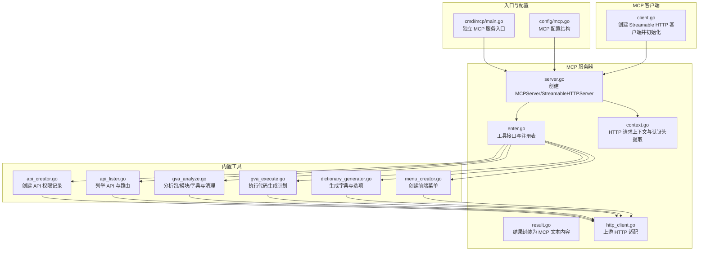

**图表来源**
- [server/mcp/server.go:1-53](file://server/mcp/server.go#L1-L53)
- [server/mcp/client/client.go:1-45](file://server/mcp/client/client.go#L1-L45)
- [server/cmd/mcp/main.go:1-36](file://server/cmd/mcp/main.go#L1-L36)
- [server/config/mcp.go:1-19](file://server/config/mcp.go#L1-L19)
- [server/mcp/context.go:1-67](file://server/mcp/context.go#L1-L67)
- [server/mcp/enter.go:1-32](file://server/mcp/enter.go#L1-L32)
- [server/mcp/result.go:1-30](file://server/mcp/result.go#L1-L30)
- [server/mcp/http_client.go:1-154](file://server/mcp/http_client.go#L1-L154)
- [server/mcp/api_creator.go:1-160](file://server/mcp/api_creator.go#L1-L160)
- [server/mcp/api_lister.go:1-96](file://server/mcp/api_lister.go#L1-L96)
- [server/mcp/gva_analyze.go:1-495](file://server/mcp/gva_analyze.go#L1-L495)
- [server/mcp/gva_execute.go:1-751](file://server/mcp/gva_execute.go#L1-L751)
- [server/mcp/dictionary_generator.go:1-175](file://server/mcp/dictionary_generator.go#L1-L175)
- [server/mcp/menu_creator.go:1-229](file://server/mcp/menu_creator.go#L1-L229)

**章节来源**
- [server/mcp/server.go:1-53](file://server/mcp/server.go#L1-L53)
- [server/mcp/client/client.go:1-45](file://server/mcp/client/client.go#L1-L45)
- [server/cmd/mcp/main.go:1-36](file://server/cmd/mcp/main.go#L1-L36)
- [server/config/mcp.go:1-19](file://server/config/mcp.go#L1-L19)

## 核心组件
- MCP 服务器与 HTTP 服务
  - 创建并注册所有工具，提供流式 HTTP 服务端点，支持健康检查端点
  - 支持通过配置设置服务路径、监听端口、上游基地址等
- 工具接口与注册表
  - 定义 McpTool 接口，统一 Handle 与 New 方法
  - 工具注册表按名称去重，集中注册到 MCPServer
- 上下文与认证
  - 从 HTTP 请求头提取认证令牌，注入到 context，供上游请求透传
  - 支持多种候选头部名称与 Authorization Bearer 规范
- 上游 HTTP 客户端
  - 统一封装 GET/POST/DELETE 请求，自动拼接上游地址、设置超时、透传认证头
  - 标准化响应体结构，处理业务码与状态码错误
- 工具实现
  - API 创建：支持单条或多条 API 创建，返回汇总结果
  - API 列表：返回数据库 API 与路由 API 两套清单
  - GVA 分析：扫描包/模块/字典，清理空包，返回分析结果
  - GVA 执行：按执行计划直接生成代码，支持包/模块/字典创建
  - 字典生成：根据选项自动创建字典与详情
  - 菜单创建：创建前端菜单与按钮、参数等元数据

**章节来源**
- [server/mcp/enter.go:1-32](file://server/mcp/enter.go#L1-L32)
- [server/mcp/context.go:1-67](file://server/mcp/context.go#L1-L67)
- [server/mcp/http_client.go:1-154](file://server/mcp/http_client.go#L1-L154)
- [server/mcp/api_creator.go:1-160](file://server/mcp/api_creator.go#L1-L160)
- [server/mcp/api_lister.go:1-96](file://server/mcp/api_lister.go#L1-L96)
- [server/mcp/gva_analyze.go:1-495](file://server/mcp/gva_analyze.go#L1-L495)
- [server/mcp/gva_execute.go:1-751](file://server/mcp/gva_execute.go#L1-L751)
- [server/mcp/dictionary_generator.go:1-175](file://server/mcp/dictionary_generator.go#L1-L175)
- [server/mcp/menu_creator.go:1-229](file://server/mcp/menu_creator.go#L1-L229)

## 架构总览
MCP 服务器作为独立进程或嵌入式组件运行，对外提供标准 MCP 流式 HTTP 端点；客户端通过 Streamable HTTP 客户端与之建立连接并完成初始化握手；工具通过统一接口注册，接收调用请求后调用上游系统接口完成业务操作，并以 MCP 文本内容返回结果。

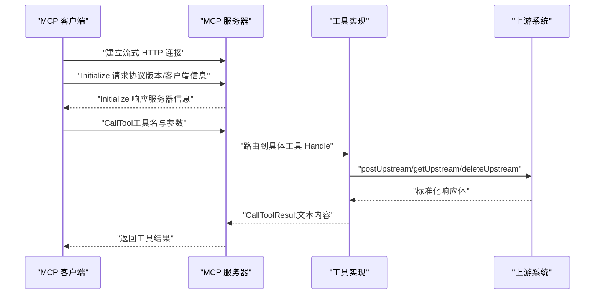

**图表来源**
- [server/mcp/client/client.go:1-45](file://server/mcp/client/client.go#L1-L45)
- [server/mcp/server.go:1-53](file://server/mcp/server.go#L1-L53)
- [server/mcp/http_client.go:1-154](file://server/mcp/http_client.go#L1-L154)
- [server/mcp/enter.go:1-32](file://server/mcp/enter.go#L1-L32)

## 详细组件分析

### 服务器与 HTTP 服务
- 服务器创建
  - 从全局配置读取 MCP 名称与版本，构造 MCPServer
  - 注册所有已注册工具
- 流式 HTTP 服务器
  - 默认路径“/mcp”，可配置；自动补全前缀斜杠
  - 绑定处理器到指定路径，提供“/health”健康检查
  - 使用 WithHTTPRequestContext 注入认证令牌上下文
- 独立入口
  - 读取独立配置，初始化日志，启动 HTTP 服务监听

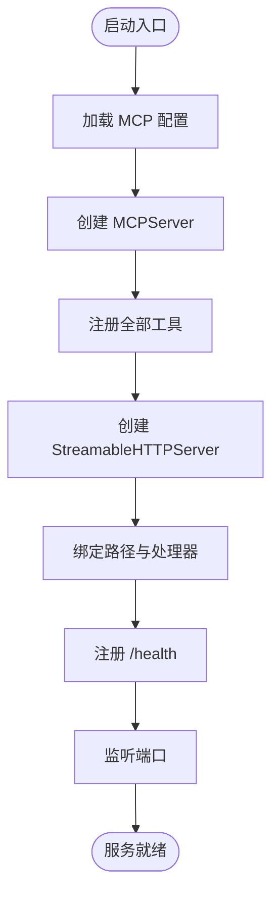

**图表来源**
- [server/mcp/server.go:1-53](file://server/mcp/server.go#L1-L53)
- [server/cmd/mcp/main.go:1-36](file://server/cmd/mcp/main.go#L1-L36)

**章节来源**
- [server/mcp/server.go:1-53](file://server/mcp/server.go#L1-L53)
- [server/cmd/mcp/main.go:1-36](file://server/cmd/mcp/main.go#L1-L36)

### 客户端与初始化握手
- 客户端创建
  - 支持设置额外 HTTP 头部（如认证）
  - 通过 Streamable HTTP 客户端启动
- 初始化握手
  - 发送 Initialize 请求，声明协议版本与客户端信息
  - 校验服务器名称一致性
  - 成功后可用于 CallTool 调用

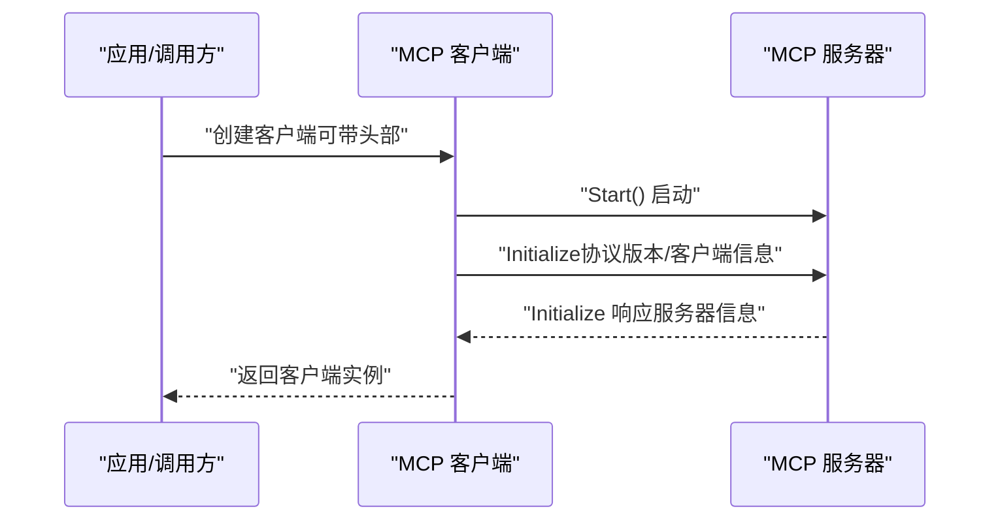

**图表来源**
- [server/mcp/client/client.go:1-45](file://server/mcp/client/client.go#L1-L45)

**章节来源**
- [server/mcp/client/client.go:1-45](file://server/mcp/client/client.go#L1-L45)

### 工具接口与注册机制
- 接口定义
  - Handle(ctx, request) -> CallToolResult,error
  - New() -> Tool（含描述、参数 Schema）
- 注册表
  - 工具在 init 中调用 RegisterTool
  - 启动时统一注册到 MCPServer

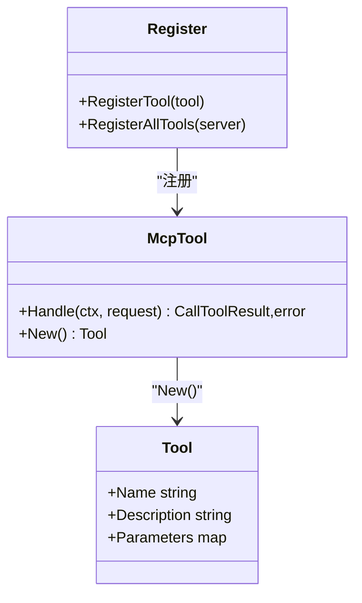

**图表来源**
- [server/mcp/enter.go:1-32](file://server/mcp/enter.go#L1-L32)

**章节来源**
- [server/mcp/enter.go:1-32](file://server/mcp/enter.go#L1-L32)

### 上下文与认证头
- 上下文注入
  - 从 HTTP 请求头提取认证令牌，注入到 context
- 认证头候选
  - 支持配置项与常见头部（x-token、token、authorization）
  - Authorization 头自动去除 Bearer 前缀
- 上游请求透传
  - 上游 HTTP 客户端从 context 读取令牌并设置到请求头

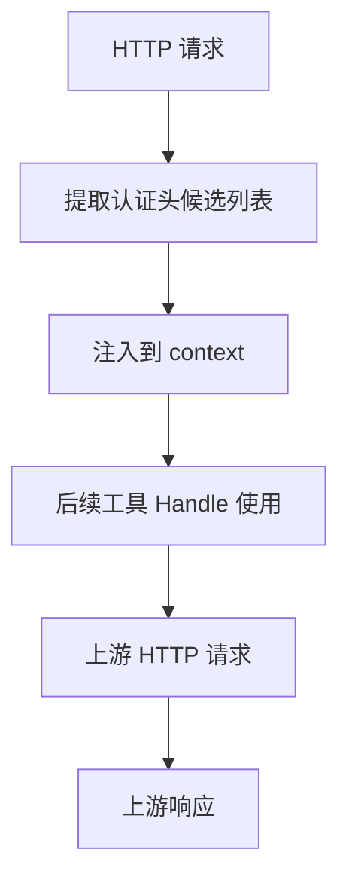

**图表来源**
- [server/mcp/context.go:1-67](file://server/mcp/context.go#L1-L67)
- [server/mcp/http_client.go:1-154](file://server/mcp/http_client.go#L1-L154)

**章节来源**
- [server/mcp/context.go:1-67](file://server/mcp/context.go#L1-L67)
- [server/mcp/http_client.go:1-154](file://server/mcp/http_client.go#L1-L154)

### 上游 HTTP 客户端封装
- 统一方法
  - getUpstream/postUpstream/deleteUpstream/doUpstream
- 地址解析
  - 优先使用配置的上游基地址，否则回退到默认地址
  - 自动拼接端点路径与查询参数
- 超时与头部
  - 默认超时可配置；透传 Accept 与 Content-Type
  - 自动设置认证头
- 错误处理
  - 状态码异常与业务码异常统一转换为错误
  - 响应体解析失败与网络错误统一包装

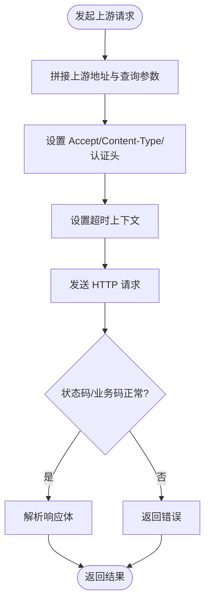

**图表来源**
- [server/mcp/http_client.go:1-154](file://server/mcp/http_client.go#L1-L154)

**章节来源**
- [server/mcp/http_client.go:1-154](file://server/mcp/http_client.go#L1-L154)

### 工具：API 创建（create_api）
- 功能
  - 支持单条或批量创建 API 权限记录
  - 返回创建结果汇总（总数、成功数、失败数、明细）
- 参数
  - path、description、apiGroup、method（可选，默认 POST）、apis（批量 JSON 字符串）
- 执行流程
  - 解析参数，构造请求体，调用上游创建接口
  - 查询刚创建的 API 列表，填充 ID
  - 组装结果并以 JSON 文本返回

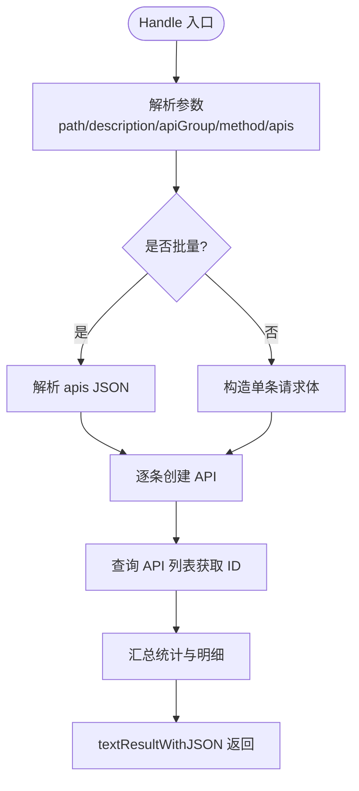

**图表来源**
- [server/mcp/api_creator.go:1-160](file://server/mcp/api_creator.go#L1-L160)
- [server/mcp/result.go:1-30](file://server/mcp/result.go#L1-L30)
- [server/mcp/http_client.go:1-154](file://server/mcp/http_client.go#L1-L154)

**章节来源**
- [server/mcp/api_creator.go:1-160](file://server/mcp/api_creator.go#L1-L160)
- [server/mcp/result.go:1-30](file://server/mcp/result.go#L1-L30)

### 工具：API 列表（list_all_apis）
- 功能
  - 返回数据库 API 与 Gin 路由 API 两套清单
- 执行流程
  - 调用上游获取数据库 API 列表
  - 调用上游获取路由信息
  - 组装返回结构（包含总数）

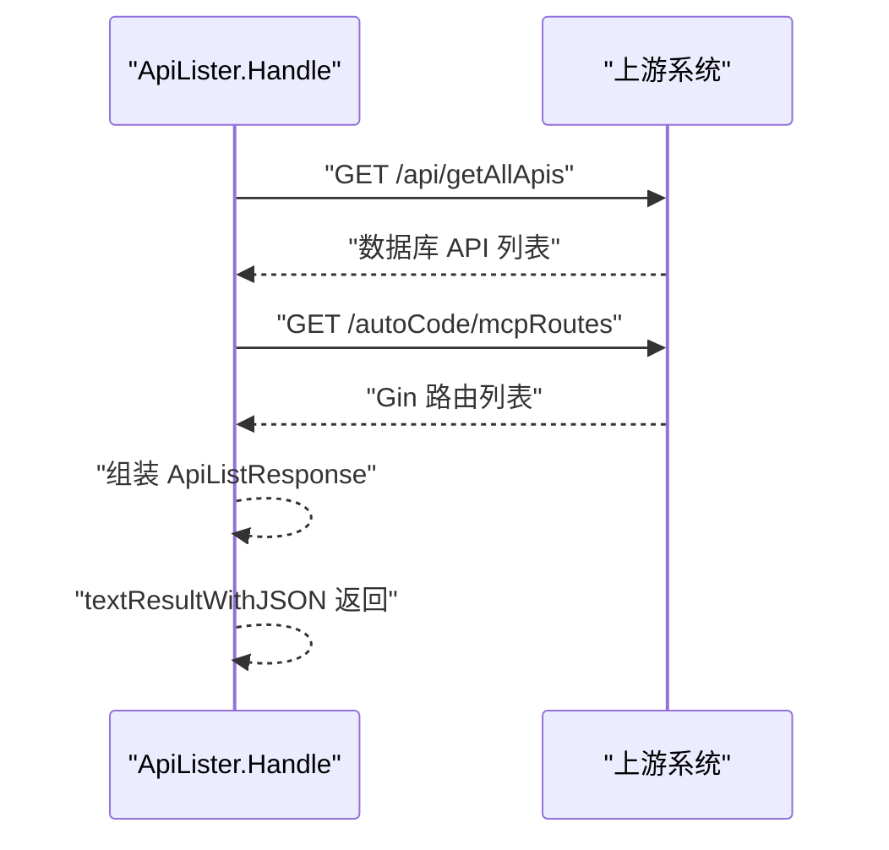

**图表来源**
- [server/mcp/api_lister.go:1-96](file://server/mcp/api_lister.go#L1-L96)
- [server/mcp/http_client.go:1-154](file://server/mcp/http_client.go#L1-L154)

**章节来源**
- [server/mcp/api_lister.go:1-96](file://server/mcp/api_lister.go#L1-L96)

### 工具：GVA 分析（gva_analyze）
- 功能
  - 分析系统中现有的包、模块、字典
  - 清理空包与相关历史记录
  - 返回清理信息与可用模块清单
- 执行流程
  - 获取包与历史记录
  - 检查包文件夹是否为空，清理空包与数据库记录
  - 扫描预设计模块与字典
  - 组装返回结构

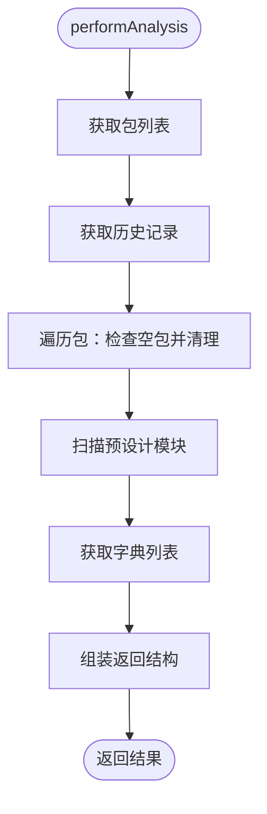

**图表来源**
- [server/mcp/gva_analyze.go:1-495](file://server/mcp/gva_analyze.go#L1-L495)

**章节来源**
- [server/mcp/gva_analyze.go:1-495](file://server/mcp/gva_analyze.go#L1-L495)

### 工具：GVA 执行（gva_execute）
- 功能
  - 直接执行代码生成计划，无需二次确认
  - 支持包创建、字典创建、模块批量创建
  - 返回生成路径与下一步建议
- 参数
  - executionPlan（包含包/模块/字典信息与路径映射）
  - requirement（可选，用于日志与复检建议）
- 执行流程
  - 解析并校验执行计划
  - 构建目录结构与预期生成路径
  - 按需创建包、字典、模块
  - 返回执行结果与建议

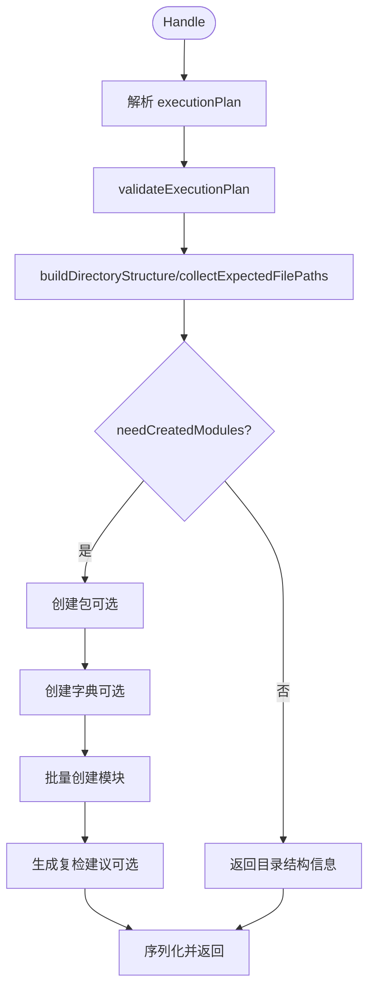

**图表来源**
- [server/mcp/gva_execute.go:1-751](file://server/mcp/gva_execute.go#L1-L751)

**章节来源**
- [server/mcp/gva_execute.go:1-751](file://server/mcp/gva_execute.go#L1-L751)

### 工具：字典生成（generate_dictionary_options）
- 功能
  - 根据字段描述与选项 JSON 自动生成字典与字典详情
- 参数
  - dictType、fieldDesc、options（JSON 字符串）、dictName、description
- 执行流程
  - 校验参数与选项
  - 若字典不存在则创建并填充选项
  - 返回创建结果

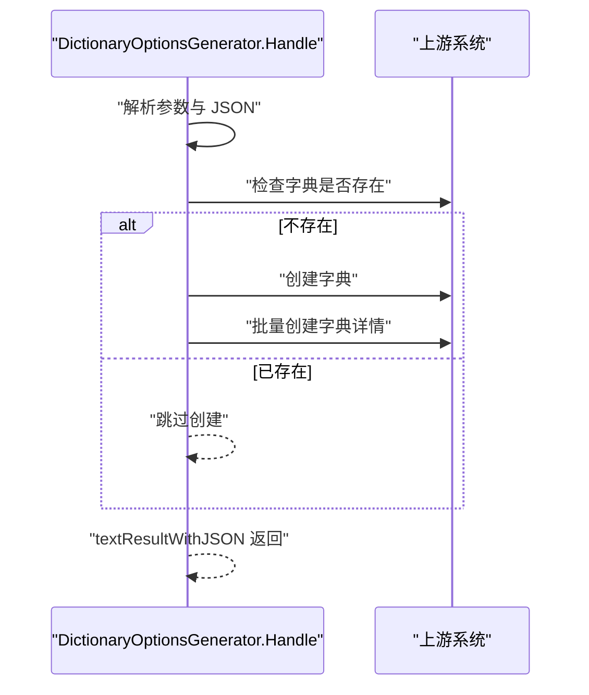

**图表来源**
- [server/mcp/dictionary_generator.go:1-175](file://server/mcp/dictionary_generator.go#L1-L175)
- [server/mcp/http_client.go:1-154](file://server/mcp/http_client.go#L1-L154)

**章节来源**
- [server/mcp/dictionary_generator.go:1-175](file://server/mcp/dictionary_generator.go#L1-L175)

### 工具：菜单创建（create_menu）
- 功能
  - 创建前端菜单记录，支持参数与按钮元数据
- 参数
  - parentId、path、name、hidden、component、sort、title、icon、keepAlive、defaultMenu、closeTab、activeName、parameters（JSON 字符串）、menuBtn（JSON 字符串）
- 执行流程
  - 解析参数，构造菜单对象
  - 调用上游创建接口
  - 查询菜单列表获取 ID
  - 返回结果

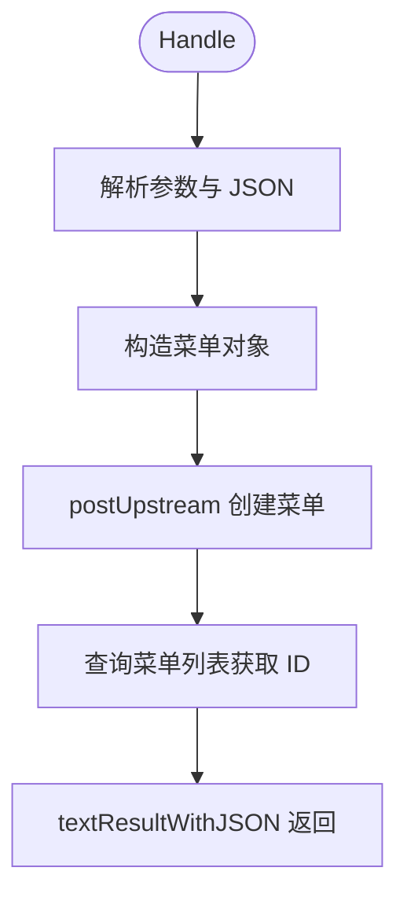

**图表来源**
- [server/mcp/menu_creator.go:1-229](file://server/mcp/menu_creator.go#L1-L229)
- [server/mcp/http_client.go:1-154](file://server/mcp/http_client.go#L1-L154)

**章节来源**
- [server/mcp/menu_creator.go:1-229](file://server/mcp/menu_creator.go#L1-L229)

## 依赖分析
- 组件耦合
  - 工具实现依赖统一的上游 HTTP 客户端与上下文认证
  - 服务器通过注册表集中管理工具，降低工具间耦合
- 外部依赖
  - mcp-go 客户端/服务器库
  - Gin 路由与 HTTP 服务
- 潜在风险
  - 上游接口失败时的错误传播与日志记录
  - 认证头缺失导致的请求失败

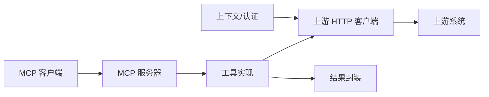

**图表来源**
- [server/mcp/http_client.go:1-154](file://server/mcp/http_client.go#L1-L154)
- [server/mcp/enter.go:1-32](file://server/mcp/enter.go#L1-L32)
- [server/mcp/server.go:1-53](file://server/mcp/server.go#L1-L53)
- [server/mcp/client/client.go:1-45](file://server/mcp/client/client.go#L1-L45)

**章节来源**
- [server/mcp/http_client.go:1-154](file://server/mcp/http_client.go#L1-L154)
- [server/mcp/enter.go:1-32](file://server/mcp/enter.go#L1-L32)

## 性能考量
- 连接与并发
  - 使用流式 HTTP 服务，减少握手开销
  - 工具 Handle 应避免阻塞，必要时使用异步或后台任务
- 请求超时
  - 上游请求设置合理超时，避免长时间等待
- 日志与可观测性
  - 在关键路径记录日志，便于定位性能瓶颈
- 资源清理
  - 清理空包与历史记录，保持系统整洁，减少无效 IO

## 故障排查指南
- 连接与握手
  - 确认客户端与服务器名称匹配
  - 检查初始化请求的协议版本兼容性
- 认证问题
  - 确认请求头中包含正确的认证令牌
  - 检查配置项与候选头部名称
- 上游请求失败
  - 关注状态码与业务码错误
  - 检查上游地址、端口、路径配置
- 工具参数错误
  - 严格遵循工具参数 Schema
  - 对 JSON 参数进行格式校验

**章节来源**
- [server/mcp/client/client.go:1-45](file://server/mcp/client/client.go#L1-L45)
- [server/mcp/context.go:1-67](file://server/mcp/context.go#L1-L67)
- [server/mcp/http_client.go:1-154](file://server/mcp/http_client.go#L1-L154)

## 结论
本插件 MCP API 通过统一的工具接口、注册机制与上游 HTTP 适配，实现了与主系统的解耦集成。开发者可通过扩展工具快速接入新能力，同时借助认证上下文与标准化错误处理保障安全性与稳定性。建议在生产环境中结合超时控制、日志监控与参数校验，持续优化性能与可靠性。

## 附录

### 配置项说明
- 名称与版本：用于服务器标识与客户端初始化
- 路径与端口：HTTP 服务路径与监听端口
- 基地址与上游基地址：决定 MCP 服务与上游系统地址
- 认证头：用于透传认证令牌
- 请求超时：上游请求超时时间（秒）

**章节来源**
- [server/config/mcp.go:1-19](file://server/config/mcp.go#L1-L19)