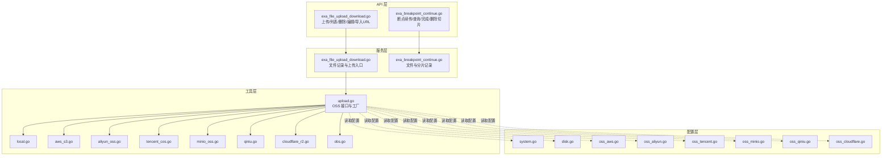
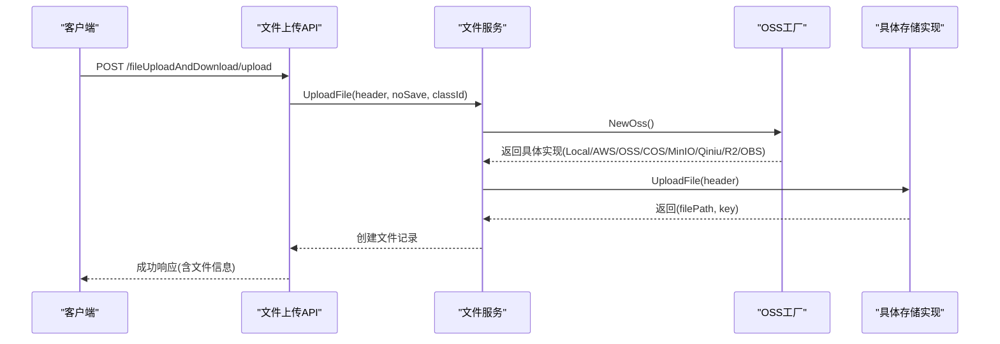
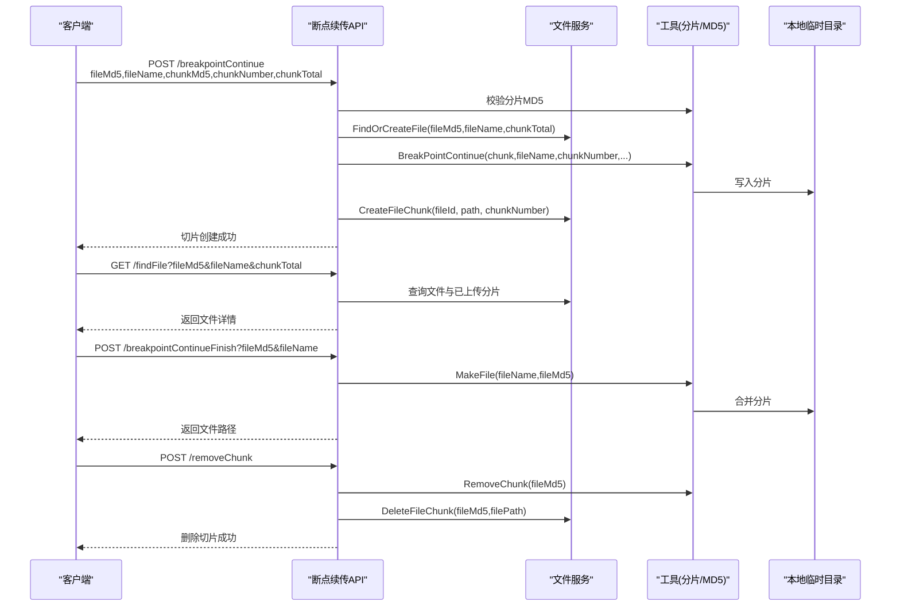
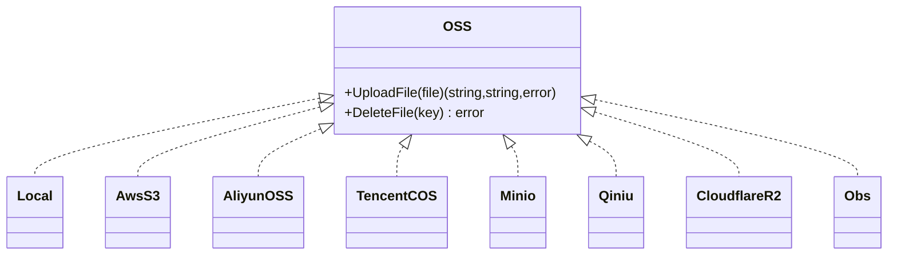
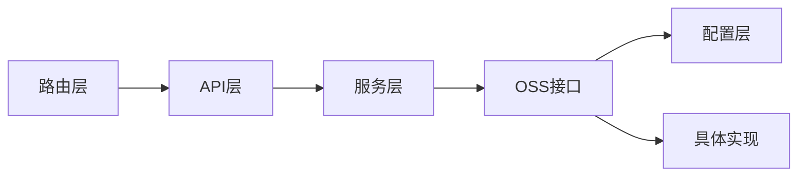

# 文件存储 API

<cite>
**本文引用的文件**
- [server/api/v1/example/exa_file_upload_download.go](file://server/api/v1/example/exa_file_upload_download.go)
- [server/router/example/exa_file_upload_and_download.go](file://server/router/example/exa_file_upload_and_download.go)
- [server/service/example/exa_file_upload_download.go](file://server/service/example/exa_file_upload_download.go)
- [server/model/example/exa_file_upload_download.go](file://server/model/example/exa_file_upload_download.go)
- [server/utils/upload/upload.go](file://server/utils/upload/upload.go)
- [server/utils/upload/local.go](file://server/utils/upload/local.go)
- [server/utils/upload/aws_s3.go](file://server/utils/upload/aws_s3.go)
- [server/utils/upload/aliyun_oss.go](file://server/utils/upload/aliyun_oss.go)
- [server/utils/upload/tencent_cos.go](file://server/utils/upload/tencent_cos.go)
- [server/utils/upload/minio_oss.go](file://server/utils/upload/minio_oss.go)
- [server/utils/upload/qiniu.go](file://server/utils/upload/qiniu.go)
- [server/utils/upload/cloudflare_r2.go](file://server/utils/upload/cloudflare_r2.go)
- [server/utils/upload/obs.go](file://server/utils/upload/obs.go)
- [server/api/v1/example/exa_breakpoint_continue.go](file://server/api/v1/example/exa_breakpoint_continue.go)
- [server/service/example/exa_breakpoint_continue.go](file://server/service/example/exa_breakpoint_continue.go)
- [server/model/example/exa_file_upload_download.go](file://server/model/example/exa_file_upload_download.go)
- [server/config/disk.go](file://server/config/disk.go)
- [server/config/oss_aws.go](file://server/config/oss_aws.go)
- [server/config/oss_aliyun.go](file://server/config/oss_aliyun.go)
- [server/config/oss_tencent.go](file://server/config/oss_tencent.go)
- [server/config/oss_minio.go](file://server/config/oss_minio.go)
- [server/config/oss_qiniu.go](file://server/config/oss_qiniu.go)
- [server/config/oss_cloudflare.go](file://server/config/oss_cloudflare.go)
- [server/config/system.go](file://server/config/system.go)
</cite>

## 目录
1. [简介](#简介)
2. [项目结构](#项目结构)
3. [核心组件](#核心组件)
4. [架构总览](#架构总览)
5. [详细组件分析](#详细组件分析)
6. [依赖分析](#依赖分析)
7. [性能考量](#性能考量)
8. [故障排查指南](#故障排查指南)
9. [结论](#结论)
10. [附录](#附录)

## 简介
本文件存储 API 提供统一的文件上传、下载、断点续传、文件列表查询、删除与导入 URL 等能力，并通过可插拔的对象存储适配器支持多种后端：本地存储、AWS S3、阿里云 OSS、腾讯云 COS、MinIO、七牛云、Cloudflare R2、华为 OBS。开发者可通过配置系统选择存储类型，实现灵活的文件归档与访问。

## 项目结构
围绕文件存储的关键模块分布如下：
- API 层：负责路由绑定与请求参数解析，输出统一响应结构
- 服务层：封装业务逻辑，协调存储适配器与数据库
- 工具层：对象存储接口与具体实现，按配置动态选择
- 配置层：系统与各云厂商存储的配置项
- 数据模型：文件元数据与分片记录模型

图表来源
- [server/api/v1/example/exa_file_upload_download.go:1-136](file://server/api/v1/example/exa_file_upload_download.go#L1-L136)
- [server/api/v1/example/exa_breakpoint_continue.go:1-157](file://server/api/v1/example/exa_breakpoint_continue.go#L1-L157)
- [server/service/example/exa_file_upload_download.go:1-131](file://server/service/example/exa_file_upload_download.go#L1-L131)
- [server/service/example/exa_breakpoint_continue.go:1-72](file://server/service/example/exa_breakpoint_continue.go#L1-L72)
- [server/utils/upload/upload.go:1-47](file://server/utils/upload/upload.go#L1-L47)
- [server/utils/upload/local.go:1-110](file://server/utils/upload/local.go#L1-L110)
- [server/utils/upload/aws_s3.go:1-115](file://server/utils/upload/aws_s3.go#L1-L115)
- [server/utils/upload/aliyun_oss.go:1-76](file://server/utils/upload/aliyun_oss.go#L1-L76)
- [server/utils/upload/tencent_cos.go:1-62](file://server/utils/upload/tencent_cos.go#L1-L62)
- [server/utils/upload/minio_oss.go:1-107](file://server/utils/upload/minio_oss.go#L1-L107)
- [server/utils/upload/qiniu.go:1-97](file://server/utils/upload/qiniu.go#L1-L97)
- [server/utils/upload/cloudflare_r2.go:1-86](file://server/utils/upload/cloudflare_r2.go#L1-L86)
- [server/utils/upload/obs.go:1-70](file://server/utils/upload/obs.go#L1-L70)
- [server/config/system.go:1-200](file://server/config/system.go#L1-L200)
- [server/config/disk.go:1-200](file://server/config/disk.go#L1-L200)
- [server/config/oss_aws.go:1-200](file://server/config/oss_aws.go#L1-L200)
- [server/config/oss_aliyun.go:1-200](file://server/config/oss_aliyun.go#L1-L200)
- [server/config/oss_tencent.go:1-200](file://server/config/oss_tencent.go#L1-L200)
- [server/config/oss_minio.go:1-200](file://server/config/oss_minio.go#L1-L200)
- [server/config/oss_qiniu.go:1-200](file://server/config/oss_qiniu.go#L1-L200)
- [server/config/oss_cloudflare.go:1-200](file://server/config/oss_cloudflare.go#L1-L200)

章节来源
- [server/api/v1/example/exa_file_upload_download.go:1-136](file://server/api/v1/example/exa_file_upload_download.go#L1-L136)
- [server/router/example/exa_file_upload_and_download.go:1-23](file://server/router/example/exa_file_upload_and_download.go#L1-L23)
- [server/service/example/exa_file_upload_download.go:1-131](file://server/service/example/exa_file_upload_download.go#L1-L131)
- [server/utils/upload/upload.go:1-47](file://server/utils/upload/upload.go#L1-L47)

## 核心组件
- 文件上传与管理 API：提供上传、列表、删除、编辑、导入 URL 等接口
- 断点续传 API：提供分片上传、进度查询、合并完成、删除切片
- 存储适配器：统一 OSS 接口，按配置选择本地或云存储
- 服务层：封装业务流程，协调存储与数据库
- 数据模型：文件元数据与分片记录

章节来源
- [server/api/v1/example/exa_file_upload_download.go:16-136](file://server/api/v1/example/exa_file_upload_download.go#L16-L136)
- [server/api/v1/example/exa_breakpoint_continue.go:20-157](file://server/api/v1/example/exa_breakpoint_continue.go#L20-L157)
- [server/service/example/exa_file_upload_download.go:91-131](file://server/service/example/exa_file_upload_download.go#L91-L131)
- [server/service/example/exa_breakpoint_continue.go:15-72](file://server/service/example/exa_breakpoint_continue.go#L15-L72)
- [server/model/example/exa_file_upload_download.go:7-19](file://server/model/example/exa_file_upload_download.go#L7-L19)

## 架构总览
文件存储整体采用“API -> 服务 -> 存储适配器 -> 配置”的分层设计。API 层负责路由与参数校验；服务层负责业务编排与持久化；存储适配器通过工厂方法根据系统配置选择具体实现；配置层集中管理各后端参数。

图表来源
- [server/api/v1/example/exa_file_upload_download.go:25-42](file://server/api/v1/example/exa_file_upload_download.go#L25-L42)
- [server/service/example/exa_file_upload_download.go:96-120](file://server/service/example/exa_file_upload_download.go#L96-L120)
- [server/utils/upload/upload.go:20-46](file://server/utils/upload/upload.go#L20-L46)

## 详细组件分析

### 文件上传与管理接口
- 上传文件
  - 方法与路径：POST /fileUploadAndDownload/upload
  - 请求参数：
    - multipart/form-data：file（必填）
    - 查询参数：noSave（0/1，决定是否入库，默认0）
    - 表单参数：classId（分类标识，整数）
  - 响应：包含文件详情的数据对象
  - 错误：接收文件失败、上传失败
- 编辑文件名/备注
  - 方法与路径：POST /fileUploadAndDownload/editFileName
  - 请求体：JSON，包含 id 与 name
  - 响应：成功消息
- 删除文件
  - 方法与路径：POST /fileUploadAndDownload/deleteFile
  - 请求体：JSON，包含 id
  - 响应：成功消息
- 分页文件列表
  - 方法与路径：POST /fileUploadAndDownload/getFileList
  - 请求体：JSON，包含分页参数与分类筛选
  - 响应：分页结果（列表、总数、页码、每页数量）
- 导入 URL
  - 方法与路径：POST /fileUploadAndDownload/importURL
  - 请求体：JSON 数组，每个元素为文件对象
  - 响应：成功消息

章节来源
- [server/api/v1/example/exa_file_upload_download.go:16-136](file://server/api/v1/example/exa_file_upload_download.go#L16-L136)
- [server/router/example/exa_file_upload_and_download.go:9-22](file://server/router/example/exa_file_upload_and_download.go#L9-L22)
- [server/service/example/exa_file_upload_download.go:21-131](file://server/service/example/exa_file_upload_download.go#L21-L131)
- [server/model/example/exa_file_upload_download.go:7-19](file://server/model/example/exa_file_upload_download.go#L7-L19)

### 断点续传接口
- 分片上传
  - 方法与路径：POST /fileUploadAndDownload/breakpointContinue
  - 请求参数：
    - multipart/form-data：file（必填）
    - 表单参数：fileMd5、fileName、chunkMd5、chunkNumber、chunkTotal
  - 校验：服务端对分片内容进行 MD5 校验
  - 结果：创建或更新文件记录，保存分片路径与序号
- 查询文件
  - 方法与路径：GET /fileUploadAndDownload/findFile
  - 查询参数：fileMd5、fileName、chunkTotal
  - 结果：返回文件记录（含已成功上传的分片）
- 合并完成
  - 方法与路径：POST /fileUploadAndDownload/breakpointContinueFinish
  - 查询参数：fileMd5、fileName
  - 结果：将本地分片合并为完整文件，返回文件路径
- 删除切片
  - 方法与路径：POST /fileUploadAndDownload/removeChunk
  - 请求体：JSON，包含 fileMd5 与 filePath
  - 安全：路径穿越拦截
  - 结果：删除本地缓存切片并清理数据库记录

图表来源
- [server/api/v1/example/exa_breakpoint_continue.go:29-78](file://server/api/v1/example/exa_breakpoint_continue.go#L29-L78)
- [server/api/v1/example/exa_breakpoint_continue.go:89-100](file://server/api/v1/example/exa_breakpoint_continue.go#L89-L100)
- [server/api/v1/example/exa_breakpoint_continue.go:111-121](file://server/api/v1/example/exa_breakpoint_continue.go#L111-L121)
- [server/api/v1/example/exa_breakpoint_continue.go:132-156](file://server/api/v1/example/exa_breakpoint_continue.go#L132-L156)
- [server/service/example/exa_breakpoint_continue.go:21-71](file://server/service/example/exa_breakpoint_continue.go#L21-L71)

章节来源
- [server/api/v1/example/exa_breakpoint_continue.go:20-157](file://server/api/v1/example/exa_breakpoint_continue.go#L20-L157)
- [server/service/example/exa_breakpoint_continue.go:15-72](file://server/service/example/exa_breakpoint_continue.go#L15-L72)

### 存储后端接口规范
- 统一接口
  - 接口定义：UploadFile(file) -> (filePath, key)；DeleteFile(key) -> error
  - 工厂方法：根据系统配置选择具体实现
- 本地存储
  - 上传：生成带时间戳的新文件名，写入本地目录，返回相对路径与文件名
  - 删除：基于 key 进行安全校验后删除
- AWS S3 / MinIO / Cloudflare R2
  - 上传：使用 SDK 上传对象，返回可访问 URL 与 key
  - 删除：删除对象并等待确认不存在
  - MinIO 支持自定义 Endpoint 与 SSL
- 阿里云 OSS
  - 上传：构造目标路径并上传对象，返回可访问 URL 与 key
  - 删除：删除对象
- 腾讯云 COS
  - 上传：构造路径并上传对象，返回可访问 URL 与 key
  - 删除：删除对象
- 七牛云
  - 上传：生成上传凭证并上传，返回可访问 URL 与 key
  - 删除：删除对象
- 华为 OBS
  - 上传：构造上传输入并上传，返回可访问路径与 key
  - 删除：删除对象

图表来源
- [server/utils/upload/upload.go:12-15](file://server/utils/upload/upload.go#L12-L15)
- [server/utils/upload/local.go:20](file://server/utils/upload/local.go#L20-L110)
- [server/utils/upload/aws_s3.go:20](file://server/utils/upload/aws_s3.go#L20-L115)
- [server/utils/upload/aliyun_oss.go:13](file://server/utils/upload/aliyun_oss.go#L13-L76)
- [server/utils/upload/tencent_cos.go:18](file://server/utils/upload/tencent_cos.go#L18-L62)
- [server/utils/upload/minio_oss.go:23](file://server/utils/upload/minio_oss.go#L23-L107)
- [server/utils/upload/qiniu.go:16](file://server/utils/upload/qiniu.go#L16-L97)
- [server/utils/upload/cloudflare_r2.go:19](file://server/utils/upload/cloudflare_r2.go#L19-L86)
- [server/utils/upload/obs.go:13](file://server/utils/upload/obs.go#L13-L70)

章节来源
- [server/utils/upload/upload.go:17-46](file://server/utils/upload/upload.go#L17-L46)
- [server/utils/upload/local.go:31-110](file://server/utils/upload/local.go#L31-L110)
- [server/utils/upload/aws_s3.go:29-84](file://server/utils/upload/aws_s3.go#L29-L84)
- [server/utils/upload/aliyun_oss.go:15-76](file://server/utils/upload/aliyun_oss.go#L15-L76)
- [server/utils/upload/tencent_cos.go:21-62](file://server/utils/upload/tencent_cos.go#L21-L62)
- [server/utils/upload/minio_oss.go:55-107](file://server/utils/upload/minio_oss.go#L55-L107)
- [server/utils/upload/qiniu.go:27-97](file://server/utils/upload/qiniu.go#L27-L97)
- [server/utils/upload/cloudflare_r2.go:21-86](file://server/utils/upload/cloudflare_r2.go#L21-L86)
- [server/utils/upload/obs.go:19-70](file://server/utils/upload/obs.go#L19-L70)

### 数据模型
- 文件记录模型：包含主键、文件名、分类标识、访问 URL、标签、唯一键
- 分片记录模型：关联文件 ID，记录分片路径与序号

章节来源
- [server/model/example/exa_file_upload_download.go:7-19](file://server/model/example/exa_file_upload_download.go#L7-L19)

## 依赖分析
- API 依赖服务层
- 服务层依赖存储适配器与数据库
- 存储适配器依赖配置层
- 路由层绑定 API 与处理器

图表来源
- [server/router/example/exa_file_upload_and_download.go:9-22](file://server/router/example/exa_file_upload_and_download.go#L9-L22)
- [server/api/v1/example/exa_file_upload_download.go:25-42](file://server/api/v1/example/exa_file_upload_download.go#L25-L42)
- [server/service/example/exa_file_upload_download.go:96-120](file://server/service/example/exa_file_upload_download.go#L96-L120)
- [server/utils/upload/upload.go:20-46](file://server/utils/upload/upload.go#L20-L46)

章节来源
- [server/router/example/exa_file_upload_and_download.go:1-23](file://server/router/example/exa_file_upload_and_download.go#L1-L23)
- [server/api/v1/example/exa_file_upload_download.go:1-136](file://server/api/v1/example/exa_file_upload_download.go#L1-L136)
- [server/service/example/exa_file_upload_download.go:1-131](file://server/service/example/exa_file_upload_download.go#L1-L131)
- [server/utils/upload/upload.go:1-47](file://server/utils/upload/upload.go#L1-L47)

## 性能考量
- 本地存储
  - IO 路径建议挂载高性能磁盘或网络存储，避免阻塞
  - 并发删除使用互斥锁，防止竞态
- 云存储
  - S3/MinIO：大文件自动分片上传，注意超时与重试策略
  - COS/OSS：批量上传与并发控制，合理设置分片大小
  - CDN 加速：为静态资源配置 CDN，降低回源压力
- 断点续传
  - 分片大小建议 5–20MB，兼顾吞吐与可控性
  - MD5 校验确保完整性，减少无效合并
  - 合并阶段尽量在本地 SSD 执行，避免跨盘复制

## 故障排查指南
- 上传失败
  - 检查存储路径权限与磁盘空间
  - 校验云存储密钥、桶名、区域、Endpoint 配置
- 删除失败
  - 本地：确认 key 合法且未被占用
  - 云存储：确认对象存在、权限正确
- 断点续传异常
  - 分片 MD5 不一致：检查客户端计算与服务端校验
  - 合并失败：确认临时目录权限与磁盘空间
  - 切片删除：避免路径穿越攻击

章节来源
- [server/utils/upload/local.go:81-110](file://server/utils/upload/local.go#L81-L110)
- [server/utils/upload/aws_s3.go:63-84](file://server/utils/upload/aws_s3.go#L63-L84)
- [server/utils/upload/aliyun_oss.go:43-76](file://server/utils/upload/aliyun_oss.go#L43-L76)
- [server/utils/upload/tencent_cos.go:39-62](file://server/utils/upload/tencent_cos.go#L39-L62)
- [server/utils/upload/minio_oss.go:99-107](file://server/utils/upload/minio_oss.go#L99-L107)
- [server/utils/upload/qiniu.go:61-97](file://server/utils/upload/qiniu.go#L61-L97)
- [server/utils/upload/cloudflare_r2.go:47-86](file://server/utils/upload/cloudflare_r2.go#L47-L86)
- [server/utils/upload/obs.go:54-70](file://server/utils/upload/obs.go#L54-L70)
- [server/api/v1/example/exa_breakpoint_continue.go:139-156](file://server/api/v1/example/exa_breakpoint_continue.go#L139-L156)

## 结论
本文件存储 API 通过统一的 OSS 接口与可插拔的存储实现，覆盖从本地到主流云厂商的多种场景。结合断点续传与分片管理，满足大文件与弱网环境下的稳定上传需求。配合完善的配置体系与安全校验，便于在不同环境中快速落地。

## 附录

### 接口清单与规范摘要
- 上传文件
  - 方法：POST
  - 路径：/fileUploadAndDownload/upload
  - 参数：multipart/form-data(file)、查询参数(noSave=0/1)、表单(classId)
  - 响应：包含文件详情
- 编辑文件名/备注
  - 方法：POST
  - 路径：/fileUploadAndDownload/editFileName
  - 请求体：JSON{id, name}
  - 响应：成功消息
- 删除文件
  - 方法：POST
  - 路径：/fileUploadAndDownload/deleteFile
  - 请求体：JSON{id}
  - 响应：成功消息
- 分页文件列表
  - 方法：POST
  - 路径：/fileUploadAndDownload/getFileList
  - 请求体：JSON{分页参数, 分类筛选}
  - 响应：分页结果
- 导入 URL
  - 方法：POST
  - 路径：/fileUploadAndDownload/importURL
  - 请求体：JSON 数组
  - 响应：成功消息
- 断点续传
  - 分片上传：POST /fileUploadAndDownload/breakpointContinue
    - 参数：file、fileMd5、fileName、chunkMd5、chunkNumber、chunkTotal
  - 查询文件：GET /fileUploadAndDownload/findFile
    - 参数：fileMd5、fileName、chunkTotal
  - 合并完成：POST /fileUploadAndDownload/breakpointContinueFinish
    - 参数：fileMd5、fileName
  - 删除切片：POST /fileUploadAndDownload/removeChunk
    - 请求体：JSON{fileMd5, filePath}

章节来源
- [server/api/v1/example/exa_file_upload_download.go:16-136](file://server/api/v1/example/exa_file_upload_download.go#L16-L136)
- [server/api/v1/example/exa_breakpoint_continue.go:20-157](file://server/api/v1/example/exa_breakpoint_continue.go#L20-L157)
- [server/router/example/exa_file_upload_and_download.go:9-22](file://server/router/example/exa_file_upload_and_download.go#L9-L22)

### 存储配置要点
- 系统配置
  - OssType：选择存储类型（local、aws-s3、aliyun-oss、tencent-cos、minio、qiniu、cloudflare-r2、huawei-obs）
- 各后端配置项（示例）
  - 本地：StorePath、Path
  - AWS S3：Region、SecretID、SecretKey、Bucket、BaseURL、PathPrefix、Endpoint、DisableSSL、S3ForcePathStyle
  - 阿里云 OSS：Endpoint、AccessKeyId、AccessKeySecret、BucketName、BucketUrl、BasePath
  - 腾讯云 COS：Bucket、Region、SecretID、SecretKey、BaseURL、PathPrefix
  - MinIO：Endpoint、AccessKeyId、AccessKeySecret、BucketName、BucketUrl、BasePath、UseSSL
  - 七牛云：AccessKey、SecretKey、Bucket、ImgPath、UseHTTPS、UseCdnDomains、Zone
  - Cloudflare R2：AccountID、AccessKeyID、SecretAccessKey、Bucket、BaseURL、Path
  - 华为 OBS：Endpoint、AccessKey、SecretKey、Bucket、Path

章节来源
- [server/config/system.go:1-200](file://server/config/system.go#L1-L200)
- [server/config/disk.go:1-200](file://server/config/disk.go#L1-L200)
- [server/config/oss_aws.go:1-200](file://server/config/oss_aws.go#L1-L200)
- [server/config/oss_aliyun.go:1-200](file://server/config/oss_aliyun.go#L1-L200)
- [server/config/oss_tencent.go:1-200](file://server/config/oss_tencent.go#L1-L200)
- [server/config/oss_minio.go:1-200](file://server/config/oss_minio.go#L1-L200)
- [server/config/oss_qiniu.go:1-200](file://server/config/oss_qiniu.go#L1-L200)
- [server/config/oss_cloudflare.go:1-200](file://server/config/oss_cloudflare.go#L1-L200)