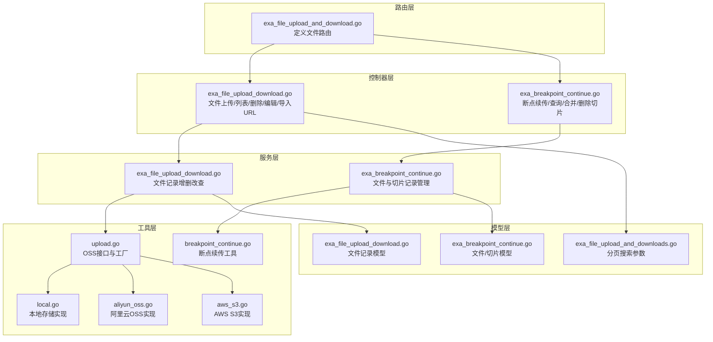
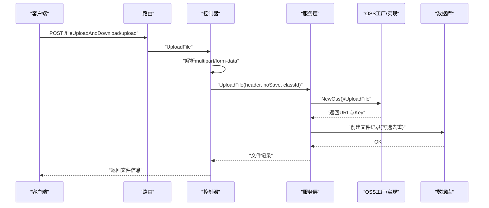
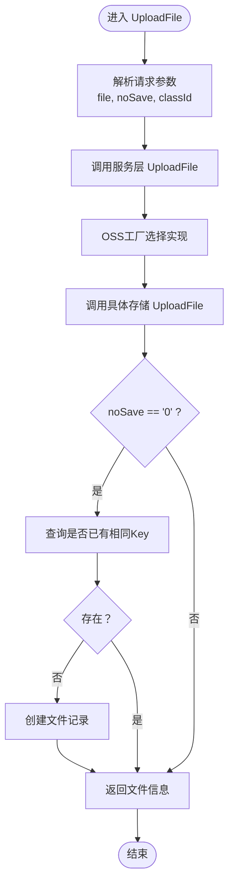
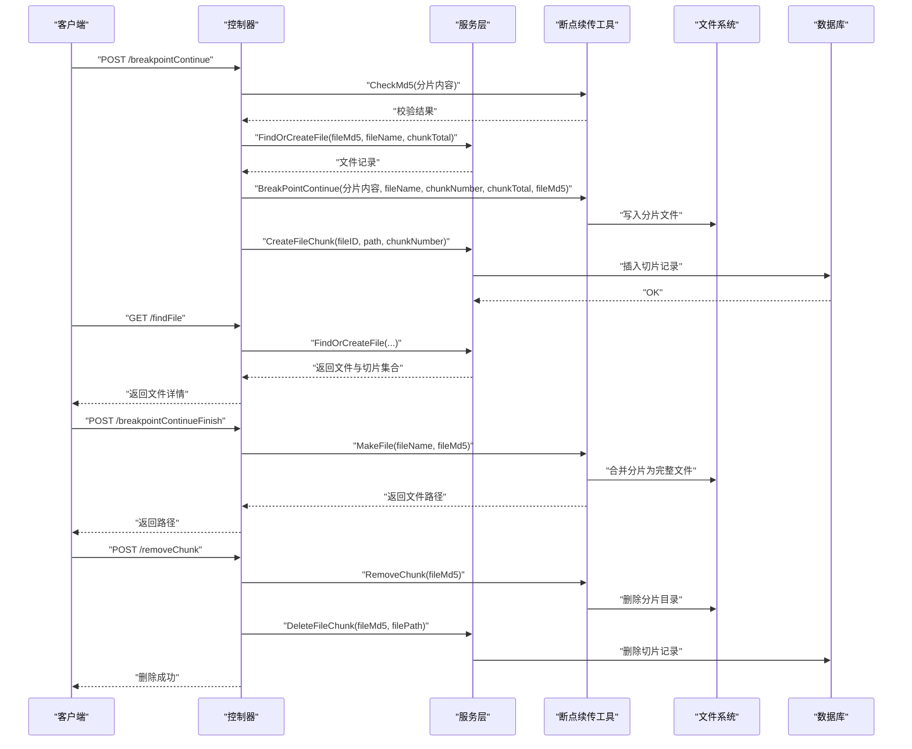
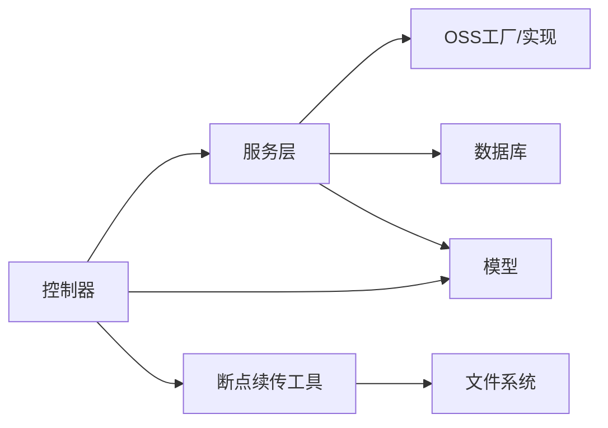

# 文件上传下载 API

<cite>
**本文引用的文件**
- [exa_file_upload_and_download.go](file://server/router/example/exa_file_upload_and_download.go)
- [exa_file_upload_download.go](file://server/api/v1/example/exa_file_upload_download.go)
- [exa_file_upload_download.go](file://server/service/example/exa_file_upload_download.go)
- [exa_file_upload_download.go](file://server/model/example/exa_file_upload_download.go)
- [exa_file_upload_and_downloads.go](file://server/model/example/request/exa_file_upload_and_downloads.go)
- [upload.go](file://server/utils/upload/upload.go)
- [local.go](file://server/utils/upload/local.go)
- [aliyun_oss.go](file://server/utils/upload/aliyun_oss.go)
- [aws_s3.go](file://server/utils/upload/aws_s3.go)
- [exa_breakpoint_continue.go](file://server/api/v1/example/exa_breakpoint_continue.go)
- [exa_breakpoint_continue.go](file://server/service/example/exa_breakpoint_continue.go)
- [exa_breakpoint_continue.go](file://server/model/example/exa_breakpoint_continue.go)
- [breakpoint_continue.go](file://server/utils/breakpoint_continue.go)
</cite>

## 目录
1. [简介](#简介)
2. [项目结构](#项目结构)
3. [核心组件](#核心组件)
4. [架构总览](#架构总览)
5. [详细组件分析](#详细组件分析)
6. [依赖分析](#依赖分析)
7. [性能考虑](#性能考虑)
8. [故障排查指南](#故障排查指南)
9. [结论](#结论)
10. [附录：接口清单与调用示例](#附录接口清单与调用示例)

## 简介
本文件面向开发者，提供“文件上传下载”能力的完整技术文档。内容覆盖以下核心能力：
- 文件上传（multipart/form-data）
- 编辑文件名/备注（JSON）
- 删除文件（JSON）
- 分页列表（JSON）
- URL 导入（JSON）
- 断点续传（分片上传 + 校验 + 合并）
- 附件分类集成（按分类 ID 过滤与存储）

文档重点解释：
- 上传流程中的文件名与标签生成、MD5 校验、存储后端选择、文件路径生成
- 与附件分类系统的集成方式
- 与断点续传功能的协作关系
- 请求参数、响应格式、错误处理机制
- 安全考虑、性能优化与故障排查建议

## 项目结构
围绕文件管理功能的相关模块组织如下：
- 路由层：定义文件上传下载相关路由
- 控制器层：解析请求、绑定参数、调用服务层、封装响应
- 服务层：业务逻辑、数据库操作、存储后端选择与调用
- 工具层：通用上传接口抽象、各云存储实现、断点续传工具
- 模型层：数据库表结构、请求参数结构体

图表来源
- [exa_file_upload_and_download.go:1-23](file://server/router/example/exa_file_upload_and_download.go#L1-L23)
- [exa_file_upload_download.go:1-136](file://server/api/v1/example/exa_file_upload_download.go#L1-L136)
- [exa_breakpoint_continue.go:1-157](file://server/api/v1/example/exa_breakpoint_continue.go#L1-L157)
- [exa_file_upload_download.go:1-131](file://server/service/example/exa_file_upload_download.go#L1-L131)
- [exa_breakpoint_continue.go:1-72](file://server/service/example/exa_breakpoint_continue.go#L1-L72)
- [upload.go:1-47](file://server/utils/upload/upload.go#L1-L47)
- [local.go:1-110](file://server/utils/upload/local.go#L1-L110)
- [aliyun_oss.go:1-76](file://server/utils/upload/aliyun_oss.go#L1-L76)
- [aws_s3.go:1-115](file://server/utils/upload/aws_s3.go#L1-L115)
- [breakpoint_continue.go:1-122](file://server/utils/breakpoint_continue.go#L1-L122)
- [exa_file_upload_download.go:1-19](file://server/model/example/exa_file_upload_download.go#L1-L19)
- [exa_breakpoint_continue.go:1-25](file://server/model/example/exa_breakpoint_continue.go#L1-L25)
- [exa_file_upload_and_downloads.go:1-11](file://server/model/example/request/exa_file_upload_and_downloads.go#L1-L11)

章节来源
- [exa_file_upload_and_download.go:1-23](file://server/router/example/exa_file_upload_and_download.go#L1-L23)
- [exa_file_upload_download.go:1-136](file://server/api/v1/example/exa_file_upload_download.go#L1-L136)
- [exa_breakpoint_continue.go:1-157](file://server/api/v1/example/exa_breakpoint_continue.go#L1-L157)

## 核心组件
- 路由与控制器
  - 路由：统一挂载在 group “fileUploadAndDownload”，包含上传、列表、删除、编辑、断点续传、查询、合并、删除切片、URL 导入等接口
  - 控制器：负责参数解析、调用服务层、封装响应
- 服务层
  - 文件记录：上传、查询、删除、编辑、分页列表、URL 导入
  - 断点续传：查找/创建文件记录、创建切片记录、删除切片记录、合并文件
- 工具层
  - OSS 抽象与工厂：根据配置选择本地或云存储实现
  - 本地存储：文件写入、路径拼接、删除校验
  - 云存储：阿里云 OSS、AWS S3 等具体实现
  - 断点续传：分片落盘、MD5 校验、合并、清理
- 模型层
  - 文件记录模型：包含文件名、分类 ID、URL、标签、Key
  - 断点续传模型：文件主记录与切片明细
  - 分页搜索参数：支持按分类 ID 与关键词过滤

章节来源
- [exa_file_upload_and_download.go:9-21](file://server/router/example/exa_file_upload_and_download.go#L9-L21)
- [exa_file_upload_download.go:16-135](file://server/api/v1/example/exa_file_upload_download.go#L16-L135)
- [exa_file_upload_download.go:21-130](file://server/service/example/exa_file_upload_download.go#L21-L130)
- [exa_breakpoint_continue.go:20-156](file://server/api/v1/example/exa_breakpoint_continue.go#L20-L156)
- [exa_breakpoint_continue.go:21-71](file://server/service/example/exa_breakpoint_continue.go#L21-L71)
- [upload.go:17-46](file://server/utils/upload/upload.go#L17-L46)
- [local.go:31-109](file://server/utils/upload/local.go#L31-L109)
- [aliyun_oss.go:15-59](file://server/utils/upload/aliyun_oss.go#L15-L59)
- [aws_s3.go:29-84](file://server/utils/upload/aws_s3.go#L29-L84)
- [breakpoint_continue.go:26-121](file://server/utils/breakpoint_continue.go#L26-L121)
- [exa_file_upload_download.go:7-18](file://server/model/example/exa_file_upload_download.go#L7-L18)
- [exa_breakpoint_continue.go:8-24](file://server/model/example/exa_breakpoint_continue.go#L8-L24)
- [exa_file_upload_and_downloads.go:7-10](file://server/model/example/request/exa_file_upload_and_downloads.go#L7-L10)

## 架构总览
下图展示从客户端到存储后端的整体调用链路与关键决策点。

图表来源
- [exa_file_upload_and_download.go:12-12](file://server/router/example/exa_file_upload_and_download.go#L12-L12)
- [exa_file_upload_download.go:25-42](file://server/api/v1/example/exa_file_upload_download.go#L25-L42)
- [exa_file_upload_download.go:96-120](file://server/service/example/exa_file_upload_download.go#L96-L120)
- [upload.go:20-46](file://server/utils/upload/upload.go#L20-L46)

## 详细组件分析

### 1) 文件上传 UploadFile
- 功能要点
  - 接收 multipart/form-data，提取 file 字段
  - 通过 OSS 工厂选择存储后端，调用对应 UploadFile 返回 URL 与 Key
  - 可选保存记录：当 noSave 为 "0" 时，若同 Key 未存在则入库；否则仅返回结果不入库
  - 解析 classId，用于附件分类
- 参数
  - Query: noSave（默认 0），用于控制是否入库
  - Form: file（必填）、classId（可选，默认 0）
- 响应
  - 成功：返回文件信息（URL、Name、ClassId、Tag、Key）
- 错误处理
  - 接收文件失败、上传失败、入库失败均记录日志并返回错误消息

图表来源
- [exa_file_upload_download.go:25-42](file://server/api/v1/example/exa_file_upload_download.go#L25-L42)
- [exa_file_upload_download.go:96-120](file://server/service/example/exa_file_upload_download.go#L96-L120)
- [upload.go:20-46](file://server/utils/upload/upload.go#L20-L46)

章节来源
- [exa_file_upload_download.go:16-42](file://server/api/v1/example/exa_file_upload_download.go#L16-L42)
- [exa_file_upload_download.go:96-120](file://server/service/example/exa_file_upload_download.go#L96-L120)
- [upload.go:17-46](file://server/utils/upload/upload.go#L17-L46)

### 2) 编辑文件名 EditFileName
- 功能要点
  - 接收 JSON，更新文件记录的 name 字段
- 参数
  - Body: ExaFileUploadAndDownload（至少包含 ID 与新的 Name）
- 响应
  - 成功：返回“编辑成功”
- 错误处理
  - 参数绑定失败、更新失败均返回错误消息

章节来源
- [exa_file_upload_download.go:44-59](file://server/api/v1/example/exa_file_upload_download.go#L44-L59)
- [exa_file_upload_download.go:57-61](file://server/service/example/exa_file_upload_download.go#L57-L61)

### 3) 删除文件 DeleteFile
- 功能要点
  - 先根据 ID 查询记录，再调用 OSS 实现删除对应 Key 的文件，最后删除数据库记录
- 参数
  - Body: ExaFileUploadAndDownload（至少包含 ID）
- 响应
  - 成功：返回“删除成功”
- 错误处理
  - 查询失败、OSS 删除失败、数据库删除失败均返回错误消息

章节来源
- [exa_file_upload_download.go:61-82](file://server/api/v1/example/exa_file_upload_download.go#L61-L82)
- [exa_file_upload_download.go:43-55](file://server/service/example/exa_file_upload_download.go#L43-L55)

### 4) 分页列表 GetFileList
- 功能要点
  - 支持按关键词与分类 ID 过滤，分页返回文件列表与总数
- 参数
  - Body: ExaAttachmentCategorySearch（包含 Page、PageSize、Keyword、ClassId）
- 响应
  - 成功：返回 PageResult（List、Total、Page、PageSize）
- 错误处理
  - 参数绑定失败、查询失败均返回错误消息

章节来源
- [exa_file_upload_download.go:84-112](file://server/api/v1/example/exa_file_upload_download.go#L84-L112)
- [exa_file_upload_and_downloads.go:7-10](file://server/model/example/request/exa_file_upload_and_downloads.go#L7-L10)
- [exa_file_upload_download.go:69-88](file://server/service/example/exa_file_upload_download.go#L69-L88)

### 5) URL 导入 ImportURL
- 功能要点
  - 批量导入外部 URL 作为文件记录
- 参数
  - Body: 数组 []ExaFileUploadAndDownload（每个元素包含 Name、URL、ClassId、Tag 等）
- 响应
  - 成功：返回“导入URL成功”
- 错误处理
  - 参数绑定失败、批量创建失败均返回错误消息

章节来源
- [exa_file_upload_download.go:114-135](file://server/api/v1/example/exa_file_upload_download.go#L114-L135)
- [exa_file_upload_download.go:128-130](file://server/service/example/exa_file_upload_download.go#L128-L130)

### 6) 断点续传 BreakpointContinue / FindFile / BreakpointContinueFinish / RemoveChunk
- BreakpointContinue
  - 接收分片文件与元信息（fileMd5、fileName、chunkMd5、chunkNumber、chunkTotal）
  - 校验分片 MD5，查找/创建文件记录，落盘分片，记录切片
- FindFile
  - 根据 fileMd5、fileName、chunkTotal 查询当前文件的切片情况
- BreakpointContinueFinish
  - 合并所有分片为完整文件，返回最终路径
- RemoveChunk
  - 清理指定文件的分片缓存与数据库记录
- 参数与响应
  - 详见各接口注释与控制器实现

图表来源
- [exa_breakpoint_continue.go:29-78](file://server/api/v1/example/exa_breakpoint_continue.go#L29-L78)
- [exa_breakpoint_continue.go:89-100](file://server/api/v1/example/exa_breakpoint_continue.go#L89-L100)
- [exa_breakpoint_continue.go:111-121](file://server/api/v1/example/exa_breakpoint_continue.go#L111-L121)
- [exa_breakpoint_continue.go:132-156](file://server/api/v1/example/exa_breakpoint_continue.go#L132-L156)
- [exa_breakpoint_continue.go:21-71](file://server/service/example/exa_breakpoint_continue.go#L21-L71)
- [breakpoint_continue.go:26-121](file://server/utils/breakpoint_continue.go#L26-L121)

章节来源
- [exa_breakpoint_continue.go:20-156](file://server/api/v1/example/exa_breakpoint_continue.go#L20-L156)
- [exa_breakpoint_continue.go:15-71](file://server/service/example/exa_breakpoint_continue.go#L15-L71)
- [breakpoint_continue.go:15-121](file://server/utils/breakpoint_continue.go#L15-L121)

### 7) 存储后端选择与文件路径生成
- OSS 工厂
  - 根据系统配置选择实现：local、qiniu、tencent-cos、aliyun-oss、huawei-obs、aws-s3、cloudflare-r2、minio
- 本地存储
  - 生成新文件名：MD5(原名)_时间戳.扩展名
  - 路径：StorePath 下写入文件；URL 路径前缀为 Path
- 阿里云 OSS
  - 上传路径：BasePath/uploads/YYYY-MM-DD/原文件名
  - 返回 URL：BucketUrl + 上传路径
- AWS S3
  - 上传 Key：PathPrefix + 时间戳 + 原文件名
  - 返回 URL：BaseURL + Key
- Key 与 URL
  - Key 用于定位存储后端对象；URL 用于访问

章节来源
- [upload.go:20-46](file://server/utils/upload/upload.go#L20-L46)
- [local.go:31-69](file://server/utils/upload/local.go#L31-L69)
- [aliyun_oss.go:15-41](file://server/utils/upload/aliyun_oss.go#L15-L41)
- [aws_s3.go:29-54](file://server/utils/upload/aws_s3.go#L29-L54)

### 8) 附件分类集成
- 分类字段
  - 文件记录模型包含 ClassId 字段，用于标识附件分类
- 列表过滤
  - 分页查询支持 ClassId 与 Keyword 过滤
- 上传关联
  - 上传接口支持 classId 参数，便于将文件归档到指定分类

章节来源
- [exa_file_upload_download.go:10-10](file://server/model/example/exa_file_upload_download.go#L10-L10)
- [exa_file_upload_and_downloads.go:8-8](file://server/model/example/request/exa_file_upload_and_downloads.go#L8-L8)
- [exa_file_upload_download.go:27-29](file://server/api/v1/example/exa_file_upload_download.go#L27-L29)
- [exa_file_upload_download.go:96-109](file://server/service/example/exa_file_upload_download.go#L96-L109)

## 依赖分析
- 组件耦合
  - 控制器依赖服务层；服务层依赖 OSS 工厂与数据库；断点续传依赖工具层与数据库
- 外部依赖
  - 云存储 SDK（阿里云 OSS、AWS S3 等）
  - 文件系统（本地存储）
- 循环依赖
  - 当前结构清晰，无循环依赖迹象

图表来源
- [exa_file_upload_download.go:1-136](file://server/api/v1/example/exa_file_upload_download.go#L1-L136)
- [exa_file_upload_download.go:1-131](file://server/service/example/exa_file_upload_download.go#L1-L131)
- [upload.go:1-47](file://server/utils/upload/upload.go#L1-L47)
- [breakpoint_continue.go:1-122](file://server/utils/breakpoint_continue.go#L1-L122)

章节来源
- [exa_file_upload_download.go:1-136](file://server/api/v1/example/exa_file_upload_download.go#L1-L136)
- [exa_file_upload_download.go:1-131](file://server/service/example/exa_file_upload_download.go#L1-L131)
- [upload.go:1-47](file://server/utils/upload/upload.go#L1-L47)
- [breakpoint_continue.go:1-122](file://server/utils/breakpoint_continue.go#L1-L122)

## 性能考虑
- 上传性能
  - 优先使用云存储（OSS/S3）以获得更好的吞吐与可靠性
  - 本地存储适合小规模或离线环境
- 并发与安全
  - 本地删除加锁，避免并发删除冲突
  - 断点续传目录与文件名严格校验，防止路径穿越
- IO 与内存
  - 断点续传采用分片落盘，避免一次性加载大文件
- 网络与超时
  - 云存储上传建议设置合理的超时与重试策略

## 故障排查指南
- 常见错误与定位
  - 接收文件失败：检查 multipart/form-data 格式与字段名
  - 上传失败：检查 OSS 配置、凭证、网络连通性
  - 删除失败：确认 Key 有效、路径合法、权限足够
  - 分片校验失败：核对前端传入 chunkMd5 与实际内容一致性
  - 合并失败：检查分片目录完整性与磁盘权限
- 日志与返回
  - 控制器与服务层均会记录错误日志并返回明确错误消息
- 建议
  - 在生产环境启用更严格的参数校验与权限控制
  - 对大文件优先使用断点续传
  - 定期清理过期分片缓存

章节来源
- [exa_file_upload_download.go:30-40](file://server/api/v1/example/exa_file_upload_download.go#L30-L40)
- [exa_file_upload_download.go:76-81](file://server/api/v1/example/exa_file_upload_download.go#L76-L81)
- [exa_breakpoint_continue.go:54-58](file://server/api/v1/example/exa_breakpoint_continue.go#L54-L58)
- [exa_breakpoint_continue.go:114-121](file://server/api/v1/example/exa_breakpoint_continue.go#L114-L121)
- [local.go:87-108](file://server/utils/upload/local.go#L87-L108)
- [breakpoint_continue.go:27-29](file://server/utils/breakpoint_continue.go#L27-L29)

## 结论
本文件上传下载 API 提供了从基础上传、编辑、删除、分页列表到断点续传与 URL 导入的完整能力，并通过 OSS 工厂灵活适配多种存储后端。结合附件分类字段，可满足测试平台对文件管理的多样化需求。建议在生产环境中重视安全校验、并发控制与日志监控，确保系统稳定与数据安全。

## 附录：接口清单与调用示例

- 上传文件
  - 方法与路径：POST /fileUploadAndDownload/upload
  - 请求类型：multipart/form-data
  - 参数
    - file：二进制文件（必填）
    - noSave：字符串，0 表示入库（可选，默认 0）
    - classId：整数，附件分类 ID（可选，默认 0）
  - 响应：包含文件信息（URL、Name、ClassId、Tag、Key）
  - 示例参考
    - [exa_file_upload_download.go:25-42](file://server/api/v1/example/exa_file_upload_download.go#L25-L42)

- 编辑文件名/备注
  - 方法与路径：POST /fileUploadAndDownload/editFileName
  - 请求类型：application/json
  - 参数：JSON 对象，至少包含 ID 与新的 Name
  - 响应：编辑成功
  - 示例参考
    - [exa_file_upload_download.go:44-59](file://server/api/v1/example/exa_file_upload_download.go#L44-L59)

- 删除文件
  - 方法与路径：POST /fileUploadAndDownload/deleteFile
  - 请求类型：application/json
  - 参数：JSON 对象，至少包含 ID
  - 响应：删除成功
  - 示例参考
    - [exa_file_upload_download.go:61-82](file://server/api/v1/example/exa_file_upload_download.go#L61-L82)

- 分页列表
  - 方法与路径：POST /fileUploadAndDownload/getFileList
  - 请求类型：application/json
  - 参数：JSON 对象，包含 Page、PageSize、Keyword、ClassId
  - 响应：分页结果（List、Total、Page、PageSize）
  - 示例参考
    - [exa_file_upload_download.go:84-112](file://server/api/v1/example/exa_file_upload_download.go#L84-L112)
    - [exa_file_upload_and_downloads.go:7-10](file://server/model/example/request/exa_file_upload_and_downloads.go#L7-L10)

- URL 导入
  - 方法与路径：POST /fileUploadAndDownload/importURL
  - 请求类型：application/json
  - 参数：JSON 数组，每个元素为文件记录
  - 响应：导入URL成功
  - 示例参考
    - [exa_file_upload_download.go:114-135](file://server/api/v1/example/exa_file_upload_download.go#L114-L135)

- 断点续传（上传分片）
  - 方法与路径：POST /fileUploadAndDownload/breakpointContinue
  - 请求类型：multipart/form-data
  - 参数
    - file：二进制分片（必填）
    - fileMd5：字符串（必填）
    - fileName：字符串（必填）
    - chunkMd5：字符串（必填）
    - chunkNumber：整数（必填）
    - chunkTotal：整数（必填）
  - 响应：切片创建成功
  - 示例参考
    - [exa_breakpoint_continue.go:29-78](file://server/api/v1/example/exa_breakpoint_continue.go#L29-L78)

- 查询当前文件成功的切片
  - 方法与路径：GET /fileUploadAndDownload/findFile
  - 请求类型：application/json
  - 参数：fileMd5、fileName、chunkTotal
  - 响应：文件详情（含切片集合）
  - 示例参考
    - [exa_breakpoint_continue.go:89-100](file://server/api/v1/example/exa_breakpoint_continue.go#L89-L100)

- 切片传输完成（合并文件）
  - 方法与路径：POST /fileUploadAndDownload/breakpointContinueFinish
  - 请求类型：application/json
  - 参数：fileMd5、fileName
  - 响应：返回文件路径
  - 示例参考
    - [exa_breakpoint_continue.go:111-121](file://server/api/v1/example/exa_breakpoint_continue.go#L111-L121)

- 删除切片
  - 方法与路径：POST /fileUploadAndDownload/removeChunk
  - 请求类型：application/json
  - 参数：JSON 对象，至少包含 FileMd5 与 FilePath
  - 响应：缓存切片删除成功
  - 示例参考
    - [exa_breakpoint_continue.go:132-156](file://server/api/v1/example/exa_breakpoint_continue.go#L132-L156)