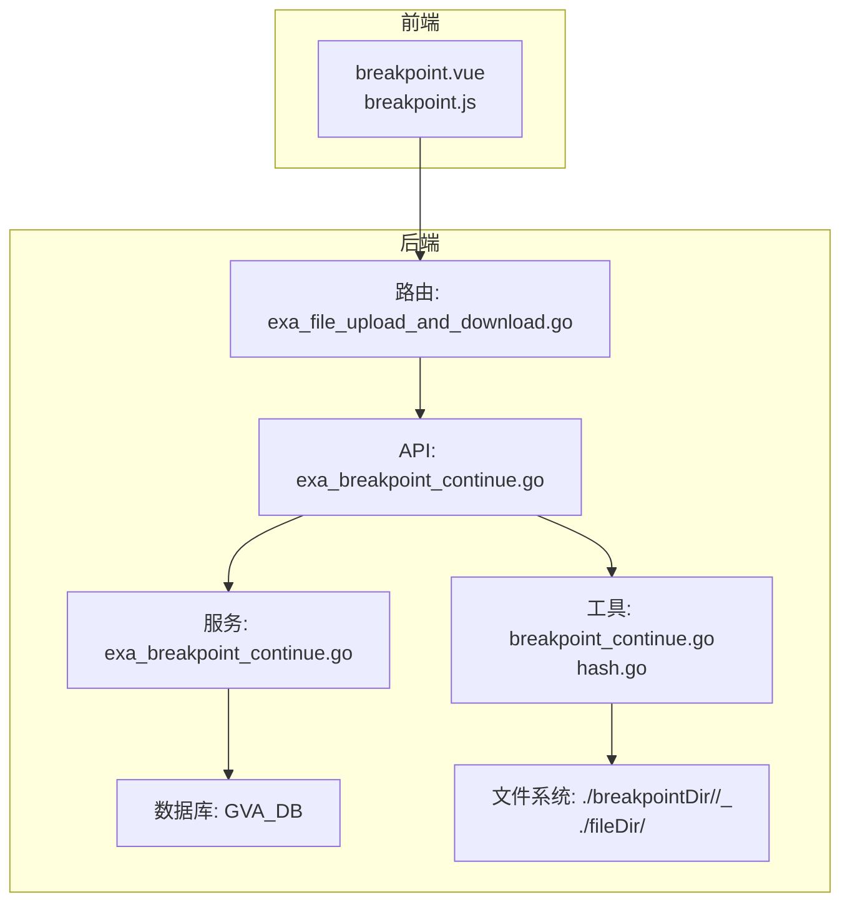
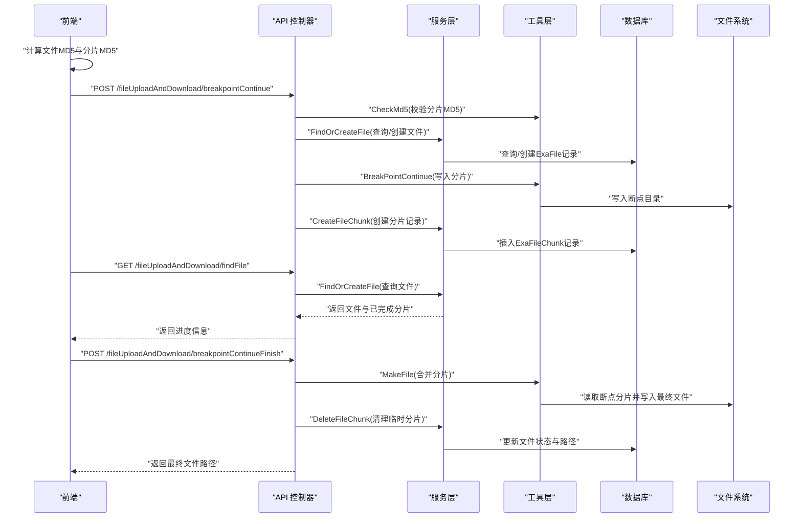
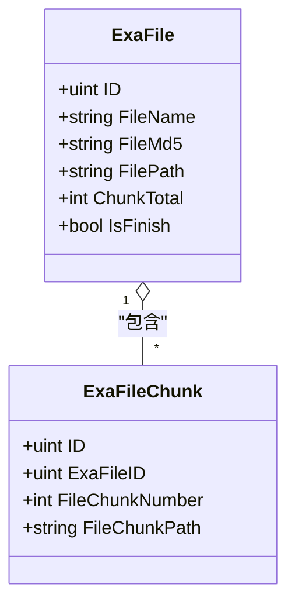
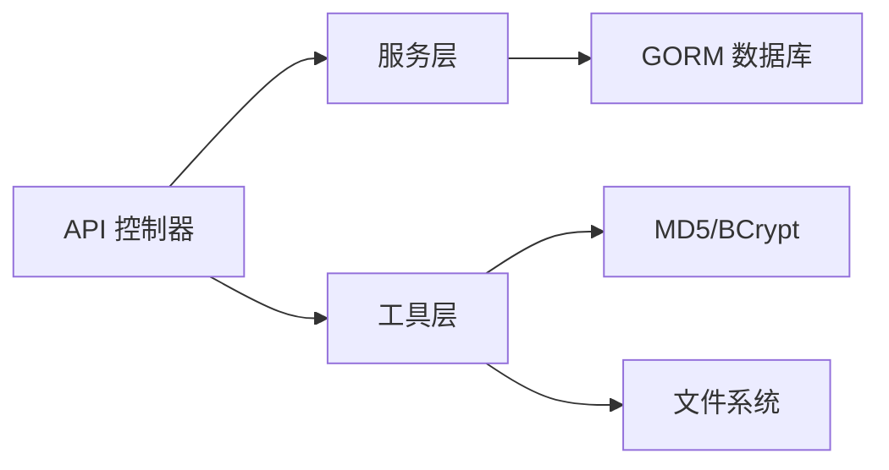
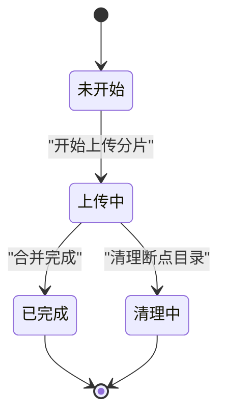

# 断点续传 API

<cite>
**本文档引用的文件**
- [exa_breakpoint_continue.go（API）](file://server/api/v1/example/exa_breakpoint_continue.go)
- [exa_breakpoint_continue.go（服务）](file://server/service/example/exa_breakpoint_continue.go)
- [breakpoint_continue.go（工具）](file://server/utils/breakpoint_continue.go)
- [exa_breakpoint_continue.go（模型）](file://server/model/example/exa_breakpoint_continue.go)
- [exa_breakpoint_continue.go（响应模型）](file://server/model/example/response/exa_breakpoint_continue.go)
- [exa_file_upload_and_download.go（路由）](file://server/router/example/exa_file_upload_and_download.go)
- [breakpoint.js（前端API）](file://web/src/api/breakpoint.js)
- [hash.go（哈希工具）](file://server/utils/hash.go)
- [exa_file_upload_download.go（普通上传API）](file://server/api/v1/example/exa_file_upload_download.go)
- [upload.go（上传适配器）](file://server/utils/upload/upload.go)
</cite>

## 目录
1. [简介](#简介)
2. [项目结构](#项目结构)
3. [核心组件](#核心组件)
4. [架构总览](#架构总览)
5. [详细组件分析](#详细组件分析)
6. [依赖关系分析](#依赖关系分析)
7. [性能考量](#性能考量)
8. [故障排查指南](#故障排查指南)
9. [结论](#结论)
10. [附录](#附录)

## 简介
本文件面向开发者，系统性阐述断点续传 API 的技术实现，覆盖分片上传、文件查询、合并完成、切片清理等核心接口，并深入解析分片 MD5 校验机制、文件记录状态管理、分片进度跟踪等关键技术点。同时提供完整的断点续传流程图与状态转换图，帮助理解复杂的异步处理逻辑；重点描述安全防护措施（路径穿越检测、分片完整性验证等），并给出与文件上传下载 API 的协作关系及大文件传输的最佳实践。

## 项目结构
断点续传能力位于示例业务模块中，采用典型的三层结构：API 控制器负责接口定义与参数解析；服务层负责业务逻辑与数据库操作；工具层负责文件系统与哈希计算等底层能力。前端通过统一的请求封装调用后端接口。

**图表来源**
- [exa_file_upload_and_download.go（路由）:1-23](file://server/router/example/exa_file_upload_and_download.go#L1-L23)
- [exa_breakpoint_continue.go（API）:20-157](file://server/api/v1/example/exa_breakpoint_continue.go#L20-L157)
- [exa_breakpoint_continue.go（服务）:1-72](file://server/service/example/exa_breakpoint_continue.go#L1-L72)
- [breakpoint_continue.go（工具）:15-122](file://server/utils/breakpoint_continue.go#L15-L122)
- [hash.go（哈希工具）:21-32](file://server/utils/hash.go#L21-L32)

**章节来源**
- [exa_file_upload_and_download.go（路由）:1-23](file://server/router/example/exa_file_upload_and_download.go#L1-L23)
- [exa_breakpoint_continue.go（API）:20-157](file://server/api/v1/example/exa_breakpoint_continue.go#L20-L157)
- [exa_breakpoint_continue.go（服务）:1-72](file://server/service/example/exa_breakpoint_continue.go#L1-L72)
- [breakpoint_continue.go（工具）:15-122](file://server/utils/breakpoint_continue.go#L15-L122)
- [hash.go（哈希工具）:21-32](file://server/utils/hash.go#L21-L32)

## 核心组件
- 接口控制器（API 层）
  - 断点续传上传：接收分片字节流与元信息，执行 MD5 校验，落盘到断点目录，记录分片。
  - 文件查询：根据文件 MD5 与名称查询文件记录，返回已完成分片信息。
  - 合并完成：读取断点目录下全部分片，顺序拼接生成最终文件。
  - 切片清理：删除断点目录与数据库中的分片记录。
- 服务层（Service）
  - 文件记录：查找或创建文件记录，预加载分片集合。
  - 分片记录：创建分片记录。
  - 清理收尾：标记文件完成、更新路径、删除分片记录。
- 工具层（Utils）
  - MD5 校验：对分片内容进行哈希比对。
  - 分片落盘：按文件 MD5 与分片序号命名写入断点目录。
  - 合并文件：顺序读取断点分片写入最终目录。
  - 切片清理：删除断点目录。
  - 路径安全：多处进行路径穿越检测与过滤。
- 数据模型（Model）
  - 文件实体：包含文件名、MD5、路径、总分片数、是否完成、分片集合。
  - 分片实体：包含所属文件 ID、分片序号、分片路径。

**章节来源**
- [exa_breakpoint_continue.go（API）:20-157](file://server/api/v1/example/exa_breakpoint_continue.go#L20-L157)
- [exa_breakpoint_continue.go（服务）:16-71](file://server/service/example/exa_breakpoint_continue.go#L16-L71)
- [breakpoint_continue.go（工具）:26-122](file://server/utils/breakpoint_continue.go#L26-L122)
- [exa_breakpoint_continue.go（模型）:7-25](file://server/model/example/exa_breakpoint_continue.go#L7-L25)

## 架构总览
断点续传整体流程分为“分片上传—进度查询—合并完成—清理收尾”四个阶段，贯穿 API、服务、工具与文件系统/数据库四层。

**图表来源**
- [exa_breakpoint_continue.go（API）:29-121](file://server/api/v1/example/exa_breakpoint_continue.go#L29-L121)
- [exa_breakpoint_continue.go（服务）:21-71](file://server/service/example/exa_breakpoint_continue.go#L21-L71)
- [breakpoint_continue.go（工具）:45-107](file://server/utils/breakpoint_continue.go#L45-L107)

## 详细组件分析

### 接口控制器（API）
- 断点续传上传（POST /fileUploadAndDownload/breakpointContinue）
  - 参数：fileMd5、fileName、chunkNumber、chunkTotal、chunkMd5、file（multipart）
  - 处理流程：
    1) 从表单读取分片字节流；
    2) 执行 MD5 校验（与 chunkMd5 比对）；
    3) 调用服务层查找或创建文件记录；
    4) 调用工具层写入断点目录；
    5) 记录分片信息到数据库。
- 文件查询（GET /fileUploadAndDownload/findFile）
  - 参数：fileMd5、fileName、chunkTotal
  - 返回：文件记录（含已完成分片集合）
- 合并完成（POST /fileUploadAndDownload/breakpointContinueFinish）
  - 参数：fileMd5、fileName
  - 处理：顺序读取断点目录下所有分片，写入最终目录
- 切片清理（POST /fileUploadAndDownload/removeChunk）
  - 参数：fileMd5、fileName、filePath（JSON）
  - 安全：严格路径穿越检测，仅允许合法路径删除

**章节来源**
- [exa_breakpoint_continue.go（API）:29-157](file://server/api/v1/example/exa_breakpoint_continue.go#L29-L157)

### 服务层（Service）
- FindOrCreateFile
  - 若存在已完成文件，则直接返回；
  - 否则按 fileMd5 与 fileName 查询未完成文件，若不存在则创建；
  - 返回文件实体（含预加载的分片集合）
- CreateFileChunk
  - 创建分片记录（ExaFileChunk）
- DeleteFileChunk
  - 更新文件状态为完成、写入最终路径；
  - 删除该文件的所有分片记录

**章节来源**
- [exa_breakpoint_continue.go（服务）:21-71](file://server/service/example/exa_breakpoint_continue.go#L21-L71)

### 工具层（Utils）
- BreakPointContinue
  - 安全校验：禁止文件名或 MD5 包含路径穿越字符；
  - 创建断点目录（按 fileMd5 分桶）；
  - 按“文件名_分片序号”命名写入分片文件
- CheckMd5
  - 计算分片内容 MD5，与 chunkMd5 比对，一致方可继续
- MakeFile
  - 读取断点目录下全部分片，顺序写入最终文件；
  - 发生错误时回滚已写入的最终文件
- RemoveChunk
  - 删除断点目录（按 fileMd5）

**章节来源**
- [breakpoint_continue.go（工具）:26-122](file://server/utils/breakpoint_continue.go#L26-L122)
- [hash.go（哈希工具）:27-31](file://server/utils/hash.go#L27-L31)

### 数据模型（Model）
- 文件实体（ExaFile）
  - 关键字段：文件名、MD5、路径、总分片数、是否完成、分片集合
- 分片实体（ExaFileChunk）
  - 关键字段：所属文件 ID、分片序号、分片路径

**图表来源**
- [exa_breakpoint_continue.go（模型）:7-25](file://server/model/example/exa_breakpoint_continue.go#L7-L25)

### 前后端协作与接口调用示例
- 前端调用
  - findFile(params)：查询文件进度
  - breakpointContinue(data)：分片上传（multipart/form-data）
  - breakpointContinueFinish(params)：合并完成
  - removeChunk(data, params)：清理切片
- 典型调用序列
  - 前端先调用 findFile 获取已完成分片；
  - 基于缺失分片循环调用 breakpointContinue 上传；
  - 全部完成后调用 breakpointContinueFinish 合并；
  - 成功后可选择调用 removeChunk 清理断点目录

**章节来源**
- [breakpoint.js（前端API）:10-44](file://web/src/api/breakpoint.js#L10-L44)

### 安全防护措施
- 路径穿越检测
  - 在 RemoveChunk、BreakPointContinue、MakeFile、RemoveChunk 等关键函数中，严格过滤包含“..”、“./”、“.\”等字符的路径
- 分片完整性验证
  - 每个分片上传前必须通过 CheckMd5 校验，确保内容与声明一致
- 错误回滚
  - 合并失败时删除已写入的最终文件，避免产生半成品文件

**章节来源**
- [exa_breakpoint_continue.go（API）:139-143](file://server/api/v1/example/exa_breakpoint_continue.go#L139-L143)
- [breakpoint_continue.go（工具）:27-29](file://server/utils/breakpoint_continue.go#L27-L29)
- [breakpoint_continue.go（工具）:85-87](file://server/utils/breakpoint_continue.go#L85-L87)
- [breakpoint_continue.go（工具）:102-104](file://server/utils/breakpoint_continue.go#L102-L104)

### 与文件上传下载 API 的协作关系
- 普通上传（非断点续传）
  - 提供标准文件上传接口，适用于中小文件或不需要断点续传的场景
- 断点续传
  - 适用于大文件与弱网环境，具备更高的可靠性与用户体验
- 协作建议
  - 小文件走普通上传，大文件走断点续传；
  - 两者共享同一路由组与鉴权体系，便于统一管理

**章节来源**
- [exa_file_upload_download.go（普通上传API）:25-42](file://server/api/v1/example/exa_file_upload_download.go#L25-L42)
- [exa_file_upload_and_download.go（路由）:16-21](file://server/router/example/exa_file_upload_and_download.go#L16-L21)

## 依赖关系分析
- 组件耦合
  - API 依赖服务层与工具层，服务层依赖数据库，工具层依赖文件系统与哈希库
- 外部依赖
  - 使用 GORM 进行数据库操作
  - 使用 crypto/md5 与 x/crypto/bcrypt 进行哈希与加密
  - 使用 Gin 路由与中间件体系

**图表来源**
- [exa_breakpoint_continue.go（API）:29-78](file://server/api/v1/example/exa_breakpoint_continue.go#L29-L78)
- [exa_breakpoint_continue.go（服务）:21-50](file://server/service/example/exa_breakpoint_continue.go#L21-L50)
- [breakpoint_continue.go（工具）:45-52](file://server/utils/breakpoint_continue.go#L45-L52)
- [hash.go（哈希工具）:27-31](file://server/utils/hash.go#L27-L31)

**章节来源**
- [exa_breakpoint_continue.go（API）:29-78](file://server/api/v1/example/exa_breakpoint_continue.go#L29-L78)
- [exa_breakpoint_continue.go（服务）:21-50](file://server/service/example/exa_breakpoint_continue.go#L21-L50)
- [breakpoint_continue.go（工具）:45-52](file://server/utils/breakpoint_continue.go#L45-L52)
- [hash.go（哈希工具）:27-31](file://server/utils/hash.go#L27-L31)

## 性能考量
- 切片大小
  - 默认 1MB，可根据网络环境调整；过大影响并发与重试成本，过小增加请求开销
- 并发上传
  - 前端可限制并发切片数量，避免过多 I/O 竞争
- MD5 计算
  - 建议在主线程外异步计算，避免阻塞 UI
- 存储写入
  - 合并阶段按序追加写入，减少随机 I/O
- 数据库压力
  - 切片记录频繁写入，建议合理索引与批量写入策略
- 云存储迁移
  - 如需高可用与跨地域分发，可替换为 MinIO/AWS S3 等对象存储

## 故障排查指南
- 常见错误与定位
  - MD5 校验失败：检查前端分片计算与后端校验是否一致
  - 路径穿越拦截：确认 fileMd5、fileName、filePath 不包含非法字符
  - 断点目录写入失败：检查磁盘权限与空间
  - 合并失败回滚：关注最终文件是否被删除
- 日志与响应
  - API 层统一记录错误日志并通过响应封装返回
  - 建议前端对 4xx/5xx 错误进行重试与提示

**章节来源**
- [exa_breakpoint_continue.go（API）:36-58](file://server/api/v1/example/exa_breakpoint_continue.go#L36-L58)
- [exa_breakpoint_continue.go（API）:139-143](file://server/api/v1/example/exa_breakpoint_continue.go#L139-L143)
- [breakpoint_continue.go（工具）:85-106](file://server/utils/breakpoint_continue.go#L85-L106)

## 结论
断点续传 API 通过“MD5 校验 + 分片落盘 + 进度查询 + 合并收尾”的闭环设计，在保证数据一致性的同时提升了大文件传输的可靠性与用户体验。配合严格的路径穿越检测与错误回滚机制，能够在复杂网络环境下稳定运行。建议在生产环境中结合前端并发控制、合理的切片大小与数据库索引策略，进一步提升整体性能与稳定性。

## 附录

### 接口定义（后端）
- 断点续传上传
  - 方法：POST
  - 路径：/fileUploadAndDownload/breakpointContinue
  - 表单字段：fileMd5、fileName、chunkNumber、chunkTotal、chunkMd5、file（multipart）
- 查询文件
  - 方法：GET
  - 路径：/fileUploadAndDownload/findFile
  - 查询参数：fileMd5、fileName、chunkTotal
- 合并文件
  - 方法：POST
  - 路径：/fileUploadAndDownload/breakpointContinueFinish
  - 查询参数：fileMd5、fileName
- 清理切片
  - 方法：POST
  - 路径：/fileUploadAndDownload/removeChunk
  - 请求体：fileMd5、fileName、filePath

**章节来源**
- [exa_breakpoint_continue.go（API）:29-157](file://server/api/v1/example/exa_breakpoint_continue.go#L29-L157)

### 前端调用（简化）
- findFile(params)
- breakpointContinue(data)
- breakpointContinueFinish(params)
- removeChunk(data, params)

**章节来源**
- [breakpoint.js（前端API）:10-44](file://web/src/api/breakpoint.js#L10-L44)

### 状态转换图（文件记录）

[本图为概念性状态图，无需特定文件引用]