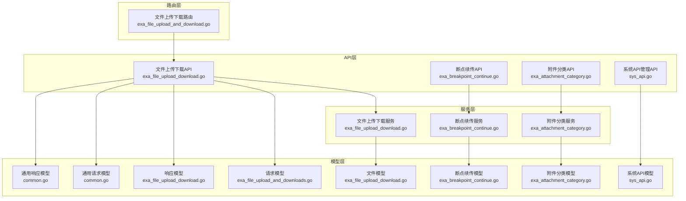
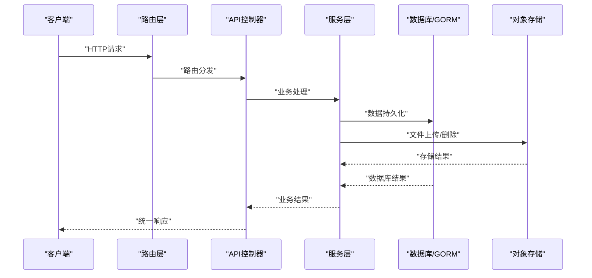
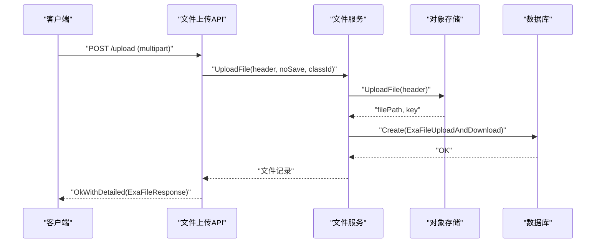
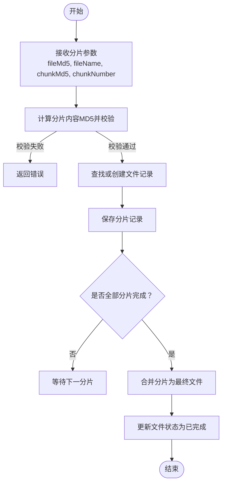
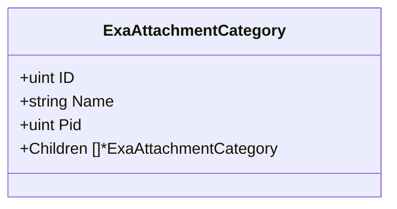
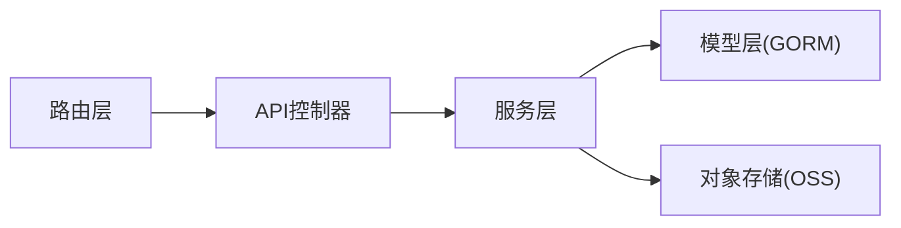
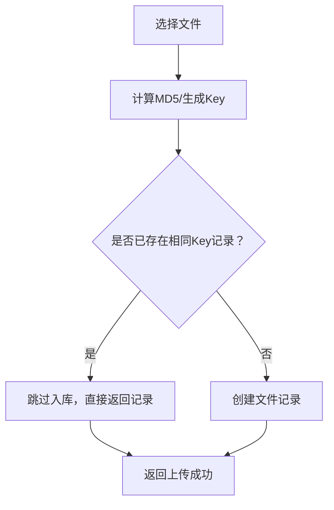

# 测试管理 API

<cite>
**本文引用的文件**
- [测试管理API.md](file://repowiki/zh/content/API文档/测试管理API.md)
- [exa_file_upload_download.go](file://server/api/v1/example/exa_file_upload_download.go)
- [exa_breakpoint_continue.go](file://server/api/v1/example/exa_breakpoint_continue.go)
- [exa_attachment_category.go](file://server/api/v1/example/exa_attachment_category.go)
- [exa_file_upload_and_download.go](file://server/router/example/exa_file_upload_and_download.go)
- [exa_file_upload_download.go](file://server/service/example/exa_file_upload_download.go)
- [exa_breakpoint_continue.go](file://server/service/example/exa_breakpoint_continue.go)
- [exa_attachment_category.go](file://server/service/example/exa_attachment_category.go)
- [exa_file_upload_download.go](file://server/model/example/exa_file_upload_download.go)
- [exa_breakpoint_continue.go](file://server/model/example/exa_breakpoint_continue.go)
- [exa_attachment_category.go](file://server/model/example/exa_attachment_category.go)
- [exa_file_upload_and_downloads.go](file://server/model/example/request/exa_file_upload_and_downloads.go)
- [exa_file_upload_download.go](file://server/model/example/response/exa_file_upload_download.go)
- [common.go](file://server/model/common/request/common.go)
- [common.go](file://server/model/common/response/common.go)
- [sys_api.go](file://server/model/system/sys_api.go)
- [sys_api.go](file://server/api/v1/system/sys_api.go)
</cite>

## 目录
1. [简介](#简介)
2. [项目结构](#项目结构)
3. [核心组件](#核心组件)
4. [架构总览](#架构总览)
5. [详细组件分析](#详细组件分析)
6. [依赖分析](#依赖分析)
7. [性能考虑](#性能考虑)
8. [故障排查指南](#故障排查指南)
9. [结论](#结论)
10. [附录](#附录)

## 简介
本文件面向测试管理模块，提供完整的API文档，覆盖以下能力：
- 测试用例管理：通过系统API管理接口，支持API的增删改查与分组查询，便于测试用例的统一入口与权限控制。
- 文件上传与下载：提供单文件上传、URL导入、分页列表、删除与重命名等能力，支持多种存储后端（本地/云存储）。
- 断点续传：基于MD5校验与分片管理，实现大文件的断点续传与最终合并。
- 附件分类：提供附件分类的增删改查与树形结构展示，支持父子关系管理。
- 测试执行记录与缺陷跟踪：通过系统API能力进行扩展与集成，结合附件管理实现测试结果与缺陷附件的统一归档。

本API文档以“接口+数据模型+流程图+错误处理”的方式组织，既适合开发者快速对接，也便于测试人员理解业务流程。

## 项目结构
测试管理相关模块采用典型的分层架构：
- API层：定义路由与HTTP接口，负责请求解析与响应封装。
- 服务层：封装业务逻辑，协调数据库与存储服务。
- 模型层：定义数据表结构与请求/响应模型。
- 路由层：注册API路由，绑定控制器。

图表来源
- [exa_file_upload_download.go:1-136](file://server/api/v1/example/exa_file_upload_download.go#L1-L136)
- [exa_breakpoint_continue.go:1-157](file://server/api/v1/example/exa_breakpoint_continue.go#L1-L157)
- [exa_attachment_category.go:1-83](file://server/api/v1/example/exa_attachment_category.go#L1-L83)
- [exa_file_upload_and_download.go:1-23](file://server/router/example/exa_file_upload_and_download.go#L1-L23)
- [exa_file_upload_download.go:1-131](file://server/service/example/exa_file_upload_download.go#L1-L131)
- [exa_breakpoint_continue.go:1-72](file://server/service/example/exa_breakpoint_continue.go#L1-L72)
- [exa_attachment_category.go:1-67](file://server/service/example/exa_attachment_category.go#L1-L67)
- [exa_file_upload_download.go:1-19](file://server/model/example/exa_file_upload_download.go#L1-L19)
- [exa_breakpoint_continue.go:1-25](file://server/model/example/exa_breakpoint_continue.go#L1-L25)
- [exa_attachment_category.go:1-17](file://server/model/example/exa_attachment_category.go#L1-L17)
- [exa_file_upload_and_downloads.go:1-11](file://server/model/example/request/exa_file_upload_and_downloads.go#L1-L11)
- [exa_file_upload_download.go:1-8](file://server/model/example/response/exa_file_upload_download.go#L1-L8)
- [common.go:1-49](file://server/model/common/request/common.go#L1-L49)
- [common.go:1-9](file://server/model/common/response/common.go#L1-L9)
- [sys_api.go:1-29](file://server/model/system/sys_api.go#L1-L29)
- [sys_api.go:1-200](file://server/api/v1/system/sys_api.go#L1-L200)

章节来源
- [exa_file_upload_download.go:1-136](file://server/api/v1/example/exa_file_upload_download.go#L1-L136)
- [exa_breakpoint_continue.go:1-157](file://server/api/v1/example/exa_breakpoint_continue.go#L1-L157)
- [exa_attachment_category.go:1-83](file://server/api/v1/example/exa_attachment_category.go#L1-L83)
- [exa_file_upload_and_download.go:1-23](file://server/router/example/exa_file_upload_and_download.go#L1-L23)

## 核心组件
- 文件上传下载API：提供上传、删除、重命名、分页列表、URL导入等接口。
- 断点续传API：提供分片上传、进度查询、完成合并、切片清理等接口。
- 附件分类API：提供分类增删改查与树形列表。
- 系统API管理API：提供API的创建、同步、分组、忽略与删除等接口，支撑测试用例统一入口与权限控制。

章节来源
- [exa_file_upload_download.go:1-136](file://server/api/v1/example/exa_file_upload_download.go#L1-L136)
- [exa_breakpoint_continue.go:1-157](file://server/api/v1/example/exa_breakpoint_continue.go#L1-L157)
- [exa_attachment_category.go:1-83](file://server/api/v1/example/exa_attachment_category.go#L1-L83)
- [sys_api.go:1-200](file://server/api/v1/system/sys_api.go#L1-L200)

## 架构总览
测试管理API遵循“路由-控制器-服务-模型-存储”的分层设计，所有接口均使用统一的响应封装与日志记录，确保可维护性与可观测性。

图表来源
- [exa_file_upload_and_download.go:1-23](file://server/router/example/exa_file_upload_and_download.go#L1-L23)
- [exa_file_upload_download.go:1-136](file://server/api/v1/example/exa_file_upload_download.go#L1-L136)
- [exa_file_upload_download.go:1-131](file://server/service/example/exa_file_upload_download.go#L1-L131)

## 详细组件分析

### 文件上传与下载API
- 接口概览
  - 上传文件：POST /fileUploadAndDownload/upload
  - 编辑文件名/备注：POST /fileUploadAndDownload/editFileName
  - 删除文件：POST /fileUploadAndDownload/deleteFile
  - 分页文件列表：POST /fileUploadAndDownload/getFileList
  - 导入URL：POST /fileUploadAndDownload/importURL

- 请求与响应
  - 请求模型：ExaAttachmentCategorySearch（分页信息、分类ID）
  - 响应模型：PageResult（列表、总数、页码、每页数量）
  - 单文件响应：ExaFileResponse（包含文件详情）

- 处理流程
  - 上传流程：接收文件 -> 选择存储后端 -> 生成Key/路径 -> 可选入库
  - 删除流程：根据ID查询记录 -> 对象存储删除 -> 数据库软删除
  - 列表流程：关键词/分类过滤 -> 分页查询 -> 返回总数与列表

图表来源
- [exa_file_upload_download.go:16-42](file://server/api/v1/example/exa_file_upload_download.go#L16-L42)
- [exa_file_upload_download.go:96-120](file://server/service/example/exa_file_upload_download.go#L96-L120)

章节来源
- [exa_file_upload_download.go:16-136](file://server/api/v1/example/exa_file_upload_download.go#L16-L136)
- [exa_file_upload_download.go:21-131](file://server/service/example/exa_file_upload_download.go#L21-L131)
- [exa_file_upload_and_downloads.go:1-11](file://server/model/example/request/exa_file_upload_and_downloads.go#L1-L11)
- [exa_file_upload_download.go:1-8](file://server/model/example/response/exa_file_upload_download.go#L1-L8)
- [common.go:1-9](file://server/model/common/response/common.go#L1-L9)

### 断点续传API
- 接口概览
  - 断点续传：POST /fileUploadAndDownload/breakpointContinue
  - 查询文件：GET /fileUploadAndDownload/findFile
  - 完成合并：POST /fileUploadAndDownload/breakpointContinueFinish
  - 删除切片：POST /fileUploadAndDownload/removeChunk

- 核心流程
  - 分片校验：前端按顺序上传分片，后端校验MD5
  - 记录管理：查找或创建文件记录，写入分片记录
  - 合并完成：当所有分片完成后，触发合并，更新文件状态与路径
  - 切片清理：安全路径校验后删除临时切片与记录

图表来源
- [exa_breakpoint_continue.go:20-78](file://server/api/v1/example/exa_breakpoint_continue.go#L20-L78)
- [exa_breakpoint_continue.go:21-50](file://server/service/example/exa_breakpoint_continue.go#L21-L50)

章节来源
- [exa_breakpoint_continue.go:20-157](file://server/api/v1/example/exa_breakpoint_continue.go#L20-L157)
- [exa_breakpoint_continue.go:21-72](file://server/service/example/exa_breakpoint_continue.go#L21-L72)
- [exa_breakpoint_continue.go:1-25](file://server/model/example/exa_breakpoint_continue.go#L1-L25)

### 附件分类API
- 接口概览
  - 获取分类列表：GET /attachmentCategory/getCategoryList
  - 新增/更新分类：POST /attachmentCategory/addCategory
  - 删除分类：POST /attachmentCategory/deleteCategory

- 业务规则
  - 分类名称在同一父节点下唯一
  - 删除前需先删除子级分类
  - 支持树形结构返回（Children）

图表来源
- [exa_attachment_category.go:1-17](file://server/model/example/exa_attachment_category.go#L1-L17)

章节来源
- [exa_attachment_category.go:14-83](file://server/api/v1/example/exa_attachment_category.go#L14-L83)
- [exa_attachment_category.go:12-67](file://server/service/example/exa_attachment_category.go#L12-L67)
- [exa_attachment_category.go:1-17](file://server/model/example/exa_attachment_category.go#L1-L17)

### 系统API管理API（支撑测试用例统一入口）
- 接口概览
  - 创建API：POST /api/createApi
  - 同步API：GET /api/syncApi
  - 获取API分组：GET /api/getApiGroups
  - 忽略API：POST /api/ignoreApi
  - 确认同步API：POST /api/enterSyncApi
  - 删除API：POST /api/deleteApi
  - 分页获取API列表：POST /api/getApiList

- 作用
  - 统一管理测试用例相关的API，便于权限控制与访问审计
  - 支持自动同步与忽略策略，保证测试平台API清单一致性

章节来源
- [sys_api.go:18-200](file://server/api/v1/system/sys_api.go#L18-L200)
- [sys_api.go:1-29](file://server/model/system/sys_api.go#L1-L29)

## 依赖分析
- 控制器到服务：API层通过依赖注入的服务实例执行业务逻辑，解耦控制器与具体实现。
- 服务到模型：服务层使用GORM对数据库进行CRUD操作，模型定义表结构与字段注释。
- 服务到存储：文件上传服务通过对象存储抽象（OSS）实现多后端支持（本地/云存储），提升可移植性。
- 路由到控制器：路由层集中注册，避免重复与遗漏，便于统一鉴权与中间件接入。

图表来源
- [exa_file_upload_and_download.go:1-23](file://server/router/example/exa_file_upload_and_download.go#L1-L23)
- [exa_file_upload_download.go:1-136](file://server/api/v1/example/exa_file_upload_download.go#L1-L136)
- [exa_file_upload_download.go:1-131](file://server/service/example/exa_file_upload_download.go#L1-L131)

章节来源
- [exa_file_upload_and_download.go:1-23](file://server/router/example/exa_file_upload_and_download.go#L1-L23)
- [exa_file_upload_download.go:1-136](file://server/api/v1/example/exa_file_upload_download.go#L1-L136)
- [exa_file_upload_download.go:1-131](file://server/service/example/exa_file_upload_download.go#L1-L131)

## 性能考虑
- 分页查询：统一使用PageInfo进行分页，限制最大页大小，避免一次性返回大量数据。
- 存储后端：对象存储支持多后端适配，建议在高并发场景选择具备高可用与限流能力的后端。
- 断点续传：分片大小与并发度需平衡网络抖动与服务器压力；建议前端按序上传并启用MD5校验。
- 日志与监控：接口层统一使用zap日志，建议结合链路追踪与指标采集，定位性能瓶颈。

## 故障排查指南
- 上传失败
  - 检查文件大小与类型限制、存储后端可用性
  - 查看日志中“接收文件失败”“上传文件失败”等错误
- 删除失败
  - 确认文件Key是否存在、对象存储删除是否成功
  - 检查数据库软删除是否执行
- 断点续传异常
  - 校验分片MD5是否一致
  - 确认分片记录是否正确写入、文件记录状态是否更新
- 分类删除失败
  - 先删除子级分类，再删除父级
- API管理异常
  - 检查API分组与方法是否匹配，同步策略是否正确

章节来源
- [exa_file_upload_download.go:30-41](file://server/api/v1/example/exa_file_upload_download.go#L30-L41)
- [exa_file_upload_download.go:43-55](file://server/service/example/exa_file_upload_download.go#L43-L55)
- [exa_breakpoint_continue.go:54-58](file://server/api/v1/example/exa_breakpoint_continue.go#L54-L58)
- [exa_attachment_category.go:37-44](file://server/service/example/exa_attachment_category.go#L37-L44)
- [sys_api.go:34-46](file://server/api/v1/system/sys_api.go#L34-L46)

## 结论
测试管理API围绕“文件管理+断点续传+附件分类+系统API管理”构建，形成完整的测试数据生命周期闭环。通过统一的响应封装、分层设计与对象存储抽象，系统具备良好的可维护性与扩展性。建议在生产环境中配合完善的鉴权、日志与监控体系，确保测试数据的安全与完整性。

## 附录

### 接口一览与调用示例（路径指引）
- 文件上传
  - POST /fileUploadAndDownload/upload
  - 示例请求：multipart/form-data，字段包含 file、classId、noSave
  - 响应：包含文件详情
  - 参考路径：[exa_file_upload_download.go:25-42](file://server/api/v1/example/exa_file_upload_download.go#L25-L42)
- 编辑文件名/备注
  - POST /fileUploadAndDownload/editFileName
  - 请求体：ExaFileUploadAndDownload（含ID与新名称）
  - 参考路径：[exa_file_upload_download.go:44-59](file://server/api/v1/example/exa_file_upload_download.go#L44-L59)
- 删除文件
  - POST /fileUploadAndDownload/deleteFile
  - 请求体：ExaFileUploadAndDownload（含ID）
  - 参考路径：[exa_file_upload_download.go:61-82](file://server/api/v1/example/exa_file_upload_download.go#L61-L82)
- 分页文件列表
  - POST /fileUploadAndDownload/getFileList
  - 请求体：ExaAttachmentCategorySearch（分页、关键字、分类ID）
  - 响应：PageResult
  - 参考路径：[exa_file_upload_download.go:84-112](file://server/api/v1/example/exa_file_upload_download.go#L84-L112)
- 导入URL
  - POST /fileUploadAndDownload/importURL
  - 请求体：ExaFileUploadAndDownload数组
  - 参考路径：[exa_file_upload_download.go:114-135](file://server/api/v1/example/exa_file_upload_download.go#L114-L135)

- 断点续传
  - POST /fileUploadAndDownload/breakpointContinue
  - 参数：fileMd5、fileName、chunkMd5、chunkNumber、chunkTotal、file（分片）
  - 参考路径：[exa_breakpoint_continue.go:29-78](file://server/api/v1/example/exa_breakpoint_continue.go#L29-L78)
- 查询文件
  - GET /fileUploadAndDownload/findFile
  - 参数：fileMd5、fileName、chunkTotal
  - 参考路径：[exa_breakpoint_continue.go:80-100](file://server/api/v1/example/exa_breakpoint_continue.go#L80-L100)
- 完成合并
  - POST /fileUploadAndDownload/breakpointContinueFinish
  - 参数：fileMd5、fileName
  - 参考路径：[exa_breakpoint_continue.go:102-121](file://server/api/v1/example/exa_breakpoint_continue.go#L102-L121)
- 删除切片
  - POST /fileUploadAndDownload/removeChunk
  - 请求体：ExaFile（含FilePath、FileMd5）
  - 参考路径：[exa_breakpoint_continue.go:123-157](file://server/api/v1/example/exa_breakpoint_continue.go#L123-L157)

- 附件分类
  - GET /attachmentCategory/getCategoryList
  - 参考路径：[exa_attachment_category.go:14-29](file://server/api/v1/example/exa_attachment_category.go#L14-L29)
  - POST /attachmentCategory/addCategory
  - 请求体：ExaAttachmentCategory（新增/更新）
  - 参考路径：[exa_attachment_category.go:31-53](file://server/api/v1/example/exa_attachment_category.go#L31-L53)
  - POST /attachmentCategory/deleteCategory
  - 请求体：GetById（含ID）
  - 参考路径：[exa_attachment_category.go:55-82](file://server/api/v1/example/exa_attachment_category.go#L55-L82)

- 系统API管理
  - POST /api/createApi
  - GET /api/syncApi
  - GET /api/getApiGroups
  - POST /api/ignoreApi
  - POST /api/enterSyncApi
  - POST /api/deleteApi
  - POST /api/getApiList
  - 参考路径：[sys_api.go:18-200](file://server/api/v1/system/sys_api.go#L18-L200)

### 数据模型定义（路径指引）
- 文件模型
  - ExaFileUploadAndDownload：文件名、分类ID、URL、标签、编号、通用字段
  - 参考路径：[exa_file_upload_download.go:7-14](file://server/model/example/exa_file_upload_download.go#L7-L14)
- 断点续传模型
  - ExaFile：文件名、MD5、路径、分片集合、总分片数、是否完成
  - ExaFileChunk：所属文件ID、分片序号、分片路径
  - 参考路径：[exa_breakpoint_continue.go:8-24](file://server/model/example/exa_breakpoint_continue.go#L8-L24)
- 附件分类模型
  - ExaAttachmentCategory：名称、父节点ID、子节点集合
  - 参考路径：[exa_attachment_category.go:7-12](file://server/model/example/exa_attachment_category.go#L7-L12)
- 请求/响应模型
  - ExaAttachmentCategorySearch：分类ID、分页信息
  - ExaFileResponse：文件详情
  - PageResult：列表、总数、页码、每页数量
  - 参考路径：
    - [exa_file_upload_and_downloads.go:7-10](file://server/model/example/request/exa_file_upload_and_downloads.go#L7-L10)
    - [exa_file_upload_download.go:5-7](file://server/model/example/response/exa_file_upload_download.go#L5-L7)
    - [common.go:3-8](file://server/model/common/response/common.go#L3-L8)
- 通用请求模型
  - PageInfo：页码、每页大小、关键字
  - GetById：主键ID
  - 参考路径：[common.go:8-41](file://server/model/common/request/common.go#L8-L41)

### 文件上传流程（概念示意）

[此图为概念示意，不对应具体源码文件]

### 断点续传机制（技术要点）
- 分片校验：前端对每个分片计算MD5并与后端传入的chunkMd5比对
- 进度记录：每次成功后写入分片记录，并更新文件状态
- 完整性：当所有分片完成后，触发合并，设置is_finish=true并写入最终路径
- 安全性：删除切片时进行路径穿越检测，防止误删

章节来源
- [exa_breakpoint_continue.go:54-78](file://server/api/v1/example/exa_breakpoint_continue.go#L54-L78)
- [exa_breakpoint_continue.go:58-71](file://server/service/example/exa_breakpoint_continue.go#L58-L71)
- [exa_breakpoint_continue.go:139-156](file://server/api/v1/example/exa_breakpoint_continue.go#L139-L156)

### 测试数据安全性与完整性保障
- 安全性
  - 路径穿越防护：删除切片时严格校验路径，拒绝包含..或./等危险字符
  - 鉴权：所有文件相关接口均使用ApiKeyAuth鉴权
- 完整性
  - MD5校验：断点续传中对分片内容进行MD5校验
  - 幂等入库：上传时按Key去重，避免重复记录
  - 状态机：文件记录包含is_finish字段，确保最终状态明确

章节来源
- [exa_breakpoint_continue.go:139-156](file://server/api/v1/example/exa_breakpoint_continue.go#L139-L156)
- [exa_file_upload_download.go:18-24](file://server/api/v1/example/exa_file_upload_download.go#L18-L24)
- [exa_file_upload_download.go:112-118](file://server/service/example/exa_file_upload_download.go#L112-L118)