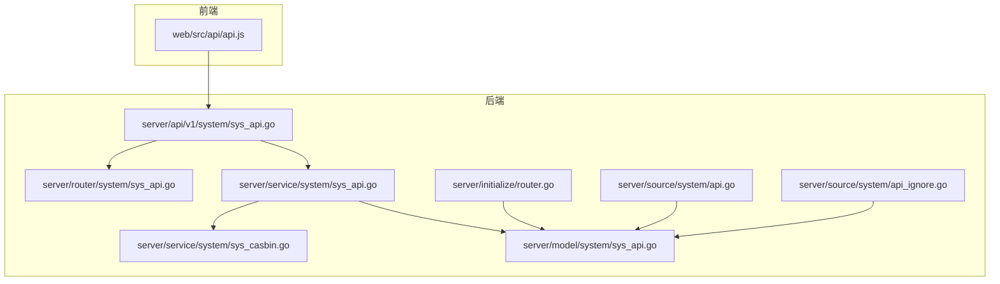
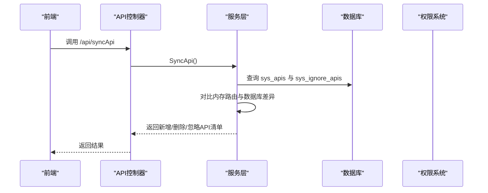
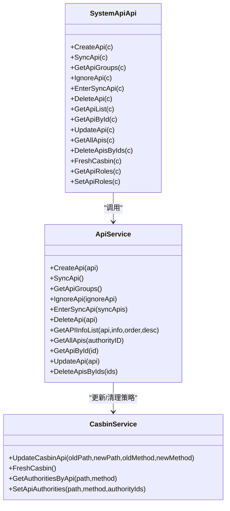
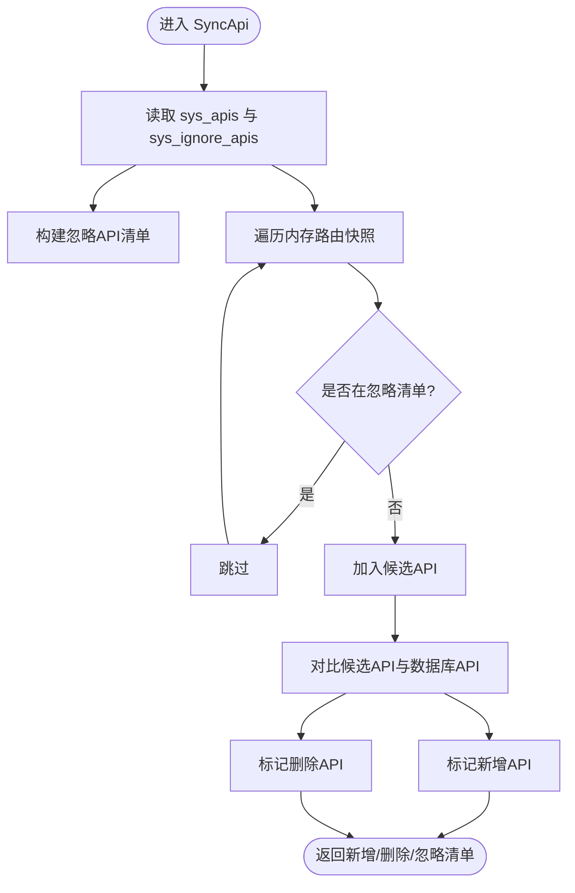
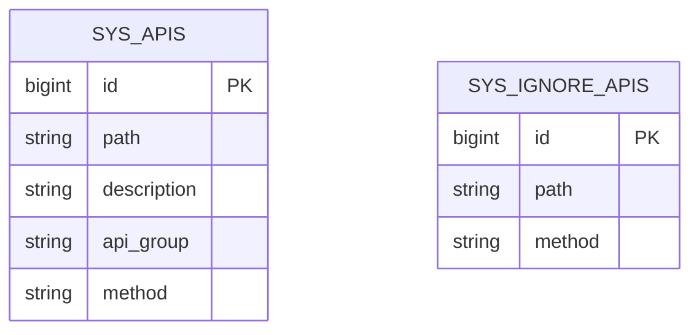
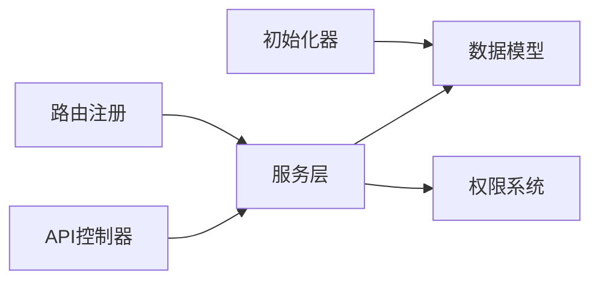

# 系统API管理 API

<cite>
**本文引用的文件**
- [server/api/v1/system/sys_api.go](file://server/api/v1/system/sys_api.go)
- [server/router/system/sys_api.go](file://server/router/system/sys_api.go)
- [server/service/system/sys_api.go](file://server/service/system/sys_api.go)
- [server/service/system/sys_casbin.go](file://server/service/system/sys_casbin.go)
- [server/model/system/sys_api.go](file://server/model/system/sys_api.go)
- [server/model/system/request/sys_api.go](file://server/model/system/request/sys_api.go)
- [server/model/system/response/sys_api.go](file://server/model/system/response/sys_api.go)
- [server/source/system/api.go](file://server/source/system/api.go)
- [server/source/system/api_ignore.go](file://server/source/system/api_ignore.go)
- [server/initialize/router.go](file://server/initialize/router.go)
- [web/src/api/api.js](file://web/src/api/api.js)
</cite>

## 目录
1. [简介](#简介)
2. [项目结构](#项目结构)
3. [核心组件](#核心组件)
4. [架构总览](#架构总览)
5. [详细组件分析](#详细组件分析)
6. [依赖分析](#依赖分析)
7. [性能考量](#性能考量)
8. [故障排查指南](#故障排查指南)
9. [结论](#结论)
10. [附录](#附录)

## 简介
本文件面向开发者与测试工程师，系统性阐述“系统API管理”模块的技术实现与最佳实践。围绕测试用例统一入口中的API管理能力，重点解析以下关键能力：
- API创建、同步、分组、忽略、确认同步、删除、分页查询等接口
- API清单管理的业务流程：自动同步策略、忽略规则配置、权限控制集成
- 完整API管理流程示例：自动发现、手动创建、批量管理
- API分组机制、方法匹配规则、版本管理策略
- 与权限控制系统、审计日志、API文档生成等模块的集成关系
- 配置管理、监控告警、故障排查的实用指南

## 项目结构
系统API管理位于后端服务的系统模块下，采用典型的MVC分层：
- API层：接收HTTP请求，校验参数，调用服务层，返回响应
- 服务层：封装业务逻辑，协调数据库与权限系统
- 数据模型：定义API与忽略规则的数据结构
- 初始化：自动迁移与内置API/忽略规则数据初始化
- 前端：通过统一API适配器调用后端接口

**图示来源**
- [server/api/v1/system/sys_api.go:1-382](file://server/api/v1/system/sys_api.go#L1-L382)
- [server/router/system/sys_api.go:1-36](file://server/router/system/sys_api.go#L1-L36)
- [server/service/system/sys_api.go:1-327](file://server/service/system/sys_api.go#L1-L327)
- [server/service/system/sys_casbin.go:1-216](file://server/service/system/sys_casbin.go#L1-L216)
- [server/model/system/sys_api.go:1-29](file://server/model/system/sys_api.go#L1-L29)
- [server/source/system/api.go:1-277](file://server/source/system/api.go#L1-L277)
- [server/source/system/api_ignore.go:1-79](file://server/source/system/api_ignore.go#L1-L79)
- [server/initialize/router.go:100-118](file://server/initialize/router.go#L100-L118)

**章节来源**
- [server/api/v1/system/sys_api.go:1-382](file://server/api/v1/system/sys_api.go#L1-L382)
- [server/router/system/sys_api.go:1-36](file://server/router/system/sys_api.go#L1-L36)
- [server/service/system/sys_api.go:1-327](file://server/service/system/sys_api.go#L1-L327)
- [server/model/system/sys_api.go:1-29](file://server/model/system/sys_api.go#L1-L29)
- [server/source/system/api.go:1-277](file://server/source/system/api.go#L1-L277)
- [server/source/system/api_ignore.go:1-79](file://server/source/system/api_ignore.go#L1-L79)
- [server/initialize/router.go:100-118](file://server/initialize/router.go#L100-L118)

## 核心组件
- API控制器：提供API创建、同步、分组、忽略、确认同步、删除、分页查询、角色关联等接口
- 服务层：实现API增删改查、分页检索、同步算法、权限策略更新与缓存刷新
- 数据模型：SysApi、SysIgnoreApi及其请求/响应载体
- 初始化器：自动迁移sys_apis、sys_ignore_apis表，并写入内置API与忽略规则
- 路由注册：将API管理相关路由挂载至系统路由组

**章节来源**
- [server/api/v1/system/sys_api.go:16-382](file://server/api/v1/system/sys_api.go#L16-L382)
- [server/service/system/sys_api.go:21-327](file://server/service/system/sys_api.go#L21-L327)
- [server/model/system/sys_api.go:7-29](file://server/model/system/sys_api.go#L7-L29)
- [server/source/system/api.go:41-264](file://server/source/system/api.go#L41-L264)
- [server/source/system/api_ignore.go:40-79](file://server/source/system/api_ignore.go#L40-L79)
- [server/router/system/sys_api.go:10-35](file://server/router/system/sys_api.go#L10-L35)

## 架构总览
系统API管理贯穿前后端与权限控制：
- 前端通过统一请求适配器调用后端接口
- 后端API层进行参数校验与鉴权，委派服务层处理
- 服务层访问数据库，必要时联动权限系统（Casbin）
- 初始化阶段确保表结构与内置数据就绪
- 路由注册完成后，通过内存路由快照参与API同步比对

**图示来源**
- [server/api/v1/system/sys_api.go:48-68](file://server/api/v1/system/sys_api.go#L48-L68)
- [server/service/system/sys_api.go:55-127](file://server/service/system/sys_api.go#L55-L127)
- [server/initialize/router.go:112-113](file://server/initialize/router.go#L112-L113)

**章节来源**
- [server/api/v1/system/sys_api.go:48-68](file://server/api/v1/system/sys_api.go#L48-L68)
- [server/service/system/sys_api.go:55-127](file://server/service/system/sys_api.go#L55-L127)
- [server/initialize/router.go:112-113](file://server/initialize/router.go#L112-L113)

## 详细组件分析

### API控制器（API层）
- 职责：暴露REST接口，进行参数绑定与校验，调用服务层，返回标准响应
- 关键接口：
  - 创建API：校验请求体，调用服务层创建
  - 同步API：计算新增/删除/忽略清单
  - 获取分组：从数据库聚合API分组
  - 忽略API：新增或删除忽略规则
  - 确认同步：事务性地批量新增/删除API
  - 删除API：单个删除并清理权限策略
  - 分页查询：支持按路径、描述、方法、分组过滤与排序
  - 获取详情：按ID查询
  - 更新API：支持路径/方法变更，联动权限策略更新
  - 获取所有API：支持按权限过滤
  - 批量删除：事务性删除并清理权限策略
  - 刷新Casbin：加载最新策略
  - API角色关联：获取与全量覆盖API角色

**图示来源**
- [server/api/v1/system/sys_api.go:16-382](file://server/api/v1/system/sys_api.go#L16-L382)
- [server/service/system/sys_api.go:21-327](file://server/service/system/sys_api.go#L21-L327)
- [server/service/system/sys_casbin.go:22-216](file://server/service/system/sys_casbin.go#L22-L216)

**章节来源**
- [server/api/v1/system/sys_api.go:18-382](file://server/api/v1/system/sys_api.go#L18-L382)
- [server/router/system/sys_api.go:10-35](file://server/router/system/sys_api.go#L10-L35)

### 服务层（业务逻辑）
- API创建：防重复校验，插入数据库
- 同步算法：
  - 读取数据库现有API与忽略规则
  - 从内存路由快照中剔除忽略规则，得到候选API集合
  - 对比候选API与数据库API，输出新增/删除清单
  - 忽略清单转换为API对象用于前端展示
- 忽略规则：支持新增/删除忽略规则
- 确认同步：事务内批量新增与逐条删除，同时清理权限策略
- 删除API：单条删除并清理权限策略
- 分页查询：支持多字段模糊/精确过滤与排序字段校验
- 获取所有API：严格权限模式下按角色策略过滤
- 更新API：路径/方法变更时去重校验，联动权限策略更新
- 批量删除：事务内删除并清理权限策略

**图示来源**
- [server/service/system/sys_api.go:55-127](file://server/service/system/sys_api.go#L55-L127)

**章节来源**
- [server/service/system/sys_api.go:25-327](file://server/service/system/sys_api.go#L25-L327)

### 数据模型
- SysApi：API主表，包含路径、描述、分组、方法
- SysIgnoreApi：忽略规则表，包含路径、方法与标志位
- 请求/响应载体：分页查询参数、API详情、同步清单等

**图示来源**
- [server/model/system/sys_api.go:7-29](file://server/model/system/sys_api.go#L7-L29)

**章节来源**
- [server/model/system/sys_api.go:7-29](file://server/model/system/sys_api.go#L7-L29)
- [server/model/system/request/sys_api.go:8-22](file://server/model/system/request/sys_api.go#L8-L22)
- [server/model/system/response/sys_api.go:7-19](file://server/model/system/response/sys_api.go#L7-L19)

### 初始化与内置数据
- API表初始化：自动迁移sys_apis，写入大量内置API（含API管理相关接口）
- 忽略规则初始化：自动迁移sys_ignore_apis，写入默认忽略规则（如Swagger、健康检查、登录等）
- 路由注册：在路由初始化完成后，将当前路由快照写入全局变量，供同步算法使用

**章节来源**
- [server/source/system/api.go:41-264](file://server/source/system/api.go#L41-L264)
- [server/source/system/api_ignore.go:40-79](file://server/source/system/api_ignore.go#L40-L79)
- [server/initialize/router.go:112-113](file://server/initialize/router.go#L112-L113)

### 权限控制集成
- API角色关联：支持按API路径与方法获取/全量覆盖角色列表
- 策略更新：更新API路径/方法时同步更新权限策略
- 刷新策略：提供刷新Casbin缓存接口，确保策略即时生效
- 严格权限模式：在严格模式下，获取所有API时按角色策略过滤

**章节来源**
- [server/api/v1/system/sys_api.go:308-381](file://server/api/v1/system/sys_api.go#L308-L381)
- [server/service/system/sys_casbin.go:76-93](file://server/service/system/sys_casbin.go#L76-L93)
- [server/service/system/sys_casbin.go:169-215](file://server/service/system/sys_casbin.go#L169-L215)
- [server/service/system/sys_api.go:237-257](file://server/service/system/sys_api.go#L237-L257)

### 前端调用适配
- 前端通过统一请求适配器封装API调用，包括同步、分组、忽略、确认同步、刷新策略等
- 建议在前端页面中结合后端返回的分页与过滤能力，实现灵活的API管理界面

**章节来源**
- [web/src/api/api.js:148-206](file://web/src/api/api.js#L148-L206)

## 依赖分析
- API控制器依赖服务层
- 服务层依赖数据模型与权限系统
- 初始化器依赖GORM进行表迁移与数据填充
- 路由注册完成后，服务层通过全局路由快照参与同步算法

**图示来源**
- [server/api/v1/system/sys_api.go:16-382](file://server/api/v1/system/sys_api.go#L16-L382)
- [server/service/system/sys_api.go:21-327](file://server/service/system/sys_api.go#L21-L327)
- [server/service/system/sys_casbin.go:22-216](file://server/service/system/sys_casbin.go#L22-L216)
- [server/source/system/api.go:41-264](file://server/source/system/api.go#L41-L264)
- [server/source/system/api_ignore.go:40-79](file://server/source/system/api_ignore.go#L40-L79)
- [server/initialize/router.go:112-113](file://server/initialize/router.go#L112-L113)

**章节来源**
- [server/api/v1/system/sys_api.go:16-382](file://server/api/v1/system/sys_api.go#L16-L382)
- [server/service/system/sys_api.go:21-327](file://server/service/system/sys_api.go#L21-L327)
- [server/service/system/sys_casbin.go:22-216](file://server/service/system/sys_casbin.go#L22-L216)
- [server/source/system/api.go:41-264](file://server/source/system/api.go#L41-L264)
- [server/source/system/api_ignore.go:40-79](file://server/source/system/api_ignore.go#L40-L79)
- [server/initialize/router.go:112-113](file://server/initialize/router.go#L112-L113)

## 性能考量
- 同步算法复杂度：与路由数量线性相关，建议在路由规模较大时定期维护忽略规则，减少候选集
- 分页查询：合理使用过滤字段与排序字段，避免全表扫描
- 权限策略：批量更新时去重处理，减少重复策略写入
- 刷新策略：仅在必要时调用刷新接口，避免频繁I/O

## 故障排查指南
- 同步失败：检查路由快照是否正确写入、忽略规则是否正确、数据库连接是否正常
- 重复API：创建/更新时若出现重复路径/方法，需先清理冲突或调整参数
- 权限异常：确认API角色关联是否正确、是否调用了刷新策略接口
- 删除失败：检查是否存在外键约束或权限策略未清理

**章节来源**
- [server/api/v1/system/sys_api.go:48-68](file://server/api/v1/system/sys_api.go#L48-L68)
- [server/service/system/sys_api.go:25-30](file://server/service/system/sys_api.go#L25-L30)
- [server/service/system/sys_api.go:136-154](file://server/service/system/sys_api.go#L136-L154)
- [server/service/system/sys_casbin.go:169-173](file://server/service/system/sys_casbin.go#L169-L173)

## 结论
系统API管理模块以清晰的分层架构实现了API的自动发现、手动创建、批量管理与权限集成。通过内置初始化器与严格的权限控制，保障了API清单的一致性与安全性。配合前端统一适配器，开发者可以快速构建完善的API管理界面与工作流。

## 附录

### API管理流程示例
- 自动发现：调用同步接口，获取新增/删除/忽略清单，前端展示并允许确认同步
- 手动创建：提交API路径、描述、分组、方法，后端校验并入库
- 批量管理：支持批量删除与分页查询，结合过滤与排序提升效率

**章节来源**
- [server/api/v1/system/sys_api.go:48-306](file://server/api/v1/system/sys_api.go#L48-L306)
- [server/service/system/sys_api.go:55-327](file://server/service/system/sys_api.go#L55-L327)

### API分组机制与方法匹配
- 分组提取：从API路径解析第一段作为分组映射，聚合唯一分组列表
- 方法匹配：以路径与方法的二元组作为唯一标识，用于去重与策略匹配

**章节来源**
- [server/service/system/sys_api.go:32-53](file://server/service/system/sys_api.go#L32-L53)

### 版本管理策略
- 建议在每次路由变更后执行一次同步，核对新增/删除清单
- 对于临时或测试路由，优先纳入忽略规则，避免污染正式API清单

**章节来源**
- [server/service/system/sys_api.go:55-127](file://server/service/system/sys_api.go#L55-L127)
- [server/source/system/api_ignore.go:40-79](file://server/source/system/api_ignore.go#L40-L79)

### 与权限控制系统、审计日志、API文档的集成
- 权限控制：通过Casbin策略表维护API与角色的关联，支持更新随动与策略刷新
- 审计日志：建议在API控制器与服务层的关键节点埋点，记录操作人、时间与变更详情
- API文档：Swagger注解与路由注册保持一致，确保文档与实现同步

**章节来源**
- [server/service/system/sys_casbin.go:76-93](file://server/service/system/sys_casbin.go#L76-L93)
- [server/initialize/router.go:112-113](file://server/initialize/router.go#L112-L113)