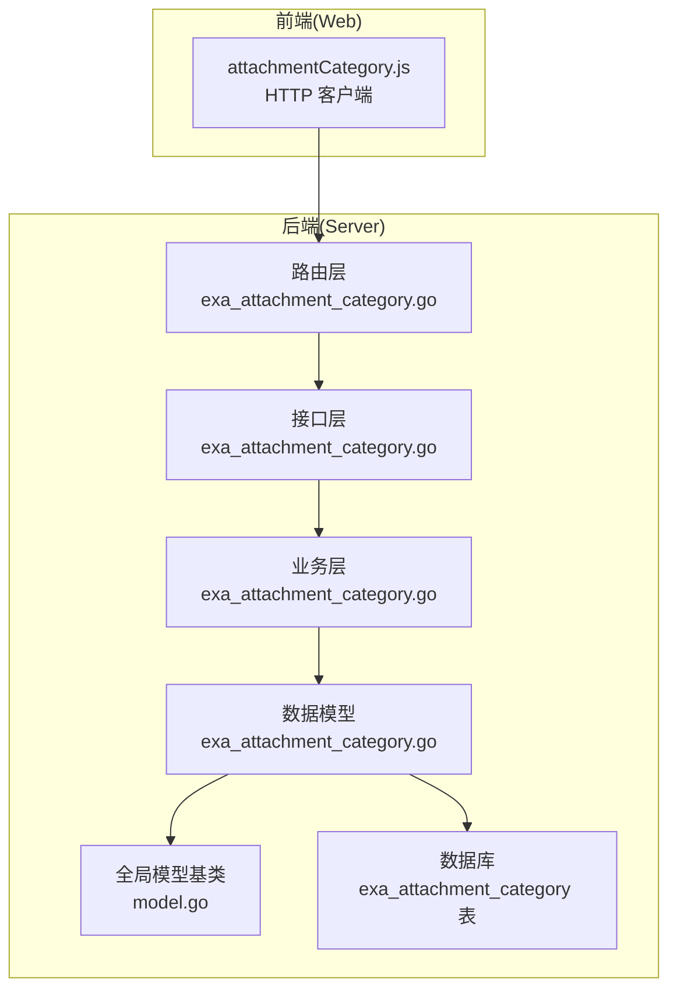
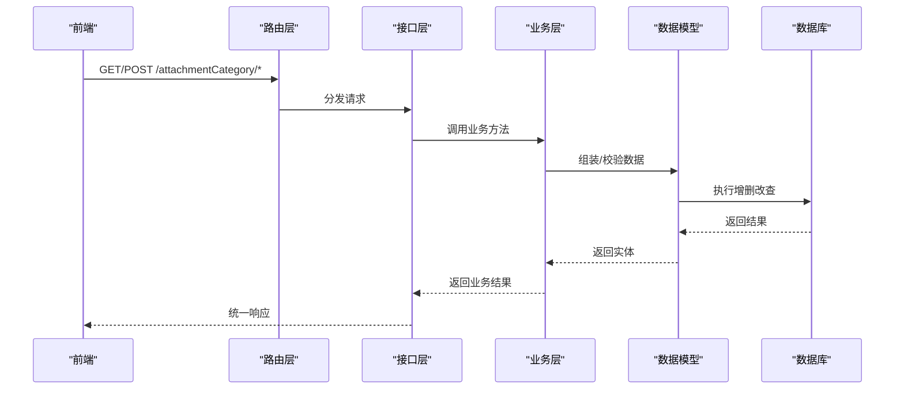
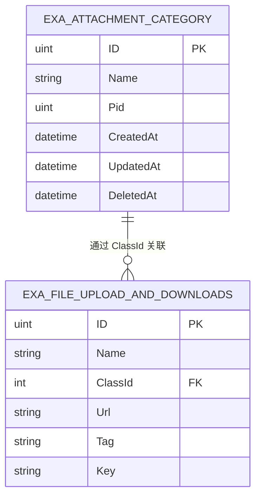
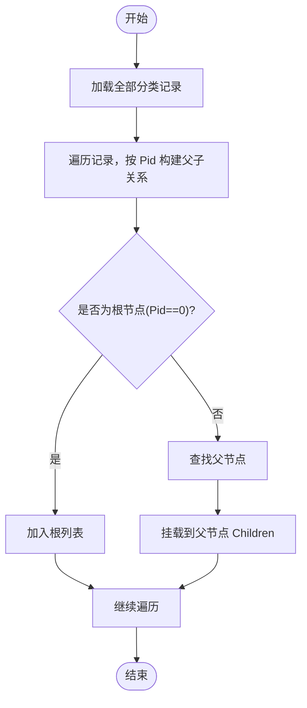
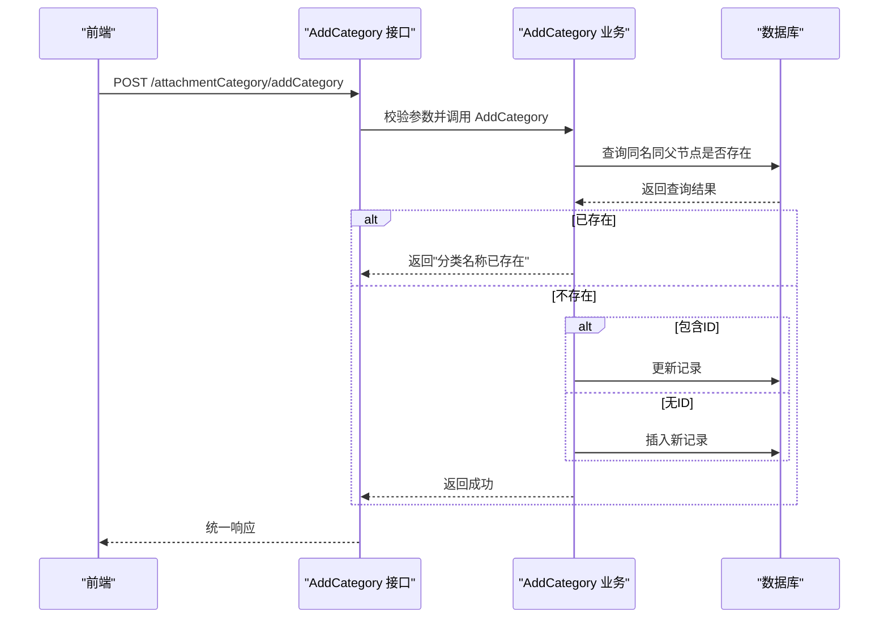
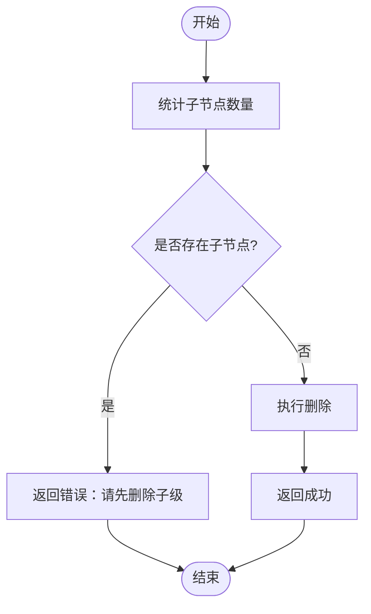
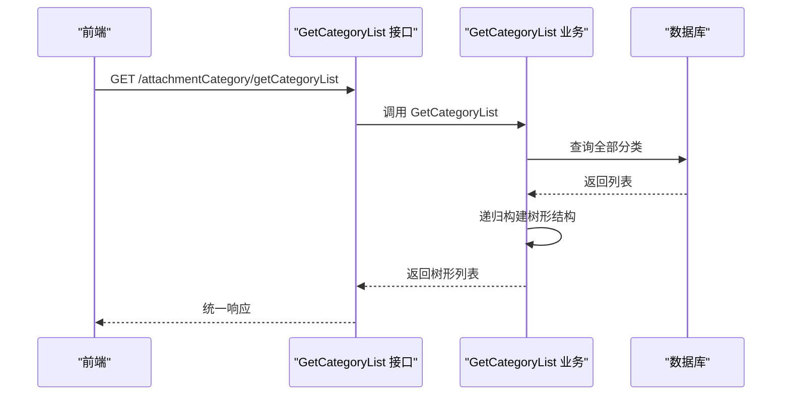
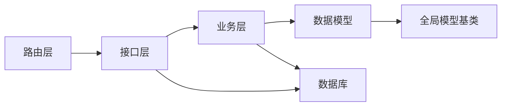

# 附件分类 API

<cite>
**本文引用的文件**
- [exa_attachment_category.go](file://server/model/example/exa_attachment_category.go)
- [exa_attachment_category.go](file://server/service/example/exa_attachment_category.go)
- [exa_attachment_category.go](file://server/api/v1/example/exa_attachment_category.go)
- [exa_attachment_category.go](file://server/router/example/exa_attachment_category.go)
- [attachmentCategory.js](file://web/src/api/attachmentCategory.js)
- [model.go](file://server/global/model.go)
- [ensure_tables.go](file://server/initialize/ensure_tables.go)
- [exa_file_upload_download.go](file://server/model/example/exa_file_upload_download.go)
- [common.go](file://server/model/common/request/common.go)
- [jwt.go](file://server/middleware/jwt.go)
- [swagger.json](file://server/docs/swagger.json)
</cite>

## 目录
1. [简介](#简介)
2. [项目结构](#项目结构)
3. [核心组件](#核心组件)
4. [架构总览](#架构总览)
5. [详细组件分析](#详细组件分析)
6. [依赖分析](#依赖分析)
7. [性能考量](#性能考量)
8. [故障排查指南](#故障排查指南)
9. [结论](#结论)
10. [附录](#附录)

## 简介
本文件系统性阐述“附件分类”数据模型的设计与实现，围绕 ExaAttachmentCategory 模型展开，覆盖分类层级与父子关系、排序规则、业务流程（创建/修改/删除）、树形结构实现（递归查询与层级遍历）、权限控制、与附件的外键关联、以及查询优化策略（统计与搜索过滤）。文档同时给出从 Web 前端到后端服务的完整调用链路与数据流图示。

## 项目结构
附件分类功能在后端采用典型的分层架构：Web 层负责路由与接口定义，API 层处理请求与响应封装，Service 层承载业务逻辑，Model 层定义数据结构与表映射；前端通过统一的 HTTP 客户端发起请求。

**图表来源**
- [exa_attachment_category.go:1-17](file://server/router/example/exa_attachment_category.go#L1-L17)
- [exa_attachment_category.go:1-83](file://server/api/v1/example/exa_attachment_category.go#L1-L83)
- [exa_attachment_category.go:1-67](file://server/service/example/exa_attachment_category.go#L1-L67)
- [exa_attachment_category.go:1-17](file://server/model/example/exa_attachment_category.go#L1-L17)
- [model.go:1-15](file://server/global/model.go#L1-L15)

**章节来源**
- [exa_attachment_category.go:1-17](file://server/router/example/exa_attachment_category.go#L1-L17)
- [exa_attachment_category.go:1-83](file://server/api/v1/example/exa_attachment_category.go#L1-L83)
- [exa_attachment_category.go:1-67](file://server/service/example/exa_attachment_category.go#L1-L67)
- [exa_attachment_category.go:1-17](file://server/model/example/exa_attachment_category.go#L1-L17)
- [model.go:1-15](file://server/global/model.go#L1-L15)

## 核心组件
- 数据模型（Model）
  - ExaAttachmentCategory：定义分类的主键 ID、名称、父节点 ID（Pid），以及用于序列化的子节点集合 Children。
  - 全局模型基类 GVA_MODEL：统一包含主键、创建/更新/删除时间字段。
  - 表名映射：exa_attachment_category。
- 业务服务（Service）
  - AddCategory：支持创建或更新分类，包含同名同父节点唯一性校验。
  - DeleteCategory：删除前检查是否存在子分类，避免破坏层级完整性。
  - GetCategoryList：获取全量分类并构建树形结构。
  - getChildrenList：递归构建树形层级。
- 接口层（API）
  - 提供分类列表、创建/更新、删除三个接口，统一返回响应格式。
- 路由层（Router）
  - 将上述接口注册到统一的路由组 attachmentCategory 下。
- 前端接口（Web）
  - 提供分类列表、新增/编辑、删除的 HTTP 请求封装。

**章节来源**
- [exa_attachment_category.go:1-17](file://server/model/example/exa_attachment_category.go#L1-L17)
- [model.go:1-15](file://server/global/model.go#L1-L15)
- [exa_attachment_category.go:1-67](file://server/service/example/exa_attachment_category.go#L1-L67)
- [exa_attachment_category.go:1-83](file://server/api/v1/example/exa_attachment_category.go#L1-L83)
- [exa_attachment_category.go:1-17](file://server/router/example/exa_attachment_category.go#L1-L17)
- [attachmentCategory.js:1-27](file://web/src/api/attachmentCategory.js#L1-L27)

## 架构总览
下图展示从前端到数据库的完整调用链与数据流向：

**图表来源**
- [exa_attachment_category.go:1-17](file://server/router/example/exa_attachment_category.go#L1-L17)
- [exa_attachment_category.go:1-83](file://server/api/v1/example/exa_attachment_category.go#L1-L83)
- [exa_attachment_category.go:1-67](file://server/service/example/exa_attachment_category.go#L1-L67)
- [exa_attachment_category.go:1-17](file://server/model/example/exa_attachment_category.go#L1-L17)

## 详细组件分析

### 数据模型与表结构设计
- 字段说明
  - ID：主键，自增。
  - Name：分类名称，varchar(255)，非空。
  - Pid：父节点 ID，默认 0 表示根节点。
  - Children：仅用于序列化输出的虚拟字段，不持久化。
  - CreatedAt/UpdatedAt/DeletedAt：继承自 GVA_MODEL。
- 表名映射
  - 实际表名为 exa_attachment_category。
- 外键关联
  - 附件表（exa_file_upload_and_downloads）通过 class_id 关联到分类表的 ID，形成一对多关系。

**图表来源**
- [exa_attachment_category.go:1-17](file://server/model/example/exa_attachment_category.go#L1-L17)
- [exa_file_upload_download.go:1-19](file://server/model/example/exa_file_upload_download.go#L1-L19)

**章节来源**
- [exa_attachment_category.go:1-17](file://server/model/example/exa_attachment_category.go#L1-L17)
- [exa_file_upload_download.go:1-19](file://server/model/example/exa_file_upload_download.go#L1-L19)

### 分类层级与父子关系
- 层级结构
  - 使用 Pid 字段表示父子关系，0 表示根节点。
  - 子节点集合 Children 仅用于序列化输出，不参与持久化。
- 树形构建
  - 通过递归遍历所有分类，以 Pid 作为父子判断条件，组装为多叉树结构。
- 排序规则
  - 当前实现未显式指定排序字段，建议在数据库层面增加排序列或在查询时按 ID 或名称排序，以保证一致性。

**图表来源**
- [exa_attachment_category.go:46-66](file://server/service/example/exa_attachment_category.go#L46-L66)

**章节来源**
- [exa_attachment_category.go:46-66](file://server/service/example/exa_attachment_category.go#L46-L66)

### 业务逻辑与操作流程

#### 创建/更新分类
- 校验规则
  - 同名同父节点唯一：若已存在相同名称且父节点相同的分类，则拒绝重复创建。
- 更新策略
  - 若请求包含 ID，则执行更新；否则执行创建。
- 错误处理
  - 参数绑定失败、数据库写入失败均会返回错误信息。

**图表来源**
- [exa_attachment_category.go:31-53](file://server/api/v1/example/exa_attachment_category.go#L31-L53)
- [exa_attachment_category.go:12-34](file://server/service/example/exa_attachment_category.go#L12-L34)

**章节来源**
- [exa_attachment_category.go:31-53](file://server/api/v1/example/exa_attachment_category.go#L31-L53)
- [exa_attachment_category.go:12-34](file://server/service/example/exa_attachment_category.go#L12-L34)

#### 删除分类
- 约束检查
  - 删除前统计子节点数量，若存在子节点则拒绝删除，防止破坏层级完整性。
- 删除方式
  - 支持软删除（基于 GVA_MODEL 的 DeletedAt）与硬删除（Unscoped 删除）两种模式，当前实现使用软删除。
- 错误处理
  - 子节点存在或数据库删除失败均会返回错误信息。

**图表来源**
- [exa_attachment_category.go:36-44](file://server/service/example/exa_attachment_category.go#L36-L44)
- [exa_attachment_category.go:55-82](file://server/api/v1/example/exa_attachment_category.go#L55-L82)

**章节来源**
- [exa_attachment_category.go:36-44](file://server/service/example/exa_attachment_category.go#L36-L44)
- [exa_attachment_category.go:55-82](file://server/api/v1/example/exa_attachment_category.go#L55-L82)

#### 获取分类列表
- 查询策略
  - 先查询全量分类，再通过递归函数构建树形结构。
- 输出结构
  - 返回根节点集合，每个节点包含其子节点 Children。

**图表来源**
- [exa_attachment_category.go:14-29](file://server/api/v1/example/exa_attachment_category.go#L14-L29)
- [exa_attachment_category.go:46-66](file://server/service/example/exa_attachment_category.go#L46-L66)

**章节来源**
- [exa_attachment_category.go:14-29](file://server/api/v1/example/exa_attachment_category.go#L14-L29)
- [exa_attachment_category.go:46-66](file://server/service/example/exa_attachment_category.go#L46-L66)

### 权限控制
- 接口注解
  - 在接口层使用了安全注解（如 AttachmentCategory），表明该接口需要特定权限才能访问。
- 建议实践
  - 结合 RBAC（基于角色的访问控制）在中间件中进行权限校验，确保只有授权用户可执行分类的增删改查操作。

**章节来源**
- [exa_attachment_category.go:14-29](file://server/api/v1/example/exa_attachment_category.go#L14-L29)
- [exa_attachment_category.go:31-53](file://server/api/v1/example/exa_attachment_category.go#L31-L53)
- [exa_attachment_category.go:55-82](file://server/api/v1/example/exa_attachment_category.go#L55-L82)

### 与附件的关联与外键设计
- 关联关系
  - 附件表（exa_file_upload_and_downloads）通过 class_id 字段关联到分类表的 ID。
- 业务意义
  - 一个分类可包含多个附件；删除分类前需清理或转移附件，避免悬挂引用。
- 建议
  - 在数据库层面建立外键约束（ON DELETE SET NULL 或 CASCADE，视业务需求而定），并在服务层进行一致性校验。

**章节来源**
- [exa_file_upload_download.go:1-19](file://server/model/example/exa_file_upload_download.go#L1-L19)
- [exa_attachment_category.go:36-44](file://server/service/example/exa_attachment_category.go#L36-L44)

### 查询优化策略
- 统计与搜索
  - 可在分类表上增加索引（如 Pid、Name），提升递归构建与模糊搜索效率。
  - 对于高频搜索，可在应用层缓存树形结构，减少重复计算。
- 排序
  - 建议在查询时按 ID 或名称排序，保证树形展示的一致性。
- 分页与批量
  - 列表查询建议支持分页；树形构建可在服务层进行内存聚合，避免 N+1 查询问题。

**章节来源**
- [exa_attachment_category.go:46-66](file://server/service/example/exa_attachment_category.go#L46-L66)

## 依赖分析
- 组件耦合
  - 路由层仅负责请求分发，与接口层松耦合。
  - 接口层依赖业务层，业务层依赖数据模型与全局模型基类。
  - 数据模型依赖全局模型基类，不直接依赖其他层。
- 外部依赖
  - 使用 GORM 进行 ORM 映射与数据库操作。
  - 使用 Gin 作为 Web 框架。
  - 初始化阶段通过 ensure_tables 自动迁移表结构。

**图表来源**
- [exa_attachment_category.go:1-17](file://server/router/example/exa_attachment_category.go#L1-L17)
- [exa_attachment_category.go:1-83](file://server/api/v1/example/exa_attachment_category.go#L1-L83)
- [exa_attachment_category.go:1-67](file://server/service/example/exa_attachment_category.go#L1-L67)
- [exa_attachment_category.go:1-17](file://server/model/example/exa_attachment_category.go#L1-L17)
- [model.go:1-15](file://server/global/model.go#L1-L15)

**章节来源**
- [ensure_tables.go:33-77](file://server/initialize/ensure_tables.go#L33-L77)

## 性能考量
- 树形构建复杂度
  - 递归构建树形结构的时间复杂度为 O(n^2)（最坏情况），可通过一次全量查询 + 内存构建优化为 O(n)。
- 数据库索引
  - 建议在 Pid 上建立索引，加速父子筛选；在 Name 上建立索引，提升搜索效率。
- 缓存策略
  - 对热点分类树进行缓存，定期失效或基于变更事件刷新。
- 并发与事务
  - 在高并发场景下，创建/更新/删除应使用事务包裹，确保一致性。

## 故障排查指南
- 常见错误与定位
  - “分类名称已存在”：检查同名同父节点是否重复；确认唯一性校验逻辑。
  - “请先删除子级”：删除前检查子节点数量；必要时提供级联删除选项。
  - 参数错误：前端传参校验失败或缺失；检查请求体与字段映射。
  - 数据库错误：SQL 执行异常或连接问题；查看日志与数据库状态。
- 日志与监控
  - 接口层统一记录错误日志；建议接入统一日志系统与指标监控。
- 修复建议
  - 对于重复创建，提供去重策略或提示用户选择合并。
  - 对于删除失败，提供子节点迁移或批量删除选项。

**章节来源**
- [exa_attachment_category.go:12-34](file://server/service/example/exa_attachment_category.go#L12-L34)
- [exa_attachment_category.go:36-44](file://server/service/example/exa_attachment_category.go#L36-L44)
- [exa_attachment_category.go:31-53](file://server/api/v1/example/exa_attachment_category.go#L31-L53)
- [exa_attachment_category.go:55-82](file://server/api/v1/example/exa_attachment_category.go#L55-L82)

## 结论
ExaAttachmentCategory 模型通过简单的 Pid 字段实现了灵活的树形分类体系，并结合递归构建算法高效生成层级结构。配合统一的接口层与业务层封装，满足了分类的增删改查与权限控制需求。建议后续在数据库层面补充索引与外键约束，在应用层引入缓存与分页策略，进一步提升性能与稳定性。

## 附录

### API 定义概览
- 获取分类列表
  - 方法：GET
  - 路径：/attachmentCategory/getCategoryList
  - 功能：返回树形分类列表
- 新增/编辑分类
  - 方法：POST
  - 路径：/attachmentCategory/addCategory
  - 输入：分类名称与父节点 ID
  - 功能：创建或更新分类
- 删除分类
  - 方法：POST
  - 路径：/attachmentCategory/deleteCategory
  - 输入：分类 ID
  - 功能：删除分类（需先清空子节点）

**章节来源**
- [exa_attachment_category.go:14-29](file://server/api/v1/example/exa_attachment_category.go#L14-L29)
- [exa_attachment_category.go:31-53](file://server/api/v1/example/exa_attachment_category.go#L31-L53)
- [exa_attachment_category.go:55-82](file://server/api/v1/example/exa_attachment_category.go#L55-L82)
- [attachmentCategory.js:1-27](file://web/src/api/attachmentCategory.js#L1-L27)

### 数据模型设计细节
- ExaAttachmentCategory 实体字段定义
  - ID：uint 类型，主键
  - Name：string 类型，分类名称
  - Pid：uint 类型，父节点 ID，默认 0
  - Children：切片类型，用于序列化输出的子节点集合
  - 继承自 GVA_MODEL，包含 CreatedAt、UpdatedAt、DeletedAt 时间戳字段

- 关系映射
  - 与附件表通过 class_id 字段建立一对多关系
  - 支持树形结构的父子关系映射

- 序列化处理
  - Children 字段使用 gorm 标签标记为不持久化
  - 通过递归算法动态构建树形结构

**章节来源**
- [exa_attachment_category.go:7-12](file://server/model/example/exa_attachment_category.go#L7-L12)
- [exa_file_upload_download.go:9-10](file://server/model/example/exa_file_upload_download.go#L9-L10)

### 权限控制与安全机制
- JWT 认证中间件
  - 通过 x-token 头部传递认证令牌
  - 支持令牌过期检测与自动刷新
  - 黑名单机制防止令牌滥用

- 接口安全注解
  - 使用 AttachmentCategory 注解标识需要权限的接口
  - 结合 Casbin RBAC 进行细粒度权限控制

**章节来源**
- [jwt.go:16-77](file://server/middleware/jwt.go#L16-L77)
- [exa_attachment_category.go:14-29](file://server/api/v1/example/exa_attachment_category.go#L14-L29)