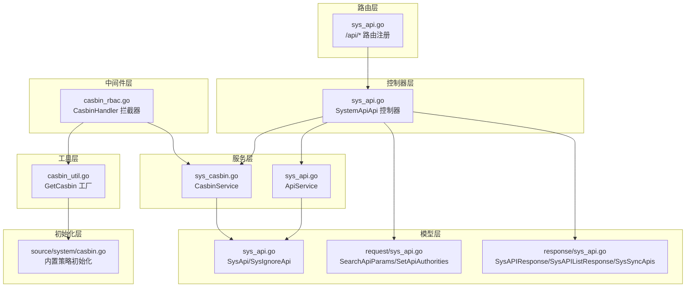
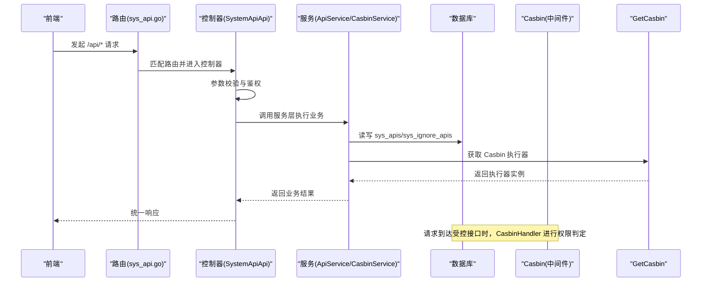
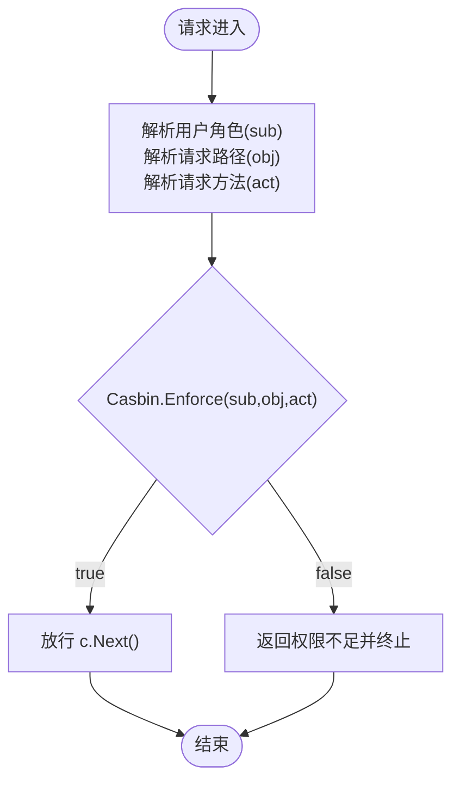
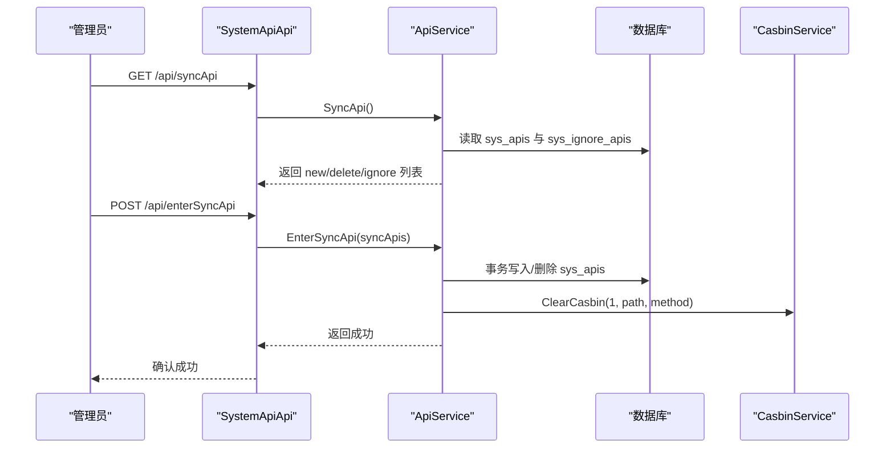
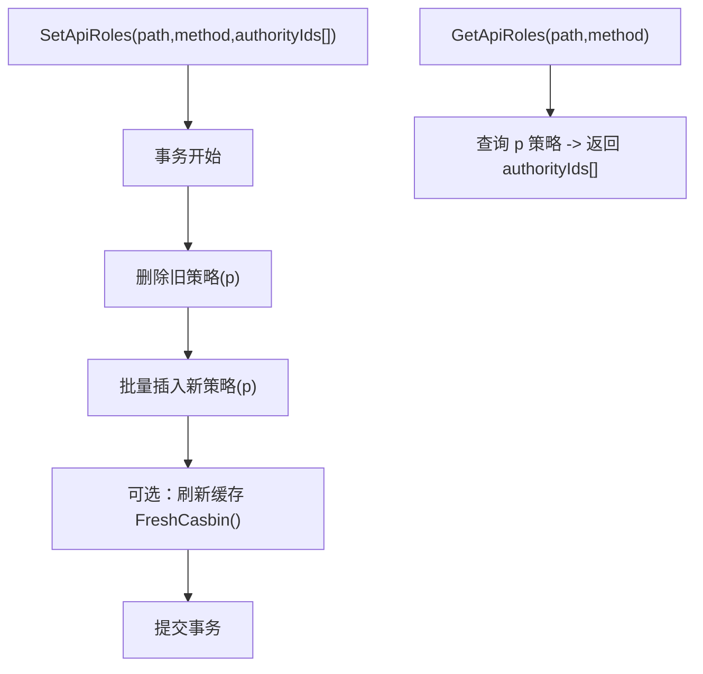
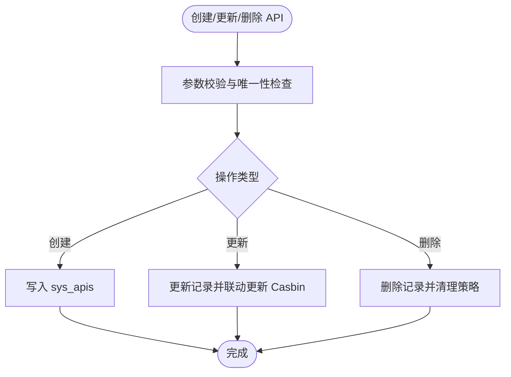
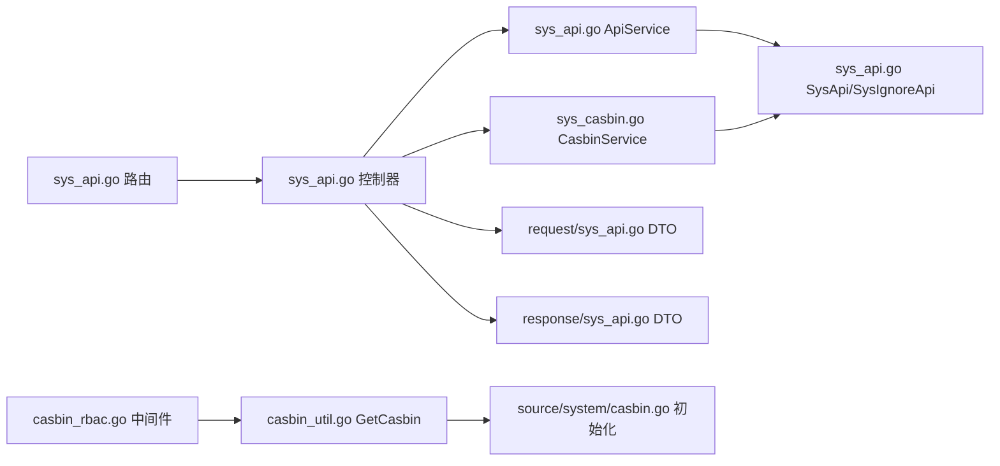

# API 管理 API

<cite>
**本文引用的文件**
- [server/router/system/sys_api.go](file://server/router/system/sys_api.go)
- [server/api/v1/system/sys_api.go](file://server/api/v1/system/sys_api.go)
- [server/service/system/sys_api.go](file://server/service/system/sys_api.go)
- [server/service/system/sys_casbin.go](file://server/service/system/sys_casbin.go)
- [server/model/system/sys_api.go](file://server/model/system/sys_api.go)
- [server/model/system/request/sys_api.go](file://server/model/system/request/sys_api.go)
- [server/model/system/response/sys_api.go](file://server/model/system/response/sys_api.go)
- [server/middleware/casbin_rbac.go](file://server/middleware/casbin_rbac.go)
- [server/utils/casbin_util.go](file://server/utils/casbin_util.go)
- [server/source/system/casbin.go](file://server/source/system/casbin.go)
- [repowiki/zh/content/API文档/API文档.md](file://repowiki/zh/content/API文档/API文档.md)
</cite>

## 目录
1. [简介](#简介)
2. [项目结构](#项目结构)
3. [核心组件](#核心组件)
4. [架构总览](#架构总览)
5. [详细组件分析](#详细组件分析)
6. [依赖关系分析](#依赖关系分析)
7. [性能考量](#性能考量)
8. [故障排查指南](#故障排查指南)
9. [结论](#结论)
10. [附录](#附录)

## 简介
本文件面向开发者与运维人员，系统性梳理“API 管理 API”的完整技术规范与实现机制，涵盖：
- API 的增删改查、分组管理、动态同步与权限绑定
- 权限模型（RBAC + Casbin）、权限拦截器工作原理
- API 与菜单的关联关系、权限缓存与刷新策略
- 实际应用示例：新增 API、配置权限规则、批量同步、权限测试等
- 与 RBAC 权限系统的集成方式与安全控制策略

## 项目结构
围绕 API 管理的核心模块分布如下：
- 路由层：定义 /api 下的全部管理接口
- 控制器层：对请求参数校验、调用服务层、返回标准响应
- 服务层：封装 CRUD、同步、权限策略维护、严格模式校验
- 模型层：SysApi、SysIgnoreApi 及请求/响应 DTO
- 中间件层：Casbin RBAC 拦截器
- 工具层：Casbin 实例工厂（带缓存）
- 初始化层：内置策略初始化

图表来源
- [server/router/system/sys_api.go:10-35](file://server/router/system/sys_api.go#L10-L35)
- [server/api/v1/system/sys_api.go:16-382](file://server/api/v1/system/sys_api.go#L16-L382)
- [server/service/system/sys_api.go:21-327](file://server/service/system/sys_api.go#L21-L327)
- [server/service/system/sys_casbin.go:22-216](file://server/service/system/sys_casbin.go#L22-L216)
- [server/model/system/sys_api.go:7-28](file://server/model/system/sys_api.go#L7-L28)
- [server/model/system/request/sys_api.go:9-21](file://server/model/system/request/sys_api.go#L9-L21)
- [server/model/system/response/sys_api.go:7-19](file://server/model/system/response/sys_api.go#L7-L19)
- [server/middleware/casbin_rbac.go:12-32](file://server/middleware/casbin_rbac.go#L12-L32)
- [server/utils/casbin_util.go:18-52](file://server/utils/casbin_util.go#L18-L52)
- [server/source/system/casbin.go:42-373](file://server/source/system/casbin.go#L42-L373)

章节来源
- [server/router/system/sys_api.go:10-35](file://server/router/system/sys_api.go#L10-L35)
- [server/api/v1/system/sys_api.go:16-382](file://server/api/v1/system/sys_api.go#L16-L382)

## 核心组件
- SysApi 模型：持久化 API 路径、方法、分组与描述
- SysIgnoreApi 模型：用于声明忽略同步的 API
- ApiService：提供 CRUD、分页查询、动态同步、忽略、批量删除、严格模式校验
- CasbinService：封装策略增删改查、API 变更联动更新、严格模式校验、缓存刷新
- SystemApiApi 控制器：对接前端请求，参数校验，调用服务层，返回统一响应
- CasbinHandler 中间件：基于路径与方法进行权限判定
- GetCasbin 工具：提供带缓存的 Casbin 执行器
- 内置策略初始化：系统启动时写入基础策略

章节来源
- [server/model/system/sys_api.go:7-28](file://server/model/system/sys_api.go#L7-L28)
- [server/service/system/sys_api.go:21-327](file://server/service/system/sys_api.go#L21-L327)
- [server/service/system/sys_casbin.go:22-216](file://server/service/system/sys_casbin.go#L22-L216)
- [server/api/v1/system/sys_api.go:16-382](file://server/api/v1/system/sys_api.go#L16-L382)
- [server/middleware/casbin_rbac.go:12-32](file://server/middleware/casbin_rbac.go#L12-L32)
- [server/utils/casbin_util.go:18-52](file://server/utils/casbin_util.go#L18-L52)
- [server/source/system/casbin.go:42-373](file://server/source/system/casbin.go#L42-L373)

## 架构总览
下图展示了 API 管理的端到端调用链路与权限拦截流程。

图表来源
- [server/router/system/sys_api.go:10-35](file://server/router/system/sys_api.go#L10-L35)
- [server/api/v1/system/sys_api.go:16-382](file://server/api/v1/system/sys_api.go#L16-L382)
- [server/service/system/sys_api.go:21-327](file://server/service/system/sys_api.go#L21-L327)
- [server/service/system/sys_casbin.go:22-216](file://server/service/system/sys_casbin.go#L22-L216)
- [server/middleware/casbin_rbac.go:12-32](file://server/middleware/casbin_rbac.go#L12-L32)
- [server/utils/casbin_util.go:18-52](file://server/utils/casbin_util.go#L18-L52)

## 详细组件分析

### 接口清单与规范
以下为 API 管理相关接口的规范汇总（按路由分组）：

- 获取 API 分组
  - 方法与路径：GET /api/getApiGroups
  - 请求参数：无
  - 成功响应：包含 groups 与 apiGroupMap
  - 错误码：500 获取失败
  - 章节来源
    - [server/api/v1/system/sys_api.go:70-89](file://server/api/v1/system/sys_api.go#L70-L89)

- 同步 API
  - 方法与路径：GET /api/syncApi
  - 请求参数：无
  - 成功响应：newApis、deleteApis、ignoreApis
  - 错误码：500 同步失败
  - 章节来源
    - [server/api/v1/system/sys_api.go:48-68](file://server/api/v1/system/sys_api.go#L48-L68)

- 忽略 API
  - 方法与路径：POST /api/ignoreApi
  - 请求体：SysIgnoreApi（path、method、flag）
  - 成功响应：忽略成功
  - 错误码：500 忽略失败
  - 章节来源
    - [server/api/v1/system/sys_api.go:91-113](file://server/api/v1/system/sys_api.go#L91-L113)

- 确认同步 API
  - 方法与路径：POST /api/enterSyncApi
  - 请求体：SysSyncApis（newApis、deleteApis）
  - 成功响应：确认成功
  - 错误码：500 确认失败
  - 章节来源
    - [server/api/v1/system/sys_api.go:115-137](file://server/api/v1/system/sys_api.go#L115-L137)

- 创建 API
  - 方法与路径：POST /api/createApi
  - 请求体：SysApi（path、description、apiGroup、method）
  - 成功响应：创建成功
  - 错误码：400 参数错误；500 创建失败
  - 章节来源
    - [server/api/v1/system/sys_api.go:18-46](file://server/api/v1/system/sys_api.go#L18-L46)

- 删除 API
  - 方法与路径：POST /api/deleteApi
  - 请求体：SysApi（id）
  - 成功响应：删除成功
  - 错误码：400 参数错误；500 删除失败
  - 章节来源
    - [server/api/v1/system/sys_api.go:139-167](file://server/api/v1/system/sys_api.go#L139-L167)

- 更新 API
  - 方法与路径：POST /api/updateApi
  - 请求体：SysApi（id、path、method、description、apiGroup）
  - 成功响应：修改成功
  - 错误码：400 参数错误；500 修改失败
  - 章节来源
    - [server/api/v1/system/sys_api.go:234-262](file://server/api/v1/system/sys_api.go#L234-L262)

- 获取 API 列表（分页）
  - 方法与路径：POST /api/getApiList
  - 请求体：SearchApiParams（SysApi + PageInfo + orderKey + desc）
  - 成功响应：分页结果（List、Total、Page、PageSize）
  - 错误码：400 参数错误；500 获取失败
  - 章节来源
    - [server/api/v1/system/sys_api.go:169-202](file://server/api/v1/system/sys_api.go#L169-L202)

- 获取单条 API 详情
  - 方法与路径：POST /api/getApiById
  - 请求体：GetById（id）
  - 成功响应：SysAPIResponse（api）
  - 错误码：400 参数错误；500 获取失败
  - 章节来源
    - [server/api/v1/system/sys_api.go:204-232](file://server/api/v1/system/sys_api.go#L204-L232)

- 获取所有 API（不分页）
  - 方法与路径：POST /api/getAllApis
  - 请求参数：无（基于当前用户权限过滤）
  - 成功响应：SysAPIListResponse（apis）
  - 错误码：500 获取失败
  - 章节来源
    - [server/api/v1/system/sys_api.go:264-281](file://server/api/v1/system/sys_api.go#L264-L281)

- 删除多个 API
  - 方法与路径：DELETE /api/deleteApisByIds
  - 请求体：IdsReq（ids[]）
  - 成功响应：删除成功
  - 错误码：400 参数错误；500 删除失败
  - 章节来源
    - [server/api/v1/system/sys_api.go:283-306](file://server/api/v1/system/sys_api.go#L283-L306)

- 刷新 Casbin 权限缓存
  - 方法与路径：GET /api/freshCasbin
  - 请求参数：无
  - 成功响应：刷新成功
  - 错误码：500 刷新失败
  - 章节来源
    - [server/api/v1/system/sys_api.go:308-323](file://server/api/v1/system/sys_api.go#L308-L323)

- 获取 API 关联角色 ID 列表
  - 方法与路径：GET /api/getApiRoles
  - 查询参数：path、method
  - 成功响应：角色ID列表
  - 错误码：400 参数为空；500 获取失败
  - 章节来源
    - [server/api/v1/system/sys_api.go:325-352](file://server/api/v1/system/sys_api.go#L325-L352)

- 全量覆盖 API 关联角色
  - 方法与路径：POST /api/setApiRoles
  - 请求体：SetApiAuthorities（path、method、authorityIds[]）
  - 成功响应：设置成功
  - 错误码：400 参数为空；500 设置失败
  - 章节来源
    - [server/api/v1/system/sys_api.go:354-381](file://server/api/v1/system/sys_api.go#L354-L381)

章节来源
- [repowiki/zh/content/API文档/API文档.md:275-324](file://repowiki/zh/content/API文档/API文档.md#L275-L324)
- [server/api/v1/system/sys_api.go:18-381](file://server/api/v1/system/sys_api.go#L18-L381)

### 权限模型与拦截器
- 权限模型：RBAC + Casbin，策略以“角色ID-资源路径-HTTP方法”三元组存储
- 拦截器：CasbinHandler 在请求进入时，依据用户角色、请求路径与方法进行 Enforce 判定
- 严格模式：当启用严格权限时，角色可访问的 API 必须在系统 API 列表中
- 缓存：GetCasbin 提供带缓存的执行器，降低策略加载开销

图表来源
- [server/middleware/casbin_rbac.go:13-32](file://server/middleware/casbin_rbac.go#L13-L32)
- [server/utils/casbin_util.go:18-52](file://server/utils/casbin_util.go#L18-L52)

章节来源
- [server/middleware/casbin_rbac.go:13-32](file://server/middleware/casbin_rbac.go#L13-L32)
- [server/utils/casbin_util.go:18-52](file://server/utils/casbin_util.go#L18-L52)
- [server/service/system/sys_casbin.go:33-51](file://server/service/system/sys_casbin.go#L33-L51)

### 动态 API 注册与同步
- 动态注册：系统启动或运行时，通过扫描全局路由生成待同步 API 列表
- 同步流程：比较内存路由与数据库 API，输出新增、删除、忽略三类差异
- 忽略机制：通过 sys_ignore_apis 声明忽略项，避免被纳入同步
- 确认同步：前端确认后，事务写入数据库并清理相关权限策略

图表来源
- [server/api/v1/system/sys_api.go:48-137](file://server/api/v1/system/sys_api.go#L48-L137)
- [server/service/system/sys_api.go:55-154](file://server/service/system/sys_api.go#L55-L154)
- [server/service/system/sys_casbin.go:115-124](file://server/service/system/sys_casbin.go#L115-L124)

章节来源
- [server/api/v1/system/sys_api.go:48-137](file://server/api/v1/system/sys_api.go#L48-L137)
- [server/service/system/sys_api.go:55-154](file://server/service/system/sys_api.go#L55-L154)

### 权限绑定机制
- 全量覆盖 API 角色绑定：SetApiRoles 接口通过事务先清空旧策略，再批量写入新策略
- 查询 API 关联角色：GetApiRoles 基于数据库查询 p 策略，返回角色ID列表
- API 变更联动：UpdateApi 会联动更新 Casbin 策略中的路径与方法，并加载策略

图表来源
- [server/api/v1/system/sys_api.go:354-381](file://server/api/v1/system/sys_api.go#L354-L381)
- [server/service/system/sys_casbin.go:175-215](file://server/service/system/sys_casbin.go#L175-L215)
- [server/service/system/sys_api.go:276-302](file://server/service/system/sys_api.go#L276-L302)

章节来源
- [server/api/v1/system/sys_api.go:354-381](file://server/api/v1/system/sys_api.go#L354-L381)
- [server/service/system/sys_casbin.go:175-215](file://server/service/system/sys_casbin.go#L175-L215)
- [server/service/system/sys_api.go:276-302](file://server/service/system/sys_api.go#L276-L302)

### API CRUD 流程
- 创建：参数校验 → 唯一性检查 → 写入数据库
- 更新：参数校验 → 唯一性检查 → 联动更新 Casbin 策略 → 写入数据库
- 删除：按 id 查询 → 删除记录 → 清理相关策略
- 批量删除：事务内批量删除并清理策略
- 分页查询：支持多字段过滤与排序字段校验

图表来源
- [server/api/v1/system/sys_api.go:18-46](file://server/api/v1/system/sys_api.go#L18-L46)
- [server/api/v1/system/sys_api.go:234-262](file://server/api/v1/system/sys_api.go#L234-L262)
- [server/api/v1/system/sys_api.go:139-167](file://server/api/v1/system/sys_api.go#L139-L167)
- [server/service/system/sys_api.go:25-302](file://server/service/system/sys_api.go#L25-L302)

章节来源
- [server/api/v1/system/sys_api.go:18-262](file://server/api/v1/system/sys_api.go#L18-L262)
- [server/service/system/sys_api.go:25-302](file://server/service/system/sys_api.go#L25-L302)

### API 与菜单的关联关系
- 菜单与权限：菜单权限通过 Casbin 策略控制，API 管理接口本身不直接操作菜单
- 严格模式：当启用严格权限时，角色可访问的 API 必须在系统 API 列表中
- 初始化策略：系统启动时写入大量内置策略，覆盖 API 管理相关接口

章节来源
- [server/source/system/casbin.go:42-373](file://server/source/system/casbin.go#L42-L373)
- [server/service/system/sys_casbin.go:33-51](file://server/service/system/sys_casbin.go#L33-L51)

## 依赖关系分析
- 路由依赖：sys_api.go 路由组挂载到 /api，部分接口附加操作日志中间件
- 控制器依赖：SystemApiApi 依赖 ApiService 与 CasbinService，以及统一响应与校验工具
- 服务依赖：ApiService 依赖数据库与 CasbinService；CasbinService 依赖 GORM Adapter 与 GetCasbin
- 中间件依赖：CasbinHandler 依赖 GetCasbin 与用户 Claims 解析
- 初始化依赖：Casbin 初始化器负责创建表与写入内置策略

图表来源
- [server/router/system/sys_api.go:10-35](file://server/router/system/sys_api.go#L10-L35)
- [server/api/v1/system/sys_api.go:16-382](file://server/api/v1/system/sys_api.go#L16-L382)
- [server/service/system/sys_api.go:21-327](file://server/service/system/sys_api.go#L21-L327)
- [server/service/system/sys_casbin.go:22-216](file://server/service/system/sys_casbin.go#L22-L216)
- [server/middleware/casbin_rbac.go:12-32](file://server/middleware/casbin_rbac.go#L12-L32)
- [server/utils/casbin_util.go:18-52](file://server/utils/casbin_util.go#L18-L52)
- [server/source/system/casbin.go:42-373](file://server/source/system/casbin.go#L42-L373)

章节来源
- [server/router/system/sys_api.go:10-35](file://server/router/system/sys_api.go#L10-L35)
- [server/api/v1/system/sys_api.go:16-382](file://server/api/v1/system/sys_api.go#L16-L382)
- [server/service/system/sys_api.go:21-327](file://server/service/system/sys_api.go#L21-L327)
- [server/service/system/sys_casbin.go:22-216](file://server/service/system/sys_casbin.go#L22-L216)
- [server/middleware/casbin_rbac.go:12-32](file://server/middleware/casbin_rbac.go#L12-L32)
- [server/utils/casbin_util.go:18-52](file://server/utils/casbin_util.go#L18-L52)
- [server/source/system/casbin.go:42-373](file://server/source/system/casbin.go#L42-L373)

## 性能考量
- Casbin 缓存：GetCasbin 使用 SyncedCachedEnforcer 并设置过期时间，减少策略加载开销
- 批量策略：AddPolicies/RemoveFilteredPolicy 支持批量写入与清理，降低多次往返
- 严格模式校验：在更新角色策略时进行 API 存在性校验，避免无效策略写入
- 分页查询：GetAPIInfoList 支持排序字段白名单与分页，避免全表扫描

章节来源
- [server/utils/casbin_util.go:18-52](file://server/utils/casbin_util.go#L18-L52)
- [server/service/system/sys_casbin.go:56-74](file://server/service/system/sys_casbin.go#L56-L74)
- [server/service/system/sys_casbin.go:132-148](file://server/service/system/sys_casbin.go#L132-L148)
- [server/service/system/sys_api.go:182-230](file://server/service/system/sys_api.go#L182-L230)

## 故障排查指南
- 同步失败
  - 现象：/api/syncApi 返回 500
  - 排查：检查数据库连接、sys_apis 与 sys_ignore_apis 表状态
  - 章节来源
    - [server/api/v1/system/sys_api.go:56-67](file://server/api/v1/system/sys_api.go#L56-L67)

- 忽略失败
  - 现象：/api/ignoreApi 返回 500
  - 排查：确认请求体字段（path、method、flag）正确
  - 章节来源
    - [server/api/v1/system/sys_api.go:99-112](file://server/api/v1/system/sys_api.go#L99-L112)

- 参数错误
  - 现象：400 参数错误（如 /api/createApi、/api/getApiList）
  - 排查：核对请求体结构与校验规则
  - 章节来源
    - [server/api/v1/system/sys_api.go:28-45](file://server/api/v1/system/sys_api.go#L28-L45)
    - [server/api/v1/system/sys_api.go:178-201](file://server/api/v1/system/sys_api.go#L178-L201)

- 权限不足
  - 现象：CasbinHandler 返回权限不足
  - 排查：确认用户角色是否具备对应策略；必要时刷新缓存
  - 章节来源
    - [server/middleware/casbin_rbac.go:24-29](file://server/middleware/casbin_rbac.go#L24-L29)

- 刷新缓存失败
  - 现象：/api/freshCasbin 返回 500
  - 排查：检查 Casbin 执行器初始化与数据库策略表
  - 章节来源
    - [server/api/v1/system/sys_api.go:315-322](file://server/api/v1/system/sys_api.go#L315-L322)

## 结论
本技术文档系统性地梳理了 API 管理 API 的接口规范、权限模型、动态同步与权限绑定机制。通过 RBAC + Casbin 的权限体系与严格的策略校验，系统实现了灵活、可审计、可扩展的 API 权限治理能力。结合缓存与批量策略优化，满足生产环境的性能与稳定性要求。

## 附录

### 实际应用示例

- 新增 API 接口
  - 步骤：调用 /api/createApi，传入 path、description、apiGroup、method
  - 注意：若存在相同 path+method 的 API 将拒绝创建
  - 章节来源
    - [server/api/v1/system/sys_api.go:18-46](file://server/api/v1/system/sys_api.go#L18-L46)

- 配置权限规则
  - 步骤：调用 /api/setApiRoles，传入 path、method 与 authorityIds[]
  - 注意：该操作会全量覆盖原有角色绑定
  - 章节来源
    - [server/api/v1/system/sys_api.go:354-381](file://server/api/v1/system/sys_api.go#L354-L381)

- 批量同步 API
  - 步骤：
    1) 调用 /api/syncApi 获取差异列表
    2) 调用 /api/enterSyncApi 确认同步
  - 注意：同步过程会清理旧策略并写入新策略
  - 章节来源
    - [server/api/v1/system/sys_api.go:48-137](file://server/api/v1/system/sys_api.go#L48-L137)

- 权限测试
  - 步骤：调用 /api/getApiRoles 获取 API 关联角色列表
  - 或：调用 /api/freshCasbin 刷新缓存后再次验证
  - 章节来源
    - [server/api/v1/system/sys_api.go:325-323](file://server/api/v1/system/sys_api.go#L325-L323)