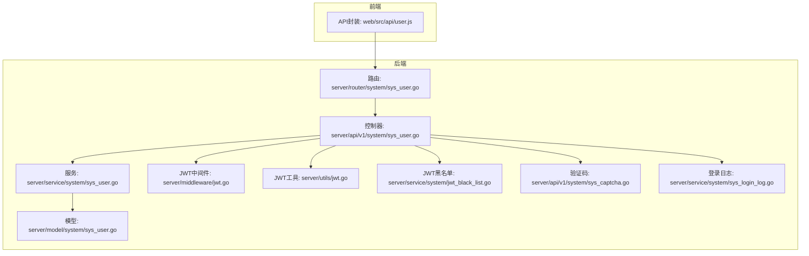
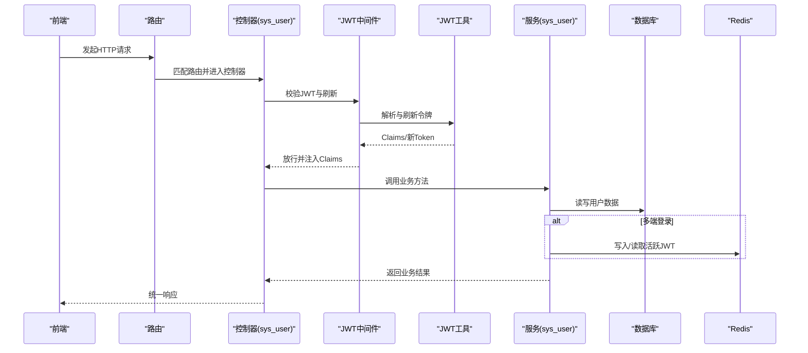
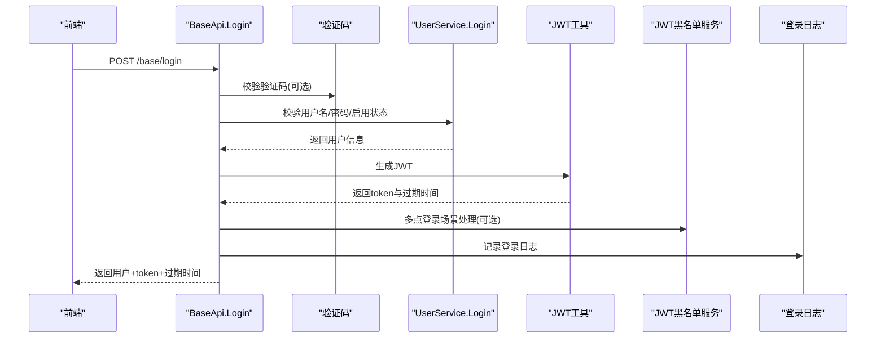
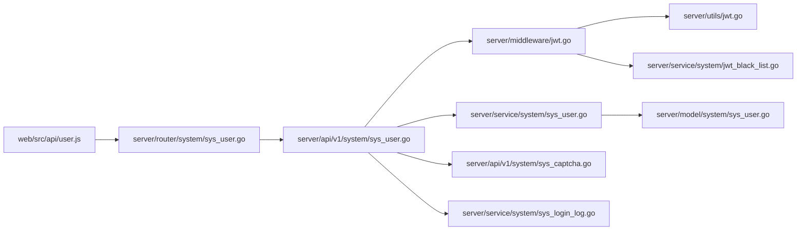

# 用户管理 API

<cite>
**本文引用的文件**   
- [server/api/v1/system/sys_user.go](file://server/api/v1/system/sys_user.go)
- [server/router/system/sys_user.go](file://server/router/system/sys_user.go)
- [server/service/system/sys_user.go](file://server/service/system/sys_user.go)
- [server/model/system/sys_user.go](file://server/model/system/sys_user.go)
- [server/model/system/request/sys_user.go](file://server/model/system/request/sys_user.go)
- [server/model/system/response/sys_user.go](file://server/model/system/response/sys_user.go)
- [server/middleware/jwt.go](file://server/middleware/jwt.go)
- [server/utils/jwt.go](file://server/utils/jwt.go)
- [server/service/system/jwt_black_list.go](file://server/service/system/jwt_black_list.go)
- [server/api/v1/system/sys_captcha.go](file://server/api/v1/system/sys_captcha.go)
- [server/model/system/sys_login_log.go](file://server/model/system/sys_login_log.go)
- [server/service/system/sys_login_log.go](file://server/service/system/sys_login_log.go)
- [server/config/jwt.go](file://server/config/jwt.go)
- [server/model/common/response/response.go](file://server/model/common/response/response.go)
- [web/src/api/user.js](file://web/src/api/user.js)
</cite>

## 目录
1. [简介](#简介)
2. [项目结构](#项目结构)
3. [核心组件](#核心组件)
4. [架构总览](#架构总览)
5. [详细组件分析](#详细组件分析)
6. [依赖分析](#依赖分析)
7. [性能考量](#性能考量)
8. [故障排查指南](#故障排查指南)
9. [结论](#结论)
10. [附录：接口规范与示例](#附录接口规范与示例)

## 简介
本文件面向开发者与测试工程师，系统性梳理用户管理 API 的接口规范与实现细节，覆盖用户注册、登录、密码管理、用户信息维护、权限分配、批量查询与删除等核心能力。重点阐述认证流程（登录、JWT 令牌管理与刷新）、用户 CRUD 操作、密码修改与重置机制、权限验证与安全策略，并提供可直接落地的调用示例与最佳实践建议。

## 项目结构
后端采用 Go Gin 框架，按“路由-控制器-服务-模型”分层组织；前端通过统一请求封装调用后端接口。用户相关接口主要分布在系统模块的路由与控制器中，配合 JWT 中间件进行认证与权限校验。

图表来源
- [server/router/system/sys_user.go:1-29](file://server/router/system/sys_user.go#L1-L29)
- [server/api/v1/system/sys_user.go:1-517](file://server/api/v1/system/sys_user.go#L1-L517)
- [server/service/system/sys_user.go:1-337](file://server/service/system/sys_user.go#L1-L337)
- [server/model/system/sys_user.go:1-63](file://server/model/system/sys_user.go#L1-L63)
- [server/middleware/jwt.go:1-90](file://server/middleware/jwt.go#L1-L90)
- [server/utils/jwt.go:1-106](file://server/utils/jwt.go#L1-L106)
- [server/service/system/jwt_black_list.go:1-53](file://server/service/system/jwt_black_list.go#L1-L53)
- [server/api/v1/system/sys_captcha.go:1-71](file://server/api/v1/system/sys_captcha.go#L1-L71)
- [server/service/system/sys_login_log.go:1-54](file://server/service/system/sys_login_log.go#L1-L54)
- [web/src/api/user.js:1-182](file://web/src/api/user.js#L1-L182)

章节来源
- [server/router/system/sys_user.go:1-29](file://server/router/system/sys_user.go#L1-L29)
- [server/api/v1/system/sys_user.go:1-517](file://server/api/v1/system/sys_user.go#L1-L517)
- [web/src/api/user.js:1-182](file://web/src/api/user.js#L1-L182)

## 核心组件
- 路由层：定义用户相关接口的 HTTP 方法、路径与分组，区分带“操作记录”与不带的两类路由组。
- 控制器层：实现具体业务逻辑，负责参数校验、调用服务层、返回统一响应格式。
- 服务层：封装数据库操作与业务规则，如用户注册、登录校验、密码变更、权限设置、分页查询、删除用户等。
- 模型层：定义用户实体、请求/响应结构体及字段约束。
- 中间件层：JWT 认证与刷新、跨域、限流、日志等。
- 工具与配置：JWT 签名、过期时间、缓冲时间、Redis 存储等。

章节来源
- [server/router/system/sys_user.go:10-28](file://server/router/system/sys_user.go#L10-L28)
- [server/api/v1/system/sys_user.go:20-517](file://server/api/v1/system/sys_user.go#L20-L517)
- [server/service/system/sys_user.go:24-337](file://server/service/system/sys_user.go#L24-L337)
- [server/model/system/sys_user.go:20-63](file://server/model/system/sys_user.go#L20-L63)
- [server/middleware/jwt.go:16-78](file://server/middleware/jwt.go#L16-L78)
- [server/utils/jwt.go:13-106](file://server/utils/jwt.go#L13-L106)

## 架构总览
用户管理 API 的调用链路如下：前端通过统一请求封装调用后端路由，路由转发至控制器，控制器经 JWT 中间件校验后调用服务层，服务层访问数据库与 Redis（如需），最终返回统一响应格式。

图表来源
- [server/router/system/sys_user.go:10-28](file://server/router/system/sys_user.go#L10-L28)
- [server/api/v1/system/sys_user.go:20-517](file://server/api/v1/system/sys_user.go#L20-L517)
- [server/middleware/jwt.go:16-78](file://server/middleware/jwt.go#L16-L78)
- [server/utils/jwt.go:48-88](file://server/utils/jwt.go#L48-L88)
- [server/service/system/sys_user.go:28-337](file://server/service/system/sys_user.go#L28-L337)

## 详细组件分析

### 登录与认证流程
- 接口：POST /base/login
- 请求体：用户名、密码、验证码（可选）
- 验证码策略：根据配置与客户端 IP 的尝试次数决定是否校验验证码
- 登录校验：查询用户、校验密码、检查是否启用
- JWT 签发：生成 token 并返回；支持单点或多点登录策略
- 登录日志：记录成功/失败信息

图表来源
- [server/api/v1/system/sys_user.go:20-99](file://server/api/v1/system/sys_user.go#L20-L99)
- [server/api/v1/system/sys_captcha.go:20-59](file://server/api/v1/system/sys_captcha.go#L20-L59)
- [server/service/system/sys_user.go:47-61](file://server/service/system/sys_user.go#L47-L61)
- [server/utils/jwt.go:48-52](file://server/utils/jwt.go#L48-L52)
- [server/service/system/jwt_black_list.go:22-29](file://server/service/system/jwt_black_list.go#L22-L29)
- [server/model/system/sys_login_log.go:7-16](file://server/model/system/sys_login_log.go#L7-L16)
- [server/service/system/sys_login_log.go:14-17](file://server/service/system/sys_login_log.go#L14-L17)

章节来源
- [server/api/v1/system/sys_user.go:20-99](file://server/api/v1/system/sys_user.go#L20-L99)
- [server/api/v1/system/sys_captcha.go:20-59](file://server/api/v1/system/sys_captcha.go#L20-L59)
- [server/service/system/sys_user.go:47-61](file://server/service/system/sys_user.go#L47-L61)
- [server/utils/jwt.go:48-52](file://server/utils/jwt.go#L48-L52)
- [server/service/system/jwt_black_list.go:22-29](file://server/service/system/jwt_black_list.go#L22-L29)
- [server/model/system/sys_login_log.go:7-16](file://server/model/system/sys_login_log.go#L7-L16)
- [server/service/system/sys_login_log.go:14-17](file://server/service/system/sys_login_log.go#L14-L17)

### 用户注册
- 接口：POST /user/admin_register
- 请求体：用户名、昵称、密码、角色ID/角色ID数组、手机号、邮箱等
- 业务要点：用户名唯一性校验、密码 bcrypt 加密、UUID 生成
- 返回：注册后的用户信息

章节来源
- [server/api/v1/system/sys_user.go:163-196](file://server/api/v1/system/sys_user.go#L163-L196)
- [server/service/system/sys_user.go:28-38](file://server/service/system/sys_user.go#L28-L38)
- [server/model/system/sys_user.go:20-34](file://server/model/system/sys_user.go#L20-L34)

### 修改密码
- 接口：POST /user/changePassword
- 请求体：原密码、新密码
- 业务要点：基于 JWT 提取用户ID，校验原密码正确后更新为新密码
- 安全要点：仅允许本人修改，防止越权

章节来源
- [server/api/v1/system/sys_user.go:198-227](file://server/api/v1/system/sys_user.go#L198-L227)
- [server/service/system/sys_user.go:69-81](file://server/service/system/sys_user.go#L69-L81)

### 重置密码（管理员）
- 接口：POST /user/resetPassword
- 请求体：目标用户ID、新密码
- 业务要点：管理员重置任意用户密码，新密码经 bcrypt 加密入库

章节来源
- [server/api/v1/system/sys_user.go:494-516](file://server/api/v1/system/sys_user.go#L494-L516)
- [server/service/system/sys_user.go:333-336](file://server/service/system/sys_user.go#L333-L336)

### 设置用户权限（单角色）
- 接口：POST /user/setUserAuthority
- 请求体：目标用户ID、角色ID
- 业务要点：校验用户是否存在指定角色，确保默认路由可达后更新角色

章节来源
- [server/api/v1/system/sys_user.go:264-303](file://server/api/v1/system/sys_user.go#L264-L303)
- [server/service/system/sys_user.go:140-181](file://server/service/system/sys_user.go#L140-L181)

### 设置用户权限（多角色）
- 接口：POST /user/setUserAuthorities
- 请求体：目标用户ID、角色ID数组
- 业务要点：事务内先清空旧关联，再写入新关联，最后更新主角色

章节来源
- [server/api/v1/system/sys_user.go:305-329](file://server/api/v1/system/sys_user.go#L305-L329)
- [server/service/system/sys_user.go:189-222](file://server/service/system/sys_user.go#L189-L222)

### 删除用户
- 接口：DELETE /user/deleteUser
- 请求体：目标用户ID
- 业务要点：事务内同时删除用户与关联权限；禁止删除自身

章节来源
- [server/api/v1/system/sys_user.go:331-364](file://server/api/v1/system/sys_user.go#L331-L364)
- [server/service/system/sys_user.go:230-240](file://server/service/system/sys_user.go#L230-L240)

### 设置用户信息（管理员）
- 接口：PUT /user/setUserInfo
- 请求体：用户ID、昵称、头像、手机、邮箱、启用状态、角色ID数组（可选）
- 业务要点：可同时更新多对多角色关联与基础信息

章节来源
- [server/api/v1/system/sys_user.go:366-412](file://server/api/v1/system/sys_user.go#L366-L412)
- [server/service/system/sys_user.go:248-260](file://server/service/system/sys_user.go#L248-L260)
- [server/service/system/sys_user.go:389-394](file://server/service/system/sys_user.go#L389-L394)

### 设置自身信息
- 接口：PUT /user/setSelfInfo
- 请求体：昵称、头像、手机、邮箱、启用状态
- 业务要点：基于 JWT 提取用户ID，仅允许修改自身信息

章节来源
- [server/api/v1/system/sys_user.go:414-447](file://server/api/v1/system/sys_user.go#L414-L447)
- [server/service/system/sys_user.go:268-272](file://server/service/system/sys_user.go#L268-L272)

### 设置自身界面配置
- 接口：PUT /user/setSelfSetting
- 请求体：配置 JSON 对象
- 业务要点：基于 JWT 提取用户ID，更新用户配置字段

章节来源
- [server/api/v1/system/sys_user.go:449-473](file://server/api/v1/system/sys_user.go#L449-L473)
- [server/service/system/sys_user.go:280-282](file://server/service/system/sys_user.go#L280-L282)

### 获取用户信息
- 接口：GET /user/getUserInfo
- 返回：当前用户信息（含角色）

章节来源
- [server/api/v1/system/sys_user.go:475-492](file://server/api/v1/system/sys_user.go#L475-L492)
- [server/service/system/sys_user.go:291-299](file://server/service/system/sys_user.go#L291-L299)

### 分页获取用户列表
- 接口：POST /user/getUserList
- 请求体：分页参数、可选筛选字段（用户名、昵称、手机、邮箱）、排序键与升降序
- 返回：列表、总数、页码、每页数量

章节来源
- [server/api/v1/system/sys_user.go:229-262](file://server/api/v1/system/sys_user.go#L229-L262)
- [server/service/system/sys_user.go:89-132](file://server/service/system/sys_user.go#L89-L132)

### 验证码接口
- 接口：POST /base/captcha
- 用途：生成图形验证码，用于登录等敏感操作
- 返回：验证码ID、图片、长度、是否开启

章节来源
- [server/api/v1/system/sys_captcha.go:20-59](file://server/api/v1/system/sys_captcha.go#L20-L59)

### 登录日志
- 用途：记录登录成功/失败、IP、UA、错误信息等
- 查询：支持按用户名、状态分页查询

章节来源
- [server/model/system/sys_login_log.go:7-16](file://server/model/system/sys_login_log.go#L7-L16)
- [server/service/system/sys_login_log.go:14-53](file://server/service/system/sys_login_log.go#L14-L53)

## 依赖分析
- 控制器依赖服务层与 JWT 工具；服务层依赖数据库与 Redis（多点登录场景）；模型层定义数据结构。
- 路由层将不同业务接口分组，部分接口启用“操作记录”中间件。
- JWT 中间件负责解析与刷新令牌，必要时拉黑失效令牌。

图表来源
- [web/src/api/user.js:1-182](file://web/src/api/user.js#L1-L182)
- [server/router/system/sys_user.go:10-28](file://server/router/system/sys_user.go#L10-L28)
- [server/api/v1/system/sys_user.go:20-517](file://server/api/v1/system/sys_user.go#L20-L517)
- [server/middleware/jwt.go:16-78](file://server/middleware/jwt.go#L16-L78)
- [server/service/system/sys_user.go:24-337](file://server/service/system/sys_user.go#L24-L337)
- [server/api/v1/system/sys_captcha.go:20-59](file://server/api/v1/system/sys_captcha.go#L20-L59)
- [server/service/system/sys_login_log.go:14-53](file://server/service/system/sys_login_log.go#L14-L53)
- [server/model/system/sys_user.go:20-63](file://server/model/system/sys_user.go#L20-L63)
- [server/utils/jwt.go:13-106](file://server/utils/jwt.go#L13-L106)
- [server/service/system/jwt_black_list.go:22-29](file://server/service/system/jwt_black_list.go#L22-L29)

## 性能考量
- JWT 刷新：当剩余有效期小于缓冲时间时自动刷新并下发新令牌，减少频繁登录开销。
- 多点登录：Redis 存储活跃 JWT，支持异地登录拦截与黑名单同步。
- 分页查询：服务层对常见字段建立索引，结合分页参数与排序键限制，降低数据库压力。
- 缓存与黑名单：登录失败尝试次数与 JWT 黑名单缓存提升安全与性能。

章节来源
- [server/middleware/jwt.go:56-76](file://server/middleware/jwt.go#L56-L76)
- [server/utils/jwt.go:96-105](file://server/utils/jwt.go#L96-L105)
- [server/service/system/sys_user.go:89-132](file://server/service/system/sys_user.go#L89-L132)
- [server/service/system/jwt_black_list.go:22-29](file://server/service/system/jwt_black_list.go#L22-L29)

## 故障排查指南
- 未登录或非法访问：JWT 中间件返回未授权，检查前端是否携带并刷新令牌。
- 令牌过期：中间件识别过期后清理并提示重新登录。
- 令牌失效/异地登录：JWT 黑名单命中，需重新登录。
- 登录失败：检查用户名/密码、启用状态、验证码（若开启）。
- 删除自身：接口明确禁止，避免误删。
- 权限切换失败：目标角色默认路由不可达或无对应菜单，需检查角色配置。

章节来源
- [server/middleware/jwt.go:16-78](file://server/middleware/jwt.go#L16-L78)
- [server/api/v1/system/sys_user.go:352-356](file://server/api/v1/system/sys_user.go#L352-L356)
- [server/service/system/sys_user.go:175-177](file://server/service/system/sys_user.go#L175-L177)

## 结论
本用户管理 API 以清晰的分层设计与完善的中间件体系保障了安全性与可维护性。通过 JWT 认证、密码加密、权限校验与登录日志等机制，满足企业级用户管理需求。建议在生产环境启用验证码、严格的角色与菜单配置、以及合理的 JWT 缓冲与过期策略。

## 附录：接口规范与示例

### 统一响应格式
- 成功：code=0，data 为业务数据，msg 为成功消息
- 失败：code=7，msg 为错误信息
- 未授权：HTTP 401，返回统一未授权响应

章节来源
- [server/model/common/response/response.go:9-63](file://server/model/common/response/response.go#L9-L63)

### 登录
- 方法与路径：POST /base/login
- 请求体字段：username、password、captcha、captchaId（可选）
- 成功响应字段：user、token、expiresAt
- 安全要点：支持验证码校验；登录成功记录日志

章节来源
- [server/api/v1/system/sys_user.go:20-99](file://server/api/v1/system/sys_user.go#L20-L99)
- [server/api/v1/system/sys_captcha.go:20-59](file://server/api/v1/system/sys_captcha.go#L20-L59)
- [server/model/system/response/sys_user.go:11-16](file://server/model/system/response/sys_user.go#L11-L16)

### 注册
- 方法与路径：POST /user/admin_register
- 请求体字段：userName、passWord、nickName、headerImg、authorityId、authorityIds、phone、email、enable
- 成功响应字段：user

章节来源
- [server/api/v1/system/sys_user.go:163-196](file://server/api/v1/system/sys_user.go#L163-L196)
- [server/model/system/request/sys_user.go:8-19](file://server/model/system/request/sys_user.go#L8-L19)

### 修改密码
- 方法与路径：POST /user/changePassword
- 请求体字段：password、newPassword
- 成功消息：修改成功

章节来源
- [server/api/v1/system/sys_user.go:198-227](file://server/api/v1/system/sys_user.go#L198-L227)
- [server/model/system/request/sys_user.go:29-34](file://server/model/system/request/sys_user.go#L29-L34)

### 重置密码（管理员）
- 方法与路径：POST /user/resetPassword
- 请求体字段：ID、password
- 成功消息：重置成功

章节来源
- [server/api/v1/system/sys_user.go:494-516](file://server/api/v1/system/sys_user.go#L494-L516)
- [server/model/system/request/sys_user.go:36-39](file://server/model/system/request/sys_user.go#L36-L39)

### 设置用户权限（单角色）
- 方法与路径：POST /user/setUserAuthority
- 请求体字段：authorityId
- 成功消息：修改成功

章节来源
- [server/api/v1/system/sys_user.go:264-303](file://server/api/v1/system/sys_user.go#L264-L303)
- [server/model/system/request/sys_user.go:42-44](file://server/model/system/request/sys_user.go#L42-L44)

### 设置用户权限（多角色）
- 方法与路径：POST /user/setUserAuthorities
- 请求体字段：ID、authorityIds[]
- 成功消息：修改成功

章节来源
- [server/api/v1/system/sys_user.go:305-329](file://server/api/v1/system/sys_user.go#L305-L329)
- [server/model/system/request/sys_user.go:46-50](file://server/model/system/request/sys_user.go#L46-L50)

### 删除用户
- 方法与路径：DELETE /user/deleteUser
- 请求体字段：id
- 成功消息：删除成功
- 限制：禁止删除自身

章节来源
- [server/api/v1/system/sys_user.go:331-364](file://server/api/v1/system/sys_user.go#L331-L364)
- [server/model/common/request/common.go](file://server/model/common/request/common.go)

### 设置用户信息（管理员）
- 方法与路径：PUT /user/setUserInfo
- 请求体字段：ID、nickName、headerImg、phone、email、enable、authorityIds[]
- 成功消息：设置成功

章节来源
- [server/api/v1/system/sys_user.go:366-412](file://server/api/v1/system/sys_user.go#L366-L412)
- [server/model/system/request/sys_user.go:52-61](file://server/model/system/request/sys_user.go#L52-L61)

### 设置自身信息
- 方法与路径：PUT /user/setSelfInfo
- 请求体字段：nickName、headerImg、phone、email、enable
- 成功消息：设置成功

章节来源
- [server/api/v1/system/sys_user.go:414-447](file://server/api/v1/system/sys_user.go#L414-L447)
- [server/model/system/request/sys_user.go:52-61](file://server/model/system/request/sys_user.go#L52-L61)

### 设置自身界面配置
- 方法与路径：PUT /user/setSelfSetting
- 请求体字段：任意 JSON 配置对象
- 成功消息：设置成功

章节来源
- [server/api/v1/system/sys_user.go:449-473](file://server/api/v1/system/sys_user.go#L449-L473)

### 获取用户信息
- 方法与路径：GET /user/getUserInfo
- 成功响应字段：userInfo

章节来源
- [server/api/v1/system/sys_user.go:475-492](file://server/api/v1/system/sys_user.go#L475-L492)
- [server/model/system/response/sys_user.go:7-9](file://server/model/system/response/sys_user.go#L7-L9)

### 分页获取用户列表
- 方法与路径：POST /user/getUserList
- 请求体字段：page、pageSize、username、nickName、phone、email、orderKey、desc
- 成功响应字段：List、Total、Page、PageSize

章节来源
- [server/api/v1/system/sys_user.go:229-262](file://server/api/v1/system/sys_user.go#L229-L262)
- [server/model/system/request/sys_user.go:63-71](file://server/model/system/request/sys_user.go#L63-L71)

### 验证码
- 方法与路径：POST /base/captcha
- 成功响应字段：captchaId、picPath、captchaLength、openCaptcha

章节来源
- [server/api/v1/system/sys_captcha.go:20-59](file://server/api/v1/system/sys_captcha.go#L20-L59)

### JWT 配置项
- signingKey：签名密钥
- expiresTime：过期时间
- bufferTime：缓冲时间
- issuer：签发者

章节来源
- [server/config/jwt.go:3-8](file://server/config/jwt.go#L3-L8)

### 前端调用示例（参考）
- 登录：POST /base/login
- 注册：POST /user/admin_register
- 修改密码：POST /user/changePassword
- 获取用户列表：POST /user/getUserList
- 设置用户权限：POST /user/setUserAuthority 或 POST /user/setUserAuthorities
- 删除用户：DELETE /user/deleteUser
- 设置用户信息：PUT /user/setUserInfo 或 PUT /user/setSelfInfo
- 设置自身配置：PUT /user/setSelfSetting
- 获取用户信息：GET /user/getUserInfo
- 验证码：POST /base/captcha

章节来源
- [web/src/api/user.js:6-182](file://web/src/api/user.js#L6-L182)