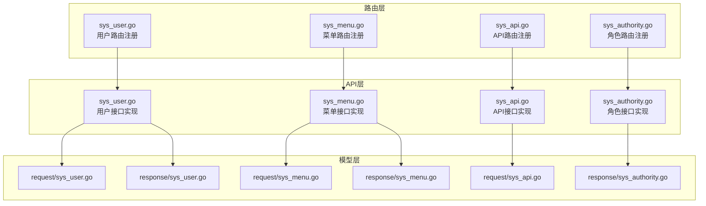
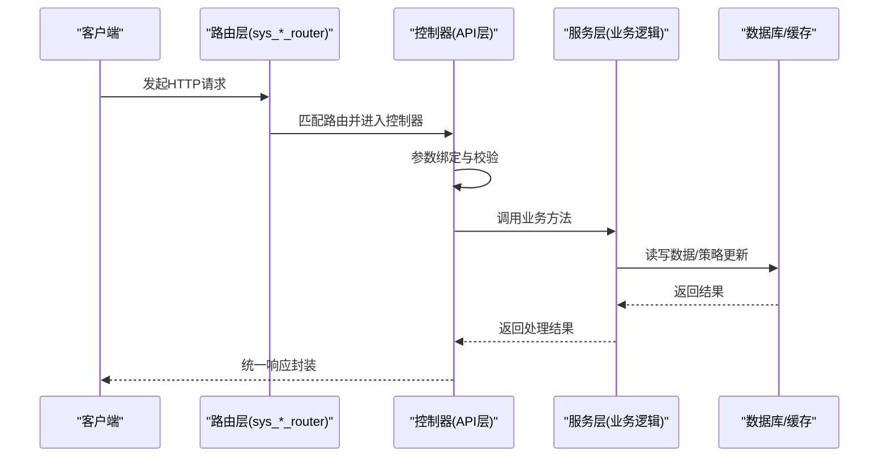
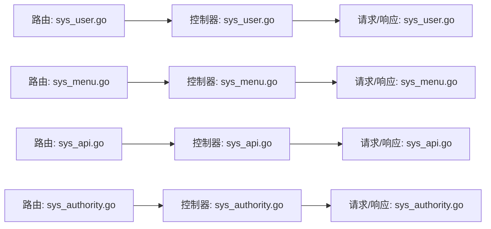

# 系统管理 API

<cite>
**本文引用的文件**
- [server/router/system/sys_user.go](file://server/router/system/sys_user.go)
- [server/router/system/sys_menu.go](file://server/router/system/sys_menu.go)
- [server/router/system/sys_api.go](file://server/router/system/sys_api.go)
- [server/router/system/sys_authority.go](file://server/router/system/sys_authority.go)
- [server/api/v1/system/sys_user.go](file://server/api/v1/system/sys_user.go)
- [server/api/v1/system/sys_menu.go](file://server/api/v1/system/sys_menu.go)
- [server/api/v1/system/sys_api.go](file://server/api/v1/system/sys_api.go)
- [server/api/v1/system/sys_authority.go](file://server/api/v1/system/sys_authority.go)
- [server/model/system/request/sys_user.go](file://server/model/system/request/sys_user.go)
- [server/model/system/request/sys_menu.go](file://server/model/system/request/sys_menu.go)
- [server/model/system/request/sys_api.go](file://server/model/system/request/sys_api.go)
- [server/model/system/response/sys_user.go](file://server/model/system/response/sys_user.go)
- [server/model/system/response/sys_menu.go](file://server/model/system/response/sys_menu.go)
- [server/model/system/response/sys_authority.go](file://server/model/system/response/sys_authority.go)
- [server/config/system.go](file://server/config/system.go)
</cite>

## 目录
1. [简介](#简介)
2. [项目结构](#项目结构)
3. [核心组件](#核心组件)
4. [架构总览](#架构总览)
5. [详细组件分析](#详细组件分析)
6. [依赖分析](#依赖分析)
7. [性能考量](#性能考量)
8. [故障排查指南](#故障排查指南)
9. [结论](#结论)
10. [附录](#附录)

## 简介
本文件为“系统管理 API”的综合技术文档，覆盖用户管理、菜单管理、API 管理与角色权限管理等核心能力。文档对每个接口提供统一的规范说明：HTTP 方法、URL 路径、请求参数、响应格式、错误码与安全机制，并给出最佳实践（如批量操作、分页查询、权限验证）。同时，结合后端路由与控制器实现，提供可追溯的来源定位，便于开发者快速上手与排错。

## 项目结构
系统管理 API 的后端采用分层设计：路由层负责路径注册与中间件挂载；API 层负责接口实现与校验；Model 层包含请求/响应结构体；配置层提供系统行为开关。下图展示与本文相关的模块关系：

**图表来源**
- [server/router/system/sys_user.go:10-27](file://server/router/system/sys_user.go#L10-L27)
- [server/router/system/sys_menu.go:10-27](file://server/router/system/sys_menu.go#L10-L27)
- [server/router/system/sys_api.go:10-34](file://server/router/system/sys_api.go#L10-L34)
- [server/router/system/sys_authority.go:10-24](file://server/router/system/sys_authority.go#L10-L24)
- [server/api/v1/system/sys_user.go:163-516](file://server/api/v1/system/sys_user.go#L163-L516)
- [server/api/v1/system/sys_menu.go:18-335](file://server/api/v1/system/sys_menu.go#L18-L335)
- [server/api/v1/system/sys_api.go:18-381](file://server/api/v1/system/sys_api.go#L18-L381)
- [server/api/v1/system/sys_authority.go:17-257](file://server/api/v1/system/sys_authority.go#L17-L257)
- [server/model/system/request/sys_user.go:8-78](file://server/model/system/request/sys_user.go#L8-L78)
- [server/model/system/request/sys_menu.go:8-34](file://server/model/system/request/sys_menu.go#L8-L34)
- [server/model/system/request/sys_api.go:8-22](file://server/model/system/request/sys_api.go#L8-L22)
- [server/model/system/response/sys_user.go:7-16](file://server/model/system/response/sys_user.go#L7-L16)
- [server/model/system/response/sys_menu.go:5-16](file://server/model/system/response/sys_menu.go#L5-L16)
- [server/model/system/response/sys_authority.go:5-13](file://server/model/system/response/sys_authority.go#L5-L13)

**章节来源**
- [server/router/system/sys_user.go:10-27](file://server/router/system/sys_user.go#L10-L27)
- [server/router/system/sys_menu.go:10-27](file://server/router/system/sys_menu.go#L10-L27)
- [server/router/system/sys_api.go:10-34](file://server/router/system/sys_api.go#L10-L34)
- [server/router/system/sys_authority.go:10-24](file://server/router/system/sys_authority.go#L10-L24)

## 核心组件
- 用户管理：提供管理员注册、密码修改/重置、用户信息设置、权限设置、列表查询、删除等能力。
- 菜单管理：提供菜单增删改、动态路由生成、菜单树构建、权限授权等能力。
- API 管理：提供 API 同步、分组、查询、创建/更新/删除、批量删除、角色授权等能力。
- 角色权限：提供角色 CRUD、角色复制、数据权限设置、角色-用户全量覆盖等能力。

**章节来源**
- [server/api/v1/system/sys_user.go:163-516](file://server/api/v1/system/sys_user.go#L163-L516)
- [server/api/v1/system/sys_menu.go:18-335](file://server/api/v1/system/sys_menu.go#L18-L335)
- [server/api/v1/system/sys_api.go:18-381](file://server/api/v1/system/sys_api.go#L18-L381)
- [server/api/v1/system/sys_authority.go:17-257](file://server/api/v1/system/sys_authority.go#L17-L257)

## 架构总览
系统管理 API 的调用流程遵循“路由 -> 控制器 -> 服务/模型 -> 数据库/缓存”的标准链路。鉴权通过 JWT 中间件与 Casbin 授权策略共同保障。

**图表来源**
- [server/router/system/sys_user.go:10-27](file://server/router/system/sys_user.go#L10-L27)
- [server/router/system/sys_menu.go:10-27](file://server/router/system/sys_menu.go#L10-L27)
- [server/router/system/sys_api.go:10-34](file://server/router/system/sys_api.go#L10-L34)
- [server/router/system/sys_authority.go:10-24](file://server/router/system/sys_authority.go#L10-L24)
- [server/api/v1/system/sys_user.go:238-262](file://server/api/v1/system/sys_user.go#L238-L262)
- [server/api/v1/system/sys_menu.go:317-335](file://server/api/v1/system/sys_menu.go#L317-L335)
- [server/api/v1/system/sys_api.go:169-202](file://server/api/v1/system/sys_api.go#L169-L202)
- [server/api/v1/system/sys_authority.go:154-172](file://server/api/v1/system/sys_authority.go#L154-L172)

## 详细组件分析

### 用户管理 API
- 接口清单与规范
  - 管理员注册
    - 方法：POST
    - 路径：/user/admin_register
    - 请求体：用户名、昵称、密码、头像、主角色ID、备用角色ID列表、启用状态、手机、邮箱
    - 成功响应：用户对象
  - 修改密码
    - 方法：POST
    - 路径：/user/changePassword
    - 请求体：原密码、新密码
    - 成功响应：成功消息
  - 设置用户权限（单角色）
    - 方法：POST
    - 路径：/user/setUserAuthority
    - 请求体：目标用户ID、角色ID
    - 成功响应：成功消息（并返回新 token 头部）
  - 批量设置用户权限（多角色）
    - 方法：POST
    - 路径：/user/setUserAuthorities
    - 请求体：目标用户ID、角色ID数组
    - 成功响应：成功消息
  - 删除用户
    - 方法：DELETE
    - 路径：/user/deleteUser
    - 请求体：用户ID
    - 成功响应：成功消息（不可删除自身）
  - 设置用户信息
    - 方法：PUT
    - 路径：/user/setUserInfo
    - 请求体：用户ID、昵称、头像、手机、邮箱、启用状态、角色ID数组（可选）
    - 成功响应：成功消息
  - 设置自身信息
    - 方法：PUT
    - 路径：/user/setSelfInfo
    - 请求体：昵称、头像、手机、邮箱、启用状态
    - 成功响应：成功消息
  - 重置用户密码
    - 方法：POST
    - 路径：/user/resetPassword
    - 请求体：用户ID、新密码
    - 成功响应：成功消息
  - 设置自身界面配置
    - 方法：PUT
    - 路径：/user/setSelfSetting
    - 请求体：任意 JSON 配置对象
    - 成功响应：成功消息
  - 分页获取用户列表
    - 方法：POST
    - 路径：/user/getUserList
    - 请求体：页码、每页数量、可选过滤字段（用户名、昵称、手机、邮箱）、排序键与升降序
    - 成功响应：分页结果（列表、总数、页码、每页数量）
  - 获取自身信息
    - 方法：GET
    - 路径：/user/getUserInfo
    - 成功响应：用户信息对象

- 关键实现要点
  - 参数绑定与校验：统一使用请求结构体与验证规则，确保输入合法。
  - 权限变更：当修改用户角色时，会重新签发 JWT 并通过响应头下发新 token 与过期时间。
  - 自身保护：删除用户接口禁止删除自身。
  - 分页查询：统一 PageResult 封装，支持排序与多字段过滤。

- 最佳实践
  - 批量操作：优先使用“批量设置用户权限”接口一次性更新，减少多次往返。
  - 分页查询：结合 OrderKey 与 Desc 实现稳定排序，避免数据漂移。
  - 权限验证：所有用户管理接口均需携带有效 JWT。

**章节来源**
- [server/router/system/sys_user.go:10-27](file://server/router/system/sys_user.go#L10-L27)
- [server/api/v1/system/sys_user.go:163-516](file://server/api/v1/system/sys_user.go#L163-L516)
- [server/model/system/request/sys_user.go:8-78](file://server/model/system/request/sys_user.go#L8-L78)
- [server/model/system/response/sys_user.go:7-16](file://server/model/system/response/sys_user.go#L7-L16)

### 菜单管理 API
- 接口清单与规范
  - 新增菜单
    - 方法：POST
    - 路径：/menu/addBaseMenu
    - 请求体：菜单基础信息（路由 path、父菜单 ID、路由 name、前端组件路径、排序标记、元信息等）
    - 成功响应：成功消息
  - 删除菜单
    - 方法：POST
    - 路径：/menu/deleteBaseMenu
    - 请求体：菜单 ID
    - 成功响应：成功消息
  - 更新菜单
    - 方法：POST
    - 路径：/menu/updateBaseMenu
    - 请求体：菜单基础信息（含 ID）
    - 成功响应：成功消息
  - 根据 ID 获取菜单
    - 方法：POST
    - 路径：/menu/getBaseMenuById
    - 请求体：菜单 ID
    - 成功响应：菜单详情
  - 获取菜单树
    - 方法：POST
    - 路径：/menu/getMenu
    - 成功响应：菜单树（SysMenusResponse）
  - 获取基础菜单树（用于动态路由）
    - 方法：POST
    - 路径：/menu/getBaseMenuTree
    - 成功响应：基础菜单列表（SysBaseMenusResponse）
  - 分页获取基础菜单列表
    - 方法：POST
    - 路径：/menu/getMenuList
    - 成功响应：分页结果
  - 增加菜单与角色关联
    - 方法：POST
    - 路径：/menu/addMenuAuthority
    - 请求体：菜单集合、角色 ID
    - 成功响应：成功消息
  - 获取指定角色的菜单
    - 方法：POST
    - 路径：/menu/getMenuAuthority
    - 请求体：角色 ID
    - 成功响应：菜单集合
  - 获取拥有指定菜单的角色 ID 列表
    - 方法：GET
    - 路径：/menu/getMenuRoles
    - 查询参数：菜单 ID
    - 成功响应：角色 ID 列表与默认首页角色 ID 列表
  - 全量覆盖某菜单关联的角色列表
    - 方法：POST
    - 路径：/menu/setMenuRoles
    - 请求体：菜单 ID、角色 ID 数组
    - 成功响应：成功消息

- 关键实现要点
  - 动态路由：通过“基础菜单树”接口输出前端可用的路由结构。
  - 权限授权：菜单与角色的关联通过“增加菜单与角色关联”或“全量覆盖”完成。
  - 菜单树构建：基于父子关系与排序字段生成层级结构。

- 最佳实践
  - 菜单变更后，建议配合“刷新 Casbin 权限”接口以确保策略即时生效。
  - 使用“全量覆盖”接口替代多次“追加/移除”，保证幂等性与一致性。

**章节来源**
- [server/router/system/sys_menu.go:10-27](file://server/router/system/sys_menu.go#L10-L27)
- [server/api/v1/system/sys_menu.go:18-335](file://server/api/v1/system/sys_menu.go#L18-L335)
- [server/model/system/request/sys_menu.go:8-34](file://server/model/system/request/sys_menu.go#L8-L34)
- [server/model/system/response/sys_menu.go:5-16](file://server/model/system/response/sys_menu.go#L5-L16)

### API 管理 API
- 接口清单与规范
  - 同步 API
    - 方法：GET
    - 路径：/api/syncApi
    - 成功响应：新增 API 列表、删除 API 列表、忽略 API 列表
  - 确认同步 API
    - 方法：POST
    - 路径：/api/enterSyncApi
    - 请求体：待确认的同步差异集合
    - 成功响应：成功消息
  - 忽略 API
    - 方法：POST
    - 路径：/api/ignoreApi
    - 请求体：忽略的 API 信息
    - 成功响应：成功消息
  - 获取 API 分组
    - 方法：GET
    - 路径：/api/getApiGroups
    - 成功响应：分组列表与分组映射
  - 创建 API
    - 方法：POST
    - 路径：/api/createApi
    - 请求体：API 路径、中文描述、分组、方法
    - 成功响应：成功消息
  - 更新 API
    - 方法：POST
    - 路径：/api/updateApi
    - 请求体：API 信息（含 ID）
    - 成功响应：成功消息
  - 删除 API
    - 方法：POST
    - 路径：/api/deleteApi
    - 请求体：API ID
    - 成功响应：成功消息
  - 批量删除 API
    - 方法：DELETE
    - 路径：/api/deleteApisByIds
    - 请求体：ID 数组
    - 成功响应：成功消息
  - 获取单条 API 详情
    - 方法：POST
    - 路径：/api/getApiById
    - 请求体：API ID
    - 成功响应：API 详情
  - 获取所有 API（不分页）
    - 方法：POST
    - 路径：/api/getAllApis
    - 成功响应：API 列表
  - 分页获取 API 列表
    - 方法：POST
    - 路径：/api/getApiList
    - 请求体：分页信息、可选过滤字段、排序键与升降序
    - 成功响应：分页结果
  - 获取拥有指定 API 权限的角色 ID 列表
    - 方法：GET
    - 路径：/api/getApiRoles
    - 查询参数：path、method
    - 成功响应：角色 ID 列表
  - 全量覆盖某 API 关联的角色列表
    - 方法：POST
    - 路径：/api/setApiRoles
    - 请求体：API 路径、方法、角色 ID 数组
    - 成功响应：成功消息（并自动刷新 Casbin 策略）
  - 刷新 Casbin 权限
    - 方法：GET
    - 路径：/api/freshCasbin
    - 成功响应：成功消息

- 关键实现要点
  - API 同步：对比扫描结果与数据库记录，提供三类差异供人工确认。
  - 权限控制：基于路径与方法进行细粒度授权，支持全量覆盖与查询。
  - 策略生效：设置角色授权后自动刷新 Casbin 缓存，确保即时生效。

- 最佳实践
  - 在批量调整 API 权限时，优先使用“全量覆盖”接口，避免部分授权导致的不一致。
  - 同步完成后务必执行“确认同步”与“刷新 Casbin”。

**章节来源**
- [server/router/system/sys_api.go:10-34](file://server/router/system/sys_api.go#L10-L34)
- [server/api/v1/system/sys_api.go:18-381](file://server/api/v1/system/sys_api.go#L18-L381)
- [server/model/system/request/sys_api.go:8-22](file://server/model/system/request/sys_api.go#L8-L22)

### 角色权限 API
- 接口清单与规范
  - 创建角色
    - 方法：POST
    - 路径：/authority/createAuthority
    - 请求体：角色标识、名称、父角色 ID（可选）
    - 成功响应：角色详情
  - 更新角色
    - 方法：PUT
    - 路径：/authority/updateAuthority
    - 请求体：角色信息（含 ID）
    - 成功响应：角色详情
  - 删除角色
    - 方法：POST
    - 路径：/authority/deleteAuthority
    - 请求体：角色 ID
    - 成功响应：成功消息（删除前检查是否仍有用户关联）
  - 复制角色
    - 方法：POST
    - 路径：/authority/copyAuthority
    - 请求体：旧角色 ID、新角色标识/名称/父角色
    - 成功响应：新角色详情
  - 设置数据权限
    - 方法：POST
    - 路径：/authority/setDataAuthority
    - 请求体：角色 ID、资源范围（由服务层定义）
    - 成功响应：成功消息
  - 分页获取角色列表
    - 方法：POST
    - 路径：/authority/getAuthorityList
    - 成功响应：分页结果
  - 获取拥有指定角色的用户 ID 列表
    - 方法：GET
    - 路径：/authority/getUsersByAuthority
    - 查询参数：角色 ID
    - 成功响应：用户 ID 列表
  - 全量覆盖某角色关联的用户列表
    - 方法：POST
    - 路径：/authority/setRoleUsers
    - 请求体：角色 ID、用户 ID 数组
    - 成功响应：成功消息

- 关键实现要点
  - 严格权限模式：当启用严格权限时，创建角色默认继承调用者角色作为父节点。
  - 角色-用户关联：支持全量覆盖，确保角色与用户的对应关系清晰一致。
  - 权限刷新：创建/删除/复制角色后会刷新 Casbin 策略，保证权限即时生效。

- 最佳实践
  - 使用“全量覆盖”接口维护角色-用户关系，避免遗漏或残留。
  - 在启用严格权限模式时，注意角色树的层级关系与继承约束。

**章节来源**
- [server/router/system/sys_authority.go:10-24](file://server/router/system/sys_authority.go#L10-L24)
- [server/api/v1/system/sys_authority.go:17-257](file://server/api/v1/system/sys_authority.go#L17-L257)
- [server/config/system.go:13-13](file://server/config/system.go#L13-L13)

## 依赖分析
- 路由到控制器
  - 用户路由：/user/* → 用户控制器（含带操作记录中间件与无记录中间件两套）
  - 菜单路由：/menu/* → 菜单控制器（含带操作记录中间件与无记录中间件两套）
  - API 路由：/api/* → API 控制器（含带操作记录中间件、无记录中间件与公开路由）
  - 角色路由：/authority/* → 角色控制器（含带操作记录中间件与无记录中间件两套）

- 控制器到服务/模型
  - 控制器统一进行参数绑定与校验，随后调用服务层执行业务逻辑，最终返回统一响应封装。
  - 请求/响应结构体集中于 model/system/request 与 model/system/response，便于前后端契约一致。

**图表来源**
- [server/router/system/sys_user.go:10-27](file://server/router/system/sys_user.go#L10-L27)
- [server/router/system/sys_menu.go:10-27](file://server/router/system/sys_menu.go#L10-L27)
- [server/router/system/sys_api.go:10-34](file://server/router/system/sys_api.go#L10-L34)
- [server/router/system/sys_authority.go:10-24](file://server/router/system/sys_authority.go#L10-L24)
- [server/api/v1/system/sys_user.go:238-262](file://server/api/v1/system/sys_user.go#L238-L262)
- [server/api/v1/system/sys_menu.go:317-335](file://server/api/v1/system/sys_menu.go#L317-L335)
- [server/api/v1/system/sys_api.go:169-202](file://server/api/v1/system/sys_api.go#L169-L202)
- [server/api/v1/system/sys_authority.go:154-172](file://server/api/v1/system/sys_authority.go#L154-L172)

**章节来源**
- [server/router/system/sys_user.go:10-27](file://server/router/system/sys_user.go#L10-L27)
- [server/router/system/sys_menu.go:10-27](file://server/router/system/sys_menu.go#L10-L27)
- [server/router/system/sys_api.go:10-34](file://server/router/system/sys_api.go#L10-L34)
- [server/router/system/sys_authority.go:10-24](file://server/router/system/sys_authority.go#L10-L24)

## 性能考量
- 分页查询
  - 用户、菜单、API 列表均支持分页，建议在大数据量场景下设置合理的 PageSize，并结合排序键与过滤条件提升检索效率。
- 批量操作
  - 优先使用“批量设置用户权限/菜单角色/API 角色”接口，减少网络往返与事务开销。
- 缓存与并发
  - 系统支持 Redis 与多点登录拦截，建议在高并发场景下启用 Redis 以降低 JWT 黑名单查询压力。
- 权限刷新
  - 设置角色/菜单/API 权限时会触发 Casbin 策略刷新，建议在批量导入时合并操作后再统一刷新，避免频繁刷新带来的抖动。

[本节为通用指导，无需列出具体文件来源]

## 故障排查指南
- 常见错误与定位
  - 参数校验失败：检查请求体字段是否符合请求结构体要求（如 ID、角色 ID、分页信息等）。
  - 权限不足：确认 JWT 是否有效且未过期；检查角色是否具备相应菜单/API 权限。
  - 自身保护：删除用户时若尝试删除自身会返回错误，请使用其他管理员账户执行。
  - 同步差异：API 同步后需“确认同步”，否则不会写入数据库；忽略 API 需要单独处理。
- 日志与审计
  - 所有写操作均带有操作记录中间件，可通过日志定位异常请求与参数。
  - 登录失败会记录失败原因（如验证码错误、用户名不存在、密码错误、用户被禁用），便于排查。

**章节来源**
- [server/api/v1/system/sys_user.go:331-364](file://server/api/v1/system/sys_user.go#L331-L364)
- [server/api/v1/system/sys_menu.go:58-85](file://server/api/v1/system/sys_menu.go#L58-L85)
- [server/api/v1/system/sys_api.go:91-113](file://server/api/v1/system/sys_api.go#L91-L113)
- [server/api/v1/system/sys_authority.go:94-122](file://server/api/v1/system/sys_authority.go#L94-L122)

## 结论
本文档系统梳理了系统管理 API 的用户、菜单、API 与角色权限四大模块，给出了统一的接口规范、实现要点与最佳实践。通过路由与控制器的清晰分层、严格的参数校验与统一响应封装，以及基于 JWT 与 Casbin 的权限控制，能够满足企业级后台系统的权限治理需求。建议在实际接入时，结合分页与批量接口提升性能，并在批量变更后及时刷新权限策略。

[本节为总结性内容，无需列出具体文件来源]

## 附录

### 接口调用示例与最佳实践
- 批量设置用户权限
  - 使用“批量设置用户权限”接口一次性更新多个角色，避免多次请求。
- 分页查询
  - 在用户/菜单/API 列表查询时，结合过滤字段与排序键，确保结果稳定可预期。
- 权限验证
  - 所有受保护接口均需携带有效 JWT；角色变更后请关注响应头中的新 token 与过期时间。
- API 同步
  - 先执行“同步 API”，再对差异进行“确认同步”，最后“刷新 Casbin”。

[本节为通用指导，无需列出具体文件来源]