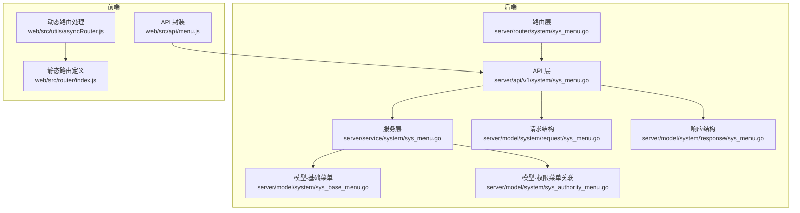
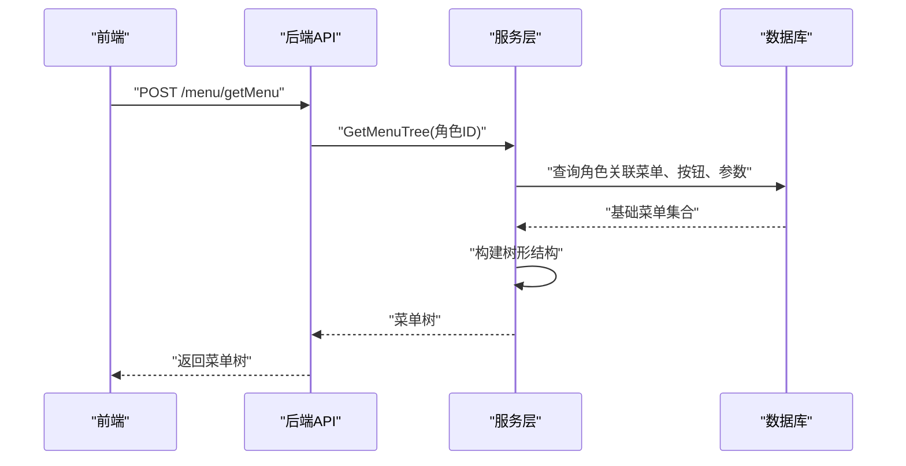
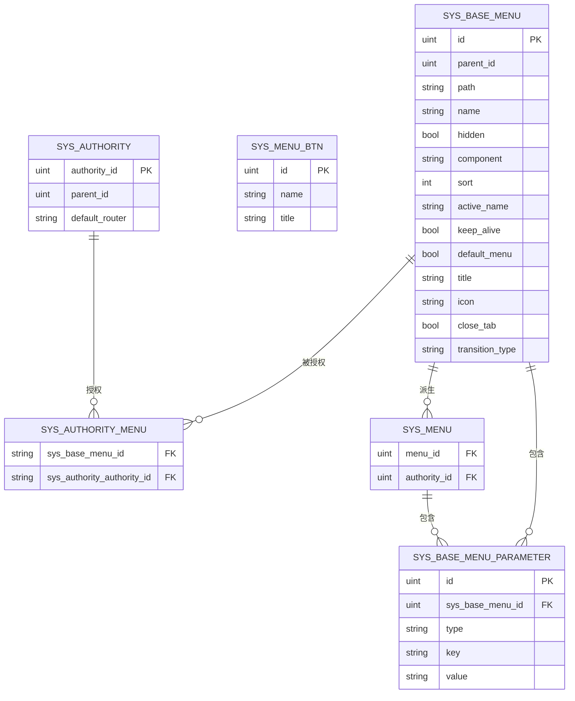
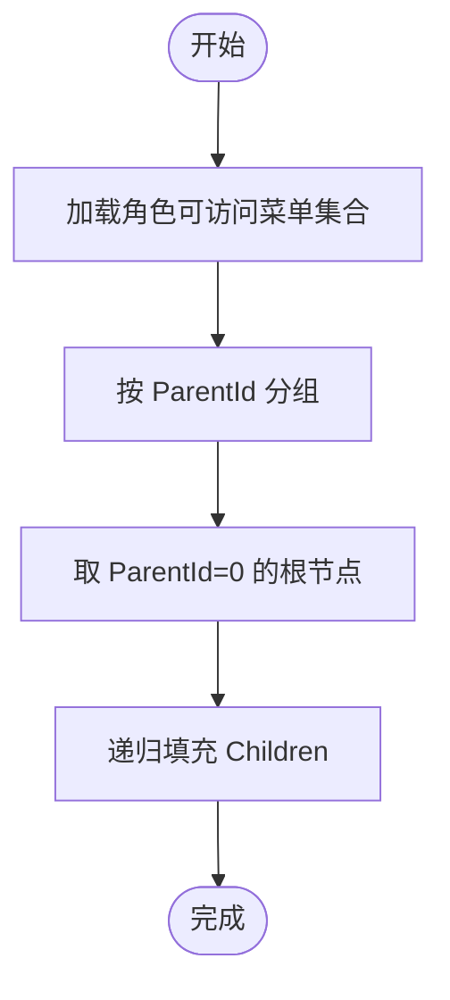
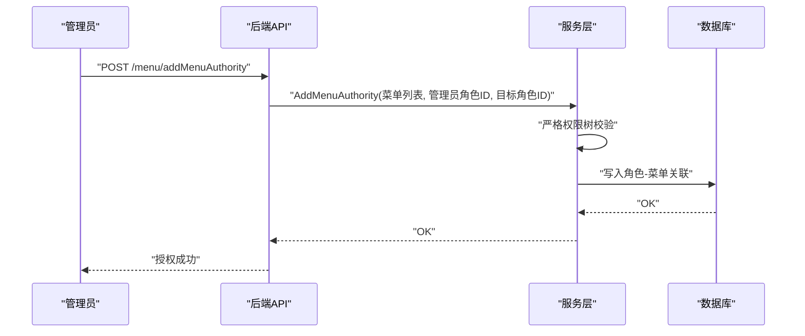
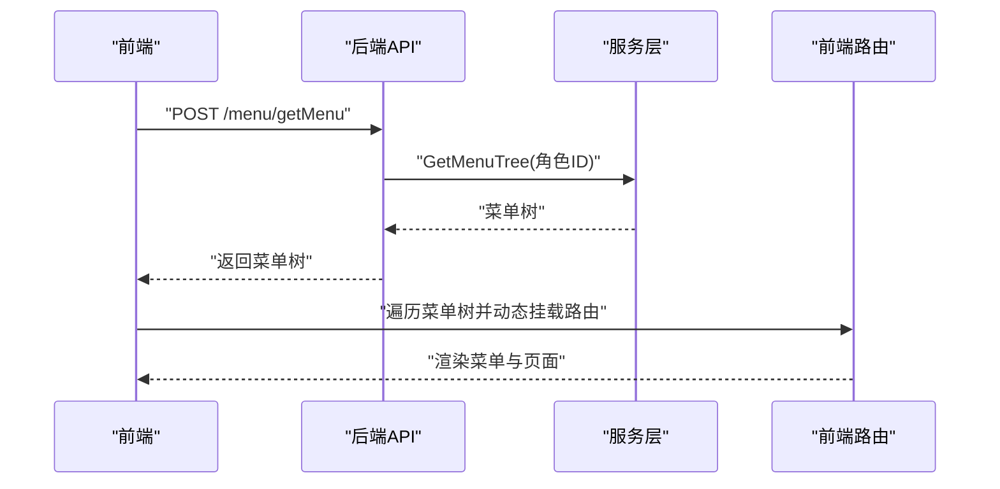
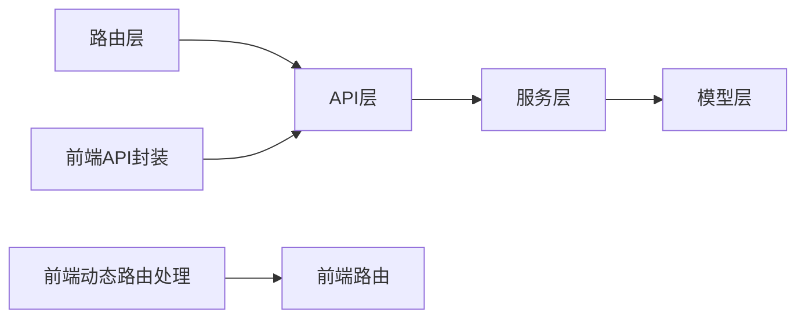

# 菜单管理 API

<cite>
**本文引用的文件**
- [server/api/v1/system/sys_menu.go](file://server/api/v1/system/sys_menu.go)
- [server/router/system/sys_menu.go](file://server/router/system/sys_menu.go)
- [server/service/system/sys_menu.go](file://server/service/system/sys_menu.go)
- [server/model/system/sys_base_menu.go](file://server/model/system/sys_base_menu.go)
- [server/model/system/sys_authority_menu.go](file://server/model/system/sys_authority_menu.go)
- [server/model/system/request/sys_menu.go](file://server/model/system/request/sys_menu.go)
- [server/model/system/response/sys_menu.go](file://server/model/system/response/sys_menu.go)
- [web/src/api/menu.js](file://web/src/api/menu.js)
- [web/src/utils/asyncRouter.js](file://web/src/utils/asyncRouter.js)
- [web/src/router/index.js](file://web/src/router/index.js)
</cite>

## 目录
1. [简介](#简介)
2. [项目结构](#项目结构)
3. [核心组件](#核心组件)
4. [架构总览](#架构总览)
5. [详细组件分析](#详细组件分析)
6. [依赖分析](#依赖分析)
7. [性能考量](#性能考量)
8. [故障排查指南](#故障排查指南)
9. [结论](#结论)
10. [附录](#附录)

## 简介
本文件面向后端与前端开发者，系统性梳理“菜单管理 API”的接口规范与实现机制，涵盖菜单 CRUD、动态路由生成、菜单树构建、权限授权与前端路由映射等关键能力。文档基于仓库中的实际代码实现，提供接口清单、请求/响应结构、错误处理与安全控制说明，并给出菜单树构建算法与父子关系维护、排序规则、显示控制等实现细节。

## 项目结构
菜单管理相关模块分布于后端 API、服务层、数据模型与前端 API 封装、路由处理等位置，形成清晰的分层职责：
- 后端
  - 路由层：定义菜单相关路由组与方法绑定
  - API 层：暴露菜单与权限授权接口
  - 服务层：实现菜单树构建、权限关联、角色默认路由校验等业务逻辑
  - 模型层：定义菜单、权限关联、请求/响应结构
- 前端
  - API 封装：统一调用后端菜单接口
  - 路由处理：动态解析组件路径并挂载到路由树

图表来源
- [server/router/system/sys_menu.go:10-29](file://server/router/system/sys_menu.go#L10-L29)
- [server/api/v1/system/sys_menu.go:18-336](file://server/api/v1/system/sys_menu.go#L18-L336)
- [server/service/system/sys_menu.go:18-391](file://server/service/system/sys_menu.go#L18-L391)
- [server/model/system/sys_base_menu.go:7-44](file://server/model/system/sys_base_menu.go#L7-L44)
- [server/model/system/sys_authority_menu.go:3-20](file://server/model/system/sys_authority_menu.go#L3-L20)
- [server/model/system/request/sys_menu.go:8-18](file://server/model/system/request/sys_menu.go#L8-L18)
- [server/model/system/response/sys_menu.go:5-16](file://server/model/system/response/sys_menu.go#L5-L16)
- [web/src/api/menu.js:6-142](file://web/src/api/menu.js#L6-L142)
- [web/src/utils/asyncRouter.js:4-30](file://web/src/utils/asyncRouter.js#L4-L30)
- [web/src/router/index.js:1-42](file://web/src/router/index.js#L1-L42)

章节来源
- [server/router/system/sys_menu.go:10-29](file://server/router/system/sys_menu.go#L10-L29)
- [server/api/v1/system/sys_menu.go:18-336](file://server/api/v1/system/sys_menu.go#L18-L336)
- [server/service/system/sys_menu.go:18-391](file://server/service/system/sys_menu.go#L18-L391)
- [server/model/system/sys_base_menu.go:7-44](file://server/model/system/sys_base_menu.go#L7-L44)
- [server/model/system/sys_authority_menu.go:3-20](file://server/model/system/sys_authority_menu.go#L3-L20)
- [server/model/system/request/sys_menu.go:8-18](file://server/model/system/request/sys_menu.go#L8-L18)
- [server/model/system/response/sys_menu.go:5-16](file://server/model/system/response/sys_menu.go#L5-L16)
- [web/src/api/menu.js:6-142](file://web/src/api/menu.js#L6-L142)
- [web/src/utils/asyncRouter.js:4-30](file://web/src/utils/asyncRouter.js#L4-L30)
- [web/src/router/index.js:1-42](file://web/src/router/index.js#L1-L42)

## 核心组件
- 路由层：定义菜单路由组 menu，区分带操作记录与不带操作记录两类接口
- API 层：提供菜单 CRUD、动态路由、权限授权、菜单列表、按菜单查询角色等接口
- 服务层：实现菜单树构建、权限关联、严格权限树校验、默认首页校验等
- 模型层：SysBaseMenu（基础菜单）、SysMenu（带权限上下文的菜单）、SysAuthorityMenu（角色-菜单关联）
- 前端封装：统一调用后端菜单接口；动态解析组件路径；与静态路由配合

章节来源
- [server/router/system/sys_menu.go:10-29](file://server/router/system/sys_menu.go#L10-L29)
- [server/api/v1/system/sys_menu.go:18-336](file://server/api/v1/system/sys_menu.go#L18-L336)
- [server/service/system/sys_menu.go:18-391](file://server/service/system/sys_menu.go#L18-L391)
- [server/model/system/sys_base_menu.go:7-44](file://server/model/system/sys_base_menu.go#L7-L44)
- [server/model/system/sys_authority_menu.go:3-20](file://server/model/system/sys_authority_menu.go#L3-L20)
- [web/src/api/menu.js:6-142](file://web/src/api/menu.js#L6-L142)

## 架构总览
后端采用“路由 -> API -> 服务 -> 模型/数据库”的分层设计；前端通过 API 封装调用后端接口，并在运行时将后端返回的菜单树转换为可加载的前端路由。

图表来源
- [server/api/v1/system/sys_menu.go:26-37](file://server/api/v1/system/sys_menu.go#L26-L37)
- [server/service/system/sys_menu.go:78-85](file://server/service/system/sys_menu.go#L78-L85)

## 详细组件分析

### 接口清单与规范

以下接口均基于后端注释与实现，包含 HTTP 方法、URL、请求参数、响应结构与典型错误场景说明。为避免冗长，仅列出关键字段与约束。

- 获取用户动态路由
  - 方法：POST
  - 路径：/menu/getMenu
  - 请求体：空对象
  - 响应体：包含菜单树的结构
  - 错误：获取失败时返回通用错误消息
  - 关键实现：[server/api/v1/system/sys_menu.go:26-37](file://server/api/v1/system/sys_menu.go#L26-L37)，[server/service/system/sys_menu.go:78-85](file://server/service/system/sys_menu.go#L78-L85)

- 获取基础菜单树
  - 方法：POST
  - 路径：/menu/getBaseMenuTree
  - 请求体：空对象
  - 响应体：包含基础菜单树
  - 错误：获取失败时返回通用错误消息
  - 关键实现：[server/api/v1/system/sys_menu.go:47-56](file://server/api/v1/system/sys_menu.go#L47-L56)，[server/service/system/sys_menu.go:226-233](file://server/service/system/sys_menu.go#L226-L233)

- 新增菜单
  - 方法：POST
  - 路径：/menu/addBaseMenu
  - 请求体：基础菜单对象（含父级ID、路由路径、名称、组件、排序、元信息等）
  - 响应体：成功/失败消息
  - 错误：参数校验失败、父菜单不存在、重复名称、跨级操作限制等
  - 关键实现：[server/api/v1/system/sys_menu.go:126-150](file://server/api/v1/system/sys_menu.go#L126-L150)，[server/service/system/sys_menu.go:136-183](file://server/service/system/sys_menu.go#L136-L183)

- 删除菜单
  - 方法：POST
  - 路径：/menu/deleteBaseMenu
  - 请求体：菜单ID
  - 响应体：成功/失败消息
  - 错误：ID 校验失败、删除失败
  - 关键实现：[server/api/v1/system/sys_menu.go:161-180](file://server/api/v1/system/sys_menu.go#L161-L180)，[server/service/system/sys_base_menu.go](file://server/service/system/sys_base_menu.go)

- 更新菜单
  - 方法：POST
  - 路径：/menu/updateBaseMenu
  - 请求体：基础菜单对象
  - 响应体：成功/失败消息
  - 错误：参数校验失败、更新失败
  - 关键实现：[server/api/v1/system/sys_menu.go:191-215](file://server/api/v1/system/sys_menu.go#L191-L215)，[server/service/system/sys_base_menu.go](file://server/service/system/sys_base_menu.go)

- 根据ID获取菜单
  - 方法：POST
  - 路径：/menu/getBaseMenuById
  - 请求体：菜单ID
  - 响应体：单个菜单对象
  - 错误：ID 校验失败、获取失败
  - 关键实现：[server/api/v1/system/sys_menu.go:226-245](file://server/api/v1/system/sys_menu.go#L226-L245)

- 分页获取菜单列表
  - 方法：POST
  - 路径：/menu/getMenuList
  - 请求体：分页信息
  - 响应体：分页结果（列表、总数、页码、每页数量）
  - 错误：获取失败
  - 关键实现：[server/api/v1/system/sys_menu.go:326-335](file://server/api/v1/system/sys_menu.go#L326-L335)，[server/service/system/sys_menu.go:106-114](file://server/service/system/sys_menu.go#L106-L114)

- 增加菜单与角色关联
  - 方法：POST
  - 路径：/menu/addMenuAuthority
  - 请求体：菜单列表 + 角色ID
  - 响应体：成功/失败消息
  - 错误：参数校验失败、跨级操作限制、添加失败
  - 关键实现：[server/api/v1/system/sys_menu.go:67-85](file://server/api/v1/system/sys_menu.go#L67-L85)，[server/service/system/sys_menu.go:241-282](file://server/service/system/sys_menu.go#L241-L282)

- 获取指定角色的菜单树
  - 方法：POST
  - 路径：/menu/getMenuAuthority
  - 请求体：角色ID
  - 响应体：菜单树
  - 错误：参数校验失败、获取失败
  - 关键实现：[server/api/v1/system/sys_menu.go:96-115](file://server/api/v1/system/sys_menu.go#L96-L115)，[server/service/system/sys_menu.go:289-315](file://server/service/system/sys_menu.go#L289-L315)

- 获取拥有指定菜单的角色ID列表
  - 方法：GET
  - 路径：/menu/getMenuRoles
  - 查询参数：菜单ID
  - 响应体：角色ID列表、默认首页角色ID列表
  - 错误：参数非法、获取失败
  - 关键实现：[server/api/v1/system/sys_menu.go:256-288](file://server/api/v1/system/sys_menu.go#L256-L288)，[server/service/system/sys_menu.go:317-349](file://server/service/system/sys_menu.go#L317-L349)

- 全量覆盖某菜单关联的角色列表
  - 方法：POST
  - 路径：/menu/setMenuRoles
  - 请求体：菜单ID + 角色ID列表
  - 响应体：成功/失败消息
  - 错误：参数非法、设置失败
  - 关键实现：[server/api/v1/system/sys_menu.go:299-315](file://server/api/v1/system/sys_menu.go#L299-L315)，[server/service/system/sys_menu.go:351-374](file://server/service/system/sys_menu.go#L351-L374)

章节来源
- [server/api/v1/system/sys_menu.go:26-335](file://server/api/v1/system/sys_menu.go#L26-L335)
- [server/service/system/sys_menu.go:78-374](file://server/service/system/sys_menu.go#L78-L374)

### 数据模型与关系

图表来源
- [server/model/system/sys_base_menu.go:7-44](file://server/model/system/sys_base_menu.go#L7-L44)
- [server/model/system/sys_authority_menu.go:3-20](file://server/model/system/sys_authority_menu.go#L3-L20)

章节来源
- [server/model/system/sys_base_menu.go:7-44](file://server/model/system/sys_base_menu.go#L7-L44)
- [server/model/system/sys_authority_menu.go:3-20](file://server/model/system/sys_authority_menu.go#L3-L20)

### 菜单树构建算法与父子关系维护
- 树构建步骤
  1) 依据角色ID查询其可访问的基础菜单集合
  2) 按 ParentId 分组构建映射表
  3) 从根节点（ParentId=0）开始递归填充 Children
- 排序规则
  - 菜单按 Sort 升序排列
- 显示控制
  - Hidden 字段用于前端隐藏
- 算法复杂度
  - 时间复杂度 O(N)，N 为菜单条目数
  - 空间复杂度 O(N)

图表来源
- [server/service/system/sys_menu.go:190-233](file://server/service/system/sys_menu.go#L190-L233)
- [server/service/system/sys_menu.go:78-99](file://server/service/system/sys_menu.go#L78-L99)

章节来源
- [server/service/system/sys_menu.go:78-233](file://server/service/system/sys_menu.go#L78-L233)

### 权限授权与安全控制
- 角色-菜单关联
  - 通过 SysAuthorityMenu 进行多对多关联
  - 支持全量覆盖与增量授权
- 严格权限树
  - 当启用严格权限树且父角色非0时，子角色只能授权给父角色已拥有的菜单集合
- 默认首页校验
  - 若用户默认首页不在其授权菜单范围内，则回退到 404
- 安全中间件
  - 路由层使用操作记录中间件保护部分接口

图表来源
- [server/api/v1/system/sys_menu.go:67-85](file://server/api/v1/system/sys_menu.go#L67-L85)
- [server/service/system/sys_menu.go:241-282](file://server/service/system/sys_menu.go#L241-L282)

章节来源
- [server/api/v1/system/sys_menu.go:67-85](file://server/api/v1/system/sys_menu.go#L67-L85)
- [server/service/system/sys_menu.go:241-282](file://server/service/system/sys_menu.go#L241-L282)

### 前端路由集成与动态路由映射
- 动态路由获取
  - 前端调用 /menu/getMenu 获取菜单树
- 组件路径解析
  - 基于后端返回的 component 字段，前端动态匹配对应视图模块
- 静态路由与动态路由
  - 静态路由定义基础页面与兜底路由
  - 动态路由由后端菜单树生成并挂载到前端路由系统

图表来源
- [web/src/api/menu.js:6-11](file://web/src/api/menu.js#L6-L11)
- [web/src/utils/asyncRouter.js:4-30](file://web/src/utils/asyncRouter.js#L4-L30)
- [web/src/router/index.js:1-42](file://web/src/router/index.js#L1-L42)

章节来源
- [web/src/api/menu.js:6-142](file://web/src/api/menu.js#L6-L142)
- [web/src/utils/asyncRouter.js:4-30](file://web/src/utils/asyncRouter.js#L4-L30)
- [web/src/router/index.js:1-42](file://web/src/router/index.js#L1-L42)

## 依赖分析
- 路由层依赖 API 层
- API 层依赖服务层与模型层
- 服务层依赖数据库模型与配置
- 前端 API 封装依赖后端接口
- 前端动态路由处理依赖后端返回的组件路径

图表来源
- [server/router/system/sys_menu.go:10-29](file://server/router/system/sys_menu.go#L10-L29)
- [server/api/v1/system/sys_menu.go:18-336](file://server/api/v1/system/sys_menu.go#L18-L336)
- [server/service/system/sys_menu.go:18-391](file://server/service/system/sys_menu.go#L18-L391)
- [web/src/api/menu.js:6-142](file://web/src/api/menu.js#L6-L142)
- [web/src/utils/asyncRouter.js:4-30](file://web/src/utils/asyncRouter.js#L4-L30)

章节来源
- [server/router/system/sys_menu.go:10-29](file://server/router/system/sys_menu.go#L10-L29)
- [server/api/v1/system/sys_menu.go:18-336](file://server/api/v1/system/sys_menu.go#L18-L336)
- [server/service/system/sys_menu.go:18-391](file://server/service/system/sys_menu.go#L18-L391)
- [web/src/api/menu.js:6-142](file://web/src/api/menu.js#L6-L142)
- [web/src/utils/asyncRouter.js:4-30](file://web/src/utils/asyncRouter.js#L4-L30)

## 性能考量
- 菜单树构建为一次扫描与递归，时间复杂度 O(N)
- 分页接口建议前端传入合理页码与大小，避免一次性拉取过大列表
- 严格权限树开启时会增加查询与校验成本，需结合业务权衡
- 建议对高频接口增加缓存或减少不必要的预加载字段

## 故障排查指南
- 参数校验失败
  - 现象：接口返回参数错误消息
  - 处理：检查请求体字段类型与必填项
  - 参考：[server/api/v1/system/sys_menu.go:128-141](file://server/api/v1/system/sys_menu.go#L128-L141)
- 父菜单不存在
  - 现象：新增菜单时报错父菜单不存在
  - 处理：确认 ParentId 正确或先创建父菜单
  - 参考：[server/service/system/sys_menu.go:143-151](file://server/service/system/sys_menu.go#L143-L151)
- 重复名称
  - 现象：新增菜单时报错存在重复名称
  - 处理：修改名称或确保唯一性
  - 参考：[server/service/system/sys_menu.go:139-141](file://server/service/system/sys_menu.go#L139-L141)
- 跨级授权限制
  - 现象：为子角色授权时报错请勿跨级操作
  - 处理：仅授权给父角色已拥有的菜单
  - 参考：[server/service/system/sys_menu.go:256-278](file://server/service/system/sys_menu.go#L256-L278)
- 默认首页失效
  - 现象：用户登录后跳转 404
  - 处理：将默认首页设置为该角色可访问的菜单
  - 参考：[server/service/system/sys_menu.go:379-390](file://server/service/system/sys_menu.go#L379-L390)

章节来源
- [server/api/v1/system/sys_menu.go:128-141](file://server/api/v1/system/sys_menu.go#L128-L141)
- [server/service/system/sys_menu.go:139-151](file://server/service/system/sys_menu.go#L139-L151)
- [server/service/system/sys_menu.go:256-278](file://server/service/system/sys_menu.go#L256-L278)
- [server/service/system/sys_menu.go:379-390](file://server/service/system/sys_menu.go#L379-L390)

## 结论
本菜单管理 API 提供了完善的菜单 CRUD、动态路由生成、权限授权与前端集成能力。通过清晰的分层设计与严谨的权限校验，能够满足复杂权限体系下的菜单管理需求。建议在生产环境中结合分页、缓存与严格权限树策略，持续优化性能与安全性。

## 附录

### 实际应用场景示例

- 菜单添加
  - 步骤：准备基础菜单数据（父级ID、路由路径、组件、排序、元信息），调用新增接口
  - 注意：若父菜单为叶子节点，可能触发权限清理与首页占用检查
  - 参考：[server/api/v1/system/sys_menu.go:126-150](file://server/api/v1/system/sys_menu.go#L126-L150)，[server/service/system/sys_menu.go:136-183](file://server/service/system/sys_menu.go#L136-L183)

- 菜单编辑
  - 步骤：调用更新接口，提交完整菜单对象
  - 注意：保持与现有父子关系一致，避免破坏树结构
  - 参考：[server/api/v1/system/sys_menu.go:191-215](file://server/api/v1/system/sys_menu.go#L191-L215)

- 菜单删除
  - 步骤：调用删除接口，传入菜单ID
  - 注意：删除前评估是否影响子菜单与权限关联
  - 参考：[server/api/v1/system/sys_menu.go:161-180](file://server/api/v1/system/sys_menu.go#L161-L180)

- 拖拽排序
  - 步骤：前端调整菜单顺序后提交更新接口
  - 注意：排序字段按升序生效
  - 参考：[server/model/system/sys_base_menu.go:15](file://server/model/system/sys_base_menu.go#L15)，[server/api/v1/system/sys_menu.go:191-215](file://server/api/v1/system/sys_menu.go#L191-L215)

- 权限分配
  - 步骤：获取目标角色的菜单树，勾选授权后调用授权接口
  - 注意：严格权限树下仅能授权给父角色已拥有的菜单
  - 参考：[server/api/v1/system/sys_menu.go:67-85](file://server/api/v1/system/sys_menu.go#L67-L85)，[server/service/system/sys_menu.go:241-282](file://server/service/system/sys_menu.go#L241-L282)

- 默认首页设置
  - 步骤：将某个菜单名称设置为角色默认首页，登录后自动跳转
  - 注意：若默认首页不在授权范围内，将回退到 404
  - 参考：[server/service/system/sys_menu.go:379-390](file://server/service/system/sys_menu.go#L379-L390)

章节来源
- [server/api/v1/system/sys_menu.go:126-215](file://server/api/v1/system/sys_menu.go#L126-L215)
- [server/service/system/sys_menu.go:136-183](file://server/service/system/sys_menu.go#L136-L183)
- [server/service/system/sys_menu.go:241-282](file://server/service/system/sys_menu.go#L241-L282)
- [server/service/system/sys_menu.go:379-390](file://server/service/system/sys_menu.go#L379-L390)