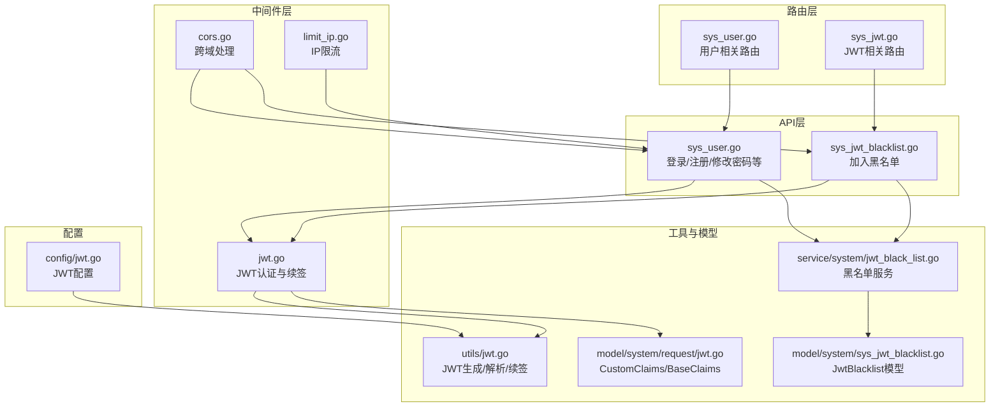
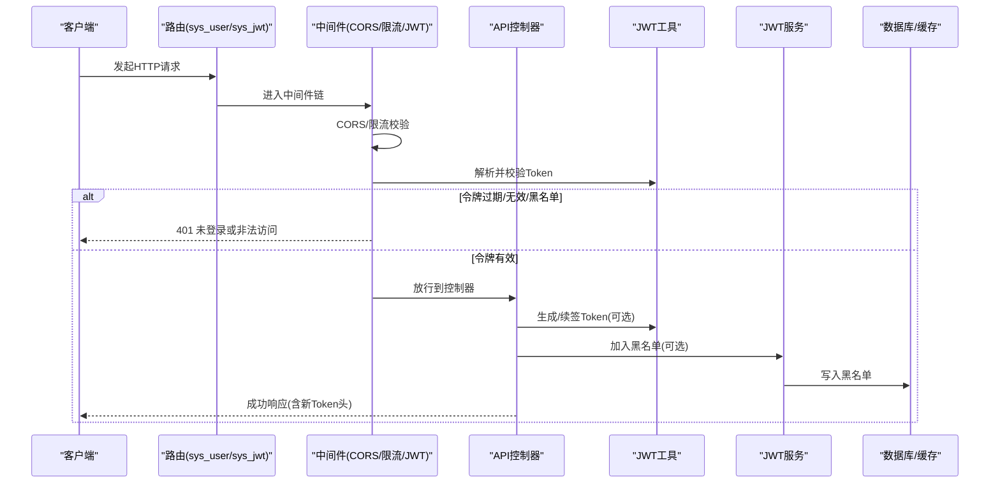
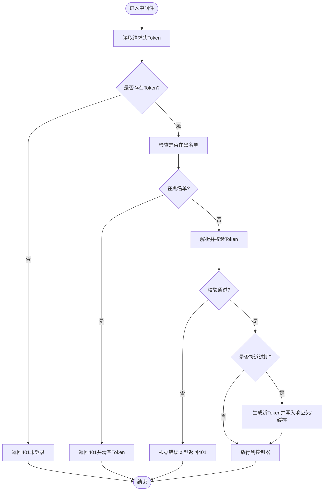
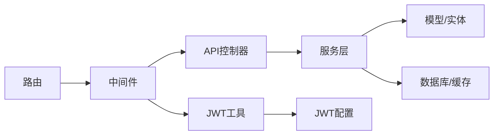
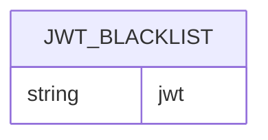

# 认证授权 API

<cite>
**本文引用的文件**
- [server/router/system/sys_jwt.go](file://server/router/system/sys_jwt.go)
- [server/api/v1/system/sys_jwt_blacklist.go](file://server/api/v1/system/sys_jwt_blacklist.go)
- [server/service/system/jwt_black_list.go](file://server/service/system/jwt_black_list.go)
- [server/model/system/sys_jwt_blacklist.go](file://server/model/system/sys_jwt_blacklist.go)
- [server/middleware/jwt.go](file://server/middleware/jwt.go)
- [server/utils/jwt.go](file://server/utils/jwt.go)
- [server/model/system/request/jwt.go](file://server/model/system/request/jwt.go)
- [server/api/v1/system/sys_user.go](file://server/api/v1/system/sys_user.go)
- [server/router/system/sys_user.go](file://server/router/system/sys_user.go)
- [server/model/system/response/sys_user.go](file://server/model/system/response/sys_user.go)
- [server/config/jwt.go](file://server/config/jwt.go)
- [server/middleware/cors.go](file://server/middleware/cors.go)
- [server/middleware/limit_ip.go](file://server/middleware/limit_ip.go)
</cite>

## 目录
1. [简介](#简介)
2. [项目结构](#项目结构)
3. [核心组件](#核心组件)
4. [架构总览](#架构总览)
5. [详细组件分析](#详细组件分析)
6. [依赖分析](#依赖分析)
7. [性能考量](#性能考量)
8. [故障排查指南](#故障排查指南)
9. [结论](#结论)
10. [附录](#附录)

## 简介
本文件面向开发者与测试工程师，系统性梳理认证授权 API 的技术规范与实现细节，覆盖登录、注册、修改密码、令牌管理（加入黑名单）等核心能力；深入解析 JWT 认证机制（生成、验证、续签）、黑名单管理、认证中间件工作流以及跨域、IP 限制等安全策略；并提供接口调用示例与最佳实践建议。

## 项目结构
围绕认证授权的关键模块分布如下：
- 路由层：负责将 HTTP 请求映射到具体 API 控制器
- API 层：实现业务接口，封装请求校验与响应格式
- 中间件层：统一处理 JWT 校验、跨域、IP 限流等横切关注点
- 工具与模型层：提供 JWT 工具、自定义声明结构、黑名单模型与服务
- 配置层：定义 JWT 签名密钥、过期时间、缓冲时间、签发者等参数

图表来源
- [server/router/system/sys_user.go:1-29](file://server/router/system/sys_user.go#L1-L29)
- [server/router/system/sys_jwt.go:1-15](file://server/router/system/sys_jwt.go#L1-L15)
- [server/api/v1/system/sys_user.go:1-517](file://server/api/v1/system/sys_user.go#L1-L517)
- [server/api/v1/system/sys_jwt_blacklist.go:1-34](file://server/api/v1/system/sys_jwt_blacklist.go#L1-L34)
- [server/middleware/jwt.go:1-90](file://server/middleware/jwt.go#L1-L90)
- [server/middleware/cors.go:1-74](file://server/middleware/cors.go#L1-L74)
- [server/middleware/limit_ip.go:1-93](file://server/middleware/limit_ip.go#L1-L93)
- [server/utils/jwt.go:1-106](file://server/utils/jwt.go#L1-L106)
- [server/model/system/request/jwt.go:1-22](file://server/model/system/request/jwt.go#L1-L22)
- [server/model/system/sys_jwt_blacklist.go:1-11](file://server/model/system/sys_jwt_blacklist.go#L1-L11)
- [server/service/system/jwt_black_list.go:1-53](file://server/service/system/jwt_black_list.go#L1-L53)
- [server/config/jwt.go:1-9](file://server/config/jwt.go#L1-L9)

章节来源
- [server/router/system/sys_user.go:1-29](file://server/router/system/sys_user.go#L1-L29)
- [server/router/system/sys_jwt.go:1-15](file://server/router/system/sys_jwt.go#L1-L15)
- [server/api/v1/system/sys_user.go:1-517](file://server/api/v1/system/sys_user.go#L1-L517)
- [server/api/v1/system/sys_jwt_blacklist.go:1-34](file://server/api/v1/system/sys_jwt_blacklist.go#L1-L34)
- [server/middleware/jwt.go:1-90](file://server/middleware/jwt.go#L1-L90)
- [server/middleware/cors.go:1-74](file://server/middleware/cors.go#L1-L74)
- [server/middleware/limit_ip.go:1-93](file://server/middleware/limit_ip.go#L1-L93)
- [server/utils/jwt.go:1-106](file://server/utils/jwt.go#L1-L106)
- [server/model/system/request/jwt.go:1-22](file://server/model/system/request/jwt.go#L1-L22)
- [server/model/system/sys_jwt_blacklist.go:1-11](file://server/model/system/sys_jwt_blacklist.go#L1-L11)
- [server/service/system/jwt_black_list.go:1-53](file://server/service/system/jwt_black_list.go#L1-L53)
- [server/config/jwt.go:1-9](file://server/config/jwt.go#L1-L9)

## 核心组件
- JWT 工具与声明
  - JWT 工具提供签名密钥、创建 Claims、签发/解析/续签 Token 的能力
  - 自定义声明包含基础信息与注册声明，支持缓冲时间触发自动续签
- 认证中间件
  - 从请求头读取令牌，校验黑名单、过期与签名有效性；必要时下发新令牌与新过期头
- 黑名单服务
  - 将 Token 持久化至数据库并同步到内存缓存，支持加载全量黑名单
- 用户相关 API
  - 登录、注册、修改密码、获取用户信息、重置密码等接口
- 路由与中间件装配
  - 路由按功能分组，部分接口使用操作记录中间件，全局启用 CORS 与 IP 限流

章节来源
- [server/utils/jwt.go:1-106](file://server/utils/jwt.go#L1-L106)
- [server/model/system/request/jwt.go:1-22](file://server/model/system/request/jwt.go#L1-L22)
- [server/middleware/jwt.go:1-90](file://server/middleware/jwt.go#L1-L90)
- [server/service/system/jwt_black_list.go:1-53](file://server/service/system/jwt_black_list.go#L1-L53)
- [server/api/v1/system/sys_user.go:1-517](file://server/api/v1/system/sys_user.go#L1-L517)
- [server/router/system/sys_user.go:1-29](file://server/router/system/sys_user.go#L1-L29)
- [server/middleware/cors.go:1-74](file://server/middleware/cors.go#L1-L74)
- [server/middleware/limit_ip.go:1-93](file://server/middleware/limit_ip.go#L1-L93)

## 架构总览
下图展示认证授权的整体调用链路：客户端发起请求 → 路由分发 → 中间件校验 → API 处理 → 返回结果。

图表来源
- [server/router/system/sys_user.go:1-29](file://server/router/system/sys_user.go#L1-L29)
- [server/router/system/sys_jwt.go:1-15](file://server/router/system/sys_jwt.go#L1-L15)
- [server/middleware/jwt.go:1-90](file://server/middleware/jwt.go#L1-L90)
- [server/utils/jwt.go:1-106](file://server/utils/jwt.go#L1-L106)
- [server/service/system/jwt_black_list.go:1-53](file://server/service/system/jwt_black_list.go#L1-L53)

## 详细组件分析

### 登录接口
- HTTP 方法与路径
  - POST /base/login
- 请求参数
  - 用户名、密码、验证码、验证码ID
- 响应内容
  - 包含用户信息、token、过期时间
- 错误码
  - 参数校验失败、验证码错误、用户名或密码错误、用户被禁止登录、获取token失败
- 安全要点
  - 支持验证码校验与失败次数缓存
  - 多端登录策略（可选）
- 调用示例
  - 成功：返回 token 与过期时间戳
  - 失败：返回具体错误信息（如“用户名不存在或者密码错误”）

章节来源
- [server/api/v1/system/sys_user.go:20-99](file://server/api/v1/system/sys_user.go#L20-L99)
- [server/model/system/response/sys_user.go:11-16](file://server/model/system/response/sys_user.go#L11-L16)

### 注册接口
- HTTP 方法与路径
  - POST /user/admin_register
- 请求参数
  - 用户名、昵称、密码、头像、角色ID、启用状态、手机号、邮箱
- 响应内容
  - 返回注册后的用户信息
- 错误码
  - 参数校验失败、注册失败
- 调用示例
  - 成功：返回用户信息
  - 失败：返回错误信息

章节来源
- [server/api/v1/system/sys_user.go:163-196](file://server/api/v1/system/sys_user.go#L163-L196)
- [server/router/system/sys_user.go:14](file://server/router/system/sys_user.go#L14)

### 修改密码接口
- HTTP 方法与路径
  - POST /user/changePassword
- 请求参数
  - 当前密码、新密码
- 响应内容
  - 修改成功或失败提示
- 错误码
  - 参数校验失败、原密码不匹配
- 调用示例
  - 成功：返回“修改成功”
  - 失败：返回“修改失败，原密码与当前账户不符”

章节来源
- [server/api/v1/system/sys_user.go:198-227](file://server/api/v1/system/sys_user.go#L198-L227)
- [server/router/system/sys_user.go:15](file://server/router/system/sys_user.go#L15)

### 获取用户信息接口
- HTTP 方法与路径
  - GET /user/getUserInfo
- 响应内容
  - 返回当前用户信息
- 错误码
  - 获取失败
- 调用示例
  - 成功：返回 userInfo
  - 失败：返回错误信息

章节来源
- [server/api/v1/system/sys_user.go:475-492](file://server/api/v1/system/sys_user.go#L475-L492)
- [server/router/system/sys_user.go:26](file://server/router/system/sys_user.go#L26)

### 重置密码接口
- HTTP 方法与路径
  - POST /user/resetPassword
- 请求参数
  - 用户ID、新密码
- 响应内容
  - 重置成功或失败提示
- 错误码
  - 重置失败
- 调用示例
  - 成功：返回“重置成功”
  - 失败：返回错误信息

章节来源
- [server/api/v1/system/sys_user.go:494-516](file://server/api/v1/system/sys_user.go#L494-L516)
- [server/router/system/sys_user.go:21](file://server/router/system/sys_user.go#L21)

### JWT 加入黑名单接口
- HTTP 方法与路径
  - POST /jwt/jsonInBlacklist
- 请求参数
  - 无显式 JSON 参数，使用请求头携带的 Token
- 响应内容
  - 加入黑名单成功或失败提示
- 错误码
  - 作废失败
- 调用示例
  - 成功：返回“jwt作废成功”
  - 失败：返回“jwt作废失败”

章节来源
- [server/router/system/sys_jwt.go:10-13](file://server/router/system/sys_jwt.go#L10-L13)
- [server/api/v1/system/sys_jwt_blacklist.go:14-33](file://server/api/v1/system/sys_jwt_blacklist.go#L14-L33)

### 认证中间件工作流
- 核心步骤
  - 从请求头读取 Token
  - 检查是否在黑名单
  - 解析并校验 Token，区分过期、签名无效等场景
  - 若即将过期，自动续签并下发新 Token 与新过期时间
  - 放行后续控制器
- 续签机制
  - 在过期缓冲期内，生成新 Token 并写入响应头与 Cookie
  - 多端登录场景下，可将新 Token 写入 Redis

图表来源
- [server/middleware/jwt.go:16-78](file://server/middleware/jwt.go#L16-L78)
- [server/utils/jwt.go:62-88](file://server/utils/jwt.go#L62-L88)

章节来源
- [server/middleware/jwt.go:1-90](file://server/middleware/jwt.go#L1-L90)
- [server/utils/jwt.go:1-106](file://server/utils/jwt.go#L1-L106)

### 跨域与 IP 限制
- 跨域处理
  - 支持宽松放行与严格白名单两种模式
  - 统一暴露必要的响应头，包括新 Token 与新过期时间
- IP 限制
  - 基于 Redis 的周期内访问次数限制
  - 超限时返回明确的等待提示

章节来源
- [server/middleware/cors.go:1-74](file://server/middleware/cors.go#L1-L74)
- [server/middleware/limit_ip.go:1-93](file://server/middleware/limit_ip.go#L1-L93)

## 依赖分析
- 组件耦合
  - API 层依赖中间件与服务层；中间件依赖工具层与配置层
  - 黑名单服务依赖数据库与缓存；JWT 工具依赖配置与声明结构
- 关键依赖链
  - 路由 → 中间件(JWT/CORS/限流) → API → 服务 → 数据库/缓存
- 循环依赖
  - 代码组织清晰，未见循环依赖迹象

图表来源
- [server/router/system/sys_user.go:1-29](file://server/router/system/sys_user.go#L1-L29)
- [server/middleware/jwt.go:1-90](file://server/middleware/jwt.go#L1-L90)
- [server/api/v1/system/sys_user.go:1-517](file://server/api/v1/system/sys_user.go#L1-L517)
- [server/service/system/jwt_black_list.go:1-53](file://server/service/system/jwt_black_list.go#L1-L53)
- [server/utils/jwt.go:1-106](file://server/utils/jwt.go#L1-L106)
- [server/config/jwt.go:1-9](file://server/config/jwt.go#L1-L9)

章节来源
- [server/router/system/sys_user.go:1-29](file://server/router/system/sys_user.go#L1-L29)
- [server/middleware/jwt.go:1-90](file://server/middleware/jwt.go#L1-L90)
- [server/api/v1/system/sys_user.go:1-517](file://server/api/v1/system/sys_user.go#L1-L517)
- [server/service/system/jwt_black_list.go:1-53](file://server/service/system/jwt_black_list.go#L1-L53)
- [server/utils/jwt.go:1-106](file://server/utils/jwt.go#L1-L106)
- [server/config/jwt.go:1-9](file://server/config/jwt.go#L1-L9)

## 性能考量
- Token 续签
  - 在过期缓冲期内生成新 Token，避免频繁登录；并发场景通过合并回源避免重复签发
- 缓存与数据库
  - 黑名单加载到内存缓存，减少数据库压力；Redis 存储活跃 Token（多端登录）
- 中间件开销
  - JWT 校验与续签仅在受保护路由执行；CORS/限流按需启用

章节来源
- [server/utils/jwt.go:54-60](file://server/utils/jwt.go#L54-L60)
- [server/service/system/jwt_black_list.go:42-52](file://server/service/system/jwt_black_list.go#L42-L52)
- [server/middleware/jwt.go:56-68](file://server/middleware/jwt.go#L56-L68)

## 故障排查指南
- 401 未登录或非法访问
  - 检查请求头是否携带 Token；确认 Token 未被加入黑名单；核对签名密钥与 Issuer
- 登录失败
  - 核对用户名/密码；检查验证码配置与输入；查看失败日志
- 修改密码失败
  - 确认原密码正确；检查参数绑定
- 跨域问题
  - 检查 CORS 白名单配置与暴露头；确保前端正确传递 Token
- 请求过于频繁
  - 查看 IP 限流配置与 Redis 状态；适当提高阈值或延长周期

章节来源
- [server/middleware/jwt.go:16-78](file://server/middleware/jwt.go#L16-L78)
- [server/api/v1/system/sys_user.go:20-99](file://server/api/v1/system/sys_user.go#L20-L99)
- [server/middleware/cors.go:30-74](file://server/middleware/cors.go#L30-L74)
- [server/middleware/limit_ip.go:44-93](file://server/middleware/limit_ip.go#L44-L93)

## 结论
本项目采用基于 JWT 的无状态认证方案，结合黑名单与续签机制保障安全性与可用性；通过中间件统一处理跨域与限流，形成清晰的认证授权体系。建议在生产环境强化密钥管理、启用 HTTPS、完善审计日志，并根据业务调整过期与缓冲时间策略。

## 附录

### JWT 配置项
- signing-key：签名密钥
- expires-time：过期时间
- buffer-time：续签缓冲时间
- issuer：签发者

章节来源
- [server/config/jwt.go:3-8](file://server/config/jwt.go#L3-L8)

### 数据模型（简化）

图表来源
- [server/model/system/sys_jwt_blacklist.go:7-10](file://server/model/system/sys_jwt_blacklist.go#L7-L10)