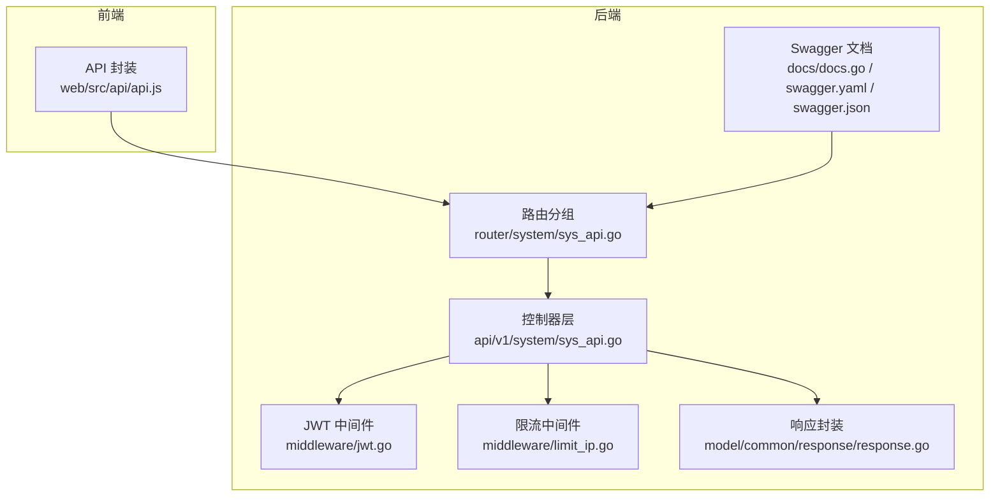
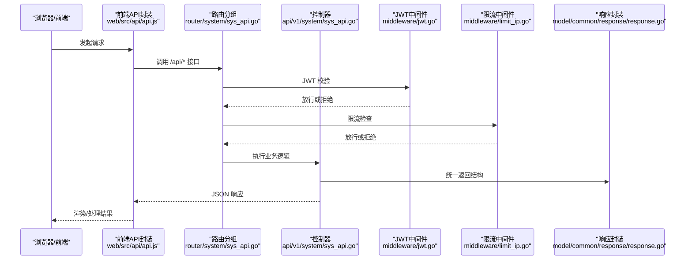
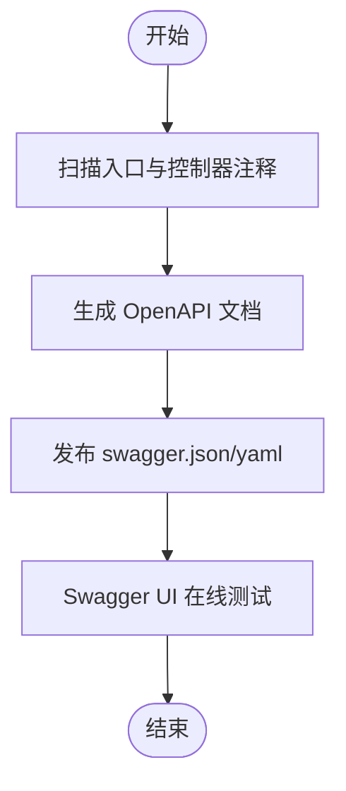
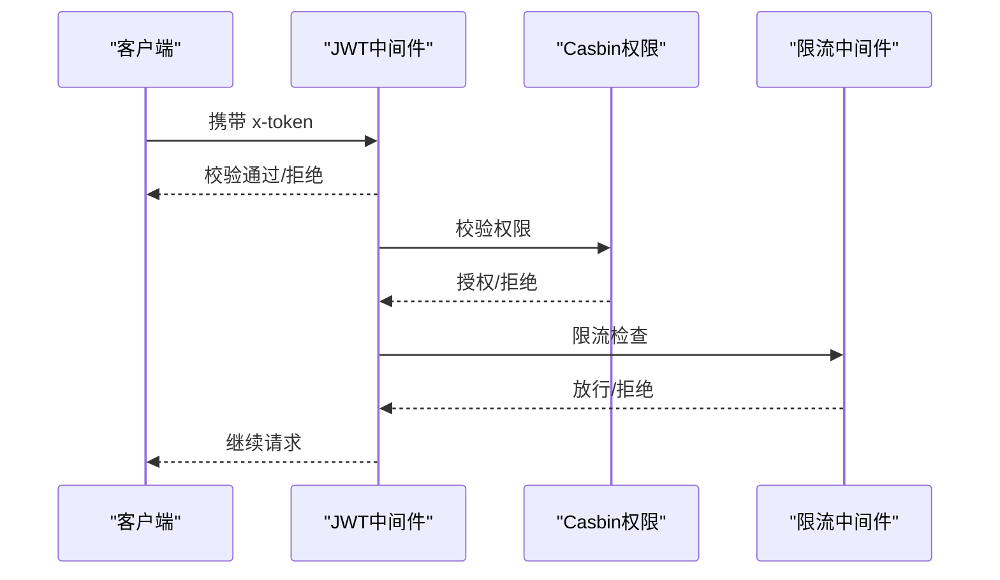
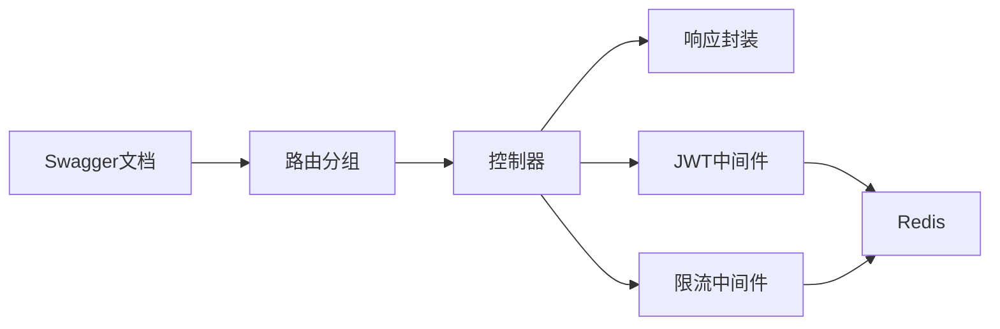

# API 文档管理

<cite>
**本文引用的文件**
- [server/main.go](file://server/main.go)
- [server/docs/docs.go](file://server/docs/docs.go)
- [server/docs/swagger.yaml](file://server/docs/swagger.yaml)
- [server/docs/swagger.json](file://server/docs/swagger.json)
- [server/router/system/sys_api.go](file://server/router/system/sys_api.go)
- [server/api/v1/system/sys_api.go](file://server/api/v1/system/sys_api.go)
- [server/model/system/sys_api.go](file://server/model/system/sys_api.go)
- [server/model/common/response/response.go](file://server/model/common/response/response.go)
- [server/middleware/jwt.go](file://server/middleware/jwt.go)
- [server/middleware/limit_ip.go](file://server/middleware/limit_ip.go)
- [server/global/version.go](file://server/global/version.go)
- [web/src/api/api.js](file://web/src/api/api.js)
</cite>

## 目录
1. [引言](#引言)
2. [项目结构](#项目结构)
3. [核心组件](#核心组件)
4. [架构总览](#架构总览)
5. [详细组件分析](#详细组件分析)
6. [依赖分析](#依赖分析)
7. [性能考量](#性能考量)
8. [故障排查指南](#故障排查指南)
9. [结论](#结论)
10. [附录](#附录)

## 引言
本文件面向 API 文档管理，系统化梳理该项目的 RESTful API 设计规范、Swagger 集成方式、版本管理策略、安全设计、使用指南、性能优化与维护流程。内容基于后端 Gin 与前端 Vue 的实际实现，确保读者能够快速理解并正确使用系统提供的 API。

## 项目结构
后端通过路由分组组织 API，系统域（system）与示例域（example）分别承载核心业务与演示接口；API 控制器层负责请求处理与响应封装；中间件层提供认证、限流、日志与错误处理；文档通过 swag 生成 OpenAPI/Swagger 文档。

**图表来源**
- [server/router/system/sys_api.go:10-35](file://server/router/system/sys_api.go#L10-L35)
- [server/api/v1/system/sys_api.go:18-381](file://server/api/v1/system/sys_api.go#L18-L381)
- [server/middleware/jwt.go:16-78](file://server/middleware/jwt.go#L16-L78)
- [server/middleware/limit_ip.go:27-62](file://server/middleware/limit_ip.go#L27-L62)
- [server/model/common/response/response.go:9-63](file://server/model/common/response/response.go#L9-L63)
- [server/docs/docs.go:10-800](file://server/docs/docs.go#L10-L800)

**章节来源**
- [server/router/enter.go:8-14](file://server/router/enter.go#L8-L14)
- [server/router/system/sys_api.go:10-35](file://server/router/system/sys_api.go#L10-L35)

## 核心组件
- 路由与控制器：系统域 API 通过路由组注册，控制器实现 CRUD 与权限相关接口，统一使用响应封装。
- 文档生成：通过 swag 在入口文件与控制器注释中提取元数据，生成 OpenAPI/Swagger 文档。
- 认证与授权：JWT 中间件校验令牌与黑名单，Casbin 权限模型配合 API 角色映射。
- 限流与安全：基于 Redis 的 IP 限流中间件，系统配置项控制阈值与周期。
- 统一响应：固定结构的响应体，包含状态码、数据与消息，便于前端统一处理。

**章节来源**
- [server/api/v1/system/sys_api.go:18-381](file://server/api/v1/system/sys_api.go#L18-L381)
- [server/model/common/response/response.go:9-63](file://server/model/common/response/response.go#L9-L63)
- [server/middleware/jwt.go:16-78](file://server/middleware/jwt.go#L16-L78)
- [server/middleware/limit_ip.go:27-93](file://server/middleware/limit_ip.go#L27-L93)

## 架构总览
下图展示从浏览器到后端 API 的典型调用链路，以及文档生成与中间件参与的关键环节。

**图表来源**
- [web/src/api/api.js:15-21](file://web/src/api/api.js#L15-L21)
- [server/router/system/sys_api.go:10-35](file://server/router/system/sys_api.go#L10-L35)
- [server/api/v1/system/sys_api.go:18-381](file://server/api/v1/system/sys_api.go#L18-L381)
- [server/middleware/jwt.go:16-78](file://server/middleware/jwt.go#L16-L78)
- [server/middleware/limit_ip.go:27-62](file://server/middleware/limit_ip.go#L27-L62)
- [server/model/common/response/response.go:20-62](file://server/model/common/response/response.go#L20-L62)

## 详细组件分析

### RESTful 设计规范
- 资源命名：使用名词短语，复数形式表达集合，如 /api/getApiList。
- HTTP 方法：GET 获取列表/详情；POST 创建/提交；DELETE 删除；PUT 更新（示例中未见 PUT，使用 POST 更新）。
- 路径参数：查询参数用于过滤与分页，如 /api/getApiRoles?path=...&method=...。
- 统一响应：所有接口返回统一结构，包含 code、data、msg；成功 code 为 0，失败为 7。
- 状态码：控制器内通过封装函数返回 200，具体语义由 code 与 msg 表达。

**章节来源**
- [server/api/v1/system/sys_api.go:18-381](file://server/api/v1/system/sys_api.go#L18-L381)
- [server/model/common/response/response.go:9-63](file://server/model/common/response/response.go#L9-L63)

### Swagger 集成与文档生成
- 入口注解：在入口文件中定义标题、版本、安全定义与基础路径，用于 swag 生成文档。
- 控制器注释：每个接口使用注释声明标签、摘要、安全要求、参数、响应等，形成 OpenAPI 规范。
- 文档输出：通过模板生成 swagger.json 与 swagger.yaml，供 Swagger UI 或第三方工具使用。
- 在线测试：Swagger UI 可直接在线测试接口，便于联调与回归。

**图表来源**
- [server/main.go:23-29](file://server/main.go#L23-L29)
- [server/docs/docs.go:10-800](file://server/docs/docs.go#L10-L800)
- [server/docs/swagger.yaml:1-800](file://server/docs/swagger.yaml#L1-800)
- [server/docs/swagger.json:1-800](file://server/docs/swagger.json#L1-800)

**章节来源**
- [server/main.go:23-29](file://server/main.go#L23-L29)
- [server/docs/docs.go:10-800](file://server/docs/docs.go#L10-L800)

### API 版本管理策略
- 版本常量：当前版本号在全局常量中维护，便于统一升级与追踪。
- 版本策略建议：
  - 语义化版本：主版本号变更表示破坏性改动；次版本号变更表示新增功能且兼容；修订号变更表示修复。
  - 路由前缀：通过 v1/v2 等前缀隔离不同版本，新功能优先在新版本推出。
  - 文档同步：Swagger/OpenAPI 随版本更新，标注废弃字段与迁移指引。
  - 降级与兼容：旧版本接口保留过渡期，提供明确的弃用时间线与替代方案。

**章节来源**
- [server/global/version.go:5-13](file://server/global/version.go#L5-L13)

### 安全设计
- 认证授权：
  - JWT 中间件：从请求头读取令牌，校验黑名单与过期时间，必要时刷新令牌并写入响应头。
  - Casbin 权限：API 与角色映射，支持刷新缓存使策略立即生效。
- 请求限制：基于 Redis 的 IP 限流中间件，按周期与阈值控制请求频率。
- 数据加密：JWT 签名密钥、过期时间与签发者在配置中定义，建议生产环境妥善保管。

**图表来源**
- [server/middleware/jwt.go:16-78](file://server/middleware/jwt.go#L16-L78)
- [server/middleware/limit_ip.go:27-93](file://server/middleware/limit_ip.go#L27-L93)
- [server/api/v1/system/sys_api.go:308-323](file://server/api/v1/system/sys_api.go#L308-L323)

**章节来源**
- [server/middleware/jwt.go:16-78](file://server/middleware/jwt.go#L16-L78)
- [server/middleware/limit_ip.go:27-93](file://server/middleware/limit_ip.go#L27-L93)
- [server/config/jwt.go:3-8](file://server/config/jwt.go#L3-L8)

### API 使用指南
- 请求示例：前端封装了常用 API 调用，如分页获取 API 列表、创建/更新/删除 API、获取 API 分组、刷新 Casbin 缓存等。
- 响应格式：统一返回结构，前端可依据 code 与 msg 判断成功与否，data 中承载业务数据。
- 错误处理：控制器内通过封装函数返回错误信息，前端统一提示；JWT 过期或无效时返回未授权。
- 调试技巧：结合 Swagger UI 在线测试；对鉴权接口优先验证 JWT 有效性与权限矩阵；关注限流触发与日志输出。

**章节来源**
- [web/src/api/api.js:15-207](file://web/src/api/api.js#L15-L207)
- [server/model/common/response/response.go:20-62](file://server/model/common/response/response.go#L20-L62)

### 性能优化建议
- 缓存策略：利用 Redis 实现限流与活跃令牌缓存，降低数据库压力。
- 分页查询：控制器层对分页参数进行校验，避免一次性加载大量数据。
- 批量操作：提供批量删除接口，减少网络往返与数据库压力。
- 文档与中间件：合理配置 Swagger 文档生成与中间件顺序，避免不必要的开销。

**章节来源**
- [server/middleware/limit_ip.go:65-93](file://server/middleware/limit_ip.go#L65-L93)
- [server/api/v1/system/sys_api.go:169-202](file://server/api/v1/system/sys_api.go#L169-L202)
- [server/api/v1/system/sys_api.go:283-306](file://server/api/v1/system/sys_api.go#L283-L306)

### 维护与更新流程
- 文档维护：新增或变更接口时，同步补充/更新控制器注释与入口注解，重新生成并发布 Swagger 文档。
- 版本演进：通过版本号与路由前缀区分不同版本，旧版本接口保留过渡期并标注弃用。
- 安全加固：定期轮换 JWT 密钥与令牌，清理黑名单与日志，控制数据规模。
- 性能监控：结合限流与日志中间件，观察接口耗时与错误率，持续优化。

**章节来源**
- [server/main.go:23-29](file://server/main.go#L23-L29)
- [server/global/version.go:5-13](file://server/global/version.go#L5-L13)

## 依赖分析
- 控制器依赖响应封装与工具函数，间接依赖中间件与服务层。
- 路由分组依赖控制器与中间件，统一注册系统域 API。
- 文档依赖入口注解与控制器注释，生成 OpenAPI 规范。
- 中间件依赖全局配置与 Redis，提供认证、限流与日志能力。

**图表来源**
- [server/router/system/sys_api.go:10-35](file://server/router/system/sys_api.go#L10-L35)
- [server/api/v1/system/sys_api.go:18-381](file://server/api/v1/system/sys_api.go#L18-L381)
- [server/middleware/jwt.go:16-78](file://server/middleware/jwt.go#L16-L78)
- [server/middleware/limit_ip.go:27-93](file://server/middleware/limit_ip.go#L27-L93)
- [server/docs/docs.go:10-800](file://server/docs/docs.go#L10-L800)

**章节来源**
- [server/router/system/sys_api.go:10-35](file://server/router/system/sys_api.go#L10-L35)
- [server/api/v1/system/sys_api.go:18-381](file://server/api/v1/system/sys_api.go#L18-L381)

## 性能考量
- 限流策略：基于 Redis 的 IP 限流，按周期与阈值控制请求频率，防止突发流量冲击。
- 缓存与令牌：JWT 刷新与活跃令牌缓存减少重复校验成本。
- 分页与批量：控制器层对分页参数进行校验，批量删除减少网络与数据库压力。
- 文档生成：swag 生成的静态文档减少运行时反射开销。

**章节来源**
- [server/middleware/limit_ip.go:65-93](file://server/middleware/limit_ip.go#L65-L93)
- [server/middleware/jwt.go:56-77](file://server/middleware/jwt.go#L56-L77)
- [server/api/v1/system/sys_api.go:169-202](file://server/api/v1/system/sys_api.go#L169-L202)
- [server/api/v1/system/sys_api.go:283-306](file://server/api/v1/system/sys_api.go#L283-L306)

## 故障排查指南
- 未登录或非法访问：JWT 中间件返回未授权，检查请求头 x-token 是否存在与有效。
- 令牌过期或异地登录：JWT 中间件检测黑名单并清空令牌，需重新登录。
- 请求过于频繁：限流中间件触发，检查 Redis 配置与阈值设置。
- 权限不足：Casbin 权限模型校验失败，检查 API 与角色映射及缓存刷新。
- 统一响应异常：前端依据 code 与 msg 判断，结合后端日志定位问题。

**章节来源**
- [server/middleware/jwt.go:16-78](file://server/middleware/jwt.go#L16-L78)
- [server/middleware/limit_ip.go:27-93](file://server/middleware/limit_ip.go#L27-L93)
- [server/model/common/response/response.go:20-62](file://server/model/common/response/response.go#L20-L62)

## 结论
本项目通过清晰的分层设计、统一的响应封装与完善的中间件体系，实现了可维护、可扩展、可测试的 API 架构。Swagger 文档与注释规范保障了接口的可发现性与可测试性；JWT 与限流中间件提供了基础的安全与稳定性保障；版本管理策略与性能优化建议有助于长期演进与稳定运行。

## 附录
- 入口与初始化：[server/main.go:30-52](file://server/main.go#L30-L52)
- API 组入口：[server/router/enter.go:8-14](file://server/router/enter.go#L8-L14)
- 系统域控制器入口：[server/router/system/sys_api.go:10-35](file://server/router/system/sys_api.go#L10-L35)
- 全局版本：[server/global/version.go:5-13](file://server/global/version.go#L5-L13)
- Swagger 文档：[server/docs/swagger.yaml](file://server/docs/swagger.yaml)、[server/docs/swagger.json](file://server/docs/swagger.json)