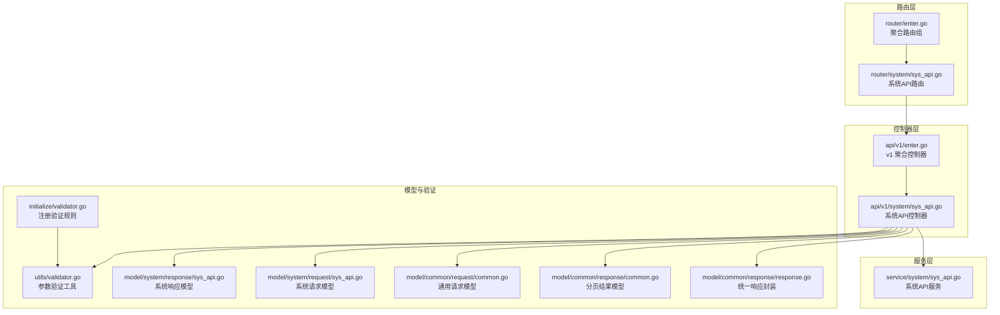
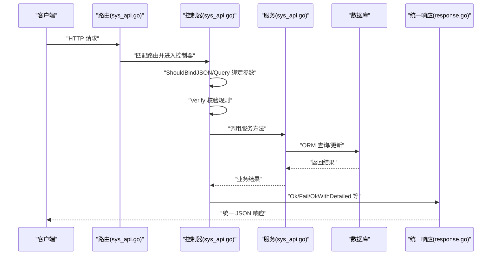
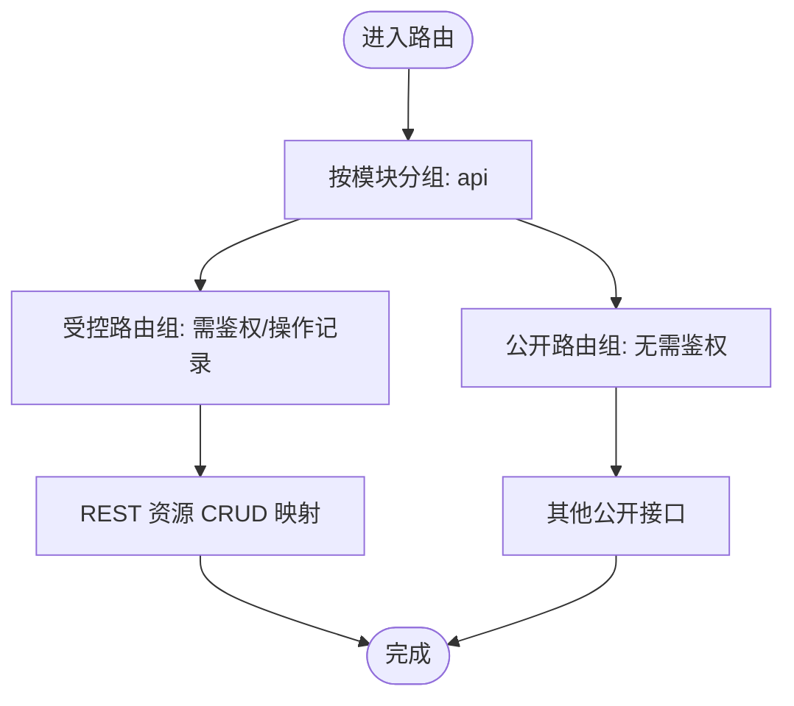
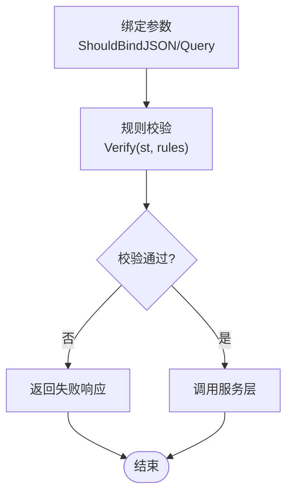
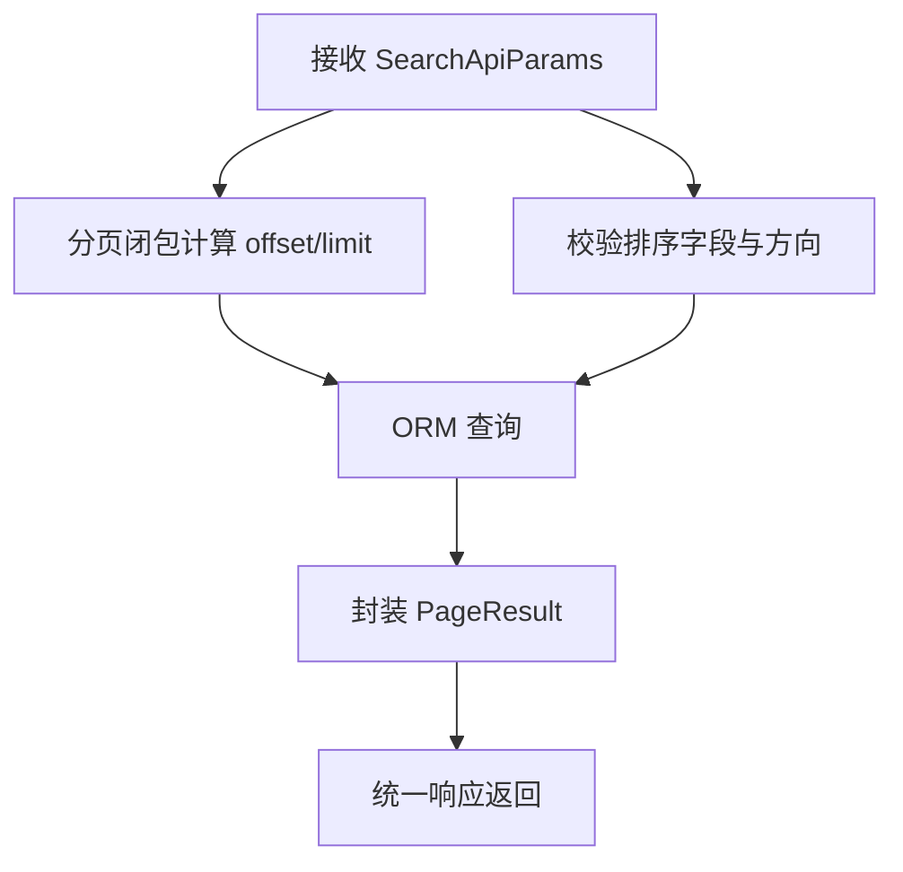
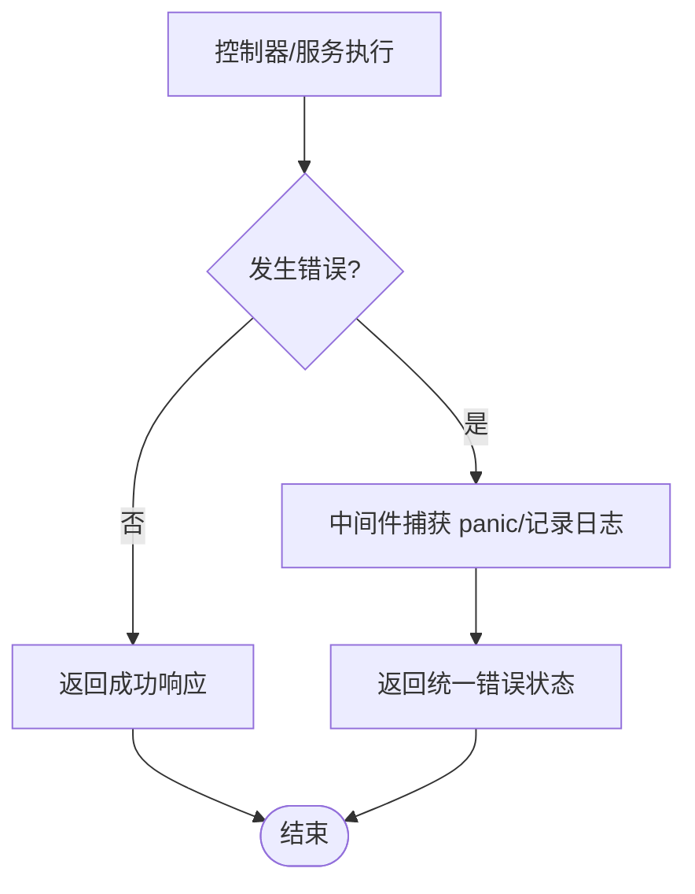
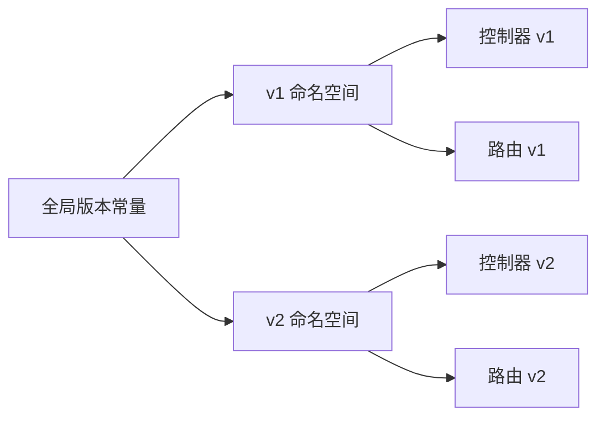
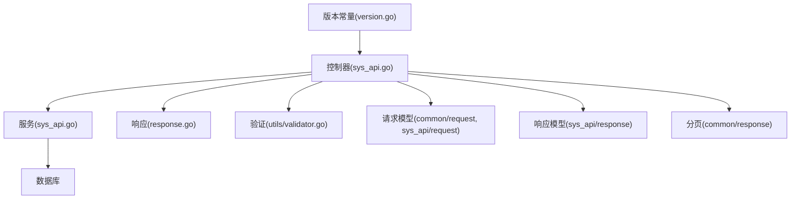

# API 设计规范

<cite>
**本文引用的文件**
- [server/model/common/response/common.go](file://server/model/common/response/common.go)
- [server/model/common/response/response.go](file://server/model/common/response/response.go)
- [server/router/enter.go](file://server/router/enter.go)
- [server/api/v1/enter.go](file://server/api/v1/enter.go)
- [server/router/system/sys_api.go](file://server/router/system/sys_api.go)
- [server/api/v1/system/sys_api.go](file://server/api/v1/system/sys_api.go)
- [server/service/system/sys_api.go](file://server/service/system/sys_api.go)
- [server/utils/validator.go](file://server/utils/validator.go)
- [server/initialize/validator.go](file://server/initialize/validator.go)
- [server/model/common/request/common.go](file://server/model/common/request/common.go)
- [server/model/system/request/sys_api.go](file://server/model/system/request/sys_api.go)
- [server/model/system/response/sys_api.go](file://server/model/system/response/sys_api.go)
- [server/global/version.go](file://server/global/version.go)
- [server/middleware/error.go](file://server/middleware/error.go)
- [server/core/server_run.go](file://server/core/server_run.go)
</cite>

## 目录
1. [引言](#引言)
2. [项目结构](#项目结构)
3. [核心组件](#核心组件)
4. [架构总览](#架构总览)
5. [详细组件分析](#详细组件分析)
6. [依赖分析](#依赖分析)
7. [性能考量](#性能考量)
8. [故障排查指南](#故障排查指南)
9. [结论](#结论)
10. [附录](#附录)

## 引言
本文件面向 Gin-Vue-Admin 项目的后端 API 层，系统化梳理 RESTful API 的设计原则与实现规范，涵盖资源命名、HTTP 方法使用、状态码、请求/响应格式、路由设计、参数验证、分页与错误处理、以及版本管理策略。文档同时给出基于 Gin 框架的具体实现示例路径，帮助开发者在现有工程中一致地落地 API 设计。

## 项目结构
后端采用“路由-控制器-服务-模型”分层，API 控制器位于 v1 命名空间，路由按功能域分组挂载，统一通过入口聚合。



**图表来源**
- [server/router/enter.go:1-14](file://server/router/enter.go#L1-L14)
- [server/router/system/sys_api.go:1-36](file://server/router/system/sys_api.go#L1-L36)
- [server/api/v1/enter.go:1-14](file://server/api/v1/enter.go#L1-L14)
- [server/api/v1/system/sys_api.go:1-382](file://server/api/v1/system/sys_api.go#L1-L382)
- [server/service/system/sys_api.go:1-327](file://server/service/system/sys_api.go#L1-L327)
- [server/model/common/request/common.go:1-49](file://server/model/common/request/common.go#L1-L49)
- [server/model/system/request/sys_api.go:1-22](file://server/model/system/request/sys_api.go#L1-L22)
- [server/model/system/response/sys_api.go:1-19](file://server/model/system/response/sys_api.go#L1-L19)
- [server/model/common/response/response.go:1-63](file://server/model/common/response/response.go#L1-L63)
- [server/model/common/response/common.go:1-9](file://server/model/common/response/common.go#L1-L9)
- [server/utils/validator.go:1-295](file://server/utils/validator.go#L1-L295)
- [server/initialize/validator.go:1-23](file://server/initialize/validator.go#L1-L23)

**章节来源**
- [server/router/enter.go:1-14](file://server/router/enter.go#L1-L14)
- [server/api/v1/enter.go:1-14](file://server/api/v1/enter.go#L1-L14)
- [server/router/system/sys_api.go:1-36](file://server/router/system/sys_api.go#L1-L36)
- [server/api/v1/system/sys_api.go:1-382](file://server/api/v1/system/sys_api.go#L1-L382)
- [server/service/system/sys_api.go:1-327](file://server/service/system/sys_api.go#L1-L327)
- [server/model/common/request/common.go:1-49](file://server/model/common/request/common.go#L1-L49)
- [server/model/system/request/sys_api.go:1-22](file://server/model/system/request/sys_api.go#L1-L22)
- [server/model/system/response/sys_api.go:1-19](file://server/model/system/response/sys_api.go#L1-L19)
- [server/model/common/response/response.go:1-63](file://server/model/common/response/response.go#L1-L63)
- [server/model/common/response/common.go:1-9](file://server/model/common/response/common.go#L1-L9)
- [server/utils/validator.go:1-295](file://server/utils/validator.go#L1-L295)
- [server/initialize/validator.go:1-23](file://server/initialize/validator.go#L1-L23)

## 核心组件
- 统一响应封装：提供统一的响应结构与常用便捷方法，确保前后端契约一致。
- 参数验证：基于标签规则的反射校验，支持非空、正则、数值/长度范围等。
- 分页模型：统一的分页输入与输出结构，便于列表查询。
- 路由与控制器：按模块分组挂载，控制器负责绑定参数、调用服务、返回响应。
- 错误处理中间件：捕获 panic 并记录日志，返回统一错误响应。
- 版本管理：通过 v1 命名空间隔离版本，配合全局版本常量标识。

**章节来源**
- [server/model/common/response/response.go:1-63](file://server/model/common/response/response.go#L1-L63)
- [server/model/common/response/common.go:1-9](file://server/model/common/response/common.go#L1-L9)
- [server/utils/validator.go:1-295](file://server/utils/validator.go#L1-L295)
- [server/initialize/validator.go:1-23](file://server/initialize/validator.go#L1-L23)
- [server/router/system/sys_api.go:1-36](file://server/router/system/sys_api.go#L1-L36)
- [server/api/v1/system/sys_api.go:1-382](file://server/api/v1/system/sys_api.go#L1-L382)
- [server/middleware/error.go:1-81](file://server/middleware/error.go#L1-L81)
- [server/global/version.go:1-13](file://server/global/version.go#L1-L13)

## 架构总览
下图展示从路由到控制器、服务与数据库的典型调用链路，以及统一响应与参数验证的协作关系。



**图表来源**
- [server/router/system/sys_api.go:10-35](file://server/router/system/sys_api.go#L10-L35)
- [server/api/v1/system/sys_api.go:27-46](file://server/api/v1/system/sys_api.go#L27-L46)
- [server/service/system/sys_api.go:25-30](file://server/service/system/sys_api.go#L25-L30)
- [server/model/common/response/response.go:20-42](file://server/model/common/response/response.go#L20-L42)

**章节来源**
- [server/router/system/sys_api.go:10-35](file://server/router/system/sys_api.go#L10-L35)
- [server/api/v1/system/sys_api.go:27-46](file://server/api/v1/system/sys_api.go#L27-L46)
- [server/service/system/sys_api.go:25-30](file://server/service/system/sys_api.go#L25-L30)
- [server/model/common/response/response.go:20-42](file://server/model/common/response/response.go#L20-L42)

## 详细组件分析

### 统一响应与状态码
- 响应结构包含 code、data、msg 三部分；提供 Ok/Fail/OkWithData 等便捷方法。
- 成功/失败常量用于统一 code 值，便于前端一致性处理。
- 分页响应使用 PageResult 结构，包含 list、total、page、pageSize。

```mermaid
classDiagram
class Response {
+int Code
+interface{} Data
+string Msg
}
class PageResult {
+interface{} List
+int64 Total
+int Page
+int PageSize
}
Response <.. PageResult : "作为 data 返回"
```

**图表来源**
- [server/model/common/response/response.go:9-18](file://server/model/common/response/response.go#L9-L18)
- [server/model/common/response/common.go:3-8](file://server/model/common/response/common.go#L3-L8)

**章节来源**
- [server/model/common/response/response.go:1-63](file://server/model/common/response/response.go#L1-L63)
- [server/model/common/response/common.go:1-9](file://server/model/common/response/common.go#L1-L9)

### 路由设计与资源命名
- 路由按模块分组挂载，统一前缀为 api；公开接口与受控接口分别置于不同组。
- 控制器方法通过注释声明标签、摘要、安全要求、接受/产生类型、成功示例与路由路径，便于文档生成与契约约束。



**图表来源**
- [server/router/system/sys_api.go:10-35](file://server/router/system/sys_api.go#L10-L35)

**章节来源**
- [server/router/system/sys_api.go:1-36](file://server/router/system/sys_api.go#L1-L36)
- [server/api/v1/system/sys_api.go:18-46](file://server/api/v1/system/sys_api.go#L18-L46)

### 请求参数绑定与验证
- 参数绑定：控制器使用 ShouldBindJSON/Query 绑定请求体与查询参数。
- 规则注册：在初始化阶段注册常用规则（如分页、ID、角色ID）。
- 反射校验：Verify 方法遍历结构体字段，结合规则执行非空、正则、范围等校验。



**图表来源**
- [server/api/v1/system/sys_api.go:28-38](file://server/api/v1/system/sys_api.go#L28-L38)
- [server/utils/validator.go:118-165](file://server/utils/validator.go#L118-L165)
- [server/initialize/validator.go:5-22](file://server/initialize/validator.go#L5-L22)

**章节来源**
- [server/api/v1/system/sys_api.go:28-38](file://server/api/v1/system/sys_api.go#L28-L38)
- [server/utils/validator.go:1-295](file://server/utils/validator.go#L1-L295)
- [server/initialize/validator.go:1-23](file://server/initialize/validator.go#L1-L23)
- [server/model/common/request/common.go:1-49](file://server/model/common/request/common.go#L1-L49)
- [server/model/system/request/sys_api.go:1-22](file://server/model/system/request/sys_api.go#L1-L22)

### 分页与排序
- 分页输入：PageInfo 提供 page、pageSize、keyword，内置分页闭包。
- 排序：SearchApiParams 支持 orderKey 与 desc，服务层对排序字段进行白名单校验。
- 输出：控制器将查询结果与总数封装进 PageResult 返回。



**图表来源**
- [server/model/common/request/common.go:7-28](file://server/model/common/request/common.go#L7-L28)
- [server/model/system/request/sys_api.go:8-14](file://server/model/system/request/sys_api.go#L8-L14)
- [server/service/system/sys_api.go:182-230](file://server/service/system/sys_api.go#L182-L230)
- [server/api/v1/system/sys_api.go:178-202](file://server/api/v1/system/sys_api.go#L178-L202)

**章节来源**
- [server/model/common/request/common.go:1-49](file://server/model/common/request/common.go#L1-L49)
- [server/model/system/request/sys_api.go:1-22](file://server/model/system/request/sys_api.go#L1-L22)
- [server/service/system/sys_api.go:182-230](file://server/service/system/sys_api.go#L182-L230)
- [server/api/v1/system/sys_api.go:178-202](file://server/api/v1/system/sys_api.go#L178-L202)

### 错误处理与异常恢复
- 中间件捕获 panic，区分“断开连接”与一般异常，记录日志并返回统一错误响应。
- 对于可预期的业务错误，控制器直接返回失败响应，避免抛出异常。



**图表来源**
- [server/middleware/error.go:21-80](file://server/middleware/error.go#L21-L80)
- [server/api/v1/system/sys_api.go:30-37](file://server/api/v1/system/sys_api.go#L30-L37)

**章节来源**
- [server/middleware/error.go:1-81](file://server/middleware/error.go#L1-L81)
- [server/api/v1/system/sys_api.go:30-37](file://server/api/v1/system/sys_api.go#L30-L37)

### API 版本管理策略
- 版本命名：v1 控制器与路由命名空间隔离，形成稳定契约。
- 版本常量：全局版本常量用于标识当前版本，便于监控与诊断。
- 向后兼容：新版本通过新增路由/控制器实现，旧接口保持不变。
- 废弃策略：通过注释与变更日志明确废弃计划，逐步替换为新版本接口。



**图表来源**
- [server/api/v1/enter.go:1-14](file://server/api/v1/enter.go#L1-L14)
- [server/router/enter.go:1-14](file://server/router/enter.go#L1-L14)
- [server/global/version.go:5-7](file://server/global/version.go#L5-L7)

**章节来源**
- [server/api/v1/enter.go:1-14](file://server/api/v1/enter.go#L1-L14)
- [server/router/enter.go:1-14](file://server/router/enter.go#L1-L14)
- [server/global/version.go:1-13](file://server/global/version.go#L1-L13)

## 依赖分析
- 控制器依赖服务层与统一响应；服务层依赖数据库与策略服务；验证工具贯穿控制器与服务层。
- 路由层仅负责组织与转发，不承载业务逻辑，降低耦合度。
- 版本常量集中管理，便于跨模块共享。



**图表来源**
- [server/api/v1/system/sys_api.go:1-382](file://server/api/v1/system/sys_api.go#L1-L382)
- [server/service/system/sys_api.go:1-327](file://server/service/system/sys_api.go#L1-L327)
- [server/model/common/response/response.go:1-63](file://server/model/common/response/response.go#L1-L63)
- [server/utils/validator.go:1-295](file://server/utils/validator.go#L1-L295)
- [server/model/common/request/common.go:1-49](file://server/model/common/request/common.go#L1-L49)
- [server/model/system/request/sys_api.go:1-22](file://server/model/system/request/sys_api.go#L1-L22)
- [server/model/system/response/sys_api.go:1-19](file://server/model/system/response/sys_api.go#L1-L19)
- [server/global/version.go:1-13](file://server/global/version.go#L1-L13)

**章节来源**
- [server/api/v1/system/sys_api.go:1-382](file://server/api/v1/system/sys_api.go#L1-L382)
- [server/service/system/sys_api.go:1-327](file://server/service/system/sys_api.go#L1-L327)
- [server/model/common/response/response.go:1-63](file://server/model/common/response/response.go#L1-L63)
- [server/utils/validator.go:1-295](file://server/utils/validator.go#L1-L295)
- [server/model/common/request/common.go:1-49](file://server/model/common/request/common.go#L1-L49)
- [server/model/system/request/sys_api.go:1-22](file://server/model/system/request/sys_api.go#L1-L22)
- [server/model/system/response/sys_api.go:1-19](file://server/model/system/response/sys_api.go#L1-L19)
- [server/global/version.go:1-13](file://server/global/version.go#L1-L13)

## 性能考量
- 分页与排序：服务层对排序字段进行白名单校验，避免 SQL 注入与无效排序导致的性能问题。
- ORM 限制：分页闭包对 pageSize 进行上下限约束，防止过大分页请求影响数据库性能。
- 事务批量：批量删除/同步 API 使用事务，减少多次往返与锁竞争。
- 优雅停机：服务启动与关闭采用优雅模式，避免请求中断与资源泄漏。

**章节来源**
- [server/model/common/request/common.go:14-28](file://server/model/common/request/common.go#L14-L28)
- [server/service/system/sys_api.go:213-227](file://server/service/system/sys_api.go#L213-L227)
- [server/service/system/sys_api.go:136-154](file://server/service/system/sys_api.go#L136-L154)
- [server/core/server_run.go:21-61](file://server/core/server_run.go#L21-L61)

## 故障排查指南
- 统一错误响应：失败场景返回统一结构，前端可据此解析错误码与消息。
- 日志与追踪：中间件捕获 panic 并记录请求摘要与堆栈，便于定位问题。
- 常见问题定位：
  - 参数校验失败：检查控制器绑定与验证规则是否匹配。
  - 分页/排序异常：确认排序字段是否在白名单内，pageSize 是否合规。
  - 权限相关：检查 Casbin 策略与刷新流程。

**章节来源**
- [server/model/common/response/response.go:44-62](file://server/model/common/response/response.go#L44-L62)
- [server/middleware/error.go:21-80](file://server/middleware/error.go#L21-L80)
- [server/service/system/sys_api.go:213-227](file://server/service/system/sys_api.go#L213-L227)

## 结论
本规范在 Gin-Vue-Admin 项目中以“统一响应、参数验证、分页模型、路由分组、中间件兜底、版本隔离”为核心，形成可维护、可扩展且前后端一致的 API 设计体系。遵循本文档可显著提升接口质量与开发效率。

## 附录
- 典型实现示例路径（不含代码内容）：
  - 统一响应封装与便捷方法：[server/model/common/response/response.go:20-62](file://server/model/common/response/response.go#L20-L62)
  - 分页结果模型：[server/model/common/response/common.go:3-8](file://server/model/common/response/common.go#L3-L8)
  - 路由注册与资源映射：[server/router/system/sys_api.go:10-35](file://server/router/system/sys_api.go#L10-L35)
  - 控制器参数绑定与验证：[server/api/v1/system/sys_api.go:27-46](file://server/api/v1/system/sys_api.go#L27-L46)
  - 服务层分页与排序实现：[server/service/system/sys_api.go:182-230](file://server/service/system/sys_api.go#L182-L230)
  - 参数验证规则注册与校验：[server/initialize/validator.go:5-22](file://server/initialize/validator.go#L5-L22), [server/utils/validator.go:118-165](file://server/utils/validator.go#L118-L165)
  - 错误恢复中间件：[server/middleware/error.go:21-80](file://server/middleware/error.go#L21-80)
  - 版本常量与命名空间：[server/global/version.go:5-7](file://server/global/version.go#L5-L7), [server/api/v1/enter.go:1-14](file://server/api/v1/enter.go#L1-L14), [server/router/enter.go:1-14](file://server/router/enter.go#L1-L14)