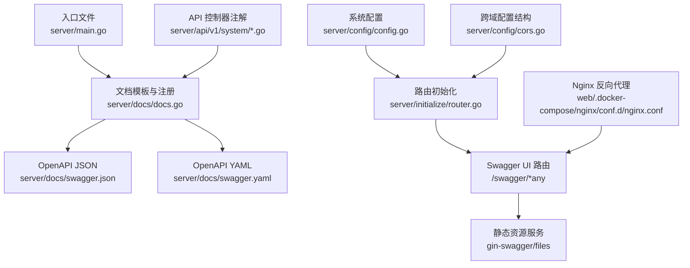
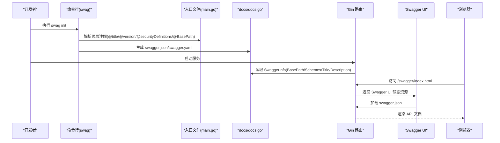
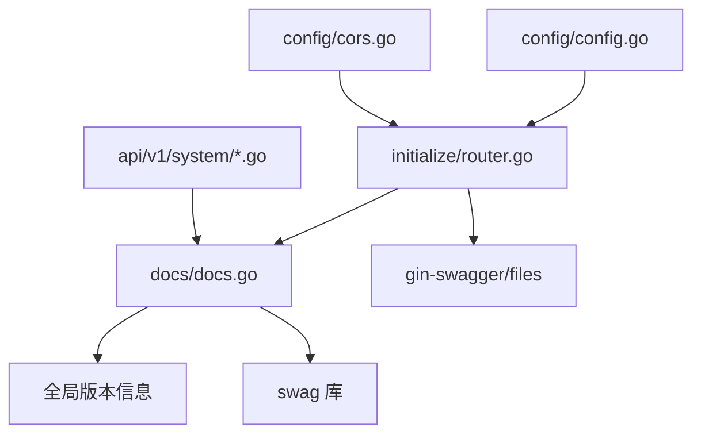

# Swagger 集成

<cite>
**本文引用的文件**
- [server/main.go](file://server/main.go)
- [server/docs/docs.go](file://server/docs/docs.go)
- [server/docs/swagger.json](file://server/docs/swagger.json)
- [server/docs/swagger.yaml](file://server/docs/swagger.yaml)
- [server/initialize/router.go](file://server/initialize/router.go)
- [server/api/v1/system/sys_api.go](file://server/api/v1/system/sys_api.go)
- [server/api/v1/system/sys_user.go](file://server/api/v1/system/sys_user.go)
- [server/config/config.go](file://server/config/config.go)
- [server/config/cors.go](file://server/config/cors.go)
- [web/.docker-compose/nginx/conf.d/nginx.conf](file://web/.docker-compose/nginx/conf.d/nginx.conf)
- [README-en.md](file://README-en.md)
</cite>

## 目录
1. [简介](#简介)
2. [项目结构](#项目结构)
3. [核心组件](#核心组件)
4. [架构总览](#架构总览)
5. [详细组件分析](#详细组件分析)
6. [依赖分析](#依赖分析)
7. [性能考量](#性能考量)
8. [故障排查指南](#故障排查指南)
9. [结论](#结论)
10. [附录](#附录)

## 简介
本文件面向在 Gin-Vue-Admin 项目中集成与使用 Swagger 的工程师，系统性阐述 Swag 注解体系、文档生成流程、Swagger UI 集成、OpenAPI 规范生成机制、以及文档维护与发布的最佳实践。读者可据此在现有项目中正确启用、扩展与维护 Swagger 文档。

## 项目结构
围绕 Swagger 的关键文件与职责如下：
- 文档生成入口与注解：入口文件包含顶层注解（标题、版本、安全定义、基础路径），Swag 通过扫描入口文件生成 OpenAPI 规范。
- 文档模板与注册：docs 包负责拼装 Swagger 模板、注册 Spec，并在运行时提供 JSON/YAML 输出。
- 路由与 UI 集成：初始化路由时挂载 Swagger UI 路由处理器，提供静态资源服务与跨域支持。
- API 层注解：各业务 API 控制器函数上使用 @Tags、@Summary、@Accept、@Produce、@Param、@Success、@Router 等注解，驱动 OpenAPI 规范生成。
- 配置与跨域：系统配置包含跨域配置结构，路由初始化阶段按配置启用 CORS 中间件或按规则放行。

图表来源
- [server/main.go:23-29](file://server/main.go#L23-L29)
- [server/docs/docs.go:9300-9314](file://server/docs/docs.go#L9300-L9314)
- [server/initialize/router.go:60-62](file://server/initialize/router.go#L60-L62)
- [server/api/v1/system/sys_api.go:18-26](file://server/api/v1/system/sys_api.go#L18-L26)
- [server/config/config.go:35-40](file://server/config/config.go#L35-L40)
- [server/config/cors.go:1-14](file://server/config/cors.go#L1-L14)
- [web/.docker-compose/nginx/conf.d/nginx.conf:29-31](file://web/.docker-compose/nginx/conf.d/nginx.conf#L29-L31)

章节来源
- [server/main.go:23-29](file://server/main.go#L23-L29)
- [server/docs/docs.go:9300-9314](file://server/docs/docs.go#L9300-L9314)
- [server/initialize/router.go:60-62](file://server/initialize/router.go#L60-L62)
- [server/api/v1/system/sys_api.go:18-26](file://server/api/v1/system/sys_api.go#L18-L26)
- [server/config/config.go:35-40](file://server/config/config.go#L35-L40)
- [server/config/cors.go:1-14](file://server/config/cors.go#L1-L14)
- [web/.docker-compose/nginx/conf.d/nginx.conf:29-31](file://web/.docker-compose/nginx/conf.d/nginx.conf#L29-L31)

## 核心组件
- 文档生成入口与注解
  - 入口文件通过顶层注解声明标题、版本、描述、安全定义与基础路径，Swag 以该文件为扫描起点。
  - 参考：[server/main.go:23-29](file://server/main.go#L23-L29)
- 文档模板与注册
  - docs 包内定义 docTemplate，包含 schemes、info、basePath、paths、securityDefinitions、tags 等字段，并通过 SwaggerInfo 注册到 swag。
  - 参考：[server/docs/docs.go:10-9298](file://server/docs/docs.go#L10-L9298)、[server/docs/docs.go:9300-9314](file://server/docs/docs.go#L9300-L9314)
- 路由与 Swagger UI 集成
  - 初始化路由时，依据系统配置设置 basePath，并挂载 /swagger/*any 路由，使用 ginSwagger.WrapHandler(swaggerFiles.Handler) 提供 UI。
  - 参考：[server/initialize/router.go:60-62](file://server/initialize/router.go#L60-L62)
- API 控制器注解
  - 控制器函数使用 @Tags、@Summary、@Security、@Accept、@Produce、@Param、@Success、@Router 等注解，驱动 OpenAPI 规范生成。
  - 参考：[server/api/v1/system/sys_api.go:18-26](file://server/api/v1/system/sys_api.go#L18-L26)、[server/api/v1/system/sys_user.go:20-26](file://server/api/v1/system/sys_user.go#L20-L26)
- 配置与跨域
  - 系统配置包含 CORS 结构体，路由初始化阶段可按配置启用 CORS 中间件或按规则放行。
  - 参考：[server/config/config.go:35-40](file://server/config/config.go#L35-L40)、[server/config/cors.go:1-14](file://server/config/cors.go#L1-L14)

章节来源
- [server/main.go:23-29](file://server/main.go#L23-L29)
- [server/docs/docs.go:10-9298](file://server/docs/docs.go#L10-L9298)
- [server/docs/docs.go:9300-9314](file://server/docs/docs.go#L9300-L9314)
- [server/initialize/router.go:60-62](file://server/initialize/router.go#L60-L62)
- [server/api/v1/system/sys_api.go:18-26](file://server/api/v1/system/sys_api.go#L18-L26)
- [server/api/v1/system/sys_user.go:20-26](file://server/api/v1/system/sys_user.go#L20-L26)
- [server/config/config.go:35-40](file://server/config/config.go#L35-L40)
- [server/config/cors.go:1-14](file://server/config/cors.go#L1-L14)

## 架构总览
下图展示了 Swagger 注解、文档生成与 UI 集成的端到端流程：

图表来源
- [server/main.go:23-29](file://server/main.go#L23-L29)
- [server/docs/docs.go:9300-9314](file://server/docs/docs.go#L9300-L9314)
- [server/initialize/router.go:60-62](file://server/initialize/router.go#L60-L62)
- [README-en.md:155-164](file://README-en.md#L155-L164)

章节来源
- [server/main.go:23-29](file://server/main.go#L23-L29)
- [server/docs/docs.go:9300-9314](file://server/docs/docs.go#L9300-L9314)
- [server/initialize/router.go:60-62](file://server/initialize/router.go#L60-L62)
- [README-en.md:155-164](file://README-en.md#L155-L164)

## 详细组件分析

### Swag 注解系统与使用方法
- 注解语法与位置
  - 顶层注解位于入口文件，用于声明文档元信息与安全定义，Swag 仅从入口文件解析顶层注解。
  - 控制器函数注解用于描述具体接口，包括标签、摘要、安全、输入输出、路由等。
  - 参考：[server/main.go:23-29](file://server/main.go#L23-L29)、[server/api/v1/system/sys_api.go:18-26](file://server/api/v1/system/sys_api.go#L18-L26)、[server/api/v1/system/sys_user.go:20-26](file://server/api/v1/system/sys_user.go#L20-L26)
- 注解参数配置
  - @Tags：接口分组标签，影响 UI 分类与排序。
  - @Summary：接口简述。
  - @Security：安全方案（如 ApiKeyAuth）。
  - @Accept/@Produce：请求与响应媒体类型。
  - @Param：参数位置、类型、必填与说明。
  - @Success：成功响应结构与说明。
  - @Router：HTTP 方法与路径。
  - 参考：[server/api/v1/system/sys_api.go:18-26](file://server/api/v1/system/sys_api.go#L18-L26)、[server/api/v1/system/sys_user.go:20-26](file://server/api/v1/system/sys_user.go#L20-L26)

章节来源
- [server/main.go:23-29](file://server/main.go#L23-L29)
- [server/api/v1/system/sys_api.go:18-26](file://server/api/v1/system/sys_api.go#L18-L26)
- [server/api/v1/system/sys_user.go:20-26](file://server/api/v1/system/sys_user.go#L20-L26)

### 文档生成流程
- 注解扫描
  - 通过 swag init 扫描入口文件与控制器注解，提取接口元信息。
  - 参考：[README-en.md:155-164](file://README-en.md#L155-L164)
- YAML/JSON 输出
  - 生成 swagger.yaml 与 swagger.json，作为 UI 与工具的数据源。
  - 参考：[server/docs/swagger.yaml:1-800](file://server/docs/swagger.yaml#L1-L800)、[server/docs/swagger.json:1-800](file://server/docs/swagger.json#L1-L800)
- 静态文件生成
  - docs/docs.go 中包含完整的 OpenAPI 规范模板与注册逻辑，随生成更新。
  - 参考：[server/docs/docs.go:10-9298](file://server/docs/docs.go#L10-L9298)

章节来源
- [README-en.md:155-164](file://README-en.md#L155-L164)
- [server/docs/swagger.yaml:1-800](file://server/docs/swagger.yaml#L1-L800)
- [server/docs/swagger.json:1-800](file://server/docs/swagger.json#L1-L800)
- [server/docs/docs.go:10-9298](file://server/docs/docs.go#L10-L9298)

### Swagger UI 集成配置
- 路由挂载
  - 在路由初始化阶段，依据系统配置设置 basePath，并挂载 /swagger/*any 路由，使用 ginSwagger.WrapHandler(swaggerFiles.Handler) 提供 UI。
  - 参考：[server/initialize/router.go:60-62](file://server/initialize/router.go#L60-L62)
- 静态资源服务
  - gin-swagger/files 提供 Swagger UI 静态资源，通过 WrapHandler 暴露。
  - 参考：[server/initialize/router.go:12-13](file://server/initialize/router.go#L12-L13)
- 跨域处理
  - 可按配置启用 CORS 中间件或按规则放行，确保 Swagger UI 与后端接口跨域通信。
  - 参考：[server/config/config.go:35-40](file://server/config/config.go#L35-L40)、[server/config/cors.go:1-14](file://server/config/cors.go#L1-L14)
- Nginx 反向代理
  - Nginx 将 /api/swagger/index.html 代理至后端服务，便于外部访问 Swagger UI。
  - 参考：[web/.docker-compose/nginx/conf.d/nginx.conf:29-31](file://web/.docker-compose/nginx/conf.d/nginx.conf#L29-L31)

章节来源
- [server/initialize/router.go:60-62](file://server/initialize/router.go#L60-L62)
- [server/initialize/router.go:12-13](file://server/initialize/router.go#L12-L13)
- [server/config/config.go:35-40](file://server/config/config.go#L35-L40)
- [server/config/cors.go:1-14](file://server/config/cors.go#L1-L14)
- [web/.docker-compose/nginx/conf.d/nginx.conf:29-31](file://web/.docker-compose/nginx/conf.d/nginx.conf#L29-L31)

### OpenAPI 规范生成机制
- 接口描述
  - 通过 @Tags、@Summary、@Description 等注解生成接口分组与描述。
  - 参考：[server/api/v1/system/sys_api.go:18-26](file://server/api/v1/system/sys_api.go#L18-L26)
- 参数定义
  - @Param 支持 body、formData、path、query 等多种位置与类型，映射到 OpenAPI 的 parameters。
  - 参考：[server/api/v1/system/sys_api.go:24-25](file://server/api/v1/system/sys_api.go#L24-L25)
- 响应格式
  - @Success 定义成功响应结构，支持嵌套对象与泛型包装，映射到 OpenAPI 的 responses。
  - 参考：[server/api/v1/system/sys_api.go:25-26](file://server/api/v1/system/sys_api.go#L25-L26)
- 安全定义
  - @Security 与 @in/@name/@BasePath 等顶层注解共同定义安全方案（如 ApiKeyAuth）。
  - 参考：[server/main.go:26-29](file://server/main.go#L26-L29)、[server/docs/docs.go:9282-9288](file://server/docs/docs.go#L9282-L9288)

章节来源
- [server/api/v1/system/sys_api.go:18-26](file://server/api/v1/system/sys_api.go#L18-L26)
- [server/api/v1/system/sys_api.go:24-25](file://server/api/v1/system/sys_api.go#L24-L25)
- [server/api/v1/system/sys_api.go:25-26](file://server/api/v1/system/sys_api.go#L25-L26)
- [server/main.go:26-29](file://server/main.go#L26-L29)
- [server/docs/docs.go:9282-9288](file://server/docs/docs.go#L9282-L9288)

### 文档维护与更新最佳实践
- 注解更新策略
  - 新增或变更接口时，同步补充/修正 @Tags、@Summary、@Param、@Success、@Router 等注解。
  - 参考：[server/api/v1/system/sys_api.go:18-26](file://server/api/v1/system/sys_api.go#L18-L26)
- 版本管理
  - 通过入口文件 @version 统一管理文档版本，发布前更新版本号并重新生成。
  - 参考：[server/main.go:24](file://server/main.go#L24)
- 文档发布流程
  - 本地执行 swag init 生成 JSON/YAML，提交到仓库并在 CI 中验证。
  - 参考：[README-en.md:155-164](file://README-en.md#L155-L164)
- 路由前缀与 basePath
  - 确保 docs.SwaggerInfo.BasePath 与系统 RouterPrefix 保持一致，避免 UI 404。
  - 参考：[server/initialize/router.go:60](file://server/initialize/router.go#L60)

章节来源
- [server/api/v1/system/sys_api.go:18-26](file://server/api/v1/system/sys_api.go#L18-L26)
- [server/main.go:24](file://server/main.go#L24)
- [README-en.md:155-164](file://README-en.md#L155-L164)
- [server/initialize/router.go:60](file://server/initialize/router.go#L60)

## 依赖分析
- 组件耦合
  - docs/docs.go 依赖全局版本信息与 swag 注册机制。
  - initialize/router.go 依赖 docs.SwaggerInfo 与 gin-swagger/files。
  - API 控制器依赖 model/response 等结构体，注解驱动 OpenAPI 规范。
- 外部依赖
  - swag（命令行与库）、gin-swagger/files、gin-gonic/gin。

图表来源
- [server/docs/docs.go:9300-9314](file://server/docs/docs.go#L9300-L9314)
- [server/initialize/router.go:60-62](file://server/initialize/router.go#L60-L62)
- [server/api/v1/system/sys_api.go:18-26](file://server/api/v1/system/sys_api.go#L18-L26)
- [server/config/config.go:35-40](file://server/config/config.go#L35-L40)
- [server/config/cors.go:1-14](file://server/config/cors.go#L1-L14)

章节来源
- [server/docs/docs.go:9300-9314](file://server/docs/docs.go#L9300-L9314)
- [server/initialize/router.go:60-62](file://server/initialize/router.go#L60-L62)
- [server/api/v1/system/sys_api.go:18-26](file://server/api/v1/system/sys_api.go#L18-L26)
- [server/config/config.go:35-40](file://server/config/config.go#L35-L40)
- [server/config/cors.go:1-14](file://server/config/cors.go#L1-L14)

## 性能考量
- 文档生成
  - swag init 仅在注解变更时执行，避免频繁扫描。
- UI 加载
  - swagger.json/swagger.yaml 体积较大时，建议启用压缩与缓存。
- 路由与中间件
  - 生产环境谨慎启用 Logger 中间件，避免影响性能。

## 故障排查指南
- Swagger UI 404
  - 检查 basePath 与 RouterPrefix 是否一致，确认 /swagger/*any 路由已挂载。
  - 参考：[server/initialize/router.go:60-62](file://server/initialize/router.go#L60-L62)
- 跨域问题
  - 按配置启用 CORS 中间件或按规则放行，确保 Swagger UI 与后端接口跨域通信。
  - 参考：[server/config/config.go:35-40](file://server/config/config.go#L35-L40)、[server/config/cors.go:1-14](file://server/config/cors.go#L1-L14)
- 文档未更新
  - 执行 swag init 后重启服务，确认 docs/swagger.json/swagger.yaml 已更新。
  - 参考：[README-en.md:155-164](file://README-en.md#L155-L164)

章节来源
- [server/initialize/router.go:60-62](file://server/initialize/router.go#L60-L62)
- [server/config/config.go:35-40](file://server/config/config.go#L35-L40)
- [server/config/cors.go:1-14](file://server/config/cors.go#L1-L14)
- [README-en.md:155-164](file://README-en.md#L155-L164)

## 结论
通过入口文件顶层注解与控制器函数注解，结合 docs/docs.go 的模板与注册机制，以及路由初始化阶段的 Swagger UI 挂载，项目实现了完整的 Swagger 集成。遵循注解更新策略、版本管理与发布流程，可确保文档与接口保持一致，提升协作与维护效率。

## 附录
- 配置示例
  - 跨域配置结构参考：[server/config/cors.go:1-14](file://server/config/cors.go#L1-L14)
  - 系统配置结构参考：[server/config/config.go:35-40](file://server/config/config.go#L35-L40)
- 常见问题
  - 未执行 swag init 导致 UI 为空：参考 [README-en.md:155-164](file://README-en.md#L155-L164)
  - basePath 不一致导致 UI 404：参考 [server/initialize/router.go:60](file://server/initialize/router.go#L60)