# 依赖更新

<cite>
**本文档引用的文件**
- [go.mod](file://server/go.mod)
- [go.sum](file://server/go.sum)
- [package.json](file://web/package.json)
- [config.yaml](file://server/config.yaml)
- [vite.config.js](file://web/vite.config.js)
- [version.go](file://server/global/version.go)
- [version.js](file://web/src/api/version.js)
- [main.go](file://server/main.go)
- [config.js](file://web/src/core/config.js)
- [Version Updates.md](file://repowiki/zh/content/Version Updates.md)
</cite>

## 目录
1. [简介](#简介)
2. [项目依赖现状](#项目依赖现状)
3. [后端依赖分析](#后端依赖分析)
4. [前端依赖分析](#前端依赖分析)
5. [版本管理机制](#版本管理机制)
6. [依赖更新策略](#依赖更新策略)
7. [性能影响评估](#性能影响评估)
8. [安全考虑](#安全考虑)
9. [最佳实践建议](#最佳实践建议)
10. [总结](#总结)

## 简介

Gin-Vue-Admin 是一个基于 Go 和 Vue.js 的全栈开发基础平台，当前版本为 v2.9.1。本文档详细分析了项目的依赖更新情况，包括后端 Go 依赖、前端 JavaScript 依赖、版本管理机制以及相关的配置文件。

## 项目依赖现状

### 当前版本信息

项目采用统一的版本管理策略：

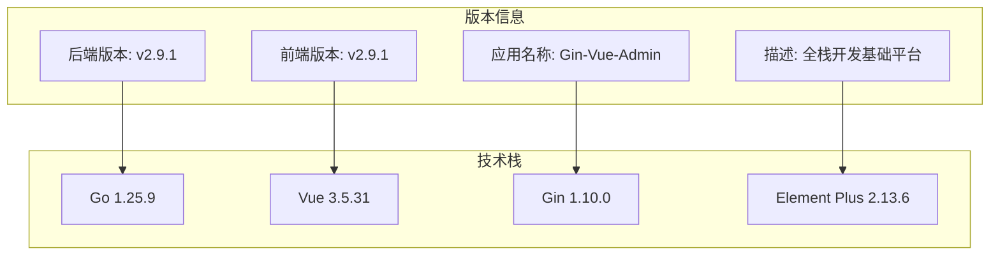

**图表来源**
- [version.go:6-12](file://server/global/version.go#L6-L12)
- [package.json:3](file://web/package.json#L3)

**章节来源**
- [version.go:6-12](file://server/global/version.go#L6-L12)
- [package.json:3](file://web/package.json#L3)
- [main.go:24](file://server/main.go#L24)

## 后端依赖分析

### Go 模块依赖结构

后端项目使用 Go Modules 进行依赖管理，核心依赖包括：

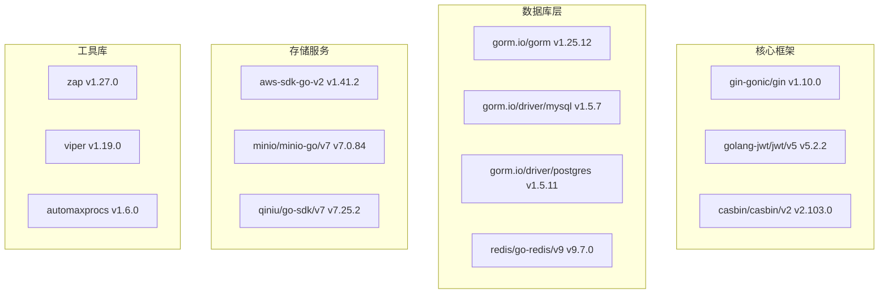

**图表来源**
- [go.mod:5-61](file://server/go.mod#L5-L61)

### 关键依赖版本

| 依赖类别 | 主要依赖 | 版本 | 用途 |
|---------|----------|------|------|
| Web框架 | github.com/gin-gonic/gin | v1.10.0 | HTTP服务框架 |
| JWT认证 | github.com/golang-jwt/jwt/v5 | v5.2.2 | 令牌处理 |
| 权限控制 | github.com/casbin/casbin/v2 | v2.103.0 | RBAC权限管理 |
| ORM框架 | gorm.io/gorm | v1.25.12 | 数据库操作 |
| MySQL驱动 | gorm.io/driver/mysql | v1.5.7 | MySQL数据库连接 |
| Redis客户端 | github.com/redis/go-redis/v9 | v9.7.0 | 缓存服务 |
| 日志库 | go.uber.org/zap | v1.27.0 | 结构化日志 |
| 配置管理 | github.com/spf13/viper | v1.19.0 | 配置文件处理 |

**章节来源**
- [go.mod:5-61](file://server/go.mod#L5-L61)

### 间接依赖分析

项目还包含大量的间接依赖，主要用于支持各种功能特性：

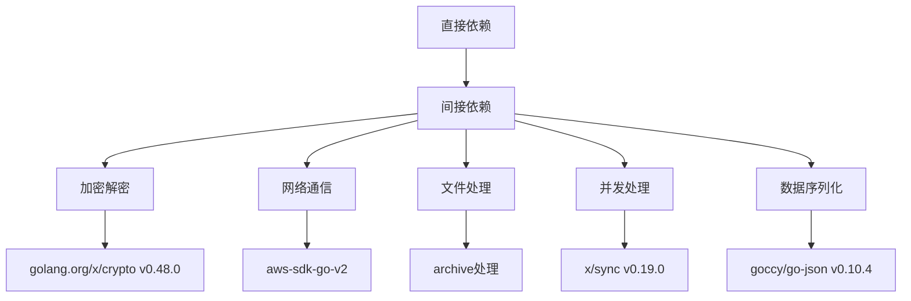

**图表来源**
- [go.mod:63-217](file://server/go.mod#L63-L217)

**章节来源**
- [go.mod:63-217](file://server/go.mod#L63-L217)

## 前端依赖分析

### JavaScript 包管理

前端项目使用 npm 进行包管理，当前版本为 2.9.1：

```mermaid
graph TB
subgraph "核心框架"
A[vue ^3.5.31]
B[vue-router ^4.4.3]
C[pinia ^2.2.2]
end
subgraph "UI组件库"
D[element-plus ^2.13.6]
E[@element-plus/icons-vue ^2.3.1]
F[@iconify/vue ^5.0.0]
end
subgraph "开发工具"
G[vite ^6.2.3]
H[@vitejs/plugin-vue ^5.0.3]
I[@unocss/vite ^66.5.0]
end
subgraph "功能扩展"
J[axios 1.8.2]
K[echarts 5.5.1]
L[marked 14.1.1]
end
```

**图表来源**
- [package.json:14-56](file://web/package.json#L14-L56)

### 开发依赖配置

前端开发依赖主要包括构建工具和代码质量工具：

| 依赖类型 | 主要工具 | 版本 | 用途 |
|---------|----------|------|------|
| 构建工具 | vite | ^6.2.3 | 前端构建和开发服务器 |
| Vue插件 | @vitejs/plugin-vue | ^5.0.3 | Vue单文件组件支持 |
| CSS处理器 | @unocss/vite | ^66.5.0 | 原子化CSS框架 |
| 代码质量 | eslint | ^8.57.0 | JavaScript代码检查 |
| 测试框架 | @vue/cli-service | ~5.0.8 | Vue CLI开发服务 |

**章节来源**
- [package.json:14-88](file://web/package.json#L14-L88)

### Vite 构建配置

项目使用 Vite 作为构建工具，配置了现代化的开发体验：

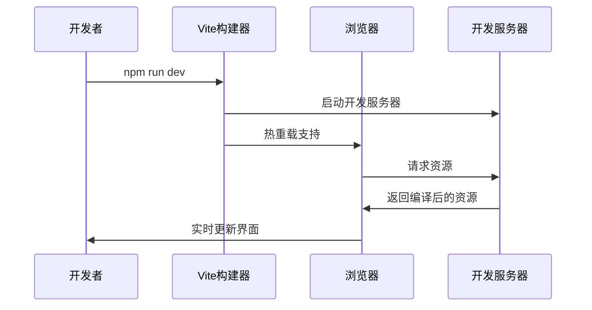

**图表来源**
- [vite.config.js:57-78](file://web/vite.config.js#L57-L78)

**章节来源**
- [vite.config.js:57-78](file://web/vite.config.js#L57-L78)

## 版本管理机制

### 版本更新功能架构

系统提供了完整的版本管理功能，支持版本的创建、导出、导入和删除：

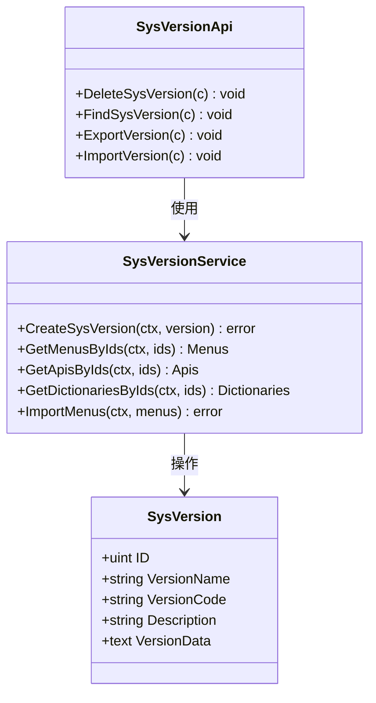

**图表来源**
- [Version Updates.md:130-155](file://repowiki/zh/content/Version Updates.md#L130-L155)

### 版本导出流程

版本导出功能实现了复杂的数据处理逻辑：

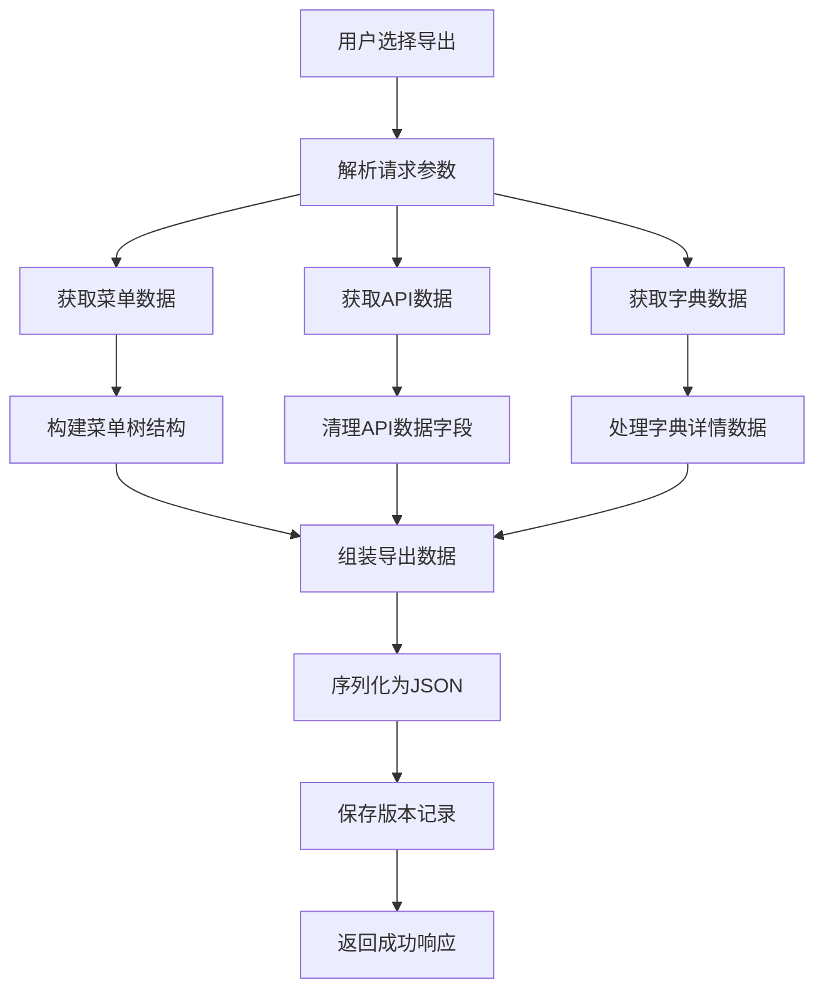

**图表来源**
- [Version Updates.md:217-245](file://repowiki/zh/content/Version Updates.md#L217-L245)

**章节来源**
- [Version Updates.md:217-245](file://repowiki/zh/content/Version Updates.md#L217-L245)

## 依赖更新策略

### 后端依赖更新流程

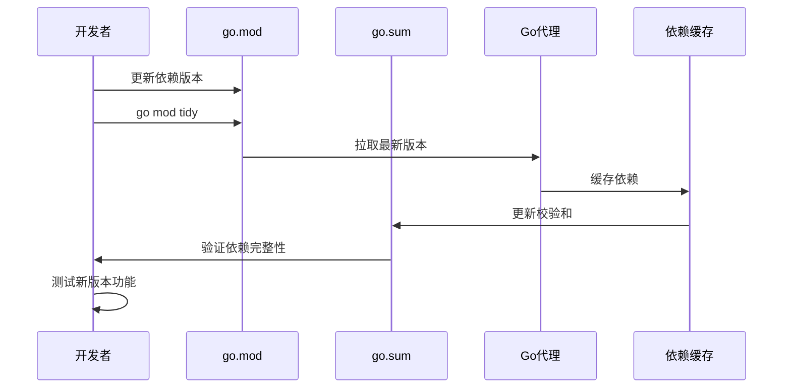

**图表来源**
- [main.go:11-14](file://server/main.go#L11-L14)

### 前端依赖更新流程

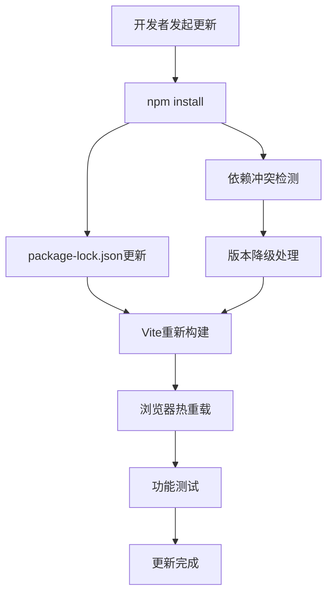

**图表来源**
- [package.json:5](file://web/package.json#L5)

### 版本同步机制

项目采用了多层面的版本同步策略：

| 同步层级 | 同步方式 | 实现机制 |
|---------|----------|----------|
| 应用层 | 全局常量 | server/global/version.go |
| API层 | Swagger注释 | server/main.go |
| 前端层 | 包配置文件 | web/package.json |
| 文档层 | Wiki文档 | repowiki/zh/content/Version Updates.md |

**章节来源**
- [version.go:6-12](file://server/global/version.go#L6-L12)
- [main.go:24](file://server/main.go#L24)
- [package.json:3](file://web/package.json#L3)

## 性能影响评估

### 依赖对性能的影响

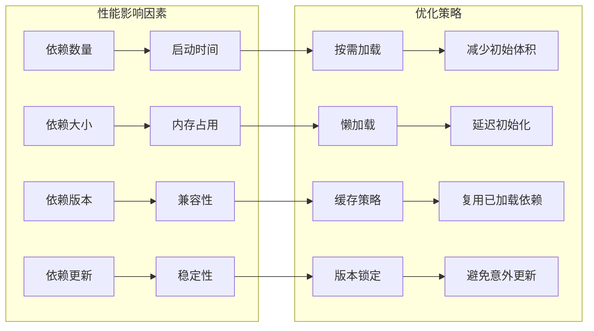

### 性能监控指标

| 指标类型 | 监控方法 | 阈值标准 |
|---------|----------|----------|
| 启动时间 | Vite构建时间 | < 5秒 |
| 内存使用 | 浏览器性能面板 | < 100MB |
| API响应 | 服务器日志分析 | < 200ms |
| 数据库连接 | 连接池监控 | < 80%利用率 |

**章节来源**
- [vite.config.js:80-93](file://web/vite.config.js#L80-L93)

## 安全考虑

### 依赖安全审计

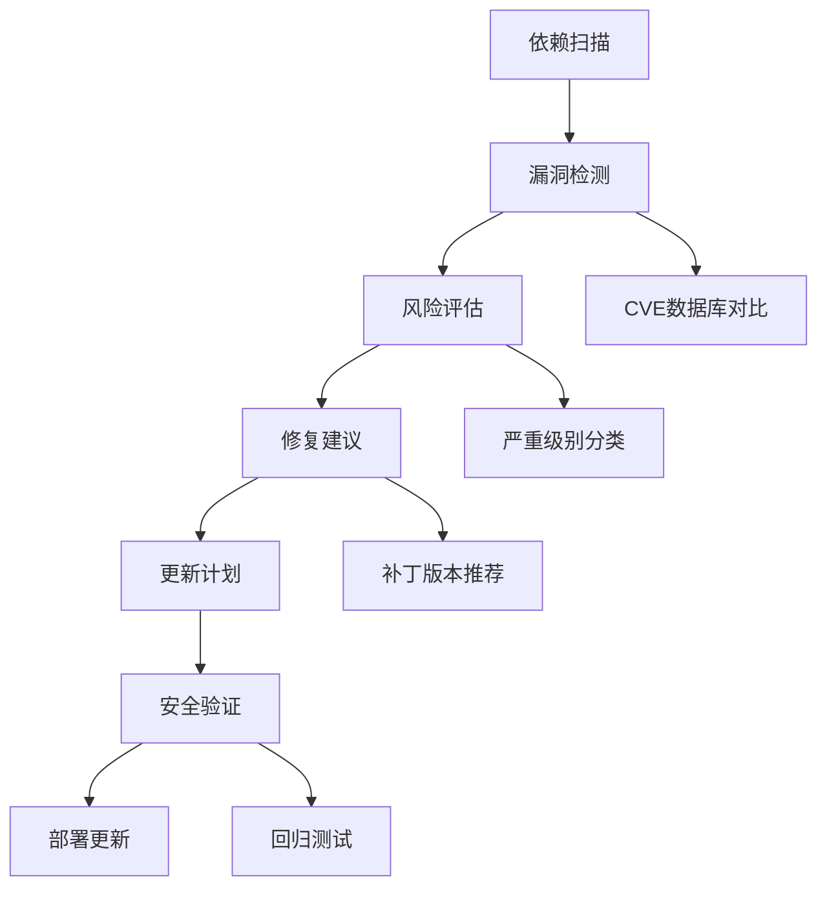

### 安全最佳实践

1. **定期更新**：建立定期依赖更新机制
2. **漏洞监控**：使用安全扫描工具
3. **版本锁定**：使用 go.sum 和 package-lock.json
4. **最小权限**：只引入必要依赖
5. **代码审查**：新增依赖需要审查

**章节来源**
- [go.sum:1-800](file://server/go.sum#L1-L800)

## 最佳实践建议

### 依赖管理最佳实践

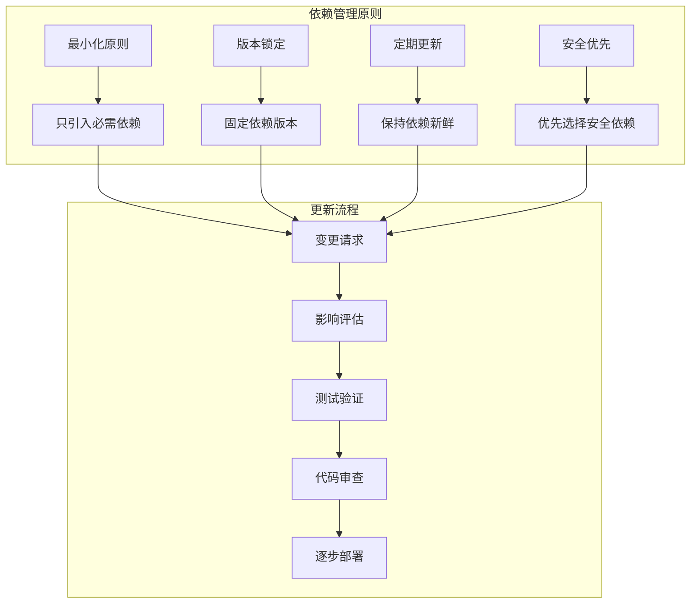

### 开发环境配置

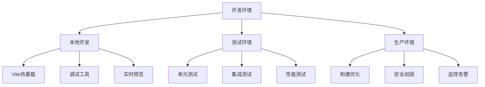

## 总结

Gin-Vue-Admin 项目展现了良好的依赖管理实践，具有以下特点：

### 技术优势

1. **统一版本管理**：前后端版本保持一致，便于维护
2. **模块化架构**：清晰的依赖层次结构
3. **现代化工具链**：使用最新的开发工具和技术
4. **完善的版本功能**：支持完整的版本生命周期管理

### 改进建议

1. **依赖监控**：建立自动化依赖安全扫描机制
2. **性能优化**：持续优化依赖加载性能
3. **文档完善**：补充依赖更新的详细文档
4. **测试覆盖**：增加依赖更新的自动化测试

当前版本 v2.9.1 为系统提供了稳定的基础功能，依赖管理策略体现了良好的软件工程实践，为后续的功能扩展和维护奠定了坚实的基础。