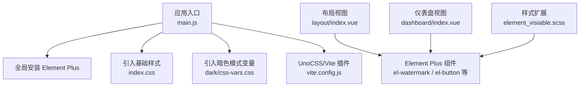
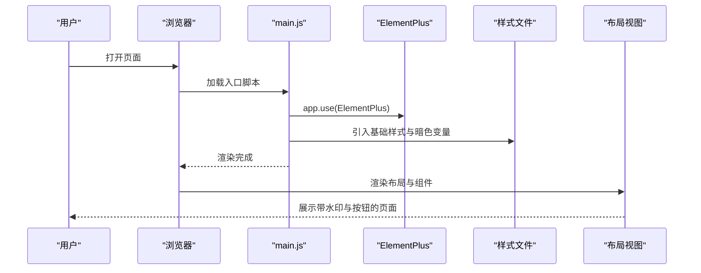
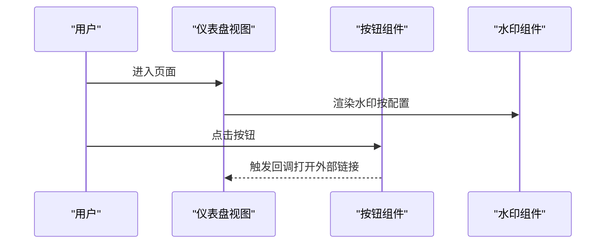
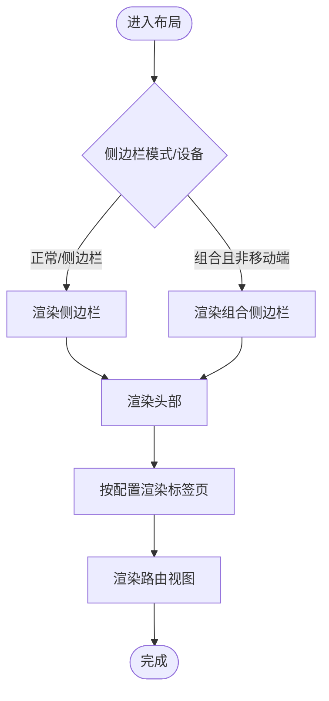
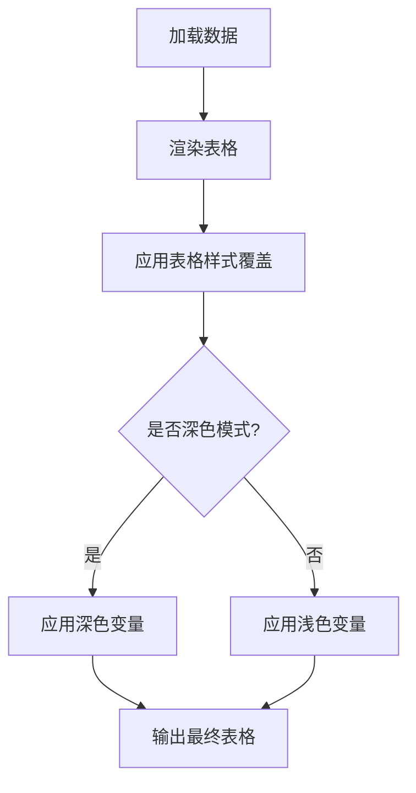
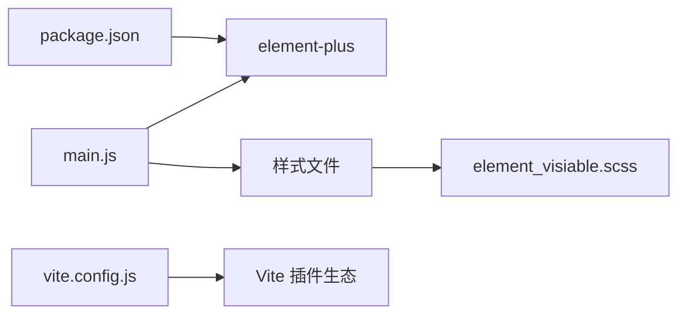

# Element Plus 组件库

<cite>
**本文引用的文件**
- [package.json](file://web/package.json)
- [main.js](file://web/src/main.js)
- [element_visiable.scss](file://web/src/style/element_visiable.scss)
- [vite.config.js](file://web/vite.config.js)
- [index.vue（布局）](file://web/src/view/layout/index.vue)
- [index.vue（仪表盘）](file://web/src/view/dashboard/index.vue)
- [UI主题定制.md](file://repowiki/zh/content/前端应用/UI主题定制.md)
</cite>

## 目录
1. [简介](#简介)
2. [项目结构](#项目结构)
3. [核心组件](#核心组件)
4. [架构总览](#架构总览)
5. [组件详解](#组件详解)
6. [依赖分析](#依赖分析)
7. [性能考量](#性能考量)
8. [故障排查指南](#故障排查指南)
9. [结论](#结论)
10. [附录](#附录)

## 简介
本文件面向 Gin-Vue-Admin 前端工程中的 Element Plus 组件库使用，系统性梳理基础组件、布局组件、表单组件、数据展示组件等在项目中的集成方式与典型用法；同时给出主题定制（CSS 变量覆盖、暗色模式支持、响应式断点）、性能优化与最佳实践建议。文档严格基于仓库现有源码与文档，避免臆造信息。

## 项目结构
前端以 Vite 作为构建工具，Element Plus 在入口处全局安装并引入基础样式；项目通过 SCSS 扩展 Element Plus 的默认样式，实现统一风格与暗色模式适配；布局层广泛使用 Element Plus 的水印、按钮、分页等组件，形成一致的交互体验。

图表来源
- [main.js:1-38](file://web/src/main.js#L1-L38)
- [vite.config.js:1-119](file://web/vite.config.js#L1-L119)
- [index.vue（布局）:1-119](file://web/src/view/layout/index.vue#L1-L119)
- [index.vue（仪表盘）:1-129](file://web/src/view/dashboard/index.vue#L1-L129)
- [element_visiable.scss:1-139](file://web/src/style/element_visiable.scss#L1-L139)

章节来源
- [main.js:1-38](file://web/src/main.js#L1-L38)
- [vite.config.js:1-119](file://web/vite.config.js#L1-L119)
- [index.vue（布局）:1-119](file://web/src/view/layout/index.vue#L1-L119)
- [index.vue（仪表盘）:1-129](file://web/src/view/dashboard/index.vue#L1-L129)
- [element_visiable.scss:1-139](file://web/src/style/element_visiable.scss#L1-L139)

## 核心组件
- 基础组件
  - 按钮：用于操作触发，如“购买商业授权”“插件市场”等。
  - 水印：用于页面级水印展示，结合用户信息与暗色模式字体颜色。
- 布局组件
  - 布局容器：采用 Flex 布局组织头部、侧边栏、主内容区与标签页。
- 表单组件
  - 表单项与输入类组件在项目中以组合自定义卡片与图表组件的方式呈现，具体参数与校验逻辑由上层封装组件负责。
- 数据展示组件
  - 分页：通过自定义分页样式类名实现统一风格与暗色模式适配。
  - 表格：通过 SCSS 覆盖默认表格样式，统一标题与单元格的排版与颜色。

章节来源
- [index.vue（布局）:1-119](file://web/src/view/layout/index.vue#L1-L119)
- [index.vue（仪表盘）:1-129](file://web/src/view/dashboard/index.vue#L1-L129)
- [element_visiable.scss:1-139](file://web/src/style/element_visiable.scss#L1-L139)

## 架构总览
Element Plus 在应用启动阶段完成全局安装与样式引入；项目通过 SCSS 对组件样式进行二次封装，实现品牌化与暗色模式统一；Vite 插件体系提供构建期优化与开发期调试能力。

图表来源
- [main.js:1-38](file://web/src/main.js#L1-L38)
- [index.vue（布局）:1-119](file://web/src/view/layout/index.vue#L1-L119)

章节来源
- [main.js:1-38](file://web/src/main.js#L1-L38)
- [index.vue（布局）:1-119](file://web/src/view/layout/index.vue#L1-L119)

## 组件详解

### 基础组件：按钮与水印
- 按钮
  - 使用场景：仪表盘中的“购买商业授权”“插件市场”等操作入口。
  - 关键点：通过类型与点击事件绑定实现行为控制。
- 水印
  - 使用场景：布局顶层水印，内容取自用户信息，支持暗色模式字体颜色切换。
  - 关键点：条件渲染与层级控制，确保不影响交互。

图表来源
- [index.vue（仪表盘）:1-129](file://web/src/view/dashboard/index.vue#L1-L129)
- [index.vue（布局）:1-119](file://web/src/view/layout/index.vue#L1-L119)

章节来源
- [index.vue（仪表盘）:1-129](file://web/src/view/dashboard/index.vue#L1-L129)
- [index.vue（布局）:1-119](file://web/src/view/layout/index.vue#L1-L119)

### 布局组件：容器与导航
- 容器
  - 使用 Flex 布局组织头部、侧边栏、主内容区与标签页，支持移动端与组合模式。
- 导航
  - 通过菜单项与子菜单样式覆盖，实现高亮与主题色一致的视觉反馈。

图表来源
- [index.vue（布局）:1-119](file://web/src/view/layout/index.vue#L1-L119)

章节来源
- [index.vue（布局）:1-119](file://web/src/view/layout/index.vue#L1-L119)

### 表单组件：表单项与输入
- 项目中表单项与输入类组件以自定义卡片与图表组件的形式出现，具体参数与校验逻辑由上层封装组件负责。
- 建议遵循 Element Plus 表单组件的通用属性与事件规范（如尺寸、禁用、只读、必填、校验规则等），并在封装组件内集中处理。

章节来源
- [index.vue（仪表盘）:1-129](file://web/src/view/dashboard/index.vue#L1-L129)

### 数据展示组件：分页与表格
- 分页
  - 通过自定义分页样式类名实现统一风格与暗色模式适配，保证页码按钮与输入框的视觉一致性。
- 表格
  - 通过 SCSS 覆盖默认表格样式，统一标题与单元格的排版与颜色，提升在深色模式下的可读性。

图表来源
- [element_visiable.scss:1-139](file://web/src/style/element_visiable.scss#L1-L139)

章节来源
- [element_visiable.scss:1-139](file://web/src/style/element_visiable.scss#L1-L139)

## 依赖分析
- 依赖来源
  - Element Plus 作为 UI 组件库，通过包管理文件声明并由入口文件全局安装。
  - 样式层面通过 SCSS 扩展与暗色模式变量文件实现统一风格。
  - Vite 插件体系提供构建期优化与开发期调试能力。

图表来源
- [package.json:1-88](file://web/package.json#L1-L88)
- [main.js:1-38](file://web/src/main.js#L1-L38)
- [element_visiable.scss:1-139](file://web/src/style/element_visiable.scss#L1-L139)
- [vite.config.js:1-119](file://web/vite.config.js#L1-L119)

章节来源
- [package.json:1-88](file://web/package.json#L1-L88)
- [main.js:1-38](file://web/src/main.js#L1-L38)
- [element_visiable.scss:1-139](file://web/src/style/element_visiable.scss#L1-L139)
- [vite.config.js:1-119](file://web/vite.config.js#L1-L119)

## 性能考量
- 按需引入与 Tree Shaking
  - 建议在保持功能完整性前提下，尽量采用按需引入策略以减少打包体积。
- 样式体积控制
  - 通过 SCSS 覆盖与变量统一管理，避免重复样式导致的体积膨胀。
- 暗色模式与响应式
  - 利用 CSS 变量与媒体查询，减少重复计算与重绘。
- 构建优化
  - 借助 Vite 插件与 Terser 压缩配置，控制生产环境体积与加载时间。

章节来源
- [vite.config.js:1-119](file://web/vite.config.js#L1-L119)

## 故障排查指南
- 暗色模式不生效
  - 确认已引入暗色模式变量文件，并检查 CSS 变量覆盖顺序与优先级。
- 样式冲突
  - 检查自定义样式类名与 Element Plus 默认类名的优先级，必要时使用作用域或深度选择器。
- 水印显示异常
  - 检查水印组件的条件渲染与层级控制，确认内容来源与字体颜色在不同主题下的表现。

章节来源
- [main.js:1-38](file://web/src/main.js#L1-L38)
- [element_visiable.scss:1-139](file://web/src/style/element_visiable.scss#L1-L139)
- [index.vue（布局）:1-119](file://web/src/view/layout/index.vue#L1-L119)

## 结论
本项目在 Element Plus 的基础上，通过全局安装、样式扩展与暗色模式变量实现了统一的 UI 风格与良好的可维护性。建议在后续迭代中进一步完善按需引入策略与样式治理，持续优化性能与可访问性。

## 附录
- 主题定制参考
  - 项目提供了主题定制相关文档，建议结合暗色模式变量与 CSS 变量覆盖实现品牌化定制。
- 响应式断点
  - 布局组件在不同设备与模式下具备差异化渲染逻辑，建议结合项目现有断点策略进行扩展。

章节来源
- [UI主题定制.md](file://repowiki/zh/content/前端应用/UI主题定制.md)