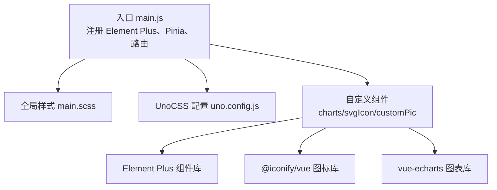
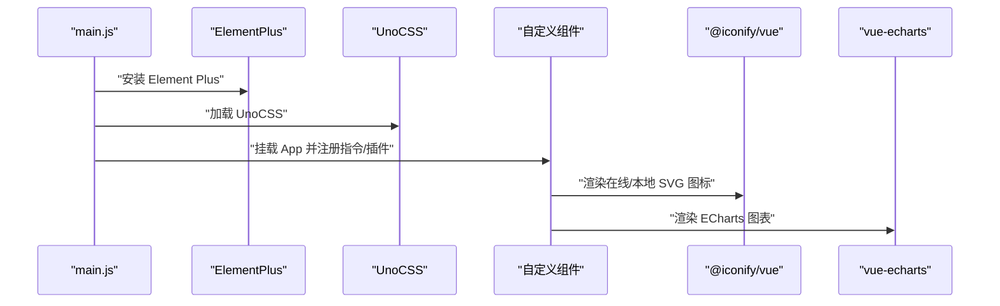
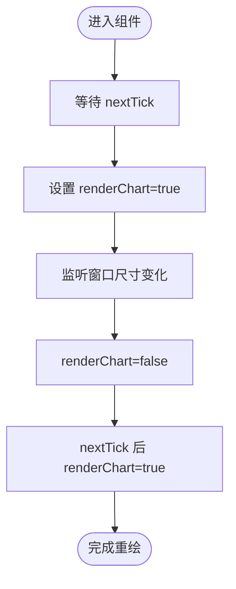
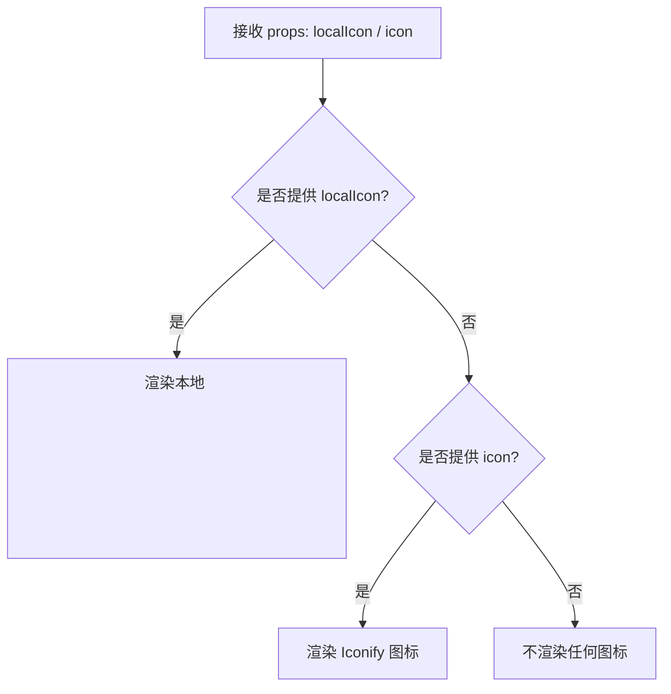
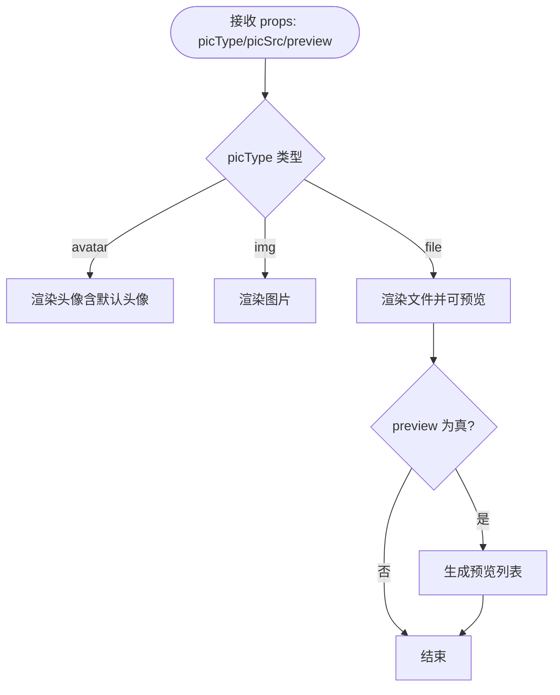
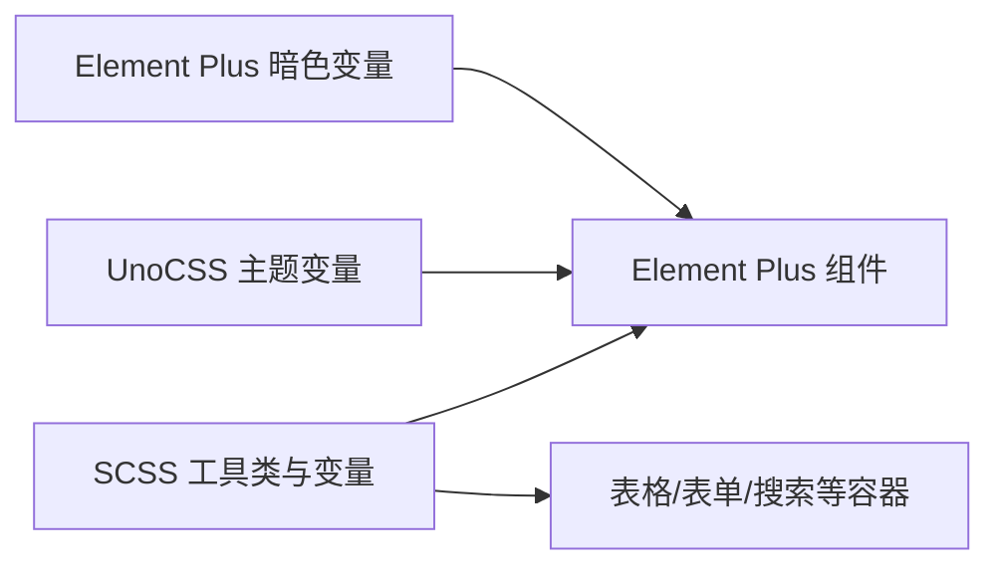
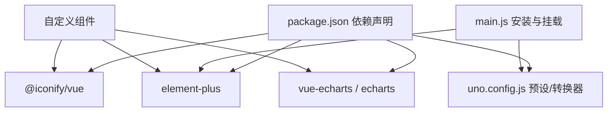

# UI 组件系统

<cite>
**本文引用的文件**
- [web/src/components/charts/index.vue](file://web/src/components/charts/index.vue)
- [web/src/components/svgIcon/svgIcon.vue](file://web/src/components/svgIcon/svgIcon.vue)
- [web/src/components/customPic/index.vue](file://web/src/components/customPic/index.vue)
- [web/src/style/main.scss](file://web/src/style/main.scss)
- [web/uno.config.js](file://web/uno.config.js)
- [web/package.json](file://web/package.json)
- [web/src/main.js](file://web/src/main.js)
- [web/src/core/gin-vue-admin.js](file://web/src/core/gin-vue-admin.js)
</cite>

## 目录
1. [简介](#简介)
2. [项目结构](#项目结构)
3. [核心组件](#核心组件)
4. [架构总览](#架构总览)
5. [详细组件分析](#详细组件分析)
6. [依赖分析](#依赖分析)
7. [性能考量](#性能考量)
8. [故障排查指南](#故障排查指南)
9. [结论](#结论)
10. [附录](#附录)

## 简介
本文件面向前端开发者与产品设计人员，系统化梳理基于 Element Plus 的 UI 组件体系，覆盖主题与样式定制、图标系统、核心自定义组件（图表、图片展示、SVG 图标封装）、UnoCSS 工具类与 SCSS 变量体系、响应式与暗色模式适配、组件开发规范与最佳实践（测试、文档、版本管理）。目标是帮助团队在保持一致性的同时提升可维护性与可扩展性。

## 项目结构
前端位于 web 目录，采用 Vite + Vue 3 + Element Plus 技术栈；样式采用 SCSS 与 UnoCSS 指令式转换混合策略；图标系统同时支持本地 SVG 与 Iconify 在线图标；核心自定义组件集中在 src/components 下，按功能域分层组织。

图示来源
- [web/src/main.js:1-38](file://web/src/main.js#L1-L38)
- [web/src/style/main.scss:1-60](file://web/src/style/main.scss#L1-L60)
- [web/uno.config.js:1-27](file://web/uno.config.js#L1-L27)
- [web/src/components/charts/index.vue:1-48](file://web/src/components/charts/index.vue#L1-L48)
- [web/src/components/svgIcon/svgIcon.vue:1-45](file://web/src/components/svgIcon/svgIcon.vue#L1-L45)
- [web/src/components/customPic/index.vue:1-91](file://web/src/components/customPic/index.vue#L1-L91)

章节来源
- [web/src/main.js:1-38](file://web/src/main.js#L1-L38)
- [web/src/style/main.scss:1-60](file://web/src/style/main.scss#L1-L60)
- [web/uno.config.js:1-27](file://web/uno.config.js#L1-L27)

## 核心组件
- 图表组件：基于 vue-echarts 封装，支持自动尺寸调整与响应式重绘。
- SVG 图标组件：统一本地 symbol 与 Iconify 在线图标使用，透传属性。
- 图片展示组件：根据类型渲染头像、图片或文件预览，支持用户头像回退与预览弹层。

章节来源
- [web/src/components/charts/index.vue:1-48](file://web/src/components/charts/index.vue#L1-L48)
- [web/src/components/svgIcon/svgIcon.vue:1-45](file://web/src/components/svgIcon/svgIcon.vue#L1-L45)
- [web/src/components/customPic/index.vue:1-91](file://web/src/components/customPic/index.vue#L1-L91)

## 架构总览
下图展示应用启动到组件渲染的关键路径，以及样式与图标系统的集成方式。

图示来源
- [web/src/main.js:1-38](file://web/src/main.js#L1-L38)
- [web/src/components/svgIcon/svgIcon.vue:1-45](file://web/src/components/svgIcon/svgIcon.vue#L1-L45)
- [web/src/components/charts/index.vue:1-48](file://web/src/components/charts/index.vue#L1-L48)

## 详细组件分析

### 图表组件（charts）
- 设计理念：轻封装、高复用。通过 props 传递 ECharts 配置，内部处理首次渲染与窗口尺寸变化时的重绘，避免闪烁与布局抖动。
- 关键能力
  - 首次渲染延迟：使用 nextTick 控制渲染时机，确保容器尺寸稳定。
  - 响应式重绘：监听窗口尺寸变化，临时关闭渲染后重建，保证图表自适应。
  - 尺寸与样式：支持 width/height 与 autoResize 控制。
- 复杂度与性能
  - 渲染控制为 O(1) 切换，重绘触发为 O(n)（n 为图表实例数），建议在大数据场景下结合防抖与懒加载。
- 使用建议
  - 外部传入完整 option，组件不负责数据聚合，保持单一职责。
  - 需要动画或复杂交互时，优先在外部 store 管理状态，组件仅负责渲染。

图示来源
- [web/src/components/charts/index.vue:10-45](file://web/src/components/charts/index.vue#L10-L45)

章节来源
- [web/src/components/charts/index.vue:1-48](file://web/src/components/charts/index.vue#L1-L48)

### SVG 图标组件（svgIcon）
- 设计理念：统一图标入口，兼容本地 symbol 与 Iconify 在线图标，支持类名与内联样式的透传。
- 关键能力
  - 本地图标：通过 localIcon 属性绑定 symbol id，使用 <use xlink:href> 渲染。
  - 在线图标：通过 icon 属性（如 “mdi:home”）直接渲染，减少本地资源体积。
  - 属性透传：计算 bindAttrs，将 class/style 等原样传递给 <svg>，便于 UnoCSS 与样式覆盖。
- 使用规范
  - 本地图标需预先注册至 <symbol>，并在组件中以 localIcon 使用。
  - 在线图标遵循 Iconify 命名规范，可在官方站点查询。
  - 建议统一通过组件使用，避免直接引入图标资源文件。

图示来源
- [web/src/components/svgIcon/svgIcon.vue:1-45](file://web/src/components/svgIcon/svgIcon.vue#L1-L45)

章节来源
- [web/src/components/svgIcon/svgIcon.vue:1-45](file://web/src/components/svgIcon/svgIcon.vue#L1-L45)

### 图片展示组件（customPic）
- 设计理念：围绕用户头像、普通图片与文件预览三种形态抽象统一接口，内置默认头像与预览弹层。
- 关键能力
  - 头像/图片/文件三种模式切换，支持用户头像回退与本地资源兜底。
  - 文件预览：启用预览弹层并支持多图预览列表（当开启 preview 时）。
  - 资源拼接：自动拼接基础 API 前缀，支持绝对/相对路径。
- 使用建议
  - 优先使用用户 store 中的头像字段，避免重复传参。
  - 预览场景建议开启预览弹层，提升可访问性与体验。

图示来源
- [web/src/components/customPic/index.vue:1-91](file://web/src/components/customPic/index.vue#L1-L91)

章节来源
- [web/src/components/customPic/index.vue:1-91](file://web/src/components/customPic/index.vue#L1-L91)

### 主题与样式管理
- Element Plus 暗色模式
  - 通过引入暗色 CSS 变量文件实现全局暗色支持，配合 UnoCSS 的 dark: 'class' 主题开关。
- SCSS 全局样式
  - 提供表格、按钮列表、表单区域、搜索区等通用容器样式类，统一边框、圆角、间距与颜色变量。
  - 通过 SCSS 变量与 CSS 自定义属性联动，实现主题一致性。
- UnoCSS 工具类
  - 配置主题变量映射（背景、文本、阴影、边框），启用指令式转换器，支持在模板中直接使用工具类。
  - 与 Element Plus 组件类名协同，避免冲突并提升开发效率。

图示来源
- [web/src/style/main.scss:1-60](file://web/src/style/main.scss#L1-L60)
- [web/uno.config.js:1-27](file://web/uno.config.js#L1-L27)
- [web/src/main.js:1-38](file://web/src/main.js#L1-L38)

章节来源
- [web/src/style/main.scss:1-60](file://web/src/style/main.scss#L1-L60)
- [web/uno.config.js:1-27](file://web/uno.config.js#L1-L27)
- [web/src/main.js:1-38](file://web/src/main.js#L1-L38)

### 图标系统组织与使用规范
- 本地图标
  - 通过 <symbol> 注册，组件以 localIcon 使用，适合高频、稳定、可控的图标。
- 在线图标
  - 通过 @iconify/vue 渲染，命名遵循 “集合:名称”，适合动态、多样化的图标需求。
- 规范
  - 统一通过 SvgIcon 组件使用，避免直接引入图标资源。
  - 类名与样式透传，便于 UnoCSS 与主题覆盖。
  - 建议在设计系统中沉淀图标清单与命名规范。

章节来源
- [web/src/components/svgIcon/svgIcon.vue:1-45](file://web/src/components/svgIcon/svgIcon.vue#L1-L45)
- [web/package.json:14-56](file://web/package.json#L14-L56)

## 依赖分析
- 运行时依赖
  - Element Plus：UI 组件库基础。
  - @iconify/vue：在线图标渲染。
  - vue-echarts / echarts：图表能力。
  - @unocss/preset-wind3：UnoCSS 预设。
  - @unocss/transformer-directives：指令式转换器。
- 开发依赖
  - vite、sass、eslint 等，保障构建、样式与代码质量。
- 组件间耦合
  - 自定义组件对 Element Plus 与第三方库存在直接依赖，但通过 props 与事件解耦，便于替换与扩展。

图示来源
- [web/package.json:14-56](file://web/package.json#L14-L56)
- [web/src/main.js:1-38](file://web/src/main.js#L1-L38)
- [web/uno.config.js:1-27](file://web/uno.config.js#L1-L27)

章节来源
- [web/package.json:14-56](file://web/package.json#L14-L56)
- [web/src/main.js:1-38](file://web/src/main.js#L1-L38)

## 性能考量
- 图表组件
  - 首次渲染延迟与重绘触发均使用异步调度，避免阻塞主线程；在大数据场景建议结合虚拟滚动与懒加载。
- 图标组件
  - 在线图标按需加载，减少首屏体积；本地图标建议合并为 symbol，降低请求次数。
- 样式体系
  - UnoCSS 指令式转换器在构建期处理，运行时开销低；SCSS 变量与 CSS 自定义属性减少重复样式定义。
- 资源拼接
  - 统一拼接基础 API 前缀，避免重复计算与网络请求。

## 故障排查指南
- 图表不显示或尺寸异常
  - 检查父容器是否具备明确宽高；确认 autoResize 与窗口监听是否生效。
  - 参考路径：[web/src/components/charts/index.vue:10-45](file://web/src/components/charts/index.vue#L10-L45)
- 图标不显示
  - 若使用本地图标，确认 symbol 是否正确注册且 localIcon 名称匹配；若使用在线图标，确认 icon 命名格式与网络连通性。
  - 参考路径：[web/src/components/svgIcon/svgIcon.vue:1-45](file://web/src/components/svgIcon/svgIcon.vue#L1-L45)
- 暗色模式无效
  - 确认已引入暗色 CSS 变量文件，且 UnoCSS dark: 'class' 配置生效。
  - 参考路径：[web/src/main.js:1-38](file://web/src/main.js#L1-L38)，[web/uno.config.js:1-27](file://web/uno.config.js#L1-L27)
- 样式覆盖不生效
  - 检查 SCSS 作用域与 !important 使用；确保 UnoCSS 工具类优先级合理。
  - 参考路径：[web/src/style/main.scss:1-60](file://web/src/style/main.scss#L1-L60)

章节来源
- [web/src/components/charts/index.vue:10-45](file://web/src/components/charts/index.vue#L10-L45)
- [web/src/components/svgIcon/svgIcon.vue:1-45](file://web/src/components/svgIcon/svgIcon.vue#L1-L45)
- [web/src/main.js:1-38](file://web/src/main.js#L1-L38)
- [web/uno.config.js:1-27](file://web/uno.config.js#L1-L27)
- [web/src/style/main.scss:1-60](file://web/src/style/main.scss#L1-L60)

## 结论
该 UI 组件系统以 Element Plus 为基础，结合 UnoCSS 与 SCSS 实现高效的主题与样式管理；通过自定义组件统一了图标与图表的使用方式，提升了可维护性与一致性。建议在后续迭代中完善组件测试矩阵、补充文档与变更日志，持续优化性能与可访问性。

## 附录
- 组件开发规范
  - 命名：组件名采用 PascalCase，文件夹与组件同名；属性命名采用 camelCase。
  - Props：尽量使用只读属性，必要时通过事件向上反馈。
  - 样式：优先使用 UnoCSS 工具类与 SCSS 变量，避免内联样式。
  - 文档：每个组件提供使用说明、Props/Events/API 概览与示例链接。
- 测试与版本管理
  - 单元测试：针对 props 校验、事件触发、渲染分支进行覆盖。
  - 端到端测试：关键流程（登录、图表渲染、图标加载）回归验证。
  - 版本管理：遵循语义化版本，变更记录在变更日志中归档，发布前检查依赖升级与破坏性变更。