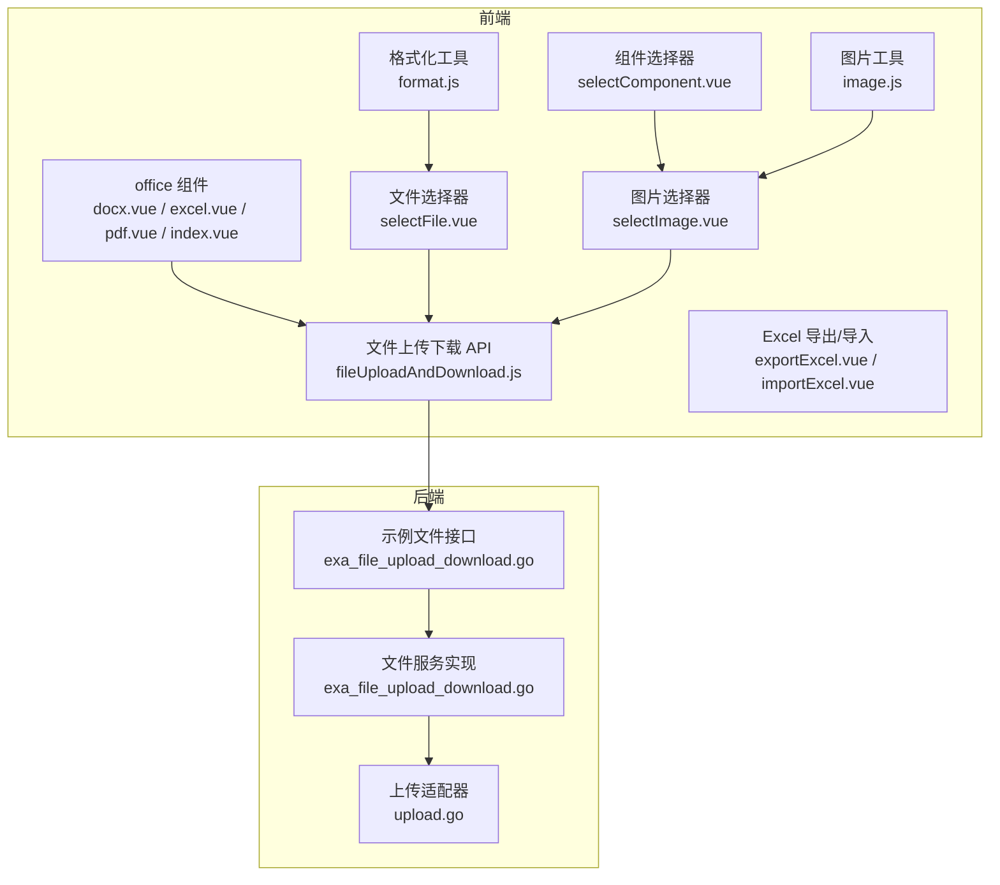
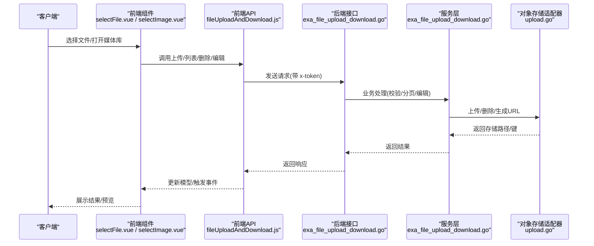
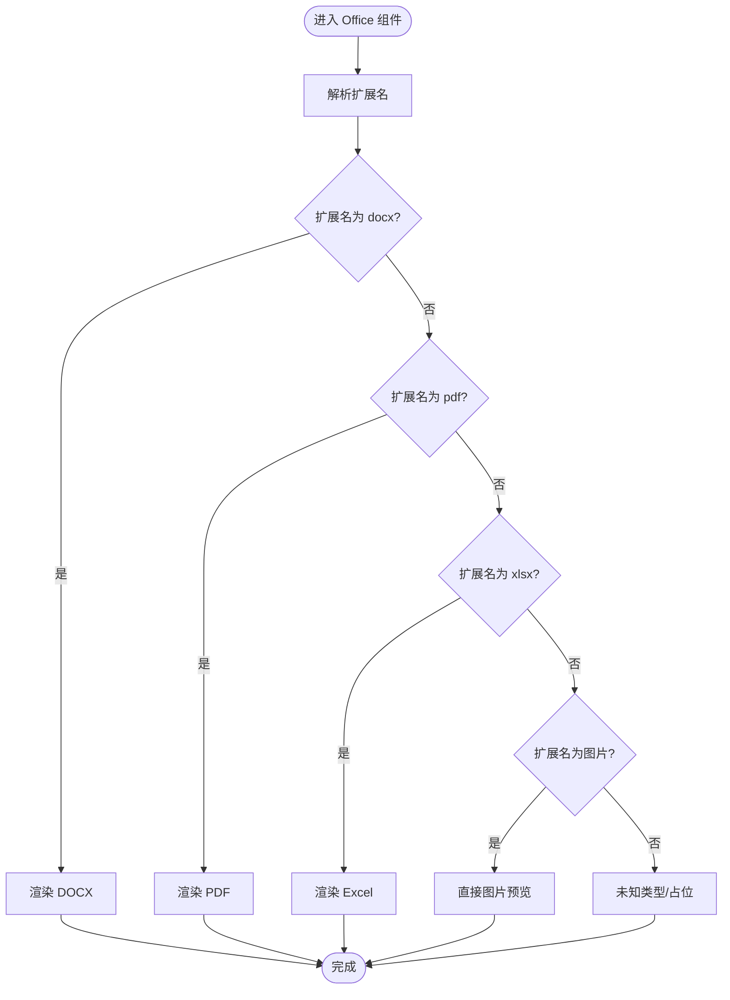
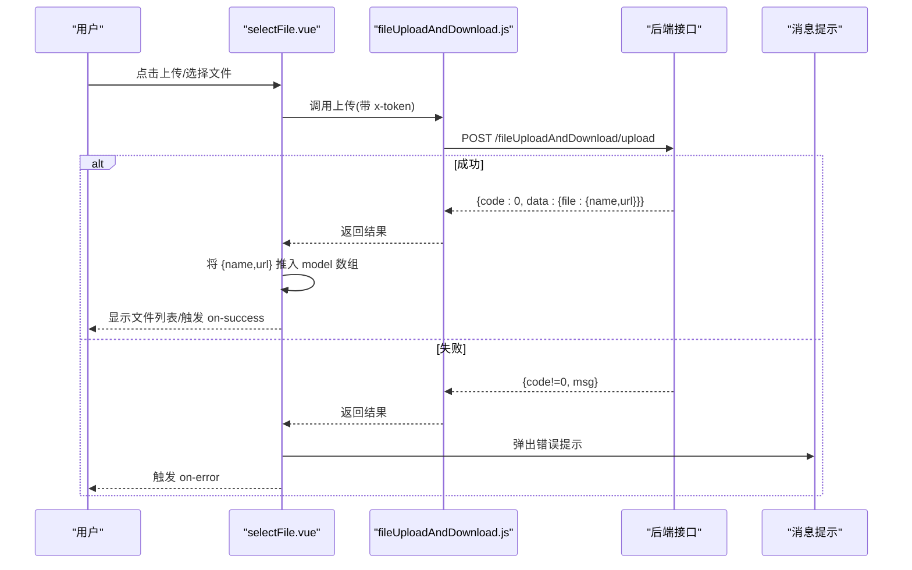
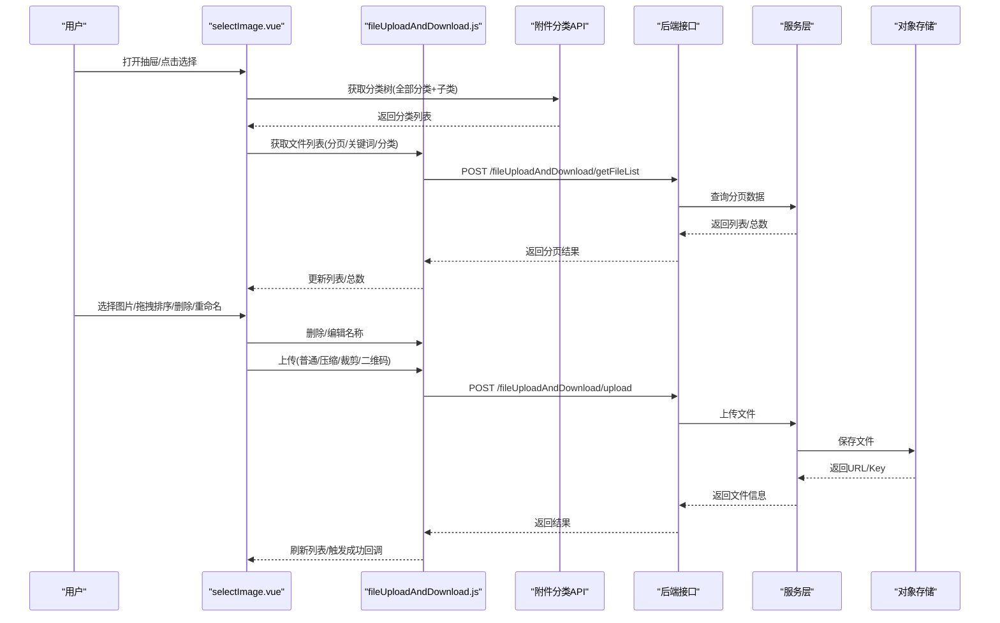
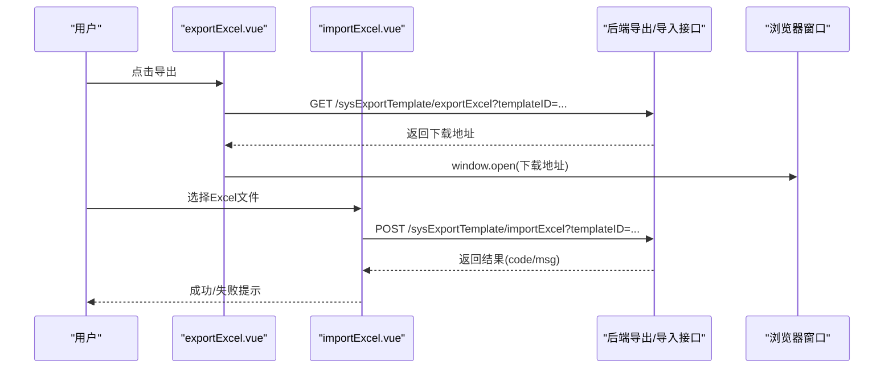
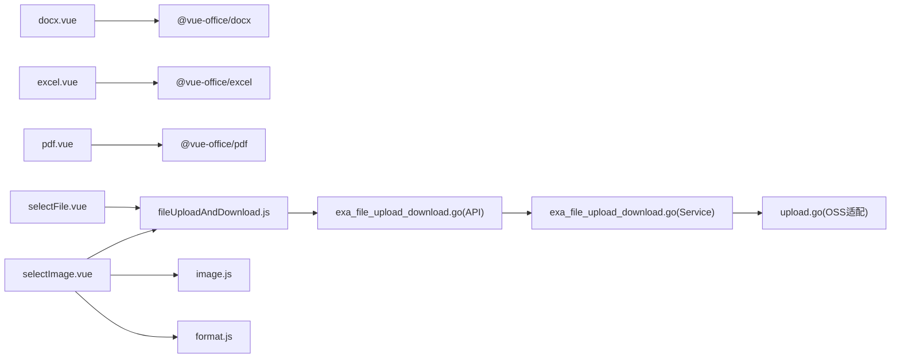

# 办公组件

<cite>
**本文引用的文件**
- [web/src/components/office/index.vue](file://web/src/components/office/index.vue)
- [web/src/components/office/docx.vue](file://web/src/components/office/docx.vue)
- [web/src/components/office/excel.vue](file://web/src/components/office/excel.vue)
- [web/src/components/office/pdf.vue](file://web/src/components/office/pdf.vue)
- [web/src/components/selectFile/selectFile.vue](file://web/src/components/selectFile/selectFile.vue)
- [web/src/components/selectImage/selectImage.vue](file://web/src/components/selectImage/selectImage.vue)
- [web/src/components/selectImage/selectComponent.vue](file://web/src/components/selectImage/selectComponent.vue)
- [web/src/api/fileUploadAndDownload.js](file://web/src/api/fileUploadAndDownload.js)
- [web/src/utils/image.js](file://web/src/utils/image.js)
- [web/src/utils/format.js](file://web/src/utils/format.js)
- [web/src/components/exportExcel/exportExcel.vue](file://web/src/components/exportExcel/exportExcel.vue)
- [web/src/components/exportExcel/importExcel.vue](file://web/src/components/exportExcel/importExcel.vue)
- [server/api/v1/example/exa_file_upload_download.go](file://server/api/v1/example/exa_file_upload_download.go)
- [server/service/example/exa_file_upload_download.go](file://server/service/example/exa_file_upload_download.go)
- [server/utils/upload/upload.go](file://server/utils/upload/upload.go)
</cite>

## 目录
1. [简介](#简介)
2. [项目结构](#项目结构)
3. [核心组件](#核心组件)
4. [架构总览](#架构总览)
5. [详细组件分析](#详细组件分析)
6. [依赖分析](#依赖分析)
7. [性能考量](#性能考量)
8. [故障排查指南](#故障排查指南)
9. [结论](#结论)
10. [附录](#附录)

## 简介
本技术文档聚焦于办公组件体系，涵盖以下能力：
- 办公文档处理：DOCX 文档组件、Excel 电子表格组件、PDF 文档组件，支持在线渲染与错误处理。
- 文件选择组件：通用文件选择器、图片选择器（含媒体库、分类树、拖拽排序、裁剪与二维码导入）、组件选择器（单图/多图）。
- 后端文件存储集成：上传、预览、下载、删除、分页列表、URL 导入等。
- 使用示例、错误处理机制、性能优化策略、扩展开发指南与自定义配置方法。

## 项目结构
前端办公组件位于 web/src/components 下，按功能划分为 office 与 selectImage 两大模块；文件上传与下载 API 在 web/src/api 下；后端接口与服务在 server 目录中。

图表来源
- [web/src/components/office/index.vue:1-50](file://web/src/components/office/index.vue#L1-L50)
- [web/src/components/selectFile/selectFile.vue:1-88](file://web/src/components/selectFile/selectFile.vue#L1-L88)
- [web/src/components/selectImage/selectImage.vue:1-504](file://web/src/components/selectImage/selectImage.vue#L1-L504)
- [web/src/components/selectImage/selectComponent.vue:1-87](file://web/src/components/selectImage/selectComponent.vue#L1-L87)
- [web/src/api/fileUploadAndDownload.js:1-67](file://web/src/api/fileUploadAndDownload.js#L1-L67)
- [web/src/utils/image.js:1-127](file://web/src/utils/image.js#L1-L127)
- [web/src/utils/format.js:1-176](file://web/src/utils/format.js#L1-L176)
- [server/api/v1/example/exa_file_upload_download.go:1-136](file://server/api/v1/example/exa_file_upload_download.go#L1-L136)
- [server/service/example/exa_file_upload_download.go:1-131](file://server/service/example/exa_file_upload_download.go#L1-L131)
- [server/utils/upload/upload.go:1-47](file://server/utils/upload/upload.go#L1-L47)

章节来源
- [web/src/components/office/index.vue:1-50](file://web/src/components/office/index.vue#L1-L50)
- [web/src/components/selectFile/selectFile.vue:1-88](file://web/src/components/selectFile/selectFile.vue#L1-L88)
- [web/src/components/selectImage/selectImage.vue:1-504](file://web/src/components/selectImage/selectImage.vue#L1-L504)
- [web/src/components/selectImage/selectComponent.vue:1-87](file://web/src/components/selectImage/selectComponent.vue#L1-L87)
- [web/src/api/fileUploadAndDownload.js:1-67](file://web/src/api/fileUploadAndDownload.js#L1-L67)
- [web/src/utils/image.js:1-127](file://web/src/utils/image.js#L1-L127)
- [web/src/utils/format.js:1-176](file://web/src/utils/format.js#L1-L176)
- [server/api/v1/example/exa_file_upload_download.go:1-136](file://server/api/v1/example/exa_file_upload_download.go#L1-L136)
- [server/service/example/exa_file_upload_download.go:1-131](file://server/service/example/exa_file_upload_download.go#L1-L131)
- [server/utils/upload/upload.go:1-47](file://server/utils/upload/upload.go#L1-L47)

## 核心组件
- 办公文档组件（docx/excel/pdf）：基于第三方渲染库，通过 v-model 接收文件 URL，自动根据扩展名切换渲染器。
- 文件选择器（selectFile）：封装 Element Plus Upload，支持限制数量、接受类型、带 Token 请求头、统一错误提示与事件回调。
- 图片选择器（selectImage）：提供媒体库、分类树、搜索、分页、批量选择、拖拽排序、删除、重命名、上传/裁剪/二维码导入等。
- 组件选择器（selectComponent）：单图/多图占位与预览、视频封面、删除按钮、预览列表。
- Excel 导出/导入：导出模板参数拼装与下载，导入模板 ID 绑定与成功回调。
- 后端文件接口：上传、删除、编辑名称、分页列表、URL 导入；服务层对接多种对象存储。

章节来源
- [web/src/components/office/docx.vue:1-32](file://web/src/components/office/docx.vue#L1-L32)
- [web/src/components/office/excel.vue:1-37](file://web/src/components/office/excel.vue#L1-L37)
- [web/src/components/office/pdf.vue:1-40](file://web/src/components/office/pdf.vue#L1-L40)
- [web/src/components/selectFile/selectFile.vue:1-88](file://web/src/components/selectFile/selectFile.vue#L1-L88)
- [web/src/components/selectImage/selectImage.vue:1-504](file://web/src/components/selectImage/selectImage.vue#L1-L504)
- [web/src/components/selectImage/selectComponent.vue:1-87](file://web/src/components/selectImage/selectComponent.vue#L1-L87)
- [web/src/components/exportExcel/exportExcel.vue:1-85](file://web/src/components/exportExcel/exportExcel.vue#L1-L85)
- [web/src/components/exportExcel/importExcel.vue:1-46](file://web/src/components/exportExcel/importExcel.vue#L1-L46)
- [server/api/v1/example/exa_file_upload_download.go:1-136](file://server/api/v1/example/exa_file_upload_download.go#L1-L136)
- [server/service/example/exa_file_upload_download.go:1-131](file://server/service/example/exa_file_upload_download.go#L1-L131)

## 架构总览
前端通过 API 层调用后端接口，后端服务层对接对象存储适配器，实现多云存储可插拔。

图表来源
- [web/src/components/selectFile/selectFile.vue:1-88](file://web/src/components/selectFile/selectFile.vue#L1-L88)
- [web/src/components/selectImage/selectImage.vue:1-504](file://web/src/components/selectImage/selectImage.vue#L1-L504)
- [web/src/api/fileUploadAndDownload.js:1-67](file://web/src/api/fileUploadAndDownload.js#L1-L67)
- [server/api/v1/example/exa_file_upload_download.go:1-136](file://server/api/v1/example/exa_file_upload_download.go#L1-L136)
- [server/service/example/exa_file_upload_download.go:1-131](file://server/service/example/exa_file_upload_download.go#L1-L131)
- [server/utils/upload/upload.go:1-47](file://server/utils/upload/upload.go#L1-L47)

## 详细组件分析

### 办公文档组件
- DOCX 组件：使用 @vue-office/docx 渲染，监听渲染完成事件，支持动态变更源地址。
- Excel 组件：使用 @vue-office/excel 渲染，提供渲染完成与错误回调。
- PDF 组件：使用 @vue-office/pdf 渲染，提供渲染完成与错误回调。
- 办公组件聚合器：根据文件扩展名自动切换渲染器，支持图片类型直显。

图表来源
- [web/src/components/office/index.vue:1-50](file://web/src/components/office/index.vue#L1-L50)
- [web/src/components/office/docx.vue:1-32](file://web/src/components/office/docx.vue#L1-L32)
- [web/src/components/office/excel.vue:1-37](file://web/src/components/office/excel.vue#L1-L37)
- [web/src/components/office/pdf.vue:1-40](file://web/src/components/office/pdf.vue#L1-L40)

章节来源
- [web/src/components/office/index.vue:1-50](file://web/src/components/office/index.vue#L1-L50)
- [web/src/components/office/docx.vue:1-32](file://web/src/components/office/docx.vue#L1-L32)
- [web/src/components/office/excel.vue:1-37](file://web/src/components/office/excel.vue#L1-L37)
- [web/src/components/office/pdf.vue:1-40](file://web/src/components/office/pdf.vue#L1-L40)

### 文件选择器（selectFile）
- 功能要点：多文件上传、限制数量、接受类型、显示文件列表、统一错误提示、成功回调、移除同步双向绑定。
- 关键行为：上传成功将文件名与 URL 追加到 v-model 数组；上传错误弹出提示并发出 on-error 事件；移除时同步更新模型。

图表来源
- [web/src/components/selectFile/selectFile.vue:1-88](file://web/src/components/selectFile/selectFile.vue#L1-L88)
- [web/src/api/fileUploadAndDownload.js:1-67](file://web/src/api/fileUploadAndDownload.js#L1-L67)

章节来源
- [web/src/components/selectFile/selectFile.vue:1-88](file://web/src/components/selectFile/selectFile.vue#L1-L88)
- [web/src/api/fileUploadAndDownload.js:1-67](file://web/src/api/fileUploadAndDownload.js#L1-L67)

### 图片选择器（selectImage）与组件选择器（selectComponent）
- 图片选择器（selectImage）：
  - 媒体库：树形分类、关键词搜索、分页展示、批量选择、拖拽排序、删除确认、重命名。
  - 上传能力：支持普通上传、图片压缩上传、截图裁剪、二维码导入。
  - 事件联动：上传成功后刷新列表，支持多选后一次性写回父模型。
- 组件选择器（selectComponent）：
  - 单图/多图占位，支持圆形裁切、视频首帧预览、删除按钮、预览列表。

图表来源
- [web/src/components/selectImage/selectImage.vue:1-504](file://web/src/components/selectImage/selectImage.vue#L1-L504)
- [web/src/components/selectImage/selectComponent.vue:1-87](file://web/src/components/selectImage/selectComponent.vue#L1-L87)
- [web/src/api/fileUploadAndDownload.js:1-67](file://web/src/api/fileUploadAndDownload.js#L1-L67)
- [server/api/v1/example/exa_file_upload_download.go:1-136](file://server/api/v1/example/exa_file_upload_download.go#L1-L136)
- [server/service/example/exa_file_upload_download.go:1-131](file://server/service/example/exa_file_upload_download.go#L1-L131)
- [server/utils/upload/upload.go:1-47](file://server/utils/upload/upload.go#L1-L47)

章节来源
- [web/src/components/selectImage/selectImage.vue:1-504](file://web/src/components/selectImage/selectImage.vue#L1-L504)
- [web/src/components/selectImage/selectComponent.vue:1-87](file://web/src/components/selectImage/selectComponent.vue#L1-L87)
- [web/src/api/fileUploadAndDownload.js:1-67](file://web/src/api/fileUploadAndDownload.js#L1-L67)
- [server/api/v1/example/exa_file_upload_download.go:1-136](file://server/api/v1/example/exa_file_upload_download.go#L1-L136)
- [server/service/example/exa_file_upload_download.go:1-131](file://server/service/example/exa_file_upload_download.go#L1-L131)
- [server/utils/upload/upload.go:1-47](file://server/utils/upload/upload.go#L1-L47)

### Excel 导出/导入组件
- 导出组件：根据模板 ID 与查询条件拼装参数，调用后端导出接口，成功后打开新窗口下载。
- 导入组件：绑定模板 ID，上传后端导入接口，成功/失败分别提示并触发回调。

图表来源
- [web/src/components/exportExcel/exportExcel.vue:1-85](file://web/src/components/exportExcel/exportExcel.vue#L1-L85)
- [web/src/components/exportExcel/importExcel.vue:1-46](file://web/src/components/exportExcel/importExcel.vue#L1-L46)

章节来源
- [web/src/components/exportExcel/exportExcel.vue:1-85](file://web/src/components/exportExcel/exportExcel.vue#L1-L85)
- [web/src/components/exportExcel/importExcel.vue:1-46](file://web/src/components/exportExcel/importExcel.vue#L1-L46)

## 依赖分析
- 前端组件依赖：
  - Element Plus Upload/Tree/Drawer/Pagination 等 UI 组件。
  - 第三方办公文档渲染库 @vue-office/docx/@vue-office/excel/@vue-office/pdf。
  - 图片工具与格式化工具提供 URL 解析、视频检测、分页与基础格式化。
- 后端依赖：
  - 对象存储接口抽象，支持本地、七牛、腾讯 COS、阿里云 OSS、华为 OBS、AWS S3、Cloudflare R2、MinIO 等。
  - 文件服务层负责上传、删除、分页查询、编辑名称、URL 导入等。

图表来源
- [web/src/components/office/docx.vue:1-32](file://web/src/components/office/docx.vue#L1-L32)
- [web/src/components/office/excel.vue:1-37](file://web/src/components/office/excel.vue#L1-L37)
- [web/src/components/office/pdf.vue:1-40](file://web/src/components/office/pdf.vue#L1-L40)
- [web/src/components/selectFile/selectFile.vue:1-88](file://web/src/components/selectFile/selectFile.vue#L1-L88)
- [web/src/components/selectImage/selectImage.vue:1-504](file://web/src/components/selectImage/selectImage.vue#L1-L504)
- [web/src/api/fileUploadAndDownload.js:1-67](file://web/src/api/fileUploadAndDownload.js#L1-L67)
- [web/src/utils/image.js:1-127](file://web/src/utils/image.js#L1-L127)
- [web/src/utils/format.js:1-176](file://web/src/utils/format.js#L1-L176)
- [server/api/v1/example/exa_file_upload_download.go:1-136](file://server/api/v1/example/exa_file_upload_download.go#L1-L136)
- [server/service/example/exa_file_upload_download.go:1-131](file://server/service/example/exa_file_upload_download.go#L1-L131)
- [server/utils/upload/upload.go:1-47](file://server/utils/upload/upload.go#L1-L47)

章节来源
- [web/src/components/office/docx.vue:1-32](file://web/src/components/office/docx.vue#L1-L32)
- [web/src/components/office/excel.vue:1-37](file://web/src/components/office/excel.vue#L1-L37)
- [web/src/components/office/pdf.vue:1-40](file://web/src/components/office/pdf.vue#L1-L40)
- [web/src/components/selectFile/selectFile.vue:1-88](file://web/src/components/selectFile/selectFile.vue#L1-L88)
- [web/src/components/selectImage/selectImage.vue:1-504](file://web/src/components/selectImage/selectImage.vue#L1-L504)
- [web/src/api/fileUploadAndDownload.js:1-67](file://web/src/api/fileUploadAndDownload.js#L1-L67)
- [web/src/utils/image.js:1-127](file://web/src/utils/image.js#L1-L127)
- [web/src/utils/format.js:1-176](file://web/src/utils/format.js#L1-L176)
- [server/api/v1/example/exa_file_upload_download.go:1-136](file://server/api/v1/example/exa_file_upload_download.go#L1-L136)
- [server/service/example/exa_file_upload_download.go:1-131](file://server/service/example/exa_file_upload_download.go#L1-L131)
- [server/utils/upload/upload.go:1-47](file://server/utils/upload/upload.go#L1-L47)

## 性能考量
- 图片上传压缩：在前端对图片进行等比缩放与 DataURL 转 Blob，降低体积后再上传，减少带宽与存储压力。
- 懒加载与骨架：图片预览采用懒加载与错误占位，视频首帧预览避免大体积资源加载。
- 分页与搜索：媒体库分页与关键词搜索，避免一次性加载过多数据。
- 渲染库按需引入：仅在对应扩展名时加载对应渲染器，减少初始包体。
- 上传并发控制：通过限制数量与统一错误提示，避免频繁重试导致的资源浪费。

章节来源
- [web/src/utils/image.js:1-127](file://web/src/utils/image.js#L1-L127)
- [web/src/components/selectImage/selectImage.vue:1-504](file://web/src/components/selectImage/selectImage.vue#L1-L504)
- [web/src/components/office/index.vue:1-50](file://web/src/components/office/index.vue#L1-L50)

## 故障排查指南
- 上传失败
  - 现象：弹出“上传失败”提示，on-error 事件触发。
  - 排查：检查 x-token 是否正确、后端接口返回码、网络连通性、对象存储配置。
- 删除失败
  - 现象：删除接口返回失败。
  - 排查：确认文件 Key 是否存在、对象存储权限、服务层删除流程。
- 预览异常
  - 现象：DOCX/PDF/Excel 无法渲染或报错。
  - 排查：确认文件 URL 可访问、渲染库版本兼容、noSave 参数影响（后端上传逻辑）。
- 媒体库为空
  - 现象：分类树或列表为空。
  - 排查：确认分类接口返回、分页参数、关键词过滤条件。

章节来源
- [web/src/components/selectFile/selectFile.vue:79-86](file://web/src/components/selectFile/selectFile.vue#L79-L86)
- [web/src/api/fileUploadAndDownload.js:1-67](file://web/src/api/fileUploadAndDownload.js#L1-L67)
- [server/service/example/exa_file_upload_download.go:43-55](file://server/service/example/exa_file_upload_download.go#L43-L55)
- [server/api/v1/example/exa_file_upload_download.go:61-82](file://server/api/v1/example/exa_file_upload_download.go#L61-L82)

## 结论
本办公组件体系以清晰的职责划分与可插拔的对象存储适配为核心，覆盖了从文件上传、媒体库管理到文档在线预览的完整链路。通过统一的 API 与事件机制，前端组件具备良好的扩展性与可维护性；后端服务层抽象出多云存储能力，便于横向扩展与迁移。

## 附录

### 使用示例与最佳实践
- DOCX/Excel/PDF 预览
  - 将文件 URL 传入 Office 组件，组件会根据扩展名自动切换渲染器。
  - 注意：确保 URL 可访问且与 VITE_FILE_API 配置一致。
- 文件上传
  - 使用 selectFile 组件，设置 accept 与 limit，绑定 v-model 接收 {name,url} 列表。
  - 上传成功后，将文件信息写入表单模型，后续可提交至后端。
- 图片选择
  - 使用 selectImage 组件，开启 multiple 可实现多图拖拽排序与批量选择。
  - 支持分类筛选、关键词搜索、删除与重命名，提升素材管理效率。
- Excel 导出/导入
  - 导出：传入模板 ID 与查询条件，点击导出后自动打开下载窗口。
  - 导入：选择模板 ID，上传后端导入接口，成功后触发回调。

章节来源
- [web/src/components/office/index.vue:1-50](file://web/src/components/office/index.vue#L1-L50)
- [web/src/components/selectFile/selectFile.vue:1-88](file://web/src/components/selectFile/selectFile.vue#L1-L88)
- [web/src/components/selectImage/selectImage.vue:1-504](file://web/src/components/selectImage/selectImage.vue#L1-L504)
- [web/src/components/exportExcel/exportExcel.vue:1-85](file://web/src/components/exportExcel/exportExcel.vue#L1-L85)
- [web/src/components/exportExcel/importExcel.vue:1-46](file://web/src/components/exportExcel/importExcel.vue#L1-L46)

### 错误处理机制
- 统一错误提示：上传失败、删除失败、编辑失败均弹出提示并触发相应事件。
- 渲染错误回调：DOCX/Excel/PDF 渲染器提供 error 回调，便于定位问题。
- 服务层兜底：删除与上传失败时返回明确错误信息，便于前端提示与日志追踪。

章节来源
- [web/src/components/selectFile/selectFile.vue:79-86](file://web/src/components/selectFile/selectFile.vue#L79-L86)
- [web/src/components/office/excel.vue:34-34](file://web/src/components/office/excel.vue#L34-L34)
- [web/src/components/office/pdf.vue:36-38](file://web/src/components/office/pdf.vue#L36-L38)
- [server/service/example/exa_file_upload_download.go:43-55](file://server/service/example/exa_file_upload_download.go#L43-L55)

### 性能优化策略
- 前端
  - 图片压缩与缩放，降低上传体积。
  - 懒加载与骨架屏，改善首屏体验。
  - 分页与搜索，避免大数据量一次性加载。
- 后端
  - 对象存储直传/直链，减少中间层带宽占用。
  - 合理缓存与索引，优化分页查询性能。

章节来源
- [web/src/utils/image.js:1-127](file://web/src/utils/image.js#L1-L127)
- [web/src/components/selectImage/selectImage.vue:1-504](file://web/src/components/selectImage/selectImage.vue#L1-L504)
- [server/utils/upload/upload.go:1-47](file://server/utils/upload/upload.go#L1-L47)

### 扩展开发指南与自定义配置
- 新增文档类型
  - 在 Office 组件中新增分支与对应渲染器，保持 v-model 与 URL 传递一致。
  - 提供渲染完成与错误回调，保证一致性。
- 自定义上传策略
  - 在 selectFile 中调整 headers、accept、limit，满足不同场景。
  - 若需直传对象存储，可在后端增加直传签名接口并与前端联调。
- 媒体库扩展
  - 在 selectImage 中扩展分类、搜索、排序逻辑，结合后端接口实现更丰富的筛选。
- 对象存储适配
  - 在服务层新增 OSS 实现，通过 upload.go 的工厂方法接入。
  - 配置项参考系统 OssType 与各云厂商参数。

章节来源
- [web/src/components/office/index.vue:1-50](file://web/src/components/office/index.vue#L1-L50)
- [web/src/components/selectFile/selectFile.vue:1-88](file://web/src/components/selectFile/selectFile.vue#L1-L88)
- [web/src/components/selectImage/selectImage.vue:1-504](file://web/src/components/selectImage/selectImage.vue#L1-L504)
- [server/utils/upload/upload.go:1-47](file://server/utils/upload/upload.go#L1-L47)
- [server/service/example/exa_file_upload_download.go:96-120](file://server/service/example/exa_file_upload_download.go#L96-L120)