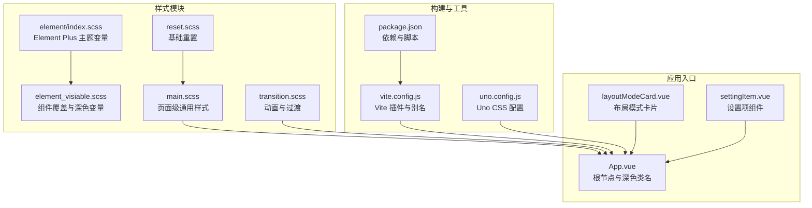
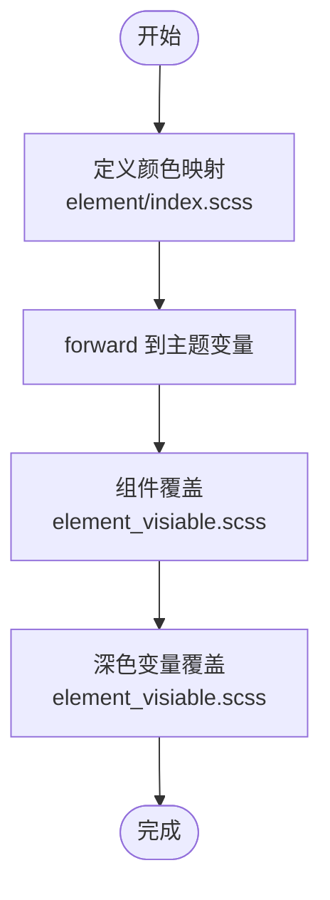
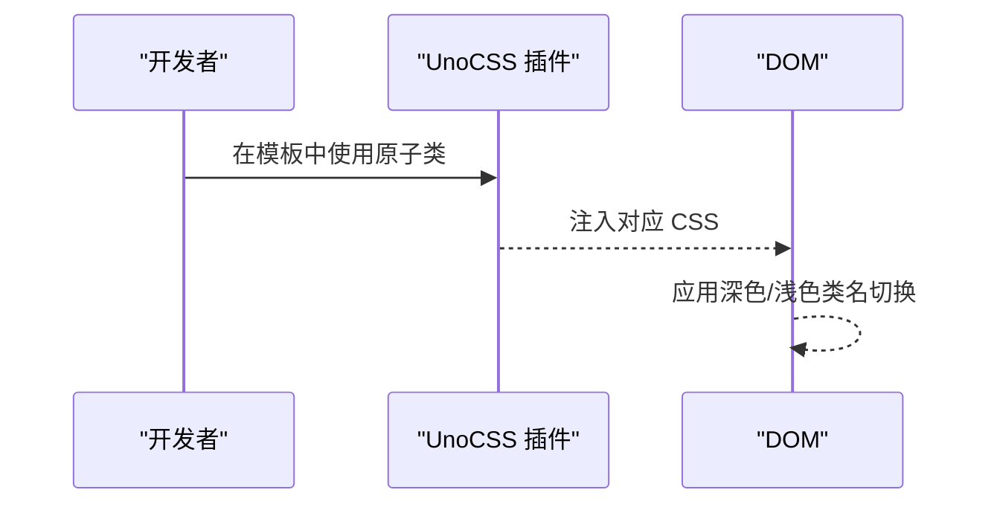
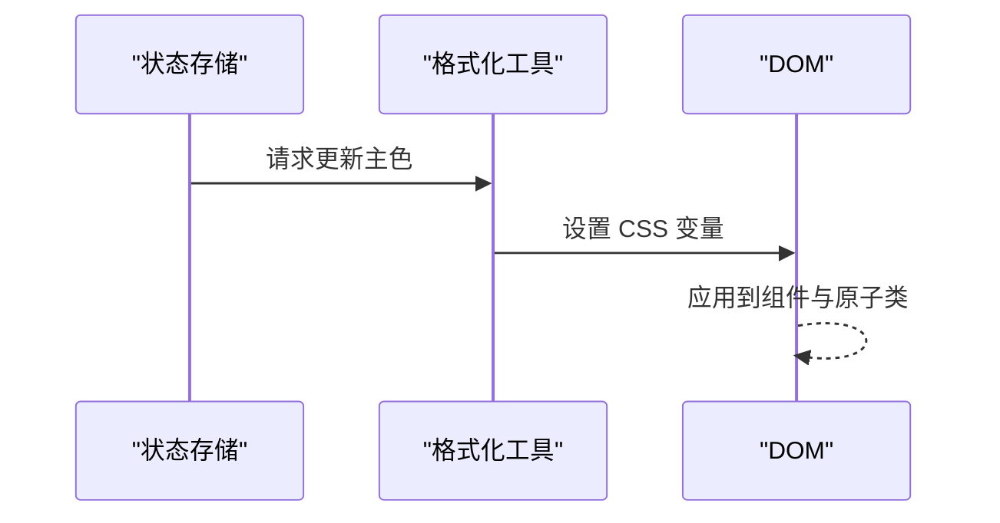
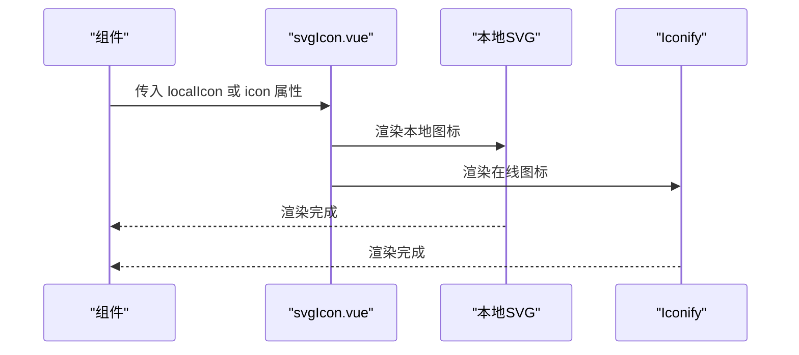
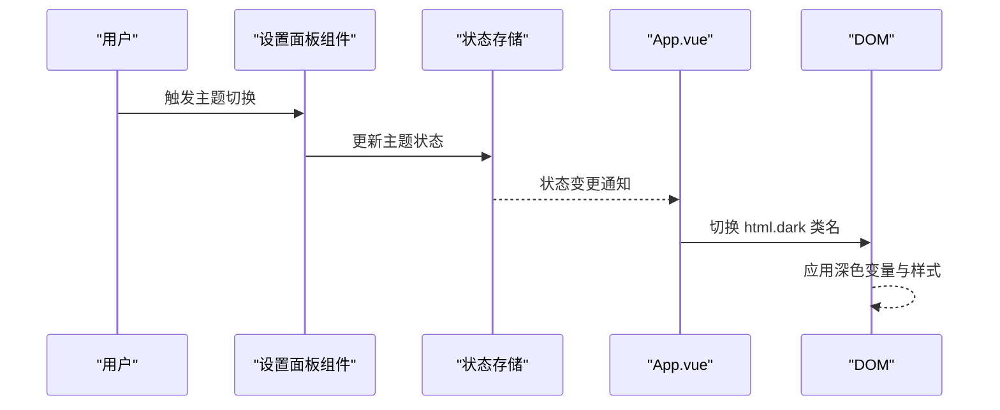
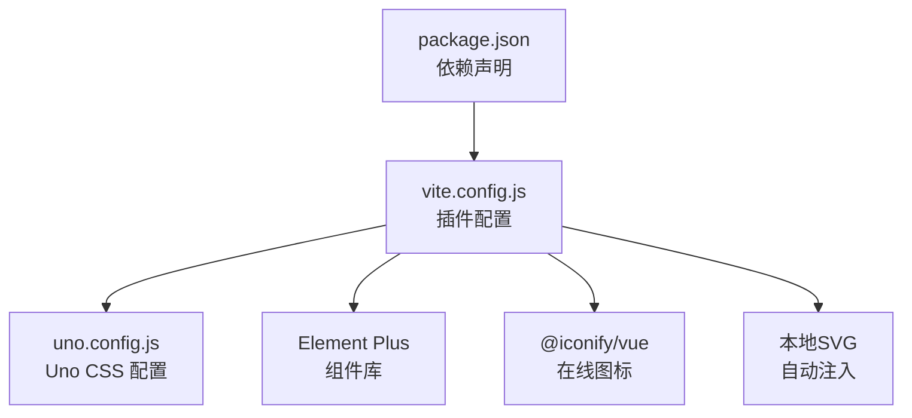

# 样式管理系统

<cite>
**本文档引用的文件**
- [web/src/style/main.scss](file://web/src/style/main.scss)
- [web/src/style/reset.scss](file://web/src/style/reset.scss)
- [web/src/style/transition.scss](file://web/src/style/transition.scss)
- [web/src/style/element_visiable.scss](file://web/src/style/element_visiable.scss)
- [web/src/style/element/index.scss](file://web/src/style/element/index.scss)
- [web/uno.config.js](file://web/uno.config.js)
- [web/vite.config.js](file://web/vite.config.js)
- [web/package.json](file://web/package.json)
- [web/src/components/svgIcon/svgIcon.vue](file://web/src/components/svgIcon/svgIcon.vue)
- [web/src/view/layout/setting/modules/appearance/index.vue](file://web/src/view/layout/setting/modules/appearance/index.vue)
- [web/src/view/layout/setting/components/themeModeSelector.vue](file://web/src/view/layout/setting/components/themeModeSelector.vue)
- [web/src/view/layout/setting/components/layoutModeCard.vue](file://web/src/view/layout/setting/components/layoutModeCard.vue)
- [web/src/utils/format.js](file://web/src/utils/format.js)
- [repowiki/zh/content/前端应用/UI主题定制.md](file://repowiki/zh/content/前端应用/UI主题定制.md)
</cite>

## 目录
1. [简介](#简介)
2. [项目结构](#项目结构)
3. [核心组件](#核心组件)
4. [架构总览](#架构总览)
5. [详细组件分析](#详细组件分析)
6. [依赖分析](#依赖分析)
7. [性能考虑](#性能考虑)
8. [故障排查指南](#故障排查指南)
9. [结论](#结论)
10. [附录](#附录)

## 简介
本项目采用“SCSS 模块化 + UnoCSS 原子化 + Element Plus 主题变量”的样式架构，结合深色主题类名驱动与组件级覆盖，形成高可维护、可扩展的主题定制体系。样式组织遵循“全局重置 → 主题变量 → 组件覆盖 → 页面级通用 → 动画过渡”的分层原则，并通过 Vite 插件链路集成 UnoCSS、SVG 图标自动注入与现代编译器，确保开发效率与运行性能。

## 项目结构
样式系统由以下模块构成：
- 全局重置与基础样式：reset.scss
- Element Plus 主题变量与颜色映射：element/index.scss
- 组件覆盖与深色变量：element_visiable.scss
- 页面级通用样式：main.scss（容器、表格、按钮等）
- 动画与过渡：transition.scss
- Uno CSS 配置：uno.config.js
- 构建与插件：vite.config.js、package.json
- 应用根节点与深色类名挂载：App.vue
- 设置面板与主题切换交互：layoutModeCard.vue、settingItem.vue



**图表来源**
- [web/src/style/reset.scss:1-382](file://web/src/style/reset.scss#L1-L382)
- [web/src/style/main.scss:1-60](file://web/src/style/main.scss#L1-L60)
- [web/src/style/transition.scss:1-69](file://web/src/style/transition.scss#L1-L69)
- [web/src/style/element_visiable.scss:1-139](file://web/src/style/element_visiable.scss#L1-L139)
- [web/src/style/element/index.scss:1-24](file://web/src/style/element/index.scss#L1-L24)
- [web/vite.config.js:1-119](file://web/vite.config.js#L1-L119)
- [web/uno.config.js:1-27](file://web/uno.config.js#L1-L27)
- [web/package.json:1-88](file://web/package.json#L1-L88)

**章节来源**
- [repowiki/zh/content/前端应用/UI主题定制.md:41-241](file://repowiki/zh/content/前端应用/UI主题定制.md#L41-L241)

## 核心组件
- SCSS 变量系统与主题定制
  - 通过 @forward 将 Element Plus 内置颜色映射重定向至自定义主色与语义色，集中定义品牌色彩。
  - 在 element_visiable.scss 中对分页、表格、菜单、抽屉等组件进行尺寸、边框、深色变量覆盖，确保视觉一致。
- UnoCSS 原子化样式
  - 配置主题变量（背景、文本、阴影、边框），并启用指令转换器以支持在模板中使用原子类。
  - 通过 dark: 'class' 与 html.dark 类名联动，实现深色模式下的原子类切换。
- 元素级样式覆盖与定制
  - main.scss 定义页面级通用容器、表格、按钮列表等样式，统一交互与视觉规范。
  - transition.scss 提供淡入淡出、缩放、滑动等动画与过渡效果。
- 图标系统
  - svgIcon.vue 支持本地图标（symbol id）与在线图标（Iconify），通过自动注入与图标库实现图标复用。
- 主题切换与设置面板
  - App.vue 在根节点挂载 dark 类名，配合 UnoCSS 与组件覆盖实现深色切换。
  - 设置面板组件提供主题模式、主色、全局尺寸等交互，驱动状态变更与样式更新。

**章节来源**
- [web/src/style/element/index.scss:1-24](file://web/src/style/element/index.scss#L1-L24)
- [web/src/style/element_visiable.scss:1-139](file://web/src/style/element_visiable.scss#L1-L139)
- [web/src/style/main.scss:1-60](file://web/src/style/main.scss#L1-L60)
- [web/src/style/transition.scss:1-69](file://web/src/style/transition.scss#L1-L69)
- [web/uno.config.js:1-27](file://web/uno.config.js#L1-L27)
- [web/src/components/svgIcon/svgIcon.vue:1-45](file://web/src/components/svgIcon/svgIcon.vue#L1-L45)
- [web/src/view/layout/setting/modules/appearance/index.vue:1-40](file://web/src/view/layout/setting/modules/appearance/index.vue#L1-L40)
- [web/src/view/layout/setting/components/themeModeSelector.vue:1-70](file://web/src/view/layout/setting/components/themeModeSelector.vue#L1-L70)
- [web/src/view/layout/setting/components/layoutModeCard.vue:78-128](file://web/src/view/layout/setting/components/layoutModeCard.vue#L78-L128)

## 架构总览
样式系统通过 Vite 插件链路集成 UnoCSS、SVG 图标自动注入与现代编译器，构建期生成原子类与主题变量，运行时通过类名与 CSS 变量驱动主题切换与组件覆盖。

```mermaid
graph TB
subgraph "构建阶段"
VITE["vite.config.js<br/>插件与别名"]
UNO["uno.config.js<br/>主题与预设"]
PKG["package.json<br/>依赖声明"]
end
subgraph "运行阶段"
ROOT["App.vue<br/>html.dark 类名"]
EVAR["element/index.scss<br/>主题变量"]
ECOV["element_visiable.scss<br/>组件覆盖"]
MAIN["main.scss<br/>页面级样式"]
TRANS["transition.scss<br/>动画过渡"]
SVG["svgIcon.vue<br/>图标组件"]
END
VITE --> UNO
PKG --> VITE
ROOT --> ECOV
ROOT --> MAIN
ROOT --> TRANS
EVAR --> ECOV
ECOV --> ROOT
MAIN --> ROOT
TRANS --> ROOT
SVG --> ROOT
```

**图表来源**
- [web/vite.config.js:1-119](file://web/vite.config.js#L1-L119)
- [web/uno.config.js:1-27](file://web/uno.config.js#L1-L27)
- [web/package.json:1-88](file://web/package.json#L1-L88)
- [web/src/App.vue:1-47](file://web/src/App.vue#L1-L47)
- [web/src/style/element/index.scss:1-24](file://web/src/style/element/index.scss#L1-L24)
- [web/src/style/element_visiable.scss:1-139](file://web/src/style/element_visiable.scss#L1-L139)
- [web/src/style/main.scss:1-60](file://web/src/style/main.scss#L1-L60)
- [web/src/style/transition.scss:1-69](file://web/src/style/transition.scss#L1-L69)
- [web/src/components/svgIcon/svgIcon.vue:1-45](file://web/src/components/svgIcon/svgIcon.vue#L1-L45)

## 详细组件分析

### SCSS 变量系统与主题定制
- 颜色映射与 @forward
  - 使用 @forward 将 Element Plus 内置颜色映射重定向，集中定义主色与语义色，便于统一品牌风格。
- 组件覆盖与深色变量
  - 在 element_visiable.scss 中对分页、表格、菜单、抽屉等组件进行尺寸、边框、深色变量覆盖，确保视觉一致。
  - 在深色模式下覆盖 Element Plus 内部背景与填充变量，保证暗色环境下可读性与层次感。



**图表来源**
- [web/src/style/element/index.scss:1-24](file://web/src/style/element/index.scss#L1-L24)
- [web/src/style/element_visiable.scss:1-139](file://web/src/style/element_visiable.scss#L1-L139)

**章节来源**
- [web/src/style/element/index.scss:1-24](file://web/src/style/element/index.scss#L1-L24)
- [web/src/style/element_visiable.scss:1-139](file://web/src/style/element_visiable.scss#L1-L139)

### UnoCSS 工具类与配置
- 主题变量与预设
  - 在 uno.config.js 中定义背景、文本、阴影、边框等主题变量，并启用 presetWind3 与指令转换器。
  - 通过 dark: 'class' 与 html.dark 类名联动，实现深色模式下的原子类切换。
- 使用方法与最佳实践
  - 在模板中直接使用原子类，减少重复样式与体积。
  - 优先使用 UnoCSS 提供的语义化类名，避免硬编码颜色与尺寸。
  - 通过指令转换器在模板中使用原子类，提升开发效率。



**图表来源**
- [web/uno.config.js:1-27](file://web/uno.config.js#L1-L27)
- [web/vite.config.js:113](file://web/vite.config.js#L113)

**章节来源**
- [web/uno.config.js:1-27](file://web/uno.config.js#L1-L27)
- [web/vite.config.js:113](file://web/vite.config.js#L113)

### Element Plus 样式覆盖与定制
- 组件样式的局部化
  - 通过 element_visiable.scss 对分页、表格、菜单、抽屉等组件进行局部化覆盖，避免全局重写导致的样式冲突。
- CSS 变量的使用
  - 使用 CSS 变量（如 --el-color-primary）实现主色与语义色的动态替换，结合运行时函数更新变量值。
- 深色主题一致性
  - 在 html.dark 下覆盖 Element Plus 内部变量，确保深色模式下的可读性与层次感。



**图表来源**
- [web/src/utils/format.js:130-141](file://web/src/utils/format.js#L130-L141)
- [web/src/style/element_visiable.scss:132-139](file://web/src/style/element_visiable.scss#L132-L139)

**章节来源**
- [web/src/style/element_visiable.scss:1-139](file://web/src/style/element_visiable.scss#L1-L139)
- [web/src/utils/format.js:130-141](file://web/src/utils/format.js#L130-L141)

### 图标系统组织与使用
- 组织结构
  - 通过 svgIcon.vue 组件支持本地图标（symbol id）与在线图标（Iconify），实现图标复用与统一管理。
- 引入与使用规范
  - 本地图标通过自动注入与 symbol id 使用，确保图标随项目打包。
  - 在线图标通过 Iconify 提供的图标名称使用，支持丰富的图标集。



**图表来源**
- [web/src/components/svgIcon/svgIcon.vue:1-45](file://web/src/components/svgIcon/svgIcon.vue#L1-L45)

**章节来源**
- [web/src/components/svgIcon/svgIcon.vue:1-45](file://web/src/components/svgIcon/svgIcon.vue#L1-L45)

### 主题切换与设置面板
- 运行时切换机制
  - App.vue 在根节点挂载 dark 类名，UnoCSS 的 dark: 'class' 使原子类按需切换。
  - 设置面板组件提供主题模式、主色、全局尺寸等交互，驱动状态变更与样式更新。
- 深色主题实现
  - 通过 CSS 变量与 UnoCSS 类名策略，降低深色切换成本，确保组件覆盖与深色变量一致。



**图表来源**
- [web/src/view/layout/setting/modules/appearance/index.vue:1-40](file://web/src/view/layout/setting/modules/appearance/index.vue#L1-L40)
- [web/src/view/layout/setting/components/themeModeSelector.vue:1-70](file://web/src/view/layout/setting/components/themeModeSelector.vue#L1-L70)
- [web/src/App.vue:1-47](file://web/src/App.vue#L1-L47)
- [web/uno.config.js:21](file://web/uno.config.js#L21)

**章节来源**
- [web/src/view/layout/setting/modules/appearance/index.vue:1-40](file://web/src/view/layout/setting/modules/appearance/index.vue#L1-L40)
- [web/src/view/layout/setting/components/themeModeSelector.vue:1-70](file://web/src/view/layout/setting/components/themeModeSelector.vue#L1-L70)
- [web/src/App.vue:1-47](file://web/src/App.vue#L1-L47)

## 依赖分析
- 构建工具链
  - Vite 插件链：@vitejs/plugin-legacy、@unocss/vite、vite-auto-import-svg、@vitejs/plugin-vue 等。
  - 预处理器：SCSS 现代编译器（modern-compiler）。
- 样式依赖
  - UnoCSS：原子化样式与主题变量。
  - Element Plus：组件库与主题变量。
  - 图标：@iconify/vue 与本地 SVG 自动注入。



**图表来源**
- [web/package.json:1-88](file://web/package.json#L1-L88)
- [web/vite.config.js:1-119](file://web/vite.config.js#L1-L119)
- [web/uno.config.js:1-27](file://web/uno.config.js#L1-L27)

**章节来源**
- [web/package.json:1-88](file://web/package.json#L1-L88)
- [web/vite.config.js:1-119](file://web/vite.config.js#L1-L119)

## 性能考虑
- 原子化优先：使用 UnoCSS 减少重复样式与体积，提升渲染性能。
- 按需覆盖：仅对必要组件进行样式覆盖，避免全局重写导致的样式冲突与体积膨胀。
- 现代编译：SCSS 现代编译器与 Terser 压缩，优化打包体积与运行时性能。
- 深色变量缓存：通过 CSS 变量与 UnoCSS 类名策略，降低深色切换成本。

**章节来源**
- [repowiki/zh/content/前端应用/UI主题定制.md:324-329](file://repowiki/zh/content/前端应用/UI主题定制.md#L324-L329)

## 故障排查指南
- 深色不生效
  - 检查 App.vue 是否正确挂载 html.dark；确认 uno.config.js 的 dark: 'class' 配置。
- 组件样式错乱
  - 核对 element_visiable.scss 的选择器优先级与作用域；避免与第三方样式冲突。
- 原子类无效
  - 确认 UnoCSS 插件已加载且未被禁用；检查指令转换器是否启用。
- 浏览器兼容
  - 检查 @vitejs/plugin-legacy 的目标配置；必要时增加 polyfill 或降级规则。

**章节来源**
- [repowiki/zh/content/前端应用/UI主题定制.md:330-335](file://repowiki/zh/content/前端应用/UI主题定制.md#L330-L335)

## 结论
本项目通过“SCSS 模块化 + UnoCSS 原子化 + Element Plus 主题变量”的组合，实现了高可维护性的 UI 主题定制体系。深色主题以类名驱动，与组件覆盖协同，兼顾一致性与灵活性。建议在后续迭代中持续沉淀通用样式模块与主题变量，保持跨浏览器与跨设备的一致体验。

## 附录
- 快速定位
  - 主题变量：[web/src/style/element/index.scss:1-24](file://web/src/style/element/index.scss#L1-L24)
  - 组件覆盖：[web/src/style/element_visiable.scss:1-139](file://web/src/style/element_visiable.scss#L1-L139)
  - 全局样式：[web/src/style/main.scss:1-60](file://web/src/style/main.scss#L1-L60)
  - 重置样式：[web/src/style/reset.scss:1-382](file://web/src/style/reset.scss#L1-L382)
  - 动画过渡：[web/src/style/transition.scss:1-69](file://web/src/style/transition.scss#L1-L69)
  - Uno CSS 配置：[web/uno.config.js:1-27](file://web/uno.config.js#L1-L27)
  - 构建配置：[web/vite.config.js:1-119](file://web/vite.config.js#L1-L119)
  - 依赖清单：[web/package.json:1-88](file://web/package.json#L1-L88)
  - 根节点与深色类：[web/src/App.vue:1-47](file://web/src/App.vue#L1-L47)
  - 设置面板交互：[web/src/view/layout/setting/modules/appearance/index.vue](file://web/src/view/layout/setting/modules/appearance/index.vue), [web/src/view/layout/setting/components/themeModeSelector.vue](file://web/src/view/layout/setting/components/themeModeSelector.vue), [web/src/view/layout/setting/components/layoutModeCard.vue](file://web/src/view/layout/setting/components/layoutModeCard.vue)