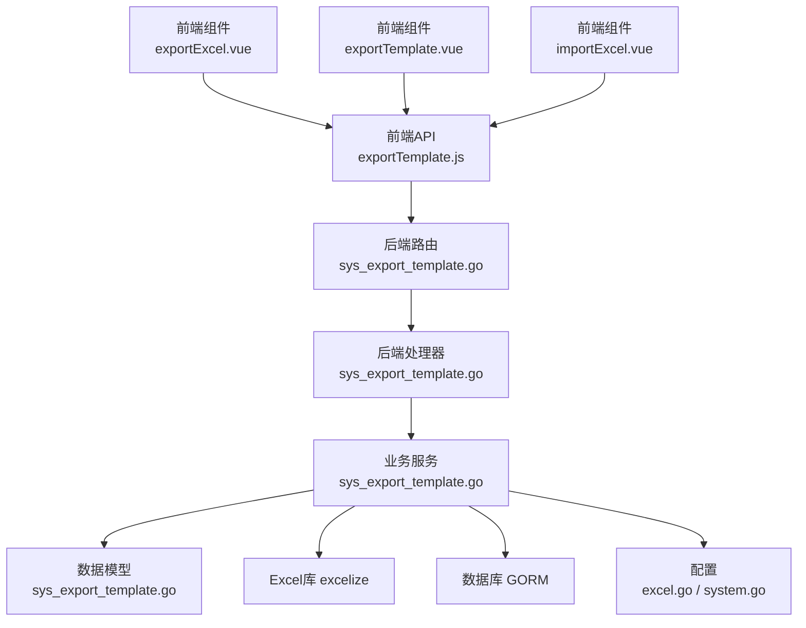
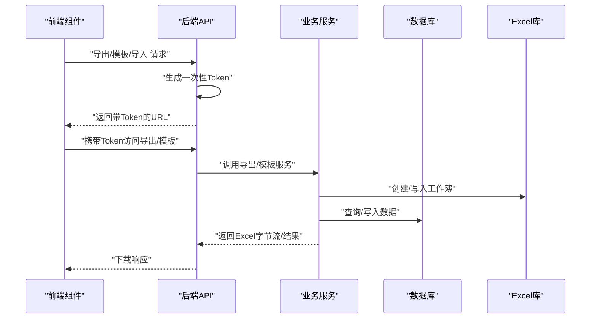
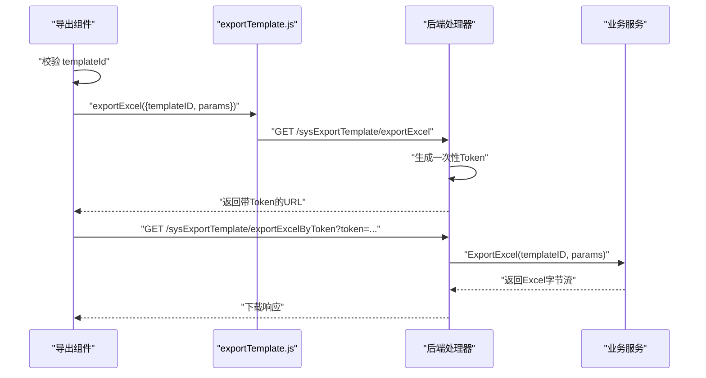
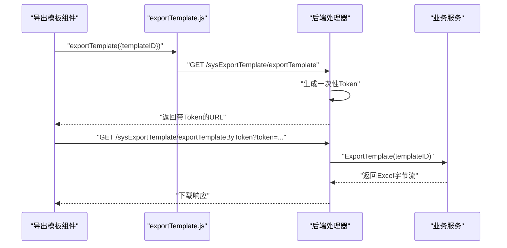
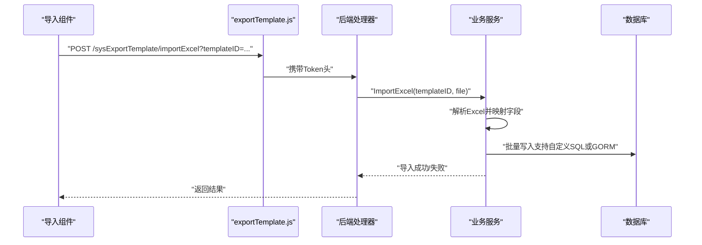
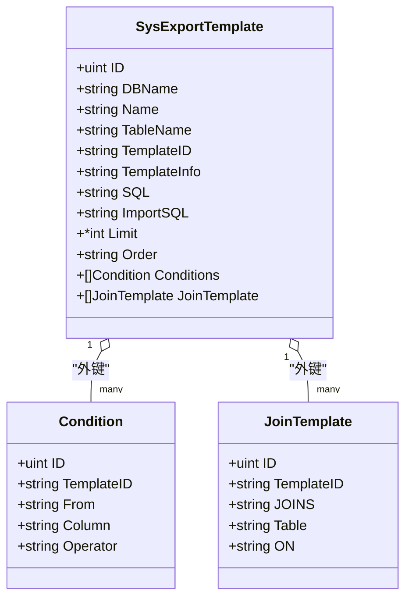
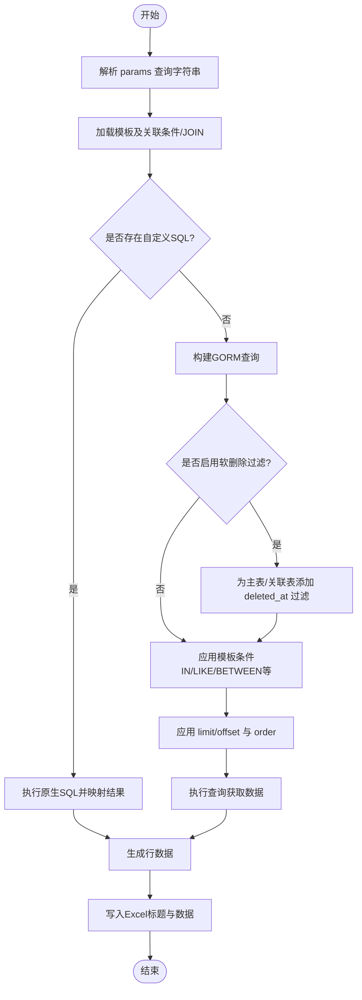
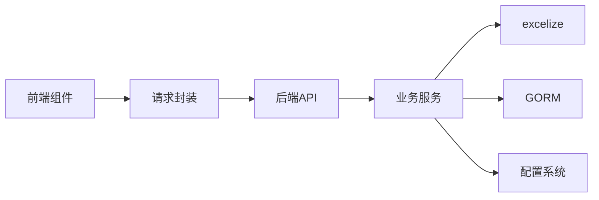

# Excel 导入导出组件

<cite>
**本文引用的文件**
- [exportExcel.vue](file://web/src/components/exportExcel/exportExcel.vue)
- [importExcel.vue](file://web/src/components/exportExcel/importExcel.vue)
- [exportTemplate.vue](file://web/src/components/exportExcel/exportTemplate.vue)
- [exportTemplate.js](file://web/src/api/exportTemplate.js)
- [sys_export_template.go](file://server/router/system/sys_export_template.go)
- [sys_export_template.go](file://server/api/v1/system/sys_export_template.go)
- [sys_export_template.go](file://server/service/system/sys_export_template.go)
- [sys_export_template.go](file://server/model/system/sys_export_template.go)
- [excel_template.go](file://server/source/system/excel_template.go)
- [excel.go](file://server/config/excel.go)
- [system.go](file://server/config/system.go)
- [upload.go](file://server/utils/upload/upload.go)
</cite>

## 目录
1. [简介](#简介)
2. [项目结构](#项目结构)
3. [核心组件](#核心组件)
4. [架构总览](#架构总览)
5. [详细组件分析](#详细组件分析)
6. [依赖关系分析](#依赖关系分析)
7. [性能考量](#性能考量)
8. [故障排查指南](#故障排查指南)
9. [结论](#结论)
10. [附录](#附录)

## 简介
本技术文档围绕 Gin-Vue-Admin 项目中的 Excel 导入导出组件展开，系统性阐述以下能力：
- Excel 导出组件：支持按模板导出数据，含参数传递、分页、排序、软删除过滤、批量导出等。
- 导出模板组件：支持下载模板文件，便于用户按规范填写数据。
- 导入组件：支持上传 Excel 并按模板规则批量导入到数据库，支持自定义导入 SQL 或基于 GORM 的批量插入。

文档重点解析数据格式转换、模板生成、批量导入、错误处理、配置项、事件处理与数据验证机制，并提供完整 API 文档与最佳实践建议。

## 项目结构
Excel 导入导出功能由前端组件与后端 API/服务/模型共同组成，前后端交互通过统一的导出模板 API 实现。

图表来源
- [exportExcel.vue:1-85](file://web/src/components/exportExcel/exportExcel.vue#L1-L85)
- [exportTemplate.vue:1-41](file://web/src/components/exportExcel/exportTemplate.vue#L1-L41)
- [importExcel.vue:1-46](file://web/src/components/exportExcel/importExcel.vue#L1-L46)
- [exportTemplate.js:1-146](file://web/src/api/exportTemplate.js#L1-L146)
- [sys_export_template.go:1-36](file://server/router/system/sys_export_template.go#L1-L36)
- [sys_export_template.go:1-457](file://server/api/v1/system/sys_export_template.go#L1-L457)
- [sys_export_template.go:1-725](file://server/service/system/sys_export_template.go#L1-L725)
- [sys_export_template.go:1-47](file://server/model/system/sys_export_template.go#L1-L47)
- [excel.go:1-6](file://server/config/excel.go#L1-L6)
- [system.go:1-16](file://server/config/system.go#L1-L16)

章节来源
- [exportExcel.vue:1-85](file://web/src/components/exportExcel/exportExcel.vue#L1-L85)
- [exportTemplate.vue:1-41](file://web/src/components/exportExcel/exportTemplate.vue#L1-L41)
- [importExcel.vue:1-46](file://web/src/components/exportExcel/importExcel.vue#L1-L46)
- [exportTemplate.js:1-146](file://web/src/api/exportTemplate.js#L1-L146)
- [sys_export_template.go:1-36](file://server/router/system/sys_export_template.go#L1-L36)
- [sys_export_template.go:1-457](file://server/api/v1/system/sys_export_template.go#L1-L457)
- [sys_export_template.go:1-725](file://server/service/system/sys_export_template.go#L1-L725)
- [sys_export_template.go:1-47](file://server/model/system/sys_export_template.go#L1-L47)
- [excel.go:1-6](file://server/config/excel.go#L1-L6)
- [system.go:1-16](file://server/config/system.go#L1-L16)

## 核心组件
- 前端组件
  - 导出组件：负责拼装查询参数、触发导出、下载结果。
  - 导出模板组件：负责下载模板文件。
  - 导入组件：负责上传文件、触发导入、处理结果。
- 后端 API
  - 提供导出模板 CRUD、导出、预览 SQL、导出模板、导入等接口。
  - 使用一次性 Token 机制保障导出安全性。
- 业务服务
  - 解析模板、构造查询、生成 Excel、解析 Excel 并批量导入。
- 数据模型
  - 导出模板、条件、关联表等结构定义。
- 配置
  - Excel 目录、系统配置等。

章节来源
- [exportExcel.vue:1-85](file://web/src/components/exportExcel/exportExcel.vue#L1-L85)
- [exportTemplate.vue:1-41](file://web/src/components/exportExcel/exportTemplate.vue#L1-L41)
- [importExcel.vue:1-46](file://web/src/components/exportExcel/importExcel.vue#L1-L46)
- [exportTemplate.js:1-146](file://web/src/api/exportTemplate.js#L1-L146)
- [sys_export_template.go:1-457](file://server/api/v1/system/sys_export_template.go#L1-L457)
- [sys_export_template.go:1-725](file://server/service/system/sys_export_template.go#L1-L725)
- [sys_export_template.go:1-47](file://server/model/system/sys_export_template.go#L1-L47)
- [excel.go:1-6](file://server/config/excel.go#L1-L6)
- [system.go:1-16](file://server/config/system.go#L1-L16)

## 架构总览
整体流程：前端组件调用 API，API 生成一次性 Token，随后通过 Token 路由触发服务层导出/导入逻辑，服务层读取模板、构建查询、生成/解析 Excel 并与数据库交互。

图表来源
- [sys_export_template.go:244-333](file://server/api/v1/system/sys_export_template.go#L244-L333)
- [sys_export_template.go:335-429](file://server/api/v1/system/sys_export_template.go#L335-L429)
- [sys_export_template.go:431-456](file://server/api/v1/system/sys_export_template.go#L431-L456)
- [sys_export_template.go:128-369](file://server/service/system/sys_export_template.go#L128-L369)
- [sys_export_template.go:556-602](file://server/service/system/sys_export_template.go#L556-L602)
- [sys_export_template.go:611-714](file://server/service/system/sys_export_template.go#L611-L714)

## 详细组件分析

### 导出组件（exportExcel.vue）
- 功能要点
  - 校验 templateId，组装查询参数（支持 filterDeleted、limit、offset、order），调用导出 API。
  - 成功后打开新窗口下载文件。
- 关键行为
  - 参数编码与 URL 拼接。
  - 通过一次性 Token 机制触发后端导出。
- 错误处理
  - 未设置模板 ID 时提示错误。
  - 导出成功后根据返回地址打开下载。

图表来源
- [exportExcel.vue:40-83](file://web/src/components/exportExcel/exportExcel.vue#L40-L83)
- [exportTemplate.js:100-113](file://web/src/api/exportTemplate.js#L100-L113)
- [sys_export_template.go:244-278](file://server/api/v1/system/sys_export_template.go#L244-L278)
- [sys_export_template.go:280-333](file://server/api/v1/system/sys_export_template.go#L280-L333)
- [sys_export_template.go:128-369](file://server/service/system/sys_export_template.go#L128-L369)

章节来源
- [exportExcel.vue:1-85](file://web/src/components/exportExcel/exportExcel.vue#L1-L85)
- [exportTemplate.js:100-113](file://web/src/api/exportTemplate.js#L100-L113)
- [sys_export_template.go:244-333](file://server/api/v1/system/sys_export_template.go#L244-L333)
- [sys_export_template.go:128-369](file://server/service/system/sys_export_template.go#L128-L369)

### 导出模板组件（exportTemplate.vue）
- 功能要点
  - 下载指定模板的 Excel 模板文件。
  - 通过一次性 Token 机制触发后端模板导出。
- 错误处理
  - 未设置模板 ID 时提示错误。

图表来源
- [exportTemplate.vue:19-39](file://web/src/components/exportExcel/exportTemplate.vue#L19-L39)
- [exportTemplate.js:115-128](file://web/src/api/exportTemplate.js#L115-L128)
- [sys_export_template.go:335-367](file://server/api/v1/system/sys_export_template.go#L335-L367)
- [sys_export_template.go:369-429](file://server/api/v1/system/sys_export_template.go#L369-L429)
- [sys_export_template.go:556-602](file://server/service/system/sys_export_template.go#L556-L602)

章节来源
- [exportTemplate.vue:1-41](file://web/src/components/exportExcel/exportTemplate.vue#L1-L41)
- [exportTemplate.js:115-128](file://web/src/api/exportTemplate.js#L115-L128)
- [sys_export_template.go:335-429](file://server/api/v1/system/sys_export_template.go#L335-L429)
- [sys_export_template.go:556-602](file://server/service/system/sys_export_template.go#L556-L602)

### 导入组件（importExcel.vue）
- 功能要点
  - 上传文件，携带 Token 头部，触发导入。
  - 成功/失败消息提示，触发 on-success 事件。
- 错误处理
  - 服务端返回错误码时提示错误消息。

图表来源
- [importExcel.vue:1-46](file://web/src/components/exportExcel/importExcel.vue#L1-L46)
- [exportTemplate.js:1-146](file://web/src/api/exportTemplate.js#L1-L146)
- [sys_export_template.go:431-456](file://server/api/v1/system/sys_export_template.go#L431-L456)
- [sys_export_template.go:611-714](file://server/service/system/sys_export_template.go#L611-L714)

章节来源
- [importExcel.vue:1-46](file://web/src/components/exportExcel/importExcel.vue#L1-L46)
- [exportTemplate.js:1-146](file://web/src/api/exportTemplate.js#L1-L146)
- [sys_export_template.go:431-456](file://server/api/v1/system/sys_export_template.go#L431-L456)
- [sys_export_template.go:611-714](file://server/service/system/sys_export_template.go#L611-L714)

### 后端服务与数据模型
- 业务服务（SysExportTemplateService）
  - 导出：解析模板、构造查询（支持 JOIN、条件、排序、分页、软删除过滤）、生成 Excel。
  - 导出模板：仅输出标题行。
  - 导入：解析 Excel 行、映射字段、事务批量写入（支持自定义 SQL 或 GORM）。
  - 预览 SQL：不执行查询，返回可执行 SQL 字符串。
- 数据模型（SysExportTemplate、Condition、JoinTemplate）
  - 模板元信息、列映射、条件、关联表、自定义 SQL、默认 limit/order 等。

图表来源
- [sys_export_template.go:8-47](file://server/model/system/sys_export_template.go#L8-L47)

章节来源
- [sys_export_template.go:128-369](file://server/service/system/sys_export_template.go#L128-L369)
- [sys_export_template.go:556-602](file://server/service/system/sys_export_template.go#L556-L602)
- [sys_export_template.go:611-714](file://server/service/system/sys_export_template.go#L611-L714)
- [sys_export_template.go:8-47](file://server/model/system/sys_export_template.go#L8-L47)

### 导出流程算法

图表来源
- [sys_export_template.go:128-369](file://server/service/system/sys_export_template.go#L128-L369)

章节来源
- [sys_export_template.go:128-369](file://server/service/system/sys_export_template.go#L128-L369)

## 依赖关系分析
- 前端依赖
  - Element Plus UI 组件库。
  - Axios 包装的请求服务。
- 后端依赖
  - excelize：Excel 读写。
  - GORM：数据库 ORM。
  - Gin：Web 框架。
  - 配置系统：系统与 Excel 相关配置。

图表来源
- [exportTemplate.js:1-146](file://web/src/api/exportTemplate.js#L1-L146)
- [sys_export_template.go:1-725](file://server/service/system/sys_export_template.go#L1-L725)
- [excel.go:1-6](file://server/config/excel.go#L1-L6)
- [system.go:1-16](file://server/config/system.go#L1-L16)

章节来源
- [exportTemplate.js:1-146](file://web/src/api/exportTemplate.js#L1-L146)
- [sys_export_template.go:1-725](file://server/service/system/sys_export_template.go#L1-L725)
- [excel.go:1-6](file://server/config/excel.go#L1-L6)
- [system.go:1-16](file://server/config/system.go#L1-L16)

## 性能考量
- 批量写入
  - 导入采用批量写入（CreateInBatches），提升导入吞吐。
- 分页与限制
  - 支持 limit/offset 与模板默认 limit，避免超大数据集一次性导出。
- 排序安全
  - order 参数进行字段存在性与方向合法性校验，防止注入风险。
- 软删除过滤
  - 自动为主表与关联表添加 deleted_at 过滤，减少无关数据导出。
- Token 机制
  - 一次性 Token 降低并发与重放风险，同时缩短有效时间窗口。

章节来源
- [sys_export_template.go:701-714](file://server/service/system/sys_export_template.go#L701-L714)
- [sys_export_template.go:286-309](file://server/service/system/sys_export_template.go#L286-L309)
- [sys_export_template.go:207-221](file://server/service/system/sys_export_template.go#L207-L221)
- [sys_export_template.go:28-42](file://server/api/v1/system/sys_export_template.go#L28-L42)

## 故障排查指南
- 常见问题
  - 模板 ID 为空：前端组件会提示错误；请确保传入有效的 templateID。
  - 导出失败：检查模板是否存在、列映射是否正确、数据库连接是否正常。
  - 导入失败：确认 Excel 标题与模板映射一致、字段类型匹配、数据库具备相应列。
  - Token 过期：一次性 Token 默认有效期 30 分钟，过期需重新发起导出请求。
- 日志与错误码
  - 后端统一通过响应对象返回错误信息，前端根据 code/msg 展示提示。
- 建议
  - 使用“预览 SQL”功能核对最终查询条件与范围。
  - 对于大批量数据，建议配合 limit/offset 与 order 控制导出规模。

章节来源
- [exportExcel.vue:40-83](file://web/src/components/exportExcel/exportExcel.vue#L40-L83)
- [importExcel.vue:37-44](file://web/src/components/exportExcel/importExcel.vue#L37-L44)
- [sys_export_template.go:280-333](file://server/api/v1/system/sys_export_template.go#L280-L333)
- [sys_export_template.go:369-429](file://server/api/v1/system/sys_export_template.go#L369-L429)
- [sys_export_template.go:431-456](file://server/api/v1/system/sys_export_template.go#L431-L456)

## 结论
该 Excel 导入导出组件通过“模板 + 参数 + 一次性 Token”的设计，实现了灵活、安全、可扩展的数据导出与导入能力。前端组件职责清晰，后端服务覆盖模板解析、查询构建、Excel 生成与解析、批量导入等关键环节。结合预览 SQL、分页与排序安全、软删除过滤等机制，能够满足复杂业务场景下的数据处理需求。

## 附录

### API 文档

- 导出模板
  - 创建导出模板
    - 方法：POST
    - 路径：/sysExportTemplate/createSysExportTemplate
    - 请求体：SysExportTemplate
    - 返回：通用响应
  - 删除导出模板
    - 方法：DELETE
    - 路径：/sysExportTemplate/deleteSysExportTemplate
    - 请求体：SysExportTemplate
    - 返回：通用响应
  - 批量删除导出模板
    - 方法：DELETE
    - 路径：/sysExportTemplate/deleteSysExportTemplateByIds
    - 请求体：IdsReq
    - 返回：通用响应
  - 更新导出模板
    - 方法：PUT
    - 路径：/sysExportTemplate/updateSysExportTemplate
    - 请求体：SysExportTemplate
    - 返回：通用响应
  - 查询导出模板（按ID）
    - 方法：GET
    - 路径：/sysExportTemplate/findSysExportTemplate
    - 查询：id
    - 返回：SysExportTemplate
  - 分页获取导出模板列表
    - 方法：GET
    - 路径：/sysExportTemplate/getSysExportTemplateList
    - 查询：PageInfo
    - 返回：分页结果

- 导出与模板
  - 导出表格（获取一次性 Token）
    - 方法：GET
    - 路径：/sysExportTemplate/exportExcel
    - 查询：templateID
    - 返回：导出URL（带 token）
  - 通过 Token 导出表格
    - 方法：GET
    - 路径：/sysExportTemplate/exportExcelByToken
    - 查询：token
    - 返回：application/vnd.openxmlformats-officedocument.spreadsheetml.sheet
  - 导出表格模板（获取一次性 Token）
    - 方法：GET
    - 路径：/sysExportTemplate/exportTemplate
    - 查询：templateID
    - 返回：导出URL（带 token）
  - 通过 Token 导出模板
    - 方法：GET
    - 路径：/sysExportTemplate/exportTemplateByToken
    - 查询：token
    - 返回：application/vnd.openxmlformats-officedocument.spreadsheetml.sheet
  - 预览最终生成的 SQL
    - 方法：GET
    - 路径：/sysExportTemplate/previewSQL
    - 查询：templateID, params
    - 返回：sql 字符串

- 导入
  - 导入 Excel 模板数据
    - 方法：POST
    - 路径：/sysExportTemplate/importExcel
    - 查询：templateID
    - 表单字段：file
    - 返回：导入结果

章节来源
- [exportTemplate.js:1-146](file://web/src/api/exportTemplate.js#L1-L146)
- [sys_export_template.go:11-36](file://server/router/system/sys_export_template.go#L11-L36)
- [sys_export_template.go:81-456](file://server/api/v1/system/sys_export_template.go#L81-L456)

### 组件属性与事件

- 导出组件（exportExcel.vue）
  - 属性
    - filterDeleted: Boolean，默认 true
    - templateId: String，必填
    - condition: Object，默认 {}
    - limit: Number，默认 0
    - offset: Number，默认 0
    - order: String，默认空
  - 事件
    - 无（通过 ElMessage 提示）

- 导出模板组件（exportTemplate.vue）
  - 属性
    - templateId: String，必填
  - 事件
    - 无（通过 ElMessage 提示）

- 导入组件（importExcel.vue）
  - 属性
    - templateId: String，必填
  - 事件
    - on-success: 导入成功时触发

章节来源
- [exportExcel.vue:11-36](file://web/src/components/exportExcel/exportExcel.vue#L11-L36)
- [exportTemplate.vue:11-16](file://web/src/components/exportExcel/exportTemplate.vue#L11-L16)
- [importExcel.vue:22-27](file://web/src/components/exportExcel/importExcel.vue#L22-L27)
- [importExcel.vue:33-34](file://web/src/components/exportExcel/importExcel.vue#L33-L34)

### 配置项
- Excel 目录配置
  - 结构：Dir（字符串）
  - 用途：Excel 文件相关目录（如需要本地存储导出文件）
- 系统配置
  - OssType：对象存储类型（local/qiniu/tencent-cos/aliyun-oss/huawei-obs/aws-s3/cloudflare-r2/minio）
  - RouterPrefix：路由前缀
  - Addr：端口
  - 其他安全与中间件相关开关

章节来源
- [excel.go:1-6](file://server/config/excel.go#L1-L6)
- [system.go:1-16](file://server/config/system.go#L1-L16)
- [upload.go:1-47](file://server/utils/upload/upload.go#L1-L47)

### 最佳实践
- 模板设计
  - 明确 TemplateInfo 的键值映射，保证标题与键一致。
  - 合理设置默认 limit 与 order，避免导出过大结果集。
- 参数传递
  - 使用 filterDeleted、limit、offset、order 精准控制导出范围。
  - 对 IN/LIKE/BETWEEN 等条件，确保传入正确的键名与格式。
- 导入策略
  - 导入前先下载模板，确保字段顺序与类型一致。
  - 大批量导入建议分批处理，结合事务与错误回滚。
- 安全与性能
  - 使用一次性 Token 保护导出接口。
  - 对 order 参数进行白名单校验，避免注入。
  - 对软删除表启用自动过滤，减少冗余数据。