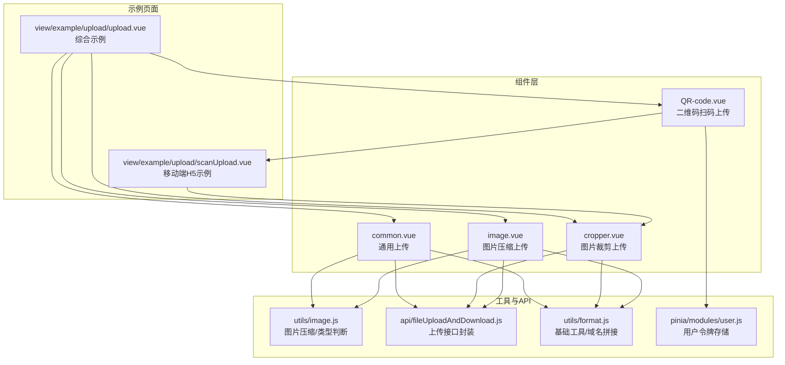
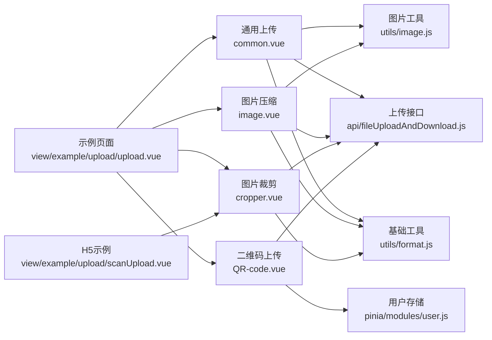
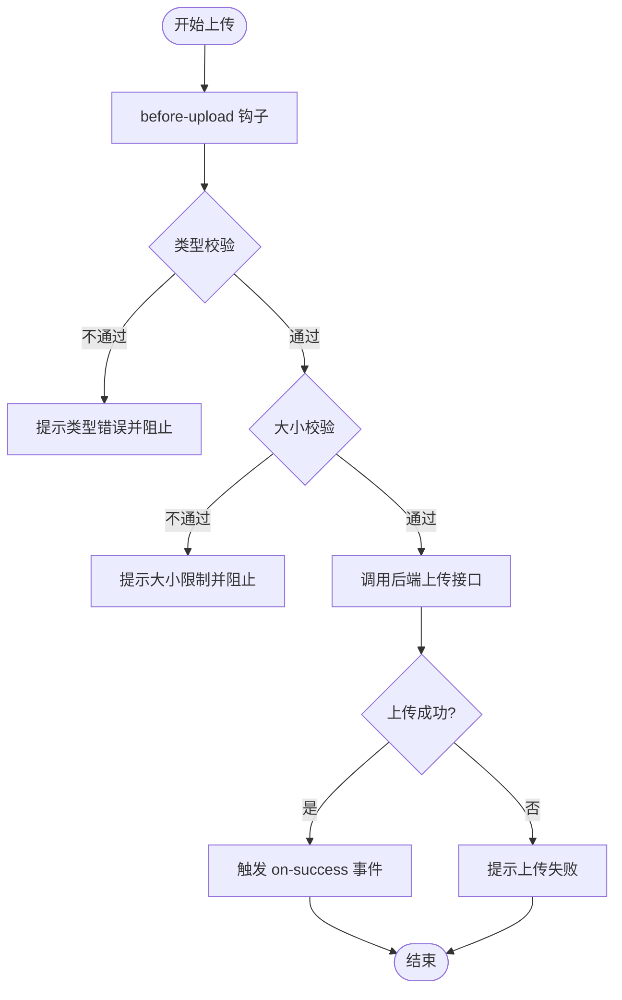
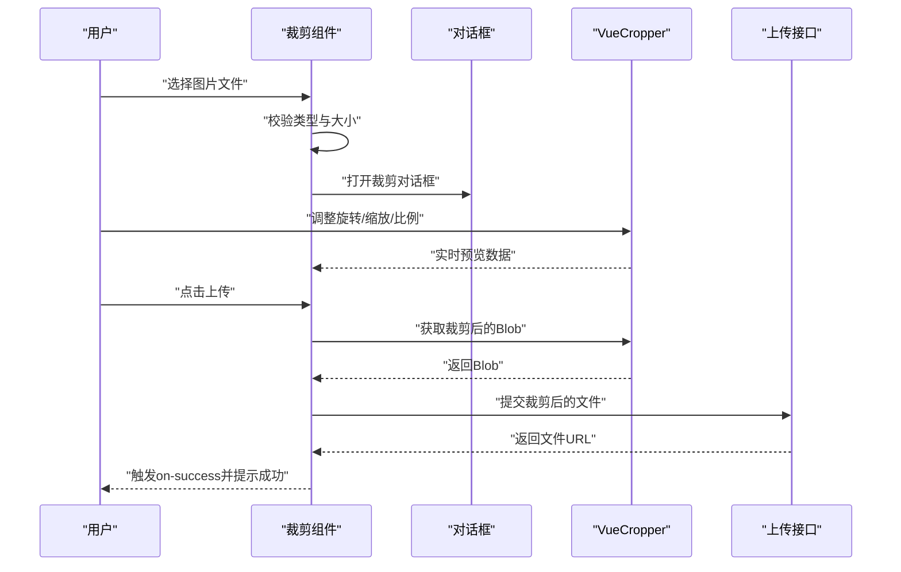
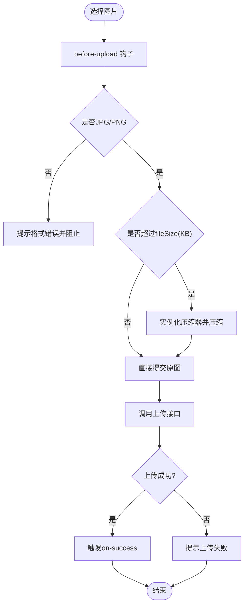
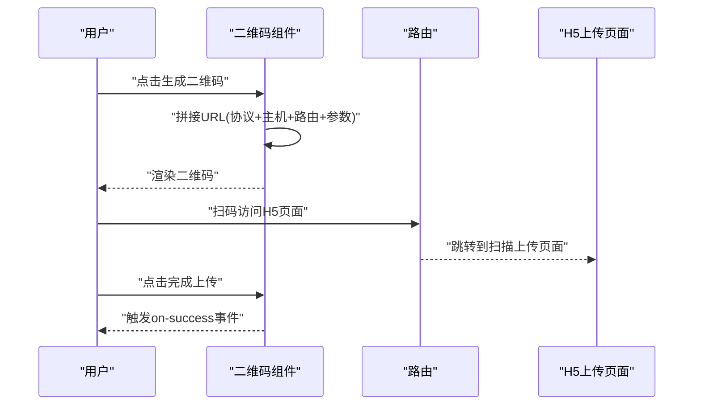
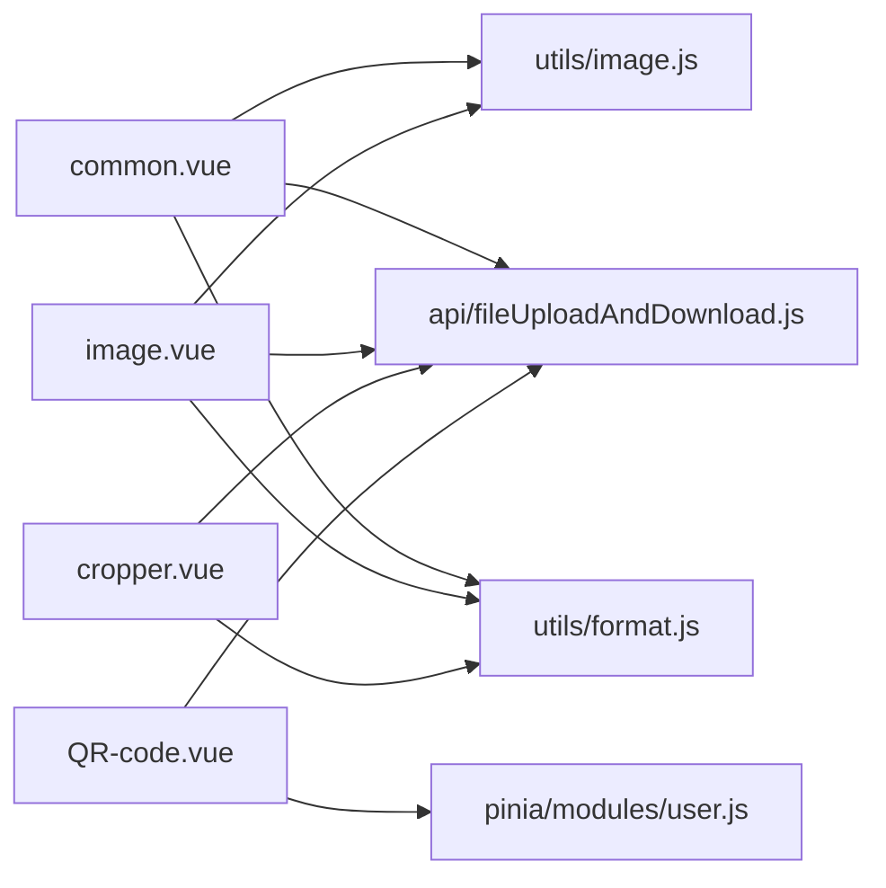

# 上传组件

<cite>
**本文引用的文件**
- [common.vue](file://web/src/components/upload/common.vue)
- [cropper.vue](file://web/src/components/upload/cropper.vue)
- [image.vue](file://web/src/components/upload/image.vue)
- [QR-code.vue](file://web/src/components/upload/QR-code.vue)
- [image.js](file://web/src/utils/image.js)
- [fileUploadAndDownload.js](file://web/src/api/fileUploadAndDownload.js)
- [format.js](file://web/src/utils/format.js)
- [user.js](file://web/src/pinia/modules/user.js)
- [upload.vue](file://web/src/view/example/upload/upload.vue)
- [scanUpload.vue](file://web/src/view/example/upload/scanUpload.vue)
</cite>

## 目录
1. [简介](#简介)
2. [项目结构](#项目结构)
3. [核心组件](#核心组件)
4. [架构总览](#架构总览)
5. [详细组件分析](#详细组件分析)
6. [依赖关系分析](#依赖关系分析)
7. [性能与安全考量](#性能与安全考量)
8. [故障排查指南](#故障排查指南)
9. [结论](#结论)
10. [附录：配置参数与使用示例](#附录配置参数与使用示例)

## 简介
本文件面向上传组件系列，系统性梳理通用上传、图片裁剪上传、图片压缩上传以及二维码扫码上传四个组件的设计与实现要点，覆盖：
- 组件职责与适用场景
- 核心配置参数与行为约束
- 事件处理机制与错误处理策略
- 进度与状态反馈
- 文件类型校验、大小限制与安全考虑
- 与后端接口的交互流程与关键点
- 与后端接口的交互流程与关键点

## 项目结构
上传组件位于前端工程的组件目录下，配合工具函数、API 封装与示例页面共同构成完整的上传能力体系。

图表来源
- [common.vue:3-15](file://web/src/components/upload/common.vue#L3-L15)
- [cropper.vue:2-14](file://web/src/components/upload/cropper.vue#L2-L14)
- [image.vue:3-13](file://web/src/components/upload/image.vue#L3-L13)
- [QR-code.vue:1-27](file://web/src/components/upload/QR-code.vue#L1-L27)
- [image.js:1-127](file://web/src/utils/image.js#L1-L127)
- [fileUploadAndDownload.js:60-67](file://web/src/api/fileUploadAndDownload.js#L60-L67)
- [format.js:159-163](file://web/src/utils/format.js#L159-L163)
- [user.js:23-25](file://web/src/pinia/modules/user.js#L23-L25)
- [upload.vue:59-72](file://web/src/view/example/upload/upload.vue#L59-L72)
- [scanUpload.vue:3-16](file://web/src/view/example/upload/scanUpload.vue#L3-L16)

章节来源
- [common.vue:1-91](file://web/src/components/upload/common.vue#L1-L91)
- [cropper.vue:1-238](file://web/src/components/upload/cropper.vue#L1-L238)
- [image.vue:1-103](file://web/src/components/upload/image.vue#L1-L103)
- [QR-code.vue:1-66](file://web/src/components/upload/QR-code.vue#L1-L66)
- [image.js:1-127](file://web/src/utils/image.js#L1-L127)
- [fileUploadAndDownload.js:1-67](file://web/src/api/fileUploadAndDownload.js#L1-L67)
- [format.js:1-176](file://web/src/utils/format.js#L1-L176)
- [user.js:1-151](file://web/src/pinia/modules/user.js#L1-L151)
- [upload.vue:1-503](file://web/src/view/example/upload/upload.vue#L1-L503)
- [scanUpload.vue:1-246](file://web/src/view/example/upload/scanUpload.vue#L1-L246)

## 核心组件
- 通用上传组件：支持多文件上传，内置文件类型与大小校验，统一触发 on-success 事件。
- 图片裁剪上传组件：基于第三方裁剪库，提供旋转、缩放、比例选择与实时预览，最终提交裁剪后的 Blob。
- 图片压缩上传组件：对超限图片自动压缩，支持指定压缩阈值与最大边长，确保上传效率与质量平衡。
- 二维码扫码上传组件：生成包含 token 与类目参数的二维码，移动端扫码后跳转至 H5 上传页面。

章节来源
- [common.vue:35-42](file://web/src/components/upload/common.vue#L35-L42)
- [cropper.vue:99-104](file://web/src/components/upload/cropper.vue#L99-L104)
- [image.vue:29-46](file://web/src/components/upload/image.vue#L29-L46)
- [QR-code.vue:42-47](file://web/src/components/upload/QR-code.vue#L42-L47)

## 架构总览
上传组件通过 Element Plus 的 el-upload 组件与后端接口对接，统一使用上传接口并携带 classId 与 token。图片相关组件依赖工具函数进行类型判断与压缩处理，二维码组件依赖用户令牌与路由路径拼接。

图表来源
- [common.vue:3-15](file://web/src/components/upload/common.vue#L3-L15)
- [image.vue:3-13](file://web/src/components/upload/image.vue#L3-L13)
- [cropper.vue:2-14](file://web/src/components/upload/cropper.vue#L2-L14)
- [QR-code.vue:1-27](file://web/src/components/upload/QR-code.vue#L1-L27)
- [image.js:1-127](file://web/src/utils/image.js#L1-L127)
- [fileUploadAndDownload.js:60-67](file://web/src/api/fileUploadAndDownload.js#L60-L67)
- [format.js:159-163](file://web/src/utils/format.js#L159-L163)
- [user.js:23-25](file://web/src/pinia/modules/user.js#L23-L25)
- [upload.vue:59-72](file://web/src/view/example/upload/upload.vue#L59-L72)
- [scanUpload.vue:3-16](file://web/src/view/example/upload/scanUpload.vue#L3-L16)

## 详细组件分析

### 通用上传组件（common.vue）
- 功能特性
  - 统一上传入口，隐藏文件列表展示，避免重复渲染。
  - 在 before-upload 中进行类型与大小校验，分别针对图片与视频设定不同阈值。
  - 成功回调触发 on-success 事件，传递文件 URL。
- 配置参数
  - classId：所属分类 ID，用于后端分类归档。
- 事件处理
  - on-success：接收后端返回的文件对象，提取 URL 并向上抛出。
  - on-error：统一提示上传失败。
- 错误处理
  - 类型不被允许时立即拦截并提示。
  - 超过大小限制时提示并阻止上传。
- 使用场景
  - 通用文件上传，适合对格式与大小有明确要求的场景。

图表来源
- [common.vue:46-74](file://web/src/components/upload/common.vue#L46-L74)
- [common.vue:76-89](file://web/src/components/upload/common.vue#L76-L89)

章节来源
- [common.vue:19-91](file://web/src/components/upload/common.vue#L19-L91)

### 图片裁剪上传组件（cropper.vue）
- 功能特性
  - 支持图片旋转、缩放、比例选择与实时预览。
  - 提供对话框式编辑界面，裁剪完成后将 Blob 转换为 File 并提交。
  - 自动上传状态与加载提示，提升用户体验。
- 配置参数
  - classId：所属分类 ID。
- 事件处理
  - on-success：上传成功后关闭对话框、清空预览并提示成功。
- 错误处理
  - 非图片文件禁止选择；过大文件提示限制。
- 使用场景
  - 对图片尺寸与比例有严格要求的场景，如头像、封面图等。

图表来源
- [cropper.vue:166-184](file://web/src/components/upload/cropper.vue#L166-L184)
- [cropper.vue:202-216](file://web/src/components/upload/cropper.vue#L202-L216)
- [cropper.vue:218-229](file://web/src/components/upload/cropper.vue#L218-L229)

章节来源
- [cropper.vue:84-238](file://web/src/components/upload/cropper.vue#L84-L238)

### 图片压缩上传组件（image.vue）
- 功能特性
  - 在 before-upload 中根据阈值自动压缩图片，确保上传效率。
  - 仅支持 JPG/PNG 格式，超出阈值时进行压缩处理。
- 配置参数
  - imageUrl：默认显示的图片地址（可选）。
  - fileSize：压缩阈值（KB），默认 2048。
  - maxWH：压缩后最大边长，默认 1920。
  - classId：所属分类 ID。
- 事件处理
  - on-success：上传成功后返回文件 URL。
- 使用场景
  - 需要快速上传且对图片体积敏感的场景，如头像、商品图等。

图表来源
- [image.vue:52-67](file://web/src/components/upload/image.vue#L52-L67)
- [image.vue:69-74](file://web/src/components/upload/image.vue#L69-L74)

章节来源
- [image.vue:17-103](file://web/src/components/upload/image.vue#L17-L103)

### 二维码扫码上传组件（QR-code.vue）
- 功能特性
  - 生成包含 token 与类目参数的二维码，移动端扫码后跳转至 H5 上传页面。
  - 提供完成按钮，点击后触发 on-success 事件。
- 配置参数
  - classId：所属分类 ID。
- 事件处理
  - on-success：用于通知父组件上传流程完成。
- 使用场景
  - 移动端扫码上传，适用于需要跨设备协作的场景。

图表来源
- [QR-code.vue:53-58](file://web/src/components/upload/QR-code.vue#L53-L58)
- [QR-code.vue:60-64](file://web/src/components/upload/QR-code.vue#L60-L64)

章节来源
- [QR-code.vue:30-66](file://web/src/components/upload/QR-code.vue#L30-L66)

## 依赖关系分析
- 组件间耦合
  - 通用上传与图片压缩上传均依赖工具函数进行类型判断与压缩处理。
  - 图片裁剪上传依赖第三方裁剪库与基础工具函数。
  - 二维码上传依赖用户令牌与路由路径拼接。
- 外部依赖
  - Element Plus 的 el-upload、消息提示与对话框组件。
  - 第三方裁剪库 vue-cropper。
  - 二维码组件 vue-qr。
- 接口契约
  - 统一调用上传接口，传递 classId 与 token，接收包含文件 URL 的响应。

图表来源
- [common.vue:22-25](file://web/src/components/upload/common.vue#L22-L25)
- [image.vue:18-22](file://web/src/components/upload/image.vue#L18-L22)
- [cropper.vue:89-91](file://web/src/components/upload/cropper.vue#L89-L91)
- [QR-code.vue:31-34](file://web/src/components/upload/QR-code.vue#L31-L34)
- [image.js:1-127](file://web/src/utils/image.js#L1-L127)
- [fileUploadAndDownload.js:60-67](file://web/src/api/fileUploadAndDownload.js#L60-L67)
- [format.js:159-163](file://web/src/utils/format.js#L159-L163)
- [user.js:23-25](file://web/src/pinia/modules/user.js#L23-L25)

章节来源
- [common.vue:19-91](file://web/src/components/upload/common.vue#L19-L91)
- [image.vue:17-103](file://web/src/components/upload/image.vue#L17-L103)
- [cropper.vue:84-238](file://web/src/components/upload/cropper.vue#L84-L238)
- [QR-code.vue:30-66](file://web/src/components/upload/QR-code.vue#L30-L66)

## 性能与安全考量
- 性能优化
  - 图片压缩：在前端进行压缩，减少带宽占用与后端压力。
  - 裁剪上传：仅传输裁剪后的区域，降低文件体积。
  - 类型与大小前置校验：减少无效请求与后端资源消耗。
- 安全考虑
  - 上传接口需携带 token，确保身份验证。
  - 前端仅做基础校验，后端仍需进行严格的文件类型与大小检查。
  - 二维码参数包含 token，注意防止泄露与滥用。

## 故障排查指南
- 上传失败
  - 检查网络连接与后端服务状态。
  - 确认 classId 与 token 是否正确传递。
- 类型不被允许
  - 确认文件 MIME 类型是否在允许范围内。
  - 图片裁剪组件仅接受图片类型。
- 大小超限
  - 图片压缩组件会自动压缩，若仍超限请增大阈值或减小 maxWH。
  - 通用上传组件对图片与视频设置了不同的大小限制。
- 裁剪异常
  - 确认 vue-cropper 版本兼容性与样式引入。
  - 检查 Blob 转 File 的过程是否成功。

章节来源
- [common.vue:76-89](file://web/src/components/upload/common.vue#L76-L89)
- [image.vue:52-67](file://web/src/components/upload/image.vue#L52-L67)
- [cropper.vue:166-184](file://web/src/components/upload/cropper.vue#L166-L184)
- [QR-code.vue:60-64](file://web/src/components/upload/QR-code.vue#L60-L64)

## 结论
上传组件系列通过统一的接口与完善的校验机制，满足了多种上传场景的需求。通用上传组件提供基础能力，图片压缩与裁剪组件分别解决体积与精度问题，二维码组件则拓展了移动端的使用体验。结合后端的严格校验与安全策略，整体方案具备良好的扩展性与稳定性。

## 附录：配置参数与使用示例

### 通用上传组件（common.vue）
- 属性
  - classId：Number，默认 0
- 事件
  - on-success：上传成功回调，返回文件 URL
- 使用示例
  - 在示例页面中通过 UploadCommon 组件进行通用文件上传，并监听 on-success 事件刷新文件列表。

章节来源
- [common.vue:35-42](file://web/src/components/upload/common.vue#L35-L42)
- [common.vue:42](file://web/src/components/upload/common.vue#L42)
- [upload.vue:59-63](file://web/src/view/example/upload/upload.vue#L59-L63)

### 图片裁剪上传组件（cropper.vue）
- 属性
  - classId：Number，默认 0
- 事件
  - on-success：上传成功回调，返回文件 URL
- 使用示例
  - 在示例页面中通过 CropperImage 组件进行图片裁剪上传，并监听 on-success 事件刷新文件列表。

章节来源
- [cropper.vue:99-104](file://web/src/components/upload/cropper.vue#L99-L104)
- [cropper.vue:97](file://web/src/components/upload/cropper.vue#L97)
- [upload.vue:64](file://web/src/view/example/upload/upload.vue#L64)

### 图片压缩上传组件（image.vue）
- 属性
  - imageUrl：String，默认空字符串
  - fileSize：Number，默认 2048（KB）
  - maxWH：Number，默认 1920（像素）
  - classId：Number，默认 0
- 事件
  - on-success：上传成功回调，返回文件 URL
- 使用示例
  - 在示例页面中通过 UploadImage 组件进行图片压缩上传，并监听 on-success 事件刷新文件列表。

章节来源
- [image.vue:29-46](file://web/src/components/upload/image.vue#L29-L46)
- [image.vue:28](file://web/src/components/upload/image.vue#L28)
- [upload.vue:66-72](file://web/src/view/example/upload/upload.vue#L66-L72)

### 二维码扫码上传组件（QR-code.vue）
- 属性
  - classId：Number，默认 0
- 事件
  - on-success：完成上传回调
- 使用示例
  - 在示例页面中通过 QRCodeUpload 组件生成二维码，移动端扫码后跳转至 H5 上传页面。

章节来源
- [QR-code.vue:42-47](file://web/src/components/upload/QR-code.vue#L42-L47)
- [QR-code.vue:40](file://web/src/components/upload/QR-code.vue#L40)
- [upload.vue:65](file://web/src/view/example/upload/upload.vue#L65)

### 工具函数与 API
- 图片工具（utils/image.js）
  - ImageCompress：图片压缩类，支持等比缩放与 Blob 转换。
  - 类型判断：isImageMime、isVideoMime、isVideoExt。
- 上传接口（api/fileUploadAndDownload.js）
  - uploadFile：上传文件接口。
- 基础工具（utils/format.js）
  - getBaseUrl：获取基础 URL。
- 用户存储（pinia/modules/user.js）
  - token：获取当前用户 token。

章节来源
- [image.js:1-127](file://web/src/utils/image.js#L1-L127)
- [fileUploadAndDownload.js:60-67](file://web/src/api/fileUploadAndDownload.js#L60-L67)
- [format.js:159-163](file://web/src/utils/format.js#L159-L163)
- [user.js:23-25](file://web/src/pinia/modules/user.js#L23-L25)

### H5 扫码上传页面（scanUpload.vue）
- 功能
  - 支持移动端图片上传与裁剪，提供旋转、缩放与上传按钮。
- 使用示例
  - 通过二维码组件生成链接，移动端扫码后进入该页面进行上传。

章节来源
- [scanUpload.vue:79-246](file://web/src/view/example/upload/scanUpload.vue#L79-L246)