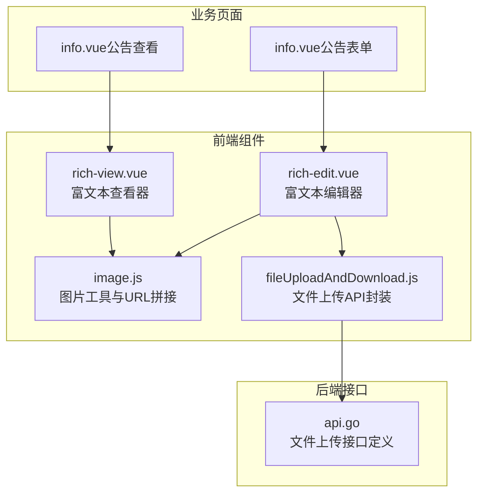
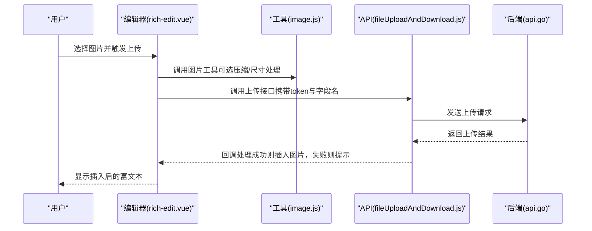
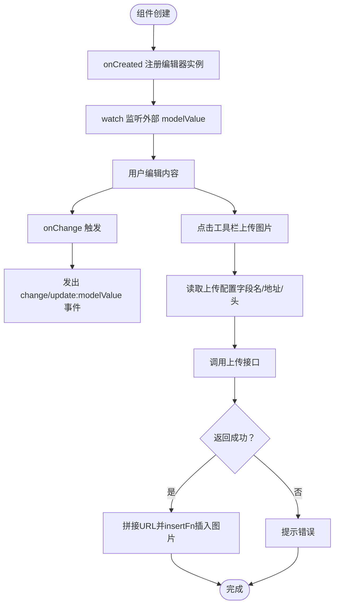
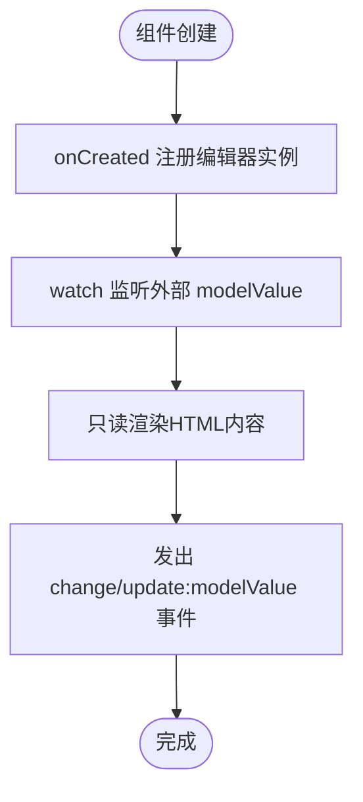
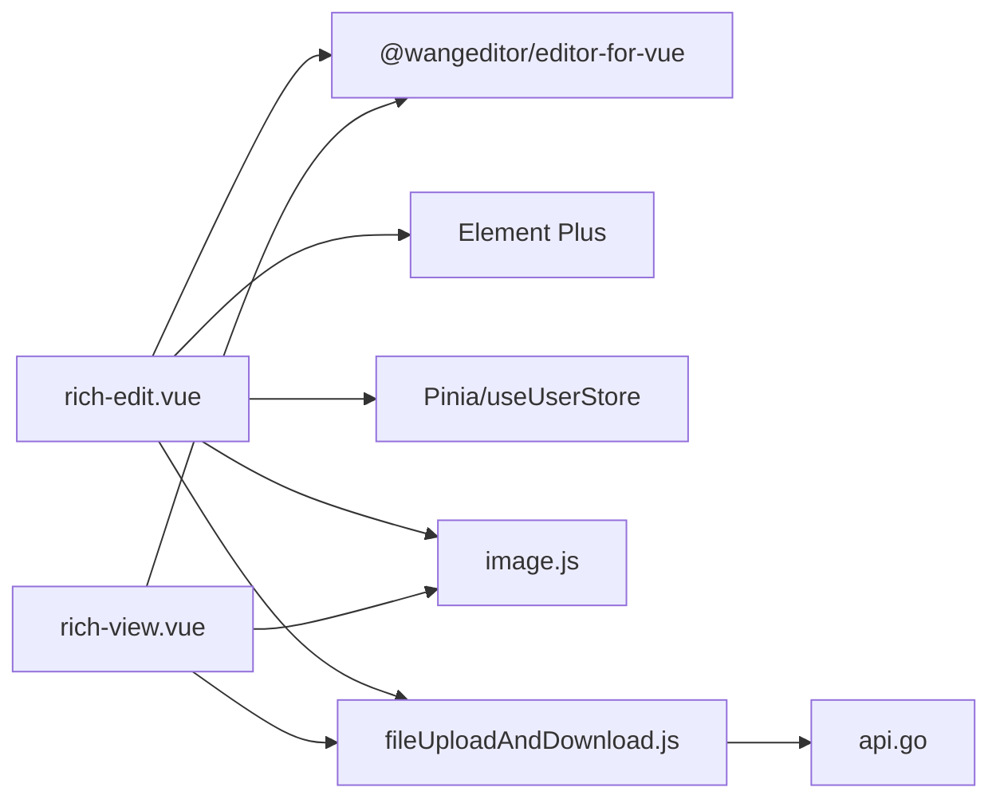

# 富文本组件

<cite>
**本文引用的文件**
- [rich-edit.vue](file://web/src/components/richtext/rich-edit.vue)
- [rich-view.vue](file://web/src/components/richtext/rich-view.vue)
- [image.js](file://web/src/utils/image.js)
- [fileUploadAndDownload.js](file://web/src/api/fileUploadAndDownload.js)
- [info.vue（公告表单）](file://web/src/plugin/announcement/form/info.vue)
- [info.vue（公告查看）](file://web/src/plugin/announcement/view/info.vue)
- [api.go](file://server/source/system/api.go)
</cite>

## 目录
1. [简介](#简介)
2. [项目结构](#项目结构)
3. [核心组件](#核心组件)
4. [架构总览](#架构总览)
5. [详细组件分析](#详细组件分析)
6. [依赖分析](#依赖分析)
7. [性能考量](#性能考量)
8. [故障排查指南](#故障排查指南)
9. [结论](#结论)
10. [附录](#附录)

## 简介
本技术文档围绕富文本组件展开，系统性介绍富文本编辑器与富文本查看器两个核心组件的设计思路与实现原理。重点覆盖：
- 编辑模式下的功能特性：文本格式化、图片插入、链接处理、内容保存与事件联动
- 查看模式下的渲染机制与样式控制
- API 文档：编辑器配置、事件监听、内容获取与设置方法
- 使用示例、自定义配置与性能优化建议

## 项目结构
富文本组件位于前端工程的组件目录中，配合后端文件上传接口与工具函数共同完成图片插入与渲染。

**图表来源**
- [rich-edit.vue:1-165](file://web/src/components/richtext/rich-edit.vue#L1-L165)
- [rich-view.vue:1-132](file://web/src/components/richtext/rich-view.vue#L1-L132)
- [image.js:1-127](file://web/src/utils/image.js#L1-L127)
- [fileUploadAndDownload.js:1-67](file://web/src/api/fileUploadAndDownload.js#L1-L67)
- [info.vue（公告表单）:60-138](file://web/src/plugin/announcement/form/info.vue#L60-L138)
- [info.vue（公告查看）:230-429](file://web/src/plugin/announcement/view/info.vue#L230-L429)
- [api.go:103-116](file://server/source/system/api.go#L103-L116)

**章节来源**
- [rich-edit.vue:1-165](file://web/src/components/richtext/rich-edit.vue#L1-L165)
- [rich-view.vue:1-132](file://web/src/components/richtext/rich-view.vue#L1-L132)
- [image.js:1-127](file://web/src/utils/image.js#L1-L127)
- [fileUploadAndDownload.js:1-67](file://web/src/api/fileUploadAndDownload.js#L1-L67)
- [info.vue（公告表单）:60-138](file://web/src/plugin/announcement/form/info.vue#L60-L138)
- [info.vue（公告查看）:230-429](file://web/src/plugin/announcement/view/info.vue#L230-L429)
- [api.go:103-116](file://server/source/system/api.go#L103-L116)

## 核心组件
- 富文本编辑器（rich-edit.vue）
  - 基于 @wangeditor/editor-for-vue 实现
  - 提供工具栏与编辑区域，支持占位符、菜单配置、图片上传回调
  - 通过 v-model 与外部双向绑定内容
  - 监听 onCreated/onChange 事件，向外抛出 change 与 update:modelValue 事件
- 富文本查看器（rich-view.vue）
  - 以只读模式渲染富文本内容
  - 通过 v-model 展示 HTML 内容，保持与编辑器一致的样式体系

**章节来源**
- [rich-edit.vue:1-165](file://web/src/components/richtext/rich-edit.vue#L1-L165)
- [rich-view.vue:1-132](file://web/src/components/richtext/rich-view.vue#L1-L132)

## 架构总览
富文本组件在前端通过 @wangeditor/editor-for-vue 提供编辑与渲染能力；图片插入流程结合前端图片工具与后端文件上传接口，形成从用户选择到内容插入的闭环。

**图表来源**
- [rich-edit.vue:55-69](file://web/src/components/richtext/rich-edit.vue#L55-L69)
- [image.js:94-107](file://web/src/utils/image.js#L94-L107)
- [fileUploadAndDownload.js:60-67](file://web/src/api/fileUploadAndDownload.js#L60-L67)
- [api.go:109](file://server/source/system/api.go#L109)

## 详细组件分析

### 富文本编辑器（rich-edit.vue）
- 组件职责
  - 提供富文本编辑界面与工具栏
  - 支持图片上传（含自定义插入回调）
  - 通过事件与 v-model 对外暴露内容变更
- 关键实现要点
  - 引入编辑器样式与组件
  - 通过 shallowRef 维护编辑器实例，onBeforeUnmount 时销毁
  - 通过 watch 同步外部 modelValue 到编辑器
  - 通过 emits 抛出 change 与 update:modelValue 事件
  - 图片上传配置：字段名、服务端地址、请求头（x-token）、自定义插入回调
  - 自定义插入回调：当后端返回成功码时，使用图片工具拼接 URL 并调用 insertFn 插入图片，否则提示错误
- 样式与排版
  - 通过深度作用选择器覆盖编辑器内标题、列表、链接等默认样式
  - 支持多级列表样式差异化

**图表来源**
- [rich-edit.vue:34-37](file://web/src/components/richtext/rich-edit.vue#L34-L37)
- [rich-edit.vue:55-69](file://web/src/components/richtext/rich-edit.vue#L55-L69)
- [image.js:94-107](file://web/src/utils/image.js#L94-L107)

**章节来源**
- [rich-edit.vue:1-165](file://web/src/components/richtext/rich-edit.vue#L1-L165)
- [image.js:94-107](file://web/src/utils/image.js#L94-L107)

### 富文本查看器（rich-view.vue）
- 组件职责
  - 以只读模式渲染富文本内容
  - 保持与编辑器一致的样式体系
- 关键实现要点
  - 通过 default-config 设置 readOnly: true
  - 通过 shallowRef 维护编辑器实例并在卸载时销毁
  - 通过 watch 同步外部 modelValue 到编辑器
  - 通过 emits 抛出 change 与 update:modelValue 事件

**图表来源**
- [rich-view.vue:20-22](file://web/src/components/richtext/rich-view.vue#L20-L22)
- [rich-view.vue:45-48](file://web/src/components/richtext/rich-view.vue#L45-L48)

**章节来源**
- [rich-view.vue:1-132](file://web/src/components/richtext/rich-view.vue#L1-L132)

### API 文档与使用示例

- 编辑器配置
  - 占位符：placeholder
  - 菜单配置：MENU_CONF
  - 图片上传配置项（示例路径）
    - 字段名：fieldName
    - 服务端地址：server
    - 请求头：headers（包含 x-token）
    - 自定义插入：customInsert（成功时调用 insertFn 插入图片，失败时提示）

- 事件监听
  - onCreated：编辑器实例创建时触发
  - onChange：内容变化时触发
  - 组件对外事件：change、update:modelValue

- 内容获取与设置
  - 通过 v-model 双向绑定 modelValue
  - 通过 watch 同步外部值到编辑器

- 使用示例
  - 公告表单页面（编辑模式）
    - 引入富文本编辑组件，绑定表单内容字段
    - 保存时读取编辑器内容提交
  - 公告查看页面（查看模式）
    - 引入富文本查看组件，展示已保存的 HTML 内容

- 自定义配置建议
  - 仅启用所需菜单，减少渲染开销
  - 为上传接口统一设置请求头（如 x-token），确保鉴权
  - 在 customInsert 中对返回结构进行健壮性判断，避免异常分支

**章节来源**
- [rich-edit.vue:50-69](file://web/src/components/richtext/rich-edit.vue#L50-L69)
- [rich-edit.vue:32-37](file://web/src/components/richtext/rich-edit.vue#L32-L37)
- [rich-view.vue:19-26](file://web/src/components/richtext/rich-view.vue#L19-L26)
- [info.vue（公告表单）:65-105](file://web/src/plugin/announcement/form/info.vue#L65-L105)
- [info.vue（公告查看）:236-260](file://web/src/plugin/announcement/view/info.vue#L236-L260)

## 依赖分析
- 组件依赖
  - @wangeditor/editor-for-vue：提供编辑器与工具栏组件
  - Element Plus：消息提示（ElMessage）
  - Pinia：用户状态（useUserStore）
  - Vue：响应式与生命周期钩子
- 工具与 API
  - image.js：图片 URL 拼接与类型判断
  - fileUploadAndDownload.js：文件上传 API 封装
- 后端接口
  - 文件上传接口定义（用于上传图片）

**图表来源**
- [rich-edit.vue:25-31](file://web/src/components/richtext/rich-edit.vue#L25-L31)
- [rich-view.vue:16-17](file://web/src/components/richtext/rich-view.vue#L16-L17)
- [image.js:94-107](file://web/src/utils/image.js#L94-L107)
- [fileUploadAndDownload.js:1-67](file://web/src/api/fileUploadAndDownload.js#L1-L67)
- [api.go:109](file://server/source/system/api.go#L109)

**章节来源**
- [rich-edit.vue:25-31](file://web/src/components/richtext/rich-edit.vue#L25-L31)
- [rich-view.vue:16-17](file://web/src/components/richtext/rich-view.vue#L16-L17)
- [image.js:94-107](file://web/src/utils/image.js#L94-L107)
- [fileUploadAndDownload.js:1-67](file://web/src/api/fileUploadAndDownload.js#L1-L67)
- [api.go:109](file://server/source/system/api.go#L109)

## 性能考量
- 图片上传与插入
  - 在 customInsert 中仅在成功码时插入图片，避免无效渲染
  - 使用图片工具进行 URL 拼接，保证资源路径一致性
- 编辑器生命周期
  - 在组件销毁时调用 destroy，释放编辑器实例，避免内存泄漏
- 样式与渲染
  - 通过深度作用选择器统一标题、列表、链接样式，减少重复计算
  - 仅启用必要菜单，降低渲染与交互成本

**章节来源**
- [rich-edit.vue:71-76](file://web/src/components/richtext/rich-edit.vue#L71-L76)
- [rich-view.vue:38-43](file://web/src/components/richtext/rich-view.vue#L38-L43)

## 故障排查指南
- 图片无法插入
  - 检查上传接口是否正确配置（字段名、服务端地址、请求头）
  - 确认后端返回的成功码与 customInsert 的判断一致
  - 若失败，确认提示逻辑是否正常触发
- 内容未同步更新
  - 检查 v-model 是否正确绑定
  - 确认 watch 是否生效，外部 modelValue 是否被修改
- 样式不一致
  - 检查深度作用选择器是否正确覆盖编辑器内元素
  - 确认 Element Plus 主题变量与组件样式兼容性

**章节来源**
- [rich-edit.vue:55-69](file://web/src/components/richtext/rich-edit.vue#L55-L69)
- [rich-edit.vue:83-88](file://web/src/components/richtext/rich-edit.vue#L83-L88)
- [rich-view.vue:50-55](file://web/src/components/richtext/rich-view.vue#L50-L55)

## 结论
富文本组件通过编辑器与查看器的协同，实现了从内容编辑到渲染展示的完整闭环。编辑器侧重交互与上传，查看器强调稳定与一致性。结合工具函数与 API 封装，组件具备良好的可扩展性与可维护性。建议在实际业务中根据需求裁剪菜单、完善鉴权与错误处理，并关注生命周期与样式的统一。

## 附录
- 使用示例参考
  - 公告表单页面（编辑模式）：[info.vue（公告表单）:65-105](file://web/src/plugin/announcement/form/info.vue#L65-L105)
  - 公告查看页面（查看模式）：[info.vue（公告查看）:236-260](file://web/src/plugin/announcement/view/info.vue#L236-L260)
- 后端接口参考
  - 文件上传接口定义：[api.go:109](file://server/source/system/api.go#L109)