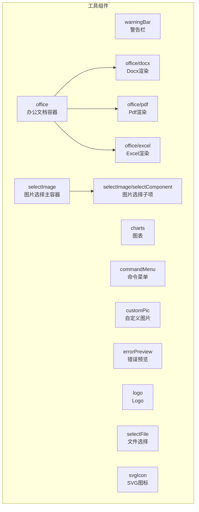
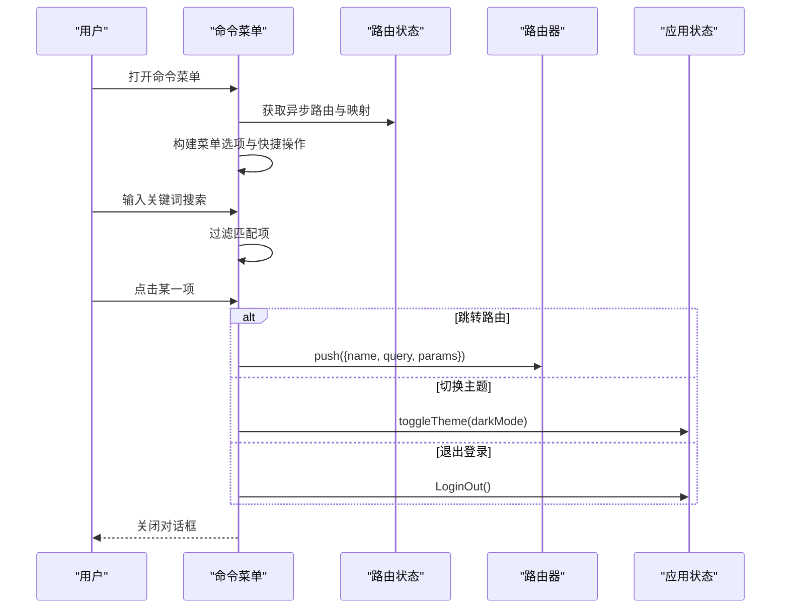
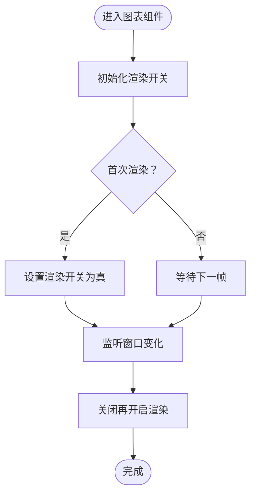
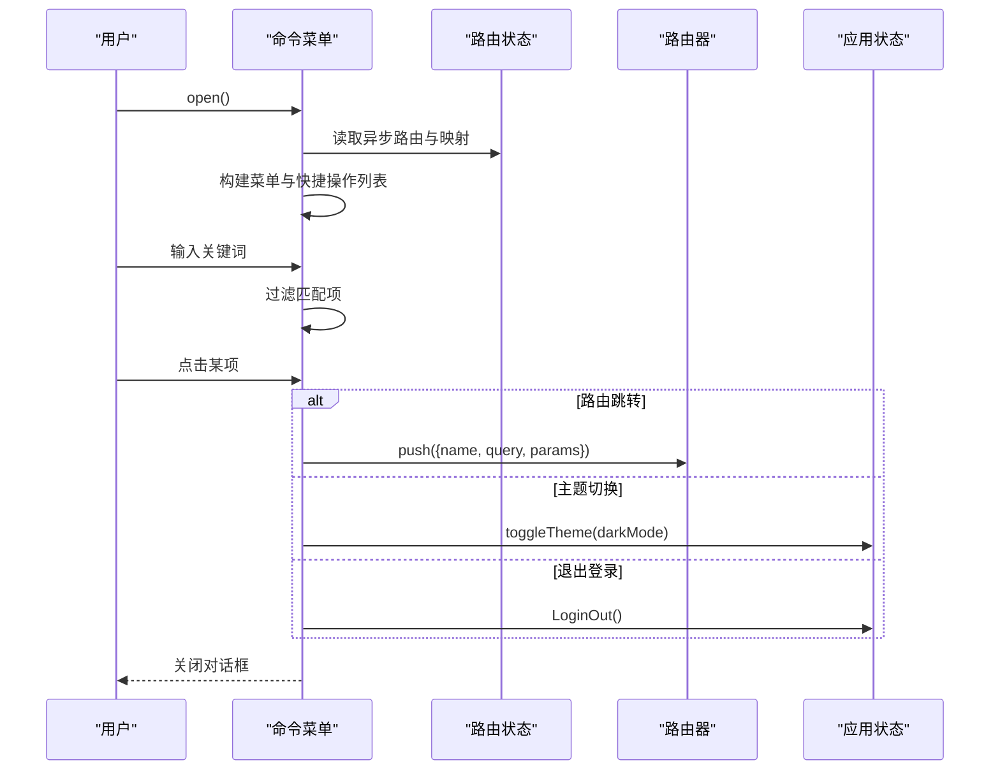
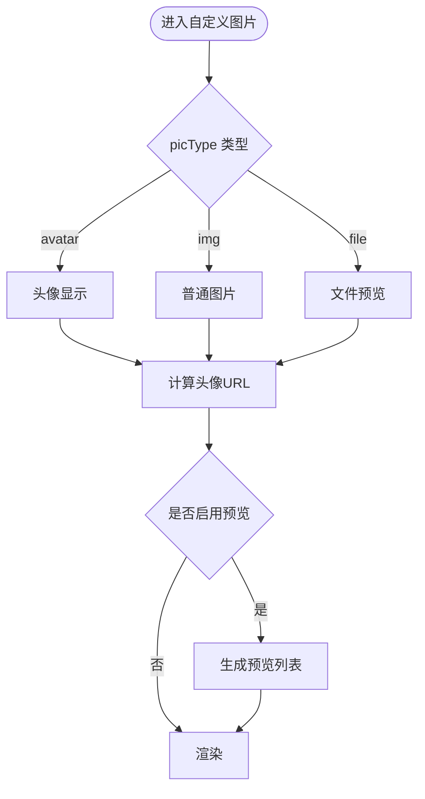
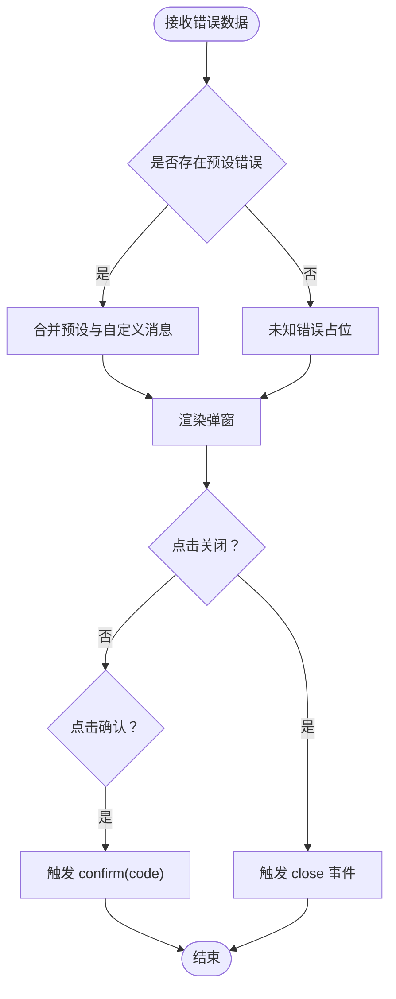
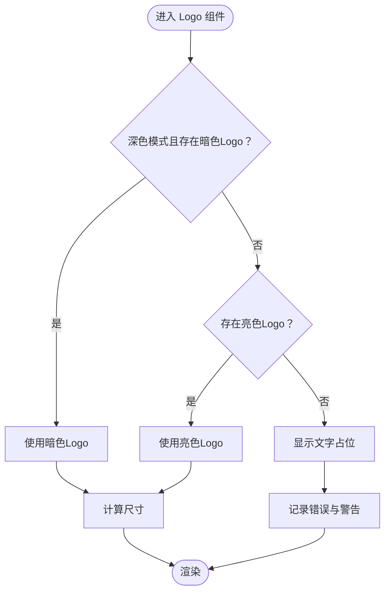
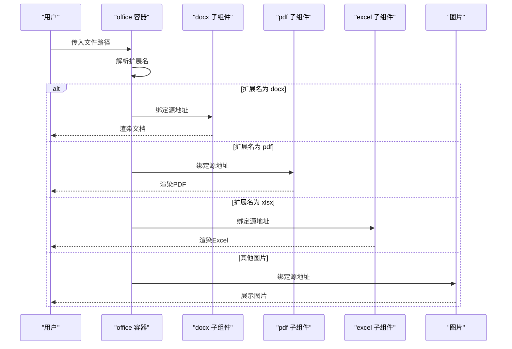
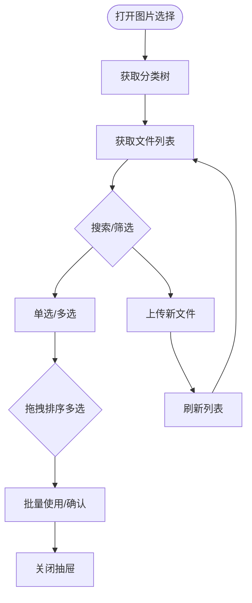
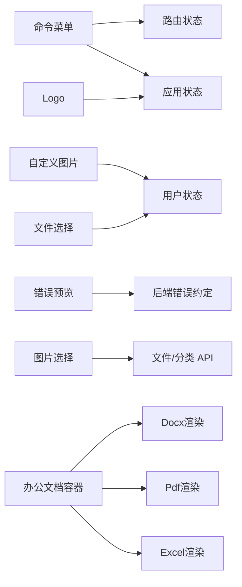

# 工具组件

<cite>
**本文引用的文件**
- [charts/index.vue](file://web/src/components/charts/index.vue)
- [commandMenu/index.vue](file://web/src/components/commandMenu/index.vue)
- [customPic/index.vue](file://web/src/components/customPic/index.vue)
- [errorPreview/index.vue](file://web/src/components/errorPreview/index.vue)
- [logo/index.vue](file://web/src/components/logo/index.vue)
- [office/index.vue](file://web/src/components/office/index.vue)
- [office/docx.vue](file://web/src/components/office/docx.vue)
- [office/pdf.vue](file://web/src/components/office/pdf.vue)
- [office/excel.vue](file://web/src/components/office/excel.vue)
- [selectFile/selectFile.vue](file://web/src/components/selectFile/selectFile.vue)
- [selectImage/selectImage.vue](file://web/src/components/selectImage/selectImage.vue)
- [selectImage/selectComponent.vue](file://web/src/components/selectImage/selectComponent.vue)
- [svgIcon/svgIcon.vue](file://web/src/components/svgIcon/svgIcon.vue)
- [warningBar/warningBar.vue](file://web/src/components/warningBar/warningBar.vue)
</cite>

## 目录
1. [简介](#简介)
2. [项目结构](#项目结构)
3. [核心组件](#核心组件)
4. [架构总览](#架构总览)
5. [详细组件分析](#详细组件分析)
6. [依赖分析](#依赖分析)
7. [性能考量](#性能考量)
8. [故障排查指南](#故障排查指南)
9. [结论](#结论)
10. [附录](#附录)

## 简介
本技术文档聚焦于前端工具组件系列，涵盖警告栏、图表、命令菜单、自定义头像/图片、错误预览、Logo、办公文档、文件选择、图片选择以及 SVG 图标等组件。文档从设计目的、功能特性、实现方式、配置参数、事件处理、样式定制、实际应用场景与组合使用示例等方面进行系统化梳理，帮助开发者快速理解与高效集成。

## 项目结构
这些工具组件主要位于前端工程 web/src/components 下，按功能域分组组织，便于复用与维护。下图展示与本专题相关的组件与文件关系：

**图表来源**
- [office/index.vue:1-50](file://web/src/components/office/index.vue#L1-L50)
- [office/docx.vue:1-32](file://web/src/components/office/docx.vue#L1-L32)
- [office/pdf.vue:1-40](file://web/src/components/office/pdf.vue#L1-L40)
- [office/excel.vue:1-37](file://web/src/components/office/excel.vue#L1-L37)
- [selectImage/selectImage.vue:1-504](file://web/src/components/selectImage/selectImage.vue#L1-L504)
- [selectImage/selectComponent.vue:1-87](file://web/src/components/selectImage/selectComponent.vue#L1-L87)

**章节来源**
- [charts/index.vue:1-48](file://web/src/components/charts/index.vue#L1-L48)
- [commandMenu/index.vue:1-196](file://web/src/components/commandMenu/index.vue#L1-L196)
- [customPic/index.vue:1-91](file://web/src/components/customPic/index.vue#L1-L91)
- [errorPreview/index.vue:1-127](file://web/src/components/errorPreview/index.vue#L1-L127)
- [logo/index.vue:1-83](file://web/src/components/logo/index.vue#L1-L83)
- [office/index.vue:1-50](file://web/src/components/office/index.vue#L1-L50)
- [office/docx.vue:1-32](file://web/src/components/office/docx.vue#L1-L32)
- [office/pdf.vue:1-40](file://web/src/components/office/pdf.vue#L1-L40)
- [office/excel.vue:1-37](file://web/src/components/office/excel.vue#L1-L37)
- [selectFile/selectFile.vue:1-88](file://web/src/components/selectFile/selectFile.vue#L1-L88)
- [selectImage/selectImage.vue:1-504](file://web/src/components/selectImage/selectImage.vue#L1-L504)
- [selectImage/selectComponent.vue:1-87](file://web/src/components/selectImage/selectComponent.vue#L1-L87)
- [svgIcon/svgIcon.vue:1-45](file://web/src/components/svgIcon/svgIcon.vue#L1-L45)
- [warningBar/warningBar.vue:1-34](file://web/src/components/warningBar/warningBar.vue#L1-L34)

## 核心组件
- 警告栏：用于在页面中以醒目的方式提示用户注意某些事项，支持点击打开外部链接。
- 图表：基于 vue-echarts 的轻量封装，自动处理窗口尺寸变化与首次渲染时机。
- 命令菜单：全局快捷搜索与跳转，支持主题切换与退出登录。
- 自定义图片：统一头像、图片、文件预览的显示逻辑，支持本地与远端资源。
- 错误预览：集中展示后端返回的错误码与提示，提供一键确认与关闭事件。
- Logo：根据主题动态加载不同路径的 Logo，缺失时回退为文字占位。
- 办公文档：根据扩展名自动选择 Docx/PDF/Excel/图片渲染器。
- 文件选择：通用文件上传选择器，支持限制数量、类型与令牌鉴权。
- 图片选择：带媒体库、分类树、分页、拖拽排序、裁剪与二维码上传的复杂选择器。
- SVG 图标：同时支持本地 symbol 与 Iconify 在线图标，便于统一风格与体积控制。

**章节来源**
- [warningBar/warningBar.vue:1-34](file://web/src/components/warningBar/warningBar.vue#L1-L34)
- [charts/index.vue:1-48](file://web/src/components/charts/index.vue#L1-L48)
- [commandMenu/index.vue:1-196](file://web/src/components/commandMenu/index.vue#L1-L196)
- [customPic/index.vue:1-91](file://web/src/components/customPic/index.vue#L1-L91)
- [errorPreview/index.vue:1-127](file://web/src/components/errorPreview/index.vue#L1-L127)
- [logo/index.vue:1-83](file://web/src/components/logo/index.vue#L1-L83)
- [office/index.vue:1-50](file://web/src/components/office/index.vue#L1-L50)
- [selectFile/selectFile.vue:1-88](file://web/src/components/selectFile/selectFile.vue#L1-L88)
- [selectImage/selectImage.vue:1-504](file://web/src/components/selectImage/selectImage.vue#L1-L504)
- [selectImage/selectComponent.vue:1-87](file://web/src/components/selectImage/selectComponent.vue#L1-L87)
- [svgIcon/svgIcon.vue:1-45](file://web/src/components/svgIcon/svgIcon.vue#L1-L45)

## 架构总览
以下序列图展示了“命令菜单”在用户触发后，如何收集路由与快捷操作、过滤匹配并最终导航或切换主题的流程。

**图表来源**
- [commandMenu/index.vue:113-146](file://web/src/components/commandMenu/index.vue#L113-L146)

**章节来源**
- [commandMenu/index.vue:1-196](file://web/src/components/commandMenu/index.vue#L1-L196)

## 详细组件分析

### 警告栏组件 warningBar
- 设计目的：在页面关键位置以高对比度样式提示用户，必要时可直接跳转到相关文档或页面。
- 功能特性：
  - 支持标题文本与可选的外链跳转。
  - 点击整块区域触发打开行为。
- 配置参数
  - title: 文本标题
  - href: 可选的外部链接地址
- 事件处理：无显式事件，点击行为由组件内部处理。
- 样式定制：基于 Tailwind 类名与深色模式类名组合，可覆盖背景、文字颜色与圆角。
- 实际场景：在表单顶部提示必填字段、权限不足提示、版本升级提醒等。
- 组合使用：可与表单组件配合，形成“提示-输入-反馈”的闭环。

**章节来源**
- [warningBar/warningBar.vue:1-34](file://web/src/components/warningBar/warningBar.vue#L1-L34)

### 图表组件 charts
- 设计目的：简化 ECharts 的使用，避免首屏闪烁与窗口变化导致的布局问题。
- 功能特性：
  - 通过受控的渲染开关实现首次渲染稳定。
  - 监听窗口尺寸变化，自动重绘。
  - 支持宽高与自动适配。
- 配置参数
  - options: 图表配置对象
  - autoResize: 是否监听窗口变化
  - width/height: 容器尺寸
- 事件处理：无对外事件；内部通过 ref 控制渲染生命周期。
- 样式定制：通过容器样式控制尺寸与布局。
- 实际场景：仪表盘、趋势图、统计面板等。
- 组合使用：与响应式钩子结合，适配不同屏幕尺寸。

**图表来源**
- [charts/index.vue:35-44](file://web/src/components/charts/index.vue#L35-L44)

**章节来源**
- [charts/index.vue:1-48](file://web/src/components/charts/index.vue#L1-L48)

### 命令菜单组件 commandMenu
- 设计目的：提供全局快捷搜索与跳转入口，提升操作效率。
- 功能特性：
  - 支持菜单项与快捷操作两类分组。
  - 搜索过滤：按标题关键字过滤。
  - 导航能力：支持内嵌路由与外链打开。
  - 主题切换与退出登录。
- 配置参数：无公开 props。
- 事件处理：
  - 对外暴露 open 方法。
  - 内部通过 Pinia 读取路由与用户状态。
- 样式定制：基于 Element Plus 对话框与输入框样式，支持深色模式。
- 实际场景：快速跳转到常用页面、切换主题、安全退出。
- 组合使用：可与全局快捷键绑定，或在菜单栏中唤起。

**图表来源**
- [commandMenu/index.vue:113-146](file://web/src/components/commandMenu/index.vue#L113-L146)

**章节来源**
- [commandMenu/index.vue:1-196](file://web/src/components/commandMenu/index.vue#L1-L196)

### 自定义图片组件 customPic
- 设计目的：统一头像、图片与文件预览的显示逻辑，兼容本地与远端资源。
- 功能特性：
  - 头像模式：优先用户头像，否则使用默认头像。
  - 图片模式：直接展示图片。
  - 文件模式：支持预览列表与传送挂载。
  - 自动拼接基础 API 路径。
- 配置参数
  - picType: avatar/img/file
  - picSrc: 可选的自定义图片地址
  - preview: 是否启用预览列表
- 事件处理：无对外事件。
- 样式定制：容器与图片尺寸通过 scoped 样式控制。
- 实际场景：用户资料卡片、商品图片、文件列表缩略图。
- 组合使用：与用户状态模块联动，动态更新头像。

**图表来源**
- [customPic/index.vue:53-75](file://web/src/components/customPic/index.vue#L53-L75)

**章节来源**
- [customPic/index.vue:1-91](file://web/src/components/customPic/index.vue#L1-L91)

### 错误预览组件 errorPreview
- 设计目的：对后端返回的错误码进行友好化展示，提供一键确认与关闭事件。
- 功能特性：
  - 预设常见错误类型与提示文案。
  - 支持自定义消息与提示。
  - 提供关闭与确认事件回调。
- 配置参数
  - errorData: 包含 code 与 message 的对象
- 事件处理
  - close: 关闭弹窗
  - confirm: 确认并携带错误码
- 样式定制：基于 Tailwind 与深色模式类名，支持边框与阴影。
- 实际场景：接口异常、网络错误、认证失败等。
- 组合使用：与全局错误拦截器配合，统一处理异常弹窗。

**图表来源**
- [errorPreview/index.vue:99-125](file://web/src/components/errorPreview/index.vue#L99-L125)

**章节来源**
- [errorPreview/index.vue:1-127](file://web/src/components/errorPreview/index.vue#L1-L127)

### Logo 组件 logo
- 设计目的：根据当前主题动态加载对应 Logo，若缺失则回退为文字占位。
- 功能特性：
  - 主题感知：深色模式优先尝试暗色 Logo。
  - 图片存在性检测：避免加载失败。
  - 尺寸控制：以 rem 为单位，按基准像素换算。
- 配置参数
  - size: 尺寸（单位 rem）
- 事件处理：无。
- 样式定制：支持滤镜与亮度调整以适配深色模式。
- 实际场景：侧边栏、页眉、登录页等。
- 组合使用：与应用状态模块联动，实时响应主题切换。

**图表来源**
- [logo/index.vue:33-55](file://web/src/components/logo/index.vue#L33-L55)

**章节来源**
- [logo/index.vue:1-83](file://web/src/components/logo/index.vue#L1-L83)

### 办公文档组件 office 及其子组件
- 设计目的：根据文件扩展名自动选择合适的渲染器，统一办公文档展示体验。
- 功能特性：
  - 容器组件：根据扩展名分发至 Docx/PDF/Excel/图片。
  - Docx：基于 @vue-office/docx 渲染 Word 文档。
  - PDF：基于 @vue-office/pdf 渲染 PDF。
  - Excel：基于 @vue-office/excel 渲染电子表格。
  - 图片：直接使用 el-image 展示静态图片。
- 配置参数
  - office 容器：v-model 绑定文件相对路径
  - 子组件：v-model 绑定源地址
- 事件处理：各子组件提供渲染完成与错误回调占位。
- 样式定制：子组件引入对应样式文件，容器组件负责尺寸与边框。
- 实际场景：合同预览、报表查看、审批附件等。
- 组合使用：与文件上传组件配合，实现“上传-预览-下载”闭环。

**图表来源**
- [office/index.vue:1-50](file://web/src/components/office/index.vue#L1-L50)
- [office/docx.vue:1-32](file://web/src/components/office/docx.vue#L1-L32)
- [office/pdf.vue:1-40](file://web/src/components/office/pdf.vue#L1-L40)
- [office/excel.vue:1-37](file://web/src/components/office/excel.vue#L1-L37)

**章节来源**
- [office/index.vue:1-50](file://web/src/components/office/index.vue#L1-L50)
- [office/docx.vue:1-32](file://web/src/components/office/docx.vue#L1-L32)
- [office/pdf.vue:1-40](file://web/src/components/office/pdf.vue#L1-L40)
- [office/excel.vue:1-37](file://web/src/components/office/excel.vue#L1-L37)

### 文件选择组件 selectFile
- 设计目的：提供通用的文件上传选择器，支持数量限制、类型限制与鉴权头。
- 功能特性：
  - 基于 Element Plus Upload 组件。
  - 自动拼接上传接口与令牌头。
  - 成功/失败回调与移除事件。
- 配置参数
  - limit: 最大上传数量
  - accept: 允许的文件类型
- 事件处理
  - on-success: 上传成功回调
  - on-error: 上传失败回调
- 样式定制：通过 scoped 类名覆盖默认样式。
- 实际场景：附件上传、批量导入、头像上传等。
- 组合使用：与后端文件上传接口对接，统一返回结构。

**章节来源**
- [selectFile/selectFile.vue:1-88](file://web/src/components/selectFile/selectFile.vue#L1-L88)

### 图片选择组件 selectImage 与子项 selectComponent
- 设计目的：提供完整的媒体库选择体验，支持分类、搜索、分页、拖拽排序、裁剪与二维码上传。
- 功能特性：
  - 主容器：抽屉式媒体库，左侧分类树，右侧列表与分页。
  - 子项：单图/视频占位与预览，支持删除与选择。
  - 交互：支持多选、拖拽排序、批量使用。
  - 上传：集成多种上传方式（通用、图片、裁剪、二维码）。
- 配置参数（主容器）
  - multiple: 是否多选
  - fileType: 限定 image/video
  - maxUpdateCount: 最大更新数量（0 表示无限制）
  - rounded: 是否圆形头像模式
- 事件处理：内部通过 Pinia 与 API 交互，向外暴露选择结果。
- 样式定制：Tailwind 与 scoped 样式结合，支持选中态与拖拽态。
- 实际场景：商品主图选择、评论图片、头像上传等。
- 组合使用：与文件上传、分类管理、媒体库 API 协同。

**图表来源**
- [selectImage/selectImage.vue:284-302](file://web/src/components/selectImage/selectImage.vue#L284-L302)
- [selectImage/selectComponent.vue:1-87](file://web/src/components/selectImage/selectComponent.vue#L1-L87)

**章节来源**
- [selectImage/selectImage.vue:1-504](file://web/src/components/selectImage/selectImage.vue#L1-L504)
- [selectImage/selectComponent.vue:1-87](file://web/src/components/selectImage/selectComponent.vue#L1-L87)

### SVG 图标组件 svgIcon
- 设计目的：统一图标使用方式，支持本地 symbol 与在线 Iconify 图标。
- 功能特性：
  - 本地图标：通过 xlink:href 引用已注册的 symbol。
  - 在线图标：通过 Iconify 组件按名称渲染。
  - 属性透传：class 与 style 透传给根元素。
- 配置参数
  - localIcon: 本地 symbol 名称
  - icon: Iconify 图标名称（如：mdi:home）
- 事件处理：无。
- 样式定制：通过传入的 class/style 控制尺寸与颜色。
- 实际场景：菜单图标、按钮图标、装饰图标等。
- 组合使用：与 Element Plus 图标库互补，满足不同图标来源需求。

**章节来源**
- [svgIcon/svgIcon.vue:1-45](file://web/src/components/svgIcon/svgIcon.vue#L1-L45)

## 依赖分析
- 组件内聚与耦合
  - charts 与 useWindowsResize 钩子耦合，关注尺寸变化。
  - commandMenu 与 Pinia 的应用状态、用户状态、路由状态耦合，关注全局导航。
  - customPic 与用户状态模块耦合，关注头像数据。
  - errorPreview 与后端错误码约定耦合，关注展示与事件。
  - logo 与应用状态模块耦合，关注主题切换。
  - office 容器与子组件强耦合，按扩展名分发。
  - selectFile 与用户状态模块耦合，关注令牌。
  - selectImage 与 API、Pinia、Element Plus 组件耦合，关注媒体库生态。
  - svgIcon 与 Iconify 库耦合，关注图标渲染。
- 外部依赖
  - vue-echarts、@vue-office/*、vuedraggable、@iconify/vue 等。
- 循环依赖
  - 未发现明显循环依赖，组件间通过 props/emits 通信。

**图表来源**
- [commandMenu/index.vue:46-51](file://web/src/components/commandMenu/index.vue#L46-L51)
- [customPic/index.vue:24-51](file://web/src/components/customPic/index.vue#L24-L51)
- [errorPreview/index.vue:68-97](file://web/src/components/errorPreview/index.vue#L68-L97)
- [logo/index.vue:3-18](file://web/src/components/logo/index.vue#L3-L18)
- [selectImage/selectImage.vue:153-168](file://web/src/components/selectImage/selectImage.vue#L153-L168)
- [selectFile/selectFile.vue:24-25](file://web/src/components/selectFile/selectFile.vue#L24-L25)
- [office/index.vue:26-28](file://web/src/components/office/index.vue#L26-L28)

**章节来源**
- [commandMenu/index.vue:1-196](file://web/src/components/commandMenu/index.vue#L1-L196)
- [customPic/index.vue:1-91](file://web/src/components/customPic/index.vue#L1-L91)
- [errorPreview/index.vue:1-127](file://web/src/components/errorPreview/index.vue#L1-L127)
- [logo/index.vue:1-83](file://web/src/components/logo/index.vue#L1-L83)
- [selectImage/selectImage.vue:1-504](file://web/src/components/selectImage/selectImage.vue#L1-L504)
- [selectFile/selectFile.vue:1-88](file://web/src/components/selectFile/selectFile.vue#L1-L88)
- [office/index.vue:1-50](file://web/src/components/office/index.vue#L1-L50)

## 性能考量
- 图表组件
  - 首次渲染与窗口变化重绘需谨慎，建议在大数据量场景下节流或虚拟化。
- 命令菜单
  - 搜索过滤应避免频繁深度遍历，可考虑缓存与防抖。
- 图片选择
  - 分页与懒加载至关重要；媒体库列表较大时建议启用虚拟滚动。
- 办公文档
  - Docx/PDF/Excel 渲染可能较重，建议在移动端谨慎启用或延迟加载。
- 自定义图片
  - 预览列表过大时，建议按需加载与缩略图策略。
- 错误预览
  - 弹窗仅在异常时出现，对整体性能影响较小。

## 故障排查指南
- Logo 未显示
  - 检查公共目录是否存在 logo.png（与暗色模式对应文件），确认路径正确。
  - 若缺失，组件会输出错误与警告日志，建议补充文件。
- 图表不渲染或尺寸异常
  - 确认容器尺寸与 autoResize 设置；检查窗口变化监听是否生效。
- 命令菜单无结果
  - 检查路由状态是否正确初始化；确认搜索关键词与 meta.title 匹配。
- 图片选择无法上传
  - 检查令牌是否有效；确认上传接口与 accept 类型匹配。
- 办公文档渲染失败
  - 检查文件路径是否拼接正确；确认对应渲染器已安装并引入样式。
- 错误预览未显示
  - 确认传入的错误码是否在预设集合中；检查事件回调是否正确绑定。

**章节来源**
- [logo/index.vue:47-54](file://web/src/components/logo/index.vue#L47-L54)
- [charts/index.vue:35-44](file://web/src/components/charts/index.vue#L35-L44)
- [commandMenu/index.vue:148-152](file://web/src/components/commandMenu/index.vue#L148-L152)
- [selectFile/selectFile.vue:79-86](file://web/src/components/selectFile/selectFile.vue#L79-L86)
- [office/index.vue:46-48](file://web/src/components/office/index.vue#L46-L48)
- [errorPreview/index.vue:99-116](file://web/src/components/errorPreview/index.vue#L99-L116)

## 结论
本工具组件系列围绕“统一、易用、可扩展”的目标设计，覆盖了日常开发中的高频场景。通过清晰的职责划分与合理的参数/事件抽象，既保证了组件的独立性，又便于在业务中灵活组合使用。建议在团队内制定统一的图标与主题规范，进一步提升一致性与可维护性。

## 附录
- 使用建议
  - 在大型列表场景中优先采用分页与懒加载策略。
  - 对外链跳转与主题切换等敏感操作，建议增加二次确认。
  - 统一错误处理与日志上报，便于问题追踪。
- 扩展方向
  - 可为图片选择增加“最近使用”与“收藏”能力。
  - 可为命令菜单增加“历史记录”与“常用操作”标签。
  - 可为办公文档增加“缩放/旋转/批注”等增强功能。