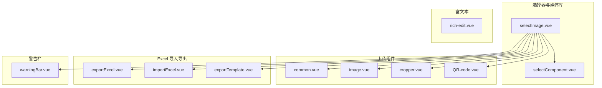
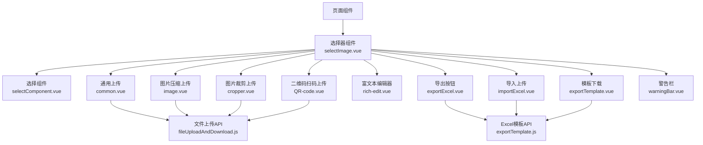
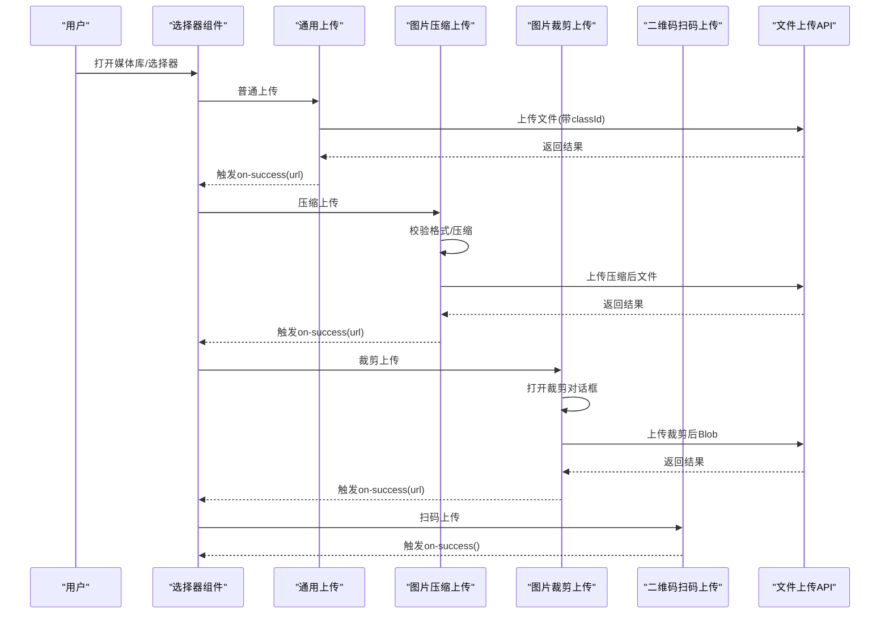
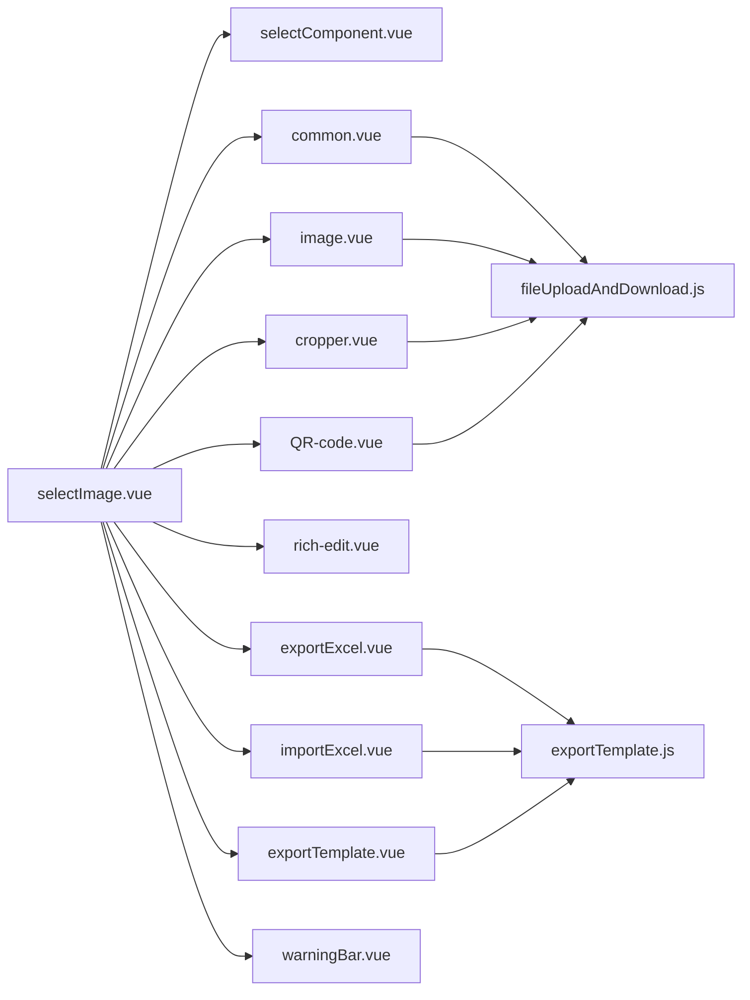

# 自定义组件

<cite>
**本文引用的文件**
- [selectImage.vue](file://web/src/components/selectImage/selectImage.vue)
- [selectComponent.vue](file://web/src/components/selectImage/selectComponent.vue)
- [common.vue](file://web/src/components/upload/common.vue)
- [image.vue](file://web/src/components/upload/image.vue)
- [cropper.vue](file://web/src/components/upload/cropper.vue)
- [QR-code.vue](file://web/src/components/upload/QR-code.vue)
- [rich-edit.vue](file://web/src/components/richtext/rich-edit.vue)
- [exportExcel.vue](file://web/src/components/exportExcel/exportExcel.vue)
- [importExcel.vue](file://web/src/components/exportExcel/importExcel.vue)
- [exportTemplate.vue](file://web/src/components/exportExcel/exportTemplate.vue)
- [warningBar.vue](file://web/src/components/warningBar/warningBar.vue)
- [image.js](file://web/src/utils/image.js)
- [fileUploadAndDownload.js](file://web/src/api/fileUploadAndDownload.js)
- [exportTemplate.js](file://web/src/api/exportTemplate.js)
</cite>

## 目录
1. [简介](#简介)
2. [项目结构](#项目结构)
3. [核心组件](#核心组件)
4. [架构总览](#架构总览)
5. [详细组件分析](#详细组件分析)
6. [依赖分析](#依赖分析)
7. [性能考量](#性能考量)
8. [故障排查指南](#故障排查指南)
9. [结论](#结论)
10. [附录](#附录)

## 简介
本技术文档聚焦于前端自定义组件体系，涵盖上传组件系列（通用上传、图片压缩上传、图片裁剪上传、二维码扫码上传）、富文本编辑器组件、Excel 导入导出组件以及警告栏组件。文档从设计思路、功能特性、实现原理、API 文档、使用示例、错误处理与性能优化等方面进行系统性阐述，并说明组件间的依赖关系与组合使用方式，帮助开发者快速理解与高效集成。

## 项目结构
自定义组件主要位于 web/src/components 下，按功能域划分：
- 上传组件：upload/
- 选择器与媒体库：selectImage/
- 富文本：richtext/
- Excel 导入导出：exportExcel/
- 警告栏：warningBar/

**图表来源**
- [selectImage.vue:1-504](file://web/src/components/selectImage/selectImage.vue#L1-L504)
- [common.vue:1-91](file://web/src/components/upload/common.vue#L1-L91)
- [image.vue:1-103](file://web/src/components/upload/image.vue#L1-L103)
- [cropper.vue:1-238](file://web/src/components/upload/cropper.vue#L1-L238)
- [QR-code.vue:1-66](file://web/src/components/upload/QR-code.vue#L1-L66)
- [rich-edit.vue:1-165](file://web/src/components/richtext/rich-edit.vue#L1-L165)
- [exportExcel.vue:1-85](file://web/src/components/exportExcel/exportExcel.vue#L1-L85)
- [importExcel.vue:1-46](file://web/src/components/exportExcel/importExcel.vue#L1-L46)
- [exportTemplate.vue:1-41](file://web/src/components/exportExcel/exportTemplate.vue#L1-L41)
- [warningBar.vue:1-34](file://web/src/components/warningBar/warningBar.vue#L1-L34)

**章节来源**
- [selectImage.vue:1-504](file://web/src/components/selectImage/selectImage.vue#L1-L504)
- [common.vue:1-91](file://web/src/components/upload/common.vue#L1-L91)
- [image.vue:1-103](file://web/src/components/upload/image.vue#L1-L103)
- [cropper.vue:1-238](file://web/src/components/upload/cropper.vue#L1-L238)
- [QR-code.vue:1-66](file://web/src/components/upload/QR-code.vue#L1-L66)
- [rich-edit.vue:1-165](file://web/src/components/richtext/rich-edit.vue#L1-L165)
- [exportExcel.vue:1-85](file://web/src/components/exportExcel/exportExcel.vue#L1-L85)
- [importExcel.vue:1-46](file://web/src/components/exportExcel/importExcel.vue#L1-L46)
- [exportTemplate.vue:1-41](file://web/src/components/exportExcel/exportTemplate.vue#L1-L41)
- [warningBar.vue:1-34](file://web/src/components/warningBar/warningBar.vue#L1-L34)

## 核心组件
- 上传组件系列：统一上传入口、图片压缩上传、图片裁剪上传、二维码扫码上传，覆盖常见文件上传场景。
- 选择器与媒体库：提供树形分类、搜索、分页、拖拽排序、批量选择、删除与重命名能力。
- 富文本编辑器：基于 wangEditor 的默认工具栏与编辑器，内置图片上传钩子，支持跨域与鉴权。
- Excel 导入导出：模板下载、条件导出、导入接口封装，支持分页与排序参数透传。
- 警告栏：轻量提示组件，支持点击打开外部链接。

**章节来源**
- [selectImage.vue:1-504](file://web/src/components/selectImage/selectImage.vue#L1-L504)
- [common.vue:1-91](file://web/src/components/upload/common.vue#L1-L91)
- [image.vue:1-103](file://web/src/components/upload/image.vue#L1-L103)
- [cropper.vue:1-238](file://web/src/components/upload/cropper.vue#L1-L238)
- [QR-code.vue:1-66](file://web/src/components/upload/QR-code.vue#L1-L66)
- [rich-edit.vue:1-165](file://web/src/components/richtext/rich-edit.vue#L1-L165)
- [exportExcel.vue:1-85](file://web/src/components/exportExcel/exportExcel.vue#L1-L85)
- [importExcel.vue:1-46](file://web/src/components/exportExcel/importExcel.vue#L1-L46)
- [exportTemplate.vue:1-41](file://web/src/components/exportExcel/exportTemplate.vue#L1-L41)
- [warningBar.vue:1-34](file://web/src/components/warningBar/warningBar.vue#L1-L34)

## 架构总览
组件间通过统一的上传与文件 API、Excel 模板 API 进行协作；选择器组件作为中枢，聚合多种上传方式与富文本编辑器，形成“选择器 + 多上传方式 + 富文本 + 导入导出”的工作流。

**图表来源**
- [selectImage.vue:1-504](file://web/src/components/selectImage/selectImage.vue#L1-L504)
- [common.vue:1-91](file://web/src/components/upload/common.vue#L1-L91)
- [image.vue:1-103](file://web/src/components/upload/image.vue#L1-L103)
- [cropper.vue:1-238](file://web/src/components/upload/cropper.vue#L1-L238)
- [QR-code.vue:1-66](file://web/src/components/upload/QR-code.vue#L1-L66)
- [rich-edit.vue:1-165](file://web/src/components/richtext/rich-edit.vue#L1-L165)
- [exportExcel.vue:1-85](file://web/src/components/exportExcel/exportExcel.vue#L1-L85)
- [importExcel.vue:1-46](file://web/src/components/exportExcel/importExcel.vue#L1-L46)
- [exportTemplate.vue:1-41](file://web/src/components/exportExcel/exportTemplate.vue#L1-L41)
- [warningBar.vue:1-34](file://web/src/components/warningBar/warningBar.vue#L1-L34)
- [fileUploadAndDownload.js:1-67](file://web/src/api/fileUploadAndDownload.js#L1-L67)
- [exportTemplate.js:1-146](file://web/src/api/exportTemplate.js#L1-L146)

## 详细组件分析

### 上传组件系列

#### 通用上传（common.vue）
- 设计思路：提供基础文件上传入口，限制文件类型与大小，支持多选与分类标记。
- 关键特性：
  - 类型校验：仅允许图片与视频 MIME 类型。
  - 大小限制：图片与视频分别限制，超限提示。
  - 事件回调：上传成功触发 on-success，携带文件 URL。
- API 文档
  - 属性
    - classId: number, 默认 0
  - 事件
    - on-success(url): 上传成功回调
- 使用示例
  - 在媒体库中作为“普通上传”按钮使用，自动带入当前分类 classId。
- 错误处理
  - 不支持的类型、超限、上传失败均弹出消息提示。
- 性能优化
  - 建议在业务侧对图片进行压缩后再上传，减少带宽占用。

**章节来源**
- [common.vue:1-91](file://web/src/components/upload/common.vue#L1-L91)
- [image.js:109-127](file://web/src/utils/image.js#L109-L127)

#### 图片压缩上传（image.vue）
- 设计思路：针对图片进行压缩与尺寸调整，满足大图上传前的预处理。
- 关键特性：
  - 格式限制：仅 JPG/PNG。
  - 压缩阈值：超过 fileSize（KB）时触发压缩。
  - 尺寸上限：按 maxWH 等比缩放。
  - 成功回调：返回压缩后的文件 URL。
- API 文档
  - 属性
    - imageUrl: string, 默认空
    - fileSize: number, 默认 2048 KB
    - maxWH: number, 默认 1920 px
    - classId: number, 默认 0
  - 事件
    - on-success(url)
- 使用示例
  - 适用于头像、缩略图等场景，提升上传成功率与加载速度。
- 错误处理
  - 格式不符、超限、压缩失败时提示并阻止上传。
- 性能优化
  - 合理设置 fileSize 与 maxWH，避免过度压缩导致清晰度下降。

**章节来源**
- [image.vue:1-103](file://web/src/components/upload/image.vue#L1-L103)
- [image.js:1-92](file://web/src/utils/image.js#L1-L92)

#### 图片裁剪上传（cropper.vue）
- 设计思路：提供可视化图片裁剪与旋转缩放，支持多种预设比例与实时预览。
- 关键特性：
  - 裁剪区域：固定比例或自由比例切换。
  - 缩放与旋转：支持放大缩小与 90° 旋转。
  - 上传流程：裁剪完成后生成 Blob，再走 Element Plus 上传。
  - 成功回调：返回裁剪后的文件 URL。
- API 文档
  - 属性
    - classId: number, 默认 0
  - 事件
    - on-success(url)
- 使用示例
  - 适用于需要固定比例的头像、封面等场景。
- 错误处理
  - 非图片文件、超大文件、裁剪失败时提示并阻断上传。
- 性能优化
  - 控制图片最大尺寸与裁剪区域，减少内存占用。

**章节来源**
- [cropper.vue:1-238](file://web/src/components/upload/cropper.vue#L1-L238)

#### 二维码扫码上传（QR-code.vue）
- 设计思路：生成包含上传入口参数的二维码，移动端扫码跳转至扫描上传页面。
- 关键特性：
  - 参数拼接：协议、主机、分类 ID、用户 Token、时间戳。
  - 完成回调：触发父组件 on-success。
- API 文档
  - 属性
    - classId: number, 默认 0
  - 事件
    - on-success()
- 使用示例
  - 在媒体库中作为“扫码上传”入口，生成可分享的二维码。
- 错误处理
  - 无直接上传逻辑，异常由后端或页面处理。
- 性能优化
  - 二维码内容尽量精简，避免过长导致识别困难。

**章节来源**
- [QR-code.vue:1-66](file://web/src/components/upload/QR-code.vue#L1-L66)

#### 上传组件流程（序列图）

**图表来源**
- [selectImage.vue:1-504](file://web/src/components/selectImage/selectImage.vue#L1-L504)
- [common.vue:1-91](file://web/src/components/upload/common.vue#L1-L91)
- [image.vue:1-103](file://web/src/components/upload/image.vue#L1-L103)
- [cropper.vue:1-238](file://web/src/components/upload/cropper.vue#L1-L238)
- [QR-code.vue:1-66](file://web/src/components/upload/QR-code.vue#L1-L66)
- [fileUploadAndDownload.js:1-67](file://web/src/api/fileUploadAndDownload.js#L1-L67)

### 选择器与媒体库（selectImage.vue + selectComponent.vue）

#### 设计思路
- 提供统一的选择器入口，支持单选与多选、拖拽排序、批量选择、分类树、搜索、分页与文件操作。
- 聚合多种上传方式，便于用户在同一界面完成素材选择与上传。

#### 关键特性
- 单/多选模式切换，多选支持拖拽排序与批量选择。
- 分类树支持增删改查，文件列表支持重命名、删除、视频预览。
- 上传成功后自动刷新列表，保持数据一致性。

#### API 文档
- 属性
  - multiple: boolean, 默认 false
  - fileType: string, 可选 image/video，限制可用上传方式
  - maxUpdateCount: number, 多选最大数量，0 表示不限
  - rounded: boolean, 圆角样式
- 事件
  - chooseItem: 打开选择器
  - deleteItem: 删除项
- 插槽
  - 无内置插槽，通过组合多个上传组件实现扩展。

#### 使用示例
- 在表单中作为图片/视频字段的输入控件，配合分类树与上传组件使用。

#### 错误处理
- 类型不匹配、删除确认、网络错误均有明确提示与回滚。

#### 性能优化
- 列表分页加载，避免一次性渲染过多文件；拖拽排序时确保 model 为数组类型。

**章节来源**
- [selectImage.vue:1-504](file://web/src/components/selectImage/selectImage.vue#L1-L504)
- [selectComponent.vue](file://web/src/components/selectImage/selectComponent.vue)

### 富文本编辑器（rich-edit.vue）
- 设计思路：基于 wangEditor 的默认工具栏与编辑器，内置图片上传钩子，支持跨域与鉴权。
- 关键特性：
  - 工具栏默认配置，编辑器默认高度。
  - 图片上传：通过自定义插入函数将后端返回的 URL 插入到编辑器。
  - 响应式绑定：双向绑定 modelValue，变更时同步触发 change 与 update:modelValue。
- API 文档
  - 属性
    - modelValue: string, 默认空
  - 事件
    - change(editor): 编辑器内容变化
    - update:modelValue(html): 双向绑定更新
- 使用示例
  - 在详情页或内容管理中作为富文本输入控件使用。

- 错误处理
  - 上传失败时弹出错误消息，编辑器保持原状。

- 性能优化
  - 合理设置占位符与菜单配置，避免不必要的渲染开销。

**章节来源**
- [rich-edit.vue:1-165](file://web/src/components/richtext/rich-edit.vue#L1-L165)

### Excel 导入导出（exportExcel.vue + importExcel.vue + exportTemplate.vue）
- 设计思路：提供模板下载、条件导出、导入上传的完整闭环，参数透传至后端。
- 关键特性：
  - 导出：根据模板 ID 与条件参数生成导出任务，完成后自动下载。
  - 模板下载：一键下载标准模板文件。
  - 导入：Element Plus Upload 组件直连后端导入接口，成功后触发回调。
- API 文档
  - 导出组件（exportExcel.vue）
    - 属性
      - templateId: string, 必填
      - condition: object, 默认 {}
      - filterDeleted: boolean, 默认 true
      - limit: number, 默认 0
      - offset: number, 默认 0
      - order: string, 默认空
    - 事件
      - 无
  - 导入组件（importExcel.vue）
    - 属性
      - templateId: string, 必填
    - 事件
      - on-success: 导入成功回调
  - 模板下载（exportTemplate.vue）
    - 属性
      - templateId: string, 必填
    - 事件
      - 无
- 使用示例
  - 在数据管理页面提供“下载模板 -> 填写数据 -> 导入 -> 条件导出”的完整流程。

- 错误处理
  - 模板 ID 为空、请求失败、导入失败均有消息提示。

- 性能优化
  - 导出时合理设置 limit/offset 与 order，避免一次性导出大量数据。

**章节来源**
- [exportExcel.vue:1-85](file://web/src/components/exportExcel/exportExcel.vue#L1-L85)
- [importExcel.vue:1-46](file://web/src/components/exportExcel/importExcel.vue#L1-L46)
- [exportTemplate.vue:1-41](file://web/src/components/exportExcel/exportTemplate.vue#L1-L41)
- [exportTemplate.js:100-146](file://web/src/api/exportTemplate.js#L100-L146)

### 警告栏（warningBar.vue）
- 设计思路：轻量提示组件，支持点击打开外部链接，常用于引导用户查看文档或规则。
- API 文档
  - 属性
    - title: string, 默认空
    - href: string, 默认空
  - 事件
    - 无
- 使用示例
  - 在表单顶部展示重要提示，点击跳转到相关页面。

- 错误处理
  - 无复杂逻辑，异常由浏览器处理。

- 性能优化
  - 无状态组件，渲染成本极低。

**章节来源**
- [warningBar.vue:1-34](file://web/src/components/warningBar/warningBar.vue#L1-L34)

## 依赖分析
- 组件内聚与耦合
  - 上传组件彼此独立，通过统一的文件上传 API 耦合。
  - 选择器组件聚合多种上传方式，承担“门面”角色。
  - 富文本编辑器与上传组件解耦，通过事件回调联动。
  - Excel 导入导出组件依赖模板 API，参数透传至后端。
- 外部依赖
  - Element Plus UI 组件库
  - vue-cropper 图片裁剪
  - vue-qr 二维码生成
  - wangEditor 富文本编辑器
  - axios 请求封装（通过 utils/request）

**图表来源**
- [selectImage.vue:1-504](file://web/src/components/selectImage/selectImage.vue#L1-L504)
- [common.vue:1-91](file://web/src/components/upload/common.vue#L1-L91)
- [image.vue:1-103](file://web/src/components/upload/image.vue#L1-L103)
- [cropper.vue:1-238](file://web/src/components/upload/cropper.vue#L1-L238)
- [QR-code.vue:1-66](file://web/src/components/upload/QR-code.vue#L1-L66)
- [rich-edit.vue:1-165](file://web/src/components/richtext/rich-edit.vue#L1-L165)
- [exportExcel.vue:1-85](file://web/src/components/exportExcel/exportExcel.vue#L1-L85)
- [importExcel.vue:1-46](file://web/src/components/exportExcel/importExcel.vue#L1-L46)
- [exportTemplate.vue:1-41](file://web/src/components/exportExcel/exportTemplate.vue#L1-L41)
- [warningBar.vue:1-34](file://web/src/components/warningBar/warningBar.vue#L1-L34)
- [fileUploadAndDownload.js:1-67](file://web/src/api/fileUploadAndDownload.js#L1-L67)
- [exportTemplate.js:1-146](file://web/src/api/exportTemplate.js#L1-L146)

## 性能考量
- 上传阶段
  - 图片压缩与裁剪会增加前端计算开销，建议在移动端谨慎启用大尺寸裁剪。
  - 通用上传与图片上传均对文件类型与大小进行严格校验，避免无效请求。
- 列表渲染
  - 选择器采用分页与懒加载策略，避免一次性渲染过多节点。
  - 多选拖拽排序时确保数据类型正确，减少不必要的响应式更新。
- 富文本
  - 图片上传采用异步插入，避免阻塞编辑器渲染。
- Excel 导出
  - 合理设置 limit/offset 与 order，避免一次性导出大数据集。
  - 模板下载与导出任务创建后立即触发下载，减少等待时间。

## 故障排查指南
- 上传失败
  - 检查文件类型与大小限制，确认是否符合要求。
  - 查看网络请求与后端返回信息，定位具体错误原因。
- 裁剪上传异常
  - 确认图片文件有效且未超过大小限制。
  - 检查裁剪区域设置与预览是否正常。
- 富文本图片插入失败
  - 确认后端返回结构与 URL 可访问性。
  - 检查跨域与鉴权头是否正确传递。
- Excel 导入/导出问题
  - 确认模板 ID 是否填写正确。
  - 检查参数编码与分页参数是否符合后端预期。
- 警告栏无法跳转
  - 检查 href 是否为空或无效链接。

**章节来源**
- [common.vue:76-90](file://web/src/components/upload/common.vue#L76-L90)
- [image.vue:69-74](file://web/src/components/upload/image.vue#L69-L74)
- [cropper.vue:202-229](file://web/src/components/upload/cropper.vue#L202-L229)
- [rich-edit.vue:55-69](file://web/src/components/richtext/rich-edit.vue#L55-L69)
- [exportExcel.vue:40-83](file://web/src/components/exportExcel/exportExcel.vue#L40-L83)
- [importExcel.vue:37-44](file://web/src/components/exportExcel/importExcel.vue#L37-L44)
- [warningBar.vue:28-32](file://web/src/components/warningBar/warningBar.vue#L28-L32)

## 结论
本自定义组件体系以“选择器 + 多上传方式 + 富文本 + 导入导出 + 警告栏”为核心，围绕文件与数据的采集、编辑、导出与提示展开，具备良好的扩展性与复用性。通过统一的 API 与参数规范，组件间协同高效，能够满足多数业务场景下的文件与内容管理需求。建议在实际使用中结合业务特点，合理配置参数与校验规则，持续优化性能与用户体验。

## 附录
- 组件组合使用建议
  - 表单中优先使用选择器组件，内部组合通用上传、图片压缩上传、图片裁剪上传与二维码扫码上传，满足不同素材需求。
  - 富文本编辑器与 Excel 导入导出组件可并行使用，形成“内容编辑 -> 数据导入/导出”的完整工作流。
  - 警告栏用于关键提示与引导，建议放置在表单或列表的显眼位置。