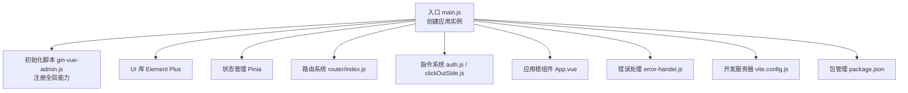
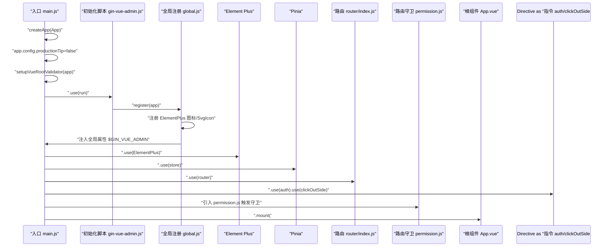
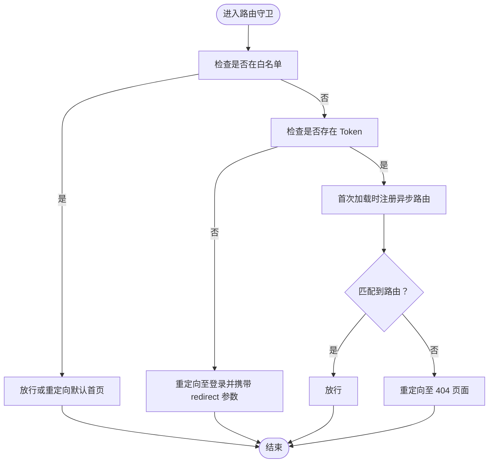
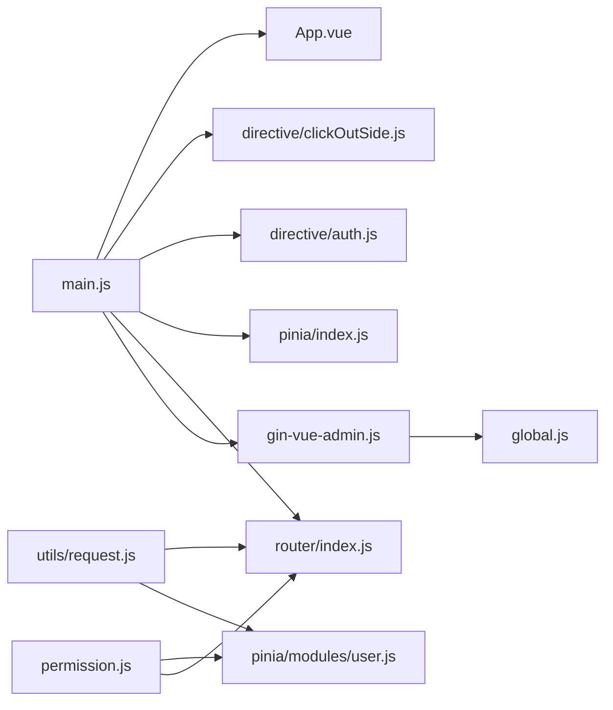

# Vue 应用结构

<cite>
**本文引用的文件**
- [web/src/main.js](file://web/src/main.js)
- [web/src/core/gin-vue-admin.js](file://web/src/core/gin-vue-admin.js)
- [web/src/core/global.js](file://web/src/core/global.js)
- [web/src/App.vue](file://web/src/App.vue)
- [web/src/router/index.js](file://web/src/router/index.js)
- [web/src/permission.js](file://web/src/permission.js)
- [web/src/pinia/index.js](file://web/src/pinia/index.js)
- [web/src/pinia/modules/app.js](file://web/src/pinia/modules/app.js)
- [web/src/pinia/modules/user.js](file://web/src/pinia/modules/user.js)
- [web/src/directive/auth.js](file://web/src/directive/auth.js)
- [web/src/directive/clickOutSide.js](file://web/src/directive/clickOutSide.js)
- [web/src/utils/request.js](file://web/src/utils/request.js)
- [web/src/core/error-handel.js](file://web/src/core/error-handel.js)
- [web/vite.config.js](file://web/vite.config.js)
- [web/package.json](file://web/package.json)
- [web/src/core/config.js](file://web/src/core/config.js)
- [web/src/utils/env.js](file://web/src/utils/env.js)
</cite>

## 目录
1. [引言](#引言)
2. [项目结构](#项目结构)
3. [核心组件](#核心组件)
4. [架构总览](#架构总览)
5. [详细组件分析](#详细组件分析)
6. [依赖分析](#依赖分析)
7. [性能考量](#性能考量)
8. [故障排查指南](#故障排查指南)
9. [结论](#结论)
10. [附录](#附录)

## 引言
本文件面向 Vue 3 前端工程，系统性梳理 gin-vue-admin 的应用初始化流程与核心结构，重点覆盖：
- 应用实例创建与初始化脚本作用
- 插件注册机制与全局配置
- Element Plus 集成、路由系统挂载、状态管理器配置、指令系统注册
- 关键配置项（生产提示关闭、多 DOM 校验器）
- 最佳实践（模块化组织、依赖注入、错误处理）
- 调试技巧与性能优化建议

## 项目结构
前端位于 web 目录，采用 Vite + Vue 3 + Pinia + Vue Router + Element Plus 的组合。入口文件负责创建应用实例、注册插件、挂载路由与状态管理，并通过 gin-vue-admin 初始化脚本集中注入全局能力。

图表来源
- [web/src/main.js:1-38](file://web/src/main.js#L1-L38)
- [web/src/core/gin-vue-admin.js:1-30](file://web/src/core/gin-vue-admin.js#L1-L30)
- [web/src/router/index.js:1-42](file://web/src/router/index.js#L1-L42)
- [web/src/pinia/index.js:1-9](file://web/src/pinia/index.js#L1-L9)
- [web/src/directive/auth.js:1-26](file://web/src/directive/auth.js#L1-L26)
- [web/src/directive/clickOutSide.js:1-44](file://web/src/directive/clickOutSide.js#L1-L44)
- [web/src/App.vue:1-47](file://web/src/App.vue#L1-L47)
- [web/src/core/error-handel.js:1-25](file://web/src/core/error-handel.js#L1-L25)
- [web/vite.config.js:1-119](file://web/vite.config.js#L1-L119)
- [web/package.json:1-88](file://web/package.json#L1-L88)

章节来源
- [web/src/main.js:1-38](file://web/src/main.js#L1-L38)
- [web/src/core/gin-vue-admin.js:1-30](file://web/src/core/gin-vue-admin.js#L1-L30)
- [web/src/router/index.js:1-42](file://web/src/router/index.js#L1-L42)
- [web/src/pinia/index.js:1-9](file://web/src/pinia/index.js#L1-L9)
- [web/src/directive/auth.js:1-26](file://web/src/directive/auth.js#L1-L26)
- [web/src/directive/clickOutSide.js:1-44](file://web/src/directive/clickOutSide.js#L1-L44)
- [web/src/App.vue:1-47](file://web/src/App.vue#L1-L47)
- [web/src/core/error-handel.js:1-25](file://web/src/core/error-handel.js#L1-L25)
- [web/vite.config.js:1-119](file://web/vite.config.js#L1-L119)
- [web/package.json:1-88](file://web/package.json#L1-L88)

## 核心组件
- 应用入口与初始化
  - main.js：创建应用实例、关闭生产提示、启用多 DOM 校验器、注册插件与挂载根组件。
  - gin-vue-admin.js：作为插件安装全局能力（注册图标、注入全局属性、打印欢迎信息）。
  - global.js：统一注册 Element Plus 图标、SVG 图标组件、注入全局配置对象。
- UI 与主题
  - App.vue：通过 Element Plus ConfigProvider 提供语言与尺寸配置，承载路由视图与应用级组件。
- 路由系统
  - router/index.js：定义基础路由与历史模式；permission.js：动态路由注册与路由守卫。
- 状态管理
  - pinia/index.js：创建 Pinia 实例并导出常用 Store。
  - modules/app.js：应用配置 Store（主题、尺寸、标签页、水印等）。
  - modules/user.js：用户会话 Store（登录、登出、令牌、用户信息）。
- 指令系统
  - auth.js：权限指令，根据用户权限决定元素是否渲染。
  - clickOutSide.js：点击外部指令，支持排除列表与回调。
- 请求与错误处理
  - utils/request.js：封装 Axios，统一请求/响应拦截、加载态、错误提示与 401 处理。
  - core/error-handel.js：捕获未处理异常并上报错误记录。
- 构建与开发
  - vite.config.js：开发服务器、代理、构建优化、插件链。
  - package.json：依赖与脚本。

章节来源
- [web/src/main.js:1-38](file://web/src/main.js#L1-L38)
- [web/src/core/gin-vue-admin.js:1-30](file://web/src/core/gin-vue-admin.js#L1-L30)
- [web/src/core/global.js:1-64](file://web/src/core/global.js#L1-L64)
- [web/src/App.vue:1-47](file://web/src/App.vue#L1-L47)
- [web/src/router/index.js:1-42](file://web/src/router/index.js#L1-L42)
- [web/src/permission.js:1-225](file://web/src/permission.js#L1-L225)
- [web/src/pinia/index.js:1-9](file://web/src/pinia/index.js#L1-L9)
- [web/src/pinia/modules/app.js:1-163](file://web/src/pinia/modules/app.js#L1-L163)
- [web/src/pinia/modules/user.js:1-151](file://web/src/pinia/modules/user.js#L1-L151)
- [web/src/directive/auth.js:1-26](file://web/src/directive/auth.js#L1-L26)
- [web/src/directive/clickOutSide.js:1-44](file://web/src/directive/clickOutSide.js#L1-L44)
- [web/src/utils/request.js:1-232](file://web/src/utils/request.js#L1-L232)
- [web/src/core/error-handel.js:1-25](file://web/src/core/error-handel.js#L1-L25)
- [web/vite.config.js:1-119](file://web/vite.config.js#L1-L119)
- [web/package.json:1-88](file://web/package.json#L1-L88)

## 架构总览
应用初始化的关键流程如下：

图表来源
- [web/src/main.js:1-38](file://web/src/main.js#L1-L38)
- [web/src/core/gin-vue-admin.js:1-30](file://web/src/core/gin-vue-admin.js#L1-L30)
- [web/src/core/global.js:1-64](file://web/src/core/global.js#L1-L64)
- [web/src/router/index.js:1-42](file://web/src/router/index.js#L1-L42)
- [web/src/permission.js:1-225](file://web/src/permission.js#L1-L225)
- [web/src/App.vue:1-47](file://web/src/App.vue#L1-L47)

## 详细组件分析

### 应用初始化与 gin-vue-admin 核心脚本
- 初始化脚本职责
  - 在插件 install 钩子中调用 register(app)，完成图标注册与全局属性注入。
  - 打印版本与社区信息，便于开发与运维识别。
- 全局注册机制
  - 统一注册 Element Plus 图标与 SVG 图标组件，支持插件目录扩展。
  - 将配置对象注入为全局属性，供组件与指令读取。
- 生产提示与多 DOM 校验
  - 关闭生产提示，减少控制台冗余输出。
  - 启用多 DOM 校验器，帮助定位重复挂载问题。

章节来源
- [web/src/core/gin-vue-admin.js:1-30](file://web/src/core/gin-vue-admin.js#L1-L30)
- [web/src/core/global.js:1-64](file://web/src/core/global.js#L1-L64)
- [web/src/main.js:1-38](file://web/src/main.js#L1-L38)

### Element Plus UI 集成与主题配置
- 集成方式
  - 在入口文件中注册 Element Plus 插件。
  - 在根组件中通过 ConfigProvider 提供语言与全局尺寸配置。
- 主题与暗色模式
  - 应用配置 Store 提供主题开关、色弱/灰色模式、主色、布局尺寸等。
  - 通过监听器同步到 HTML 属性，驱动样式切换。

章节来源
- [web/src/main.js:1-38](file://web/src/main.js#L1-L38)
- [web/src/App.vue:1-47](file://web/src/App.vue#L1-L47)
- [web/src/pinia/modules/app.js:1-163](file://web/src/pinia/modules/app.js#L1-L163)

### 路由系统挂载与动态路由
- 基础路由
  - 定义登录、初始化、扫描上传等静态路由，设置默认重定向与兜底页面。
- 动态路由与权限守卫
  - 路由守卫在 beforeEach 中处理白名单、登录态、异步路由注册与默认首页跳转。
  - 支持客户端直连页面、NProgress 进度条、页面标题设置与 Keep-alive 管理。
  - 提供扁平化算法将菜单树转换为 layout 下的二级路由并安全注册。

图表来源
- [web/src/permission.js:1-225](file://web/src/permission.js#L1-L225)
- [web/src/router/index.js:1-42](file://web/src/router/index.js#L1-L42)

章节来源
- [web/src/router/index.js:1-42](file://web/src/router/index.js#L1-L42)
- [web/src/permission.js:1-225](file://web/src/permission.js#L1-L225)

### 状态管理器配置（Pinia）
- Store 组织
  - app.js：应用配置 Store，含主题、尺寸、标签页、水印、布局参数与重置逻辑。
  - user.js：用户 Store，封装登录、登出、令牌、用户信息与默认首页跳转。
- 依赖注入
  - main.js 通过 .use(store) 注入 Pinia 实例，各模块按需使用 defineStore。
- 与路由联动
  - 登录成功后注册异步路由并跳转至默认首页；用户信息变更影响应用配置。

章节来源
- [web/src/pinia/index.js:1-9](file://web/src/pinia/index.js#L1-L9)
- [web/src/pinia/modules/app.js:1-163](file://web/src/pinia/modules/app.js#L1-L163)
- [web/src/pinia/modules/user.js:1-151](file://web/src/pinia/modules/user.js#L1-L151)
- [web/src/main.js:1-38](file://web/src/main.js#L1-L38)

### 指令系统注册
- 权限指令 auth
  - 根据用户权限 ID 判断是否渲染元素，支持否定修饰符。
- 点击外部指令 clickOutside
  - 监听文档级鼠标/触摸事件，支持排除列表与回调对象，生命周期内自动解绑。

章节来源
- [web/src/directive/auth.js:1-26](file://web/src/directive/auth.js#L1-L26)
- [web/src/directive/clickOutSide.js:1-44](file://web/src/directive/clickOutSide.js#L1-L44)
- [web/src/main.js:1-38](file://web/src/main.js#L1-L38)

### 请求与错误处理
- 请求封装
  - 统一设置 baseURL、超时、请求头（含令牌与用户 ID）、加载态控制。
  - 响应拦截处理新令牌、消息提示与 401 登出。
- 错误上报
  - 捕获未处理 Promise 拒绝，构造错误信息并通过接口上报。

章节来源
- [web/src/utils/request.js:1-232](file://web/src/utils/request.js#L1-L232)
- [web/src/core/error-handel.js:1-25](file://web/src/core/error-handel.js#L1-L25)

### 配置与构建要点
- 生产提示关闭
  - 在入口设置 app.config.productionTip=false。
- 多 DOM 校验器
  - 使用 setupVueRootValidator(app, { lang: 'zh' })。
- 构建优化
  - Vite 配置开启代理、压缩、清理 console、Rollup 输出命名策略、UnoCSS、svg 自动导入等。
- 环境判断
  - utils/env 提供开发/生产环境常量，便于条件编译与调试。

章节来源
- [web/src/main.js:1-38](file://web/src/main.js#L1-L38)
- [web/vite.config.js:1-119](file://web/vite.config.js#L1-L119)
- [web/src/utils/env.js:1-4](file://web/src/utils/env.js#L1-L4)

## 依赖分析
- 模块耦合
  - main.js 作为控制中心，依赖 gin-vue-admin 初始化脚本、全局注册、路由、状态管理与指令。
  - permission.js 依赖 user 与 router Store，实现动态路由与守卫。
  - request.js 依赖 user Store 与 Element Plus 提示组件。
- 外部依赖
  - Vue 3、Element Plus、Pinia、Vue Router、Axios、NProgress、UnoCSS 等。

图表来源
- [web/src/main.js:1-38](file://web/src/main.js#L1-L38)
- [web/src/core/gin-vue-admin.js:1-30](file://web/src/core/gin-vue-admin.js#L1-L30)
- [web/src/core/global.js:1-64](file://web/src/core/global.js#L1-L64)
- [web/src/router/index.js:1-42](file://web/src/router/index.js#L1-L42)
- [web/src/pinia/index.js:1-9](file://web/src/pinia/index.js#L1-L9)
- [web/src/directive/auth.js:1-26](file://web/src/directive/auth.js#L1-L26)
- [web/src/directive/clickOutSide.js:1-44](file://web/src/directive/clickOutSide.js#L1-L44)
- [web/src/App.vue:1-47](file://web/src/App.vue#L1-L47)
- [web/src/permission.js:1-225](file://web/src/permission.js#L1-L225)
- [web/src/pinia/modules/user.js:1-151](file://web/src/pinia/modules/user.js#L1-L151)
- [web/src/utils/request.js:1-232](file://web/src/utils/request.js#L1-L232)

## 性能考量
- 路由懒加载
  - 路由组件采用动态导入，减少首屏体积。
- 请求并发与加载态
  - request.js 通过计数与定时器控制加载态显示，避免频繁闪烁与内存泄漏。
- 构建优化
  - Terser 去除 console 与 debugger；Rollup 输出稳定命名；代理与预构建减少开发时抖动。
- 主题与图标
  - 统一注册图标，避免重复组件实例化；主题切换通过 CSS 类切换，避免强制重排。

章节来源
- [web/src/router/index.js:1-42](file://web/src/router/index.js#L1-L42)
- [web/src/utils/request.js:1-232](file://web/src/utils/request.js#L1-L232)
- [web/vite.config.js:1-119](file://web/vite.config.js#L1-L119)

## 故障排查指南
- 多实例挂载
  - 启用多 DOM 校验器，定位重复挂载问题。
- 登录后无路由
  - 检查 permission.js 中异步路由注册与默认首页配置。
- 请求失败或 401
  - 查看 request.js 拦截器与 401 处理逻辑，确认令牌与用户信息是否正确写入。
- 错误上报
  - 未处理异常会在 error-handel.js 中上报，结合后端接口定位问题。

章节来源
- [web/src/main.js:1-38](file://web/src/main.js#L1-L38)
- [web/src/permission.js:1-225](file://web/src/permission.js#L1-L225)
- [web/src/utils/request.js:1-232](file://web/src/utils/request.js#L1-L232)
- [web/src/core/error-handel.js:1-25](file://web/src/core/error-handel.js#L1-L25)

## 结论
gin-vue-admin 的前端结构以 main.js 为核心，通过 gin-vue-admin 初始化脚本完成全局能力注入，配合 Element Plus、Pinia、Vue Router 与自定义指令形成清晰的初始化与运行时流程。权限与路由联动、统一请求与错误处理进一步提升了系统的可维护性与稳定性。建议在实际项目中遵循模块化组织、依赖注入与错误处理最佳实践，并结合构建优化与调试工具持续改进性能与体验。

## 附录
- 最佳实践清单
  - 模块化：将初始化、全局注册、指令、路由守卫拆分为独立模块，降低耦合。
  - 依赖注入：通过插件与 Store 统一注入，避免全局变量污染。
  - 错误处理：统一拦截器、错误上报与兜底提示，保障用户体验。
  - 调试：利用多 DOM 校验器、环境常量与开发工具链快速定位问题。
  - 性能：懒加载、请求节流、构建优化与主题切换最小化重排。