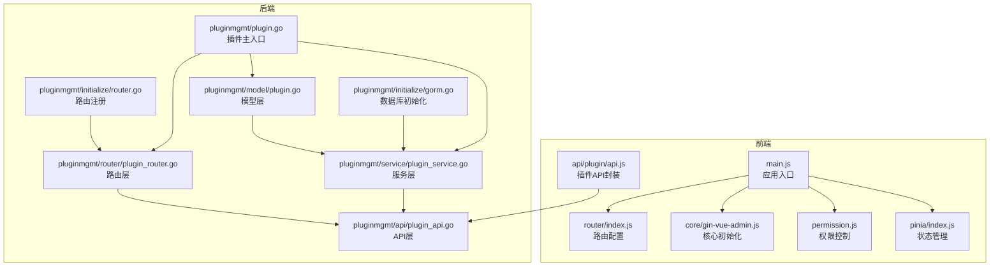
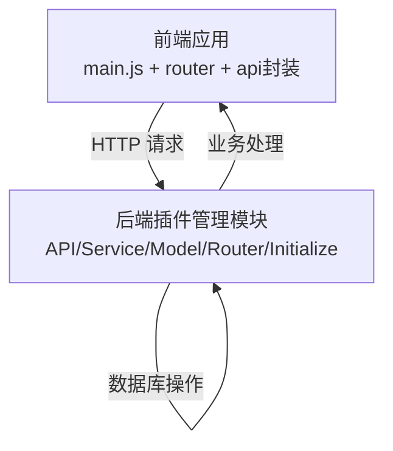
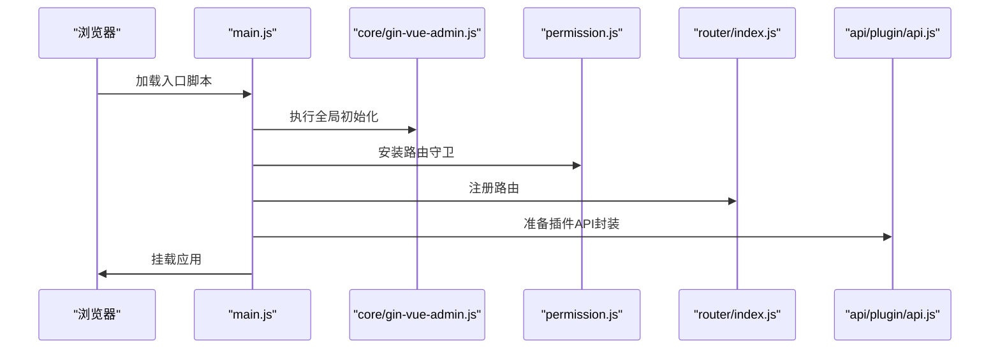
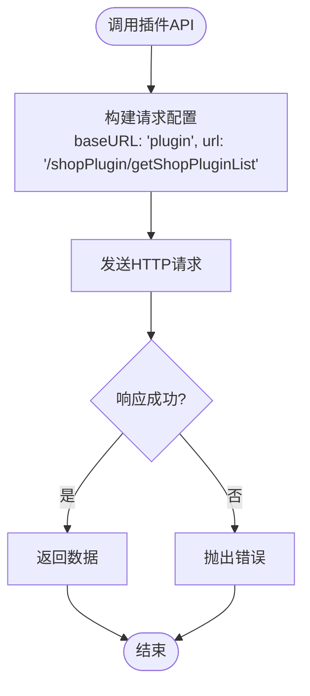
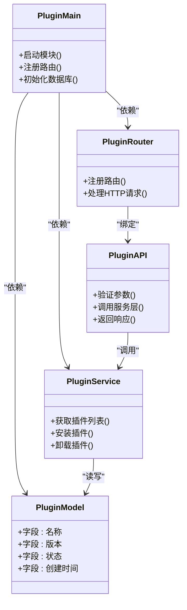
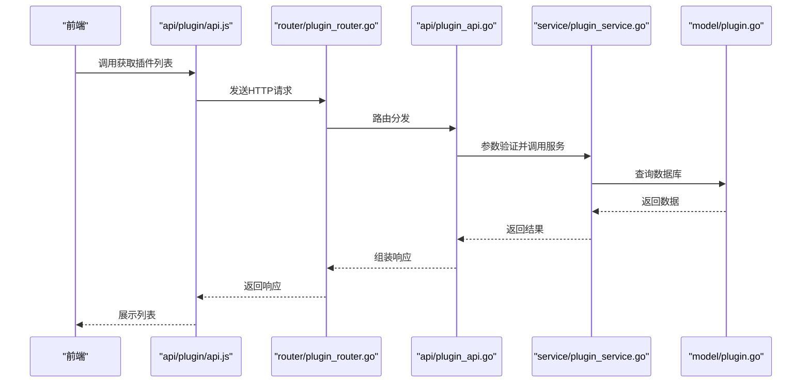
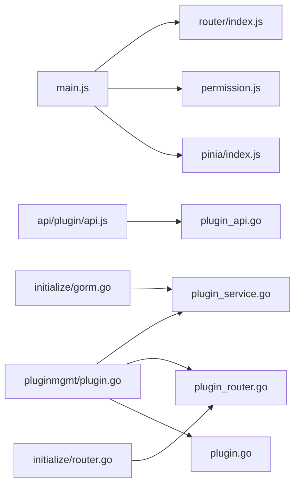

# Vue 插件管理界面

<cite>
**本文档引用的文件**
- [web/src/api/plugin/api.js](file://web/src/api/plugin/api.js)
- [web/src/router/index.js](file://web/src/router/index.js)
- [web/src/main.js](file://web/src/main.js)
- [web/src/core/gin-vue-admin.js](file://web/src/core/gin-vue-admin.js)
- [web/src/permission.js](file://web/src/permission.js)
- [web/src/pinia/index.js](file://web/src/pinia/index.js)
- [server/plugin/pluginmgmt/plugin.go](file://server/plugin/pluginmgmt/plugin.go)
- [server/plugin/pluginmgmt/service/plugin_service.go](file://server/plugin/pluginmgmt/service/plugin_service.go)
- [server/plugin/pluginmgmt/router/plugin_router.go](file://server/plugin/pluginmgmt/router/plugin_router.go)
- [server/plugin/pluginmgmt/model/plugin.go](file://server/plugin/pluginmgmt/model/plugin.go)
- [server/plugin/pluginmgmt/api/plugin_api.go](file://server/plugin/pluginmgmt/api/plugin_api.go)
- [server/plugin/pluginmgmt/initialize/gorm.go](file://server/plugin/pluginmgmt/initialize/gorm.go)
- [server/plugin/pluginmgmt/initialize/router.go](file://server/plugin/pluginmgmt/initialize/router.go)
</cite>

## 目录
1. [简介](#简介)
2. [项目结构](#项目结构)
3. [核心组件](#核心组件)
4. [架构总览](#架构总览)
5. [详细组件分析](#详细组件分析)
6. [依赖关系分析](#依赖关系分析)
7. [性能考虑](#性能考虑)
8. [故障排除指南](#故障排除指南)
9. [结论](#结论)

## 简介
本文件面向 Vue 插件管理界面，基于 gin-vue-admin 项目的现有插件系统实现进行深入解析。该系统采用前后端分离架构：前端使用 Vue 3 + Element Plus 构建用户界面与交互；后端通过 Gin 框架提供 RESTful API，插件管理模块位于 server/plugin/pluginmgmt 目录下，包含 API、服务层、路由与模型定义。前端通过统一的请求封装对接后端插件接口，实现插件列表查询等核心功能。

## 项目结构
前端项目主要由以下关键部分组成：
- 应用入口与初始化：main.js 负责创建 Vue 应用、安装插件（路由、状态管理、指令）、挂载根组件
- 路由系统：router/index.js 定义基础路由与错误页重定向
- 插件 API 封装：api/plugin/api.js 提供插件相关接口的请求方法
- 核心初始化：core/gin-vue-admin.js 执行全局初始化流程
- 权限控制：permission.js 实现路由守卫与权限校验
- 状态管理：pinia/index.js 管理全局状态

后端插件管理模块位于 server/plugin/pluginmgmt，包含：
- 插件主入口：plugin.go
- 服务层：service/plugin_service.go
- 路由层：router/plugin_router.go
- 模型层：model/plugin.go
- API 层：api/plugin_api.go
- 初始化：initialize/gorm.go、initialize/router.go

**图表来源**
- [web/src/main.js:1-38](file://web/src/main.js#L1-L38)
- [web/src/router/index.js:1-42](file://web/src/router/index.js#L1-L42)
- [web/src/api/plugin/api.js:1-10](file://web/src/api/plugin/api.js#L1-L10)
- [web/src/core/gin-vue-admin.js](file://web/src/core/gin-vue-admin.js)
- [web/src/permission.js](file://web/src/permission.js)
- [web/src/pinia/index.js](file://web/src/pinia/index.js)
- [server/plugin/pluginmgmt/plugin.go](file://server/plugin/pluginmgmt/plugin.go)
- [server/plugin/pluginmgmt/service/plugin_service.go](file://server/plugin/pluginmgmt/service/plugin_service.go)
- [server/plugin/pluginmgmt/router/plugin_router.go](file://server/plugin/pluginmgmt/router/plugin_router.go)
- [server/plugin/pluginmgmt/model/plugin.go](file://server/plugin/pluginmgmt/model/plugin.go)
- [server/plugin/pluginmgmt/api/plugin_api.go](file://server/plugin/pluginmgmt/api/plugin_api.go)
- [server/plugin/pluginmgmt/initialize/gorm.go](file://server/plugin/pluginmgmt/initialize/gorm.go)
- [server/plugin/pluginmgmt/initialize/router.go](file://server/plugin/pluginmgmt/initialize/router.go)

**章节来源**
- [web/src/main.js:1-38](file://web/src/main.js#L1-L38)
- [web/src/router/index.js:1-42](file://web/src/router/index.js#L1-L42)
- [web/src/api/plugin/api.js:1-10](file://web/src/api/plugin/api.js#L1-L10)
- [server/plugin/pluginmgmt/plugin.go](file://server/plugin/pluginmgmt/plugin.go)

## 核心组件
- 应用入口与初始化
  - main.js 创建 Vue 应用，安装路由、状态管理、Element Plus、自定义指令与权限控制，最后挂载到 DOM
  - core/gin-vue-admin.js 执行全局初始化流程（如国际化、主题、全局配置等）
  - permission.js 实现路由守卫，结合后端权限策略控制页面访问
  - pinia/index.js 提供全局状态管理能力
- 路由系统
  - router/index.js 定义基础路由（登录、初始化、错误页等），并设置默认跳转规则
- 插件 API 封装
  - api/plugin/api.js 封装了插件相关的网络请求，如获取商店插件列表，使用统一的请求客户端并指定插件模块的 base URL

**章节来源**
- [web/src/main.js:1-38](file://web/src/main.js#L1-L38)
- [web/src/core/gin-vue-admin.js](file://web/src/core/gin-vue-admin.js)
- [web/src/permission.js](file://web/src/permission.js)
- [web/src/pinia/index.js](file://web/src/pinia/index.js)
- [web/src/router/index.js:1-42](file://web/src/router/index.js#L1-L42)
- [web/src/api/plugin/api.js:1-10](file://web/src/api/plugin/api.js#L1-L10)

## 架构总览
前端通过统一的请求封装调用后端插件 API，后端插件管理模块遵循 MVC 分层：API 层负责接收请求与返回响应，服务层处理业务逻辑，模型层映射数据库表结构，路由层注册 RESTful 路由，初始化模块完成数据库与路由的注册。

**图表来源**
- [web/src/api/plugin/api.js:1-10](file://web/src/api/plugin/api.js#L1-L10)
- [server/plugin/pluginmgmt/api/plugin_api.go](file://server/plugin/pluginmgmt/api/plugin_api.go)
- [server/plugin/pluginmgmt/service/plugin_service.go](file://server/plugin/pluginmgmt/service/plugin_service.go)
- [server/plugin/pluginmgmt/model/plugin.go](file://server/plugin/pluginmgmt/model/plugin.go)
- [server/plugin/pluginmgmt/router/plugin_router.go](file://server/plugin/pluginmgmt/router/plugin_router.go)
- [server/plugin/pluginmgmt/initialize/gorm.go](file://server/plugin/pluginmgmt/initialize/gorm.go)
- [server/plugin/pluginmgmt/initialize/router.go](file://server/plugin/pluginmgmt/initialize/router.go)

## 详细组件分析

### 前端组件分析

#### 应用入口与初始化流程
- main.js 负责应用实例创建、插件安装与挂载，确保路由、状态管理、权限控制与全局样式在应用启动时正确初始化
- core/gin-vue-admin.js 执行全局初始化，为后续组件与服务提供一致的运行环境
- permission.js 在导航阶段进行权限校验，避免无权访问页面
- pinia/index.js 提供全局状态管理，便于跨组件共享插件状态或用户信息

**图表来源**
- [web/src/main.js:1-38](file://web/src/main.js#L1-L38)
- [web/src/core/gin-vue-admin.js](file://web/src/core/gin-vue-admin.js)
- [web/src/permission.js](file://web/src/permission.js)
- [web/src/router/index.js:1-42](file://web/src/router/index.js#L1-L42)
- [web/src/api/plugin/api.js:1-10](file://web/src/api/plugin/api.js#L1-L10)

**章节来源**
- [web/src/main.js:1-38](file://web/src/main.js#L1-L38)
- [web/src/core/gin-vue-admin.js](file://web/src/core/gin-vue-admin.js)
- [web/src/permission.js](file://web/src/permission.js)
- [web/src/router/index.js:1-42](file://web/src/router/index.js#L1-L42)
- [web/src/api/plugin/api.js:1-10](file://web/src/api/plugin/api.js#L1-L10)

#### 插件 API 封装
- api/plugin/api.js 对插件相关接口进行封装，提供获取商店插件列表的方法，内部使用统一的请求客户端并设置插件模块的基础路径
- 该封装简化了前端对插件接口的调用，统一了请求参数与响应处理方式

**图表来源**
- [web/src/api/plugin/api.js:1-10](file://web/src/api/plugin/api.js#L1-L10)

**章节来源**
- [web/src/api/plugin/api.js:1-10](file://web/src/api/plugin/api.js#L1-L10)

### 后端组件分析

#### 插件管理模块架构
- 插件主入口：plugin.go 作为模块的聚合入口，协调服务层、路由层与模型层
- 服务层：service/plugin_service.go 实现业务逻辑，如插件列表查询、安装、卸载等
- 路由层：router/plugin_router.go 注册 RESTful 路由，将 HTTP 请求映射到对应的服务方法
- 模型层：model/plugin.go 定义数据库表结构与字段映射
- API 层：api/plugin_api.go 处理请求参数验证、调用服务层并返回响应
- 初始化：initialize/gorm.go 完成数据库连接与表结构初始化；initialize/router.go 完成路由注册

**图表来源**
- [server/plugin/pluginmgmt/plugin.go](file://server/plugin/pluginmgmt/plugin.go)
- [server/plugin/pluginmgmt/service/plugin_service.go](file://server/plugin/pluginmgmt/service/plugin_service.go)
- [server/plugin/pluginmgmt/router/plugin_router.go](file://server/plugin/pluginmgmt/router/plugin_router.go)
- [server/plugin/pluginmgmt/model/plugin.go](file://server/plugin/pluginmgmt/model/plugin.go)
- [server/plugin/pluginmgmt/api/plugin_api.go](file://server/plugin/pluginmgmt/api/plugin_api.go)

**章节来源**
- [server/plugin/pluginmgmt/plugin.go](file://server/plugin/pluginmgmt/plugin.go)
- [server/plugin/pluginmgmt/service/plugin_service.go](file://server/plugin/pluginmgmt/service/plugin_service.go)
- [server/plugin/pluginmgmt/router/plugin_router.go](file://server/plugin/pluginmgmt/router/plugin_router.go)
- [server/plugin/pluginmgmt/model/plugin.go](file://server/plugin/pluginmgmt/model/plugin.go)
- [server/plugin/pluginmgmt/api/plugin_api.go](file://server/plugin/pluginmgmt/api/plugin_api.go)
- [server/plugin/pluginmgmt/initialize/gorm.go](file://server/plugin/pluginmgmt/initialize/gorm.go)
- [server/plugin/pluginmgmt/initialize/router.go](file://server/plugin/pluginmgmt/initialize/router.go)

#### 插件列表查询流程
- 前端调用 api/plugin/api.js 中的插件列表方法
- 后端路由层将请求映射到 API 层
- API 层进行参数验证后调用服务层
- 服务层访问模型层执行数据库查询
- 返回结果给前端展示

**图表来源**
- [web/src/api/plugin/api.js:1-10](file://web/src/api/plugin/api.js#L1-L10)
- [server/plugin/pluginmgmt/router/plugin_router.go](file://server/plugin/pluginmgmt/router/plugin_router.go)
- [server/plugin/pluginmgmt/api/plugin_api.go](file://server/plugin/pluginmgmt/api/plugin_api.go)
- [server/plugin/pluginmgmt/service/plugin_service.go](file://server/plugin/pluginmgmt/service/plugin_service.go)
- [server/plugin/pluginmgmt/model/plugin.go](file://server/plugin/pluginmgmt/model/plugin.go)

**章节来源**
- [web/src/api/plugin/api.js:1-10](file://web/src/api/plugin/api.js#L1-L10)
- [server/plugin/pluginmgmt/router/plugin_router.go](file://server/plugin/pluginmgmt/router/plugin_router.go)
- [server/plugin/pluginmgmt/api/plugin_api.go](file://server/plugin/pluginmgmt/api/plugin_api.go)
- [server/plugin/pluginmgmt/service/plugin_service.go](file://server/plugin/pluginmgmt/service/plugin_service.go)
- [server/plugin/pluginmgmt/model/plugin.go](file://server/plugin/pluginmgmt/model/plugin.go)

## 依赖关系分析
- 前端依赖
  - main.js 依赖 router、permission、pinia、core 初始化与 Element Plus
  - api/plugin/api.js 依赖统一请求客户端，用于向后端插件模块发起请求
- 后端依赖
  - plugin.go 作为模块入口，依赖服务层、路由层与模型层
  - initialize/gorm.go 与 initialize/router.go 分别负责数据库与路由的初始化注册

**图表来源**
- [web/src/main.js:1-38](file://web/src/main.js#L1-L38)
- [web/src/router/index.js:1-42](file://web/src/router/index.js#L1-L42)
- [web/src/permission.js](file://web/src/permission.js)
- [web/src/pinia/index.js](file://web/src/pinia/index.js)
- [web/src/api/plugin/api.js:1-10](file://web/src/api/plugin/api.js#L1-L10)
- [server/plugin/pluginmgmt/plugin.go](file://server/plugin/pluginmgmt/plugin.go)
- [server/plugin/pluginmgmt/service/plugin_service.go](file://server/plugin/pluginmgmt/service/plugin_service.go)
- [server/plugin/pluginmgmt/router/plugin_router.go](file://server/plugin/pluginmgmt/router/plugin_router.go)
- [server/plugin/pluginmgmt/model/plugin.go](file://server/plugin/pluginmgmt/model/plugin.go)
- [server/plugin/pluginmgmt/initialize/gorm.go](file://server/plugin/pluginmgmt/initialize/gorm.go)
- [server/plugin/pluginmgmt/initialize/router.go](file://server/plugin/pluginmgmt/initialize/router.go)

**章节来源**
- [web/src/main.js:1-38](file://web/src/main.js#L1-L38)
- [web/src/api/plugin/api.js:1-10](file://web/src/api/plugin/api.js#L1-L10)
- [server/plugin/pluginmgmt/plugin.go](file://server/plugin/pluginmgmt/plugin.go)

## 性能考虑
- 前端
  - 使用懒加载路由组件，减少首屏加载体积
  - 统一请求封装可复用拦截器与缓存策略，降低重复请求
  - Pinia 状态管理按需更新，避免不必要的渲染
- 后端
  - 服务层应进行数据库查询优化，合理使用索引与分页
  - API 层参数校验前置，减少无效调用
  - 初始化模块仅在应用启动时执行，避免重复注册

## 故障排除指南
- 前端常见问题
  - 路由无法跳转：检查 router/index.js 的路由配置与默认跳转规则
  - 权限导致页面空白：检查 permission.js 的守卫逻辑与后端权限策略
  - 插件接口调用失败：确认 api/plugin/api.js 的 baseURL 与后端路由一致
- 后端常见问题
  - 路由未注册：检查 initialize/router.go 是否正确注册插件路由
  - 数据库连接异常：确认 initialize/gorm.go 的数据库配置与连接字符串
  - 服务层方法未生效：核对 plugin.go 是否正确引入服务层并暴露接口

**章节来源**
- [web/src/router/index.js:1-42](file://web/src/router/index.js#L1-L42)
- [web/src/permission.js](file://web/src/permission.js)
- [web/src/api/plugin/api.js:1-10](file://web/src/api/plugin/api.js#L1-L10)
- [server/plugin/pluginmgmt/initialize/router.go](file://server/plugin/pluginmgmt/initialize/router.go)
- [server/plugin/pluginmgmt/initialize/gorm.go](file://server/plugin/pluginmgmt/initialize/gorm.go)
- [server/plugin/pluginmgmt/plugin.go](file://server/plugin/pluginmgmt/plugin.go)

## 结论
本插件管理界面以清晰的前后端分层架构实现：前端通过统一的请求封装与路由守卫保障用户体验与安全，后端通过模块化的 API、服务、模型与初始化流程保证扩展性与可维护性。当前实现已具备插件列表查询的核心能力，后续可在服务层完善插件安装/卸载等更多功能，并在前端补充插件管理页面与状态展示。