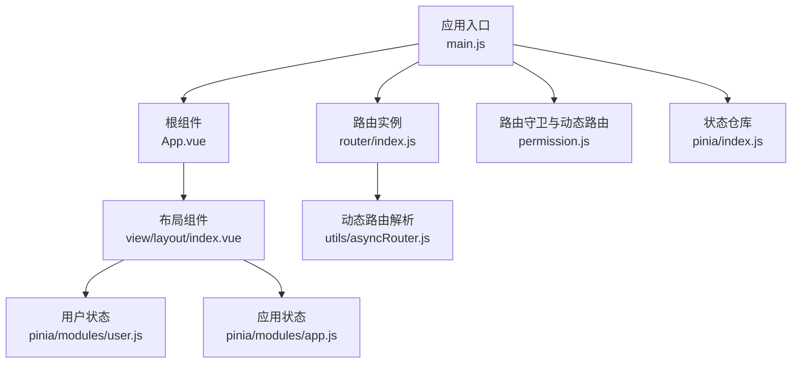
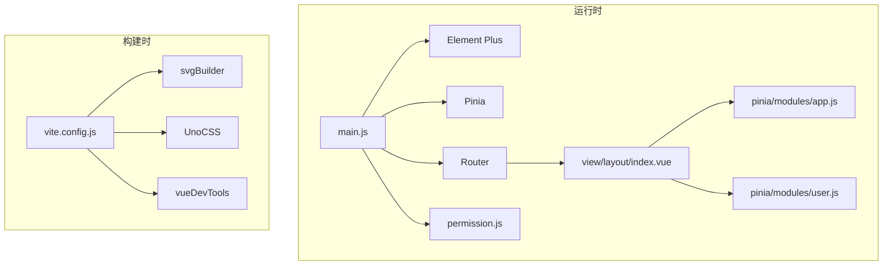
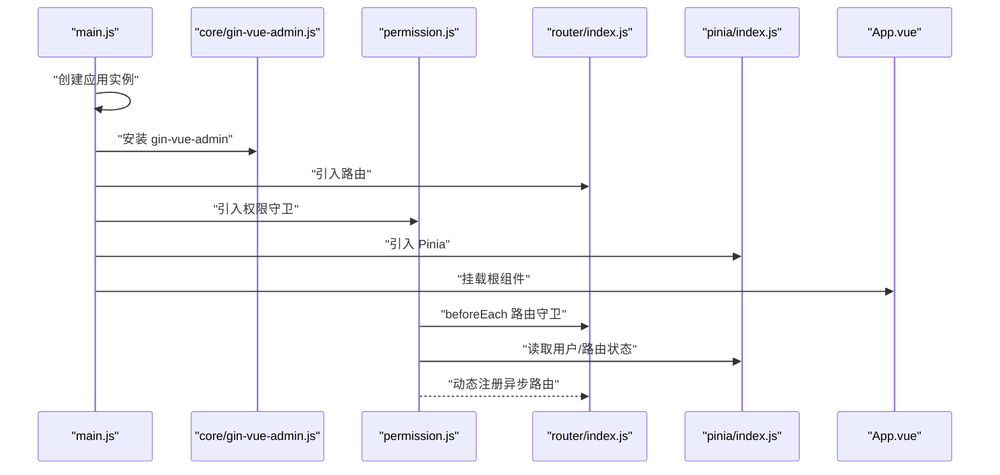
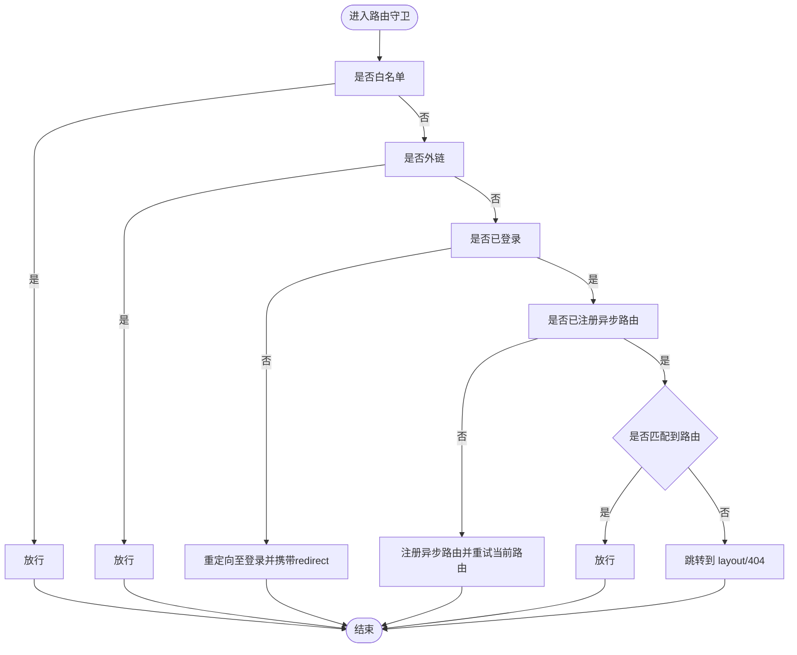
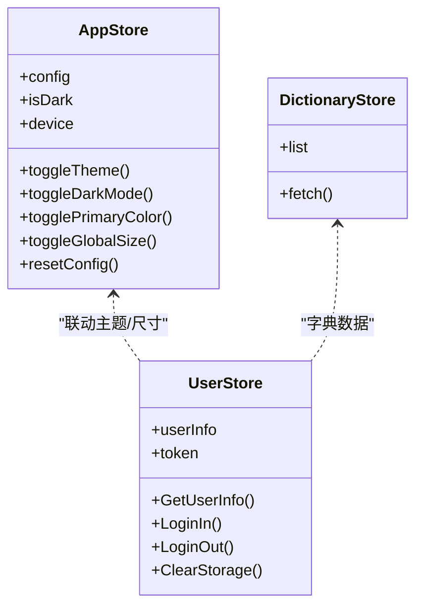
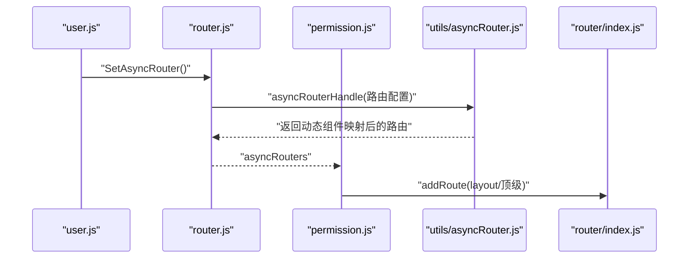
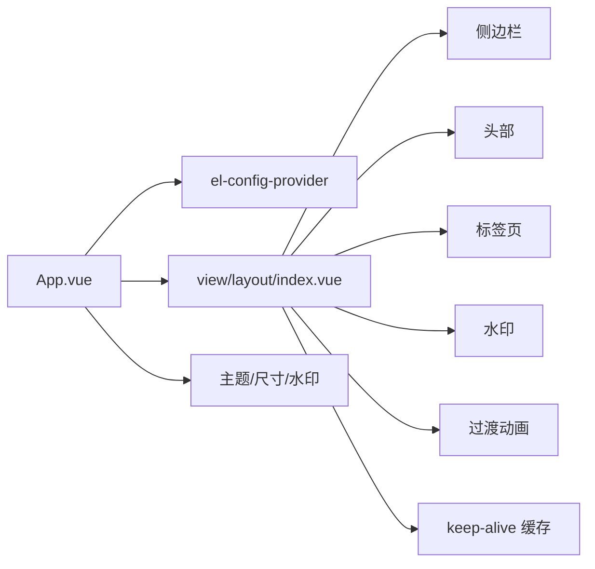
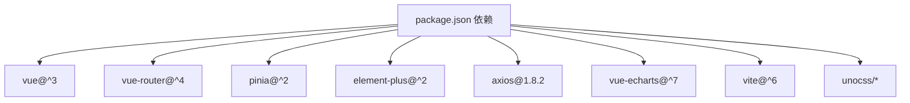

# 前端应用架构

<cite>
**本文引用的文件**
- [main.js](file://web/src/main.js)
- [App.vue](file://web/src/App.vue)
- [router/index.js](file://web/src/router/index.js)
- [pinia/index.js](file://web/src/pinia/index.js)
- [package.json](file://web/package.json)
- [core/gin-vue-admin.js](file://web/src/core/gin-vue-admin.js)
- [permission.js](file://web/src/permission.js)
- [pinia/modules/app.js](file://web/src/pinia/modules/app.js)
- [pinia/modules/user.js](file://web/src/pinia/modules/user.js)
- [utils/asyncRouter.js](file://web/src/utils/asyncRouter.js)
- [view/layout/index.vue](file://web/src/view/layout/index.vue)
- [components/svgIcon/svgIcon.vue](file://web/src/components/svgIcon/svgIcon.vue)
- [style/main.scss](file://web/src/style/main.scss)
- [vite.config.js](file://web/vite.config.js)
</cite>

## 目录
1. [引言](#引言)
2. [项目结构](#项目结构)
3. [核心组件](#核心组件)
4. [架构总览](#架构总览)
5. [详细组件分析](#详细组件分析)
6. [依赖分析](#依赖分析)
7. [性能考量](#性能考量)
8. [故障排查指南](#故障排查指南)
9. [结论](#结论)
10. [附录](#附录)

## 引言
本文件面向前端工程团队与技术管理者，系统性梳理基于 Vue 3 + Element Plus 的前端架构设计与实现细节。内容覆盖应用初始化流程、组件系统设计、状态管理（Pinia）、路由系统与权限控制、UI 组件库使用与定制、响应式与样式管理、组件开发规范、性能优化与调试技巧等。目标是在保证可读性的前提下，帮助读者快速理解并高效维护该前端体系。

## 项目结构
前端工程位于 web 目录，采用“按功能域分层 + 组合式 API”的组织方式：
- 应用入口与初始化：main.js、App.vue、core/gin-vue-admin.js
- 路由与权限：router/index.js、permission.js
- 状态管理：pinia/index.js、pinia/modules/*.js
- 工具与辅助：utils/*
- 视图与布局：view/layout、view/*、components/*
- 样式与主题：style/*.scss、style/element/*
- 构建与开发：vite.config.js、package.json

图表来源
- [main.js:1-38](file://web/src/main.js#L1-L38)
- [App.vue:1-47](file://web/src/App.vue#L1-L47)
- [router/index.js:1-42](file://web/src/router/index.js#L1-L42)
- [permission.js:1-225](file://web/src/permission.js#L1-L225)
- [pinia/index.js:1-9](file://web/src/pinia/index.js#L1-L9)
- [pinia/modules/app.js:1-163](file://web/src/pinia/modules/app.js#L1-L163)
- [pinia/modules/user.js:1-151](file://web/src/pinia/modules/user.js#L1-L151)
- [utils/asyncRouter.js:1-30](file://web/src/utils/asyncRouter.js#L1-L30)
- [view/layout/index.vue:1-119](file://web/src/view/layout/index.vue#L1-L119)

章节来源
- [main.js:1-38](file://web/src/main.js#L1-L38)
- [router/index.js:1-42](file://web/src/router/index.js#L1-L42)
- [pinia/index.js:1-9](file://web/src/pinia/index.js#L1-L9)
- [vite.config.js:1-119](file://web/vite.config.js#L1-L119)

## 核心组件
- 应用入口与初始化
  - main.js 负责创建应用实例、安装 Element Plus、Pinia、路由、指令与全局错误处理；引入 gin-vue-admin 初始化模块与权限守卫。
  - App.vue 作为根组件，提供 Element Plus 国际化与全局尺寸配置，并渲染路由视图与应用级提示组件。
- 路由与权限
  - router/index.js 定义基础静态路由（登录、初始化、扫码上传、兜底错误页等）。
  - permission.js 实现路由守卫、白名单控制、动态路由注册、页面标题与进度条管理、异常处理与移除初始加载动画。
- 状态管理
  - pinia/index.js 创建 Pinia 实例并导出多个模块 store。
  - app.js 提供主题、全局尺寸、标签页、水印、过渡动画等应用级配置与切换能力。
  - user.js 提供用户信息、令牌、登录登出、路由初始化与首页跳转、存储清理等用户态管理。
- 动态路由与视图加载
  - utils/asyncRouter.js 解析后端下发的路由配置，按约定路径动态导入视图组件。
- 布局与主题
  - view/layout/index.vue 提供头部、侧边栏、标签页、水印、过渡与缓存等布局能力。
  - style/main.scss 定义全局样式、滚动条、表格与按钮组等通用样式类。
  - components/svgIcon/svgIcon.vue 提供本地 SVG 与 Iconify 在线图标的统一组件。

章节来源
- [main.js:1-38](file://web/src/main.js#L1-L38)
- [App.vue:1-47](file://web/src/App.vue#L1-L47)
- [router/index.js:1-42](file://web/src/router/index.js#L1-L42)
- [permission.js:1-225](file://web/src/permission.js#L1-L225)
- [pinia/index.js:1-9](file://web/src/pinia/index.js#L1-L9)
- [pinia/modules/app.js:1-163](file://web/src/pinia/modules/app.js#L1-L163)
- [pinia/modules/user.js:1-151](file://web/src/pinia/modules/user.js#L1-L151)
- [utils/asyncRouter.js:1-30](file://web/src/utils/asyncRouter.js#L1-L30)
- [view/layout/index.vue:1-119](file://web/src/view/layout/index.vue#L1-L119)
- [style/main.scss:1-60](file://web/src/style/main.scss#L1-L60)
- [components/svgIcon/svgIcon.vue:1-45](file://web/src/components/svgIcon/svgIcon.vue#L1-L45)

## 架构总览
整体采用“组合式 API + 组织模块化”的架构风格，围绕以下关键点展开：
- 初始化：入口文件集中装配插件、指令、路由与状态，随后挂载应用。
- 路由：静态路由 + 动态路由（后端下发），结合路由守卫实现权限控制与页面标题、进度条管理。
- 状态：Pinia Store 分层管理用户态、应用态与字典态，配合持久化与主题切换。
- UI：Element Plus 作为主 UI 库，结合 UnoCSS 与自定义样式实现主题与响应式。
- 构建：Vite 驱动，插件化扩展（SVG 自动构建、Banner、路径信息、多 DOM 校验等）。

图表来源
- [main.js:1-38](file://web/src/main.js#L1-L38)
- [permission.js:1-225](file://web/src/permission.js#L1-L225)
- [view/layout/index.vue:1-119](file://web/src/view/layout/index.vue#L1-L119)
- [pinia/modules/app.js:1-163](file://web/src/pinia/modules/app.js#L1-L163)
- [pinia/modules/user.js:1-151](file://web/src/pinia/modules/user.js#L1-L151)
- [vite.config.js:1-119](file://web/vite.config.js#L1-L119)

## 详细组件分析

### 应用初始化流程
- 入口装配顺序：样式与主题 → gin-vue-admin 初始化 → 路由与权限 → Pinia → 指令 → 错误处理 → 创建应用 → 安装插件 → 挂载。
- 关键点：
  - Element Plus 国际化与暗色变量引入。
  - setupVueRootValidator 用于检测重复挂载。
  - permission.js 在路由守卫中完成动态路由注册与白名单处理。
  - App.vue 通过 el-config-provider 统一语言与全局尺寸。

图表来源
- [main.js:1-38](file://web/src/main.js#L1-L38)
- [core/gin-vue-admin.js:1-30](file://web/src/core/gin-vue-admin.js#L1-L30)
- [permission.js:1-225](file://web/src/permission.js#L1-L225)
- [router/index.js:1-42](file://web/src/router/index.js#L1-L42)
- [pinia/index.js:1-9](file://web/src/pinia/index.js#L1-L9)
- [App.vue:1-47](file://web/src/App.vue#L1-L47)

章节来源
- [main.js:1-38](file://web/src/main.js#L1-L38)
- [core/gin-vue-admin.js:1-30](file://web/src/core/gin-vue-admin.js#L1-L30)
- [App.vue:1-47](file://web/src/App.vue#L1-L47)

### 路由系统与权限控制
- 静态路由：登录、初始化、扫码上传、兜底错误页等。
- 动态路由：permission.js 在 beforeEach 中根据用户权限与后端下发的路由表，扁平化并注册到 layout 或顶级路由下；支持 defaultMenu 顶级路由与父子路径拼接规则。
- 路由守卫策略：
  - 白名单放行（登录、初始化）。
  - 外链路由透传。
  - 登录态校验与令牌检查。
  - 异步路由首次加载时注册并重试当前路由。
  - 匹配不到路由时跳转到 layout/404。
  - 页面标题与进度条管理。
  - 错误回调与移除初始加载动画。

图表来源
- [permission.js:155-209](file://web/src/permission.js#L155-L209)

章节来源
- [router/index.js:1-42](file://web/src/router/index.js#L1-L42)
- [permission.js:1-225](file://web/src/permission.js#L1-L225)

### 状态管理架构（Pinia）
- Store 分层：
  - app.js：应用配置（主题、尺寸、标签页、水印、过渡、侧边栏宽度等），支持自动跟随系统深色、色弱/灰色模式、主题色监听与更新。
  - user.js：用户信息、令牌、登录/登出、获取用户信息、清理存储、默认首页跳转、路由初始化。
  - dictionary.js：字典状态（来自仓库 modules/dictionary，用于下拉/筛选等数据源）。
- 使用模式：
  - Composition API 风格，使用 ref/reactive/computed/watchEffect 管理响应式状态。
  - 与路由守卫协作，在登录成功后初始化异步路由并跳转首页。
  - 与布局组件联动，控制水印、标签页、过渡动画等。

图表来源
- [pinia/modules/app.js:1-163](file://web/src/pinia/modules/app.js#L1-L163)
- [pinia/modules/user.js:1-151](file://web/src/pinia/modules/user.js#L1-L151)

章节来源
- [pinia/index.js:1-9](file://web/src/pinia/index.js#L1-L9)
- [pinia/modules/app.js:1-163](file://web/src/pinia/modules/app.js#L1-L163)
- [pinia/modules/user.js:1-151](file://web/src/pinia/modules/user.js#L1-L151)

### 动态路由与视图加载
- 规范约定：后端下发的路由配置中，component 字段为相对路径字符串，如 “view/system/user.vue” 或 “plugin/email/index.vue”。
- 解析流程：utils/asyncRouter.js 使用 import.meta.glob 收集视图模块，按前缀区分 view 与 plugin，动态导入对应组件。
- 注册策略：permission.js 在 beforeEach 中调用 SetAsyncRouter 并扁平化注册到 layout 或顶级路由下，支持 defaultMenu 顶级路由与父子路径拼接。

图表来源
- [utils/asyncRouter.js:1-30](file://web/src/utils/asyncRouter.js#L1-L30)
- [permission.js:116-146](file://web/src/permission.js#L116-L146)
- [pinia/modules/user.js:79-87](file://web/src/pinia/modules/user.js#L79-L87)

章节来源
- [utils/asyncRouter.js:1-30](file://web/src/utils/asyncRouter.js#L1-L30)
- [permission.js:116-146](file://web/src/permission.js#L116-L146)
- [pinia/modules/user.js:79-87](file://web/src/pinia/modules/user.js#L79-L87)

### 布局系统与 UI 主题
- 布局组件：view/layout/index.vue 提供头部、侧边栏、标签页、水印、过渡与 keep-alive 缓存；根据设备与侧边栏模式条件渲染。
- 主题与样式：
  - App.vue 通过 el-config-provider 设置语言与全局尺寸。
  - app.js 监听主题与色弱/灰色模式，动态切换 HTML 属性与样式变量。
  - style/main.scss 定义全局样式类与滚动条隐藏策略。
  - UnoCSS 与 @unocss/transformer-directives 提供原子化样式能力。
- 图标组件：components/svgIcon/svgIcon.vue 支持本地 SVG symbol 与 Iconify 在线图标，统一使用方式。

图表来源
- [App.vue:1-47](file://web/src/App.vue#L1-L47)
- [view/layout/index.vue:1-119](file://web/src/view/layout/index.vue#L1-L119)
- [pinia/modules/app.js:1-163](file://web/src/pinia/modules/app.js#L1-L163)
- [style/main.scss:1-60](file://web/src/style/main.scss#L1-L60)
- [components/svgIcon/svgIcon.vue:1-45](file://web/src/components/svgIcon/svgIcon.vue#L1-L45)

章节来源
- [view/layout/index.vue:1-119](file://web/src/view/layout/index.vue#L1-L119)
- [pinia/modules/app.js:1-163](file://web/src/pinia/modules/app.js#L1-L163)
- [style/main.scss:1-60](file://web/src/style/main.scss#L1-L60)
- [components/svgIcon/svgIcon.vue:1-45](file://web/src/components/svgIcon/svgIcon.vue#L1-L45)

### 组件开发规范与响应式设计
- 组件命名与结构：统一使用 PascalCase 文件名与组件名，遵循“视图/布局/通用组件”三层划分。
- 组合式 API：优先使用 setup 语法与 ref/reactive/computed/watchEffect，保持状态与副作用清晰分离。
- 样式管理：全局样式集中在 style/main.scss，局部样式通过 scoped 或原子化类名（UnoCSS）组织；避免内联样式污染。
- 响应式：通过 hooks/responsive.js 与 useDevice 判断设备类型，动态调整侧边栏模式与抽屉尺寸。
- 可访问性：为图标与按钮提供语义化属性与键盘可达性。

章节来源
- [view/layout/index.vue:55-119](file://web/src/view/layout/index.vue#L55-L119)
- [style/main.scss:1-60](file://web/src/style/main.scss#L1-L60)

## 依赖分析
- 运行时依赖（节选）：Vue 3、Vue Router、Pinia、Element Plus、axios、echarts、@vueuse/*、@iconify/vue、marked、highlight.js、mitt、screenfull、sortablejs、spark-md5、universal-cookie、vue3-ace-editor、vue-echarts、vue-cropper、vue3-sfc-loader、vuedraggable。
- 构建依赖（节选）：Vite、@vitejs/plugin-vue、@unocss/vite、vite-plugin-banner、vite-plugin-vue-devtools、vite-auto-import-svg、vite-check-multiple-dom、terser、sass、@babel/eslint-parser、eslint、@vue/cli-service。

图表来源
- [package.json:14-57](file://web/package.json#L14-L57)
- [package.json:58-86](file://web/package.json#L58-L86)

章节来源
- [package.json:1-88](file://web/package.json#L1-L88)

## 性能考量
- 构建优化
  - Terser 压缩与移除 console/debugger。
  - Rollup 输出文件名加入固定前缀与哈希，便于缓存与回滚。
  - 依赖预构建与按需导入，减少首屏体积。
- 运行时优化
  - keep-alive 缓存页面，减少重复渲染与请求。
  - 动态路由懒加载与组件按需导入，降低包体。
  - UnoCSS 原子化样式减少 CSS 体积。
  - 进度条与页面标题在守卫中统一处理，避免重复计算。
- 调试与可观测性
  - vite-plugin-vue-devtools 与 setupVueRootValidator 辅助定位问题。
  - 路由错误回调与全局错误处理模块，确保异常可追踪。

章节来源
- [vite.config.js:80-95](file://web/vite.config.js#L80-L95)
- [permission.js:217-221](file://web/src/permission.js#L217-L221)
- [main.js:6,25-27](file://web/src/main.js#L6,L25-L27)

## 故障排查指南
- 多次挂载或重复初始化
  - 使用 setupVueRootValidator 校验根节点，避免重复挂载导致的异常。
- 登录后无法进入首页
  - 检查用户默认首页配置与动态路由注册结果；确认白名单与守卫逻辑。
- 动态路由不生效
  - 确认后端下发的 component 路径与 utils/asyncRouter.js 的前缀匹配规则一致。
- 样式冲突或主题不生效
  - 检查 App.vue 的 el-config-provider 与 app.js 的主题监听逻辑。
- 构建产物异常
  - 查看 vite.config.js 的构建配置与插件顺序，确认 terser 与 sourcemap 设置。

章节来源
- [main.js:6,25-27](file://web/src/main.js#L6,L25-L27)
- [permission.js:155-209](file://web/src/permission.js#L155-L209)
- [utils/asyncRouter.js:1-30](file://web/src/utils/asyncRouter.js#L1-L30)
- [pinia/modules/app.js:1-163](file://web/src/pinia/modules/app.js#L1-L163)
- [vite.config.js:80-95](file://web/vite.config.js#L80-L95)

## 结论
该前端架构以 Vue 3 + Element Plus 为核心，结合 Pinia 实现清晰的状态分层，通过路由守卫与动态路由实现灵活的权限控制与页面组织；借助 UnoCSS 与自定义样式体系，兼顾主题定制与响应式体验；Vite 构建链路提供良好的开发体验与生产优化。建议在后续迭代中持续完善组件文档与测试覆盖，强化错误边界与性能监控，以提升长期可维护性与稳定性。

## 附录
- 开发与构建命令
  - 开发：npm run dev
  - 预览：npm run preview
  - 生产构建：npm run build
- 环境变量与代理
  - 通过 VITE_* 环境变量控制服务器端口、代理路径与编辑器集成。
- 插件生态
  - 支持插件市场与在线图标库，通过 svgBuilder 与 Iconify 实现图标资源的统一管理。

章节来源
- [package.json:5-12](file://web/package.json#L5-L12)
- [vite.config.js:57-78](file://web/vite.config.js#L57-L78)