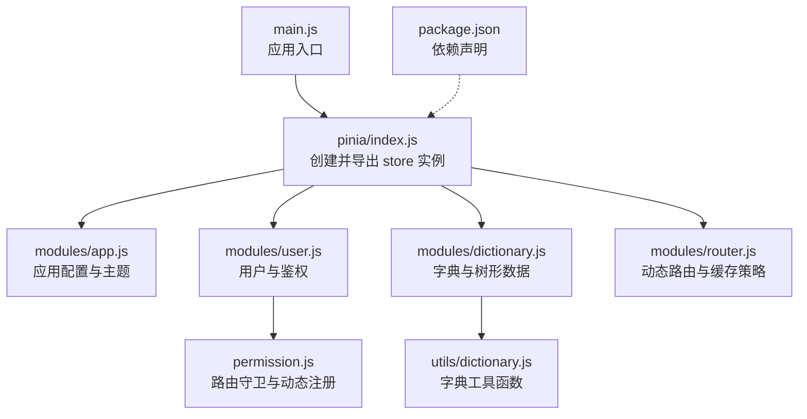
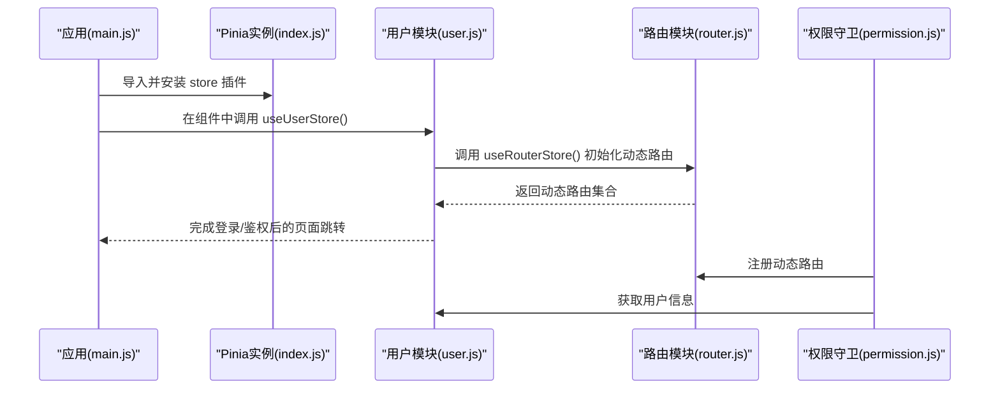
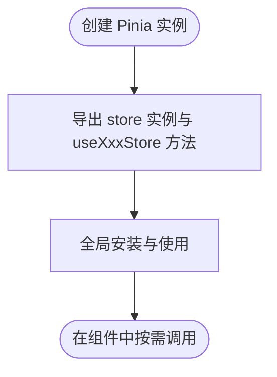
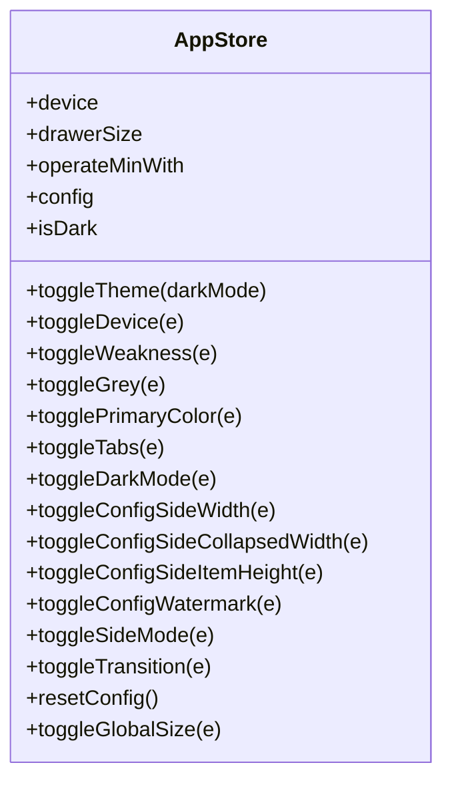
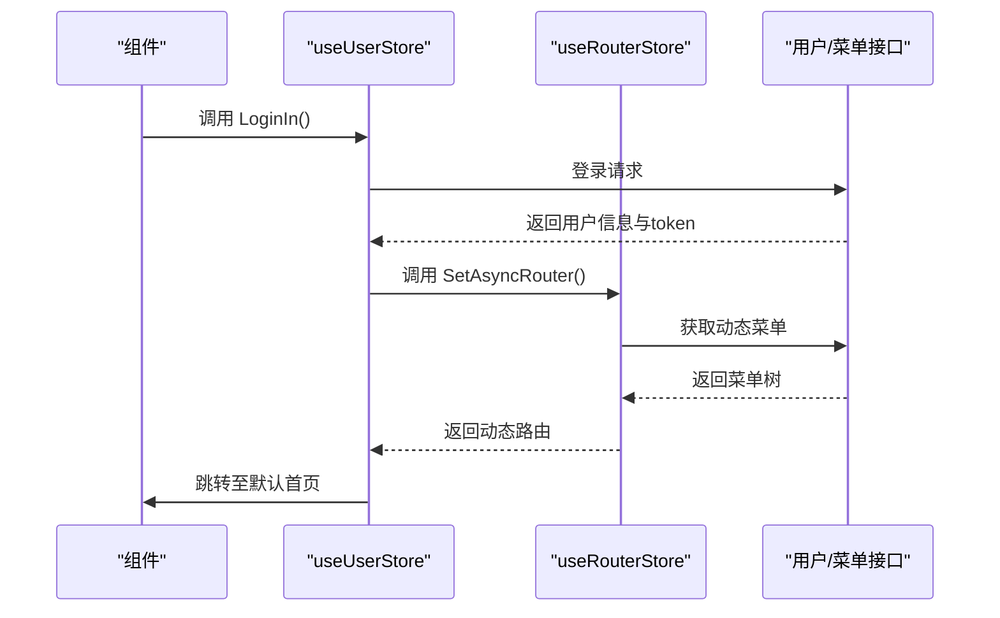
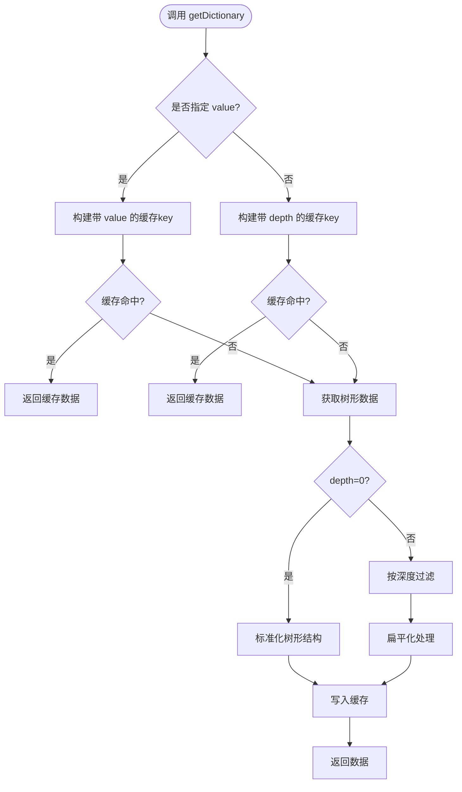
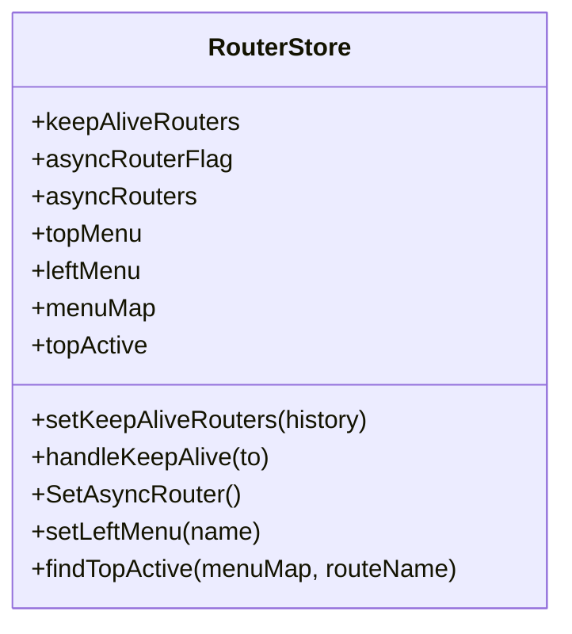
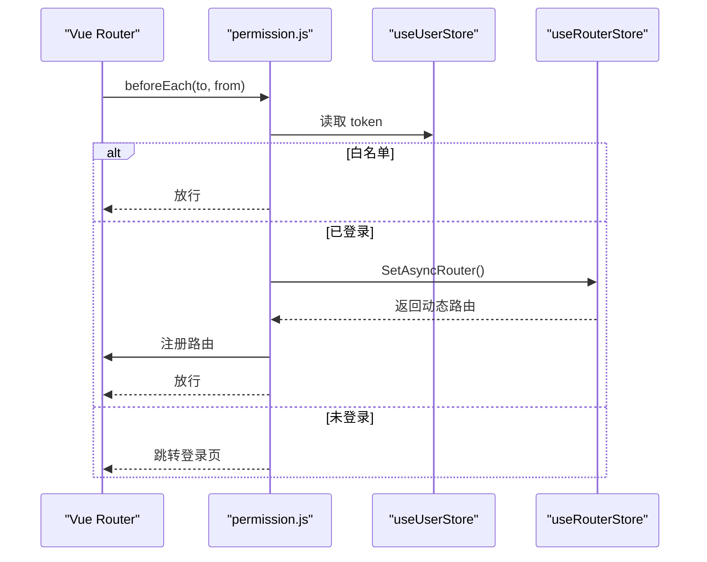
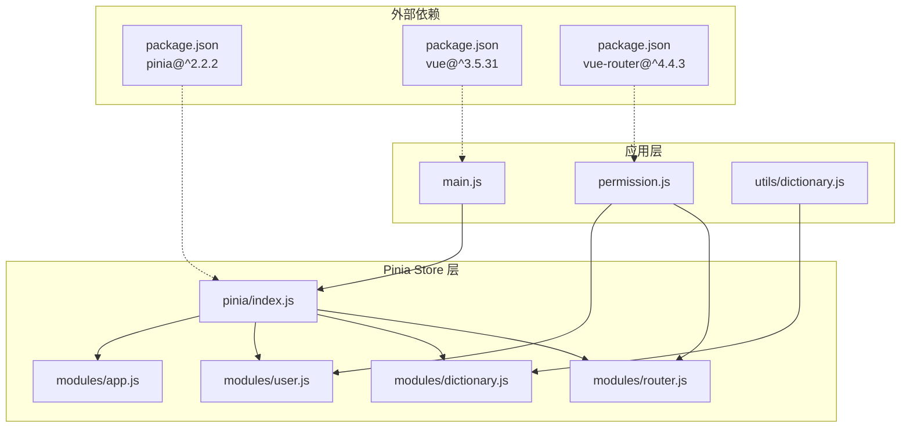

# Pinia Store 初始化

<cite>
**本文引用的文件**
- [web/src/pinia/index.js](file://web/src/pinia/index.js)
- [web/src/main.js](file://web/src/main.js)
- [web/src/pinia/modules/app.js](file://web/src/pinia/modules/app.js)
- [web/src/pinia/modules/user.js](file://web/src/pinia/modules/user.js)
- [web/src/pinia/modules/dictionary.js](file://web/src/pinia/modules/dictionary.js)
- [web/src/pinia/modules/router.js](file://web/src/pinia/modules/router.js)
- [web/src/permission.js](file://web/src/permission.js)
- [web/src/utils/dictionary.js](file://web/src/utils/dictionary.js)
- [web/package.json](file://web/package.json)
</cite>

## 目录
1. [简介](#简介)
2. [项目结构](#项目结构)
3. [核心组件](#核心组件)
4. [架构总览](#架构总览)
5. [详细组件分析](#详细组件分析)
6. [依赖关系分析](#依赖关系分析)
7. [性能考量](#性能考量)
8. [故障排查指南](#故障排查指南)
9. [结论](#结论)
10. [附录](#附录)

## 简介
本文件面向测试管理平台的前端工程，系统性阐述基于 Vue 3 与 Pinia 的状态管理初始化流程与最佳实践。重点包括：
- 如何创建 Pinia 实例并在应用中完成安装与注册
- store 模块的组织方式、命名导出与全局访问
- 在 Vue 应用中正确集成 Pinia 的步骤与注意事项
- 性能优化建议与常见问题的排查方法
- 提供可参考的配置与调用路径，便于快速落地

## 项目结构
前端采用 Vite 构建，Pinia Store 的入口位于 web/src/pinia/index.js，并在应用启动时由 web/src/main.js 完成安装。store 模块按功能拆分为多个文件，分别位于 web/src/pinia/modules 下。

图表来源
- [web/src/main.js:17](file://web/src/main.js#L17)
- [web/src/pinia/index.js:6](file://web/src/pinia/index.js#L6)
- [web/src/pinia/modules/user.js:1](file://web/src/pinia/modules/user.js#L1)
- [web/src/pinia/modules/router.js:1](file://web/src/pinia/modules/router.js#L1)
- [web/src/permission.js:1](file://web/src/permission.js#L1)
- [web/src/utils/dictionary.js:1](file://web/src/utils/dictionary.js#L1)
- [web/package.json:41](file://web/package.json#L41)

章节来源
- [web/src/main.js:17](file://web/src/main.js#L17)
- [web/src/pinia/index.js:6](file://web/src/pinia/index.js#L6)

## 核心组件
- Pinia 实例创建与导出：在 store 入口文件中创建实例并集中导出，便于全局统一使用。
- store 模块划分：按领域拆分，如应用配置、用户与路由、字典等，职责清晰。
- 全局安装与使用：在应用入口中安装插件，随后在任意组件中通过组合式 API 访问 store。

章节来源
- [web/src/pinia/index.js:1-9](file://web/src/pinia/index.js#L1-L9)
- [web/src/pinia/modules/app.js:1-163](file://web/src/pinia/modules/app.js#L1-L163)
- [web/src/pinia/modules/user.js:1-151](file://web/src/pinia/modules/user.js#L1-L151)
- [web/src/pinia/modules/dictionary.js:1-253](file://web/src/pinia/modules/dictionary.js#L1-L253)
- [web/src/pinia/modules/router.js:1-208](file://web/src/pinia/modules/router.js#L1-L208)

## 架构总览
下图展示了应用启动时 Pinia 初始化与模块加载的关键交互：

图表来源
- [web/src/main.js:32](file://web/src/main.js#L32)
- [web/src/pinia/index.js:2-8](file://web/src/pinia/index.js#L2-L8)
- [web/src/pinia/modules/user.js:80](file://web/src/pinia/modules/user.js#L80)
- [web/src/pinia/modules/router.js:158](file://web/src/pinia/modules/router.js#L158)
- [web/src/permission.js:117](file://web/src/permission.js#L117)

## 详细组件分析

### Pinia 实例创建与导出
- 在入口文件中创建 Pinia 实例并集中导出，便于在应用各处按需导入。
- 通过命名导出的方式，同时导出 store 实例以及各个模块的 useXxxStore 方法，形成统一的访问入口。

图表来源
- [web/src/pinia/index.js:6](file://web/src/pinia/index.js#L6)
- [web/src/pinia/index.js:8](file://web/src/pinia/index.js#L8)

章节来源
- [web/src/pinia/index.js:1-9](file://web/src/pinia/index.js#L1-L9)

### 应用配置与主题模块（app）
- 功能：维护全局主题、布局、颜色、标签页等配置；监听系统偏好并自动切换深浅色。
- 关键点：使用响应式对象与 watchEffect 实时同步 DOM 类名与样式变量；提供重置配置的能力。

图表来源
- [web/src/pinia/modules/app.js:6](file://web/src/pinia/modules/app.js#L6)
- [web/src/pinia/modules/app.js:140](file://web/src/pinia/modules/app.js#L140)

章节来源
- [web/src/pinia/modules/app.js:1-163](file://web/src/pinia/modules/app.js#L1-L163)

### 用户与鉴权模块（user）
- 功能：登录、登出、获取用户信息、初始化路由、清理存储等。
- 关键点：结合 Cookie 与 Storage 统一管理 token；登录后动态注册路由并跳转至默认首页；异常处理与 Loading 状态管理。

图表来源
- [web/src/pinia/modules/user.js:63](file://web/src/pinia/modules/user.js#L63)
- [web/src/pinia/modules/user.js:80](file://web/src/pinia/modules/user.js#L80)
- [web/src/pinia/modules/router.js:158](file://web/src/pinia/modules/router.js#L158)

章节来源
- [web/src/pinia/modules/user.js:1-151](file://web/src/pinia/modules/user.js#L1-L151)

### 字典与树形数据模块（dictionary）
- 功能：提供字典树形数据的获取、缓存、扁平化与过滤能力。
- 关键点：支持按深度过滤、按节点 value 获取子树、缓存机制与回退策略。

图表来源
- [web/src/pinia/modules/dictionary.js:117](file://web/src/pinia/modules/dictionary.js#L117)
- [web/src/pinia/modules/dictionary.js:174](file://web/src/pinia/modules/dictionary.js#L174)

章节来源
- [web/src/pinia/modules/dictionary.js:1-253](file://web/src/pinia/modules/dictionary.js#L1-L253)

### 动态路由与缓存策略模块（router）
- 功能：动态加载路由、处理 keep-alive 缓存、维护菜单结构与顶部激活状态。
- 关键点：格式化路由树、计算 keep-alive 组件列表、处理嵌套路由加载。

图表来源
- [web/src/pinia/modules/router.js:51](file://web/src/pinia/modules/router.js#L51)
- [web/src/pinia/modules/router.js:195](file://web/src/pinia/modules/router.js#L195)

章节来源
- [web/src/pinia/modules/router.js:1-208](file://web/src/pinia/modules/router.js#L1-L208)

### 权限守卫与动态路由注册
- 功能：在路由守卫中统一处理登录状态、动态路由注册与页面跳转。
- 关键点：白名单处理、异步路由初始化、keep-alive 处理与错误处理。

图表来源
- [web/src/permission.js:156](file://web/src/permission.js#L156)
- [web/src/permission.js:117](file://web/src/permission.js#L117)

章节来源
- [web/src/permission.js:1-225](file://web/src/permission.js#L1-L225)

## 依赖关系分析

图表来源
- [web/src/pinia/index.js:1](file://web/src/pinia/index.js#L1)
- [web/src/main.js:17](file://web/src/main.js#L17)
- [web/src/permission.js:1](file://web/src/permission.js#L1)
- [web/src/utils/dictionary.js:1](file://web/src/utils/dictionary.js#L1)
- [web/package.json:41](file://web/package.json#L41)

章节来源
- [web/package.json:41](file://web/package.json#L41)

## 性能考量
- 模块化设计原则
  - 将业务状态按领域拆分到独立模块，降低耦合并提升可维护性
  - 使用组合式 API 的 store 定义方式，充分利用 Vue 3 的响应式系统
  - 通过命名导出统一访问入口，减少重复导入

- 性能优化建议
  - 字典模块的缓存机制：利用 dictionaryMap 缓存不同深度和节点的数据，避免重复网络请求
  - 动态路由的懒加载：通过 vue-router 的异步组件实现按需加载
  - keep-alive 策略：合理配置组件缓存，平衡内存占用与性能
  - 监听器优化：使用 watchEffect 替代 watch，减少不必要的依赖追踪

- 调试配置
  - 在开发环境启用 Vue Devtools，便于监控状态变化
  - 利用浏览器开发者工具的 Network 面板监控 API 请求
  - 通过控制台输出关键状态变更，辅助问题定位

## 故障排查指南
- 初始化问题
  - 症状：应用启动时报 store 未定义错误
  - 排查：确认 main.js 中正确导入并安装 store 插件
  - 解决：检查导入路径是否正确，确保 store 实例已创建

- 登录相关问题
  - 症状：登录后无法跳转到首页
  - 排查：检查用户模块中的默认路由配置与权限设置
  - 解决：确认后端返回的 defaultRouter 配置正确

- 路由注册问题
  - 症状：动态路由未生效或出现重复注册
  - 排查：检查权限守卫中的路由注册逻辑
  - 解决：确保只在首次加载时注册路由，避免重复添加

- 字典数据问题
  - 症状：字典数据为空或显示异常
  - 排查：检查字典模块的缓存机制与 API 调用
  - 解决：验证后端接口返回格式，确保数据标准化处理

章节来源
- [web/src/main.js:32](file://web/src/main.js#L32)
- [web/src/pinia/modules/user.js:94](file://web/src/pinia/modules/user.js#L94)
- [web/src/permission.js:175](file://web/src/permission.js#L175)
- [web/src/pinia/modules/dictionary.js:117](file://web/src/pinia/modules/dictionary.js#L117)

## 结论
通过在入口集中创建与导出 Pinia 实例，并将业务 store 按模块拆分，测试管理平台实现了清晰的状态管理架构。配合动态路由、字典缓存与主题监听等机制，既保证了开发效率，也兼顾了运行时性能。遵循本文的最佳实践与排错建议，可在复杂业务场景中稳定地扩展与维护状态层。

## 附录
- 在应用中安装 Pinia 的步骤
  - 在入口文件中导入 store 并调用 app.use(store) 完成安装。
  - 参考路径：[web/src/main.js:32](file://web/src/main.js#L32)
- 在组件中使用 store
  - 从入口文件导入 useXxxStore 并在组合式生命周期中使用。
  - 参考路径：[web/src/pinia/index.js:2](file://web/src/pinia/index.js#L2)，[web/src/pinia/modules/user.js:13](file://web/src/pinia/modules/user.js#L13)
- Store 模块命名规范
  - 使用小驼峰命名法：useXxxStore
  - 模块文件按功能命名：app.js、user.js、dictionary.js、router.js
  - 导出统一使用命名导出，便于按需引入