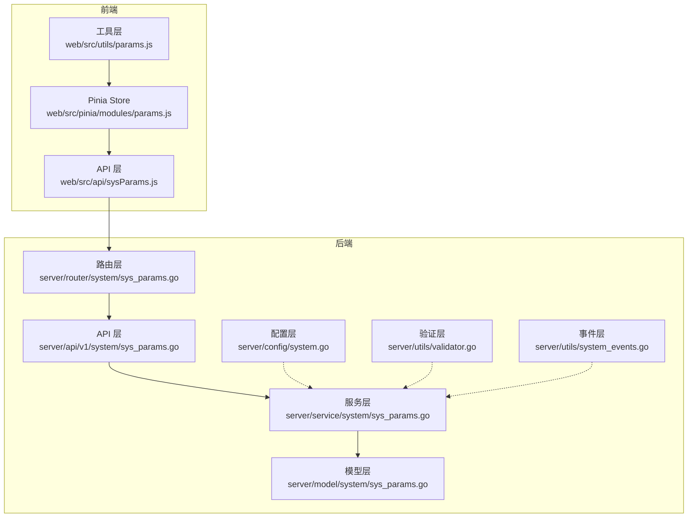
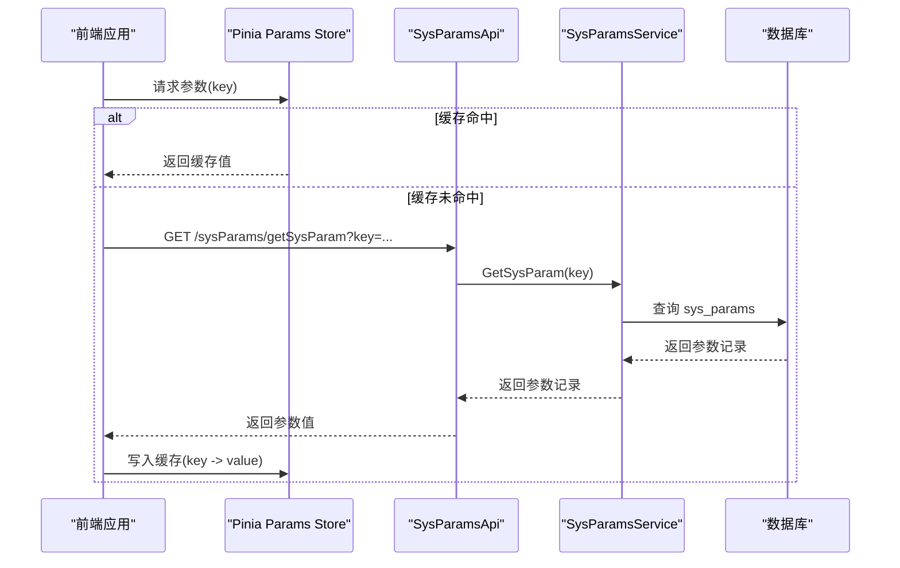
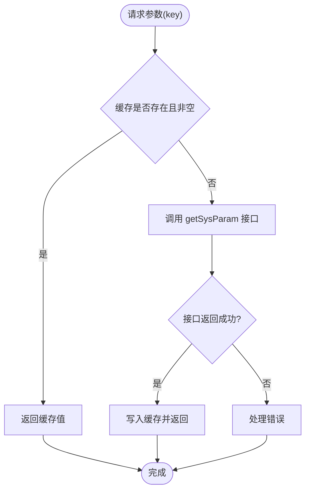
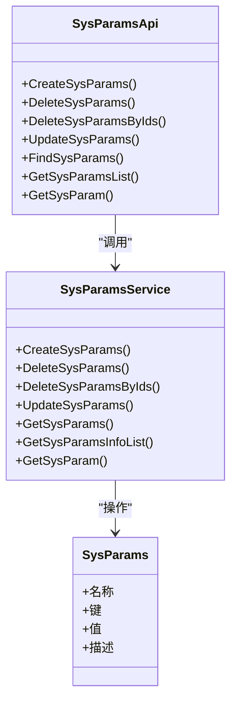
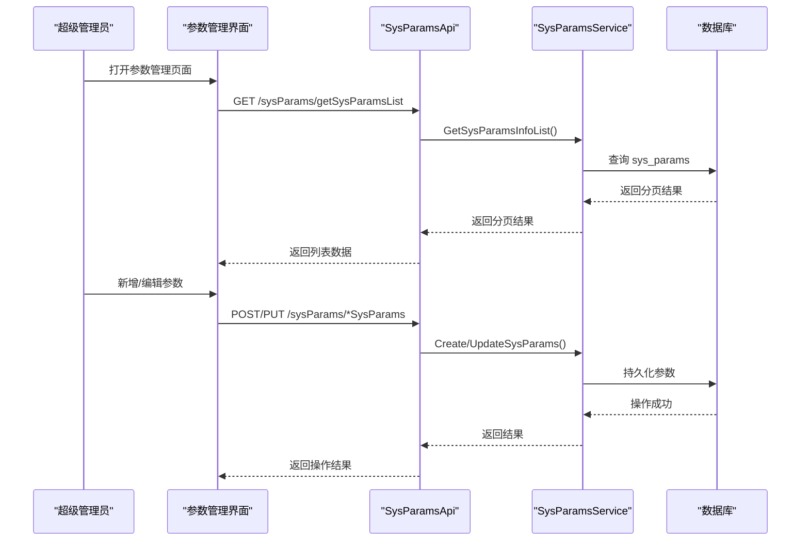
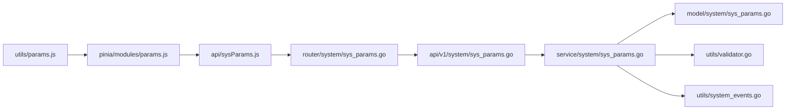

# 参数状态管理

<cite>
**本文档引用的文件**
- [params.js](file://web/src/pinia/modules/params.js)
- [params.js](file://web/src/utils/params.js)
- [sysParams.js](file://web/src/api/sysParams.js)
- [sys_params.go](file://server/api/v1/system/sys_params.go)
- [sys_params.go](file://server/service/system/sys_params.go)
- [sys_params.go](file://server/model/system/sys_params.go)
- [sys_params.go](file://server/router/system/sys_params.go)
- [system.go](file://server/config/system.go)
- [validator.go](file://server/utils/validator.go)
- [system_events.go](file://server/utils/system_events.go)
- [sysParams.vue](file://web/src/view/superAdmin/params/sysParams.vue)
</cite>

## 目录
1. [简介](#简介)
2. [项目结构](#项目结构)
3. [核心组件](#核心组件)
4. [架构概览](#架构概览)
5. [详细组件分析](#详细组件分析)
6. [依赖分析](#依赖分析)
7. [性能考虑](#性能考虑)
8. [故障排除指南](#故障排除指南)
9. [结论](#结论)
10. [附录](#附录)

## 简介
本文件系统性阐述 Gin-Vue-Admin 项目中“参数状态管理”的设计与实现，聚焦以下目标：
- 参数状态定义与分类：系统配置、业务参数、用户偏好设置
- 参数获取与更新机制：远程参数加载、本地参数缓存、参数同步策略
- 参数状态与业务功能的集成：配置驱动的业务逻辑、动态参数影响、参数验证
- 设计原则：参数结构设计、版本兼容性、安全性考虑
- 使用示例与配置场景：前端获取参数、后端参数服务、可视化管理界面

## 项目结构
参数状态管理横跨前端与后端，采用清晰的分层架构：
- 前端层
  - Pinia Store：维护参数缓存，提供按 key 获取参数值的能力
  - API 层：封装参数相关 HTTP 接口
  - 工具层：对外暴露便捷的参数获取方法
- 后端层
  - 路由层：定义参数管理的路由组与权限中间件
  - API 层：提供参数的增删改查与分页列表接口
  - 服务层：封装参数的业务逻辑（创建、删除、更新、查询）
  - 模型层：参数实体映射到数据库表 sys_params
  - 配置层：系统级参数结构（如数据库类型、端口等）
  - 验证层：参数验证规则与默认值处理建议
  - 事件层：系统事件触发器，支持后续热更新扩展

**图表来源**
- [params.js:1-32](file://web/src/pinia/modules/params.js#L1-L32)
- [params.js:1-15](file://web/src/utils/params.js#L1-L15)
- [sysParams.js:1-112](file://web/src/api/sysParams.js#L1-L112)
- [sys_params.go:1-26](file://server/router/system/sys_params.go#L1-L26)
- [sys_params.go:1-172](file://server/api/v1/system/sys_params.go#L1-L172)
- [sys_params.go:1-83](file://server/service/system/sys_params.go#L1-L83)
- [sys_params.go:1-21](file://server/model/system/sys_params.go#L1-L21)
- [system.go:1-16](file://server/config/system.go#L1-L16)
- [validator.go:1-295](file://server/utils/validator.go#L1-L295)
- [system_events.go:1-35](file://server/utils/system_events.go#L1-L35)

**章节来源**
- [params.js:1-32](file://web/src/pinia/modules/params.js#L1-L32)
- [params.js:1-15](file://web/src/utils/params.js#L1-L15)
- [sysParams.js:1-112](file://web/src/api/sysParams.js#L1-L112)
- [sys_params.go:1-26](file://server/router/system/sys_params.go#L1-L26)
- [sys_params.go:1-172](file://server/api/v1/system/sys_params.go#L1-L172)
- [sys_params.go:1-83](file://server/service/system/sys_params.go#L1-L83)
- [sys_params.go:1-21](file://server/model/system/sys_params.go#L1-L21)
- [system.go:1-16](file://server/config/system.go#L1-L16)
- [validator.go:1-295](file://server/utils/validator.go#L1-L295)
- [system_events.go:1-35](file://server/utils/system_events.go#L1-L35)

## 核心组件
- 数据模型（Model）
  - SysParams：定义参数的名称、键、值、描述等字段，映射到数据库表 sys_params
- 服务层（Service）
  - SysParamsService：提供创建、删除、批量删除、更新、按 ID 查询、分页查询、按 key 查询等核心方法
- API 层（API）
  - SysParamsApi：封装 HTTP 接口，完成参数的增删改查与分页列表展示
- 路由层（Router）
  - SysParamsRouter：定义参数管理的路由组与权限中间件
- 前端缓存（Pinia Store）
  - useParamsStore：基于 key 的参数值缓存，首次访问从后端拉取并写入缓存，后续直接从缓存读取
- 验证工具（Utils）
  - validator：提供通用的参数验证规则（非空、正则、范围比较等），可扩展自定义规则集

**章节来源**
- [sys_params.go:9-20](file://server/model/system/sys_params.go#L9-L20)
- [sys_params.go:9-82](file://server/service/system/sys_params.go#L9-L82)
- [sys_params.go:12-171](file://server/api/v1/system/sys_params.go#L12-L171)
- [sys_params.go:8-25](file://server/router/system/sys_params.go#L8-L25)
- [params.js:5-31](file://web/src/pinia/modules/params.js#L5-L31)
- [validator.go:11-295](file://server/utils/validator.go#L11-L295)

## 架构概览
参数状态管理遵循清晰的分层设计，从前端缓存到后端持久化形成闭环。参数变更通过 API 层进入服务层，持久化至数据库；前端通过 Pinia Store 缓存参数值，提升读取效率。当前实现未内置分布式缓存与参数热更新机制，但提供了系统事件触发器以支持后续扩展。

**图表来源**
- [sys_params.go:153-171](file://server/api/v1/system/sys_params.go#L153-L171)
- [sys_params.go:77-82](file://server/service/system/sys_params.go#L77-L82)
- [params.js:12-24](file://web/src/pinia/modules/params.js#L12-L24)

**章节来源**
- [sys_params.go:153-171](file://server/api/v1/system/sys_params.go#L153-L171)
- [sys_params.go:77-82](file://server/service/system/sys_params.go#L77-L82)
- [params.js:12-24](file://web/src/pinia/modules/params.js#L12-L24)

## 详细组件分析

### 前端参数状态定义与缓存
- 参数状态定义
  - paramsMap：以 key 为索引的参数值缓存对象
  - setParamsMap：合并写入参数缓存
  - getParams：按 key 获取参数值，若缓存为空则发起后端请求并写入缓存
- 获取与更新机制
  - 首次访问：调用 getSysParam 接口，成功后写入 paramsMap
  - 后续访问：直接从 paramsMap 返回缓存值
- 便捷工具
  - utils/params.js 提供 getParams(key) 方法，封装 Store 调用与返回

**图表来源**
- [params.js:12-24](file://web/src/pinia/modules/params.js#L12-L24)
- [sysParams.js:105-111](file://web/src/api/sysParams.js#L105-L111)

**章节来源**
- [params.js:5-31](file://web/src/pinia/modules/params.js#L5-L31)
- [params.js:1-15](file://web/src/utils/params.js#L1-L15)
- [sysParams.js:1-112](file://web/src/api/sysParams.js#L1-L112)

### 后端参数服务与数据模型
- 数据模型（SysParams）
  - 字段：名称、键、值、描述
  - 表名：sys_params
- 服务层（SysParamsService）
  - CreateSysParams：创建参数记录
  - DeleteSysParams/DeleteSysParamsByIds：删除参数记录
  - UpdateSysParams：更新参数记录
  - GetSysParams/GetSysParamsInfoList：按 ID 查询与分页查询
  - GetSysParam：按 key 获取参数记录
- API 层（SysParamsApi）
  - 提供创建、删除、批量删除、更新、按 ID 查询、分页列表、按 key 查询等接口
- 路由层（SysParamsRouter）
  - 定义参数管理的路由组与权限中间件

**图表来源**
- [sys_params.go:9-20](file://server/model/system/sys_params.go#L9-L20)
- [sys_params.go:9-82](file://server/service/system/sys_params.go#L9-L82)
- [sys_params.go:12-171](file://server/api/v1/system/sys_params.go#L12-L171)

**章节来源**
- [sys_params.go:9-20](file://server/model/system/sys_params.go#L9-L20)
- [sys_params.go:9-82](file://server/service/system/sys_params.go#L9-L82)
- [sys_params.go:12-171](file://server/api/v1/system/sys_params.go#L12-L171)
- [sys_params.go:8-25](file://server/router/system/sys_params.go#L8-L25)

### 参数分类管理与默认值处理
- 参数分类
  - 系统级参数：由系统管理员维护，涉及运行时配置（如数据库类型、端口、OSS 类型等）
  - 业务参数：与具体业务域相关，如业务开关、阈值配置等
  - 用户自定义参数：允许用户在受控范围内进行个性化配置
- 默认值处理
  - 当前实现未包含默认值字段与自动填充逻辑，建议在服务层或前端统一处理默认值策略
- 验证规则
  - 提供非空、正则匹配、长度/数值范围比较等通用规则
  - 支持注册自定义规则集，便于业务扩展

**章节来源**
- [system.go:3-15](file://server/config/system.go#L3-L15)
- [validator.go:11-295](file://server/utils/validator.go#L11-L295)

### 参数缓存策略与热更新机制
- 现状
  - 前端采用 Pinia Store 缓存参数值，后端未实现分布式缓存与参数热更新
- 建议
  - 引入 Redis 缓存参数值，结合发布订阅或轮询实现热更新
  - 提供参数变更事件通知，触发前端缓存刷新与后端缓存失效
  - 对关键参数建立灰度发布与回滚机制

**章节来源**
- [system_events.go:1-35](file://server/utils/system_events.go#L1-L35)

### 参数状态与业务功能集成
- 配置驱动的业务逻辑
  - 通过参数键获取业务开关、阈值等配置，驱动前端 UI 与后端行为
- 动态参数影响
  - 参数变更后，前端缓存需及时更新；后端可通过事件机制触发缓存失效
- 参数验证
  - 在创建参数时结合验证规则确保数据质量；在读取参数时补充默认值保障健壮性

**章节来源**
- [validator.go:118-165](file://server/utils/validator.go#L118-L165)

### 使用示例与配置场景
- 前端获取参数
  - 引入工具方法并调用异步获取参数值
  - 在组件挂载时预取所需参数，避免运行时异步阻塞
- 后端参数服务
  - 通过服务层方法获取参数值，用于业务逻辑判断
- 可视化管理界面
  - 提供参数的增删改查与分页列表，支持按名称、键模糊查询

**图表来源**
- [sys_params.go:14-171](file://server/api/v1/system/sys_params.go#L14-L171)
- [sys_params.go:11-82](file://server/service/system/sys_params.go#L11-L82)
- [sysParams.vue:287-429](file://web/src/view/superAdmin/params/sysParams.vue#L287-L429)

**章节来源**
- [params.js:1-15](file://web/src/utils/params.js#L1-L15)
- [sysParams.vue:230-259](file://web/src/view/superAdmin/params/sysParams.vue#L230-L259)
- [sys_params.go:14-171](file://server/api/v1/system/sys_params.go#L14-L171)
- [sys_params.go:11-82](file://server/service/system/sys_params.go#L11-L82)

## 依赖分析
- 模块内聚与耦合
  - useParamsStore 与 sysParams API：通过 getSysParam 接口耦合，职责清晰
  - sysParams API 与 SysParamsApi/SysParamsService：接口与实现分离，内聚良好
  - dictionary 与 params：均为纯数据模块，彼此无直接依赖
- 外部依赖
  - 前端：utils/params.js 依赖 useParamsStore；params.js 依赖 sysParams API
  - 后端：SysParamsApi 依赖 SysParamsService；SysParamsService 依赖 SysParams 模型

**图表来源**
- [params.js:1-15](file://web/src/utils/params.js#L1-L15)
- [params.js:1-32](file://web/src/pinia/modules/params.js#L1-L32)
- [sysParams.js:1-112](file://web/src/api/sysParams.js#L1-L112)
- [sys_params.go:1-26](file://server/router/system/sys_params.go#L1-L26)
- [sys_params.go:1-172](file://server/api/v1/system/sys_params.go#L1-L172)
- [sys_params.go:1-83](file://server/service/system/sys_params.go#L1-L83)
- [sys_params.go:1-21](file://server/model/system/sys_params.go#L1-L21)
- [validator.go:1-295](file://server/utils/validator.go#L1-L295)
- [system_events.go:1-35](file://server/utils/system_events.go#L1-L35)

**章节来源**
- [params.js:1-15](file://web/src/utils/params.js#L1-L15)
- [params.js:1-32](file://web/src/pinia/modules/params.js#L1-L32)
- [sysParams.js:1-112](file://web/src/api/sysParams.js#L1-L112)
- [sys_params.go:1-26](file://server/router/system/sys_params.go#L1-L26)
- [sys_params.go:1-172](file://server/api/v1/system/sys_params.go#L1-L172)
- [sys_params.go:1-83](file://server/service/system/sys_params.go#L1-L83)
- [sys_params.go:1-21](file://server/model/system/sys_params.go#L1-L21)
- [validator.go:1-295](file://server/utils/validator.go#L1-L295)
- [system_events.go:1-35](file://server/utils/system_events.go#L1-L35)

## 性能考虑
- 前端缓存策略
  - 使用 Pinia Store 维护 paramsMap，key 作为索引缓存参数值
  - 首次访问时若缓存为空，则发起后端请求获取参数值并写入缓存
  - 性能优势：减少重复网络请求，提升参数读取性能，适合高频读取场景
- 后端查询优化
  - 分页查询与条件过滤（名称、键模糊匹配、时间范围）
  - 建议：对 key 建立唯一索引，加速按 key 查询
- 缓存一致性
  - 当前未实现分布式缓存与热更新，建议引入 Redis 并结合事件机制保证一致性

**章节来源**
- [params.js:12-24](file://web/src/pinia/modules/params.js#L12-L24)
- [sys_params.go:46-75](file://server/service/system/sys_params.go#L46-L75)

## 故障排除指南
- 常见问题
  - 参数获取失败：检查 getSysParam 接口返回码与错误信息
  - 缓存未命中：确认 key 是否正确，后端是否存在对应记录
  - 权限不足：确认路由中间件与权限配置
- 排查步骤
  - 前端：通过工具方法 getParams(key) 获取参数值，观察返回结果
  - 后端：检查 SysParamsApi 的 GetSysParam 实现与数据库查询
  - 验证：使用 validator 规则对参数进行格式与范围校验

**章节来源**
- [sys_params.go:153-171](file://server/api/v1/system/sys_params.go#L153-L171)
- [sys_params.go:77-82](file://server/service/system/sys_params.go#L77-L82)
- [validator.go:118-165](file://server/utils/validator.go#L118-L165)

## 结论
本参数状态管理体系通过清晰的前后端分层与职责划分，实现了参数的统一管理与高效访问。前端缓存显著提升了参数读取性能，后端服务提供了完善的增删改查能力。建议后续引入分布式缓存与事件驱动的热更新机制，进一步增强系统的可扩展性与一致性。

## 附录
- 最佳实践
  - 命名规范：使用清晰、语义化的 key，建议采用“模块_子系统_参数名”的层级命名
  - 版本控制：对关键参数变更进行版本化管理，支持回滚与灰度发布
  - 备份恢复：定期导出参数清单，建立备份与恢复流程，确保灾难恢复
  - 验证与默认值：在创建参数时启用验证规则，读取时补充默认值，提升系统稳定性
- 参数验证规则示例
  - 非空校验：确保必填字段不为空
  - 正则校验：对复杂格式（如邮箱、URL）进行约束
  - 范围校验：对数值或长度设定上下限

**章节来源**
- [validator.go:118-165](file://server/utils/validator.go#L118-L165)