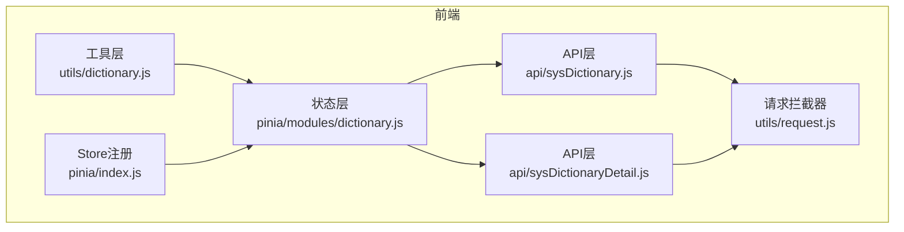
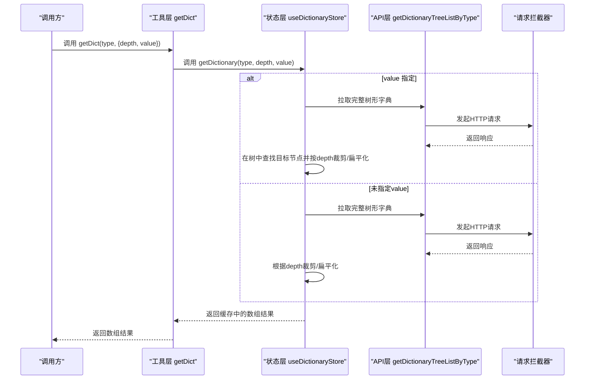
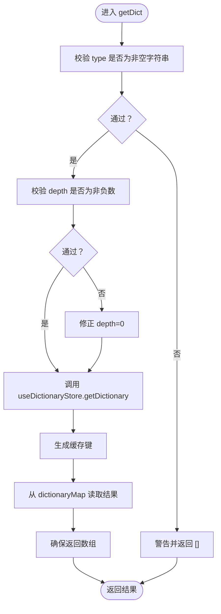
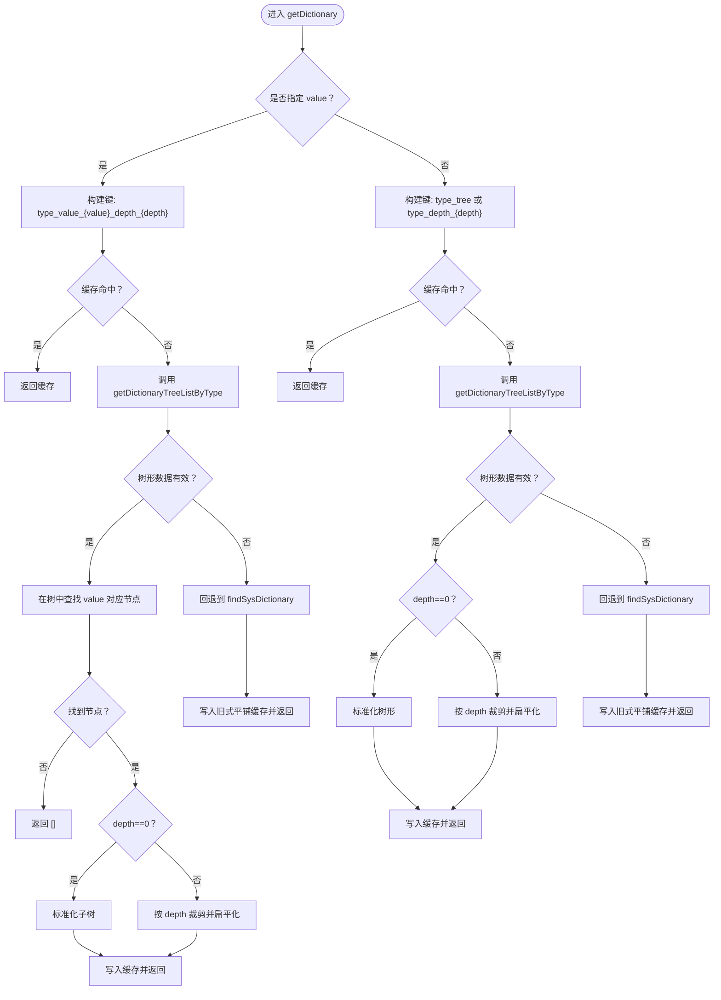
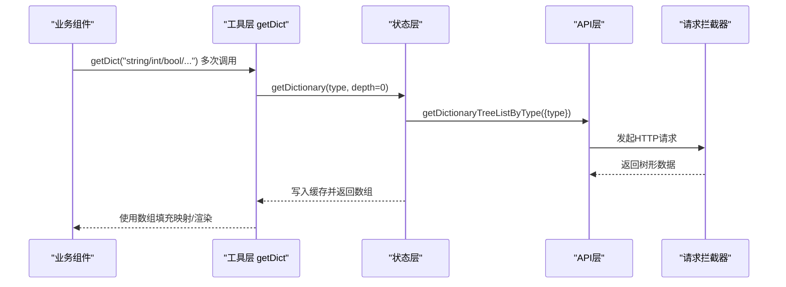
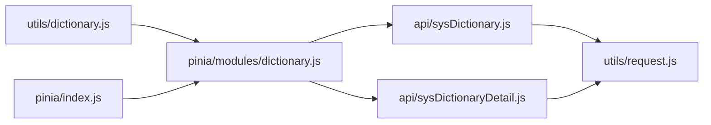

# 字典状态管理

<cite>
**本文引用的文件**
- [dictionary.js](file://web/src/utils/dictionary.js)
- [dictionary.js](file://web/src/pinia/modules/dictionary.js)
- [sysDictionary.js](file://web/src/api/sysDictionary.js)
- [sysDictionaryDetail.js](file://web/src/api/sysDictionaryDetail.js)
- [request.js](file://web/src/utils/request.js)
- [index.js](file://web/src/pinia/index.js)
- [index.vue](file://web/src/view/systemTools/autoCode/index.vue)
- [version.vue](file://web/src/view/systemTools/version/version.vue)
</cite>

## 目录
1. [简介](#简介)
2. [项目结构](#项目结构)
3. [核心组件](#核心组件)
4. [架构总览](#架构总览)
5. [详细组件分析](#详细组件分析)
6. [依赖分析](#依赖分析)
7. [性能考量](#性能考量)
8. [故障排查指南](#故障排查指南)
9. [结论](#结论)
10. [附录](#附录)

## 简介
本文件系统性梳理前端“字典状态管理”的设计与实现，覆盖以下关键点：
- 字典数据的获取、缓存与更新机制
- dictionary.js 中的状态定义、数据结构设计与异步加载流程
- 缓存策略（内存缓存、键空间设计、手动刷新）
- 与业务组件的集成（下拉选择、搜索过滤、数据展示）
- 最佳实践（一致性、性能、错误处理）
- API 调用示例与使用场景

## 项目结构
围绕字典状态管理的相关文件分布如下：
- 状态层：Pinia Store 定义于 [dictionary.js](file://web/src/pinia/modules/dictionary.js)
- 工具层：统一的字典获取与标签展示封装位于 [dictionary.js](file://web/src/utils/dictionary.js)
- API 层：系统字典与字典详情接口定义分别位于 [sysDictionary.js](file://web/src/api/sysDictionary.js)、[sysDictionaryDetail.js](file://web/src/api/sysDictionaryDetail.js)
- 请求拦截器：统一网络层与加载控制位于 [request.js](file://web/src/utils/request.js)
- Store 注册：Pinia 实例与模块注册位于 [index.js](file://web/src/pinia/index.js)
- 业务集成示例：自动代码生成与版本发布页面中使用了字典状态管理

**图表来源**
- [dictionary.js:1-94](file://web/src/utils/dictionary.js#L1-L94)
- [dictionary.js:1-253](file://web/src/pinia/modules/dictionary.js#L1-L253)
- [sysDictionary.js:1-113](file://web/src/api/sysDictionary.js#L1-L113)
- [sysDictionaryDetail.js:1-146](file://web/src/api/sysDictionaryDetail.js#L1-L146)
- [request.js:1-232](file://web/src/utils/request.js#L1-L232)
- [index.js:1-9](file://web/src/pinia/index.js#L1-L9)

**章节来源**
- [dictionary.js:1-94](file://web/src/utils/dictionary.js#L1-L94)
- [dictionary.js:1-253](file://web/src/pinia/modules/dictionary.js#L1-L253)
- [sysDictionary.js:1-113](file://web/src/api/sysDictionary.js#L1-L113)
- [sysDictionaryDetail.js:1-146](file://web/src/api/sysDictionaryDetail.js#L1-L146)
- [request.js:1-232](file://web/src/utils/request.js#L1-L232)
- [index.js:1-9](file://web/src/pinia/index.js#L1-L9)

## 核心组件
- 工具函数 getDict：对外暴露的统一入口，负责参数校验、调用 Store、生成缓存键、从缓存读取并返回数组结果；同时提供 showDictLabel 用于将字典数组映射为“code -> label”的字典表以供展示。
- Pinia Store useDictionaryStore：维护 dictionaryMap 内存缓存，提供 getDictionary 方法，内部实现树形数据标准化、按深度过滤、扁平化、按 value 查找子节点等能力，并在失败时回退到旧式平铺接口。
- API 层：getDictionaryTreeListByType 提供树形字典数据；findSysDictionary 提供旧式平铺字典数据，作为回退方案。
- 请求拦截器：统一设置超时、Token、加载遮罩与错误提示，保障字典加载体验。

**章节来源**
- [dictionary.js:38-93](file://web/src/utils/dictionary.js#L38-L93)
- [dictionary.js:7-252](file://web/src/pinia/modules/dictionary.js#L7-L252)
- [sysDictionary.js:58-80](file://web/src/api/sysDictionary.js#L58-L80)
- [sysDictionaryDetail.js:106-112](file://web/src/api/sysDictionaryDetail.js#L106-L112)
- [request.js:119-223](file://web/src/utils/request.js#L119-L223)

## 架构总览
字典状态管理采用“工具层 -> 状态层 -> API层 -> 请求层”的分层设计，形成清晰的数据流与职责边界。

**图表来源**
- [dictionary.js:38-74](file://web/src/utils/dictionary.js#L38-L74)
- [dictionary.js:117-245](file://web/src/pinia/modules/dictionary.js#L117-L245)
- [sysDictionaryDetail.js:106-112](file://web/src/api/sysDictionaryDetail.js#L106-L112)
- [request.js:119-223](file://web/src/utils/request.js#L119-L223)

## 详细组件分析

### 工具层：getDict 与 showDictLabel
- 参数校验：type 必须为非空字符串；depth 必须为非负数，否则回退为默认值。
- 缓存键生成：根据 type、depth、value 生成唯一键，支持“完整树”“按深度扁平化”“按节点value的子树”三类键空间。
- 结果保证：始终返回数组，避免上层误用。
- 错误兜底：捕获异常并记录日志，返回空数组，不影响业务主流程。
- 显示辅助：showDictLabel 将字典数组转换为“code -> label”的映射，便于渲染展示。

**图表来源**
- [dictionary.js:38-74](file://web/src/utils/dictionary.js#L38-L74)

**章节来源**
- [dictionary.js:10-15](file://web/src/utils/dictionary.js#L10-L15)
- [dictionary.js:38-74](file://web/src/utils/dictionary.js#L38-L74)
- [dictionary.js:77-93](file://web/src/utils/dictionary.js#L77-L93)

### 状态层：useDictionaryStore 的数据结构与算法
- 数据结构：dictionaryMap 为内存缓存，键为“类型_维度”组合，值为数组（树形或扁平化后的字典项）。
- 树形标准化：normalizeTreeData 确保每个节点包含 label/value/extend/children 字段，便于统一消费。
- 深度裁剪：filterTreeByDepth 支持按目标深度递归裁剪 children，达到目标深度后仅保留必要字段。
- 扁平化：flattenTree 将树形结构转为一维数组，兼容旧式平铺数据。
- 按 value 查找子树：findNodeByValue 支持在树中定位指定 value 的节点，并按 depth 返回其子树或按 depth 裁剪后的子树，再进行标准化或扁平化。
- 回退策略：当树形接口无数据或异常时，回退到旧式平铺接口 findSysDictionary，保证可用性。

**图表来源**
- [dictionary.js:117-245](file://web/src/pinia/modules/dictionary.js#L117-L245)
- [dictionary.js:14-39](file://web/src/pinia/modules/dictionary.js#L14-L39)
- [dictionary.js:41-61](file://web/src/pinia/modules/dictionary.js#L41-L61)
- [dictionary.js:63-74](file://web/src/pinia/modules/dictionary.js#L63-L74)
- [dictionary.js:76-115](file://web/src/pinia/modules/dictionary.js#L76-L115)

**章节来源**
- [dictionary.js:7-252](file://web/src/pinia/modules/dictionary.js#L7-L252)

### API 层：树形与平铺接口
- 树形接口：getDictionaryTreeListByType（按字典类型获取树形详情），作为首选数据源。
- 平铺接口：findSysDictionary（按字典类型获取平铺详情），作为回退方案。
- 两者均通过统一的请求拦截器完成鉴权、超时与加载控制。

**章节来源**
- [sysDictionaryDetail.js:106-112](file://web/src/api/sysDictionaryDetail.js#L106-L112)
- [sysDictionary.js:58-80](file://web/src/api/sysDictionary.js#L58-L80)
- [request.js:119-223](file://web/src/utils/request.js#L119-L223)

### 请求拦截器：统一网络与加载控制
- 默认超时、加载遮罩、Token 注入、401 自动跳转登录等。
- 为字典加载提供一致的用户体验与错误提示。

**章节来源**
- [request.js:7-18](file://web/src/utils/request.js#L7-L18)
- [request.js:119-223](file://web/src/utils/request.js#L119-L223)

### 业务集成示例
- 自动代码生成页面：在初始化阶段批量拉取多种字段类型的字典，填充 fdMap，用于字段类型识别与约束判断。
- 版本发布页面：在打开导出对话框时拉取字典列表，用于勾选导出范围。

**图表来源**
- [index.vue:1499-1508](file://web/src/view/systemTools/autoCode/index.vue#L1499-L1508)
- [dictionary.js:38-74](file://web/src/utils/dictionary.js#L38-L74)
- [dictionary.js:117-245](file://web/src/pinia/modules/dictionary.js#L117-L245)
- [sysDictionaryDetail.js:106-112](file://web/src/api/sysDictionaryDetail.js#L106-L112)
- [request.js:119-223](file://web/src/utils/request.js#L119-L223)

**章节来源**
- [index.vue:1499-1508](file://web/src/view/systemTools/autoCode/index.vue#L1499-L1508)
- [version.vue:687-691](file://web/src/view/systemTools/version/version.vue#L687-L691)

## 依赖分析
- 工具层依赖状态层：getDict 通过 useDictionaryStore 调用 getDictionary。
- 状态层依赖 API 层：getDictionary 通过 getDictionaryTreeListByType 与 findSysDictionary 获取数据。
- API 层依赖请求拦截器：统一的 service 实例承载鉴权与错误处理。
- Store 注册：pinia/index.js 将 useDictionaryStore 注册到全局 Pinia 实例。

**图表来源**
- [dictionary.js](file://web/src/utils/dictionary.js#L1)
- [dictionary.js:1-2](file://web/src/pinia/modules/dictionary.js#L1-L2)
- [sysDictionary.js](file://web/src/api/sysDictionary.js#L1)
- [sysDictionaryDetail.js](file://web/src/api/sysDictionaryDetail.js#L1)
- [request.js](file://web/src/utils/request.js#L1)
- [index.js:1-9](file://web/src/pinia/index.js#L1-L9)

**章节来源**
- [dictionary.js](file://web/src/utils/dictionary.js#L1)
- [dictionary.js:1-2](file://web/src/pinia/modules/dictionary.js#L1-L2)
- [sysDictionary.js](file://web/src/api/sysDictionary.js#L1)
- [sysDictionaryDetail.js](file://web/src/api/sysDictionaryDetail.js#L1)
- [request.js](file://web/src/utils/request.js#L1)
- [index.js:1-9](file://web/src/pinia/index.js#L1-L9)

## 性能考量
- 内存缓存：dictionaryMap 以“类型+维度”为键，避免重复请求；建议在页面卸载或切换场景主动清理或重建 Store，防止长期驻留导致内存增长。
- 深度裁剪：按需裁剪树形结构，减少序列化与渲染开销；仅在需要完整树时 depth=0。
- 扁平化成本：扁平化操作为 O(N)，在字典规模较大时应谨慎使用；可优先使用树形结构进行渲染。
- 回退策略：树形接口失败时回退到平铺接口，保证可用性，但可能增加数据冗余；建议在后台治理字典结构，逐步统一为树形。
- 加载体验：请求拦截器统一加载遮罩与错误提示，避免频繁闪烁；可通过合理设置超时与重试策略提升稳定性。

[本节为通用指导，无需特定文件来源]

## 故障排查指南
- getDict 返回空数组
  - 检查 type 是否为空或类型错误
  - 检查 depth 是否为非负数
  - 查看控制台是否有“获取字典数据失败”错误日志
- 字典渲染异常
  - 确认字典项包含 label/value/extend 字段
  - 若使用 showDictLabel，请确认传入的 keyCode/valueCode 与实际字段一致
- 网络错误或401
  - 检查请求拦截器中的 Token 注入与 401 处理逻辑
  - 确认接口地址与权限配置正确
- 缓存未生效
  - 确认缓存键生成规则与调用参数一致
  - 检查 dictionaryMap 是否被意外重置

**章节来源**
- [dictionary.js:46-49](file://web/src/utils/dictionary.js#L46-L49)
- [dictionary.js:70-73](file://web/src/utils/dictionary.js#L70-L73)
- [dictionary.js:130-170](file://web/src/pinia/modules/dictionary.js#L130-L170)
- [request.js:190-223](file://web/src/utils/request.js#L190-L223)

## 结论
本字典状态管理方案通过“工具层 -> 状态层 -> API层 -> 请求层”的清晰分层，实现了：
- 统一的字典获取入口与参数校验
- 健壮的内存缓存与键空间设计
- 按深度裁剪与扁平化的灵活输出
- 树形与平铺双通道回退策略
- 与业务组件的无缝集成与良好的错误兜底

建议在生产环境中结合业务场景对缓存策略与渲染性能进行持续优化，并在后台完善字典结构以减少回退路径。

[本节为总结，无需特定文件来源]

## 附录

### API 调用示例与使用场景
- 获取完整树形字典
  - 调用：getDict("user_status")
  - 场景：下拉选择、树形展示
- 获取指定深度的扁平化字典
  - 调用：getDict("user_status", { depth: 2 })
  - 场景：多级联动、快速筛选
- 获取指定节点的子树
  - 调用：getDict("area", { value: "110000" })
  - 场景：省市区联动、动态加载子级
- 字典文字展示
  - 调用：showDictLabel(dict, code, "value", "label")
  - 场景：将 code 渲染为中文标签

**章节来源**
- [dictionary.js:24-37](file://web/src/utils/dictionary.js#L24-L37)
- [dictionary.js:77-93](file://web/src/utils/dictionary.js#L77-L93)

### 最佳实践清单
- 数据一致性
  - 严格校验 type 与 depth 参数
  - 使用标准化字段（label/value/extend）确保消费端稳定
- 性能优化
  - 优先使用树形结构进行渲染，按需裁剪
  - 控制扁平化频率，避免大规模重复转换
- 错误处理
  - 捕获异常并降级为空数组，避免阻塞主流程
  - 通过请求拦截器统一错误提示与 401 处理
- 缓存策略
  - 明确缓存键空间，避免键冲突
  - 在页面切换或路由离开时清理或重建 Store，防止内存泄漏

[本节为通用指导，无需特定文件来源]