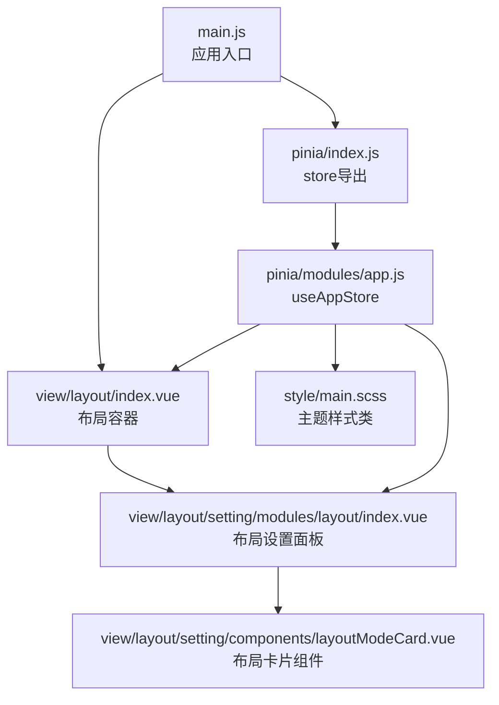
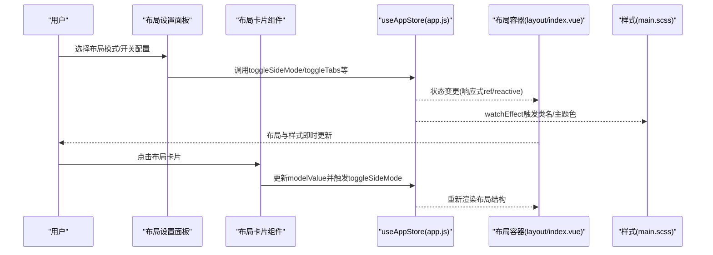
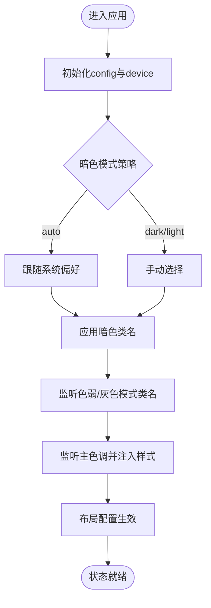
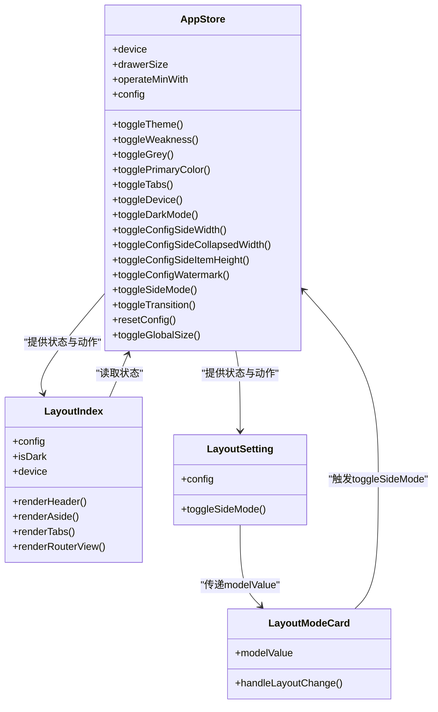
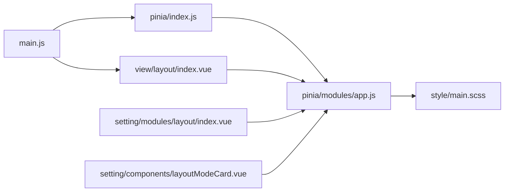

# 应用状态管理

<cite>
**本文引用的文件**
- [web/src/pinia/modules/app.js](file://web/src/pinia/modules/app.js)
- [web/src/pinia/index.js](file://web/src/pinia/index.js)
- [web/src/main.js](file://web/src/main.js)
- [web/src/view/layout/index.vue](file://web/src/view/layout/index.vue)
- [web/src/view/layout/setting/modules/layout/index.vue](file://web/src/view/layout/setting/modules/layout/index.vue)
- [web/src/view/layout/setting/components/layoutModeCard.vue](file://web/src/view/layout/setting/components/layoutModeCard.vue)
- [web/src/style/main.scss](file://web/src/style/main.scss)
- [web/src/core/gin-vue-admin.js](file://web/src/core/gin-vue-admin.js)
- [web/src/pinia/modules/user.js](file://web/src/pinia/modules/user.js)
- [repowiki/zh/content/前端应用/状态管理/状态持久化.md](file://repowiki/zh/content/前端应用/状态管理/状态持久化.md)
</cite>

## 目录
1. [引言](#引言)
2. [项目结构](#项目结构)
3. [核心组件](#核心组件)
4. [架构总览](#架构总览)
5. [详细组件分析](#详细组件分析)
6. [依赖关系分析](#依赖关系分析)
7. [性能考量](#性能考量)
8. [故障排除指南](#故障排除指南)
9. [结论](#结论)
10. [附录](#附录)

## 引言
本文件系统性阐述 Gin-Vue-Admin 前端应用的状态管理设计与实现，重点围绕应用级别状态（主题配置、布局设置、语言切换、菜单状态）展开。文档将深入解析 app.js 中的应用状态定义、主题切换逻辑、布局模式管理，说明状态持久化策略（localStorage 使用、状态恢复机制），阐述应用状态与 UI 组件的绑定关系（主题样式切换、布局响应式处理），并总结设计原则与最佳实践。

## 项目结构
前端应用通过 Pinia 进行状态管理，入口文件在 main.js 中完成应用初始化与插件注册；应用状态集中在 app.js 的 useAppStore 中，UI 层通过布局组件与设置面板进行交互。

**图表来源**
- [web/src/main.js:1-38](file://web/src/main.js#L1-L38)
- [web/src/pinia/index.js:1-9](file://web/src/pinia/index.js#L1-L9)
- [web/src/pinia/modules/app.js:1-163](file://web/src/pinia/modules/app.js#L1-L163)
- [web/src/view/layout/index.vue:1-119](file://web/src/view/layout/index.vue#L1-L119)
- [web/src/view/layout/setting/modules/layout/index.vue:1-145](file://web/src/view/layout/setting/modules/layout/index.vue#L1-L145)
- [web/src/view/layout/setting/components/layoutModeCard.vue:1-169](file://web/src/view/layout/setting/components/layoutModeCard.vue#L1-L169)
- [web/src/style/main.scss:1-60](file://web/src/style/main.scss#L1-L60)

**章节来源**
- [web/src/main.js:1-38](file://web/src/main.js#L1-L38)
- [web/src/pinia/index.js:1-9](file://web/src/pinia/index.js#L1-L9)
- [web/src/pinia/modules/app.js:1-163](file://web/src/pinia/modules/app.js#L1-L163)
- [web/src/view/layout/index.vue:1-119](file://web/src/view/layout/index.vue#L1-L119)
- [web/src/view/layout/setting/modules/layout/index.vue:1-145](file://web/src/view/layout/setting/modules/layout/index.vue#L1-L145)
- [web/src/view/layout/setting/components/layoutModeCard.vue:1-169](file://web/src/view/layout/setting/components/layoutModeCard.vue#L1-L169)
- [web/src/style/main.scss:1-60](file://web/src/style/main.scss#L1-L60)

## 核心组件
- 应用状态 Store（app.js）
  - 维护主题模式、主色调、侧边栏宽度、标签页显示、暗色模式策略、全局尺寸、过渡动画等配置
  - 通过响应式对象与 watchEffect 实现配置变更的即时生效
  - 提供主题切换、布局模式切换、设备适配、配置重置等动作
- 布局容器（layout/index.vue）
  - 根据应用状态动态渲染头部、侧边栏、标签页与页面内容区域
  - 支持水印、过渡动画、设备适配与菜单模式
- 布局设置面板（setting/modules/layout/index.vue）
  - 提供布局模式选择、界面配置开关与参数调节
  - 与应用状态进行双向绑定，触发状态变更
- 布局卡片组件（setting/components/layoutModeCard.vue）
  - 可视化展示不同布局模式的预览与选中态
  - 基于主色调计算不同透明度的辅助色，增强视觉反馈
- 样式基础（style/main.scss）
  - 定义主题相关的 CSS 类（如灰度、色弱模式），与应用状态联动

**章节来源**
- [web/src/pinia/modules/app.js:1-163](file://web/src/pinia/modules/app.js#L1-L163)
- [web/src/view/layout/index.vue:1-119](file://web/src/view/layout/index.vue#L1-L119)
- [web/src/view/layout/setting/modules/layout/index.vue:1-145](file://web/src/view/layout/setting/modules/layout/index.vue#L1-L145)
- [web/src/view/layout/setting/components/layoutModeCard.vue:1-169](file://web/src/view/layout/setting/components/layoutModeCard.vue#L1-L169)
- [web/src/style/main.scss:1-60](file://web/src/style/main.scss#L1-L60)

## 架构总览
应用状态管理采用 Pinia 单一事实源，UI 组件通过响应式绑定与事件驱动修改状态，状态变更通过 watchEffect 触发副作用（如 DOM 类名切换、主题色注入）。布局容器根据状态决定渲染结构与样式，设置面板提供可视化配置入口。

**图表来源**
- [web/src/view/layout/setting/modules/layout/index.vue:1-145](file://web/src/view/layout/setting/modules/layout/index.vue#L1-L145)
- [web/src/view/layout/setting/components/layoutModeCard.vue:1-169](file://web/src/view/layout/setting/components/layoutModeCard.vue#L1-L169)
- [web/src/pinia/modules/app.js:1-163](file://web/src/pinia/modules/app.js#L1-L163)
- [web/src/view/layout/index.vue:1-119](file://web/src/view/layout/index.vue#L1-L119)
- [web/src/style/main.scss:1-60](file://web/src/style/main.scss#L1-L60)

## 详细组件分析

### 应用状态定义与主题切换逻辑
- 状态结构
  - device：设备类型（如 mobile），用于控制抽屉宽度与最小操作宽度
  - drawerSize/operateMinWith：移动端与桌面端的抽屉尺寸与最小宽度
  - config：核心配置对象，包含色弱模式、灰色模式、主色调、标签页显示、暗色模式策略、侧边栏宽度、折叠宽度、菜单项高度、水印显示、侧边栏模式、页面过渡动画、全局尺寸等
- 主题与暗色模式
  - 使用外部库提供的暗色检测与切换能力，支持跟随系统或手动切换
  - 通过 watchEffect 监听暗色模式策略，自动同步到 DOM 的类名
- 色弱与灰色模式
  - 通过 watchEffect 切换 HTML 根元素的 CSS 类，实现全局滤镜效果
- 主色调与样式注入
  - 通过工具函数将主色调注入到文档样式变量，配合暗色模式区分明暗两套变量
- 布局配置
  - 侧边栏宽度、折叠宽度、菜单项高度、水印显示、侧边栏模式、过渡动画、全局尺寸等
- 重置配置
  - 提供重置到默认配置的能力，便于用户一键恢复

**图表来源**
- [web/src/pinia/modules/app.js:1-163](file://web/src/pinia/modules/app.js#L1-L163)

**章节来源**
- [web/src/pinia/modules/app.js:1-163](file://web/src/pinia/modules/app.js#L1-L163)

### 布局模式管理与 UI 绑定
- 布局容器根据 config.side_mode 与 device 控制侧边栏与头部的显示与组合
- 标签页显示受 config.showTabs 控制
- 水印显示受 config.show_watermark 控制，颜色随暗色模式动态调整
- 页面过渡动画名称来自 config.transition_type 或页面元信息
- 布局设置面板提供可视化布局卡片，点击后通过 toggleSideMode 切换模式

**图表来源**
- [web/src/pinia/modules/app.js:1-163](file://web/src/pinia/modules/app.js#L1-L163)
- [web/src/view/layout/index.vue:1-119](file://web/src/view/layout/index.vue#L1-L119)
- [web/src/view/layout/setting/modules/layout/index.vue:1-145](file://web/src/view/layout/setting/modules/layout/index.vue#L1-L145)
- [web/src/view/layout/setting/components/layoutModeCard.vue:1-169](file://web/src/view/layout/setting/components/layoutModeCard.vue#L1-L169)

**章节来源**
- [web/src/view/layout/index.vue:1-119](file://web/src/view/layout/index.vue#L1-L119)
- [web/src/view/layout/setting/modules/layout/index.vue:1-145](file://web/src/view/layout/setting/modules/layout/index.vue#L1-L145)
- [web/src/view/layout/setting/components/layoutModeCard.vue:1-169](file://web/src/view/layout/setting/components/layoutModeCard.vue#L1-L169)

### 应用状态与 UI 组件的绑定关系
- 主题样式切换
  - 通过 watchEffect 切换 HTML 根元素的 CSS 类（如色弱、灰色），实现全局滤镜效果
  - 通过工具函数将主色调注入到文档样式变量，配合暗色模式区分明暗两套变量
- 布局响应式处理
  - device 与 side_mode 共同决定侧边栏与头部的显示与组合
  - operateMinWith 与 drawerSize 随设备类型动态调整，保证交互体验
- 水印与过渡动画
  - 水印颜色随暗色模式动态调整
  - 页面过渡动画名称优先使用页面元信息，否则使用全局配置

**章节来源**
- [web/src/pinia/modules/app.js:1-163](file://web/src/pinia/modules/app.js#L1-L163)
- [web/src/view/layout/index.vue:1-119](file://web/src/view/layout/index.vue#L1-L119)
- [web/src/style/main.scss:1-60](file://web/src/style/main.scss#L1-L60)

### 应用状态持久化策略
- 状态持久化范围
  - 应用配置（主题、布局、全局尺寸、水印等）：适合跨会话持久化
  - 用户会话与令牌：适合会话内持久化（Cookie 与本地存储）
  - 页面标签历史：适合会话内持久化（sessionStorage）
- 持久化方式
  - 通过响应式对象与 watchEffect 监听配置变化，结合本地存储实现跨会话恢复
  - 用户令牌同时写入本地存储与 Cookie，登出或异常时统一清理
  - 标签页历史使用 sessionStorage，在路由变化时写入并在页面初始化时恢复
- 恢复机制
  - 应用启动时从本地存储读取配置并合并默认值，保证缺失项有默认值
  - 用户登录后将服务器下发的用户设置合并到应用配置，覆盖默认值
- 版本管理与兼容性
  - 关键状态引入版本号字段，升级时执行迁移脚本
  - 对不可解析的数据采用兜底策略，避免影响整体恢复

**章节来源**
- [repowiki/zh/content/前端应用/状态管理/状态持久化.md:1-320](file://repowiki/zh/content/前端应用/状态管理/状态持久化.md#L1-L320)
- [web/src/pinia/modules/user.js:1-151](file://web/src/pinia/modules/user.js#L1-L151)

## 依赖关系分析
- 入口与初始化
  - main.js 注册 gin-vue-admin 插件、Element Plus、路由、指令与 Pinia
  - gin-vue-admin.js 提供安装钩子与环境信息输出
- 状态导出与使用
  - pinia/index.js 导出 store 与 useAppStore/useUserStore/useDictionaryStore
  - 各组件通过 storeToRefs 读取响应式状态，通过 actions 修改状态
- 布局与设置面板
  - layout/index.vue 作为根布局，读取应用状态并渲染子组件
  - setting/modules/layout/index.vue 与 components/layoutModeCard.vue 提供可视化配置入口

**图表来源**
- [web/src/main.js:1-38](file://web/src/main.js#L1-L38)
- [web/src/pinia/index.js:1-9](file://web/src/pinia/index.js#L1-L9)
- [web/src/pinia/modules/app.js:1-163](file://web/src/pinia/modules/app.js#L1-L163)
- [web/src/view/layout/index.vue:1-119](file://web/src/view/layout/index.vue#L1-L119)
- [web/src/view/layout/setting/modules/layout/index.vue:1-145](file://web/src/view/layout/setting/modules/layout/index.vue#L1-L145)
- [web/src/view/layout/setting/components/layoutModeCard.vue:1-169](file://web/src/view/layout/setting/components/layoutModeCard.vue#L1-L169)
- [web/src/style/main.scss:1-60](file://web/src/style/main.scss#L1-L60)

**章节来源**
- [web/src/main.js:1-38](file://web/src/main.js#L1-L38)
- [web/src/core/gin-vue-admin.js:1-30](file://web/src/core/gin-vue-admin.js#L1-L30)
- [web/src/pinia/index.js:1-9](file://web/src/pinia/index.js#L1-L9)
- [web/src/pinia/modules/app.js:1-163](file://web/src/pinia/modules/app.js#L1-L163)
- [web/src/view/layout/index.vue:1-119](file://web/src/view/layout/index.vue#L1-L119)
- [web/src/view/layout/setting/modules/layout/index.vue:1-145](file://web/src/view/layout/setting/modules/layout/index.vue#L1-L145)
- [web/src/view/layout/setting/components/layoutModeCard.vue:1-169](file://web/src/view/layout/setting/components/layoutModeCard.vue#L1-L169)
- [web/src/style/main.scss:1-60](file://web/src/style/main.scss#L1-L60)

## 性能考量
- 状态粒度控制
  - 将布局、主题、全局尺寸等配置集中管理，避免分散在多个组件中导致重复渲染
- 响应式与副作用
  - 使用 watchEffect 监听必要状态，避免过度订阅导致的频繁重渲染
- 样式注入与类名切换
  - 主色调与滤镜类名切换开销较小，但应避免在高频事件中频繁调用
- 过渡动画
  - 页面过渡动画名称优先使用页面元信息，减少全局配置对局部页面的影响
- 会话内持久化
  - 标签页历史使用 sessionStorage，避免占用本地存储空间

## 故障排除指南
- 症状：刷新后布局设置未恢复
  - 排查：确认本地存储中是否存在对应键值，以及应用启动时是否正确读取并合并默认值
  - 处理：检查应用初始化逻辑与 watchEffect 监听器
- 症状：暗色模式切换无效
  - 排查：确认暗色模式策略与系统偏好是否一致，DOM 类名是否正确切换
  - 处理：检查 watchEffect 与外部库的集成
- 症状：主色调不生效
  - 排查：确认样式注入逻辑是否执行，CSS 变量是否正确设置
  - 处理：检查工具函数与 watchEffect 的调用顺序
- 症状：移动端布局异常
  - 排查：确认 device 状态与 side_mode 的组合逻辑，drawerSize 与 operateMinWith 是否按预期更新
  - 处理：检查 toggleDevice 与布局容器的条件渲染

**章节来源**
- [repowiki/zh/content/前端应用/状态管理/状态持久化.md:277-299](file://repowiki/zh/content/前端应用/状态管理/状态持久化.md#L277-L299)
- [web/src/pinia/modules/app.js:1-163](file://web/src/pinia/modules/app.js#L1-L163)

## 结论
本项目通过 Pinia 实现了应用级别的状态集中管理，结合 watchEffect 与 UI 组件的响应式绑定，提供了主题、布局、全局尺寸等配置的即时生效与持久化能力。建议在实际部署中明确状态生命周期与持久化边界，建立版本迁移与降级策略，完善监控与告警，以保障状态管理的稳定性与可维护性。

## 附录
- 设计原则
  - 状态粒度控制：将相关配置聚合管理，避免分散与重复
  - 性能优化：合理使用响应式与副作用，避免不必要的重渲染
  - 用户体验：提供一键重置、自动跟随系统偏好等便捷功能
- 配置选项与使用示例（概念性说明）
  - 主题配置：通过 actions 切换暗色模式、色弱模式、灰色模式与主色调
  - 布局配置：通过 actions 调整侧边栏宽度、折叠宽度、菜单项高度、水印显示与侧边栏模式
  - 全局尺寸与过渡动画：通过 actions 设置全局尺寸与页面过渡动画类型
  - 持久化策略：应用配置使用本地存储跨会话恢复，用户令牌使用本地存储与 Cookie，标签页历史使用 sessionStorage 会话内恢复
- 最佳实践
  - 避免在本地存储中存放敏感信息
  - 对大对象进行序列化时注意异常捕获与降级
  - 在组件销毁或页面卸载时主动清理监听，防止内存泄漏