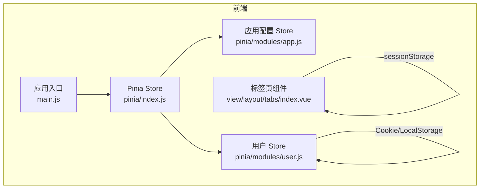
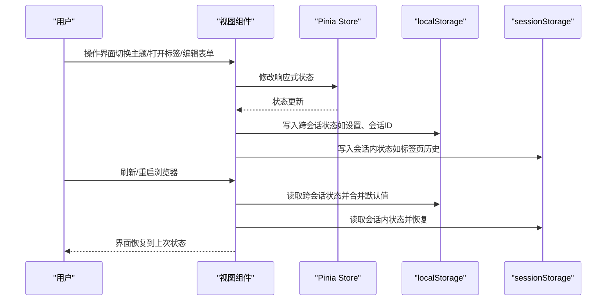
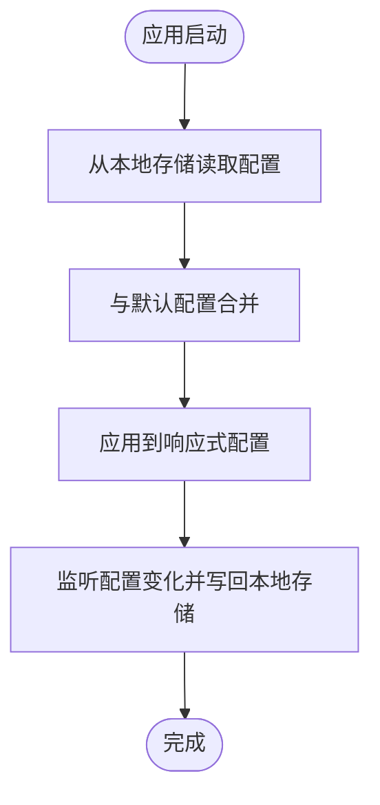
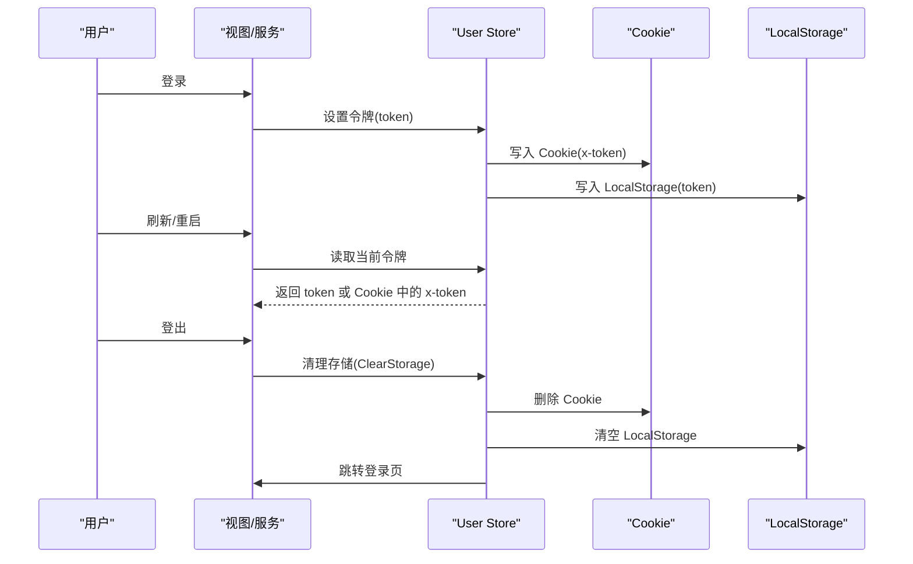
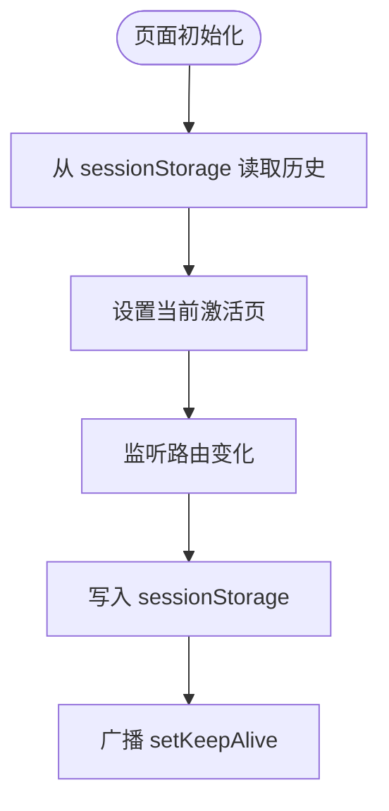
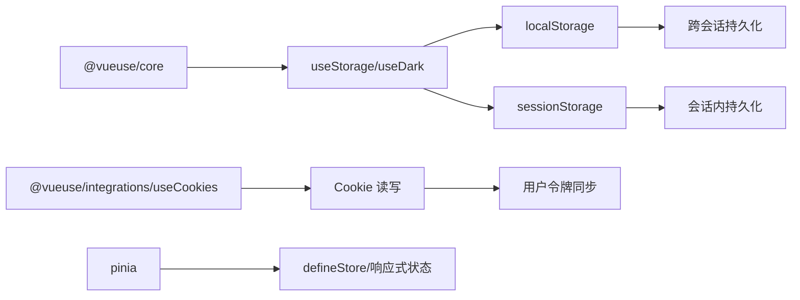

# 状态持久化

<cite>
**本文引用的文件**
- [状态持久化.md](file://repowiki/zh/content/前端应用/状态管理/状态持久化.md)
- [index.js](file://web/src/pinia/index.js)
- [app.js](file://web/src/pinia/modules/app.js)
- [user.js](file://web/src/pinia/modules/user.js)
- [index.vue](file://web/src/view/layout/tabs/index.vue)
- [request.js](file://web/src/utils/request.js)
- [main.js](file://web/src/main.js)
- [package.json](file://web/package.json)
</cite>

## 目录
1. [引言](#引言)
2. [项目结构](#项目结构)
3. [核心组件](#核心组件)
4. [架构总览](#架构总览)
5. [详细组件分析](#详细组件分析)
6. [依赖分析](#依赖分析)
7. [性能考量](#性能考量)
8. [故障排除指南](#故障排除指南)
9. [结论](#结论)
10. [附录](#附录)

## 引言
本文件面向 Gin-Vue-Admin 前端工程的状态持久化实现，系统性梳理了应用配置、用户会话、页面标签与复杂业务状态的持久化策略，覆盖 localStorage 与 sessionStorage 的使用边界、序列化与版本兼容、时机控制与最佳实践，并给出可落地的配置示例与排障建议。

## 项目结构
本项目采用前后端分离架构，前端基于 Vue 3 + Pinia，后端基于 Go。状态持久化主要发生在前端，涉及以下关键位置：
- 应用配置与主题偏好：通过 Pinia Store 与本地存储联动
- 用户会话与令牌：通过 Cookie 与本地存储结合
- 页面标签页历史：通过 sessionStorage 实现跨页会话恢复
- AI 工作流等复杂业务状态：通过 localStorage 实现跨会话恢复

**图表来源**
- [main.js:1-38](file://web/src/main.js#L1-L38)
- [index.js:1-9](file://web/src/pinia/index.js#L1-L9)
- [app.js:1-163](file://web/src/pinia/modules/app.js#L1-L163)
- [user.js:1-151](file://web/src/pinia/modules/user.js#L1-L151)
- [index.vue:1-422](file://web/src/view/layout/tabs/index.vue#L1-L422)

**章节来源**
- [状态持久化.md:30-62](file://repowiki/zh/content/前端应用/状态管理/状态持久化.md#L30-L62)
- [main.js:1-38](file://web/src/main.js#L1-L38)
- [index.js:1-9](file://web/src/pinia/index.js#L1-L9)

## 核心组件
- 应用配置 Store（app.js）
  - 维护主题、布局、全局尺寸、水印等配置
  - 通过响应式对象与 watchEffect 实现配置变更的即时生效
  - 与本地存储联动以实现跨会话恢复
- 用户 Store（user.js）
  - 维护用户信息与令牌
  - 使用 Cookie 与本地存储结合，支持登录态恢复与清理
  - 提供清理存储的方法，确保登出或异常时清除敏感数据
- 标签页组件（tabs/index.vue）
  - 维护页面访问历史与当前激活页
  - 使用 sessionStorage 在浏览器会话内持久化标签页状态
- AI 工作流组件（aiWrokflow/index.vue）
  - 维护工作流设置、活动会话 ID、表单与结果等
  - 使用 localStorage 实现跨浏览器会话的状态恢复

**章节来源**
- [状态持久化.md:67-87](file://repowiki/zh/content/前端应用/状态管理/状态持久化.md#L67-L87)
- [app.js:1-163](file://web/src/pinia/modules/app.js#L1-L163)
- [user.js:1-151](file://web/src/pinia/modules/user.js#L1-L151)
- [index.vue:1-422](file://web/src/view/layout/tabs/index.vue#L1-L422)

## 架构总览
下图展示了状态持久化在前端的关键交互路径：Pinia Store 负责状态管理；localStorage 与 sessionStorage 分别承担跨会话与会话内持久化；组件通过 watch 与事件总线实现状态写入与恢复。

**图表来源**
- [index.vue:252-352](file://web/src/view/layout/tabs/index.vue#L252-L352)
- [app.js:1-163](file://web/src/pinia/modules/app.js#L1-L163)
- [user.js:1-151](file://web/src/pinia/modules/user.js#L1-L151)

## 详细组件分析

### 应用配置持久化（app.js）
- 持久化内容
  - 主题模式、主色调、侧边栏宽度、是否显示水印、全局尺寸、过渡动画等
- 持久化方式
  - 通过响应式对象与 watchEffect 监听配置变化，结合本地存储实现跨会话恢复
- 数据格式
  - JSON 对象，键为配置项名，值为对应配置值
- 恢复机制
  - 应用启动时从本地存储读取配置并合并默认值，保证缺失项有默认值

**图表来源**
- [app.js:10-163](file://web/src/pinia/modules/app.js#L10-L163)

**章节来源**
- [状态持久化.md:118-135](file://repowiki/zh/content/前端应用/状态管理/状态持久化.md#L118-L135)
- [app.js:1-163](file://web/src/pinia/modules/app.js#L1-L163)

### 用户会话与令牌持久化（user.js）
- 持久化内容
  - 令牌（token）与 Cookie 中的 x-token
- 持久化方式
  - 令牌通过本地存储与 Cookie 双通道保存，登录成功后同时写入
- 数据格式
  - 字符串；令牌字符串
- 恢复机制
  - 登录成功后设置令牌并同步 Cookie；登出或异常时统一清理
- 注意事项
  - 登出时需同时清理本地存储与 Cookie，并清空 sessionStorage
  - 异常网络请求时触发清理并跳转登录页

**图表来源**
- [user.js:23-136](file://web/src/pinia/modules/user.js#L23-L136)
- [request.js:210-215](file://web/src/utils/request.js#L210-L215)

**章节来源**
- [状态持久化.md:143-183](file://repowiki/zh/content/前端应用/状态管理/状态持久化.md#L143-L183)
- [user.js:1-151](file://web/src/pinia/modules/user.js#L1-L151)
- [request.js:210-215](file://web/src/utils/request.js#L210-L215)

### 标签页历史持久化（tabs/index.vue）
- 持久化内容
  - 页面访问历史列表与当前激活页
- 持久化方式
  - 使用 sessionStorage 存储 JSON 字符串
- 数据格式
  - 数组对象，元素包含 name、meta、query、params 等
- 恢复机制
  - 页面加载时从 sessionStorage 读取历史并设置当前激活页
  - 通过事件总线通知 keep-alive 组件维持缓存

**图表来源**
- [index.vue:252-352](file://web/src/view/layout/tabs/index.vue#L252-L352)

**章节来源**
- [状态持久化.md:185-209](file://repowiki/zh/content/前端应用/状态管理/状态持久化.md#L185-L209)
- [index.vue:250-422](file://web/src/view/layout/tabs/index.vue#L250-L422)

### AI 工作流状态持久化（aiWrokflow/index.vue）
- 持久化内容
  - 设置（settings）、活动会话 ID（activeSessionIds）、表单与结果等
- 持久化方式
  - 使用 localStorage 存储 JSON 字符串
- 数据格式
  - 复合对象，包含设置、会话列表、表单与结果等
- 恢复机制
  - 页面加载时从 localStorage 读取并合并默认值，保证字段完整性

**章节来源**
- [状态持久化.md:211-230](file://repowiki/zh/content/前端应用/状态管理/状态持久化.md#L211-L230)

## 依赖分析
- 状态持久化依赖的核心库
  - @vueuse/core：提供 useStorage、useDark 等持久化与系统能力封装
  - @vueuse/integrations/useCookies：提供 Cookie 读写能力
  - pinia：提供状态管理与 store 定义
- 依赖关系示意

**图表来源**
- [package.json:14-56](file://web/package.json#L14-L56)
- [user.js:8-9](file://web/src/pinia/modules/user.js#L8-L9)
- [app.js:2-4](file://web/src/pinia/modules/app.js#L2-L4)

**章节来源**
- [package.json:1-88](file://web/package.json#L1-L88)
- [user.js:1-151](file://web/src/pinia/modules/user.js#L1-L151)
- [app.js:1-163](file://web/src/pinia/modules/app.js#L1-L163)

## 性能考量
- 存储容量与序列化成本
  - 大体量状态建议拆分存储或采用分片策略，避免单条记录过大导致序列化/反序列化开销与存储上限问题
- 读写时机与节流
  - 对频繁变更的状态采用防抖/节流策略，减少存储写入频率
- 清理与回收
  - 登出或异常场景统一清理存储，避免残留数据占用空间
- 版本兼容与迁移
  - 为关键状态引入版本号字段，升级时执行迁移脚本，对不可解析数据采用兜底策略

## 故障排除指南
- 常见问题与定位
  - 登录后状态未恢复：检查用户 Store 是否同时写入 Cookie 与 LocalStorage，确认请求拦截器中对 Token 的读取顺序
  - 标签页历史丢失：确认路由监听与 sessionStorage 写入逻辑，检查页面初始化时的历史读取与激活页设置
  - 应用配置未生效：确认 app Store 的默认配置合并逻辑与本地存储读取顺序
- 排查步骤
  - 打开浏览器开发者工具，查看 Application/存储面板中的 localStorage 与 sessionStorage
  - 在 Network 面板观察登录/登出接口的响应与 Cookie 设置
  - 在 Console 面板查看持久化过程中的错误日志
- 清理与重置
  - 登出流程应包含 ClearStorage 调用，确保 token、Cookie 与 sessionStorage 清理
  - 如遇异常状态，可在控制台手动清理相关键值并刷新页面

**章节来源**
- [user.js:128-136](file://web/src/pinia/modules/user.js#L128-L136)
- [index.vue:252-352](file://web/src/view/layout/tabs/index.vue#L252-L352)
- [app.js:123-127](file://web/src/pinia/modules/app.js#L123-L127)

## 结论
本项目通过 Pinia Store、localStorage 与 sessionStorage 的组合，实现了应用配置、用户会话、页面标签与复杂业务状态的多层级持久化。建议在实际部署中：
- 明确各状态的生命周期与持久化边界
- 对大体量状态进行分片与压缩
- 建立版本迁移与降级策略，保障向后兼容
- 完善监控与告警，及时发现存储异常

## 附录
- 配置示例（概念性说明）
  - 应用配置持久化：在应用启动时从本地存储读取配置并合并默认值，随后监听配置变化写回
  - 用户令牌持久化：登录成功后同时写入本地存储与 Cookie；登出或异常时统一清理
  - 标签页持久化：在路由变化时写入 sessionStorage；页面初始化时读取并恢复
  - AI 工作流持久化：在设置与会话变化时写入 localStorage；组件挂载时读取并合并默认值
- 版本管理与兼容性
  - 为关键状态引入版本号字段，升级时执行迁移脚本
  - 对不可解析的数据采用兜底策略，避免影响整体恢复
- 最佳实践
  - 避免在 localStorage/sessionStorage 中存放敏感信息
  - 对大对象进行序列化时注意异常捕获与降级
  - 在组件销毁或页面卸载时主动清理监听，防止内存泄漏