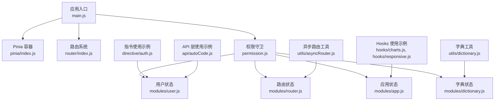
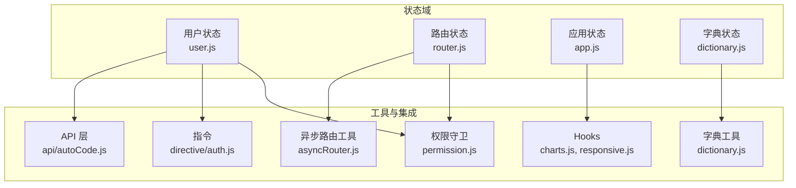
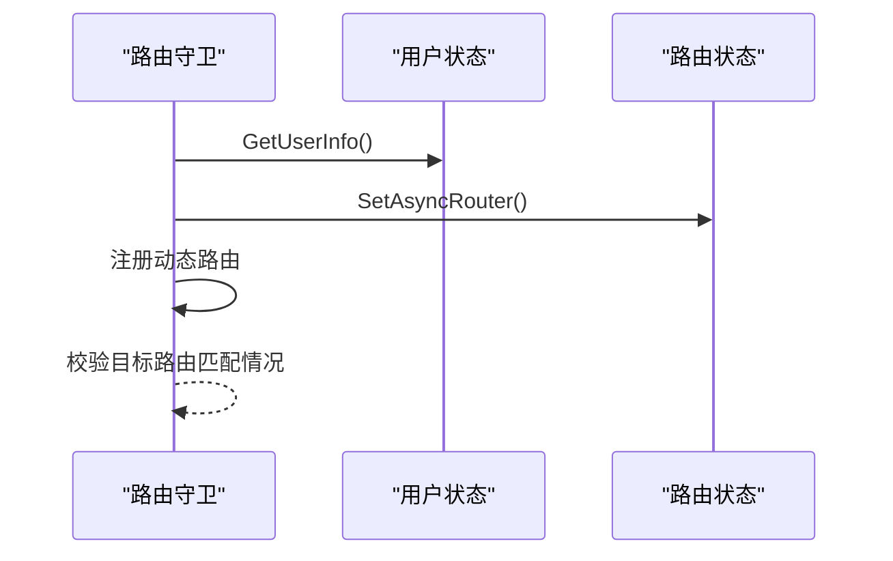
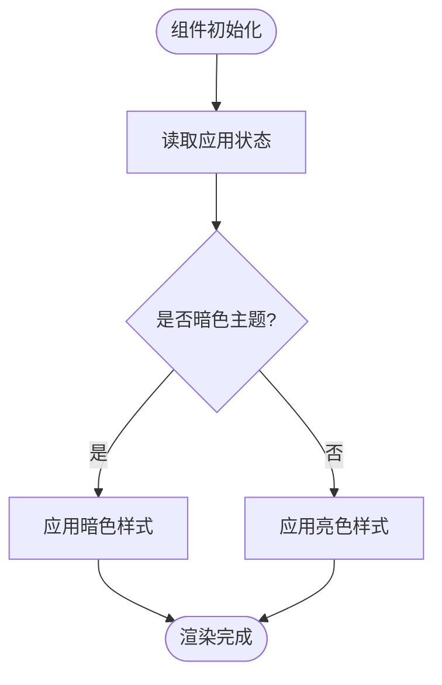
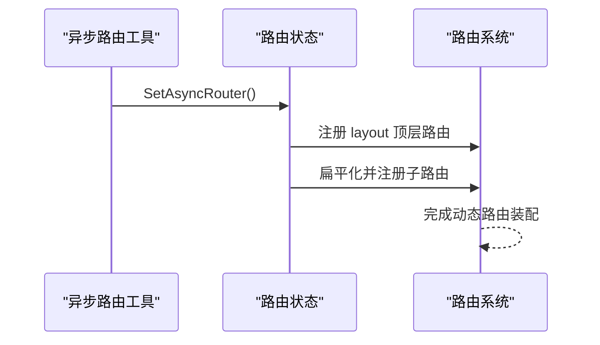
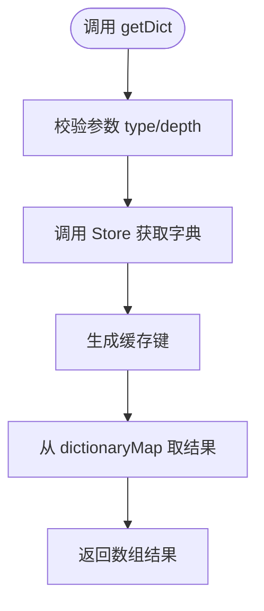
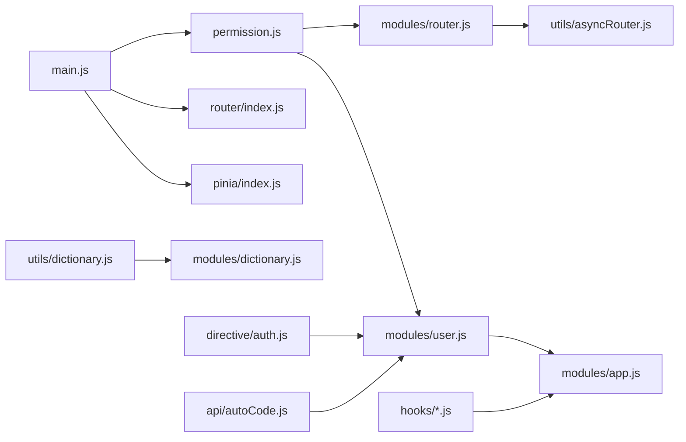

# 状态管理

<cite>
**本文引用的文件**
- [web/src/pinia/index.js](file://web/src/pinia/index.js)
- [web/src/main.js](file://web/src/main.js)
- [web/src/permission.js](file://web/src/permission.js)
- [web/src/utils/dictionary.js](file://web/src/utils/dictionary.js)
- [web/src/utils/asyncRouter.js](file://web/src/utils/asyncRouter.js)
- [web/src/router/index.js](file://web/src/router/index.js)
- [web/src/hooks/charts.js](file://web/src/hooks/charts.js)
- [web/src/hooks/responsive.js](file://web/src/hooks/responsive.js)
- [web/src/directive/auth.js](file://web/src/directive/auth.js)
- [web/src/api/autoCode.js](file://web/src/api/autoCode.js)
- [web/src/core/gin-vue-admin.js](file://web/src/core/gin-vue-admin.js)
</cite>

## 目录
1. [简介](#简介)
2. [项目结构](#项目结构)
3. [核心组件](#核心组件)
4. [架构总览](#架构总览)
5. [详细组件分析](#详细组件分析)
6. [依赖分析](#依赖分析)
7. [性能考量](#性能考量)
8. [故障排查指南](#故障排查指南)
9. [结论](#结论)
10. [附录](#附录)

## 简介
本文件面向基于 Pinia 的前端状态管理子系统，系统性梳理 Store 模块化组织、状态定义规范、动作函数设计与持久化策略，深入解析用户、应用、路由与字典四大状态域的职责边界与协作关系；同时阐述与路由、权限系统的集成方案，给出组合式 API 使用模式与 Hooks 设计理念的最佳实践。

## 项目结构
- 状态管理入口位于 Pinia 容器初始化处，集中导出各模块 Store 实例，供全局按需注入与使用。
- 应用启动阶段通过根实例安装 Pinia，随后在路由守卫与指令等处消费 Store 状态，实现跨模块联动。
- 工具层提供字典查询与异步路由处理等辅助能力，支撑状态域的数据来源与动态路由装配。

**图示来源**
- [web/src/main.js:17-35](file://web/src/main.js#L17-L35)
- [web/src/pinia/index.js:1-8](file://web/src/pinia/index.js#L1-L8)
- [web/src/permission.js:155-209](file://web/src/permission.js#L155-L209)
- [web/src/utils/dictionary.js:1-94](file://web/src/utils/dictionary.js#L1-L94)
- [web/src/utils/asyncRouter.js:1-30](file://web/src/utils/asyncRouter.js#L1-L30)
- [web/src/hooks/charts.js:4-9](file://web/src/hooks/charts.js#L4-L9)
- [web/src/hooks/responsive.js:5-21](file://web/src/hooks/responsive.js#L5-L21)
- [web/src/directive/auth.js:1-8](file://web/src/directive/auth.js#L1-L8)
- [web/src/api/autoCode.js:1-80](file://web/src/api/autoCode.js#L1-L80)

**章节来源**
- [web/src/main.js:1-38](file://web/src/main.js#L1-L38)
- [web/src/pinia/index.js:1-9](file://web/src/pinia/index.js#L1-L9)

## 核心组件
- Pinia 容器与模块导出：在容器初始化处集中导入并导出各模块 Store，便于全局统一注入与按需使用。
- 应用启动集成：在应用根实例中安装 Pinia，确保后续组件与指令可直接通过组合式 API 访问 Store。
- 路由守卫与状态联动：路由守卫在进入前根据用户状态决定是否拉取用户信息与动态路由，并进行路由注册与面包屑/缓存处理。
- 工具层支撑：字典工具负责生成缓存键与获取字典数据；异步路由工具负责将菜单配置转换为可注册路由。

**章节来源**
- [web/src/pinia/index.js:1-9](file://web/src/pinia/index.js#L1-L9)
- [web/src/main.js:17-35](file://web/src/main.js#L17-L35)
- [web/src/permission.js:116-146](file://web/src/permission.js#L116-L146)
- [web/src/utils/dictionary.js:38-74](file://web/src/utils/dictionary.js#L38-L74)
- [web/src/utils/asyncRouter.js:4-29](file://web/src/utils/asyncRouter.js#L4-L29)

## 架构总览
状态管理围绕“用户—路由—应用—字典”四域展开，形成如下闭环：
- 用户域：维护登录态、用户信息与权限，驱动路由与页面可见性。
- 路由域：维护动态路由树与面包屑，配合守卫完成路由注册与缓存策略。
- 应用域：维护主题、设备、布局等全局偏好，影响 UI 渲染与交互。
- 字典域：维护数据字典缓存，提供查询与标签展示工具。

**图示来源**
- [web/src/permission.js:1-225](file://web/src/permission.js#L1-L225)
- [web/src/utils/asyncRouter.js:1-30](file://web/src/utils/asyncRouter.js#L1-L30)
- [web/src/utils/dictionary.js:1-94](file://web/src/utils/dictionary.js#L1-L94)
- [web/src/hooks/charts.js:1-9](file://web/src/hooks/charts.js#L1-L9)
- [web/src/hooks/responsive.js:1-21](file://web/src/hooks/responsive.js#L1-L21)
- [web/src/directive/auth.js:1-8](file://web/src/directive/auth.js#L1-L8)
- [web/src/api/autoCode.js:1-80](file://web/src/api/autoCode.js#L1-L80)

## 详细组件分析

### 用户状态管理
- 职责边界：维护 token、用户信息、权限集合与默认路由；提供获取用户信息、设置权限等动作。
- 与路由集成：在路由守卫中触发用户信息拉取，结合路由状态的动态路由标志位，决定是否进行动态路由装配。
- 与指令/API 集成：指令与 API 层通过读取用户状态实现按钮级权限控制与请求头注入。

**图示来源**
- [web/src/permission.js:116-146](file://web/src/permission.js#L116-L146)
- [web/src/permission.js:155-209](file://web/src/permission.js#L155-L209)

**章节来源**
- [web/src/permission.js:1-225](file://web/src/permission.js#L1-L225)
- [web/src/directive/auth.js:1-8](file://web/src/directive/auth.js#L1-L8)
- [web/src/api/autoCode.js:1-80](file://web/src/api/autoCode.js#L1-L80)

### 应用状态管理
- 职责边界：维护主题（明暗）、设备类型（移动端/桌面端）、布局偏好等全局状态。
- Hooks 使用：通过组合式 API 在图表与响应式场景中读取/切换主题与设备类型，实现 UI 与交互的自适应。

**图示来源**
- [web/src/hooks/charts.js:4-9](file://web/src/hooks/charts.js#L4-L9)
- [web/src/hooks/responsive.js:5-21](file://web/src/hooks/responsive.js#L5-L21)

**章节来源**
- [web/src/hooks/charts.js:1-9](file://web/src/hooks/charts.js#L1-L9)
- [web/src/hooks/responsive.js:1-21](file://web/src/hooks/responsive.js#L1-L21)

### 路由状态管理
- 职责边界：维护动态路由树、面包屑数据与缓存策略；提供设置异步路由、处理 keep-alive 等动作。
- 动态路由装配：将后端返回的菜单树扁平化为可注册路由，自动挂载到 layout 下或作为顶级路由注册。
- 面包屑与缓存：在 beforeEach 中处理 matched 缓存与 keep-alive，afterEach 中滚动至顶部与进度条收尾。

**图示来源**
- [web/src/utils/asyncRouter.js:4-29](file://web/src/utils/asyncRouter.js#L4-L29)
- [web/src/permission.js:116-146](file://web/src/permission.js#L116-L146)

**章节来源**
- [web/src/utils/asyncRouter.js:1-30](file://web/src/utils/asyncRouter.js#L1-L30)
- [web/src/permission.js:1-225](file://web/src/permission.js#L1-L225)

### 字典状态管理
- 职责边界：维护字典缓存映射，提供按类型、深度、节点值的查询能力；支持树形与扁平化两种形态。
- 查询流程：生成缓存键 → 调用 Store 获取 → 从缓存映射取结果 → 返回数组形式。
- 工具函数：提供标签展示辅助方法，将字典数组映射为键值对以快速查找 label。

**图示来源**
- [web/src/utils/dictionary.js:38-74](file://web/src/utils/dictionary.js#L38-L74)

**章节来源**
- [web/src/utils/dictionary.js:1-94](file://web/src/utils/dictionary.js#L1-L94)

### 状态持久化策略
- 用户状态：token 与用户信息通常保存于会话存储或内存中，结合路由守卫在白名单与首次加载时拉取。
- 路由状态：动态路由树与面包屑在内存中维护，随路由切换更新；可通过浏览器历史记录与 keep-alive 控制页面缓存。
- 应用状态：主题与设备偏好建议持久化到本地存储并在应用启动时恢复。
- 字典状态：字典缓存映射在内存中，建议在用户登录后拉取并按类型/深度缓存，避免重复请求。

**章节来源**
- [web/src/permission.js:155-209](file://web/src/permission.js#L155-L209)
- [web/src/utils/dictionary.js:38-74](file://web/src/utils/dictionary.js#L38-L74)

### 状态同步机制与异步处理
- 并行初始化：在路由守卫中并行拉取用户信息与动态路由，缩短首屏等待时间。
- 路由守卫同步：beforeEach 中处理 keep-alive 与面包屑缓存，afterEach 中统一滚动与进度条收尾。
- 异步路由转换：通过工具函数将菜单配置转换为可注册路由，保证路由树与菜单树一致。

**章节来源**
- [web/src/permission.js:116-146](file://web/src/permission.js#L116-L146)
- [web/src/utils/asyncRouter.js:1-30](file://web/src/utils/asyncRouter.js#L1-L30)

### 组合式 API 与 Hooks 设计理念
- 组合式 API：在组件中通过 defineStore 定义 Store，使用组合式 API 在逻辑与视图之间解耦。
- Hooks 设计：将与主题、设备相关的状态抽取为 Hooks，复用性强且易于测试；在图表与响应式场景中直接使用。

**章节来源**
- [web/src/hooks/charts.js:1-9](file://web/src/hooks/charts.js#L1-L9)
- [web/src/hooks/responsive.js:1-21](file://web/src/hooks/responsive.js#L1-L21)

## 依赖分析
- 入口依赖：应用入口安装 Pinia 容器，随后在路由守卫、指令与 API 层消费 Store。
- 模块依赖：用户状态依赖应用状态（主题等）与路由状态（动态路由），路由状态依赖异步路由工具；字典工具依赖字典状态。
- 外部依赖：路由系统、进度条、Element Plus 等第三方库。

**图示来源**
- [web/src/main.js:1-38](file://web/src/main.js#L1-L38)
- [web/src/pinia/index.js:1-9](file://web/src/pinia/index.js#L1-L9)
- [web/src/permission.js:1-225](file://web/src/permission.js#L1-L225)
- [web/src/utils/asyncRouter.js:1-30](file://web/src/utils/asyncRouter.js#L1-L30)
- [web/src/utils/dictionary.js:1-94](file://web/src/utils/dictionary.js#L1-L94)
- [web/src/directive/auth.js:1-8](file://web/src/directive/auth.js#L1-L8)
- [web/src/api/autoCode.js:1-80](file://web/src/api/autoCode.js#L1-L80)
- [web/src/hooks/charts.js:1-9](file://web/src/hooks/charts.js#L1-L9)
- [web/src/hooks/responsive.js:1-21](file://web/src/hooks/responsive.js#L1-L21)

**章节来源**
- [web/src/main.js:1-38](file://web/src/main.js#L1-L38)
- [web/src/permission.js:1-225](file://web/src/permission.js#L1-L225)

## 性能考量
- 并行拉取：在路由守卫中并行获取用户信息与动态路由，减少首屏等待。
- 缓存策略：字典状态采用按类型/深度/节点值的缓存键，避免重复请求；路由状态利用 matched 缓存与 keep-alive 控制页面重建。
- 路由懒加载：通过异步路由工具与动态导入，按需加载组件，降低首屏体积。
- 主题切换：应用状态的主题切换应尽量使用 CSS 变量与类名切换，避免强制重排。

**章节来源**
- [web/src/permission.js:116-146](file://web/src/permission.js#L116-L146)
- [web/src/utils/dictionary.js:10-15](file://web/src/utils/dictionary.js#L10-L15)
- [web/src/utils/asyncRouter.js:1-30](file://web/src/utils/asyncRouter.js#L1-L30)

## 故障排查指南
- 登录后无法进入首页：检查白名单与默认路由逻辑，确认用户信息拉取成功与动态路由装配完成。
- 动态路由不生效：确认 layout 顶层路由已注册，且子路由扁平化逻辑正确挂载到 layout 或顶级路由下。
- 字典查询为空：检查缓存键生成规则与 dictionaryMap 结构，确认 Store 已完成数据填充。
- 指令权限不生效：检查指令中读取的用户状态字段与后端权限一致，确认用户状态已更新。

**章节来源**
- [web/src/permission.js:155-209](file://web/src/permission.js#L155-L209)
- [web/src/utils/dictionary.js:38-74](file://web/src/utils/dictionary.js#L38-L74)
- [web/src/directive/auth.js:1-8](file://web/src/directive/auth.js#L1-L8)

## 结论
本状态管理方案以 Pinia 为核心，围绕用户、路由、应用与字典四大状态域构建模块化体系，结合路由守卫与工具层实现动态路由与字典缓存的高效协同。通过组合式 API 与 Hooks 提升代码复用性与可维护性，配合并行初始化与缓存策略保障性能。建议在生产环境中进一步完善持久化与错误监控，持续优化用户体验。

## 附录
- 应用启动与初始化流程：应用入口安装 Pinia、路由与指令，随后在路由守卫中完成用户与路由状态的初始化。
- 配置与环境：框架通过全局注册与环境变量提供配置入口，便于扩展与定制。

**章节来源**
- [web/src/main.js:1-38](file://web/src/main.js#L1-L38)
- [web/src/core/gin-vue-admin.js:1-30](file://web/src/core/gin-vue-admin.js#L1-L30)