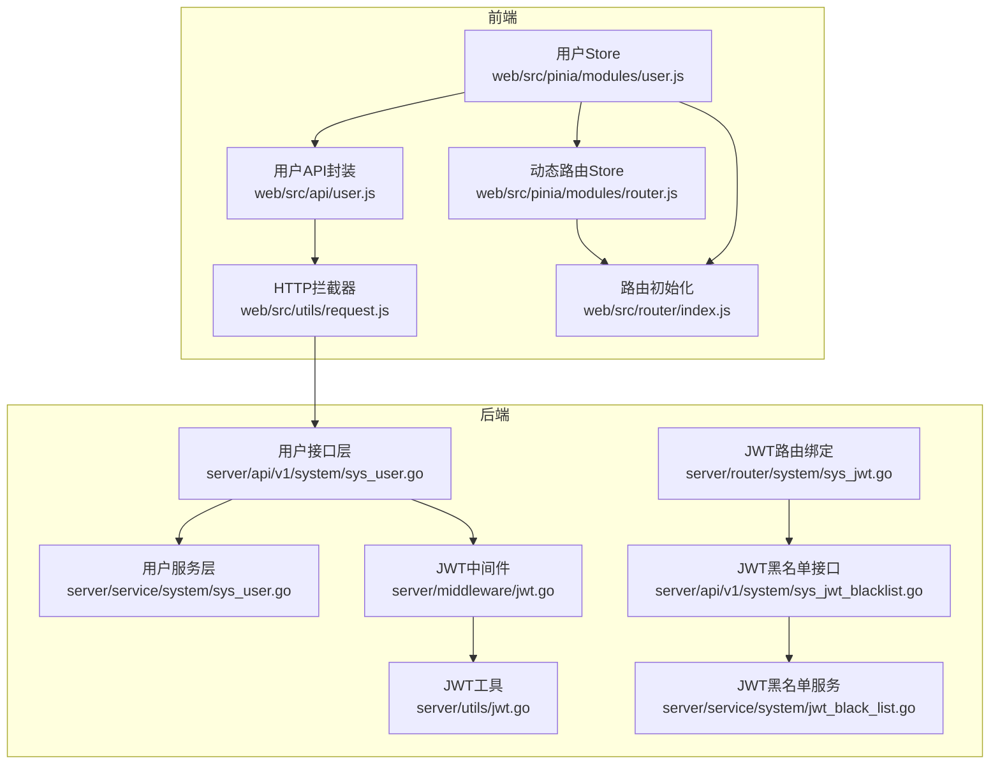
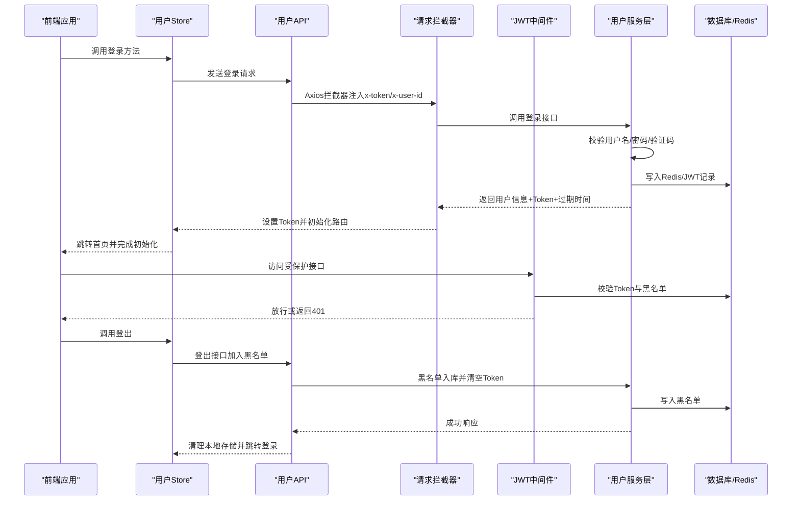
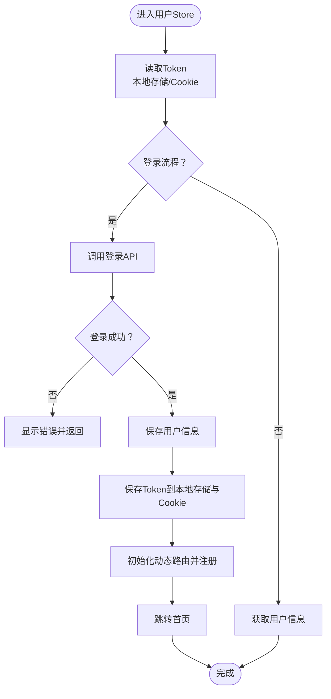
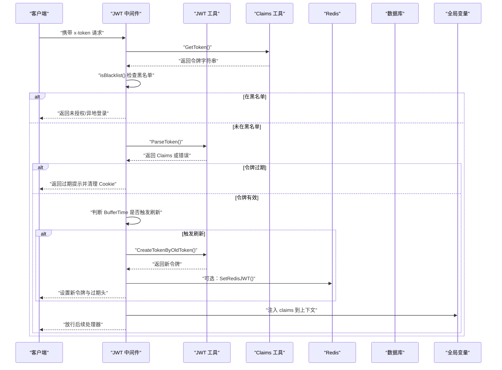
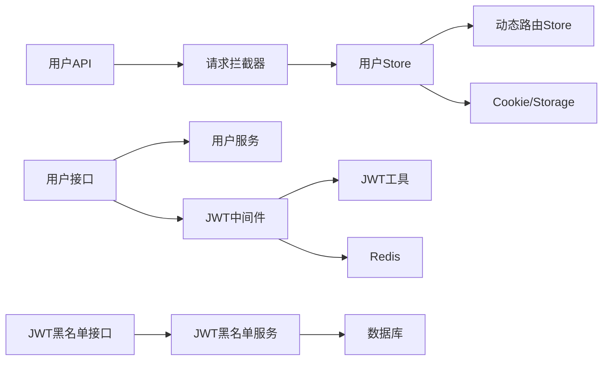

# 用户状态管理

<cite>
**本文引用的文件**
- [web/src/pinia/modules/user.js](file://web/src/pinia/modules/user.js)
- [web/src/api/user.js](file://web/src/api/user.js)
- [web/src/utils/request.js](file://web/src/utils/request.js)
- [web/src/pinia/modules/router.js](file://web/src/pinia/modules/router.js)
- [web/src/api/jwt.js](file://web/src/api/jwt.js)
- [server/api/v1/system/sys_user.go](file://server/api/v1/system/sys_user.go)
- [server/utils/jwt.go](file://server/utils/jwt.go)
- [server/middleware/jwt.go](file://server/middleware/jwt.go)
- [server/api/v1/system/sys_jwt_blacklist.go](file://server/api/v1/system/sys_jwt_blacklist.go)
- [server/service/system/jwt_black_list.go](file://server/service/system/jwt_black_list.go)
- [server/model/system/sys_user.go](file://server/model/system/sys_user.go)
- [server/model/system/request/sys_user.go](file://server/model/system/request/sys_user.go)
- [repowiki/zh/content/前端应用/状态管理/用户状态管理.md](file://repowiki/zh/content/前端应用/状态管理/用户状态管理.md)
- [repowiki/zh/content/安全权限/认证系统.md](file://repowiki/zh/content/安全权限/认证系统.md)
- [repowiki/zh/content/系统架构/设计模式应用/中间件链模式.md](file://repowiki/zh/content/系统架构/设计模式应用/中间件链模式.md)
</cite>

## 目录
1. [简介](#简介)
2. [项目结构](#项目结构)
3. [核心组件](#核心组件)
4. [架构总览](#架构总览)
5. [详细组件分析](#详细组件分析)
6. [依赖分析](#依赖分析)
7. [性能考量](#性能考量)
8. [故障排查指南](#故障排查指南)
9. [结论](#结论)
10. [附录](#附录)

## 简介
本文件面向测试管理平台的“用户状态管理”模块，聚焦于前端 Pinia Store 的设计与实现、用户信息与权限状态管理、登录/登出流程、会话与 Token 处理、本地存储策略与安全考虑，并提供 API 使用示例与错误处理方法。文档同时给出后端 JWT 鉴权、Token 刷新与黑名单机制的技术要点，帮助开发者快速理解与扩展用户状态相关功能。

## 项目结构
用户状态管理涉及前后端协作：前端负责用户 Store、路由初始化、请求拦截与 Token 维护；后端负责登录鉴权、JWT 签发与刷新、Token 黑名单与登出作废。

图表来源
- [web/src/pinia/modules/user.js:1-151](file://web/src/pinia/modules/user.js#L1-L151)
- [web/src/utils/request.js:1-232](file://web/src/utils/request.js#L1-L232)
- [web/src/api/user.js:1-182](file://web/src/api/user.js#L1-L182)
- [web/src/router/index.js:1-42](file://web/src/router/index.js#L1-L42)
- [web/src/pinia/modules/router.js:1-208](file://web/src/pinia/modules/router.js#L1-L208)
- [server/api/v1/system/sys_user.go:1-517](file://server/api/v1/system/sys_user.go#L1-L517)
- [server/service/system/sys_user.go:1-337](file://server/service/system/sys_user.go#L1-L337)
- [server/middleware/jwt.go:1-90](file://server/middleware/jwt.go#L1-L90)
- [server/utils/jwt.go:1-106](file://server/utils/jwt.go#L1-L106)
- [server/api/v1/system/sys_jwt_blacklist.go:1-34](file://server/api/v1/system/sys_jwt_blacklist.go#L1-L34)
- [server/service/system/jwt_black_list.go:1-53](file://server/service/system/jwt_black_list.go#L1-L53)
- [server/router/system/sys_jwt.go:1-15](file://server/router/system/sys_jwt.go#L1-L15)

章节来源
- [web/src/pinia/modules/user.js:1-151](file://web/src/pinia/modules/user.js#L1-L151)
- [web/src/utils/request.js:1-232](file://web/src/utils/request.js#L1-L232)
- [server/api/v1/system/sys_user.go:1-517](file://server/api/v1/system/sys_user.go#L1-L517)

## 核心组件
- 前端用户 Store（Pinia）
  - 管理用户信息、Token、登录/登出、路由初始化、本地存储清理
  - 通过 Cookie 与本地存储双通道读取 Token，确保兼容性
- 请求拦截器（Axios）
  - 自动注入 x-token、x-user-id 头部
  - 处理 401 与新 Token 头部，统一错误提示
- 动态路由 Store
  - 从后端拉取菜单/权限，生成可访问路由并注册
- 后端用户接口与服务
  - 登录签发 JWT，权限切换与刷新，用户信息维护
- JWT 中间件与工具
  - 鉴权校验、过期刷新、黑名单校验、Redis 存储
- JWT 黑名单
  - 登出时将 Token 加入黑名单并清空客户端 Token

章节来源
- [web/src/pinia/modules/user.js:13-150](file://web/src/pinia/modules/user.js#L13-L150)
- [web/src/utils/request.js:119-232](file://web/src/utils/request.js#L119-L232)
- [web/src/pinia/modules/router.js:158-207](file://web/src/pinia/modules/router.js#L158-L207)
- [server/api/v1/system/sys_user.go:20-161](file://server/api/v1/system/sys_user.go#L20-L161)
- [server/middleware/jwt.go:16-78](file://server/middleware/jwt.go#L16-L78)
- [server/utils/jwt.go:13-106](file://server/utils/jwt.go#L13-L106)
- [server/api/v1/system/sys_jwt_blacklist.go:14-34](file://server/api/v1/system/sys_jwt_blacklist.go#L14-L34)

## 架构总览
下图展示从前端登录到后端签发 Token、前端保存与携带 Token、以及登出作废 Token 的完整链路。

图表来源
- [web/src/pinia/modules/user.js:63-126](file://web/src/pinia/modules/user.js#L63-L126)
- [web/src/api/user.js:6-12](file://web/src/api/user.js#L6-L12)
- [web/src/utils/request.js:119-232](file://web/src/utils/request.js#L119-L232)
- [server/api/v1/system/sys_user.go:20-161](file://server/api/v1/system/sys_user.go#L20-L161)
- [server/middleware/jwt.go:16-78](file://server/middleware/jwt.go#L16-L78)
- [server/api/v1/system/sys_jwt_blacklist.go:22-33](file://server/api/v1/system/sys_jwt_blacklist.go#L22-L33)

## 详细组件分析

### 前端用户 Store 设计与实现
- 数据模型
  - 用户信息：包含 UUID、昵称、头像、权限对象
  - Token：优先使用本地存储，其次 Cookie，计算属性统一对外暴露
- 关键方法
  - 登录：发起登录请求，成功后写入用户信息与 Token，初始化动态路由并注册到路由器，最后跳转首页
  - 获取用户信息：调用后端获取用户详情
  - 登出：调用后端将当前 Token 加入黑名单，清理本地存储并跳转登录页
  - 清理存储：清空 Token、Cookie、SessionStorage、LocalStorage 相关项
  - 重置用户信息：按需合并更新部分字段
- 本地存储与安全
  - Token 同时写入本地存储与 Cookie，读取时优先级为本地存储 > Cookie
  - 登出时同步移除 Cookie 与本地存储，避免残留
  - 登录成功后记录操作系统类型到本地存储，便于后续行为判断

图表来源
- [web/src/pinia/modules/user.js:55-104](file://web/src/pinia/modules/user.js#L55-L104)
- [web/src/pinia/modules/user.js:113-136](file://web/src/pinia/modules/user.js#L113-L136)

章节来源
- [web/src/pinia/modules/user.js:13-150](file://web/src/pinia/modules/user.js#L13-L150)

### 请求拦截器与 Token 管理
- 自动注入头部：在请求拦截器中自动注入 x-token 和 x-user-id 头部
- 错误处理：统一处理 401 未授权错误，自动清理存储并跳转登录
- Token 刷新：当响应头包含 new-token 时，自动更新前端 Token
- Loading 控制：统一管理请求 Loading 状态，避免长时间阻塞

章节来源
- [web/src/utils/request.js:119-232](file://web/src/utils/request.js#L119-L232)

### 动态路由与权限初始化
- 路由生成：从后端获取菜单树，格式化为可访问路由
- KeepAlive 管理：根据配置和历史记录动态启用组件缓存
- 菜单联动：维护顶部菜单与左侧菜单的联动关系
- 路由注册：将动态路由注册到路由器，支持权限控制

章节来源
- [web/src/pinia/modules/router.js:158-207](file://web/src/pinia/modules/router.js#L158-L207)

### 后端 JWT 认证与刷新
- 登录签发：校验用户名/密码/验证码后签发 JWT，支持多点登录控制
- 过期刷新：在即将过期时自动刷新令牌并回写响应头
- 黑名单机制：登出时将 Token 加入黑名单，确保立即失效
- Redis 存储：JWT 存储于 Redis，提升校验性能与并发安全

图表来源
- [server/middleware/jwt.go:16-78](file://server/middleware/jwt.go#L16-L78)
- [server/utils/jwt.go:48-88](file://server/utils/jwt.go#L48-L88)
- [server/utils/claims.go:42-65](file://server/utils/claims.go#L42-L65)
- [server/global/global.go:25-42](file://server/global/global.go#L25-L42)

章节来源
- [server/middleware/jwt.go:16-78](file://server/middleware/jwt.go#L16-L78)
- [server/utils/jwt.go:48-88](file://server/utils/jwt.go#L48-L88)

### 用户模型与权限数据结构
- 用户模型：包含基础信息、角色关联、多角色映射、启用状态、原始设置等
- 权限结构：支持主角色与多角色关联，权限切换时校验默认路由可用性
- 接口定义：登录、注册、修改密码、设置权限、删除用户等完整用户管理接口

章节来源
- [server/model/system/sys_user.go:20-38](file://server/model/system/sys_user.go#L20-L38)
- [server/model/system/request/sys_user.go:21-50](file://server/model/system/request/sys_user.go#L21-L50)

## 依赖分析
- 前端依赖
  - 用户 Store 依赖动态路由 Store 与 Cookie/Storage 工具
  - 请求拦截器依赖用户 Store 以注入 Token
  - 登录/登出 API 依赖 Axios 服务
- 后端依赖
  - 用户接口依赖服务层与 JWT 中间件
  - JWT 中间件依赖 JWT 工具与 Redis
  - 黑名单接口依赖服务层与数据库

图表来源
- [web/src/pinia/modules/user.js:1-151](file://web/src/pinia/modules/user.js#L1-L151)
- [web/src/utils/request.js:1-232](file://web/src/utils/request.js#L1-L232)
- [server/api/v1/system/sys_user.go:1-517](file://server/api/v1/system/sys_user.go#L1-L517)
- [server/middleware/jwt.go:1-90](file://server/middleware/jwt.go#L1-L90)
- [server/utils/jwt.go:1-106](file://server/utils/jwt.go#L1-L106)
- [server/api/v1/system/sys_jwt_blacklist.go:1-34](file://server/api/v1/system/sys_jwt_blacklist.go#L1-L34)
- [server/service/system/jwt_black_list.go:1-53](file://server/service/system/jwt_black_list.go#L1-L53)

章节来源
- [web/src/pinia/modules/user.js:1-151](file://web/src/pinia/modules/user.js#L1-L151)
- [web/src/utils/request.js:1-232](file://web/src/utils/request.js#L1-L232)
- [server/api/v1/system/sys_user.go:1-517](file://server/api/v1/system/sys_user.go#L1-L517)

## 性能考量
- Token 刷新并发控制：JWT 工具使用并发控制避免旧 Token 刷新导致的并发风暴
- 路由懒加载与 KeepAlive：动态路由 Store 支持按需加载与组件缓存，减少首屏与切换开销
- 请求 Loading 与超时：拦截器内置 Loading 与超时控制，避免长时间阻塞
- Redis 缓存：JWT 存储于 Redis，降低数据库压力并提升校验速度

章节来源
- [server/utils/jwt.go:54-60](file://server/utils/jwt.go#L54-L60)
- [web/src/pinia/modules/router.js:33-49](file://web/src/pinia/modules/router.js#L33-L49)
- [web/src/utils/request.js:56-110](file://web/src/utils/request.js#L56-L110)

## 故障排查指南
- 登录失败
  - 检查验证码与用户名/密码是否正确
  - 查看后端登录日志与失败原因
- Token 401
  - 前端拦截器会自动清理存储并跳转登录
  - 检查后端 JWT 中间件是否将 Token 加入黑名单
- Token 过期
  - 后端会在即将过期时返回新 Token 头部，前端自动更新
  - 若频繁刷新仍报错，检查服务器时间与签名密钥
- 登出无效
  - 确认登出接口已将 Token 写入黑名单并清空前端存储
  - 检查 Redis 中是否同步写入

章节来源
- [web/src/utils/request.js:195-222](file://web/src/utils/request.js#L195-L222)
- [server/middleware/jwt.go:25-30](file://server/middleware/jwt.go#L25-L30)
- [server/api/v1/system/sys_jwt_blacklist.go:22-33](file://server/api/v1/system/sys_jwt_blacklist.go#L22-L33)

## 结论
用户状态管理模块通过前后端协同实现了完整的登录、鉴权、权限初始化与登出流程。前端以 Pinia Store 为核心，结合 Axios 拦截器与动态路由，保证用户体验与安全性；后端以 JWT 为中心，配合中间件与黑名单机制，确保会话安全与可审计。整体设计具备良好的扩展性与可维护性。

## 附录
- 配置示例（概念性说明）
  - 应用配置持久化：在应用启动时从本地存储读取配置并合并默认值，随后监听配置变化写回
  - 用户令牌持久化：登录成功后同时写入本地存储与 Cookie；登出或异常时统一清理
  - 标签页持久化：在路由变化时写入 sessionStorage；页面初始化时读取并恢复
  - AI 工作流持久化：在设置与会话变化时写入 localStorage；组件挂载时读取并合并默认值
- 版本管理与兼容性
  - 为关键状态引入版本号字段，升级时执行迁移脚本
  - 对不可解析的数据采用兜底策略，避免影响整体恢复
- 最佳实践
  - 避免在 localStorage/sessionStorage 中存放敏感信息
  - 对大对象进行序列化时注意异常捕获与降级
  - 在组件销毁或页面卸载时主动清理监听，防止内存泄漏

章节来源
- [repowiki/zh/content/前端应用/状态管理/状态持久化.md](file://repowiki/zh/content/前端应用/状态管理/状态持久化.md)