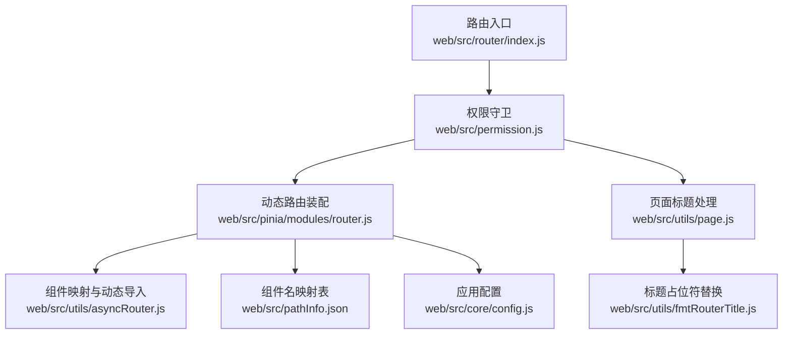
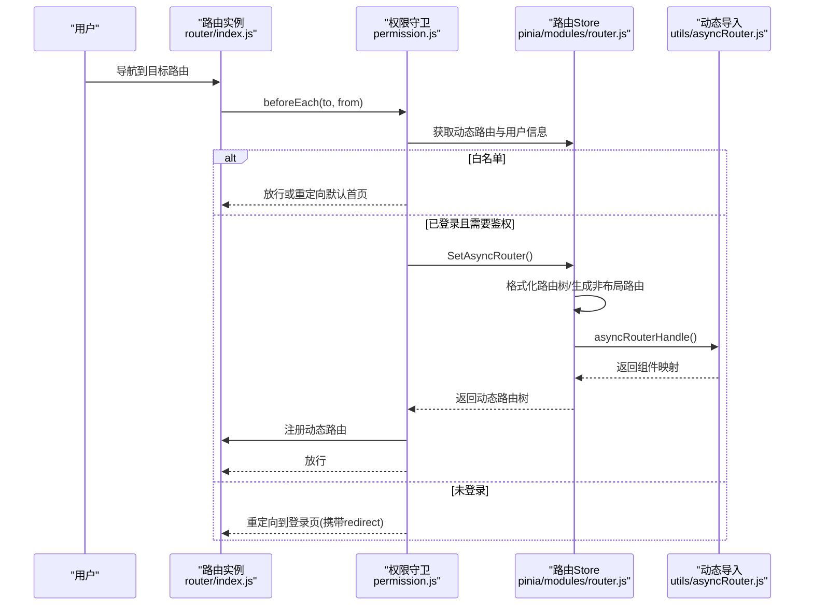
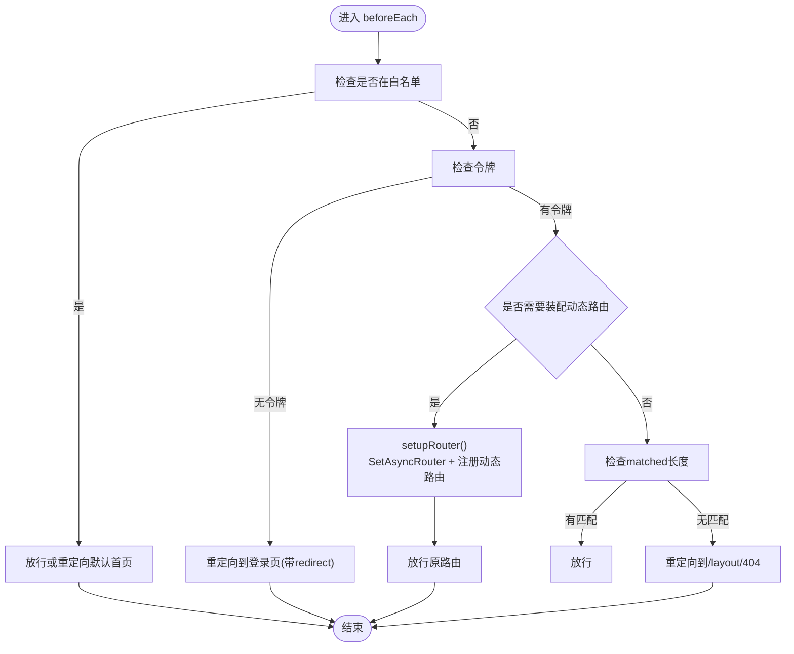
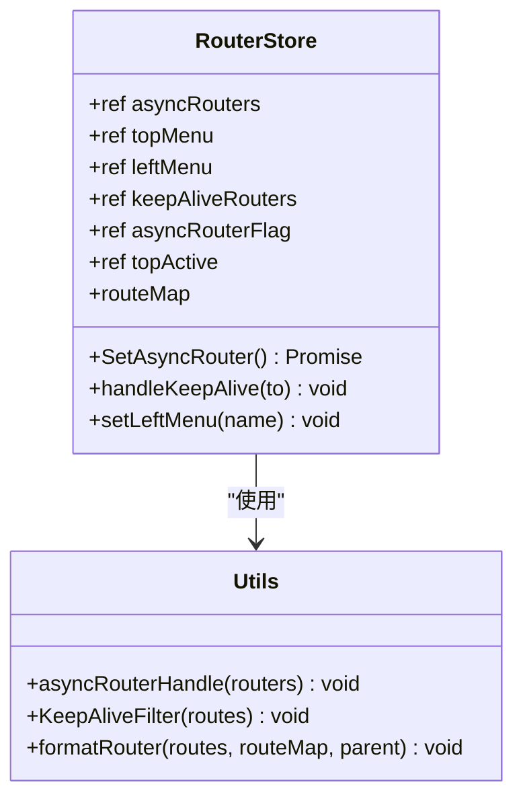
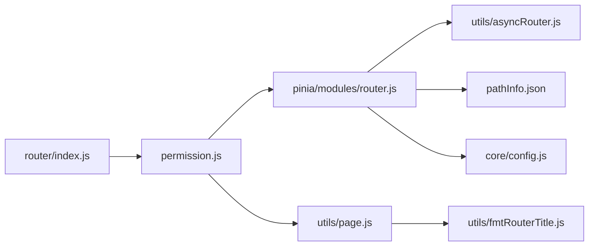

# 路由状态管理

<cite>
**本文引用的文件**
- [web/src/router/index.js](file://web/src/router/index.js)
- [web/src/permission.js](file://web/src/permission.js)
- [web/src/utils/asyncRouter.js](file://web/src/utils/asyncRouter.js)
- [web/src/utils/page.js](file://web/src/utils/page.js)
- [web/src/utils/fmtRouterTitle.js](file://web/src/utils/fmtRouterTitle.js)
- [web/src/pinia/modules/router.js](file://web/src/pinia/modules/router.js)
- [web/src/pathInfo.json](file://web/src/pathInfo.json)
- [web/src/core/config.js](file://web/src/core/config.js)
</cite>

## 目录
1. [引言](#引言)
2. [项目结构](#项目结构)
3. [核心组件](#核心组件)
4. [架构总览](#架构总览)
5. [详细组件分析](#详细组件分析)
6. [依赖分析](#依赖分析)
7. [性能考量](#性能考量)
8. [故障排查指南](#故障排查指南)
9. [结论](#结论)
10. [附录](#附录)

## 引言
本文件围绕前端路由状态管理展开，系统性阐述动态路由、面包屑导航、路由权限与页面标题的实现与集成。重点解析 router.js 中的静态路由定义、权限守卫与动态路由生成流程，以及路由状态与权限系统的协同机制（菜单到路由的转换、权限验证、路由守卫配合）。同时覆盖路由状态的持久化与恢复（如顶部菜单激活态、标签页缓存策略）、设计模式（状态结构、性能优化、SEO 考量）及配置示例与权限控制实现。

## 项目结构
前端路由状态管理涉及以下关键模块：
- 路由定义与历史模式：在路由入口集中声明基础静态路由与兜底路由，并采用哈希历史模式。
- 权限守卫与动态路由装配：在全局前置守卫中按用户权限拉取动态菜单，转换为路由树并安全注册。
- 路由状态与缓存：通过 Pinia Store 管理动态路由树、顶部/左侧菜单、KeepAlive 组件列表与路由匹配状态。
- 标题与国际化占位符：页面标题根据路由元信息与当前路由参数动态拼装。
- 组件映射与动态导入：将后端返回的组件路径映射到实际组件模块，支持视图与插件目录。

**图表来源**
- [web/src/router/index.js:1-42](file://web/src/router/index.js#L1-L42)
- [web/src/permission.js:1-225](file://web/src/permission.js#L1-L225)
- [web/src/pinia/modules/router.js:1-208](file://web/src/pinia/modules/router.js#L1-L208)
- [web/src/utils/asyncRouter.js:1-30](file://web/src/utils/asyncRouter.js#L1-L30)
- [web/src/utils/page.js:1-10](file://web/src/utils/page.js#L1-L10)
- [web/src/utils/fmtRouterTitle.js:1-14](file://web/src/utils/fmtRouterTitle.js#L1-L14)
- [web/src/pathInfo.json:1-86](file://web/src/pathInfo.json#L1-L86)
- [web/src/core/config.js:1-56](file://web/src/core/config.js#L1-L56)

**章节来源**
- [web/src/router/index.js:1-42](file://web/src/router/index.js#L1-L42)
- [web/src/permission.js:1-225](file://web/src/permission.js#L1-L225)
- [web/src/pinia/modules/router.js:1-208](file://web/src/pinia/modules/router.js#L1-L208)
- [web/src/utils/asyncRouter.js:1-30](file://web/src/utils/asyncRouter.js#L1-L30)
- [web/src/utils/page.js:1-10](file://web/src/utils/page.js#L1-L10)
- [web/src/utils/fmtRouterTitle.js:1-14](file://web/src/utils/fmtRouterTitle.js#L1-L14)
- [web/src/pathInfo.json:1-86](file://web/src/pathInfo.json#L1-L86)
- [web/src/core/config.js:1-56](file://web/src/core/config.js#L1-L56)

## 核心组件
- 静态路由与兜底路由：集中定义登录、初始化、扫码上传等基础路由，以及通配兜底错误页。
- 权限守卫：在进入路由前进行白名单判断、令牌校验、动态路由装配、默认首页跳转与权限匹配。
- 动态路由 Store：负责拉取菜单、格式化路由树、生成非布局路由、计算 KeepAlive 列表、维护菜单与激活态。
- 组件映射与动态导入：将后端返回的组件路径转换为 Vite 模块导入函数，支持视图与插件目录。
- 页面标题：根据路由元信息与当前路由参数动态拼装标题，支持占位符替换。
- 配置中心：提供应用名称、是否启用标签页 KeepAlive 等全局配置项。

**章节来源**
- [web/src/router/index.js:1-42](file://web/src/router/index.js#L1-L42)
- [web/src/permission.js:155-209](file://web/src/permission.js#L155-L209)
- [web/src/pinia/modules/router.js:51-207](file://web/src/pinia/modules/router.js#L51-L207)
- [web/src/utils/asyncRouter.js:4-29](file://web/src/utils/asyncRouter.js#L4-L29)
- [web/src/utils/page.js:1-10](file://web/src/utils/page.js#L1-L10)
- [web/src/core/config.js:8-13](file://web/src/core/config.js#L8-L13)

## 架构总览
路由状态管理采用“静态路由 + 动态路由”的双轨模式。静态路由提供基础页面与兜底；动态路由由后端菜单生成，经格式化与动态导入后安全注册至路由树。权限守卫贯穿生命周期，确保未登录用户被引导至登录页，已登录用户仅可访问授权路由。Pinia Store 统一管理动态路由树、菜单与 KeepAlive 列表，并在路由切换时更新页面标题与缓存策略。

**图表来源**
- [web/src/router/index.js:36-39](file://web/src/router/index.js#L36-L39)
- [web/src/permission.js:155-209](file://web/src/permission.js#L155-L209)
- [web/src/pinia/modules/router.js:158-193](file://web/src/pinia/modules/router.js#L158-L193)
- [web/src/utils/asyncRouter.js:4-18](file://web/src/utils/asyncRouter.js#L4-L18)

## 详细组件分析

### 路由入口与静态路由
- 集中声明基础路由与通配兜底路由，采用哈希历史模式，便于部署与开发调试。
- 通过 redirect 实现根路径跳转，保证首次访问即进入登录页或初始化页。

**章节来源**
- [web/src/router/index.js:3-39](file://web/src/router/index.js#L3-L39)

### 权限守卫与动态路由装配
- 白名单：对登录与初始化路由放行，若已登录且存在默认首页，直接重定向。
- 登录态校验：无令牌则重定向至登录页并携带 redirect 参数。
- 动态路由装配：并发拉取动态路由与用户信息，确保父级 layout 先注册，再将 layout.children 与其余顶层路由扁平化为二级子路由挂载至 layout。
- 路由去重：仅当路由名不存在时注册顶级路由，避免重复注册。
- 匹配与缓存：记录 matched 以供后续 KeepAlive 处理，设置页面标题。
- 错误处理：捕获异常并输出错误日志，结束进度条。

**图表来源**
- [web/src/permission.js:155-209](file://web/src/permission.js#L155-L209)
- [web/src/permission.js:117-146](file://web/src/permission.js#L117-L146)

**章节来源**
- [web/src/permission.js:15-37](file://web/src/permission.js#L15-L37)
- [web/src/permission.js:117-146](file://web/src/permission.js#L117-L146)
- [web/src/permission.js:155-209](file://web/src/permission.js#L155-L209)

### 动态路由 Store（Pinia）
- 路由树格式化：遍历菜单树，补充父子关系、按钮权限、隐藏字段，识别 defaultMenu 的顶级路由并收集至非布局路由数组。
- KeepAlive 过滤：自底向上标记父级路由，结合 pathInfo 与配置项生成组件名列表，支持标签页强制 KeepAlive。
- 路由装配：构造 baseRouter（含 layout），合并后端菜单，追加 reload 错误页，格式化并动态导入，最终写入 asyncRouters。
- 菜单与激活态：基于首个路由的 children 初始化顶部菜单与 menuMap，watchEffect 监听路由变化，计算顶部激活项并填充左侧菜单。
- KeepAlive 处理：在路由切换时对 matched 链路进行预加载与去 layout 化，确保缓存生效。

**图表来源**
- [web/src/pinia/modules/router.js:51-207](file://web/src/pinia/modules/router.js#L51-L207)
- [web/src/utils/asyncRouter.js:4-18](file://web/src/utils/asyncRouter.js#L4-L18)

**章节来源**
- [web/src/pinia/modules/router.js:14-31](file://web/src/pinia/modules/router.js#L14-L31)
- [web/src/pinia/modules/router.js:33-49](file://web/src/pinia/modules/router.js#L33-L49)
- [web/src/pinia/modules/router.js:158-193](file://web/src/pinia/modules/router.js#L158-L193)
- [web/src/pinia/modules/router.js:195-207](file://web/src/pinia/modules/router.js#L195-L207)

### 组件映射与动态导入
- 使用 Vite 的 import.meta.glob 扫描视图与插件目录，建立模块索引。
- 将后端返回的组件字符串路径映射到对应模块，支持相对路径匹配与动态导入。
- 递归处理子路由，确保整棵路由树的组件均可按需加载。

**章节来源**
- [web/src/utils/asyncRouter.js:1-29](file://web/src/utils/asyncRouter.js#L1-L29)

### 页面标题与占位符替换
- 页面标题由配置中的应用名与路由元信息 title 拼接而成。
- 支持在 title 中使用占位符，运行时从当前路由的 params 或 query 中取值替换。

**章节来源**
- [web/src/utils/page.js:1-10](file://web/src/utils/page.js#L1-L10)
- [web/src/utils/fmtRouterTitle.js:1-14](file://web/src/utils/fmtRouterTitle.js#L1-L14)

### 路由状态与权限集成
- 菜单到路由的转换：后端菜单树经 formatRouter 与 asyncRouterHandle 转换为路由树，defaultMenu 节点可作为顶级路由。
- 权限验证：白名单、令牌、动态路由装配与 matched 校验共同构成权限防线。
- 路由守卫配合：beforeEach 在进入前完成上述步骤，afterEach 清理滚动位置与进度条，onError 输出错误日志。

**章节来源**
- [web/src/pinia/modules/router.js:14-31](file://web/src/pinia/modules/router.js#L14-L31)
- [web/src/permission.js:155-209](file://web/src/permission.js#L155-L209)

### 路由状态的持久化与恢复
- 顶部菜单激活态：通过 sessionStorage 存储 topActive，在 watchEffect 中读取并初始化顶部/左侧菜单。
- 标签页 KeepAlive：根据配置与历史记录动态扩展 KeepAlive 列表，确保标签页切换时组件缓存有效。
- 页面刷新后的状态保持：顶部激活态与菜单数据在初始化阶段恢复，动态路由树在首次登录后缓存于 Store。

**章节来源**
- [web/src/pinia/modules/router.js:141-154](file://web/src/pinia/modules/router.js#L141-L154)
- [web/src/pinia/modules/router.js:54-78](file://web/src/pinia/modules/router.js#L54-L78)

### 设计模式与最佳实践
- 状态结构设计：将动态路由树、菜单、激活态与 KeepAlive 列表集中管理，降低耦合度。
- 动态导入模式：通过 pathInfo 与 import.meta.glob 实现组件路径到模块的解耦映射。
- 权限守卫模式：白名单优先、令牌校验前置、动态路由装配次之、权限匹配收尾。
- 性能优化：按需加载、KeepAlive 预热、matched 缓存、避免重复注册。
- SEO 考虑：页面标题动态拼装，支持多语言占位符；通配兜底路由避免 404。

**章节来源**
- [web/src/pinia/modules/router.js:158-193](file://web/src/pinia/modules/router.js#L158-L193)
- [web/src/utils/page.js:1-10](file://web/src/utils/page.js#L1-L10)
- [web/src/router/index.js:28-33](file://web/src/router/index.js#L28-L33)

## 依赖分析
- 路由入口依赖权限守卫与页面标题工具。
- 权限守卫依赖用户 Store、路由 Store、NProgress 与页面标题工具。
- 路由 Store 依赖动态导入工具、事件总线、后端菜单接口与 pathInfo 映射。
- 页面标题依赖标题占位符工具与应用配置。

**图表来源**
- [web/src/router/index.js:1-42](file://web/src/router/index.js#L1-L42)
- [web/src/permission.js:1-225](file://web/src/permission.js#L1-L225)
- [web/src/pinia/modules/router.js:1-208](file://web/src/pinia/modules/router.js#L1-L208)
- [web/src/utils/asyncRouter.js:1-30](file://web/src/utils/asyncRouter.js#L1-L30)
- [web/src/utils/page.js:1-10](file://web/src/utils/page.js#L1-L10)
- [web/src/utils/fmtRouterTitle.js:1-14](file://web/src/utils/fmtRouterTitle.js#L1-L14)
- [web/src/pathInfo.json:1-86](file://web/src/pathInfo.json#L1-L86)
- [web/src/core/config.js:1-56](file://web/src/core/config.js#L1-L56)

**章节来源**
- [web/src/router/index.js:1-42](file://web/src/router/index.js#L1-L42)
- [web/src/permission.js:1-225](file://web/src/permission.js#L1-L225)
- [web/src/pinia/modules/router.js:1-208](file://web/src/pinia/modules/router.js#L1-L208)
- [web/src/utils/asyncRouter.js:1-30](file://web/src/utils/asyncRouter.js#L1-L30)
- [web/src/utils/page.js:1-10](file://web/src/utils/page.js#L1-L10)
- [web/src/utils/fmtRouterTitle.js:1-14](file://web/src/utils/fmtRouterTitle.js#L1-L14)
- [web/src/pathInfo.json:1-86](file://web/src/pathInfo.json#L1-L86)
- [web/src/core/config.js:1-56](file://web/src/core/config.js#L1-L56)

## 性能考量
- 按需加载：动态导入仅在路由命中时加载组件，减少首屏体积。
- KeepAlive 预热：在路由切换前对 matched 链路进行预加载，避免首次渲染抖动。
- 去 layout 化：在处理 KeepAlive 时移除 layout 占位，避免缓存无效。
- 并发装配：在守卫中并发拉取用户信息与动态路由，缩短首屏等待时间。
- 避免重复注册：仅在路由名不存在时注册顶级路由，减少重复开销。

[本节为通用性能建议，无需特定文件引用]

## 故障排查指南
- 登录后仍被重定向到登录页
  - 检查令牌是否存在与有效；确认白名单路由是否正确；查看守卫中的 redirect 参数。
  - 参考：[web/src/permission.js:155-209](file://web/src/permission.js#L155-L209)
- 动态路由未生效或报错
  - 确认后端菜单接口返回结构与 pathInfo 映射一致；检查 asyncRouterHandle 是否正确映射组件路径。
  - 参考：[web/src/pinia/modules/router.js:158-193](file://web/src/pinia/modules/router.js#L158-L193)、[web/src/utils/asyncRouter.js:4-29](file://web/src/utils/asyncRouter.js#L4-L29)
- 页面标题未显示或为空
  - 检查路由 meta.title 是否设置；确认占位符键是否存在于 params/query。
  - 参考：[web/src/utils/page.js:1-10](file://web/src/utils/page.js#L1-L10)、[web/src/utils/fmtRouterTitle.js:1-14](file://web/src/utils/fmtRouterTitle.js#L1-L14)
- KeepAlive 不生效
  - 确认路由 meta.keepAlive 是否设置；检查父级是否也被纳入 KeepAlive 列表；确认组件名与 pathInfo 对应。
  - 参考：[web/src/pinia/modules/router.js:33-49](file://web/src/pinia/modules/router.js#L33-L49)、[web/src/pinia/modules/router.js:54-78](file://web/src/pinia/modules/router.js#L54-L78)
- 路由切换后滚动位置异常
  - 确认 afterEach 中滚动重置逻辑是否执行；检查容器类名是否正确。
  - 参考：[web/src/permission.js:211-215](file://web/src/permission.js#L211-L215)

**章节来源**
- [web/src/permission.js:155-209](file://web/src/permission.js#L155-L209)
- [web/src/pinia/modules/router.js:33-49](file://web/src/pinia/modules/router.js#L33-L49)
- [web/src/pinia/modules/router.js:54-78](file://web/src/pinia/modules/router.js#L54-L78)
- [web/src/utils/page.js:1-10](file://web/src/utils/page.js#L1-L10)
- [web/src/utils/fmtRouterTitle.js:1-14](file://web/src/utils/fmtRouterTitle.js#L1-L14)

## 结论
本项目通过“静态路由 + 动态路由”与“权限守卫 + Pinia Store”的组合，实现了灵活、可扩展且高性能的路由状态管理体系。动态路由与菜单的解耦映射、KeepAlive 的智能缓存策略、以及标题与权限的无缝衔接，共同构成了稳定可靠的前端路由骨架。建议在生产环境中进一步完善错误边界与监控埋点，持续优化首屏加载与缓存命中率。

[本节为总结性内容，无需特定文件引用]

## 附录
- 配置项参考
  - 应用名称与 KeepAlive 标签页开关：[web/src/core/config.js:8-13](file://web/src/core/config.js#L8-L13)
- 组件映射参考
  - 路由组件名映射表：[web/src/pathInfo.json:1-86](file://web/src/pathInfo.json#L1-L86)
- 关键流程参考
  - 动态路由装配与注册：[web/src/permission.js:117-146](file://web/src/permission.js#L117-L146)
  - 页面标题拼装与占位符替换：[web/src/utils/page.js:1-10](file://web/src/utils/page.js#L1-L10)、[web/src/utils/fmtRouterTitle.js:1-14](file://web/src/utils/fmtRouterTitle.js#L1-L14)

**章节来源**
- [web/src/core/config.js:8-13](file://web/src/core/config.js#L8-L13)
- [web/src/pathInfo.json:1-86](file://web/src/pathInfo.json#L1-L86)
- [web/src/permission.js:117-146](file://web/src/permission.js#L117-L146)
- [web/src/utils/page.js:1-10](file://web/src/utils/page.js#L1-L10)
- [web/src/utils/fmtRouterTitle.js:1-14](file://web/src/utils/fmtRouterTitle.js#L1-L14)