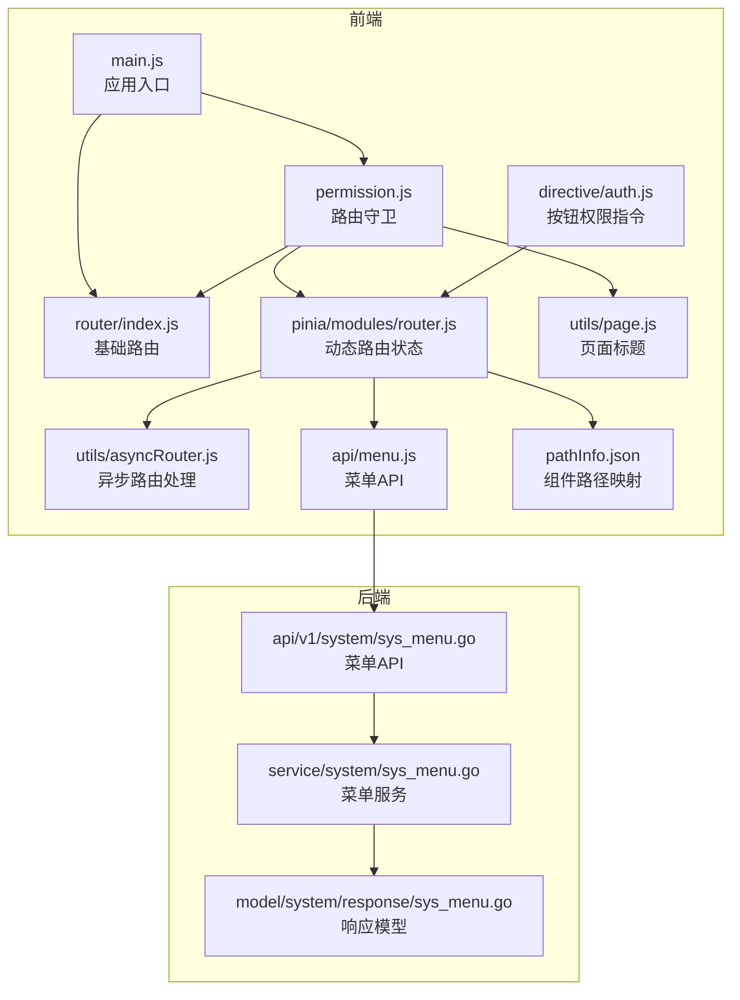
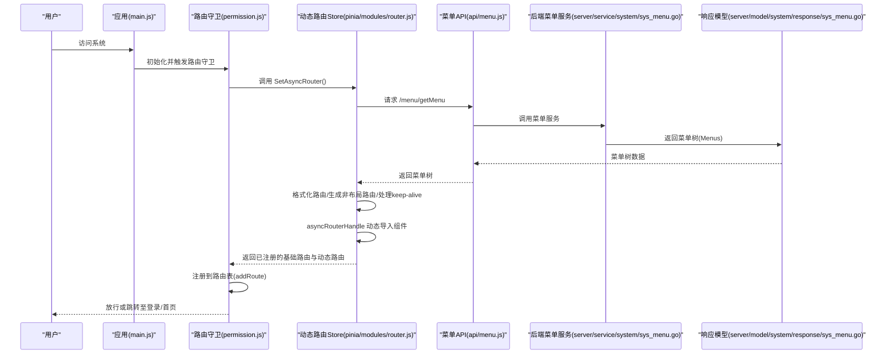
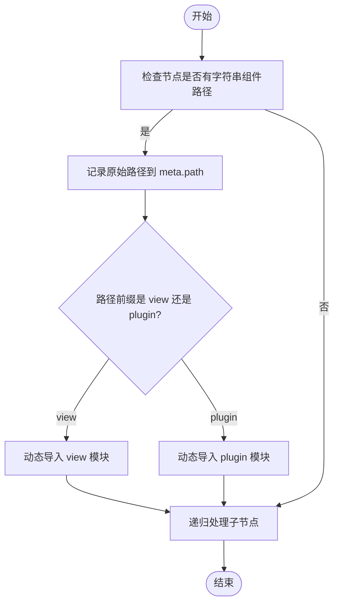
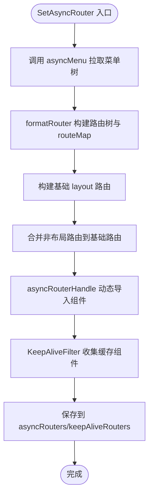
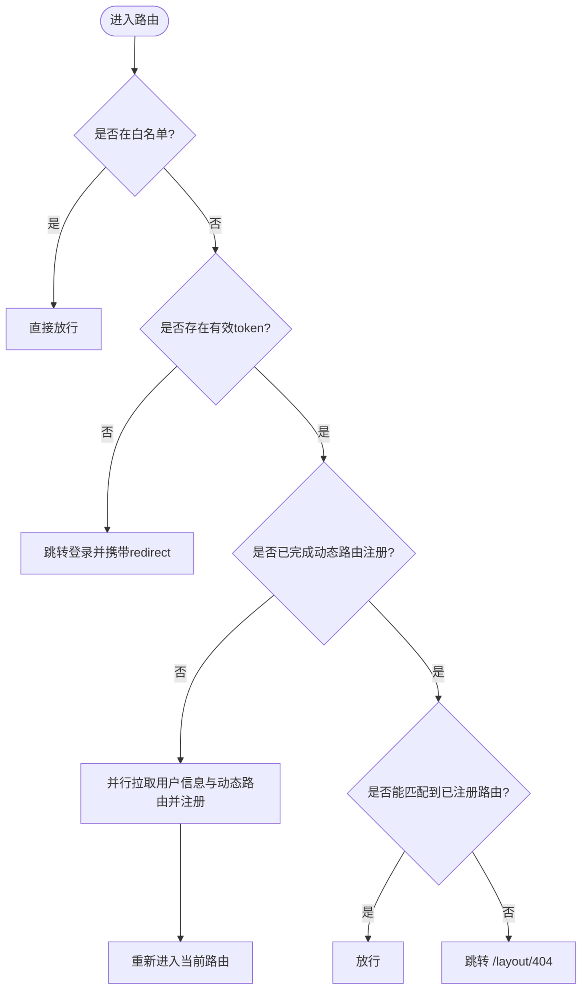
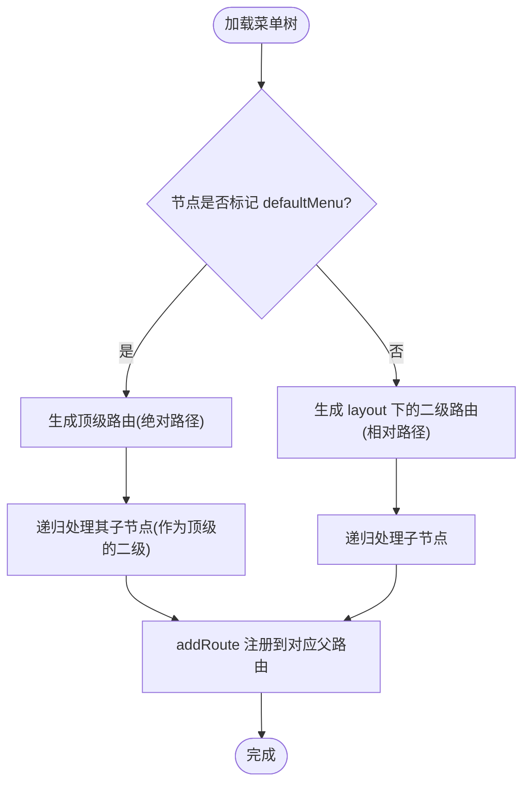
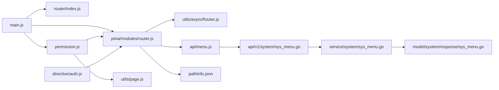

# 动态路由管理

<cite>
**本文引用的文件**
- [web/src/router/index.js](file://web/src/router/index.js)
- [web/src/utils/asyncRouter.js](file://web/src/utils/asyncRouter.js)
- [web/src/pinia/modules/router.js](file://web/src/pinia/modules/router.js)
- [web/src/permission.js](file://web/src/permission.js)
- [web/src/api/menu.js](file://web/src/api/menu.js)
- [web/src/pathInfo.json](file://web/src/pathInfo.json)
- [web/src/directive/auth.js](file://web/src/directive/auth.js)
- [web/src/utils/page.js](file://web/src/utils/page.js)
- [web/src/utils/btnAuth.js](file://web/src/utils/btnAuth.js)
- [server/api/v1/system/sys_menu.go](file://server/api/v1/system/sys_menu.go)
- [server/service/system/sys_menu.go](file://server/service/system/sys_menu.go)
- [server/model/system/response/sys_menu.go](file://server/model/system/response/sys_menu.go)
- [repowiki/zh/content/前端应用/路由系统/动态路由管理.md](file://repowiki/zh/content/前端应用/路由系统/动态路由管理.md)
- [repowiki/zh/content/前端应用/路由系统/路由守卫系统.md](file://repowiki/zh/content/前端应用/路由系统/路由守卫系统.md)
- [repowiki/zh/content/前端应用/路由系统/权限控制机制.md](file://repowiki/zh/content/前端应用/路由系统/权限控制机制.md)
</cite>

## 目录
1. [简介](#简介)
2. [项目结构](#项目结构)
3. [核心组件](#核心组件)
4. [架构总览](#架构总览)
5. [详细组件分析](#详细组件分析)
6. [依赖分析](#依赖分析)
7. [性能考虑](#性能考虑)
8. [故障排查指南](#故障排查指南)
9. [结论](#结论)
10. [附录](#附录)

## 简介
本文件面向“测试管理平台”的动态路由管理，系统性阐述以下主题：
- 动态路由的实现原理：基于用户权限从后端拉取菜单树，前端组装为可导航的路由表。
- 异步路由加载机制（asyncRouter）：如何解析后端返回的路由定义、按需动态导入视图组件。
- 菜单与路由的绑定关系：菜单驱动的路由生成方式，以及默认路由（defaultMenu）的特殊处理。
- 路由权限验证与页面访问控制：路由守卫如何结合令牌、白名单、动态路由注册与匹配结果进行访问控制。
- 动态路由配置示例与最佳实践：前后端协作的关键字段与注意事项。
- 路由缓存与性能优化策略：keep-alive 组件缓存、组件预加载与路径映射。

## 项目结构
动态路由涉及前后端协同：
- 前端负责：动态路由拉取、路由注册、菜单渲染、权限指令、页面标题与进度条控制、keep-alive 缓存策略。
- 后端负责：根据用户角色返回菜单树（含按钮权限、排序、父子关系等），并提供基础菜单树接口。

**图表来源**
- [repowiki/zh/content/前端应用/路由系统/动态路由管理.md:45-75](file://repowiki/zh/content/前端应用/路由系统/动态路由管理.md#L45-L75)
- [repowiki/zh/content/前端应用/路由系统/路由守卫系统.md:46-58](file://repowiki/zh/content/前端应用/路由系统/路由守卫系统.md#L46-L58)

**章节来源**
- [repowiki/zh/content/前端应用/路由系统/动态路由管理.md:40-104](file://repowiki/zh/content/前端应用/路由系统/动态路由管理.md#L40-L104)
- [repowiki/zh/content/前端应用/路由系统/路由守卫系统.md:35-72](file://repowiki/zh/content/前端应用/路由系统/路由守卫系统.md#L35-L72)

## 核心组件
- 异步路由处理器（asyncRouter）：将后端返回的字符串组件路径转换为实际的动态导入函数，支持 view 与 plugin 两类目录。
- 动态路由状态（Pinia Store）：负责拉取菜单树、格式化路由、生成顶层非布局路由、处理 keep-alive 缓存、维护菜单映射与左右侧菜单状态。
- 路由守卫（permission.js）：在进入路由前执行权限校验、注册动态路由、设置页面标题、处理白名单与默认首页跳转。
- 菜单 API（api/menu.js）：封装调用后端菜单接口，获取用户动态路由树。
- 组件路径映射（pathInfo.json）：将组件物理路径映射为组件名，供 keep-alive 缓存策略使用。
- 页面标题与进度条（utils/page.js、permission.js）：统一设置页面标题与进度条行为。
- 按钮权限指令（directive/auth.js）：基于用户权限控制按钮可见性。

**章节来源**
- [repowiki/zh/content/前端应用/路由系统/动态路由管理.md:105-122](file://repowiki/zh/content/前端应用/路由系统/动态路由管理.md#L105-L122)
- [repowiki/zh/content/前端应用/路由系统/路由守卫系统.md:77-91](file://repowiki/zh/content/前端应用/路由系统/路由守卫系统.md#L77-L91)

## 架构总览
动态路由的端到端流程如下：

**图表来源**
- [repowiki/zh/content/前端应用/路由系统/动态路由管理.md:126-148](file://repowiki/zh/content/前端应用/路由系统/动态路由管理.md#L126-L148)
- [repowiki/zh/content/前端应用/路由系统/路由守卫系统.md:95-127](file://repowiki/zh/content/前端应用/路由系统/路由守卫系统.md#L95-L127)

## 详细组件分析

### 异步路由加载机制（asyncRouter）
- 输入：后端返回的菜单树，每个节点包含组件字符串路径（如 view/xxx.vue 或 plugin/xxx.vue）。
- 处理流程：
  - 遍历菜单树，若节点的 component 为字符串且以 view 或 plugin 开头，则将其替换为动态导入函数。
  - 使用 import.meta.glob 预扫描对应目录，通过路径匹配定位具体组件模块并返回动态导入函数。
  - 递归处理子节点，确保整棵菜单树都被转换为可运行的路由定义。
- 关键点：
  - 动态导入函数在路由切换时才加载，减少首屏体积。
  - 通过 pathInfo.json 提供的组件名，配合 keep-alive 策略实现组件缓存。

**图表来源**
- [web/src/utils/asyncRouter.js:4-29](file://web/src/utils/asyncRouter.js#L4-L29)

**章节来源**
- [web/src/utils/asyncRouter.js:1-30](file://web/src/utils/asyncRouter.js#L1-L30)
- [repowiki/zh/content/前端应用/路由系统/动态路由管理.md:160-187](file://repowiki/zh/content/前端应用/路由系统/动态路由管理.md#L160-L187)

### 动态路由状态管理（Pinia Store）
- 主要职责：
  - 拉取菜单树并格式化为路由结构，生成基础 layout 与非布局路由集合。
  - 通过 asyncRouterHandle 完成组件动态导入。
  - 维护菜单映射（menuMap）、顶部/左侧菜单状态、顶部激活项。
  - 计算 keep-alive 组件列表：遍历菜单树，将带有 keepAlive 的节点及其祖先节点映射为组件名，写入 keepAliveRouters。
  - 提供 handleKeepAlive 方法，在路由切换时预加载需要缓存的组件，保证切换体验。
- 关键数据结构：
  - routeMap：按 name 建立路由节点索引，便于根据历史记录查找组件名。
  - keepAliveRoutersArr/nameMap：用于收集需要缓存的组件名。
  - notLayoutRouterArr：defaultMenu 标记的顶级路由集合（不包裹在 layout 下）。

**图表来源**
- [web/src/pinia/modules/router.js:158-193](file://web/src/pinia/modules/router.js#L158-L193)
- [web/src/pinia/modules/router.js:33-49](file://web/src/pinia/modules/router.js#L33-L49)

**章节来源**
- [web/src/pinia/modules/router.js:1-208](file://web/src/pinia/modules/router.js#L1-L208)
- [repowiki/zh/content/前端应用/路由系统/动态路由管理.md:189-219](file://repowiki/zh/content/前端应用/路由系统/动态路由管理.md#L189-L219)

### 路由权限验证与页面访问控制
- 白名单：Login、Init 在未登录时允许访问。
- 登录态判断：若存在有效 token 则放行；否则跳转登录页并携带 redirect 参数。
- 动态路由注册时机：
  - 首次进入受保护路由时，若尚未注册动态路由，则并行拉取用户信息与动态路由，完成后一次性注册到路由表。
  - 注册时区分 defaultMenu 顶级路由与常规 layout 二级路由，避免重复注册。
- 匹配与回退：若目标路由未匹配到任何已注册路由，跳转到 /layout/404。
- 页面标题与进度条：每次进入路由前设置标题，使用 NProgress 展示加载状态。

**图表来源**
- [web/src/permission.js:156-209](file://web/src/permission.js#L156-L209)
- [web/src/permission.js:117-146](file://web/src/permission.js#L117-L146)

**章节来源**
- [web/src/permission.js:1-225](file://web/src/permission.js#L1-L225)
- [repowiki/zh/content/前端应用/路由系统/路由守卫系统.md:138-182](file://repowiki/zh/content/前端应用/路由系统/路由守卫系统.md#L138-L182)

### 菜单驱动的路由生成与绑定
- 菜单到路由的映射：
  - 后端返回菜单树（含 name、path、component、meta、children 等），前端将其转换为路由定义。
  - defaultMenu 为 true 的节点作为顶级路由（不包裹在 layout 下），其子节点作为该顶级的二级页面。
  - 常规节点挂载到 layout 下，形成二级页面。
- 路由注册策略：
  - 先注册 layout 父路由，再将所有动态路由（含 defaultMenu 顶级路由）作为子路由批量注册。
  - 对于 defaultMenu 顶级路由，使用绝对路径；对于 layout 下的子路由使用相对路径，避免重复前缀。
- 菜单与按钮权限：
  - 服务层同时返回菜单级按钮权限，前端在菜单树上挂载 btns 字段，供按钮权限指令使用。

**图表来源**
- [web/src/permission.js:42-114](file://web/src/permission.js#L42-L114)
- [server/service/system/sys_menu.go:78-99](file://server/service/system/sys_menu.go#L78-L99)

**章节来源**
- [web/src/permission.js:1-225](file://web/src/permission.js#L1-L225)
- [server/service/system/sys_menu.go:1-391](file://server/service/system/sys_menu.go#L1-L391)
- [repowiki/zh/content/前端应用/路由系统/动态路由管理.md:251-280](file://repowiki/zh/content/前端应用/路由系统/动态路由管理.md#L251-L280)

### 路由缓存与性能优化
- 组件缓存（keep-alive）：
  - 通过 KeepAliveFilter 遍历菜单树，收集带有 keepAlive 的节点及其祖先节点，映射为组件名写入 keepAliveRouters。
  - handleKeepAlive 在路由切换时预加载需要缓存的组件，避免切换闪烁。
- 路由懒加载：
  - asyncRouterHandle 将组件路径转换为动态导入函数，按需加载，降低首屏体积。
- 路径映射：
  - pathInfo.json 提供组件物理路径到组件名的映射，便于统一管理组件缓存清单。
- 性能建议：
  - 合理使用 keepAlive：仅对频繁切换且状态敏感的页面启用缓存。
  - 控制菜单层级深度，避免过深导致注册与匹配开销增大。
  - 使用按钮权限指令减少不必要的 DOM 渲染。

**章节来源**
- [web/src/pinia/modules/router.js:33-49](file://web/src/pinia/modules/router.js#L33-L49)
- [web/src/pinia/modules/router.js:80-100](file://web/src/pinia/modules/router.js#L80-L100)
- [web/src/utils/asyncRouter.js:1-30](file://web/src/utils/asyncRouter.js#L1-L30)
- [web/src/pathInfo.json:1-86](file://web/src/pathInfo.json#L1-L86)
- [repowiki/zh/content/前端应用/路由系统/动态路由管理.md:282-299](file://repowiki/zh/content/前端应用/路由系统/动态路由管理.md#L282-L299)

## 依赖分析
- 前端依赖关系：
  - main.js 依赖 router、permission、pinia/store、ElementPlus 等。
  - permission.js 依赖 userStore、router、NProgress、page 标题工具。
  - pinia/modules/router.js 依赖 asyncRouter、menu API、pathInfo、config。
  - api/menu.js 依赖 request 服务。
  - directive/auth.js 依赖 userStore。
- 后端依赖关系：
  - api/v1/system/sys_menu.go 依赖 menuService 与响应模型。
  - service/system/sys_menu.go 依赖数据库查询与权限树构建逻辑。
  - response/sys_menu.go 定义返回结构。

**图表来源**
- [repowiki/zh/content/前端应用/路由系统/动态路由管理.md:301-327](file://repowiki/zh/content/前端应用/路由系统/动态路由管理.md#L301-L327)
- [repowiki/zh/content/前端应用/路由系统/路由守卫系统.md:294-304](file://repowiki/zh/content/前端应用/路由系统/路由守卫系统.md#L294-L304)

**章节来源**
- [repowiki/zh/content/前端应用/路由系统/动态路由管理.md:301-347](file://repowiki/zh/content/前端应用/路由系统/动态路由管理.md#L301-L347)
- [repowiki/zh/content/前端应用/路由系统/路由守卫系统.md:299-327](file://repowiki/zh/content/前端应用/路由系统/路由守卫系统.md#L299-L327)

## 性能考虑
- 按需加载：动态导入仅在路由切换时触发，显著降低首屏资源消耗。
- keep-alive 策略：仅对必要页面启用缓存，避免过多组件常驻内存。
- 路由扁平化：将 layout.children 与其它顶级路由统一注册，减少路由树复杂度。
- 标题与进度条：统一设置页面标题与进度条，提升用户体验并减少重复计算。

**章节来源**
- [repowiki/zh/content/前端应用/路由系统/动态路由管理.md:348-353](file://repowiki/zh/content/前端应用/路由系统/动态路由管理.md#L348-L353)
- [repowiki/zh/content/前端应用/路由系统/路由守卫系统.md:321-327](file://repowiki/zh/content/前端应用/路由系统/路由守卫系统.md#L321-L327)

## 故障排查指南
- 动态路由未生效：
  - 检查是否在路由守卫中调用 setupRouter 并等待完成。
  - 确认 asyncRouterFlag 是否被正确更新。
  - 核对菜单树是否包含有效的 component 字段与正确的目录前缀。
- 组件未缓存：
  - 检查菜单节点是否设置了 keepAlive，并确认其祖先节点也被纳入缓存清单。
  - 确认 pathInfo.json 中是否存在对应的组件名映射。
- 页面标题异常：
  - 检查 meta.title 是否正确设置，以及 page.js 的标题拼接逻辑。
- 按钮不可见：
  - 检查按钮权限指令绑定值与用户 authorityId 是否一致，确认后端返回的按钮权限数据是否正确。

**章节来源**
- [repowiki/zh/content/前端应用/路由系统/动态路由管理.md:354-371](file://repowiki/zh/content/前端应用/路由系统/动态路由管理.md#L354-L371)
- [repowiki/zh/content/前端应用/路由系统/路由守卫系统.md:333-352](file://repowiki/zh/content/前端应用/路由系统/路由守卫系统.md#L333-L352)

## 结论
动态路由管理通过“菜单驱动”的方式，将后端权限树转化为前端可导航的路由表，并结合异步加载与缓存策略，实现了灵活、安全且高性能的页面访问控制。关键在于：
- 明确的菜单与路由映射规则（defaultMenu 顶级路由与 layout 二级路由）。
- 完备的路由守卫与动态注册流程。
- 基于组件名的 keep-alive 缓存与路径映射。
- 前后端协作的关键字段与接口规范。

## 附录
- 动态路由配置示例（字段说明）
  - name：路由唯一标识，用于父子挂载与匹配。
  - path：路由路径，defaultMenu 顶级使用绝对路径，layout 下使用相对路径。
  - component：组件路径字符串（以 view 或 plugin 开头），最终会被动态导入。
  - meta：包含 title、hidden、defaultMenu、keepAlive、client 等元信息。
  - children：子菜单树。
  - btns：按钮权限集合（由后端返回）。
- 最佳实践
  - 后端：菜单树按 sort 排序，defaultMenu 仅用于顶级路由；按钮权限与菜单权限解耦。
  - 前端：保持 asyncRouterHandle 的组件路径与目录结构一致；合理使用 keepAlive；在路由守卫中统一处理白名单与默认首页跳转。

**章节来源**
- [repowiki/zh/content/前端应用/路由系统/动态路由管理.md:380-390](file://repowiki/zh/content/前端应用/路由系统/动态路由管理.md#L380-L390)