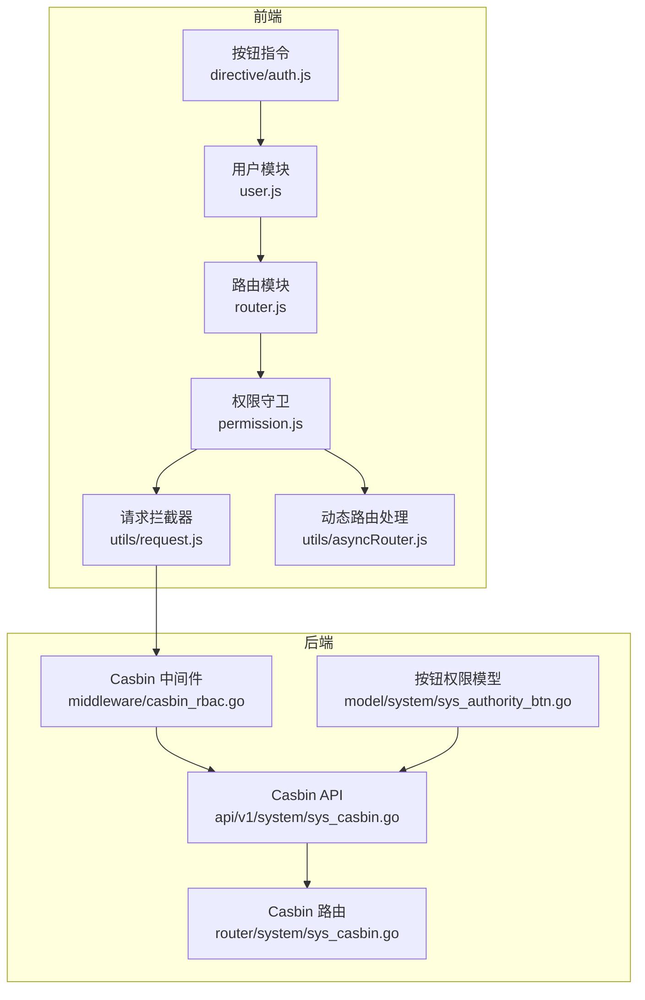
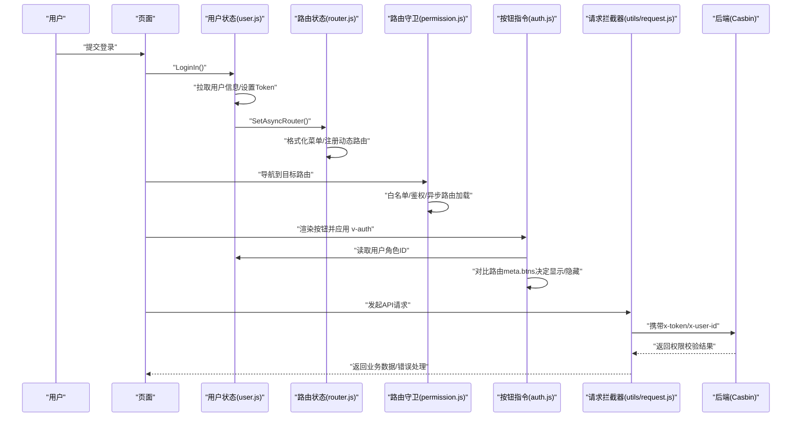
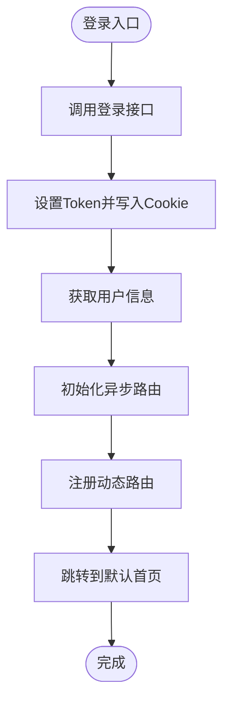
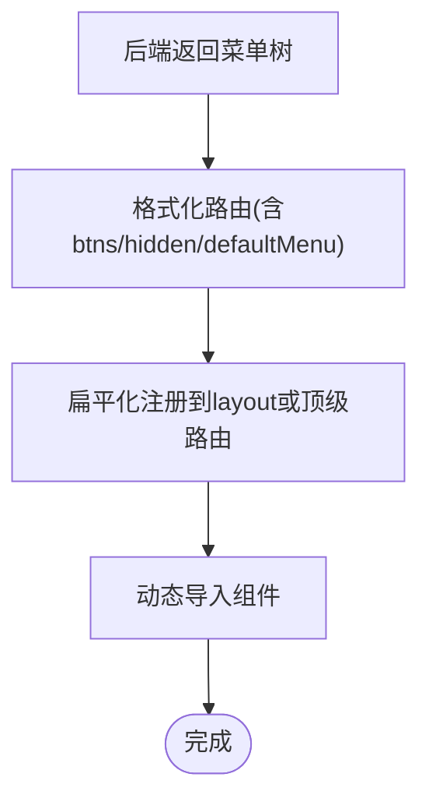
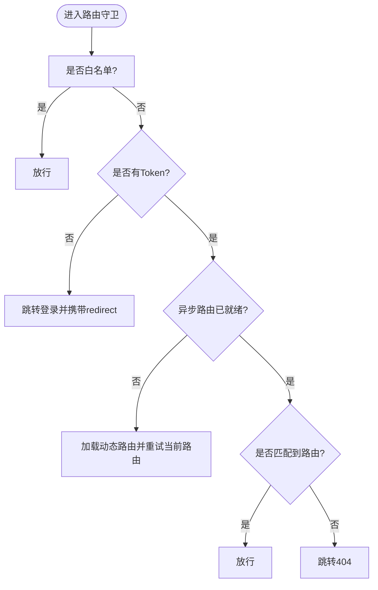
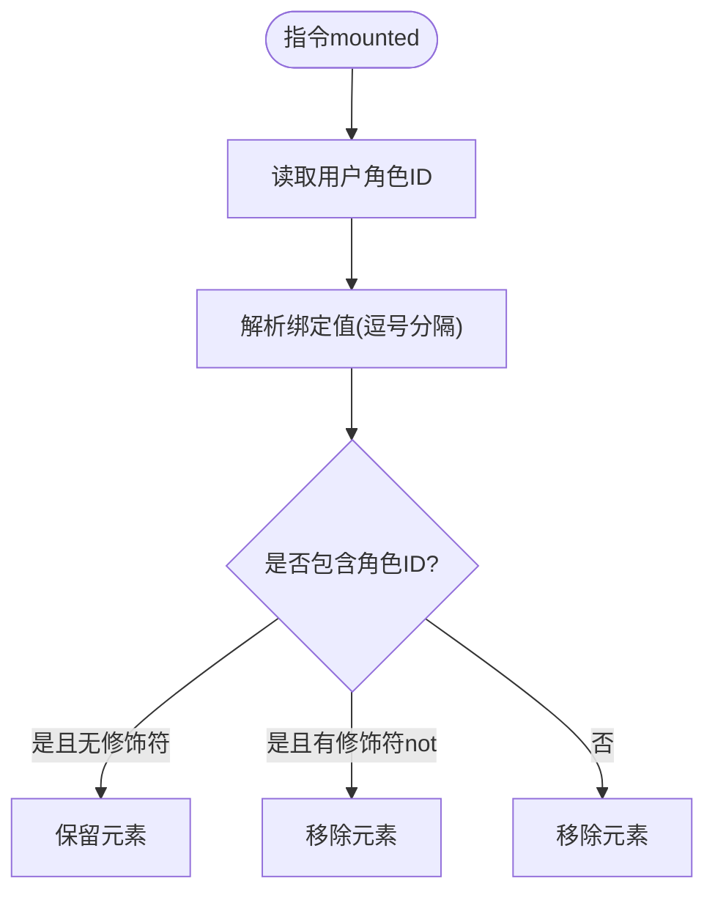
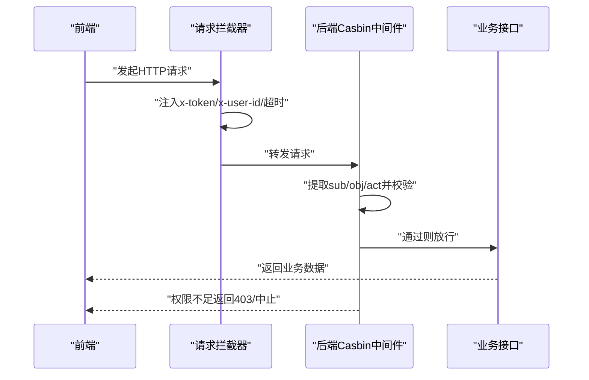
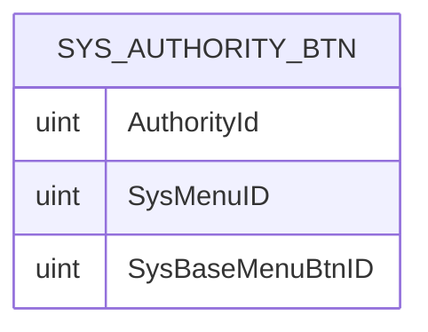
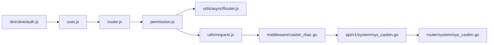

# 权限控制机制

<cite>
**本文引用的文件**
- [web/src/directive/auth.js](file://web/src/directive/auth.js)
- [web/src/utils/btnAuth.js](file://web/src/utils/btnAuth.js)
- [web/src/permission.js](file://web/src/permission.js)
- [web/src/router/index.js](file://web/src/router/index.js)
- [web/src/pinia/modules/user.js](file://web/src/pinia/modules/user.js)
- [web/src/pinia/modules/router.js](file://web/src/pinia/modules/router.js)
- [web/src/utils/asyncRouter.js](file://web/src/utils/asyncRouter.js)
- [web/src/api/authority.js](file://web/src/api/authority.js)
- [web/src/api/authorityBtn.js](file://web/src/api/authorityBtn.js)
- [web/src/utils/request.js](file://web/src/utils/request.js)
- [server/middleware/casbin_rbac.go](file://server/middleware/casbin_rbac.go)
- [server/api/v1/system/sys_casbin.go](file://server/api/v1/system/sys_casbin.go)
- [server/router/system/sys_casbin.go](file://server/router/system/sys_casbin.go)
- [server/model/system/sys_authority_btn.go](file://server/model/system/sys_authority_btn.go)
</cite>

## 目录
1. [引言](#引言)
2. [项目结构](#项目结构)
3. [核心组件](#核心组件)
4. [架构总览](#架构总览)
5. [详细组件分析](#详细组件分析)
6. [依赖分析](#依赖分析)
7. [性能考虑](#性能考虑)
8. [故障排查指南](#故障排查指南)
9. [结论](#结论)
10. [附录](#附录)

## 引言
本文件系统性梳理 Gin-Vue-Admin 前后端权限控制机制，重点覆盖以下方面：
- 基于角色的访问控制（RBAC）在前端的实现：用户权限获取、权限状态管理、权限验证流程
- 路由级权限控制：路由元信息中的权限标识、路由守卫中的权限判断、权限不足时的处理策略
- 按钮级权限：指令系统、DOM 元素动态显示隐藏、权限指令封装与复用
- 接口级权限：API 请求权限验证、权限拦截器、权限变更的实时响应
- 安全考虑：权限缓存安全性、权限验证可靠性、权限泄露防护
- 调试方法、性能优化与最佳实践

## 项目结构
权限控制涉及前后端协同：
- 前端：Pinia 状态管理、路由与守卫、指令系统、API 请求拦截器
- 后端：Casbin RBAC 中间件、权限模型与接口

图表来源
- [web/src/pinia/modules/user.js:1-151](file://web/src/pinia/modules/user.js#L1-L151)
- [web/src/pinia/modules/router.js:1-208](file://web/src/pinia/modules/router.js#L1-L208)
- [web/src/permission.js:1-225](file://web/src/permission.js#L1-L225)
- [web/src/utils/asyncRouter.js:1-30](file://web/src/utils/asyncRouter.js#L1-L30)
- [web/src/directive/auth.js:1-26](file://web/src/directive/auth.js#L1-L26)
- [web/src/utils/request.js:1-232](file://web/src/utils/request.js#L1-L232)
- [server/middleware/casbin_rbac.go:1-33](file://server/middleware/casbin_rbac.go#L1-L33)
- [server/api/v1/system/sys_casbin.go:1-70](file://server/api/v1/system/sys_casbin.go#L1-L70)
- [server/router/system/sys_casbin.go:1-20](file://server/router/system/sys_casbin.go#L1-L20)
- [server/model/system/sys_authority_btn.go:1-9](file://server/model/system/sys_authority_btn.go#L1-L9)

章节来源
- [web/src/router/index.js:1-42](file://web/src/router/index.js#L1-L42)
- [web/src/permission.js:155-209](file://web/src/permission.js#L155-L209)
- [web/src/pinia/modules/user.js:54-111](file://web/src/pinia/modules/user.js#L54-L111)
- [web/src/pinia/modules/router.js:157-193](file://web/src/pinia/modules/router.js#L157-L193)
- [web/src/utils/asyncRouter.js:4-29](file://web/src/utils/asyncRouter.js#L4-L29)
- [web/src/directive/auth.js:6-24](file://web/src/directive/auth.js#L6-L24)
- [web/src/utils/request.js:119-223](file://web/src/utils/request.js#L119-L223)
- [server/middleware/casbin_rbac.go:12-32](file://server/middleware/casbin_rbac.go#L12-L32)
- [server/api/v1/system/sys_casbin.go:15-70](file://server/api/v1/system/sys_casbin.go#L15-L70)
- [server/router/system/sys_casbin.go:10-19](file://server/router/system/sys_casbin.go#L10-L19)
- [server/model/system/sys_authority_btn.go:3-8](file://server/model/system/sys_authority_btn.go#L3-L8)

## 核心组件
- 用户状态与权限获取：用户登录成功后拉取用户信息与权限，设置 Token 并初始化异步路由
- 动态路由与菜单：从后端获取菜单树，格式化为前端可渲染的路由结构，按需注册
- 路由守卫：白名单放行、鉴权拦截、异步路由首次加载、默认首页跳转、404 回退
- 指令级按钮权限：基于用户角色 ID 与路由 meta.btns 的按钮集合，动态隐藏无权限按钮
- 请求拦截器：自动注入 Token 与用户 ID，处理 401 与通用错误提示
- 后端 RBAC：Casbin 中间件根据角色、路径、方法进行权限校验

章节来源
- [web/src/pinia/modules/user.js:54-111](file://web/src/pinia/modules/user.js#L54-L111)
- [web/src/pinia/modules/router.js:157-193](file://web/src/pinia/modules/router.js#L157-L193)
- [web/src/permission.js:155-209](file://web/src/permission.js#L155-L209)
- [web/src/utils/btnAuth.js:1-7](file://web/src/utils/btnAuth.js#L1-L7)
- [web/src/directive/auth.js:6-24](file://web/src/directive/auth.js#L6-L24)
- [web/src/utils/request.js:119-223](file://web/src/utils/request.js#L119-L223)
- [server/middleware/casbin_rbac.go:12-32](file://server/middleware/casbin_rbac.go#L12-L32)

## 架构总览
前端权限流程序列图（登录、动态路由、守卫、指令、请求拦截器）

图表来源
- [web/src/pinia/modules/user.js:63-111](file://web/src/pinia/modules/user.js#L63-L111)
- [web/src/pinia/modules/router.js:157-193](file://web/src/pinia/modules/router.js#L157-L193)
- [web/src/permission.js:155-209](file://web/src/permission.js#L155-L209)
- [web/src/directive/auth.js:6-24](file://web/src/directive/auth.js#L6-L24)
- [web/src/utils/request.js:119-223](file://web/src/utils/request.js#L119-L223)
- [server/middleware/casbin_rbac.go:12-32](file://server/middleware/casbin_rbac.go#L12-L32)

## 详细组件分析

### 用户权限获取与状态管理
- 登录流程：登录成功后设置用户信息与 Token；初始化异步路由；根据用户默认首页跳转
- 用户信息：包含角色对象与默认首页等关键字段
- Token 管理：优先使用内存状态，其次 Cookie，确保请求头注入

图表来源
- [web/src/pinia/modules/user.js:63-111](file://web/src/pinia/modules/user.js#L63-L111)

章节来源
- [web/src/pinia/modules/user.js:17-41](file://web/src/pinia/modules/user.js#L17-L41)
- [web/src/pinia/modules/user.js:54-111](file://web/src/pinia/modules/user.js#L54-L111)

### 动态路由与菜单管理
- 后端返回菜单树，前端格式化为带 meta.btns、hidden 等属性的路由结构
- 顶级路由与 layout 结构的扁平化注册，支持 defaultMenu 顶级路由
- 组件懒加载映射：根据字符串组件路径动态导入

图表来源
- [web/src/pinia/modules/router.js:14-31](file://web/src/pinia/modules/router.js#L14-L31)
- [web/src/pinia/modules/router.js:157-193](file://web/src/pinia/modules/router.js#L157-L193)
- [web/src/utils/asyncRouter.js:4-29](file://web/src/utils/asyncRouter.js#L4-L29)
- [web/src/permission.js:42-114](file://web/src/permission.js#L42-L114)

章节来源
- [web/src/pinia/modules/router.js:14-31](file://web/src/pinia/modules/router.js#L14-L31)
- [web/src/pinia/modules/router.js:157-193](file://web/src/pinia/modules/router.js#L157-L193)
- [web/src/utils/asyncRouter.js:4-29](file://web/src/utils/asyncRouter.js#L4-L29)
- [web/src/permission.js:42-114](file://web/src/permission.js#L42-L114)

### 路由级权限控制
- 白名单：登录与初始化页面无需鉴权
- 鉴权：若无 Token 或异步路由未就绪，阻塞并加载动态路由
- 默认首页：根据用户角色的 defaultRouter 进行跳转
- 404 回退：未匹配路由跳转到 404 页面

图表来源
- [web/src/permission.js:155-209](file://web/src/permission.js#L155-L209)
- [web/src/router/index.js:15-16](file://web/src/router/index.js#L15-L16)

章节来源
- [web/src/permission.js:155-209](file://web/src/permission.js#L155-L209)
- [web/src/router/index.js:15-16](file://web/src/router/index.js#L15-L16)

### 按钮级权限实现
- 指令系统：v-auth 在挂载时读取用户角色 ID 与绑定值，结合修饰符 not 实现反向判断
- DOM 控制：无权限时移除对应 DOM 节点，避免渲染无意义元素
- 路由级按钮集合：路由 meta.btns 提供当前页面可用按钮集合，指令与之联动

图表来源
- [web/src/directive/auth.js:6-24](file://web/src/directive/auth.js#L6-L24)
- [web/src/utils/btnAuth.js:1-7](file://web/src/utils/btnAuth.js#L1-L7)

章节来源
- [web/src/directive/auth.js:6-24](file://web/src/directive/auth.js#L6-L24)
- [web/src/utils/btnAuth.js:1-7](file://web/src/utils/btnAuth.js#L1-L7)

### 接口级权限控制
- 请求拦截：统一注入 x-token 与 x-user-id，超时与加载态统一处理
- 响应拦截：处理新 Token、业务码与错误提示；401 统一登出并跳转登录
- 后端中间件：Casbin 根据 sub(角色ID)、obj(路径)、act(方法) 进行权限判定

图表来源
- [web/src/utils/request.js:119-223](file://web/src/utils/request.js#L119-L223)
- [server/middleware/casbin_rbac.go:12-32](file://server/middleware/casbin_rbac.go#L12-L32)

章节来源
- [web/src/utils/request.js:119-223](file://web/src/utils/request.js#L119-L223)
- [server/middleware/casbin_rbac.go:12-32](file://server/middleware/casbin_rbac.go#L12-L32)

### 按钮权限模型与接口
- 模型：角色-菜单-按钮 关联表，记录按钮级权限
- 接口：提供查询与设置按钮权限的能力，配合前端指令使用

图表来源
- [server/model/system/sys_authority_btn.go:3-8](file://server/model/system/sys_authority_btn.go#L3-L8)

章节来源
- [server/model/system/sys_authority_btn.go:3-8](file://server/model/system/sys_authority_btn.go#L3-L8)
- [web/src/api/authorityBtn.js:1-26](file://web/src/api/authorityBtn.js#L1-L26)

## 依赖分析
- 前端模块耦合
  - user.js 与 router.js 协作：登录后初始化路由，路由状态驱动菜单与 keep-alive
  - permission.js 依赖 user.js/router.js/路由实例，负责全局守卫
  - directive/auth.js 依赖 user.js 与路由 meta.btns
  - utils/request.js 依赖 user.js，贯穿所有 API 请求
- 后端模块耦合
  - middleware/casbin_rbac.go 依赖工具获取用户声明与 Casbin 实例
  - api/v1/system/sys_casbin.go 与 router/system/sys_casbin.go 提供权限更新与查询接口

图表来源
- [web/src/pinia/modules/user.js:1-151](file://web/src/pinia/modules/user.js#L1-L151)
- [web/src/pinia/modules/router.js:1-208](file://web/src/pinia/modules/router.js#L1-L208)
- [web/src/permission.js:1-225](file://web/src/permission.js#L1-L225)
- [web/src/utils/asyncRouter.js:1-30](file://web/src/utils/asyncRouter.js#L1-L30)
- [web/src/directive/auth.js:1-26](file://web/src/directive/auth.js#L1-L26)
- [web/src/utils/request.js:1-232](file://web/src/utils/request.js#L1-L232)
- [server/middleware/casbin_rbac.go:1-33](file://server/middleware/casbin_rbac.go#L1-L33)
- [server/api/v1/system/sys_casbin.go:1-70](file://server/api/v1/system/sys_casbin.go#L1-L70)
- [server/router/system/sys_casbin.go:1-20](file://server/router/system/sys_casbin.go#L1-L20)

章节来源
- [web/src/pinia/modules/user.js:1-151](file://web/src/pinia/modules/user.js#L1-L151)
- [web/src/pinia/modules/router.js:1-208](file://web/src/pinia/modules/router.js#L1-L208)
- [web/src/permission.js:1-225](file://web/src/permission.js#L1-L225)
- [web/src/utils/asyncRouter.js:1-30](file://web/src/utils/asyncRouter.js#L1-L30)
- [web/src/directive/auth.js:1-26](file://web/src/directive/auth.js#L1-L26)
- [web/src/utils/request.js:1-232](file://web/src/utils/request.js#L1-L232)
- [server/middleware/casbin_rbac.go:1-33](file://server/middleware/casbin_rbac.go#L1-L33)
- [server/api/v1/system/sys_casbin.go:1-70](file://server/api/v1/system/sys_casbin.go#L1-L70)
- [server/router/system/sys_casbin.go:1-20](file://server/router/system/sys_casbin.go#L1-L20)

## 性能考虑
- 路由懒加载与 keep-alive：动态导入组件与按需 keep-alive，减少首屏体积与切换开销
- 请求拦截器节流：统一 loading 与超时控制，避免并发过多导致 UI 卡顿
- 路由守卫短路：白名单快速放行、异步路由只加载一次、命中即放行
- 指令最小化 DOM 操作：仅在 mounted 阶段移除无权限节点，避免频繁更新

## 故障排查指南
- 登录后无法进入首页
  - 检查用户角色 defaultRouter 是否配置
  - 确认异步路由是否成功注册
- 路由跳转 404
  - 检查动态路由扁平化与 layout 挂载是否正确
- 按钮不显示
  - 检查 meta.btns 与 v-auth 绑定值是否一致
  - 确认用户角色 ID 是否匹配
- 接口 401
  - 检查 x-token 是否注入
  - 确认后端 Casbin 策略是否包含该角色/路径/方法
- 权限变更未生效
  - 确认前端重新拉取用户信息与动态路由
  - 后端 Casbin 策略是否已更新

章节来源
- [web/src/pinia/modules/user.js:94-98](file://web/src/pinia/modules/user.js#L94-L98)
- [web/src/permission.js:199-200](file://web/src/permission.js#L199-L200)
- [web/src/directive/auth.js:10-21](file://web/src/directive/auth.js#L10-L21)
- [web/src/utils/request.js:204-215](file://web/src/utils/request.js#L204-L215)
- [server/middleware/casbin_rbac.go:24-29](file://server/middleware/casbin_rbac.go#L24-L29)

## 结论
本项目采用“前端动态路由 + 指令级按钮权限 + 请求拦截器 + 后端 Casbin RBAC”的组合方案，实现了从路由到按钮再到接口的全链路权限控制。前端通过 Pinia 管理用户与路由状态，配合路由守卫与指令系统保障界面层权限；后端通过 Casbin 中间件保证接口层权限。整体架构清晰、职责分离明确，具备良好的扩展性与可维护性。

## 附录
- 最佳实践
  - 严格区分路由级与按钮级权限，避免在路由上冗余按钮逻辑
  - 统一使用 v-auth 指令处理按钮显示，保持一致性
  - 对关键接口使用后端 Casbin 校验，前端仅做体验优化
  - 权限变更后及时刷新用户信息与动态路由，确保前端状态同步
- 安全建议
  - Token 与 Cookie 同步管理，避免跨域风险
  - 401 统一登出并清理本地状态，防止状态污染
  - 后端策略最小化暴露，定期审计权限矩阵