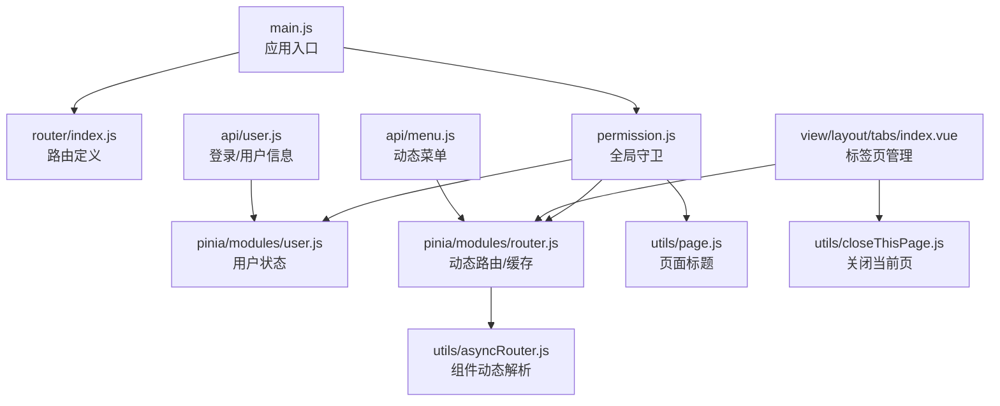
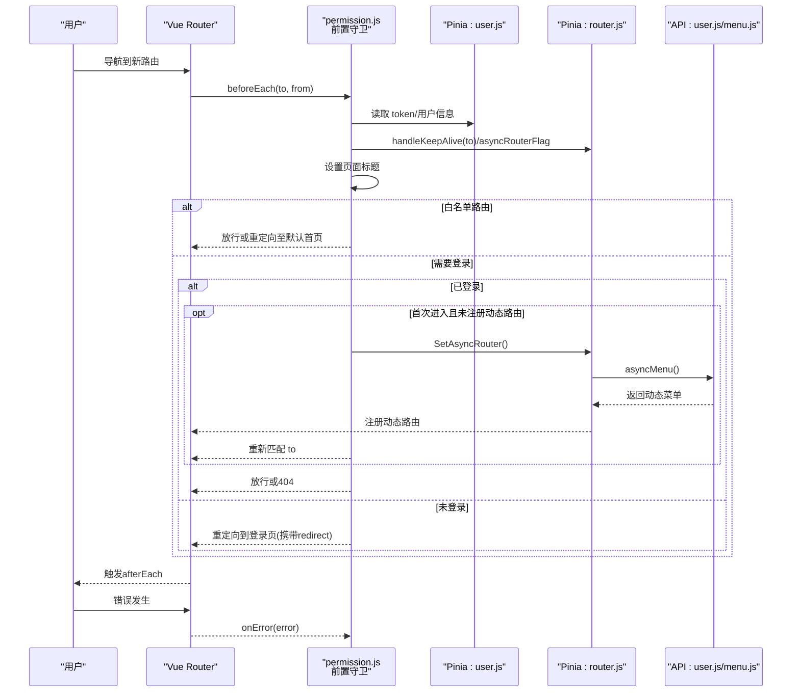
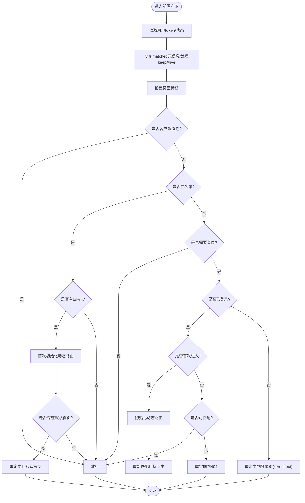
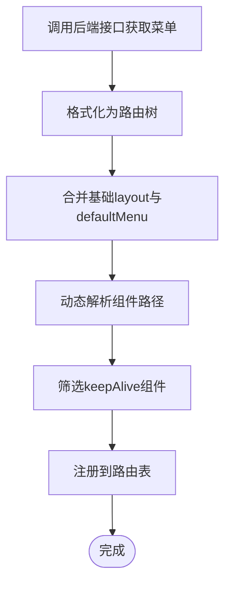
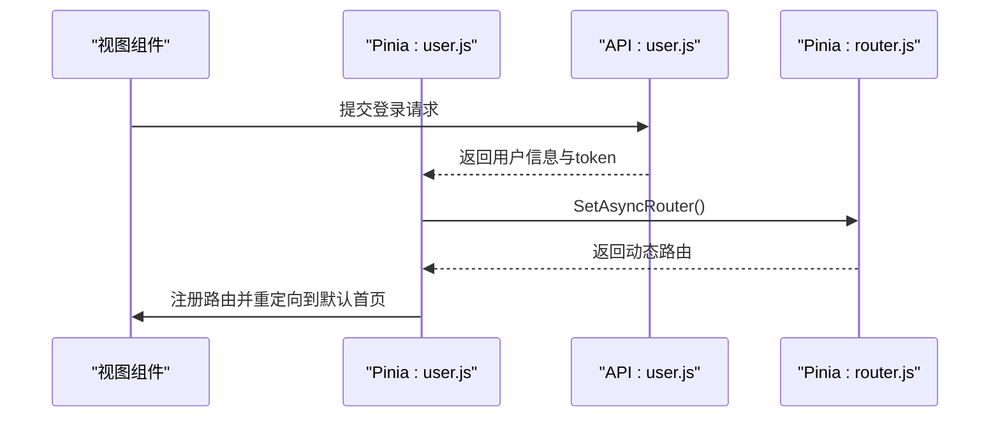
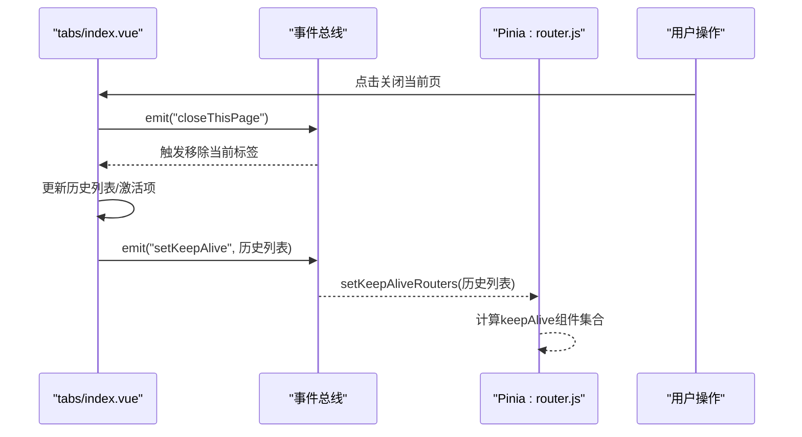
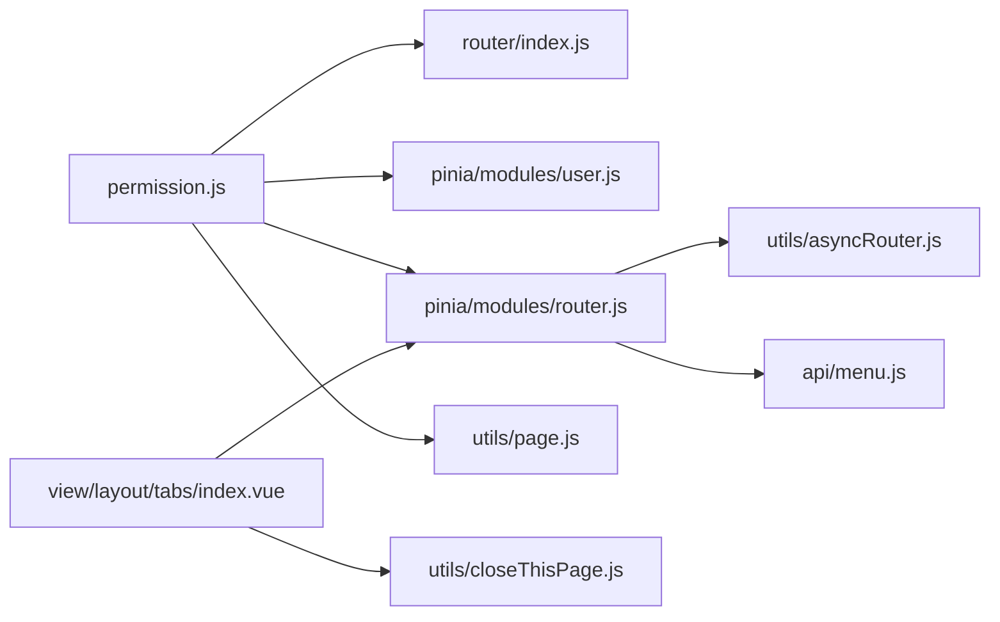

# 路由守卫系统

<cite>
**本文引用的文件**
- [permission.js](file://web/src/permission.js)
- [router/index.js](file://web/src/router/index.js)
- [asyncRouter.js](file://web/src/utils/asyncRouter.js)
- [router.js（Pinia）](file://web/src/pinia/modules/router.js)
- [user.js（Pinia）](file://web/src/pinia/modules/user.js)
- [page.js](file://web/src/utils/page.js)
- [fmtRouterTitle.js](file://web/src/utils/fmtRouterTitle.js)
- [closeThisPage.js](file://web/src/utils/closeThisPage.js)
- [main.js](file://web/src/main.js)
- [tabs/index.vue](file://web/src/view/layout/tabs/index.vue)
- [gin-vue-admin.js](file://web/src/core/gin-vue-admin.js)
- [user.js（API）](file://web/src/api/user.js)
- [menu.js（API）](file://web/src/api/menu.js)
</cite>

## 目录
1. [简介](#简介)
2. [项目结构](#项目结构)
3. [核心组件](#核心组件)
4. [架构总览](#架构总览)
5. [详细组件分析](#详细组件分析)
6. [依赖分析](#依赖分析)
7. [性能考虑](#性能考虑)
8. [故障排查指南](#故障排查指南)
9. [结论](#结论)
10. [附录](#附录)

## 简介
本文件系统性阐述测试管理平台前端的路由守卫体系，包括全局前置守卫与后置守卫的实现、路由切换过程中的权限验证与用户状态检查、页面关闭与标签页管理机制、路由元信息在守卫中的使用与页面标题动态设置、路由跳转控制与异常处理策略、以及性能优化与调试技巧。目标是帮助开发者快速理解并高效维护路由安全与用户体验。

## 项目结构
围绕路由守卫的关键文件组织如下：
- 权限与守卫入口：permission.js
- 路由定义：router/index.js
- 动态路由与组件解析：asyncRouter.js
- 状态管理（用户与路由）：pinia/modules/user.js、pinia/modules/router.js
- 页面标题与标题格式化：utils/page.js、utils/fmtRouterTitle.js
- 标签页与页面关闭：view/layout/tabs/index.vue、utils/closeThisPage.js
- 应用启动与守卫挂载：main.js、core/gin-vue-admin.js
- 接口层（登录、用户信息、动态菜单）：api/user.js、api/menu.js

**图表来源**
- [main.js:1-38](file://web/src/main.js#L1-L38)
- [router/index.js:1-42](file://web/src/router/index.js#L1-L42)
- [permission.js:1-225](file://web/src/permission.js#L1-L225)
- [router.js（Pinia）:1-208](file://web/src/pinia/modules/router.js#L1-L208)
- [user.js（Pinia）:1-151](file://web/src/pinia/modules/user.js#L1-L151)
- [asyncRouter.js:1-30](file://web/src/utils/asyncRouter.js#L1-L30)
- [page.js:1-10](file://web/src/utils/page.js#L1-L10)
- [tabs/index.vue:1-422](file://web/src/view/layout/tabs/index.vue#L1-L422)
- [closeThisPage.js:1-6](file://web/src/utils/closeThisPage.js#L1-L6)
- [user.js（API）:1-182](file://web/src/api/user.js#L1-L182)
- [menu.js（API）:1-142](file://web/src/api/menu.js#L1-L142)

**章节来源**
- [main.js:1-38](file://web/src/main.js#L1-L38)
- [router/index.js:1-42](file://web/src/router/index.js#L1-L42)

## 核心组件
- 全局前置守卫：负责拦截路由切换，执行权限校验、白名单放行、动态路由注册、页面标题设置、进度条控制等。
- 全局后置守卫：负责滚动复位与进度条收尾。
- 动态路由与组件解析：将服务端下发的路由树转换为可渲染的路由，并按需动态导入组件。
- 用户状态与令牌：基于 Pinia 的用户 Store 维护 token、用户信息与默认首页，驱动登录后的路由初始化。
- 标签页管理：记录历史访问、支持右键批量关闭、中间点击关闭、查询参数同步等。
- 页面标题：结合路由元信息与配置，动态生成页面标题。

**章节来源**
- [permission.js:155-225](file://web/src/permission.js#L155-L225)
- [router.js（Pinia）:158-193](file://web/src/pinia/modules/router.js#L158-L193)
- [user.js（Pinia）:54-111](file://web/src/pinia/modules/user.js#L54-L111)
- [tabs/index.vue:237-359](file://web/src/view/layout/tabs/index.vue#L237-L359)
- [page.js:1-10](file://web/src/utils/page.js#L1-L10)

## 架构总览
路由守卫贯穿“请求进入 -> 权限校验 -> 动态路由 -> 组件渲染 -> 页面标题 -> 标签页更新 -> 进度条收尾”的完整链路。下图展示关键交互：

**图表来源**
- [permission.js:155-225](file://web/src/permission.js#L155-L225)
- [router.js（Pinia）:158-193](file://web/src/pinia/modules/router.js#L158-L193)
- [user.js（Pinia）:54-111](file://web/src/pinia/modules/user.js#L54-L111)
- [user.js（API）:168-173](file://web/src/api/user.js#L168-L173)
- [menu.js（API）:6-11](file://web/src/api/menu.js#L6-L11)

## 详细组件分析

### 全局前置守卫（permission.js）
- 白名单放行：对登录与初始化页面直接放行；若已登录且未完成动态路由初始化，会触发一次初始化。
- 权限校验：若路由需要登录但无有效 token，重定向到登录页并携带 redirect 参数。
- 动态路由：首次进入非白名单路由时，拉取动态菜单并注册到路由表，随后重新匹配目标路由。
- 页面标题：通过 getPageTitle 结合路由元信息与全局配置生成标题。
- 缓存与 keep-alive：调用 router.js 中的 handleKeepAlive 对命中 keepAlive 的路由进行预加载与过滤。
- 进度条：使用 NProgress 控制加载状态。

**图表来源**
- [permission.js:155-225](file://web/src/permission.js#L155-L225)
- [router.js（Pinia）:80-100](file://web/src/pinia/modules/router.js#L80-L100)
- [page.js:1-10](file://web/src/utils/page.js#L1-L10)

**章节来源**
- [permission.js:155-225](file://web/src/permission.js#L155-L225)

### 动态路由与组件解析（router.js（Pinia）、asyncRouter.js）
- 动态路由生成：从后端获取菜单树，格式化为带父子关系的路由结构，合并基础 layout，并将 defaultMenu 的路由提升为顶级路由。
- 组件动态解析：根据字符串路径按约定自动映射到对应视图或插件组件，确保按需加载。
- keep-alive 过滤：遍历菜单树，将需要缓存的组件名收集，结合标签页历史与父级继承规则，最终形成 keepAlive 列表。

**图表来源**
- [router.js（Pinia）:158-193](file://web/src/pinia/modules/router.js#L158-L193)
- [asyncRouter.js:4-29](file://web/src/utils/asyncRouter.js#L4-L29)

**章节来源**
- [router.js（Pinia）:14-50](file://web/src/pinia/modules/router.js#L14-L50)
- [router.js（Pinia）:158-193](file://web/src/pinia/modules/router.js#L158-L193)
- [asyncRouter.js:1-30](file://web/src/utils/asyncRouter.js#L1-L30)

### 用户状态与登录流程（user.js（Pinia）、user.js（API））
- 登录成功后写入 token 与用户信息，触发动态路由初始化并将路由注册到全局路由表。
- 根据用户默认首页进行重定向；若默认首页不存在则提示配置问题。
- 登出时清理存储并跳转登录页。

**图表来源**
- [user.js（Pinia）:63-111](file://web/src/pinia/modules/user.js#L63-L111)
- [user.js（API）:6-12](file://web/src/api/user.js#L6-L12)
- [router.js（Pinia）:158-193](file://web/src/pinia/modules/router.js#L158-L193)

**章节来源**
- [user.js（Pinia）:54-111](file://web/src/pinia/modules/user.js#L54-L111)
- [user.js（API）:168-173](file://web/src/api/user.js#L168-L173)

### 页面标题与元信息（page.js、fmtRouterTitle.js）
- 页面标题：优先使用路由元信息中的 title，结合全局配置生成最终标题；支持模板变量替换，从 params/query 中取值。
- 标题格式化：对含占位符的标题进行动态替换，保证多语言与上下文场景下的可读性。

**章节来源**
- [page.js:1-10](file://web/src/utils/page.js#L1-L10)
- [fmtRouterTitle.js:1-14](file://web/src/utils/fmtRouterTitle.js#L1-L14)

### 标签页管理与页面关闭（tabs/index.vue、closeThisPage.js）
- 标签页：记录历史访问、去重、持久化、右键菜单批量关闭、中间点击关闭、查询参数同步。
- 关闭当前页：通过事件总线触发关闭逻辑，联动路由跳转与历史列表更新。
- 与 keep-alive：标签页变更时向 router.js 发送 setKeepAlive 事件，动态调整缓存列表。

**图表来源**
- [tabs/index.vue:282-329](file://web/src/view/layout/tabs/index.vue#L282-L329)
- [router.js（Pinia）:51-78](file://web/src/pinia/modules/router.js#L51-L78)
- [closeThisPage.js:1-6](file://web/src/utils/closeThisPage.js#L1-L6)

**章节来源**
- [tabs/index.vue:237-359](file://web/src/view/layout/tabs/index.vue#L237-L359)
- [closeThisPage.js:1-6](file://web/src/utils/closeThisPage.js#L1-L6)
- [router.js（Pinia）:51-78](file://web/src/pinia/modules/router.js#L51-L78)

### 全局后置守卫与错误处理（permission.js）
- 后置守卫：滚动到顶部并结束进度条。
- 错误处理：捕获路由错误并输出日志，同时移除进度条，避免阻塞。

**章节来源**
- [permission.js:211-222](file://web/src/permission.js#L211-L222)

## 依赖分析
- permission.js 依赖：
  - 路由实例 router/index.js
  - 用户状态 user.js（Pinia）
  - 路由状态 router.js（Pinia）
  - 页面标题工具 page.js
  - NProgress 进度条
- 动态路由依赖：
  - 后端接口 menu.js（API）
  - 组件动态解析 asyncRouter.js
- 标签页依赖：
  - 事件总线 bus.js（通过 closeThisPage.js 间接使用）
  - router.js（Pinia）的 keepAlive 计算

**图表来源**
- [permission.js:1-225](file://web/src/permission.js#L1-L225)
- [router/index.js:1-42](file://web/src/router/index.js#L1-L42)
- [router.js（Pinia）:1-208](file://web/src/pinia/modules/router.js#L1-L208)
- [user.js（Pinia）:1-151](file://web/src/pinia/modules/user.js#L1-L151)
- [page.js:1-10](file://web/src/utils/page.js#L1-L10)
- [asyncRouter.js:1-30](file://web/src/utils/asyncRouter.js#L1-L30)
- [tabs/index.vue:1-422](file://web/src/view/layout/tabs/index.vue#L1-L422)
- [closeThisPage.js:1-6](file://web/src/utils/closeThisPage.js#L1-L6)
- [menu.js（API）:1-142](file://web/src/api/menu.js#L1-L142)

**章节来源**
- [permission.js:1-225](file://web/src/permission.js#L1-L225)
- [router.js（Pinia）:1-208](file://web/src/pinia/modules/router.js#L1-L208)

## 性能考虑
- 动态路由一次性拉取与注册：避免多次重复请求，通过 asyncRouterFlag 控制初始化次数。
- keep-alive 预加载：在导航过程中对命中 keepAlive 的组件进行预加载，减少首屏白屏时间。
- 路由扁平化与去重：addRouteByChildren 仅在路由名不存在时注册，避免重复注册导致的性能损耗。
- 进度条与滚动：合理使用 NProgress 与滚动复位，避免不必要的 DOM 操作。
- 组件按需加载：asyncRouterHandle 仅在字符串组件路径匹配时动态导入，降低首屏体积。

**章节来源**
- [permission.js:117-146](file://web/src/permission.js#L117-L146)
- [router.js（Pinia）:80-100](file://web/src/pinia/modules/router.js#L80-L100)
- [asyncRouter.js:4-29](file://web/src/utils/asyncRouter.js#L4-L29)

## 故障排查指南
- 登录后无法进入默认首页
  - 检查用户 authority.defaultRouter 是否存在；若不存在，登录流程会提示配置问题。
  - 确认动态路由已成功注册并包含默认首页路由。
- 404 页面频繁出现
  - 确认动态路由初始化是否完成；首次进入会触发初始化，完成后重新匹配目标路由。
  - 检查路由元信息中的 path 与组件路径是否正确。
- 标题未更新或显示异常
  - 检查路由 meta.title 是否设置；若包含模板变量，确认 params/query 中对应键值存在。
- 标签页无法关闭或历史不同步
  - 确认事件总线正常工作；检查 tabs 组件中 setKeepAlive 事件的订阅与派发。
  - 检查 sessionStorage 中 historys 与 activeValue 的持久化状态。
- 路由错误
  - 查看控制台错误日志；onError 会输出错误并移除进度条，避免阻塞。

**章节来源**
- [permission.js:186-209](file://web/src/permission.js#L186-L209)
- [permission.js:218-222](file://web/src/permission.js#L218-L222)
- [tabs/index.vue:252-279](file://web/src/view/layout/tabs/index.vue#L252-L279)
- [user.js（Pinia）:94-98](file://web/src/pinia/modules/user.js#L94-L98)

## 结论
该路由守卫系统通过“前置守卫 + 动态路由 + 标签页 + 标题管理 + 错误处理”的组合，实现了安全、可扩展、体验友好的前端路由控制。建议在后续迭代中持续关注动态路由的缓存策略、标签页的性能与内存占用、以及跨页参数一致性保障。

## 附录

### 路由元信息与页面标题设置
- 元信息字段
  - title：页面标题文本或模板字符串
  - keepAlive：是否启用组件缓存
  - defaultMenu：是否作为顶级路由（不包裹在 layout 下）
  - client：客户端直连，无需后端校验
  - closeTab：路由关闭时是否关闭标签页
- 标题模板
  - 支持 ${paramKey} 与 ${queryKey} 占位符，自动从当前路由的 params 或 query 中取值。

**章节来源**
- [router/index.js:19-34](file://web/src/router/index.js#L19-L34)
- [fmtRouterTitle.js:1-14](file://web/src/utils/fmtRouterTitle.js#L1-L14)
- [page.js:1-10](file://web/src/utils/page.js#L1-L10)

### 路由跳转控制与异常处理
- 白名单：Login、Init
- 未登录跳转：重定向到登录页并携带 redirect
- 首次进入：初始化动态路由并重新匹配
- 匹配失败：重定向到 404
- 错误处理：onError 输出错误并移除进度条

**章节来源**
- [permission.js:15-20](file://web/src/permission.js#L15-L20)
- [permission.js:172-209](file://web/src/permission.js#L172-L209)
- [permission.js:218-222](file://web/src/permission.js#L218-L222)

### 调试技巧
- 在 permission.js 中打断点，观察 to/from、token、asyncRouterFlag 的变化。
- 在 tabs/index.vue 中监听 setKeepAlive 事件，确认 keepAlive 列表计算正确。
- 使用浏览器开发者工具 Network 面板检查动态菜单与登录接口响应。
- 在 main.js 中确认守卫已在应用启动时被挂载。

**章节来源**
- [main.js:13](file://web/src/main.js#L13)
- [tabs/index.vue:274](file://web/src/view/layout/tabs/index.vue#L274)
- [gin-vue-admin.js:1-30](file://web/src/core/gin-vue-admin.js#L1-L30)