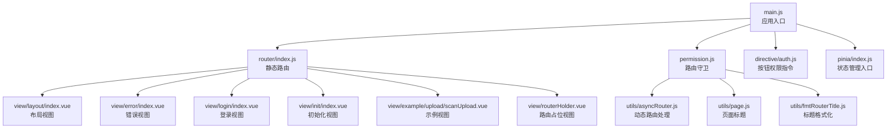
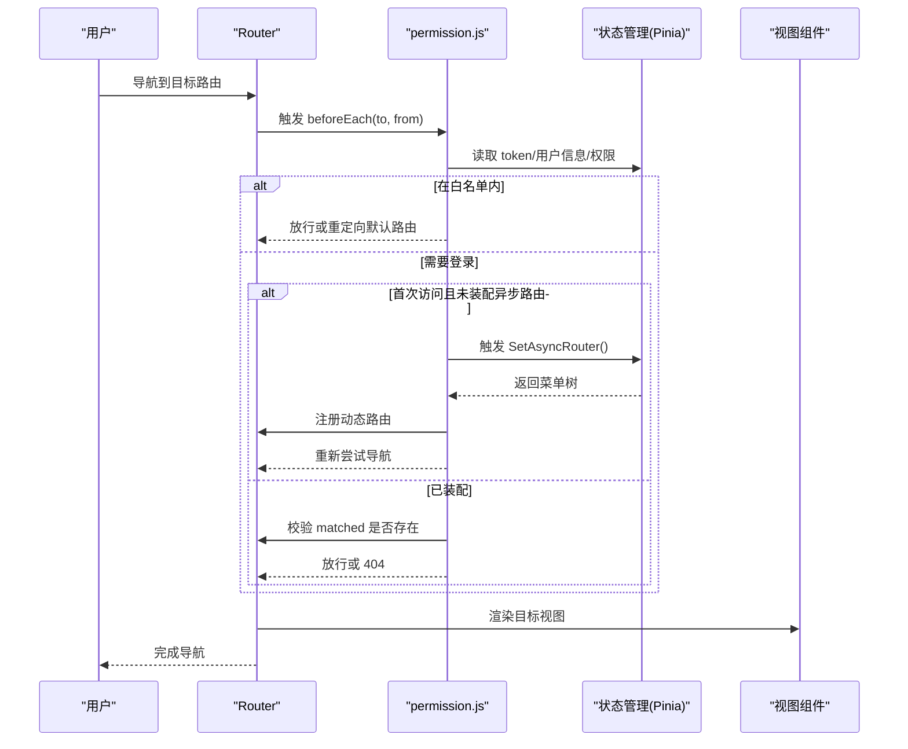
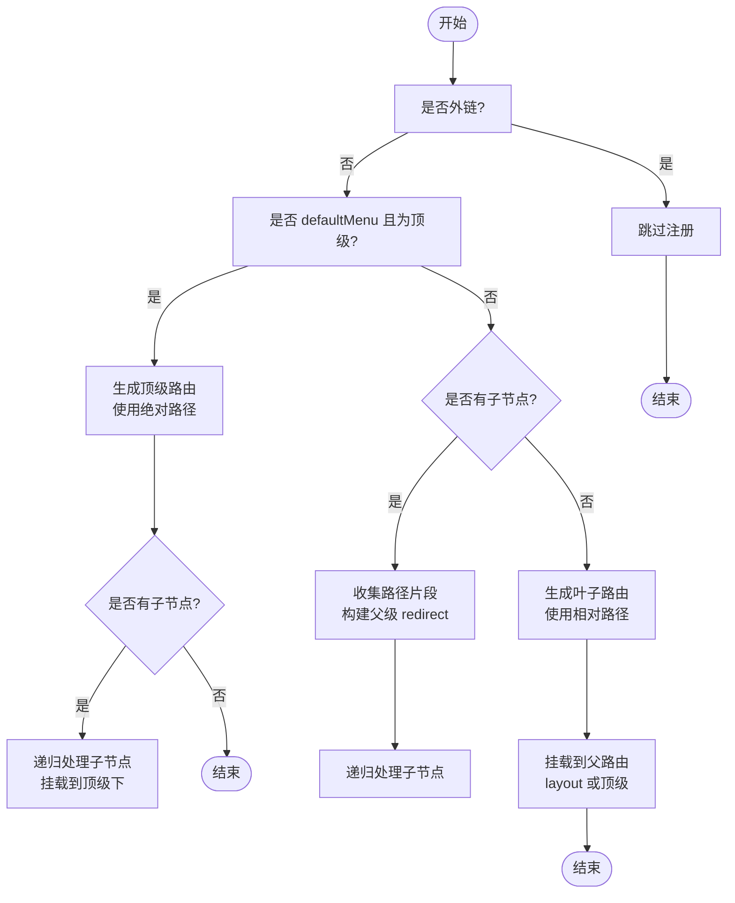
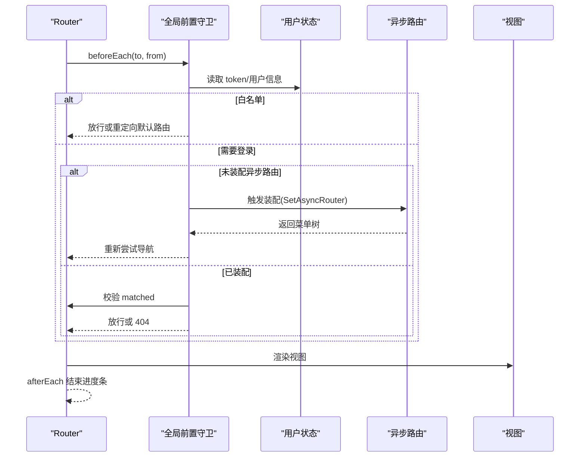
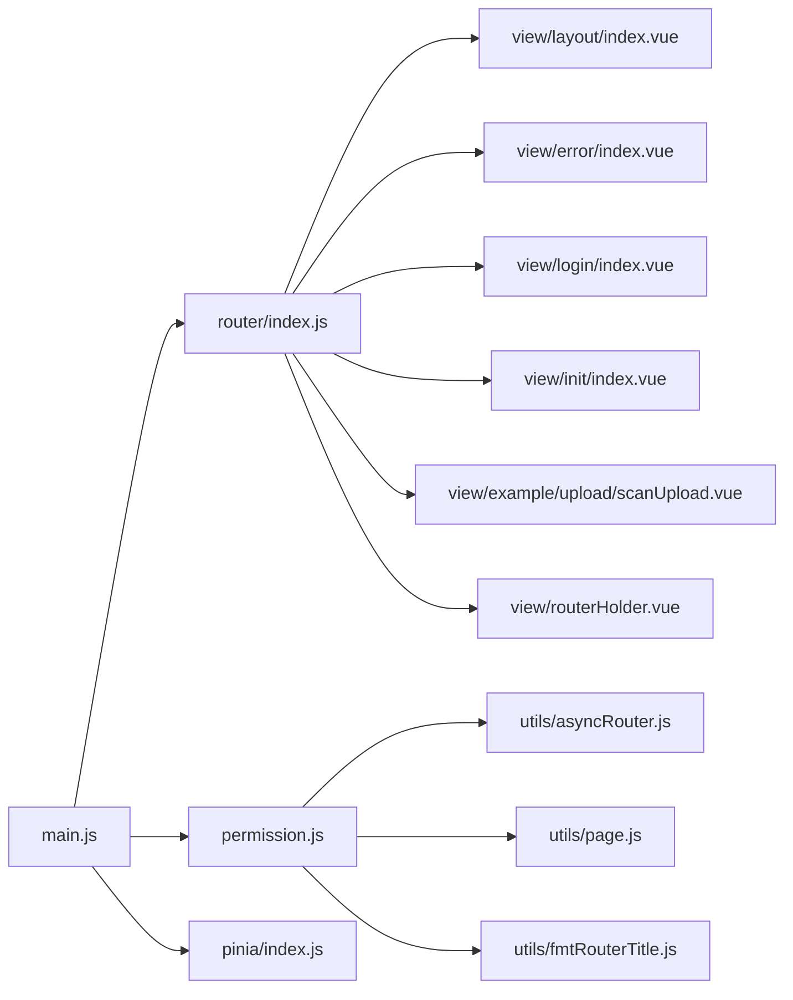

# 路由系统

<cite>
**本文引用的文件**
- [web/src/router/index.js](file://web/src/router/index.js)
- [web/src/permission.js](file://web/src/permission.js)
- [web/src/utils/asyncRouter.js](file://web/src/utils/asyncRouter.js)
- [web/src/utils/page.js](file://web/src/utils/page.js)
- [web/src/utils/fmtRouterTitle.js](file://web/src/utils/fmtRouterTitle.js)
- [web/src/main.js](file://web/src/main.js)
- [web/src/directive/auth.js](file://web/src/directive/auth.js)
- [web/src/utils/btnAuth.js](file://web/src/utils/btnAuth.js)
- [web/src/utils/closeThisPage.js](file://web/src/utils/closeThisPage.js)
- [web/src/view/layout/index.vue](file://web/src/view/layout/index.vue)
- [web/src/view/error/index.vue](file://web/src/view/error/index.vue)
- [web/src/view/login/index.vue](file://web/src/view/login/index.vue)
- [web/src/view/init/index.vue](file://web/src/view/init/index.vue)
- [web/src/view/example/upload/scanUpload.vue](file://web/src/view/example/upload/scanUpload.vue)
- [web/src/view/routerHolder.vue](file://web/src/view/routerHolder.vue)
- [web/src/pinia/index.js](file://web/src/pinia/index.js)
</cite>

## 目录
1. [简介](#简介)
2. [项目结构](#项目结构)
3. [核心组件](#核心组件)
4. [架构总览](#架构总览)
5. [详细组件分析](#详细组件分析)
6. [依赖分析](#依赖分析)
7. [性能考量](#性能考量)
8. [故障排查指南](#故障排查指南)
9. [结论](#结论)
10. [附录](#附录)

## 简介
本文件面向 Gin-Vue-Admin 前端工程的路由系统，围绕基于 Vue Router 的静态路由配置、动态路由生成、权限路由控制进行系统性技术说明。重点涵盖：
- 静态路由与白名单机制
- 动态路由生成算法与菜单到路由的映射
- 路由守卫体系（全局前置守卫、元信息与权限校验）
- 路由懒加载与缓存管理
- 面包屑与页面标题处理
- 权限控制（页面级、按钮级、接口级）与状态管理集成
- 调试与性能优化建议

## 项目结构
前端路由相关的核心文件集中在 web/src 目录，主要模块如下：
- 路由入口与静态路由：web/src/router/index.js
- 路由守卫与动态路由装配：web/src/permission.js
- 动态路由处理工具：web/src/utils/asyncRouter.js
- 页面标题与面包屑辅助：web/src/utils/page.js、web/src/utils/fmtRouterTitle.js
- 应用启动与指令注册：web/src/main.js
- 按钮级权限指令与钩子：web/src/directive/auth.js、web/src/utils/btnAuth.js
- 关闭当前页工具：web/src/utils/closeThisPage.js
- 布局与错误页视图：web/src/view/layout/index.vue、web/src/view/error/index.vue
- 登录与初始化视图：web/src/view/login/index.vue、web/src/view/init/index.vue
- 路由占位视图：web/src/view/routerHolder.vue
- 状态管理入口：web/src/pinia/index.js

图表来源
- [web/src/main.js:1-38](file://web/src/main.js#L1-L38)
- [web/src/router/index.js:1-42](file://web/src/router/index.js#L1-L42)
- [web/src/permission.js:1-225](file://web/src/permission.js#L1-L225)
- [web/src/utils/asyncRouter.js:1-30](file://web/src/utils/asyncRouter.js#L1-L30)
- [web/src/utils/page.js:1-10](file://web/src/utils/page.js#L1-L10)
- [web/src/utils/fmtRouterTitle.js:1-14](file://web/src/utils/fmtRouterTitle.js#L1-L14)
- [web/src/directive/auth.js:1-26](file://web/src/directive/auth.js#L1-L26)
- [web/src/pinia/index.js:1-9](file://web/src/pinia/index.js#L1-L9)
- [web/src/view/layout/index.vue](file://web/src/view/layout/index.vue)
- [web/src/view/error/index.vue](file://web/src/view/error/index.vue)
- [web/src/view/login/index.vue](file://web/src/view/login/index.vue)
- [web/src/view/init/index.vue](file://web/src/view/init/index.vue)
- [web/src/view/example/upload/scanUpload.vue](file://web/src/view/example/upload/scanUpload.vue)
- [web/src/view/routerHolder.vue](file://web/src/view/routerHolder.vue)

章节来源
- [web/src/main.js:1-38](file://web/src/main.js#L1-L38)
- [web/src/router/index.js:1-42](file://web/src/router/index.js#L1-L42)

## 核心组件
- 静态路由与白名单
  - 静态路由包含登录、初始化、示例页面与兜底错误页；通过白名单控制无需鉴权即可访问的路由。
  - 关键路径：[web/src/router/index.js:3-34](file://web/src/router/index.js#L3-L34)，[web/src/permission.js:15-16](file://web/src/permission.js#L15-L16)。

- 动态路由生成器
  - 将后端返回的菜单树转换为可注册的路由，支持 defaultMenu 顶级路由、layout 包裹、相对/绝对路径归一化、父子路由挂载。
  - 关键路径：[web/src/permission.js:42-114](file://web/src/permission.js#L42-L114)。

- 路由守卫
  - 全局前置守卫负责：进度条、页面标题、客户端路由、白名单、登录态、异步路由装配、匹配校验与跳转。
  - 关键路径：[web/src/permission.js:155-209](file://web/src/permission.js#L155-L209)。

- 动态路由处理工具
  - 将字符串组件路径映射为 Vite 动态导入模块，支持 view 与 plugin 两类模块集。
  - 关键路径：[web/src/utils/asyncRouter.js:1-29](file://web/src/utils/asyncRouter.js#L1-L29)。

- 页面标题与面包屑
  - 标题格式化支持模板变量替换；面包屑通常基于 matched 元信息与路由层级生成。
  - 关键路径：[web/src/utils/page.js:1-10](file://web/src/utils/page.js#L1-L10)，[web/src/utils/fmtRouterTitle.js:1-14](file://web/src/utils/fmtRouterTitle.js#L1-L14)，[web/src/permission.js:164-167](file://web/src/permission.js#L164-L167)。

- 按钮级权限
  - 指令式控制按钮可见性；组合式函数提供当前路由按钮权限对象读取。
  - 关键路径：[web/src/directive/auth.js:1-26](file://web/src/directive/auth.js#L1-L26)，[web/src/utils/btnAuth.js:1-7](file://web/src/utils/btnAuth.js#L1-L7)。

章节来源
- [web/src/router/index.js:3-34](file://web/src/router/index.js#L3-L34)
- [web/src/permission.js:15-16](file://web/src/permission.js#L15-L16)
- [web/src/permission.js:42-114](file://web/src/permission.js#L42-L114)
- [web/src/permission.js:155-209](file://web/src/permission.js#L155-L209)
- [web/src/utils/asyncRouter.js:1-29](file://web/src/utils/asyncRouter.js#L1-L29)
- [web/src/utils/page.js:1-10](file://web/src/utils/page.js#L1-L10)
- [web/src/utils/fmtRouterTitle.js:1-14](file://web/src/utils/fmtRouterTitle.js#L1-L14)
- [web/src/directive/auth.js:1-26](file://web/src/directive/auth.js#L1-L26)
- [web/src/utils/btnAuth.js:1-7](file://web/src/utils/btnAuth.js#L1-L7)

## 架构总览
路由系统采用“静态路由 + 动态路由”的双轨模式：
- 静态路由：登录、初始化、示例与兜底错误页等基础路由。
- 动态路由：根据用户权限从后端拉取菜单树，经 permission.js 转换后注册到 layout 或顶级路由下。
- 路由守卫：在进入前统一处理进度条、标题、白名单、登录态与权限校验，必要时触发动态路由装配。

图表来源
- [web/src/permission.js:155-209](file://web/src/permission.js#L155-L209)
- [web/src/router/index.js:3-34](file://web/src/router/index.js#L3-L34)
- [web/src/pinia/index.js:1-9](file://web/src/pinia/index.js#L1-L9)

## 详细组件分析

### 静态路由与白名单
- 静态路由包含登录、初始化、示例页面与兜底错误页；通过白名单控制无需鉴权即可访问的路由。
- 关键点：
  - 默认重定向至登录页。
  - 客户端路由（如扫码上传）通过 meta.client 标记直接放行。
  - 兜底路由捕获所有未匹配路径并关闭标签页。
- 路径参考：
  - [web/src/router/index.js:3-34](file://web/src/router/index.js#L3-L34)

章节来源
- [web/src/router/index.js:3-34](file://web/src/router/index.js#L3-L34)

### 动态路由生成算法与菜单到路由映射
- 算法核心：addRouteByChildren
  - 识别外链与默认顶级路由（defaultMenu）。
  - 顶层 layout 仅承载，不参与路径拼接；若节点标记 defaultMenu 且为顶级，则将其子节点作为该顶级的二级页面组件。
  - 对叶子节点，计算完整路径并挂载到指定父路由（默认 layout 或顶级）。
  - 归一化路径：顶级使用绝对路径，子路由使用相对路径，避免重复前缀。
- 注册流程：setupRouter
  - 确保 layout 顶级路由存在后，将 layout.children 与其他异步路由扁平化为二级子路由注册到 layout。
  - 使用 addTopLevelIfAbsent 防止重复注册。
- 路由懒加载：asyncRouterHandle
  - 将字符串组件路径映射为 Vite 动态导入模块，支持 view 与 plugin 两类模块集。
- 路径参考：
  - [web/src/permission.js:42-114](file://web/src/permission.js#L42-L114)
  - [web/src/permission.js:117-146](file://web/src/permission.js#L117-L146)
  - [web/src/utils/asyncRouter.js:1-29](file://web/src/utils/asyncRouter.js#L1-L29)

图表来源
- [web/src/permission.js:42-114](file://web/src/permission.js#L42-L114)

章节来源
- [web/src/permission.js:42-114](file://web/src/permission.js#L42-L114)
- [web/src/permission.js:117-146](file://web/src/permission.js#L117-L146)
- [web/src/utils/asyncRouter.js:1-29](file://web/src/utils/asyncRouter.js#L1-L29)

### 路由守卫系统
- 全局前置守卫职责：
  - 进度条与页面标题设置。
  - 客户端路由直接放行。
  - 白名单路由处理：若已登录且未装配异步路由则触发装配；若用户有默认路由则重定向。
  - 登录态校验：无 token 则重定向登录并携带 redirect。
  - 异步路由装配：首次访问时并行拉取用户信息与异步路由，完成后重新尝试导航。
  - 匹配校验：若无法匹配任何路由则跳转 404。
- 生命周期钩子：
  - afterEach：滚动到顶部并结束进度条。
  - onError：记录错误并移除进度条。
- 路径参考：
  - [web/src/permission.js:155-209](file://web/src/permission.js#L155-L209)
  - [web/src/permission.js:211-221](file://web/src/permission.js#L211-L221)

图表来源
- [web/src/permission.js:155-209](file://web/src/permission.js#L155-L209)
- [web/src/permission.js:211-221](file://web/src/permission.js#L211-L221)

章节来源
- [web/src/permission.js:155-209](file://web/src/permission.js#L155-L209)
- [web/src/permission.js:211-221](file://web/src/permission.js#L211-L221)

### 路由懒加载与缓存管理
- 懒加载策略：
  - 使用 Vite import.meta.glob 加载 view 与 plugin 下的组件，按需动态导入。
  - asyncRouterHandle 将字符串组件路径映射到对应模块。
- 路由缓存：
  - 路由元信息中包含 matched 缓存，配合 keep-alive 控制缓存策略。
- 路径参考：
  - [web/src/utils/asyncRouter.js:1-29](file://web/src/utils/asyncRouter.js#L1-L29)
  - [web/src/permission.js:164-165](file://web/src/permission.js#L164-L165)

章节来源
- [web/src/utils/asyncRouter.js:1-29](file://web/src/utils/asyncRouter.js#L1-L29)
- [web/src/permission.js:164-165](file://web/src/permission.js#L164-L165)

### 面包屑导航与页面标题
- 页面标题：
  - 通过 getPageTitle 统一拼接应用名；fmtRouterTitle 支持模板变量（params/query）替换。
- 面包屑：
  - 通常基于 to.meta.matched 与路由层级生成，结合布局视图渲染。
- 路径参考：
  - [web/src/utils/page.js:1-10](file://web/src/utils/page.js#L1-L10)
  - [web/src/utils/fmtRouterTitle.js:1-14](file://web/src/utils/fmtRouterTitle.js#L1-L14)
  - [web/src/permission.js:164-167](file://web/src/permission.js#L164-L167)

章节来源
- [web/src/utils/page.js:1-10](file://web/src/utils/page.js#L1-L10)
- [web/src/utils/fmtRouterTitle.js:1-14](file://web/src/utils/fmtRouterTitle.js#L1-L14)
- [web/src/permission.js:164-167](file://web/src/permission.js#L164-L167)

### 权限控制机制
- 页面级权限
  - 通过路由守卫校验 token 与 matched，未匹配则跳转 404。
- 按钮级权限
  - 指令 v-auth 根据用户 authorityId 与绑定值控制按钮显示；支持修饰符取反。
  - 组合式函数 useBtnAuth 提供当前路由按钮权限对象读取。
- 接口级权限
  - 通过后端接口与中间件（如 RBAC）实现；前端通过 token 与菜单树控制可见性与可操作性。
- 路径参考：
  - [web/src/directive/auth.js:1-26](file://web/src/directive/auth.js#L1-L26)
  - [web/src/utils/btnAuth.js:1-7](file://web/src/utils/btnAuth.js#L1-L7)
  - [web/src/permission.js:199](file://web/src/permission.js#L199)

章节来源
- [web/src/directive/auth.js:1-26](file://web/src/directive/auth.js#L1-L26)
- [web/src/utils/btnAuth.js:1-7](file://web/src/utils/btnAuth.js#L1-L7)
- [web/src/permission.js:199](file://web/src/permission.js#L199)

### 与状态管理、用户权限系统的集成
- 应用启动时注册路由守卫与指令，Pinia 提供用户与路由状态。
- 路由守卫中读取 token 与用户信息，触发异步路由装配。
- 路由占位视图用于动态路由渲染。
- 路径参考：
  - [web/src/main.js:13-35](file://web/src/main.js#L13-L35)
  - [web/src/pinia/index.js:1-9](file://web/src/pinia/index.js#L1-L9)
  - [web/src/view/routerHolder.vue](file://web/src/view/routerHolder.vue)

章节来源
- [web/src/main.js:13-35](file://web/src/main.js#L13-L35)
- [web/src/pinia/index.js:1-9](file://web/src/pinia/index.js#L1-L9)
- [web/src/view/routerHolder.vue](file://web/src/view/routerHolder.vue)

## 依赖分析
- 组件耦合关系
  - main.js 依赖 router、permission、pinia、指令与应用初始化。
  - permission.js 依赖 router、pinia 模块、页面标题工具与动态路由处理工具。
  - asyncRouter.js 依赖 Vite 动态导入能力。
- 外部依赖
  - Vue Router、Element Plus、NProgress。
- 路由与视图
  - 静态路由绑定具体视图组件；动态路由通过字符串路径映射到视图模块。

图表来源
- [web/src/main.js:1-38](file://web/src/main.js#L1-L38)
- [web/src/router/index.js:1-42](file://web/src/router/index.js#L1-L42)
- [web/src/permission.js:1-225](file://web/src/permission.js#L1-L225)
- [web/src/utils/asyncRouter.js:1-30](file://web/src/utils/asyncRouter.js#L1-L30)
- [web/src/utils/page.js:1-10](file://web/src/utils/page.js#L1-L10)
- [web/src/utils/fmtRouterTitle.js:1-14](file://web/src/utils/fmtRouterTitle.js#L1-L14)
- [web/src/view/layout/index.vue](file://web/src/view/layout/index.vue)
- [web/src/view/error/index.vue](file://web/src/view/error/index.vue)
- [web/src/view/login/index.vue](file://web/src/view/login/index.vue)
- [web/src/view/init/index.vue](file://web/src/view/init/index.vue)
- [web/src/view/example/upload/scanUpload.vue](file://web/src/view/example/upload/scanUpload.vue)
- [web/src/view/routerHolder.vue](file://web/src/view/routerHolder.vue)

章节来源
- [web/src/main.js:1-38](file://web/src/main.js#L1-L38)
- [web/src/router/index.js:1-42](file://web/src/router/index.js#L1-L42)
- [web/src/permission.js:1-225](file://web/src/permission.js#L1-L225)
- [web/src/utils/asyncRouter.js:1-30](file://web/src/utils/asyncRouter.js#L1-L30)
- [web/src/utils/page.js:1-10](file://web/src/utils/page.js#L1-L10)
- [web/src/utils/fmtRouterTitle.js:1-14](file://web/src/utils/fmtRouterTitle.js#L1-L14)

## 性能考量
- 路由懒加载
  - 使用 import.meta.glob 与动态导入减少首屏体积，提升初始化速度。
- 并行装配
  - 在白名单路由中并行获取用户信息与异步路由，缩短首次渲染等待时间。
- Keep-alive 缓存
  - 通过路由元信息与 handleKeepAlive 控制缓存策略，避免重复渲染。
- 进度条与滚动
  - NProgress 与滚动复位提升用户体验，减少感知延迟。

## 故障排查指南
- 404 未匹配
  - 检查动态路由是否正确注册到 layout 或顶级路由；确认 matched 校验逻辑。
  - 参考路径：[web/src/permission.js:199](file://web/src/permission.js#L199)
- 登录循环跳转
  - 确认白名单路由与默认路由配置；检查 redirect 参数传递。
  - 参考路径：[web/src/permission.js:178-180](file://web/src/permission.js#L178-L180)
- 按钮不显示
  - 检查 v-auth 绑定值与用户 authorityId；确认修饰符使用。
  - 参考路径：[web/src/directive/auth.js:14-21](file://web/src/directive/auth.js#L14-L21)
- 标题异常
  - 检查 meta.title 与模板变量 params/query；确认 fmtRouterTitle 替换逻辑。
  - 参考路径：[web/src/utils/page.js:3-8](file://web/src/utils/page.js#L3-L8)，[web/src/utils/fmtRouterTitle.js:1-13](file://web/src/utils/fmtRouterTitle.js#L1-L13)
- 路由重复注册
  - 使用 addTopLevelIfAbsent 防止重复注册；确保 defaultMenu 与 layout 分支逻辑正确。
  - 参考路径：[web/src/permission.js:32-37](file://web/src/permission.js#L32-L37)，[web/src/permission.js:55-73](file://web/src/permission.js#L55-L73)

章节来源
- [web/src/permission.js:199](file://web/src/permission.js#L199)
- [web/src/permission.js:178-180](file://web/src/permission.js#L178-L180)
- [web/src/directive/auth.js:14-21](file://web/src/directive/auth.js#L14-L21)
- [web/src/utils/page.js:3-8](file://web/src/utils/page.js#L3-L8)
- [web/src/utils/fmtRouterTitle.js:1-13](file://web/src/utils/fmtRouterTitle.js#L1-L13)
- [web/src/permission.js:32-37](file://web/src/permission.js#L32-L37)
- [web/src/permission.js:55-73](file://web/src/permission.js#L55-L73)

## 结论
本路由系统通过“静态路由 + 动态路由 + 路由守卫”的组合，实现了灵活的权限控制与良好的用户体验。动态路由生成算法清晰地将菜单树映射为路由树，配合懒加载与缓存策略显著优化了性能。权限控制覆盖页面级与按钮级，接口级权限由后端保障。建议在后续迭代中完善接口级权限与更细粒度的缓存策略，并持续优化导航与错误处理体验。

## 附录
- 路由配置规范
  - 静态路由：仅包含基础页面与兜底路由；避免复杂嵌套。
  - 动态路由：遵循 defaultMenu 与 layout 规范；组件路径使用字符串并由 asyncRouterHandle 解析。
  - 元信息：title、client、defaultMenu、btns 等字段按约定使用。
- 调试技巧
  - 使用浏览器开发者工具查看路由注册情况与 matched 缓存。
  - 在 beforeEach 中打印 to/from 与 token 状态，定位跳转问题。
  - 检查动态导入模块是否存在与路径是否正确。
- 集成建议
  - 将权限与路由解耦，后端提供菜单树与按钮权限集合，前端仅做渲染与交互控制。
  - 保持路由元信息简洁明确，便于维护与扩展。