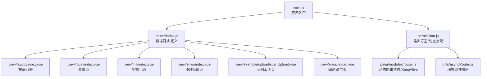
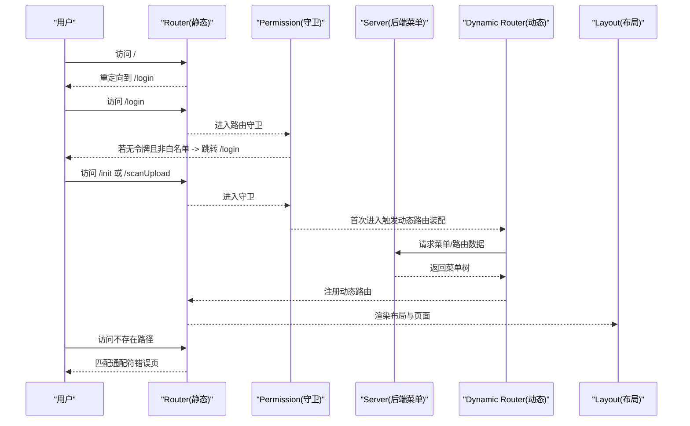
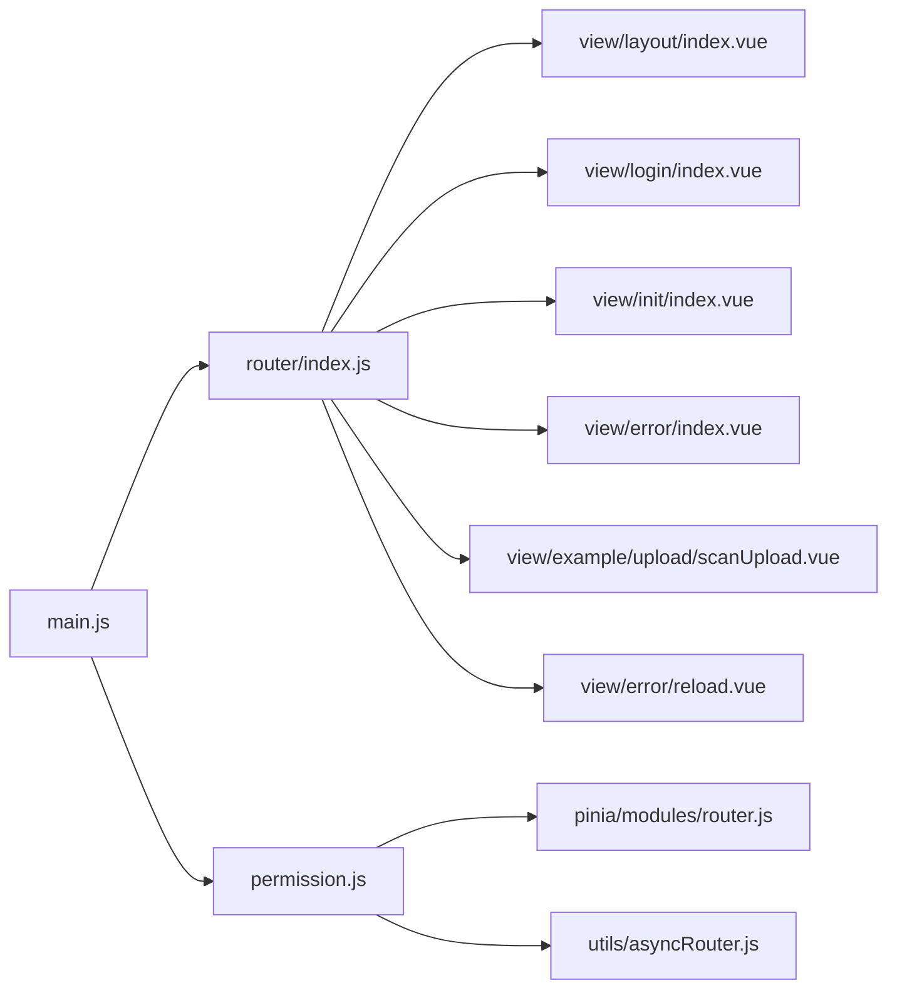

# 静态路由配置

<cite>
**本文引用的文件**
- [web/src/router/index.js](file://web/src/router/index.js)
- [web/src/permission.js](file://web/src/permission.js)
- [web/src/utils/asyncRouter.js](file://web/src/utils/asyncRouter.js)
- [web/src/pinia/modules/router.js](file://web/src/pinia/modules/router.js)
- [web/src/view/error/index.vue](file://web/src/view/error/index.vue)
- [web/src/view/login/index.vue](file://web/src/view/login/index.vue)
- [web/src/view/init/index.vue](file://web/src/view/init/index.vue)
- [web/src/view/example/upload/scanUpload.vue](file://web/src/view/example/upload/scanUpload.vue)
- [web/src/view/error/reload.vue](file://web/src/view/error/reload.vue)
- [web/src/view/layout/index.vue](file://web/src/view/layout/index.vue)
- [web/src/utils/page.js](file://web/src/utils/page.js)
- [web/src/utils/fmtRouterTitle.js](file://web/src/utils/fmtRouterTitle.js)
- [web/src/main.js](file://web/src/main.js)
</cite>

## 目录
1. [引言](#引言)
2. [项目结构](#项目结构)
3. [核心组件](#核心组件)
4. [架构总览](#架构总览)
5. [详细组件分析](#详细组件分析)
6. [依赖分析](#依赖分析)
7. [性能考量](#性能考量)
8. [故障排查指南](#故障排查指南)
9. [结论](#结论)
10. [附录](#附录)

## 引言
本文件聚焦于 Gin-Vue-Admin 前端工程中的“静态路由配置”，系统性解析 Vue Router 的基础路由、重定向规则、错误页面路由、登录与初始化路由等核心静态路由的实现；阐明路由元信息（meta）在标题设置、客户端直连标记、标签页控制等方面的用法；解释路由懒加载（动态 import）的实现与性能优化；说明历史模式选择（hash 模式）及其与浏览器历史记录的关系；并总结命名规范、路径设计原则、组件组织结构的最佳实践，最后提供调试方法与常见问题解决方案。

## 项目结构
静态路由位于前端工程的路由入口文件中，配合全局路由守卫、动态路由装配与布局容器共同构成完整的导航体系。关键文件与职责如下：
- 路由入口与静态路由定义：web/src/router/index.js
- 全局路由守卫与白名单、动态路由装配：web/src/permission.js
- 动态路由组件映射与懒加载处理：web/src/utils/asyncRouter.js
- 动态路由状态与 KeepAlive 策略：web/src/pinia/modules/router.js
- 错误页与登录页、初始化页、示例上传页等静态页面组件
- 页面标题与路由标题格式化工具：web/src/utils/page.js、web/src/utils/fmtRouterTitle.js
- 应用启动与路由挂载：web/src/main.js

图表来源
- [web/src/main.js:1-38](file://web/src/main.js#L1-L38)
- [web/src/router/index.js:1-42](file://web/src/router/index.js#L1-L42)
- [web/src/permission.js:1-225](file://web/src/permission.js#L1-L225)
- [web/src/utils/asyncRouter.js:1-30](file://web/src/utils/asyncRouter.js#L1-L30)
- [web/src/pinia/modules/router.js:1-208](file://web/src/pinia/modules/router.js#L1-L208)
- [web/src/view/layout/index.vue:1-119](file://web/src/view/layout/index.vue#L1-L119)
- [web/src/view/login/index.vue:1-252](file://web/src/view/login/index.vue#L1-L252)
- [web/src/view/init/index.vue:1-387](file://web/src/view/init/index.vue#L1-L387)
- [web/src/view/error/index.vue:1-50](file://web/src/view/error/index.vue#L1-L50)
- [web/src/view/example/upload/scanUpload.vue:1-246](file://web/src/view/example/upload/scanUpload.vue#L1-L246)
- [web/src/view/error/reload.vue:1-15](file://web/src/view/error/reload.vue#L1-L15)

章节来源
- [web/src/router/index.js:1-42](file://web/src/router/index.js#L1-L42)
- [web/src/main.js:1-38](file://web/src/main.js#L1-L38)

## 核心组件
- 静态路由集合与历史模式
  - 静态路由数组包含：根路径重定向、初始化页、登录页、示例上传页、通配符错误页。
  - 历史模式采用 hash 模式，便于部署在任意静态服务器或子路径场景。
- 全局路由守卫
  - 白名单：登录页、初始化页。
  - 客户端直连标记：当 meta.client 为真时，允许直接渲染，不强制登录。
  - 动态路由装配：首次进入非白名单且无令牌时，触发动态路由注册与布局挂载。
  - 404 与权限不足：未匹配到任何路由时，进入错误页；错误页内可触发回退或重新登录。
- 动态路由与懒加载
  - 动态路由通过后端菜单生成，运行时转换为静态路由树并按需懒加载组件。
  - 懒加载通过 Vite 的 import.meta.glob 收集视图模块，再由 asyncRouterHandle 映射为实际组件。
- 页面标题与路由标题
  - 通过 getPageTitle 与 fmtRouterTitle 实现标题拼接与参数替换，结合 meta.title 使用。

章节来源
- [web/src/router/index.js:1-42](file://web/src/router/index.js#L1-L42)
- [web/src/permission.js:15-225](file://web/src/permission.js#L15-L225)
- [web/src/utils/asyncRouter.js:1-30](file://web/src/utils/asyncRouter.js#L1-L30)
- [web/src/pinia/modules/router.js:158-193](file://web/src/pinia/modules/router.js#L158-L193)
- [web/src/utils/page.js:1-10](file://web/src/utils/page.js#L1-L10)
- [web/src/utils/fmtRouterTitle.js:1-14](file://web/src/utils/fmtRouterTitle.js#L1-L14)

## 架构总览
静态路由负责应用的“公共入口”和“兜底页面”，动态路由负责“业务页面”的按需加载与权限控制。二者协同工作，形成“静态路由引导 + 动态路由扩展”的导航体系。

图表来源
- [web/src/router/index.js:1-42](file://web/src/router/index.js#L1-L42)
- [web/src/permission.js:155-225](file://web/src/permission.js#L155-L225)
- [web/src/pinia/modules/router.js:158-193](file://web/src/pinia/modules/router.js#L158-L193)

## 详细组件分析

### 静态路由定义与历史模式
- 根路径重定向至登录页，确保首次访问进入认证流程。
- 初始化页、登录页、示例上传页均为静态路由，采用懒加载组件。
- 通配符路由兜底 404，meta 标记 closeTab 控制标签页行为。
- 历史模式为 hash 模式，利于部署与兼容性。

章节来源
- [web/src/router/index.js:1-42](file://web/src/router/index.js#L1-L42)

### 路由元信息（meta）详解
- 标题设置：通过 meta.title 与 getPageTitle 结合，实现页面标题动态拼接与多语言/参数替换。
- 客户端直连标记：meta.client 为真时，守卫直接放行，适用于无需登录即可访问的页面。
- 标签页控制：meta.closeTab 用于指示错误页等场景关闭标签页或回退。
- KeepAlive 与布局：动态路由中通过 meta.keepAlive 与布局容器配合，实现页面缓存与切换动画。

章节来源
- [web/src/router/index.js:18-33](file://web/src/router/index.js#L18-L33)
- [web/src/permission.js:163-170](file://web/src/permission.js#L163-L170)
- [web/src/utils/page.js:1-10](file://web/src/utils/page.js#L1-L10)
- [web/src/utils/fmtRouterTitle.js:1-14](file://web/src/utils/fmtRouterTitle.js#L1-L14)
- [web/src/view/layout/index.vue:38-47](file://web/src/view/layout/index.vue#L38-L47)

### 路由懒加载机制与性能优化
- 动态 import：静态路由中的组件均以函数形式返回动态 import，实现按需加载。
- Vite import.meta.glob：收集视图与插件目录下的所有 .vue 文件，构建模块映射表。
- asyncRouterHandle：遍历动态路由树，将字符串组件路径映射为真实组件，支持 view 与 plugin 前缀。
- 性能优化：减少首屏包体积、提升冷启动速度；结合 KeepAlive 与路由切换动画，改善用户体验。

章节来源
- [web/src/router/index.js:11,25,16](file://web/src/router/index.js#L11,L25,L16)
- [web/src/utils/asyncRouter.js:1-30](file://web/src/utils/asyncRouter.js#L1-L30)

### 动态路由装配与布局挂载
- 动态路由来源：后端菜单接口返回的菜单树，经格式化后与基础布局合并。
- 布局挂载：先注册顶层布局路由，再将动态路由扁平化为二级子路由挂载到布局下。
- KeepAlive 策略：根据路由树与历史记录计算需要缓存的组件名，保证标签页切换不丢失状态。

章节来源
- [web/src/pinia/modules/router.js:158-193](file://web/src/pinia/modules/router.js#L158-L193)
- [web/src/permission.js:117-146](file://web/src/permission.js#L117-L146)

### 错误页面与回退机制
- 通配符错误页：捕获所有未匹配路由，展示友好提示与返回首页按钮。
- 回退占位页：通过 Reload 路由触发回退，避免刷新导致的状态丢失。
- 权限变更处理：错误页内检测到路由权限被修改，提示重新登录并清理本地存储。

章节来源
- [web/src/router/index.js:28-33](file://web/src/router/index.js#L28-L33)
- [web/src/view/error/index.vue:1-50](file://web/src/view/error/index.vue#L1-L50)
- [web/src/view/error/reload.vue:1-15](file://web/src/view/error/reload.vue#L1-L15)

### 登录与初始化流程
- 登录页：提供用户名、密码、验证码输入，调用用户登录接口，成功后进入系统。
- 初始化页：首次部署时进行数据库初始化与管理员账户配置，完成后跳转登录页。
- 白名单策略：登录页与初始化页无需令牌即可访问，保障初始化与认证流程顺畅。

章节来源
- [web/src/view/login/index.vue:1-252](file://web/src/view/login/index.vue#L1-L252)
- [web/src/view/init/index.vue:1-387](file://web/src/view/init/index.vue#L1-L387)
- [web/src/permission.js:15-17](file://web/src/permission.js#L15-L17)

### 示例上传页（客户端直连）
- 客户端直连标记：meta.client 为真，无需登录即可访问。
- 参数透传：通过路由查询参数接收 classId 与 token，供上传组件使用。
- 图片裁剪与上传：集成图片裁剪与上传逻辑，演示 meta.client 的典型用法。

章节来源
- [web/src/router/index.js:18-26](file://web/src/router/index.js#L18-L26)
- [web/src/view/example/upload/scanUpload.vue:1-246](file://web/src/view/example/upload/scanUpload.vue#L1-L246)

## 依赖分析
静态路由与全局守卫、动态路由模块之间存在明确的依赖关系：
- main.js 依赖 router/index.js 与 permission.js，完成应用初始化与路由守卫注册。
- permission.js 依赖 pinia/modules/router.js 与 utils/asyncRouter.js，实现动态路由装配与组件映射。
- router/index.js 依赖各页面组件（通过懒加载），并与布局容器协作。

图表来源
- [web/src/main.js:1-38](file://web/src/main.js#L1-L38)
- [web/src/router/index.js:1-42](file://web/src/router/index.js#L1-L42)
- [web/src/permission.js:1-225](file://web/src/permission.js#L1-L225)
- [web/src/utils/asyncRouter.js:1-30](file://web/src/utils/asyncRouter.js#L1-L30)
- [web/src/pinia/modules/router.js:1-208](file://web/src/pinia/modules/router.js#L1-L208)

章节来源
- [web/src/main.js:1-38](file://web/src/main.js#L1-L38)
- [web/src/router/index.js:1-42](file://web/src/router/index.js#L1-L42)
- [web/src/permission.js:1-225](file://web/src/permission.js#L1-L225)
- [web/src/utils/asyncRouter.js:1-30](file://web/src/utils/asyncRouter.js#L1-L30)
- [web/src/pinia/modules/router.js:1-208](file://web/src/pinia/modules/router.js#L1-L208)

## 性能考量
- 懒加载优先：静态路由中的组件均采用动态 import，降低首屏体积。
- 按需映射：通过 import.meta.glob 收集模块，避免手动维护组件映射表。
- KeepAlive 策略：基于路由树与历史记录计算缓存列表，减少重复渲染。
- 切换动画：布局容器统一管理过渡动画，提升视觉体验。
- Hash 模式：简化部署与兼容性，避免因历史模式导致的二次刷新问题。

章节来源
- [web/src/router/index.js:11,25,16](file://web/src/router/index.js#L11,L25,L16)
- [web/src/utils/asyncRouter.js:1-30](file://web/src/utils/asyncRouter.js#L1-L30)
- [web/src/pinia/modules/router.js:51-100](file://web/src/pinia/modules/router.js#L51-L100)
- [web/src/view/layout/index.vue:38-47](file://web/src/view/layout/index.vue#L38-L47)

## 故障排查指南
- 无法进入系统或反复跳转登录页
  - 检查白名单是否包含当前路由名称；确认守卫逻辑与令牌状态。
  - 参考：[web/src/permission.js:15-225](file://web/src/permission.js#L15-L225)
- 404 页面频繁出现
  - 检查是否存在未注册的动态路由或路径拼接错误；确认通配符路由是否生效。
  - 参考：[web/src/router/index.js:28-33](file://web/src/router/index.js#L28-L33)
- 页面标题不显示或显示异常
  - 检查 meta.title 是否设置；确认 getPageTitle 与 fmtRouterTitle 的调用链。
  - 参考：[web/src/utils/page.js:1-10](file://web/src/utils/page.js#L1-L10)、[web/src/utils/fmtRouterTitle.js:1-14](file://web/src/utils/fmtRouterTitle.js#L1-L14)
- 客户端直连页面无法访问
  - 检查 meta.client 是否为真；确认守卫对客户端直连的放行逻辑。
  - 参考：[web/src/router/index.js:18-26](file://web/src/router/index.js#L18-L26)、[web/src/permission.js:163-170](file://web/src/permission.js#L163-L170)
- 动态路由未生效或组件未加载
  - 检查 asyncRouterHandle 是否正确映射组件路径；确认 import.meta.glob 是否覆盖目标文件。
  - 参考：[web/src/utils/asyncRouter.js:1-30](file://web/src/utils/asyncRouter.js#L1-L30)、[web/src/pinia/modules/router.js:158-193](file://web/src/pinia/modules/router.js#L158-L193)
- 刷新后状态丢失
  - 检查 KeepAlive 策略与布局容器的缓存逻辑；确认路由 meta.keepAlive 与历史记录联动。
  - 参考：[web/src/view/layout/index.vue:38-47](file://web/src/view/layout/index.vue#L38-L47)、[web/src/pinia/modules/router.js:51-100](file://web/src/pinia/modules/router.js#L51-L100)

## 结论
静态路由在 Gin-Vue-Admin 中承担“入口与兜底”的职责，配合全局路由守卫与动态路由装配，实现了灵活的权限控制与性能优化。通过合理的 meta 设计、懒加载策略与 KeepAlive 管理，既能满足部署灵活性，又能提供良好的用户体验。建议在后续迭代中持续完善命名规范、路径设计与组件组织，以保持代码可维护性与扩展性。

## 附录

### 最佳实践清单
- 命名规范
  - 路由名称使用帕斯卡命名，如 Login、Init、Error。
  - 组件文件名与路由名称一致，便于查找与维护。
- 路径设计原则
  - 静态路由路径简洁明确，避免深层嵌套；动态路由通过布局统一承载。
  - 通配符路由置于末尾，确保精确匹配优先。
- 组件组织结构
  - 页面组件集中放置于 view 目录，按功能域分层；插件组件放置于 plugin 目录。
  - 通过 asyncRouterHandle 统一映射，减少手写映射表。
- 元信息使用
  - 标题：统一通过 meta.title 与 getPageTitle 组合使用。
  - 客户端直连：仅对确需直连的页面设置 meta.client。
  - 标签页控制：对错误页、回退页等设置 meta.closeTab。
  - 缓存控制：对需要保持状态的页面设置 meta.keepAlive，并在布局中启用缓存。
- 历史模式选择
  - 生产环境推荐 hash 模式，简化部署与兼容性；开发环境可按需评估。
- 调试方法
  - 在路由守卫中打印 to/from 信息，定位匹配与放行逻辑问题。
  - 使用浏览器开发者工具 Network 面板检查动态 import 的加载情况。
  - 在布局容器中观察 KeepAlive include 列表变化，确认缓存命中。