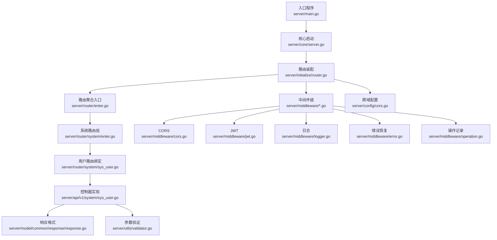
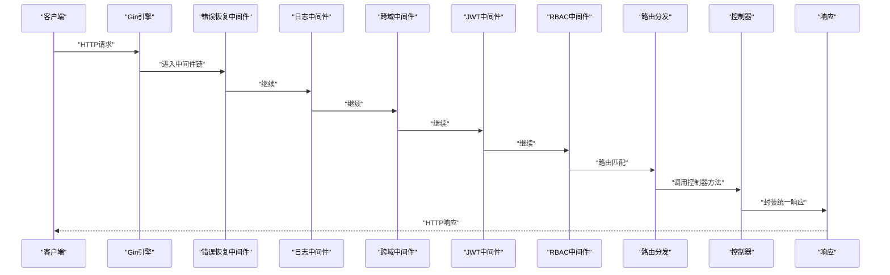
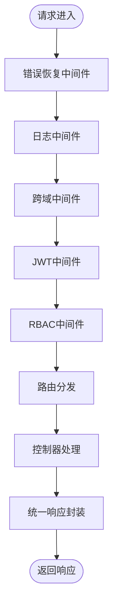
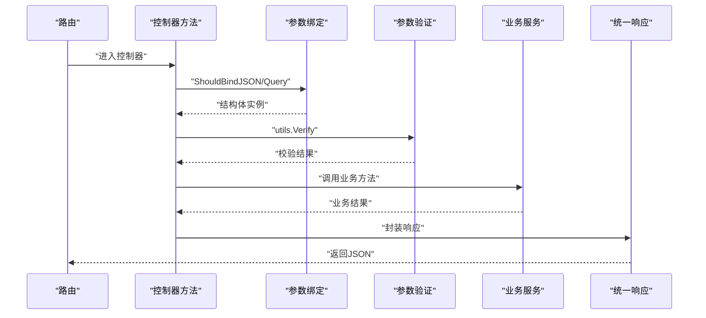
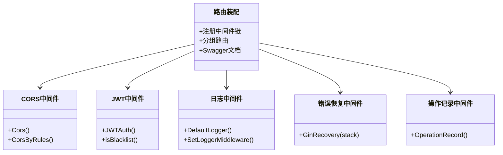
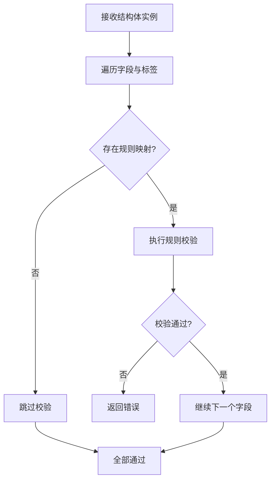
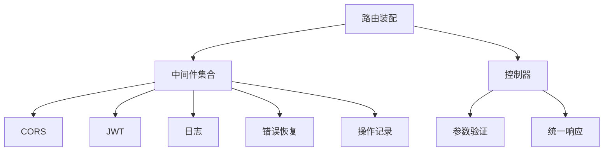

# API层设计

<cite>
**本文引用的文件**
- [main.go](file://server/main.go)
- [server.go](file://server/core/server.go)
- [router.go](file://server/initialize/router.go)
- [enter.go](file://server/router/enter.go)
- [enter.go](file://server/router/system/enter.go)
- [sys_user.go](file://server/router/system/sys_user.go)
- [sys_user.go](file://server/api/v1/system/sys_user.go)
- [cors.go](file://server/middleware/cors.go)
- [jwt.go](file://server/middleware/jwt.go)
- [logger.go](file://server/middleware/logger.go)
- [error.go](file://server/middleware/error.go)
- [operation.go](file://server/middleware/operation.go)
- [cors.go](file://server/config/cors.go)
- [response.go](file://server/model/common/response/response.go)
- [validator.go](file://server/utils/validator.go)
</cite>

## 目录
1. [引言](#引言)
2. [项目结构](#项目结构)
3. [核心组件](#核心组件)
4. [架构总览](#架构总览)
5. [详细组件分析](#详细组件分析)
6. [依赖分析](#依赖分析)
7. [性能考量](#性能考量)
8. [故障排查指南](#故障排查指南)
9. [结论](#结论)
10. [附录](#附录)

## 引言
本文件面向后端工程师与技术管理者，系统性阐述基于 Gin 的 API 层设计与实现，覆盖路由注册机制、中间件链设计、请求处理流程、RESTful 设计原则与实现、CORS/日志/JWT/错误处理等核心中间件、API 版本管理策略、参数验证机制与错误码规范。文档同时提供可视化图示与可追溯的“章节来源”“图表来源”，帮助读者快速定位实现细节。

## 项目结构
后端采用分层与模块化组织：入口程序负责系统初始化与服务器启动；路由层按功能域拆分（system、example），控制器位于 api/v1 下，中间件集中于 middleware；配置与响应格式、参数验证分别位于 config、model/common/response、utils。

图表来源
- [main.go:30-35](file://server/main.go#L30-L35)
- [server.go:32-47](file://server/core/server.go#L32-L47)
- [router.go:36-117](file://server/initialize/router.go#L36-L117)
- [enter.go:8-13](file://server/router/enter.go#L8-L13)
- [enter.go:5-27](file://server/router/system/enter.go#L5-L27)
- [sys_user.go:10-28](file://server/router/system/sys_user.go#L10-L28)
- [sys_user.go:20-99](file://server/api/v1/system/sys_user.go#L20-L99)
- [cors.go:10-28](file://server/middleware/cors.go#L10-L28)
- [jwt.go:16-77](file://server/middleware/jwt.go#L16-L77)
- [logger.go:41-89](file://server/middleware/logger.go#L41-L89)
- [error.go:21-79](file://server/middleware/error.go#L21-L79)
- [operation.go:31-119](file://server/middleware/operation.go#L31-L119)
- [cors.go:3-14](file://server/config/cors.go#L3-L14)
- [response.go:9-63](file://server/model/common/response/response.go#L9-L63)
- [validator.go:118-165](file://server/utils/validator.go#L118-L165)

章节来源
- [main.go:30-52](file://server/main.go#L30-L52)
- [server.go:14-48](file://server/core/server.go#L14-L48)
- [router.go:36-117](file://server/initialize/router.go#L36-L117)
- [enter.go:8-13](file://server/router/enter.go#L8-L13)
- [enter.go:5-27](file://server/router/system/enter.go#L5-L27)

## 核心组件
- 路由注册与前缀管理：通过 RouterGroup 与 RouterPrefix 实现统一前缀与分组注册，私有路由统一挂载 JWT 与 RBAC 中间件。
- 控制器层：按领域划分（system、example），控制器方法内完成参数绑定、验证、业务调用与统一响应封装。
- 中间件链：统一在路由装配阶段注册，涵盖跨域、日志、JWT、RBAC、错误恢复、操作记录等。
- 响应与验证：统一响应结构体与常量，参数验证采用反射与规则映射，支持长度/数值/正则/非空等规则。

章节来源
- [router.go:65-105](file://server/initialize/router.go#L65-L105)
- [sys_user.go:10-28](file://server/router/system/sys_user.go#L10-L28)
- [sys_user.go:20-99](file://server/api/v1/system/sys_user.go#L20-L99)
- [response.go:9-63](file://server/model/common/response/response.go#L9-L63)
- [validator.go:118-165](file://server/utils/validator.go#L118-L165)

## 架构总览
下图展示从请求进入至响应返回的关键流转，以及中间件链的执行顺序与职责边界。

图表来源
- [router.go:36-117](file://server/initialize/router.go#L36-L117)
- [error.go:21-79](file://server/middleware/error.go#L21-L79)
- [logger.go:41-89](file://server/middleware/logger.go#L41-L89)
- [cors.go:10-28](file://server/middleware/cors.go#L10-L28)
- [jwt.go:16-77](file://server/middleware/jwt.go#L16-L77)
- [sys_user.go:10-28](file://server/router/system/sys_user.go#L10-L28)
- [sys_user.go:20-99](file://server/api/v1/system/sys_user.go#L20-L99)

## 详细组件分析

### 路由注册机制与中间件链
- 路由装配：在路由装配函数中创建 gin.Engine，注册 Swagger 文档、静态资源、跨域中间件（可选）、统一前缀与分组。
- 私有路由组：统一挂载 JWTAuth 与 CasbinHandler，确保受保护接口的安全访问。
- 公共路由组：开放健康检查与无需鉴权的基础接口。
- 中间件顺序：错误恢复 → 日志 → 跨域 → JWT → RBAC → 路由分发 → 控制器 → 响应。

图表来源
- [router.go:36-117](file://server/initialize/router.go#L36-L117)
- [error.go:21-79](file://server/middleware/error.go#L21-L79)
- [logger.go:41-89](file://server/middleware/logger.go#L41-L89)
- [cors.go:10-28](file://server/middleware/cors.go#L10-L28)
- [jwt.go:16-77](file://server/middleware/jwt.go#L16-L77)

章节来源
- [router.go:36-117](file://server/initialize/router.go#L36-L117)

### 请求处理流程与控制器设计
- 控制器方法在路由绑定时注册，接收 gin.Context，完成参数绑定、验证、业务调用与统一响应。
- 统一响应结构包含 code、data、msg，便于前端一致处理。
- 参数验证通过反射遍历结构体字段，结合规则映射执行非空、长度/数值比较、正则匹配等校验。

图表来源
- [sys_user.go:20-99](file://server/api/v1/system/sys_user.go#L20-L99)
- [validator.go:118-165](file://server/utils/validator.go#L118-L165)
- [response.go:20-62](file://server/model/common/response/response.go#L20-L62)

章节来源
- [sys_user.go:20-99](file://server/api/v1/system/sys_user.go#L20-L99)
- [validator.go:118-165](file://server/utils/validator.go#L118-L165)
- [response.go:9-63](file://server/model/common/response/response.go#L9-L63)

### RESTful 设计原则与实现
- HTTP 方法映射：POST/GET/PUT/DELETE 与资源语义一致，如用户管理的增删改查。
- URL 模式设计：采用名词复数与层级组合，如 /user/{action}，配合 RouterPrefix 实现统一前缀。
- 请求参数处理：优先使用 JSON Body 传递复杂对象，必要时使用查询参数分页/筛选。
- 响应格式标准化：统一使用响应结构体，code=0 成功，非 0 失败；消息与数据分离。

章节来源
- [sys_user.go:10-28](file://server/router/system/sys_user.go#L10-L28)
- [sys_user.go:20-99](file://server/api/v1/system/sys_user.go#L20-L99)
- [response.go:9-63](file://server/model/common/response/response.go#L9-L63)

### 中间件系统实现
- CORS 处理：支持“全部放行”和“按配置白名单放行”，严格白名单模式下未通过检查的请求直接拒绝。
- 日志记录：记录请求路径、查询参数、请求体、耗时、错误、来源等，支持过滤与脱敏扩展。
- JWT 验证：从请求头提取令牌，解析并校验有效期，支持过期自动刷新与黑名单校验。
- 错误处理：捕获 panic，区分“Broken Pipe”等异常连接，记录请求与堆栈，返回统一错误响应。
- 操作记录：记录用户 ID、方法、路径、请求体、响应体、状态码、耗时与错误信息，支持大体积响应截断。

图表来源
- [router.go:36-117](file://server/initialize/router.go#L36-L117)
- [cors.go:10-74](file://server/middleware/cors.go#L10-L74)
- [jwt.go:16-90](file://server/middleware/jwt.go#L16-L90)
- [logger.go:14-90](file://server/middleware/logger.go#L14-L90)
- [error.go:20-81](file://server/middleware/error.go#L20-L81)
- [operation.go:31-130](file://server/middleware/operation.go#L31-L130)

章节来源
- [cors.go:10-74](file://server/middleware/cors.go#L10-L74)
- [jwt.go:16-90](file://server/middleware/jwt.go#L16-L90)
- [logger.go:41-89](file://server/middleware/logger.go#L41-L89)
- [error.go:21-79](file://server/middleware/error.go#L21-L79)
- [operation.go:31-119](file://server/middleware/operation.go#L31-L119)

### API 版本管理策略
- 路由前缀：通过 RouterPrefix 实现多版本并存，不同版本共享同一 Gin 引擎但使用不同前缀隔离。
- Swagger 文档：根据 RouterPrefix 更新 basePath，保证文档与实际路由一致。
- 建议实践：新增版本时增加新前缀，保持旧版本兼容；迁移期间提供明确的 deprecation 与迁移指引。

章节来源
- [router.go:60-61](file://server/initialize/router.go#L60-L61)
- [router.go:64-66](file://server/initialize/router.go#L64-L66)

### 参数验证机制
- 规则定义：通过 Rules/RulesMap 定义字段校验规则，支持非空、正则、长度/数值比较等。
- 执行流程：反射遍历结构体字段，逐条规则校验，遇错立即返回错误信息。
- 使用方式：控制器方法中调用 utils.Verify，结合业务规则映射，确保输入合法性。

图表来源
- [validator.go:118-165](file://server/utils/validator.go#L118-L165)
- [validator.go:173-290](file://server/utils/validator.go#L173-L290)

章节来源
- [validator.go:118-165](file://server/utils/validator.go#L118-L165)

### 错误码定义规范
- 统一响应结构：包含 code、data、msg；SUCCESS=0，ERROR=7。
- 未授权场景：NoAuth 返回 7 状态码与提示信息。
- 失败场景：Fail/FailWithMessage/FailWithDetailed 统一错误码与消息。
- 建议扩展：可根据业务细分 code，例如 1001-1999 为系统类错误，2000-2999 为业务类错误，便于前端与监控系统识别。

章节来源
- [response.go:9-63](file://server/model/common/response/response.go#L9-L63)

## 依赖分析
- 组件耦合：路由装配集中注册中间件与分组，控制器仅依赖 utils 与 service 层，降低耦合。
- 外部依赖：Gin、Swag、Zap、JWT、Casbin 等，通过 initialize 与 core 统一接入。
- 循环依赖：当前结构清晰，未见循环导入迹象。

图表来源
- [router.go:36-117](file://server/initialize/router.go#L36-L117)
- [sys_user.go:20-99](file://server/api/v1/system/sys_user.go#L20-L99)
- [validator.go:118-165](file://server/utils/validator.go#L118-L165)
- [response.go:20-62](file://server/model/common/response/response.go#L20-L62)

章节来源
- [router.go:36-117](file://server/initialize/router.go#L36-L117)

## 性能考量
- 中间件顺序：将轻量中间件前置（如日志、CORS），重量中间件靠后（如 JWT、RBAC）。
- 操作记录：对大体积响应进行截断，避免写库与内存占用过高。
- 日志池化：响应体写入器使用 sync.Pool 减少分配开销。
- 跨域白名单：严格白名单模式减少不必要的跨域处理。

章节来源
- [operation.go:22-29](file://server/middleware/operation.go#L22-L29)
- [operation.go:76-114](file://server/middleware/operation.go#L76-L114)
- [logger.go:14-39](file://server/middleware/logger.go#L14-L39)

## 故障排查指南
- 未登录/非法访问：JWT 中间件返回未授权，检查请求头 token 与服务端配置。
- 跨域问题：确认 CORS 模式与白名单配置，严格白名单模式下未通过检查会被拒绝。
- Panic 与 Broken Pipe：错误恢复中间件会记录请求与堆栈，注意区分 Broken Pipe 场景。
- 操作记录异常：若记录失败，查看数据库连接与表结构，关注大体积响应截断逻辑。

章节来源
- [jwt.go:16-77](file://server/middleware/jwt.go#L16-L77)
- [cors.go:30-62](file://server/middleware/cors.go#L30-L62)
- [error.go:21-79](file://server/middleware/error.go#L21-L79)
- [operation.go:115-117](file://server/middleware/operation.go#L115-L117)

## 结论
本 API 层设计以 Gin 为核心，通过清晰的路由分组、可配置的中间件链与统一的响应/验证机制，实现了高内聚、低耦合的 RESTful 接口体系。结合跨域白名单、JWT 鉴权、RBAC 权限、操作记录与错误恢复，形成完整的安全与可观测性闭环。建议在演进过程中持续完善版本前缀策略、细化错误码与文档，以提升可维护性与可扩展性。

## 附录
- 路由前缀与 Swagger：通过 RouterPrefix 统一前缀，Swagger 文档自动适配 basePath。
- 跨域配置：支持“全部放行”和“严格白名单”两种模式，白名单结构包含允许来源、方法、头与凭据开关。
- 控制器示例：用户模块的登录、注册、修改密码、获取列表等接口展示了参数绑定、验证与统一响应的完整流程。

章节来源
- [router.go:60-61](file://server/initialize/router.go#L60-L61)
- [cors.go:3-14](file://server/config/cors.go#L3-L14)
- [sys_user.go:20-99](file://server/api/v1/system/sys_user.go#L20-L99)