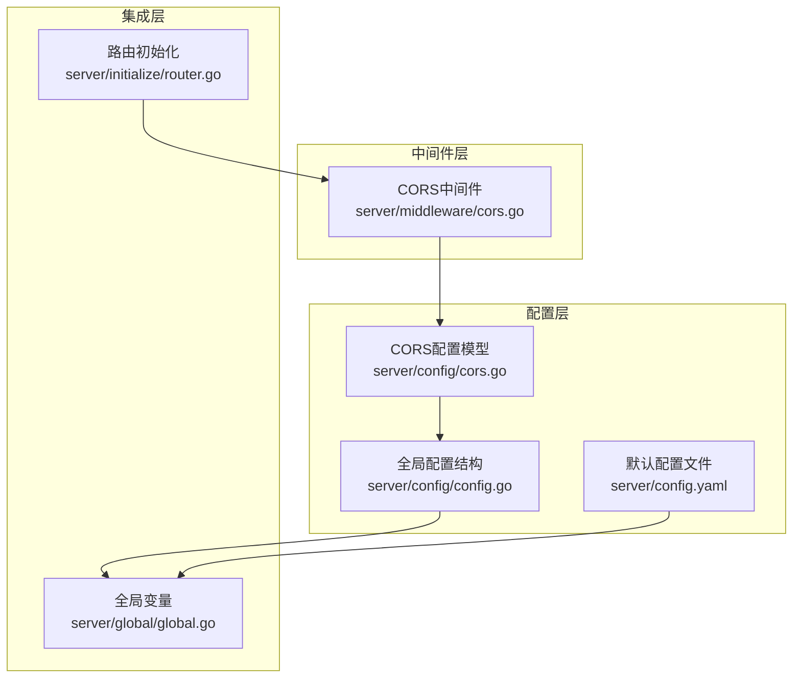
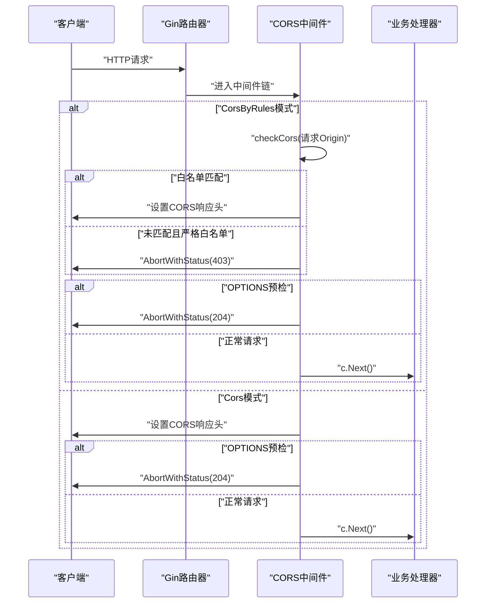
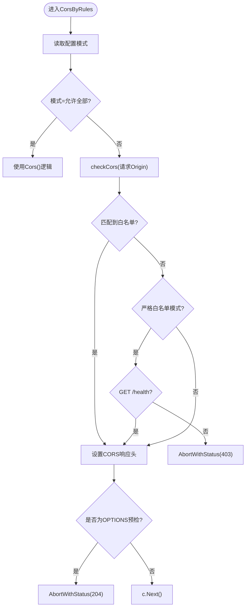
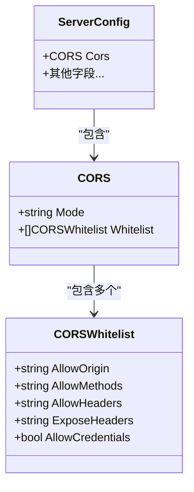
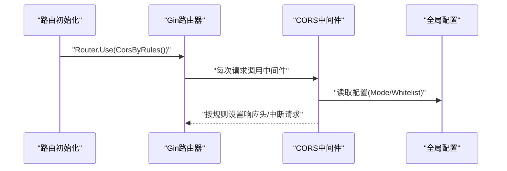
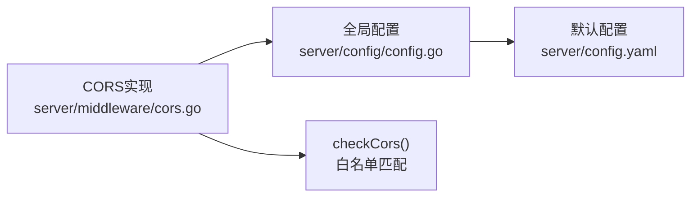

# CORS跨域中间件

<cite>
**本文档引用的文件**
- [server/middleware/cors.go](file://server/middleware/cors.go)
- [server/config/cors.go](file://server/config/cors.go)
- [server/config/config.go](file://server/config/config.go)
- [server/config.yaml](file://server/config.yaml)
- [server/initialize/router.go](file://server/initialize/router.go)
- [server/global/global.go](file://server/global/global.go)
</cite>

## 目录
1. [简介](#简介)
2. [项目结构](#项目结构)
3. [核心组件](#核心组件)
4. [架构总览](#架构总览)
5. [详细组件分析](#详细组件分析)
6. [依赖关系分析](#依赖关系分析)
7. [性能考量](#性能考量)
8. [故障排除指南](#故障排除指南)
9. [结论](#结论)
10. [附录](#附录)

## 简介
本文件面向 Gin-Vue-Admin 项目的 CORS（跨域资源共享）中间件，系统性阐述其工作原理、安全考量与实现策略。重点对比并解释两个核心函数：`Cors()` 与 `CorsByRules()` 的不同实现与适用场景；明确白名单模式、严格白名单模式与允许全部模式的区别；给出配置示例与最佳实践，涵盖允许的源、方法、头部与凭据的正确设置；阐明 OPTIONS 预检请求的处理机制以及 `AbortWithStatus` 的使用时机。

## 项目结构
CORS 相关代码主要分布在以下模块：
- 中间件层：`server/middleware/cors.go` 提供 CORS 中间件实现
- 配置模型：`server/config/cors.go` 定义 CORS 配置结构
- 全局配置：`server/config/config.go` 在全局配置中嵌入 CORS
- 默认配置：`server/config.yaml` 提供默认 CORS 配置示例
- 路由集成：`server/initialize/router.go` 展示如何启用 CORS 中间件
- 全局变量：`server/global/global.go` 提供全局配置访问

**图表来源**
- [server/middleware/cors.go:1-74](file://server/middleware/cors.go#L1-L74)
- [server/config/cors.go:1-15](file://server/config/cors.go#L1-L15)
- [server/config/config.go:35-36](file://server/config/config.go#L35-L36)
- [server/config.yaml:264-279](file://server/config.yaml#L264-L279)
- [server/initialize/router.go:56-58](file://server/initialize/router.go#L56-L58)
- [server/global/global.go:31](file://server/global/global.go#L31)

**章节来源**
- [server/middleware/cors.go:1-74](file://server/middleware/cors.go#L1-L74)
- [server/config/cors.go:1-15](file://server/config/cors.go#L1-L15)
- [server/config/config.go:35-36](file://server/config/config.go#L35-L36)
- [server/config.yaml:264-279](file://server/config.yaml#L264-L279)
- [server/initialize/router.go:56-58](file://server/initialize/router.go#L56-L58)
- [server/global/global.go:31](file://server/global/global.go#L31)

## 核心组件
- CORS 中间件函数
  - `Cors()`：直接放行所有跨域请求，对所有 OPTIONS 方法返回预检结果，不进行白名单校验。
  - `CorsByRules()`：根据配置决定放行策略，支持三种模式：允许全部、白名单模式、严格白名单模式。
- CORS 配置模型
  - `CORS`：包含放行模式与白名单列表。
  - `CORSWhitelist`：定义每个白名单条目的允许源、方法、头部、暴露头部与凭据开关。
- 全局配置与默认配置
  - 全局配置结构中嵌入 CORS 字段，便于在运行时读取。
  - 默认配置文件提供示例，展示如何配置放行模式与多个白名单条目。

**章节来源**
- [server/middleware/cors.go:10-28](file://server/middleware/cors.go#L10-L28)
- [server/middleware/cors.go:30-63](file://server/middleware/cors.go#L30-L63)
- [server/config/cors.go:3-14](file://server/config/cors.go#L3-L14)
- [server/config/config.go:35-36](file://server/config/config.go#L35-L36)
- [server/config.yaml:264-279](file://server/config.yaml#L264-L279)

## 架构总览
CORS 中间件在 Gin 路由器中作为全局中间件运行，拦截每个 HTTP 请求，依据配置决定是否添加 CORS 响应头，以及是否中断请求（例如 OPTIONS 预检或严格白名单拒绝）。

**图表来源**
- [server/middleware/cors.go:11-27](file://server/middleware/cors.go#L11-L27)
- [server/middleware/cors.go:31-62](file://server/middleware/cors.go#L31-L62)

## 详细组件分析

### 函数实现对比：Cors() vs CorsByRules()

- Cors()
  - 直接从请求头读取 Origin 并回写到 `Access-Control-Allow-Origin`。
  - 设置通用的允许头部、方法、暴露头部，并允许凭据。
  - 对所有 OPTIONS 方法直接返回预检结果，不进行任何白名单检查。
  - 适合开发环境或对安全性要求不高的场景。

- CorsByRules()
  - 首先判断配置模式：
    - 允许全部：等同于 `Cors()`。
    - 白名单模式：仅对匹配白名单的请求设置 CORS 头，但对所有 OPTIONS 方法仍放行。
    - 严格白名单模式：仅对匹配白名单的请求设置 CORS 头；未匹配且非健康检查路径的请求直接拒绝。
  - 通过 `checkCors()` 在白名单列表中查找匹配项，返回对应配置。
  - 对 OPTIONS 预检请求统一返回预检结果，确保浏览器可顺利发起后续真实请求。

**图表来源**
- [server/middleware/cors.go:30-63](file://server/middleware/cors.go#L30-L63)
- [server/middleware/cors.go:65-73](file://server/middleware/cors.go#L65-L73)

**章节来源**
- [server/middleware/cors.go:10-28](file://server/middleware/cors.go#L10-L28)
- [server/middleware/cors.go:30-63](file://server/middleware/cors.go#L30-L63)
- [server/middleware/cors.go:65-73](file://server/middleware/cors.go#L65-L73)

### 配置模型与默认配置

- CORS 配置模型
  - `CORS.Mode`：放行模式字符串，支持 "allow-all"、"whitelist"、"strict-whitelist"。
  - `CORS.Whitelist`：白名单条目数组，每项包含允许源、允许方法、允许头部、暴露头部与是否允许凭据。
- 全局配置嵌入
  - 在全局配置结构中嵌入 CORS 字段，便于运行时读取。
- 默认配置示例
  - 默认模式为严格白名单模式，提供多个示例白名单条目，展示如何配置允许源、方法、头部与凭据。

**图表来源**
- [server/config/cors.go:3-14](file://server/config/cors.go#L3-L14)
- [server/config/config.go:35-36](file://server/config/config.go#L35-L36)

**章节来源**
- [server/config/cors.go:3-14](file://server/config/cors.go#L3-L14)
- [server/config/config.go:35-36](file://server/config/config.go#L35-L36)
- [server/config.yaml:264-279](file://server/config.yaml#L264-L279)

### 集成与使用方式

- 在路由初始化中启用 CORS 中间件
  - 可选择启用 `Cors()` 或 `CorsByRules()`，具体取决于部署环境与安全需求。
- 全局配置访问
  - 中间件通过全局变量读取配置，确保配置变更无需重启即可生效（取决于配置加载机制）。

**图表来源**
- [server/initialize/router.go:56-58](file://server/initialize/router.go#L56-L58)
- [server/middleware/cors.go:31-35](file://server/middleware/cors.go#L31-L35)
- [server/global/global.go:31](file://server/global/global.go#L31)

**章节来源**
- [server/initialize/router.go:56-58](file://server/initialize/router.go#L56-L58)
- [server/middleware/cors.go:31-35](file://server/middleware/cors.go#L31-L35)
- [server/global/global.go:31](file://server/global/global.go#L31)

## 依赖关系分析
- 中间件依赖
  - `CorsByRules()` 依赖全局配置中的 CORS 模式与白名单列表。
  - `checkCors()` 依赖全局配置中的白名单数组进行匹配。
- 配置依赖
  - 全局配置结构嵌入 CORS 字段，保证中间件可直接读取。
  - 默认配置文件提供示例，便于快速上手。

**图表来源**
- [server/middleware/cors.go:31-35](file://server/middleware/cors.go#L31-L35)
- [server/middleware/cors.go:65-73](file://server/middleware/cors.go#L65-L73)
- [server/config/config.go:35-36](file://server/config/config.go#L35-L36)
- [server/config.yaml:264-279](file://server/config.yaml#L264-L279)

**章节来源**
- [server/middleware/cors.go:31-35](file://server/middleware/cors.go#L31-L35)
- [server/middleware/cors.go:65-73](file://server/middleware/cors.go#L65-L73)
- [server/config/config.go:35-36](file://server/config/config.go#L35-L36)
- [server/config.yaml:264-279](file://server/config.yaml#L264-L279)

## 性能考量
- 白名单匹配复杂度
  - `checkCors()` 采用线性遍历白名单列表，时间复杂度 O(n)，其中 n 为白名单条目数。
  - 若白名单数量较大，建议：
    - 控制白名单规模，避免过多条目导致匹配开销。
    - 考虑在上游网关或反向代理层进行预过滤。
- OPTIONS 预检缓存
  - 浏览器会缓存预检结果，合理设置 `Access-Control-Max-Age` 可减少重复预检请求（若需要可在中间件中扩展）。
- 中间件位置
  - 将 CORS 中间件置于路由注册之后，避免影响静态资源与 Swagger 文档等公开接口的访问。

[本节为通用性能建议，不直接分析具体文件，故无“章节来源”]

## 故障排除指南
- 问题：浏览器提示跨域失败
  - 检查是否正确启用了 CORS 中间件（参考路由初始化注释）。
  - 确认请求头中包含正确的 Origin。
- 问题：OPTIONS 预检被拒绝
  - 若使用严格白名单模式，确认请求 Origin 是否在白名单中。
  - 注意健康检查路径 `/health` 在严格模式下不会被拒绝。
- 问题：凭据无法使用
  - 确认白名单条目中已启用允许凭据。
  - 确保 `Access-Control-Allow-Origin` 不能为通配符，必须与请求 Origin 匹配。
- 问题：某些方法或头部不可用
  - 在白名单条目中补充允许的方法与头部。
  - 对于自定义头部，需在白名单条目中显式声明。

**章节来源**
- [server/middleware/cors.go:40-57](file://server/middleware/cors.go#L40-L57)
- [server/middleware/cors.go:50-52](file://server/middleware/cors.go#L50-L52)
- [server/config.yaml:264-279](file://server/config.yaml#L264-L279)

## 结论
- `Cors()` 适合开发与低风险场景，实现简单但缺乏细粒度控制。
- `CorsByRules()` 提供灵活的策略选择，推荐在生产环境中使用严格白名单模式以增强安全性。
- 正确配置白名单、允许方法与头部、以及凭据开关，是保障跨域安全与可用性的关键。
- 明确 OPTIONS 预检的处理机制与 `AbortWithStatus` 的使用时机，有助于提升用户体验与调试效率。

[本节为总结性内容，不直接分析具体文件，故无“章节来源”]

## 附录

### 配置示例与最佳实践

- 允许全部模式
  - 适用于开发环境或内部服务间通信，无需维护白名单。
  - 配置要点：将模式设置为允许全部，可省略白名单条目。
  - 安全建议：仅在受控网络内使用，避免暴露给公网。

- 白名单模式
  - 仅对白名单内的源放行，其余请求不设置 CORS 头。
  - 优点：更可控，减少不必要的 CORS 头设置。
  - 适用场景：多子域或多站点协作，但仅允许特定源访问。

- 严格白名单模式
  - 仅对白名单内的源放行，且未匹配的请求直接拒绝。
  - 优点：安全性最高，防止未知源访问。
  - 适用场景：生产环境，对外提供 API 的服务端。

- 允许的源（Origin）
  - 建议精确指定域名，避免使用通配符。
  - 如需支持多子域，可考虑使用正则或在上游网关统一处理。

- 允许的方法（Methods）
  - 常见方法：GET、POST、PUT、DELETE、PATCH、OPTIONS。
  - 仅开放实际使用的 HTTP 方法，避免过度放行。

- 允许的头部（Headers）
  - 常见头部：Content-Type、Authorization、X-Requested-With、X-Token 等。
  - 自定义头部需在白名单条目中显式声明。

- 暴露的头部（Expose-Headers）
  - 用于前端可读取的响应头，如分页信息、令牌刷新头等。
  - 仅暴露必要的头部，避免泄露敏感信息。

- 凭据（Allow-Credentials）
  - 当需要携带 Cookie 或认证头时启用。
  - 启用后 `Access-Control-Allow-Origin` 必须为具体源，不能为通配符。

- OPTIONS 预检请求处理
  - 中间件对所有 OPTIONS 请求直接返回预检结果，确保浏览器可顺利发起后续真实请求。
  - 在严格白名单模式下，未匹配的 OPTIONS 请求也会被放行，以保证预检流程顺畅。

- AbortWithStatus 的使用时机
  - 严格白名单模式下，未匹配的请求直接拒绝（403）。
  - 对所有 OPTIONS 请求返回预检结果（204），避免阻断后续真实请求。

**章节来源**
- [server/middleware/cors.go:10-28](file://server/middleware/cors.go#L10-L28)
- [server/middleware/cors.go:30-63](file://server/middleware/cors.go#L30-L63)
- [server/config.yaml:264-279](file://server/config.yaml#L264-L279)