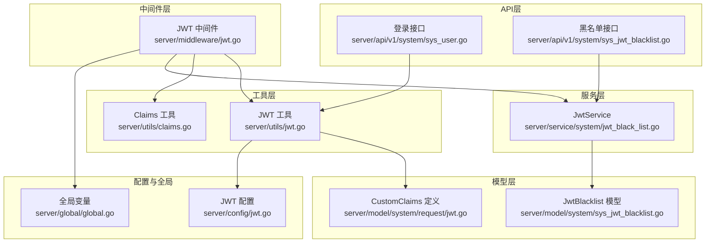
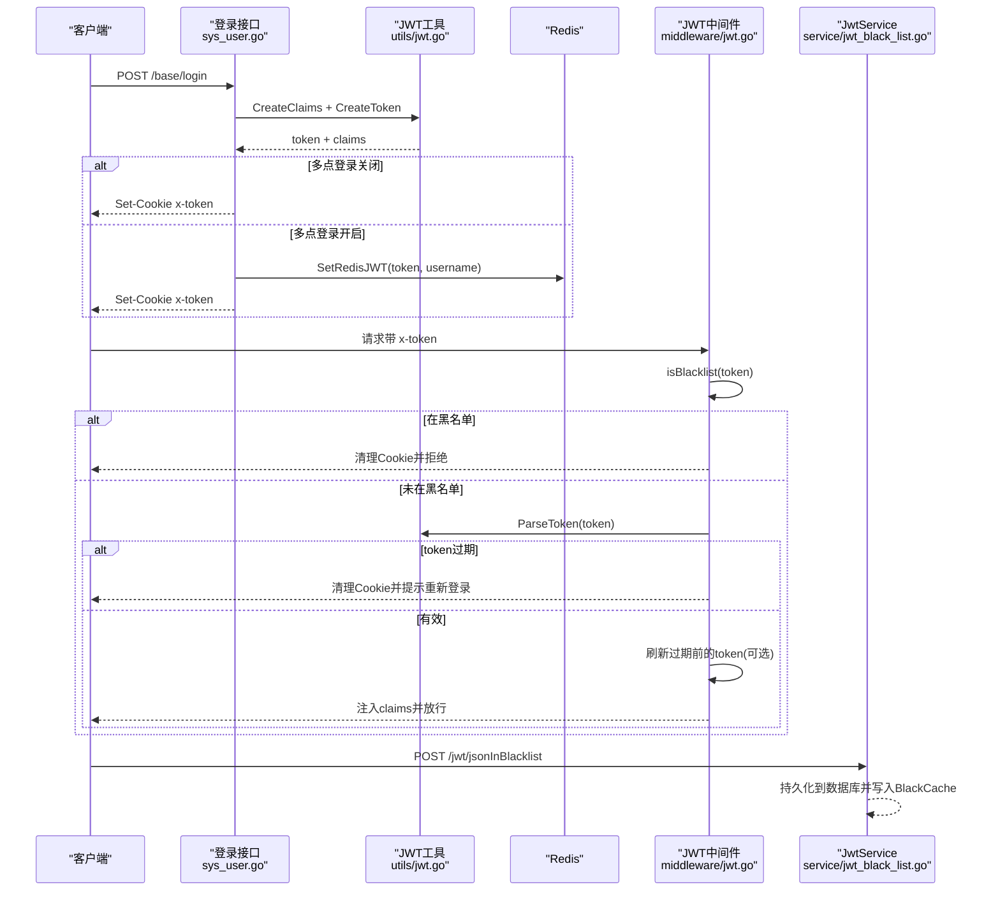
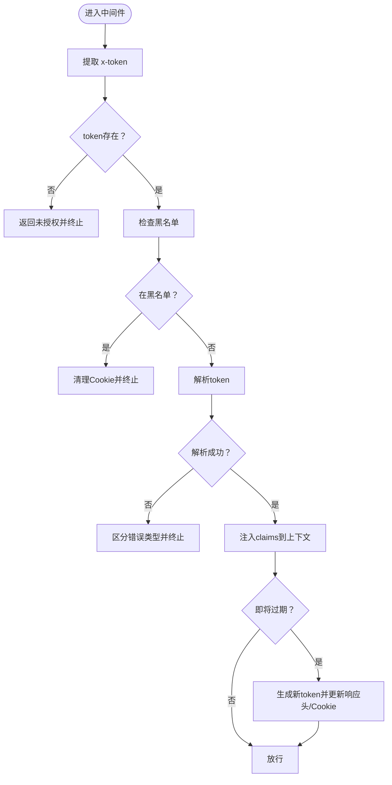
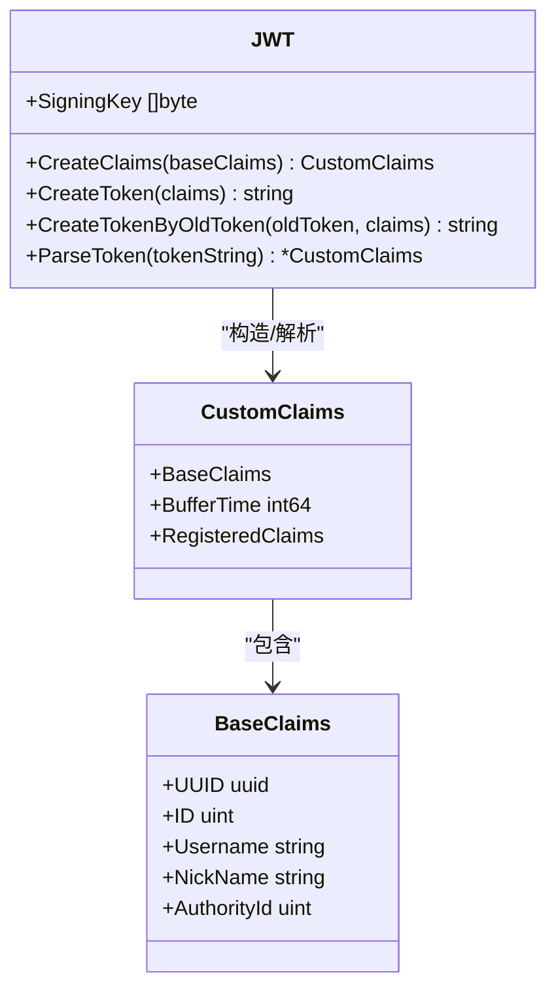
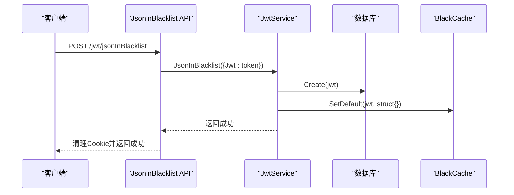
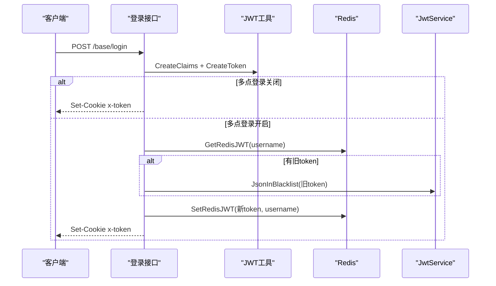
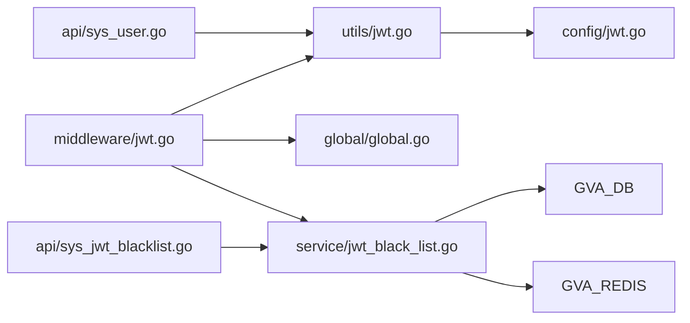

# JWT认证中间件

<cite>
**本文档引用的文件**
- [server/middleware/jwt.go](file://server/middleware/jwt.go)
- [server/utils/jwt.go](file://server/utils/jwt.go)
- [server/utils/claims.go](file://server/utils/claims.go)
- [server/model/system/request/jwt.go](file://server/model/system/request/jwt.go)
- [server/model/system/sys_jwt_blacklist.go](file://server/model/system/sys_jwt_blacklist.go)
- [server/service/system/jwt_black_list.go](file://server/service/system/jwt_black_list.go)
- [server/router/system/sys_jwt.go](file://server/router/system/sys_jwt.go)
- [server/api/v1/system/sys_jwt_blacklist.go](file://server/api/v1/system/sys_jwt_blacklist.go)
- [server/api/v1/system/sys_user.go](file://server/api/v1/system/sys_user.go)
- [server/config/jwt.go](file://server/config/jwt.go)
- [server/global/global.go](file://server/global/global.go)
- [server/main.go](file://server/main.go)
</cite>

## 目录
1. [简介](#简介)
2. [项目结构](#项目结构)
3. [核心组件](#核心组件)
4. [架构总览](#架构总览)
5. [详细组件分析](#详细组件分析)
6. [依赖关系分析](#依赖关系分析)
7. [性能考量](#性能考量)
8. [故障排除指南](#故障排除指南)
9. [结论](#结论)

## 简介
本文件面向 Gin-Vue-Admin 项目的 JWT 认证中间件，系统性阐述基于 JSON Web Token 的认证机制实现，覆盖 token 生成、解析与验证、刷新流程、中间件拦截与上下文注入、黑名单机制、过期处理与安全策略，并提供完整的认证流程示例（登录、token 验证、权限检查协作）。

## 项目结构
围绕 JWT 的关键代码分布在以下模块：
- 中间件层：负责请求拦截、token 解析、黑名单校验、过期刷新与上下文注入
- 工具层：封装 JWT 结构体、claims 定义、token 生成/解析、Redis 存取等
- 服务层：黑名单持久化、Redis 读取与批量加载
- API 层：登录接口、拉黑接口
- 配置与全局：JWT 配置项、全局缓存与并发控制

**图表来源**
- [server/middleware/jwt.go:16-78](file://server/middleware/jwt.go#L16-L78)
- [server/utils/jwt.go:13-106](file://server/utils/jwt.go#L13-L106)
- [server/utils/claims.go:42-65](file://server/utils/claims.go#L42-L65)
- [server/model/system/request/jwt.go:8-22](file://server/model/system/request/jwt.go#L8-L22)
- [server/model/system/sys_jwt_blacklist.go:7-10](file://server/model/system/sys_jwt_blacklist.go#L7-L10)
- [server/service/system/jwt_black_list.go:12-53](file://server/service/system/jwt_black_list.go#L12-L53)
- [server/api/v1/system/sys_user.go:27-161](file://server/api/v1/system/sys_user.go#L27-L161)
- [server/api/v1/system/sys_jwt_blacklist.go:22-33](file://server/api/v1/system/sys_jwt_blacklist.go#L22-L33)
- [server/config/jwt.go:3-9](file://server/config/jwt.go#L3-L9)
- [server/global/global.go:25-42](file://server/global/global.go#L25-L42)

**章节来源**
- [server/middleware/jwt.go:16-78](file://server/middleware/jwt.go#L16-L78)
- [server/utils/jwt.go:13-106](file://server/utils/jwt.go#L13-L106)
- [server/utils/claims.go:42-65](file://server/utils/claims.go#L42-L65)
- [server/model/system/request/jwt.go:8-22](file://server/model/system/request/jwt.go#L8-L22)
- [server/model/system/sys_jwt_blacklist.go:7-10](file://server/model/system/sys_jwt_blacklist.go#L7-L10)
- [server/service/system/jwt_black_list.go:12-53](file://server/service/system/jwt_black_list.go#L12-L53)
- [server/api/v1/system/sys_user.go:27-161](file://server/api/v1/system/sys_user.go#L27-L161)
- [server/api/v1/system/sys_jwt_blacklist.go:22-33](file://server/api/v1/system/sys_jwt_blacklist.go#L22-L33)
- [server/config/jwt.go:3-9](file://server/config/jwt.go#L3-L9)
- [server/global/global.go:25-42](file://server/global/global.go#L25-L42)

## 核心组件
- JWT 中间件：统一拦截请求，提取 token，校验黑名单，解析 claims，注入上下文，必要时刷新 token 并更新响应头与 Cookie
- JWT 工具：封装 HS256 签名、claims 构造、token 生成/解析、并发安全的旧 token 换新 token、Redis 存取
- Claims 工具：从请求上下文解析 claims、获取用户信息、设置/清除 token Cookie
- 黑名单服务：将 token 持久化至数据库并同步到内存缓存，支持批量加载
- 登录 API：完成用户认证后签发 token，并根据多点登录策略处理 Redis 与 Cookie
- 配置与全局：JWT 签名密钥、过期时间、缓冲时间、发行者；并发控制、本地缓存、Redis 客户端

**章节来源**
- [server/middleware/jwt.go:16-78](file://server/middleware/jwt.go#L16-L78)
- [server/utils/jwt.go:13-106](file://server/utils/jwt.go#L13-L106)
- [server/utils/claims.go:42-65](file://server/utils/claims.go#L42-L65)
- [server/service/system/jwt_black_list.go:12-53](file://server/service/system/jwt_black_list.go#L12-L53)
- [server/api/v1/system/sys_user.go:27-161](file://server/api/v1/system/sys_user.go#L27-L161)
- [server/config/jwt.go:3-9](file://server/config/jwt.go#L3-L9)
- [server/global/global.go:25-42](file://server/global/global.go#L25-L42)

## 架构总览
下图展示从客户端到服务端的认证流程，涵盖登录、中间件拦截、token 刷新与黑名单处理：

**图表来源**
- [server/api/v1/system/sys_user.go:102-161](file://server/api/v1/system/sys_user.go#L102-L161)
- [server/utils/jwt.go:48-88](file://server/utils/jwt.go#L48-L88)
- [server/middleware/jwt.go:16-78](file://server/middleware/jwt.go#L16-L78)
- [server/service/system/jwt_black_list.go:22-29](file://server/service/system/jwt_black_list.go#L22-L29)

## 详细组件分析

### JWT 中间件（请求拦截与上下文注入）
- 请求拦截：从请求头或 Cookie 提取 x-token，若为空直接返回未授权
- 黑名单校验：检查 token 是否在内存缓存中，若在则视为失效并清理 Cookie
- 解析与验证：使用 HS256 签名密钥解析 claims，区分过期、签名无效等异常
- 上下文注入：将 claims 放入 gin.Context，供后续处理器使用
- 过期刷新：当剩余有效期小于缓冲时间时，生成新 token，更新响应头与 Cookie，并可选写入 Redis

**图表来源**
- [server/middleware/jwt.go:16-78](file://server/middleware/jwt.go#L16-L78)

**章节来源**
- [server/middleware/jwt.go:16-78](file://server/middleware/jwt.go#L16-L78)

### JWT 工具（token生成、解析与并发控制）
- 结构体与常量：定义 JWT 结构体、错误类型集合
- Claims 构造：设置受众、生效时间、过期时间、发行者，以及缓冲时间
- token 生成：使用 HS256 签名
- 旧 token 换新 token：通过 singleflight 避免并发重复刷新
- token 解析：区分过期、格式错误、签名无效等场景
- Redis 存取：将 token 与用户名关联，设置过期时间

**图表来源**
- [server/utils/jwt.go:13-106](file://server/utils/jwt.go#L13-L106)
- [server/model/system/request/jwt.go:8-22](file://server/model/system/request/jwt.go#L8-L22)

**章节来源**
- [server/utils/jwt.go:13-106](file://server/utils/jwt.go#L13-L106)
- [server/model/system/request/jwt.go:8-22](file://server/model/system/request/jwt.go#L8-L22)

### Claims 工具（上下文解析与用户信息获取）
- 从请求上下文获取 token，优先请求头，其次 Cookie
- 解析 claims 并缓存到上下文，提供便捷方法获取用户 ID、UUID、角色 ID、用户名等
- 设置/清除 Cookie，确保跨域与 IP 场景下的兼容

**章节来源**
- [server/utils/claims.go:42-65](file://server/utils/claims.go#L42-L65)
- [server/utils/claims.go:67-135](file://server/utils/claims.go#L67-L135)

### 黑名单机制（数据库持久化与缓存同步）
- 模型定义：JwtBlacklist 包含主键与 jwt 文本
- 服务层：将 token 写入数据库，同时写入 BlackCache；启动时批量加载
- API：提供将当前 token 拉黑的接口，调用服务层并清理 Cookie

**图表来源**
- [server/api/v1/system/sys_jwt_blacklist.go:22-33](file://server/api/v1/system/sys_jwt_blacklist.go#L22-L33)
- [server/service/system/jwt_black_list.go:22-29](file://server/service/system/jwt_black_list.go#L22-L29)
- [server/model/system/sys_jwt_blacklist.go:7-10](file://server/model/system/sys_jwt_blacklist.go#L7-L10)

**章节来源**
- [server/service/system/jwt_black_list.go:12-53](file://server/service/system/jwt_black_list.go#L12-L53)
- [server/api/v1/system/sys_jwt_blacklist.go:22-33](file://server/api/v1/system/sys_jwt_blacklist.go#L22-L33)
- [server/model/system/sys_jwt_blacklist.go:7-10](file://server/model/system/sys_jwt_blacklist.go#L7-L10)

### 登录流程与多点登录策略
- 登录接口：参数校验、验证码校验、用户认证、记录登录日志
- 签发 token：调用工具层生成 token 与 claims
- 多点登录策略：
  - 关闭：仅设置 Cookie
  - 开启：Redis 存储当前 token，若已有旧 token 则先拉黑旧 token 再写入新 token，并设置 Cookie

**图表来源**
- [server/api/v1/system/sys_user.go:102-161](file://server/api/v1/system/sys_user.go#L102-L161)
- [server/utils/jwt.go:48-52](file://server/utils/jwt.go#L48-L52)

**章节来源**
- [server/api/v1/system/sys_user.go:27-161](file://server/api/v1/system/sys_user.go#L27-L161)

### 配置与全局变量
- JWT 配置：签名密钥、过期时间、缓冲时间、发行者
- 全局变量：数据库、Redis、日志、并发控制、本地缓存、路由信息等

**章节来源**
- [server/config/jwt.go:3-9](file://server/config/jwt.go#L3-L9)
- [server/global/global.go:25-42](file://server/global/global.go#L25-L42)

## 依赖关系分析
- 中间件依赖工具层的 JWT 结构与 claims 解析，依赖全局缓存进行黑名单快速判断
- 工具层依赖配置项决定签名密钥、过期与缓冲时间
- 服务层依赖数据库与 Redis 实现黑名单持久化与多点登录状态管理
- API 层依赖工具层生成 token，依赖服务层处理黑名单与 Redis

**图表来源**
- [server/middleware/jwt.go:16-78](file://server/middleware/jwt.go#L16-L78)
- [server/utils/jwt.go:13-106](file://server/utils/jwt.go#L13-L106)
- [server/global/global.go:25-42](file://server/global/global.go#L25-L42)
- [server/service/system/jwt_black_list.go:12-53](file://server/service/system/jwt_black_list.go#L12-L53)
- [server/api/v1/system/sys_user.go:27-161](file://server/api/v1/system/sys_user.go#L27-L161)
- [server/api/v1/system/sys_jwt_blacklist.go:22-33](file://server/api/v1/system/sys_jwt_blacklist.go#L22-L33)

**章节来源**
- [server/middleware/jwt.go:16-78](file://server/middleware/jwt.go#L16-L78)
- [server/utils/jwt.go:13-106](file://server/utils/jwt.go#L13-L106)
- [server/global/global.go:25-42](file://server/global/global.go#L25-L42)
- [server/service/system/jwt_black_list.go:12-53](file://server/service/system/jwt_black_list.go#L12-L53)
- [server/api/v1/system/sys_user.go:27-161](file://server/api/v1/system/sys_user.go#L27-L161)
- [server/api/v1/system/sys_jwt_blacklist.go:22-33](file://server/api/v1/system/sys_jwt_blacklist.go#L22-L33)

## 性能考量
- 单飞控制：CreateTokenByOldToken 使用 singleflight 避免并发重复刷新，降低数据库与 Redis 压力
- 黑名单缓存：BlackCache 采用本地缓存，命中时 O(1) 判断，减少数据库查询
- 过期刷新策略：仅在接近过期时刷新，避免频繁刷新带来的开销
- 多点登录：Redis 存储当前 token，避免全量扫描，但需注意 Redis 写入成本

[本节为通用性能讨论，无需特定文件来源]

## 故障排除指南
- 未登录或非法访问：中间件检测不到 token 或 Cookie，返回未授权
- 令牌失效：token 在黑名单中或签名无效，清理 Cookie 并提示重新登录
- 登录过期：解析到过期错误，清理 Cookie 并提示重新登录
- 多点登录冲突：开启多点登录时，新登录会拉黑旧 token，旧设备需重新登录
- 验证码错误：登录接口对错误次数进行缓存，频繁错误会被限制

**章节来源**
- [server/middleware/jwt.go:16-78](file://server/middleware/jwt.go#L16-L78)
- [server/utils/jwt.go:63-88](file://server/utils/jwt.go#L63-L88)
- [server/api/v1/system/sys_user.go:27-97](file://server/api/v1/system/sys_user.go#L27-L97)

## 结论
该 JWT 认证中间件通过清晰的职责划分与完善的生命周期管理，实现了安全、高效的认证与授权基础能力。结合黑名单机制、过期刷新与多点登录策略，能够在保证安全性的同时提升用户体验。建议在生产环境中合理配置过期与缓冲时间，并结合前端正确处理响应头中的新 token 与过期时间，确保平滑的认证体验。