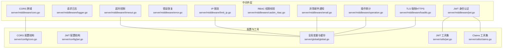
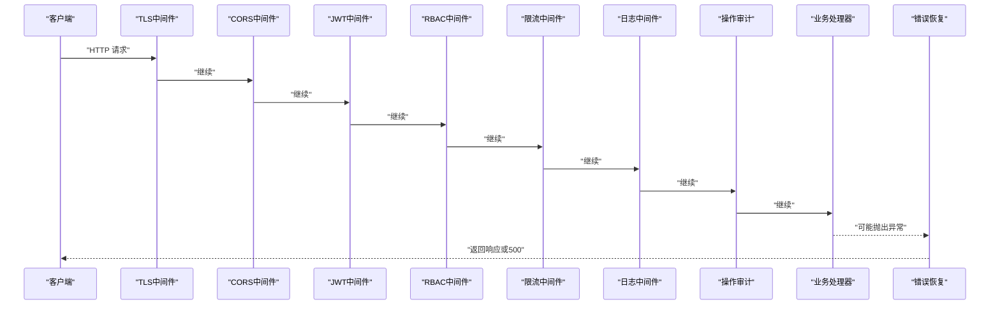
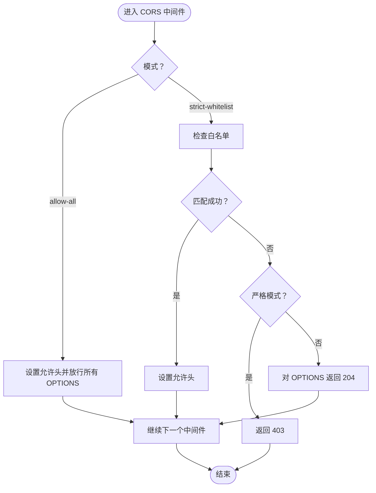
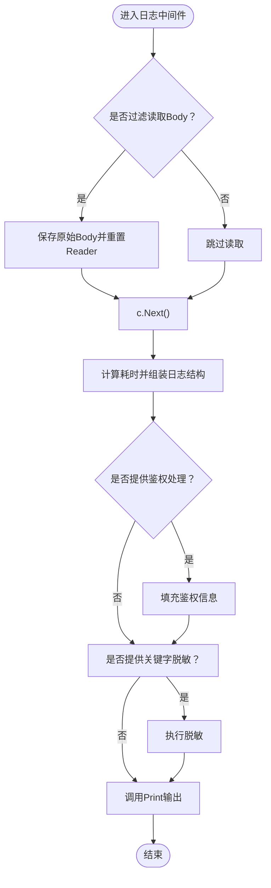
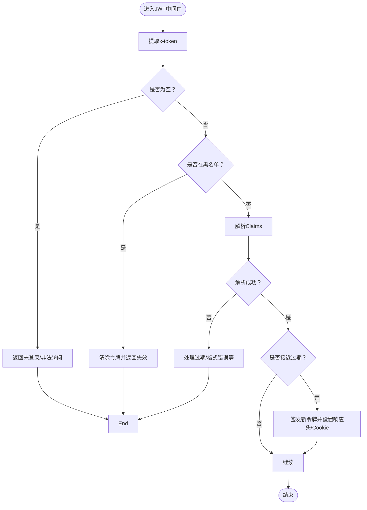
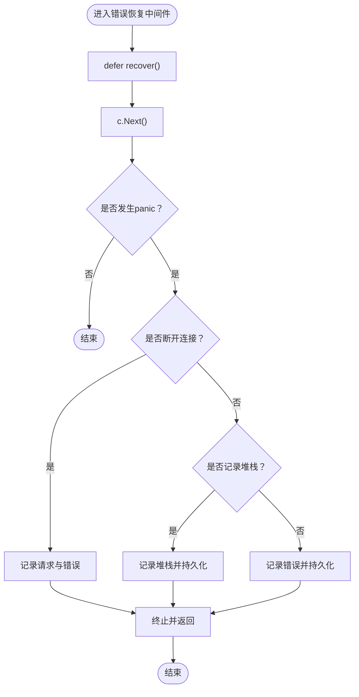
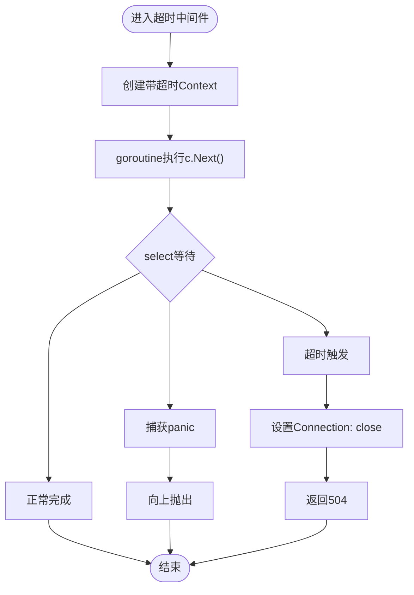
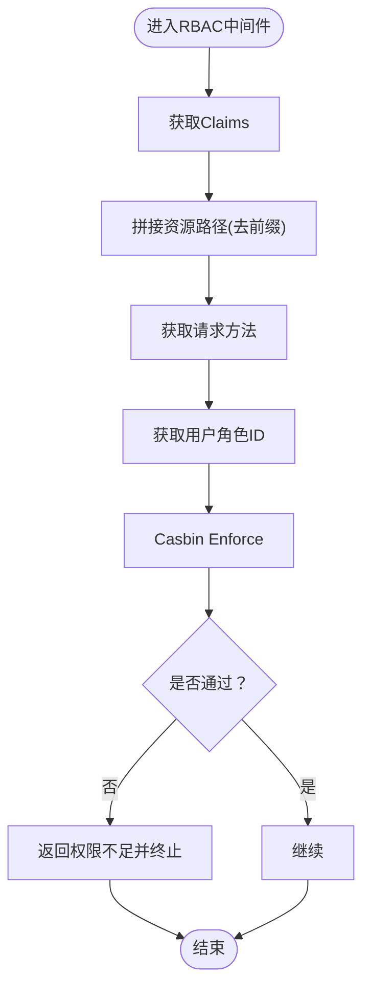
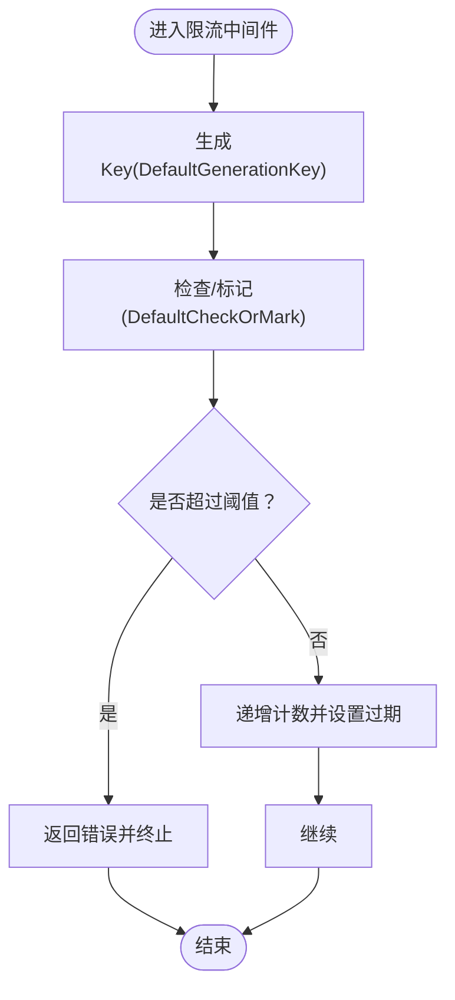
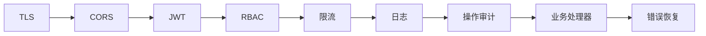

# 中间件系统

<cite>
**本文引用的文件**   
- [server/middleware/cors.go](file://server/middleware/cors.go)
- [server/middleware/logger.go](file://server/middleware/logger.go)
- [server/middleware/jwt.go](file://server/middleware/jwt.go)
- [server/middleware/error.go](file://server/middleware/error.go)
- [server/middleware/timeout.go](file://server/middleware/timeout.go)
- [server/middleware/casbin_rbac.go](file://server/middleware/casbin_rbac.go)
- [server/middleware/limit_ip.go](file://server/middleware/limit_ip.go)
- [server/middleware/email.go](file://server/middleware/email.go)
- [server/middleware/operation.go](file://server/middleware/operation.go)
- [server/middleware/loadtls.go](file://server/middleware/loadtls.go)
- [server/config/cors.go](file://server/config/cors.go)
- [server/config/jwt.go](file://server/config/jwt.go)
- [server/global/global.go](file://server/global/global.go)
- [server/utils/jwt.go](file://server/utils/jwt.go)
- [server/utils/claims.go](file://server/utils/claims.go)
</cite>

## 目录
1. [引言](#引言)
2. [项目结构](#项目结构)
3. [核心组件](#核心组件)
4. [架构总览](#架构总览)
5. [详细组件分析](#详细组件分析)
6. [依赖分析](#依赖分析)
7. [性能考量](#性能考量)
8. [故障排查指南](#故障排查指南)
9. [结论](#结论)
10. [附录](#附录)

## 引言
本文件面向 Gin-Vue-Admin 的中间件体系，系统性阐述 Gin 中间件的执行机制与链式调用原理，解释各核心中间件的实现细节与职责边界，覆盖 CORS 跨域、请求日志、JWT 身份认证、错误恢复、超时控制、RBAC 权限校验、IP 限流、异常邮件通知、操作审计与 TLS 强制 HTTPS 等模块。同时给出中间件开发最佳实践、性能优化建议与常见问题排查思路，帮助开发者在不牺牲安全与可观测性的前提下构建高性能、可维护的 API 层。

## 项目结构
中间件集中位于 server/middleware 目录，按功能拆分独立文件，遵循“单一职责”原则；全局配置与工具类分别位于 server/config 与 server/utils，便于跨中间件共享与复用。

图表来源
- [server/middleware/cors.go:1-74](file://server/middleware/cors.go#L1-L74)
- [server/middleware/logger.go:1-90](file://server/middleware/logger.go#L1-L90)
- [server/middleware/jwt.go:1-90](file://server/middleware/jwt.go#L1-L90)
- [server/middleware/error.go:1-81](file://server/middleware/error.go#L1-L81)
- [server/middleware/timeout.go:1-56](file://server/middleware/timeout.go#L1-L56)
- [server/middleware/casbin_rbac.go:1-33](file://server/middleware/casbin_rbac.go#L1-L33)
- [server/middleware/limit_ip.go:1-93](file://server/middleware/limit_ip.go#L1-L93)
- [server/middleware/email.go:1-59](file://server/middleware/email.go#L1-L59)
- [server/middleware/operation.go:1-130](file://server/middleware/operation.go#L1-L130)
- [server/middleware/loadtls.go:1-28](file://server/middleware/loadtls.go#L1-L28)
- [server/config/cors.go:1-15](file://server/config/cors.go#L1-L15)
- [server/config/jwt.go:1-9](file://server/config/jwt.go#L1-L9)
- [server/global/global.go:1-69](file://server/global/global.go#L1-L69)
- [server/utils/jwt.go:1-106](file://server/utils/jwt.go#L1-L106)
- [server/utils/claims.go:1-149](file://server/utils/claims.go#L1-L149)

章节来源
- [server/middleware/cors.go:1-74](file://server/middleware/cors.go#L1-L74)
- [server/middleware/logger.go:1-90](file://server/middleware/logger.go#L1-L90)
- [server/middleware/jwt.go:1-90](file://server/middleware/jwt.go#L1-L90)
- [server/middleware/error.go:1-81](file://server/middleware/error.go#L1-L81)
- [server/middleware/timeout.go:1-56](file://server/middleware/timeout.go#L1-L56)
- [server/middleware/casbin_rbac.go:1-33](file://server/middleware/casbin_rbac.go#L1-L33)
- [server/middleware/limit_ip.go:1-93](file://server/middleware/limit_ip.go#L1-L93)
- [server/middleware/email.go:1-59](file://server/middleware/email.go#L1-L59)
- [server/middleware/operation.go:1-130](file://server/middleware/operation.go#L1-L130)
- [server/middleware/loadtls.go:1-28](file://server/middleware/loadtls.go#L1-L28)
- [server/config/cors.go:1-15](file://server/config/cors.go#L1-L15)
- [server/config/jwt.go:1-9](file://server/config/jwt.go#L1-L9)
- [server/global/global.go:1-69](file://server/global/global.go#L1-L69)
- [server/utils/jwt.go:1-106](file://server/utils/jwt.go#L1-L106)
- [server/utils/claims.go:1-149](file://server/utils/claims.go#L1-L149)

## 核心组件
- CORS 跨域中间件：支持“放行全部”和“严格白名单”两种模式，按配置动态设置响应头，对 OPTIONS 预检请求快速放行或拒绝。
- 请求日志中间件：统一采集请求路径、参数、Body、IP、UA、耗时、错误、来源等信息，支持自定义过滤、脱敏与鉴权字段补充。
- JWT 身份认证中间件：校验令牌有效性、黑名单、过期与刷新策略，将 Claims 注入上下文，必要时下发新令牌与过期头。
- 错误恢复中间件：捕获 panic 并记录堆栈，区分“断开连接”场景，统一返回 500 并可选持久化错误信息。
- 超时中间件：基于 Context 超时控制，配合 goroutine 与 buffered channel 避免泄漏，超时返回 504。
- RBAC 权限中间件：基于 Casbin 策略引擎，按用户角色、请求路径与方法进行权限判定。
- IP 限流中间件：基于 Redis 的滑动窗口计数限流，默认按客户端 IP 生成键，支持自定义生成与检查逻辑。
- 异常邮件通知中间件：在非 200 响应时，汇总请求与错误信息并通过插件发送邮件。
- 操作审计中间件：记录请求与响应摘要、延迟、错误、用户 ID 等，对大体积响应与下载场景进行裁剪。
- TLS 强制 HTTPS 中间件：使用 secure 库强制跳转 HTTPS，简化 HTTPS 部署。

章节来源
- [server/middleware/cors.go:10-74](file://server/middleware/cors.go#L10-L74)
- [server/middleware/logger.go:14-90](file://server/middleware/logger.go#L14-L90)
- [server/middleware/jwt.go:16-90](file://server/middleware/jwt.go#L16-L90)
- [server/middleware/error.go:20-81](file://server/middleware/error.go#L20-L81)
- [server/middleware/timeout.go:10-56](file://server/middleware/timeout.go#L10-L56)
- [server/middleware/casbin_rbac.go:12-33](file://server/middleware/casbin_rbac.go#L12-L33)
- [server/middleware/limit_ip.go:16-93](file://server/middleware/limit_ip.go#L16-L93)
- [server/middleware/email.go:18-59](file://server/middleware/email.go#L18-L59)
- [server/middleware/operation.go:31-130](file://server/middleware/operation.go#L31-L130)
- [server/middleware/loadtls.go:12-28](file://server/middleware/loadtls.go#L12-L28)

## 架构总览
下图展示请求在中间件链中的典型流转：先进行安全与防护类中间件（TLS、CORS、JWT、RBAC、限流），再进入日志与审计，最后到达业务处理器；异常在任意阶段均可被捕获并恢复。

图表来源
- [server/middleware/loadtls.go:12-28](file://server/middleware/loadtls.go#L12-L28)
- [server/middleware/cors.go:11-28](file://server/middleware/cors.go#L11-L28)
- [server/middleware/jwt.go:16-78](file://server/middleware/jwt.go#L16-L78)
- [server/middleware/casbin_rbac.go:13-32](file://server/middleware/casbin_rbac.go#L13-L32)
- [server/middleware/limit_ip.go:27-62](file://server/middleware/limit_ip.go#L27-L62)
- [server/middleware/logger.go:41-78](file://server/middleware/logger.go#L41-L78)
- [server/middleware/operation.go:31-119](file://server/middleware/operation.go#L31-L119)
- [server/middleware/error.go:21-79](file://server/middleware/error.go#L21-L79)

## 详细组件分析

### CORS 跨域中间件
- 执行机制
  - 放行全部模式：直接设置允许的 Origin、Headers、Methods、Expose-Headers 与 Credentials，并对所有 OPTIONS 请求返回 204。
  - 白名单模式：根据当前 Origin 匹配配置中的 AllowOrigin，仅在匹配成功时设置相应响应头；严格白名单模式下未匹配且非健康检查路径将返回 403；否则对 OPTIONS 快速放行。
- 关键点
  - 通过全局配置对象读取模式与白名单列表，白名单项包含允许的 Origin、Headers、Methods、ExposeHeaders 与 Credentials。
  - 对 OPTIONS 预检请求的处理遵循“先放行后校验”的策略，减少不必要的阻塞。
- 适用场景
  - 开发环境或对外公开 API 的快速放行；生产环境建议使用严格白名单模式并限定允许的方法与头。

图表来源
- [server/middleware/cors.go:30-74](file://server/middleware/cors.go#L30-L74)
- [server/config/cors.go:3-15](file://server/config/cors.go#L3-L15)
- [server/global/global.go:31](file://server/global/global.go#L31)

章节来源
- [server/middleware/cors.go:10-74](file://server/middleware/cors.go#L10-L74)
- [server/config/cors.go:3-15](file://server/config/cors.go#L3-L15)
- [server/global/global.go:31](file://server/global/global.go#L31)

### 请求日志中间件
- 执行机制
  - 在请求进入后记录开始时间与原始 Body（可选过滤），调用 c.Next() 执行后续中间件与业务逻辑。
  - 请求完成后计算耗时，组装日志结构体，支持自定义过滤器、关键字脱敏与鉴权信息填充，最终通过 Print 输出。
- 关键点
  - 通过 Filter 控制是否读取原始 Body，避免对大请求体造成额外 IO。
  - 支持 AuthProcess 注入用户信息，FilterKeyword 实现敏感字段脱敏。
- 适用场景
  - 生产环境统一日志格式，便于集中采集与检索；可结合 k8s stdout 收集。

图表来源
- [server/middleware/logger.go:41-90](file://server/middleware/logger.go#L41-L90)

章节来源
- [server/middleware/logger.go:14-90](file://server/middleware/logger.go#L14-L90)

### JWT 身份认证中间件
- 执行机制
  - 从 Header 或 Cookie 提取 x-token，若缺失则返回“未登录或非法访问”，并终止链路。
  - 检查令牌是否在黑名单缓存中，若是则清除令牌并返回“异地登录或令牌失效”。
  - 使用 JWT 工具解析 Claims，处理过期、格式错误等异常分支。
  - 若距离过期时间小于缓冲阈值，则签发新令牌并设置响应头与 Cookie；支持多点登录场景下的 Redis 记录。
  - 将 Claims 注入上下文，供后续中间件与业务使用。
- 关键点
  - 使用全局配置的签名密钥与过期时间；缓冲时间用于提前刷新。
  - 通过单 flight 避免并发刷新导致的重复签发。
- 适用场景
  - 需要鉴权保护的接口；建议与 RBAC 结合使用。

图表来源
- [server/middleware/jwt.go:16-90](file://server/middleware/jwt.go#L16-L90)
- [server/utils/jwt.go:26-88](file://server/utils/jwt.go#L26-L88)
- [server/utils/claims.go:42-65](file://server/utils/claims.go#L42-L65)
- [server/global/global.go:40](file://server/global/global.go#L40)

章节来源
- [server/middleware/jwt.go:16-90](file://server/middleware/jwt.go#L16-L90)
- [server/utils/jwt.go:26-88](file://server/utils/jwt.go#L26-L88)
- [server/utils/claims.go:42-65](file://server/utils/claims.go#L42-L65)
- [server/global/global.go:40](file://server/global/global.go#L40)

### 错误恢复中间件
- 执行机制
  - 使用 defer + recover 捕获 panic；区分“断开管道”错误（如 Broken Pipe）与一般异常。
  - 对断开场景仅记录错误与请求摘要，不写回响应；对一般异常记录请求详情与堆栈（可选），并持久化错误信息。
  - 最终返回 500，并终止后续处理。
- 关键点
  - 通过配置决定是否记录堆栈；错误信息可落库以便追溯。
- 适用场景
  - 保障服务稳定性，避免崩溃导致的连接泄漏。

图表来源
- [server/middleware/error.go:20-81](file://server/middleware/error.go#L20-L81)

章节来源
- [server/middleware/error.go:20-81](file://server/middleware/error.go#L20-L81)

### 超时控制中间件
- 执行机制
  - 为请求上下文设置超时，启动 goroutine 执行 c.Next()，使用 buffered channel 与 panicChan 避免 goroutine 泄漏。
  - 若在超时前完成，正常返回；若超时触发，设置 Connection: close 并返回 504。
- 关键点
  - 使用带缓冲的 channel 保证并发安全；注意服务器层超时设置需与业务超时协调。
- 适用场景
  - 防止慢请求占用资源；对下游依赖（数据库、缓存、外部服务）进行兜底。

图表来源
- [server/middleware/timeout.go:10-56](file://server/middleware/timeout.go#L10-L56)

章节来源
- [server/middleware/timeout.go:10-56](file://server/middleware/timeout.go#L10-L56)

### RBAC 权限中间件
- 执行机制
  - 从上下文获取 Claims，拼接资源路径（去除路由前缀），读取请求方法，获取用户角色 ID。
  - 使用 Casbin 引擎进行 Enforce 判定，失败则返回“权限不足”并终止。
- 关键点
  - 资源路径需与路由前缀配置一致；角色 ID 来源于 JWT Claims。
- 适用场景
  - 需要细粒度权限控制的接口；建议与 JWT 一起使用。

图表来源
- [server/middleware/casbin_rbac.go:12-33](file://server/middleware/casbin_rbac.go#L12-L33)

章节来源
- [server/middleware/casbin_rbac.go:12-33](file://server/middleware/casbin_rbac.go#L12-L33)

### IP 限流中间件
- 执行机制
  - 通过 LimitConfig 定义生成键、检查/标记逻辑、过期时间与限流阈值。
  - 默认键生成规则为“GVA_Limit + 客户端IP”，默认检查逻辑基于 Redis 实现滑动窗口计数。
  - 当超过阈值时返回错误码与提示；否则递增计数并设置过期。
- 关键点
  - 依赖全局 Redis 客户端；使用事务管道保证原子性。
- 适用场景
  - 防刷、防暴力破解、保护敏感接口。

图表来源
- [server/middleware/limit_ip.go:16-93](file://server/middleware/limit_ip.go#L16-L93)

章节来源
- [server/middleware/limit_ip.go:16-93](file://server/middleware/limit_ip.go#L16-L93)
- [server/global/global.go:28](file://server/global/global.go#L28)

### 异常邮件通知中间件
- 执行机制
  - 优先从 Claims 获取用户名，否则从请求头 x-user-id 查询用户表；读取请求 Body 并重置 Reader。
  - 在 c.Next() 后统计耗时与状态码，若非 200 则构造主题与正文并通过插件发送邮件。
- 关键点
  - 对异常响应进行告警，便于快速定位问题。
- 适用场景
  - 敏感接口异常监控与告警。

章节来源
- [server/middleware/email.go:18-59](file://server/middleware/email.go#L18-L59)

### 操作审计中间件
- 执行机制
  - 对非 GET 请求读取 Body 并重置 Reader；GET 请求解析 Query 参数为 JSON 字符串。
  - 从 Claims 或请求头 x-user-id 获取用户 ID；对 multipart/form-data 或超长响应进行裁剪。
  - 包装 ResponseWriter 捕获响应体，记录状态码、耗时、错误信息与响应内容。
  - 将审计记录写入数据库。
- 关键点
  - 使用 sync.Pool 与固定缓冲区降低内存分配；对下载场景进行特殊处理。
- 适用场景
  - 合规审计、问题回溯与性能分析。

章节来源
- [server/middleware/operation.go:31-130](file://server/middleware/operation.go#L31-L130)

### TLS 强制 HTTPS 中间件
- 执行机制
  - 使用 secure 库启用 SSL 重定向与主机限制；若处理失败则打印错误并短路。
  - 成功后继续链路。
- 关键点
  - 适合在反向代理之后启用，确保仅接收 HTTPS 请求。
- 适用场景
  - 生产环境强制 HTTPS。

章节来源
- [server/middleware/loadtls.go:12-28](file://server/middleware/loadtls.go#L12-L28)

## 依赖分析
- 中间件之间的耦合
  - 安全与防护类中间件（TLS、CORS、JWT、RBAC、限流）通常置于链路前端，负责鉴权、校验与准入。
  - 观察与审计类中间件（日志、操作审计、异常邮件）位于链路中部，负责数据采集与告警。
  - 业务处理结束后由错误恢复中间件兜底。
- 外部依赖
  - Redis：限流与 JWT 黑名单缓存。
  - Casbin：RBAC 权限判定。
  - JWT 库：令牌解析与签发。
  - secure：TLS/HTTPS 强制。
- 循环依赖
  - 中间件之间无直接循环依赖，通过 Gin 的 Next/Abort 机制解耦。

图表来源
- [server/middleware/loadtls.go:12-28](file://server/middleware/loadtls.go#L12-L28)
- [server/middleware/cors.go:11-28](file://server/middleware/cors.go#L11-L28)
- [server/middleware/jwt.go:16-78](file://server/middleware/jwt.go#L16-L78)
- [server/middleware/casbin_rbac.go:13-32](file://server/middleware/casbin_rbac.go#L13-L32)
- [server/middleware/limit_ip.go:27-62](file://server/middleware/limit_ip.go#L27-L62)
- [server/middleware/logger.go:41-78](file://server/middleware/logger.go#L41-L78)
- [server/middleware/operation.go:31-119](file://server/middleware/operation.go#L31-L119)
- [server/middleware/error.go:21-79](file://server/middleware/error.go#L21-L79)

章节来源
- [server/middleware/loadtls.go:12-28](file://server/middleware/loadtls.go#L12-L28)
- [server/middleware/cors.go:11-28](file://server/middleware/cors.go#L11-L28)
- [server/middleware/jwt.go:16-78](file://server/middleware/jwt.go#L16-L78)
- [server/middleware/casbin_rbac.go:13-32](file://server/middleware/casbin_rbac.go#L13-L32)
- [server/middleware/limit_ip.go:27-62](file://server/middleware/limit_ip.go#L27-L62)
- [server/middleware/logger.go:41-78](file://server/middleware/logger.go#L41-L78)
- [server/middleware/operation.go:31-119](file://server/middleware/operation.go#L31-L119)
- [server/middleware/error.go:21-79](file://server/middleware/error.go#L21-L79)

## 性能考量
- 中间件顺序优化
  - 将高成本中间件（如 JWT、RBAC、限流）置于链路前端，尽早失败以减少后续处理。
  - 对大请求体与响应体，优先使用日志与审计的过滤与裁剪策略，避免不必要的 IO。
- 资源与并发
  - 使用单 flight 避免并发刷新 JWT 导致的重复签发与缓存竞争。
  - 限流使用 Redis 事务管道保证原子性，减少网络往返。
- 上下文与内存
  - 日志与审计中间件采用固定缓冲与 sync.Pool 降低 GC 压力。
  - 对下载与大响应场景进行裁剪，避免内存峰值。
- 超时与熔断
  - 为下游依赖设置合理超时，防止级联故障；对不可用服务进行快速失败。

## 故障排查指南
- CORS 相关
  - 现象：浏览器跨域失败或预检失败。
  - 排查：确认配置模式与白名单项；严格模式下未匹配会返回 403；检查 Allow-Headers/Allow-Methods 是否包含前端实际请求头与方法。
- JWT 相关
  - 现象：频繁提示“未登录/非法访问”或“异地登录/令牌失效”。
  - 排查：检查 x-token 是否正确传递；确认黑名单缓存是否命中；核对签名密钥、Issuer 与过期时间配置；查看是否触发了自动刷新。
- 权限不足
  - 现象：返回“权限不足”。
  - 排查：确认资源路径去除前缀后的匹配；核对用户角色 ID 与策略规则。
- 限流触发
  - 现象：频繁返回“请求过于频繁”。
  - 排查：确认生成键是否按预期（默认为客户端 IP）；检查 Redis 是否可用；调整过期时间与阈值。
- 超时
  - 现象：返回 504 Gateway Timeout。
  - 排查：检查服务器层超时设置与业务超时是否匹配；优化下游依赖性能。
- 异常邮件
  - 现象：未收到异常邮件。
  - 排查：确认插件配置与收件人；检查非 200 响应路径；查看日志中是否有发送失败记录。
- 操作审计
  - 现象：审计记录缺失或响应体为空。
  - 排查：确认是否为 GET 请求（GET 会解析 Query）；检查 Content-Type 与缓冲区裁剪逻辑。

章节来源
- [server/middleware/cors.go:30-74](file://server/middleware/cors.go#L30-L74)
- [server/middleware/jwt.go:16-90](file://server/middleware/jwt.go#L16-L90)
- [server/middleware/casbin_rbac.go:12-33](file://server/middleware/casbin_rbac.go#L12-L33)
- [server/middleware/limit_ip.go:44-93](file://server/middleware/limit_ip.go#L44-L93)
- [server/middleware/timeout.go:10-56](file://server/middleware/timeout.go#L10-L56)
- [server/middleware/email.go:18-59](file://server/middleware/email.go#L18-L59)
- [server/middleware/operation.go:31-130](file://server/middleware/operation.go#L31-L130)

## 结论
本中间件体系以“安全前置、可观测中置、兜底后置”为设计原则，通过清晰的职责划分与可配置策略，实现了跨域、鉴权、权限、限流、日志、审计、错误恢复与 HTTPS 强制等能力的有机组合。遵循本文最佳实践与性能优化建议，可在保证安全性与可维护性的前提下，显著提升系统的稳定性与可观测性。

## 附录
- 中间件开发最佳实践
  - 明确职责：每个中间件只做一件事，避免“万能中间件”。
  - 顺序合理：将高成本与高失败率的中间件前置，尽早失败。
  - 可配置：将策略（如白名单、阈值、过期时间）下沉至配置文件。
  - 可观测：统一日志结构，支持脱敏与关键字过滤；对异常进行告警。
  - 并发安全：对共享资源使用单 flight、互斥锁或无锁结构。
  - 资源回收：及时释放 goroutine、channel 与缓冲区；避免内存泄漏。
  - 错误处理：区分业务错误与系统错误，统一返回格式；对不可恢复异常进行恢复与记录。
- 请求生命周期与数据传递
  - 请求进入后依次经过中间件链，每个中间件可读取与修改上下文（如设置 Claims、用户 ID）。
  - 通过 c.Next() 传递控制权，c.Abort() 可中断后续处理。
  - 响应阶段可通过中间件包装 ResponseWriter 捕获响应体，用于审计与日志。