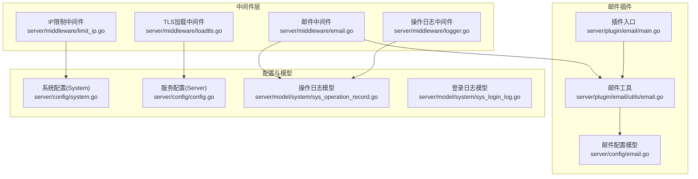
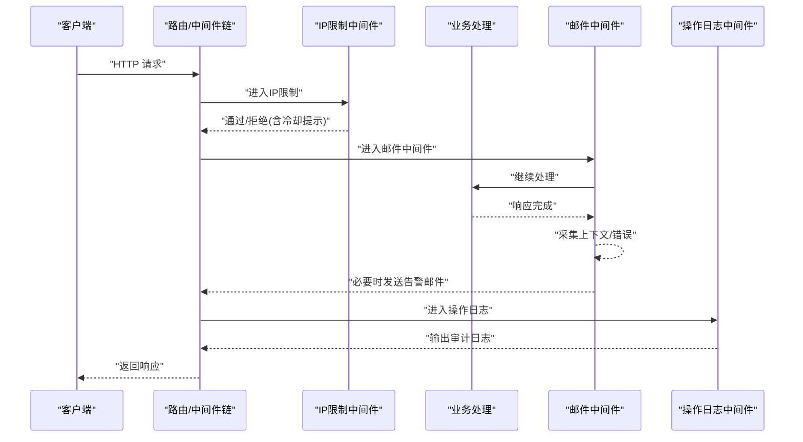
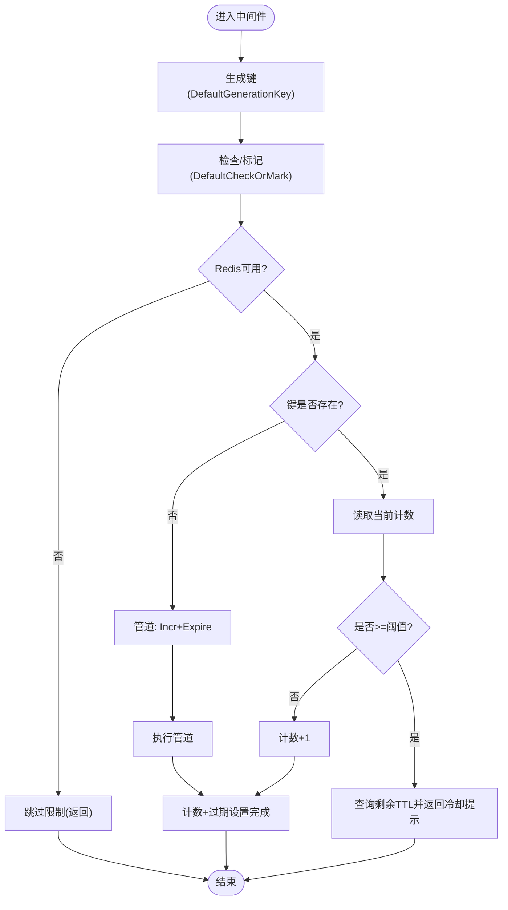
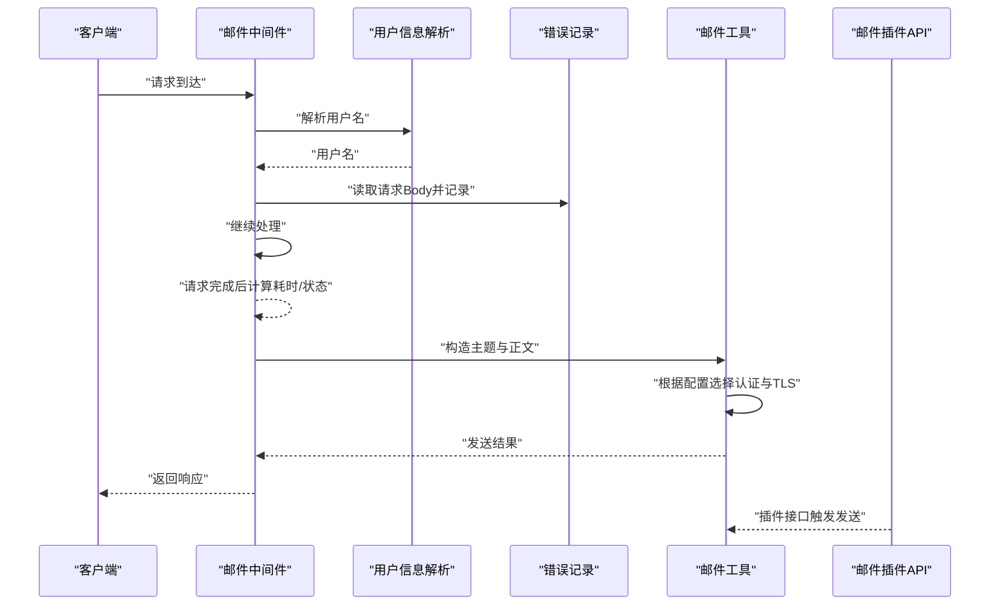
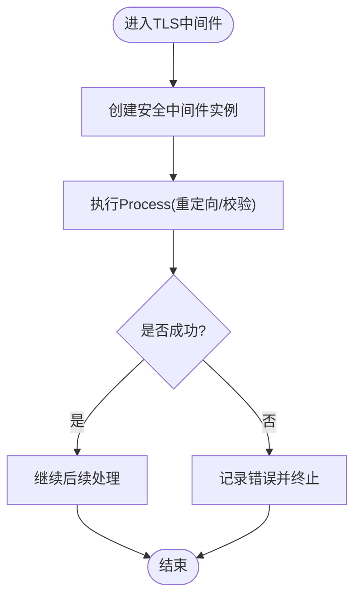
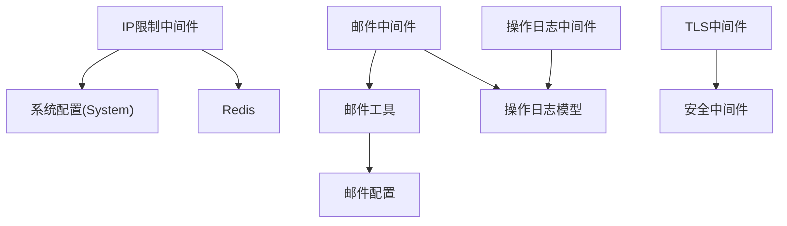

# 其他安全中间件

<cite>
**本文引用的文件**
- [server/middleware/limit_ip.go](file://server/middleware/limit_ip.go)
- [server/middleware/email.go](file://server/middleware/email.go)
- [server/middleware/loadtls.go](file://server/middleware/loadtls.go)
- [server/middleware/logger.go](file://server/middleware/logger.go)
- [server/plugin/email/utils/email.go](file://server/plugin/email/utils/email.go)
- [server/plugin/email/main.go](file://server/plugin/email/main.go)
- [server/config/email.go](file://server/config/email.go)
- [server/config/system.go](file://server/config/system.go)
- [server/config/config.go](file://server/config/config.go)
- [server/model/system/sys_operation_record.go](file://server/model/system/sys_operation_record.go)
- [server/model/system/sys_login_log.go](file://server/model/system/sys_login_log.go)
- [server/docs/swagger.json](file://server/docs/swagger.json)
</cite>

## 目录
1. [简介](#简介)
2. [项目结构](#项目结构)
3. [核心组件](#核心组件)
4. [架构总览](#架构总览)
5. [详细组件分析](#详细组件分析)
6. [依赖分析](#依赖分析)
7. [性能考量](#性能考量)
8. [故障排查指南](#故障排查指南)
9. [结论](#结论)
10. [附录](#附录)

## 简介
本技术文档聚焦于项目中的“其他安全相关中间件”，涵盖以下能力：
- IP 限制中间件：基于滑动时间窗的频率限制，支持白名单/黑名单扩展点，结合 Redis 实现分布式计数与冷却时间反馈。
- 邮件中间件：在错误发生时自动采集请求上下文并发送告警邮件；配套邮件插件提供发送测试邮件与发送邮件的接口。
- TLS 加载中间件：通过安全中间件强制 HTTPS 重定向与主机校验，提升传输层安全性。
- 操作日志中间件：统一采集请求路径、参数、耗时、错误等信息，支持过滤、脱敏与自定义输出。

## 项目结构
围绕安全中间件的相关模块分布如下：
- 中间件层：IP 限制、邮件告警、TLS 强制、通用日志
- 邮件插件：配置、工具、API、服务与全局配置
- 配置层：系统与邮件配置项
- 模型层：操作日志与登录日志实体
- 文档层：Swagger 对邮件接口的定义



**图示来源**
- [server/middleware/limit_ip.go:1-93](file://server/middleware/limit_ip.go#L1-L93)
- [server/middleware/email.go:1-59](file://server/middleware/email.go#L1-L59)
- [server/middleware/loadtls.go:1-28](file://server/middleware/loadtls.go#L1-L28)
- [server/middleware/logger.go:1-90](file://server/middleware/logger.go#L1-L90)
- [server/plugin/email/main.go:1-30](file://server/plugin/email/main.go#L1-L30)
- [server/plugin/email/utils/email.go:1-123](file://server/plugin/email/utils/email.go#L1-L123)
- [server/config/email.go:1-13](file://server/config/email.go#L1-L13)
- [server/config/system.go:1-16](file://server/config/system.go#L1-L16)
- [server/config/config.go:1-41](file://server/config/config.go#L1-L41)
- [server/model/system/sys_operation_record.go:1-25](file://server/model/system/sys_operation_record.go#L1-L25)
- [server/model/system/sys_login_log.go:1-17](file://server/model/system/sys_login_log.go#L1-L17)

**章节来源**
- [server/middleware/limit_ip.go:1-93](file://server/middleware/limit_ip.go#L1-L93)
- [server/middleware/email.go:1-59](file://server/middleware/email.go#L1-L59)
- [server/middleware/loadtls.go:1-28](file://server/middleware/loadtls.go#L1-L28)
- [server/middleware/logger.go:1-90](file://server/middleware/logger.go#L1-L90)
- [server/plugin/email/main.go:1-30](file://server/plugin/email/main.go#L1-L30)
- [server/plugin/email/utils/email.go:1-123](file://server/plugin/email/utils/email.go#L1-L123)
- [server/config/email.go:1-13](file://server/config/email.go#L1-L13)
- [server/config/system.go:1-16](file://server/config/system.go#L1-L16)
- [server/config/config.go:1-41](file://server/config/config.go#L1-L41)
- [server/model/system/sys_operation_record.go:1-25](file://server/model/system/sys_operation_record.go#L1-L25)
- [server/model/system/sys_login_log.go:1-17](file://server/model/system/sys_login_log.go#L1-L17)

## 核心组件
- IP 限制中间件：提供滑动时间窗的频率限制，默认按客户端 IP 生成键，周期内累计请求次数，超过阈值时返回剩余冷却时间，依赖 Redis 实现分布式计数。
- 邮件中间件：在请求结束后根据状态码与错误信息，自动采集请求上下文并通过邮件插件发送告警。
- TLS 加载中间件：通过安全中间件强制 HTTPS 重定向与主机校验，保障传输安全。
- 操作日志中间件：统一采集请求路径、参数、耗时、错误等信息，支持过滤、脱敏与自定义输出，便于审计与问题定位。

**章节来源**
- [server/middleware/limit_ip.go:16-62](file://server/middleware/limit_ip.go#L16-L62)
- [server/middleware/email.go:18-58](file://server/middleware/email.go#L18-L58)
- [server/middleware/loadtls.go:12-27](file://server/middleware/loadtls.go#L12-L27)
- [server/middleware/logger.go:28-89](file://server/middleware/logger.go#L28-L89)

## 架构总览
下图展示了各中间件在请求生命周期中的协作关系与数据流：



**图示来源**
- [server/middleware/limit_ip.go:27-37](file://server/middleware/limit_ip.go#L27-L37)
- [server/middleware/email.go:18-58](file://server/middleware/email.go#L18-L58)
- [server/middleware/logger.go:41-78](file://server/middleware/logger.go#L41-L78)

## 详细组件分析

### IP 限制中间件
- 设计要点
  - 提供可插拔的键生成与检查/标记函数，支持自定义业务键与策略。
  - 默认按客户端 IP 生成键，使用 Redis 实现滑动时间窗计数，首次访问原子性设置过期时间并自增。
  - 当超过阈值时返回剩余冷却时间，避免暴力刷接口。
  - 依赖 Redis 可用性，若未配置 Redis 则不生效。
- 配置参数
  - System.iplimit-count：周期内允许的最大请求次数
  - System.iplimit-time：统计周期（秒）



**图示来源**
- [server/middleware/limit_ip.go:44-53](file://server/middleware/limit_ip.go#L44-L53)
- [server/middleware/limit_ip.go:65-92](file://server/middleware/limit_ip.go#L65-L92)

**章节来源**
- [server/middleware/limit_ip.go:16-62](file://server/middleware/limit_ip.go#L16-L62)
- [server/middleware/limit_ip.go:44-53](file://server/middleware/limit_ip.go#L44-L53)
- [server/middleware/limit_ip.go:65-92](file://server/middleware/limit_ip.go#L65-L92)
- [server/config/system.go:8-9](file://server/config/system.go#L8-L9)

- 白名单/黑名单机制
  - 通过 LimitConfig 的 GenerationKey 与 CheckOrMark 可扩展为基于用户 ID、API 路径或自定义维度的白名单/黑名单策略。
  - 建议在 CheckOrMark 中加入对白名单/黑名单集合的判定逻辑，优先放行白名单、拒绝黑名单。

- DDoS 防护策略
  - 结合滑动时间窗与冷却提示，可有效抑制突发流量。
  - 建议配合上游网关或 WAF 进行更细粒度的速率限制与封禁。

### 邮件中间件
- 功能概述
  - 在请求结束后，若状态码非 200，则采集请求上下文（IP、方法、路径、UA、Body、耗时、错误）并发送告警邮件。
  - 支持从 JWT 声明或请求头中解析用户信息，用于邮件主题与内容。
- 配套插件
  - 邮件插件提供发送测试邮件与发送邮件的接口，便于验证与使用。
  - 插件通过全局配置加载 SMTP 参数（收件人、发件人、主机、端口、SSL、认证方式等）。



**图示来源**
- [server/middleware/email.go:18-58](file://server/middleware/email.go#L18-L58)
- [server/plugin/email/utils/email.go:31-37](file://server/plugin/email/utils/email.go#L31-L37)
- [server/plugin/email/main.go:23-29](file://server/plugin/email/main.go#L23-L29)

**章节来源**
- [server/middleware/email.go:18-58](file://server/middleware/email.go#L18-L58)
- [server/plugin/email/utils/email.go:20-88](file://server/plugin/email/utils/email.go#L20-L88)
- [server/plugin/email/main.go:11-21](file://server/plugin/email/main.go#L11-L21)
- [server/config/email.go:3-12](file://server/config/email.go#L3-L12)
- [server/docs/swagger.json:4972-5155](file://server/docs/swagger.json#L4972-L5155)

- 邮件发送验证与内容过滤
  - 发送验证：插件提供发送测试邮件接口，便于在部署阶段验证 SMTP 配置正确性。
  - 内容过滤：可在中间件或日志层对敏感字段进行脱敏处理（如密码、令牌），避免泄露。

### TLS 加载中间件
- 功能概述
  - 通过安全中间件强制 HTTPS 重定向与主机校验，提升传输层安全性。
  - 配置包含 SSL 重定向开关与目标主机，确保仅通过 HTTPS 访问。
- 证书管理与安全配置
  - 该中间件负责强制 HTTPS，证书的安装与轮换应在反向代理或 Web 服务器层面完成。
  - 建议结合 HSTS、安全响应头等策略进一步加固。



**图示来源**
- [server/middleware/loadtls.go:12-27](file://server/middleware/loadtls.go#L12-L27)

**章节来源**
- [server/middleware/loadtls.go:12-27](file://server/middleware/loadtls.go#L12-L27)
- [server/config/config.go:9](file://server/config/config.go#L9)

### 操作日志中间件
- 功能概述
  - 统一采集请求路径、查询参数、请求体、IP、UA、错误、耗时与来源等信息。
  - 支持自定义过滤器、关键字过滤（脱敏）、鉴权处理与自定义打印输出。
- 审计功能
  - 与操作日志模型配合，可用于用户行为追踪与安全事件记录。
  - 登录日志模型支持记录登录用户名、IP、状态、错误信息与 UA 等关键信息。

```mermaid
classDiagram
class Logger {
+Filter(c) bool
+FilterKeyword(layout) bool
+AuthProcess(c, layout)
+Print(layout)
+Source string
+SetLoggerMiddleware() gin.HandlerFunc
}
class LogLayout {
+Time time.Time
+Metadata map[string]interface{}
+Path string
+Query string
+Body string
+IP string
+UserAgent string
+Error string
+Cost time.Duration
+Source string
}
class SysOperationRecord {
+Ip string
+Method string
+Path string
+Status int
+Latency time.Duration
+Agent string
+ErrorMessage string
+Body string
+Resp string
+UserID int
}
class SysLoginLog {
+Username string
+Ip string
+Status bool
+ErrorMessage string
+Agent string
+UserID uint
}
Logger --> LogLayout : "生成"
Logger --> SysOperationRecord : "审计记录"
SysOperationRecord --> SysLoginLog : "关联用户"
```

**图示来源**
- [server/middleware/logger.go:28-89](file://server/middleware/logger.go#L28-L89)
- [server/model/system/sys_operation_record.go:11-24](file://server/model/system/sys_operation_record.go#L11-L24)
- [server/model/system/sys_login_log.go:7-16](file://server/model/system/sys_login_log.go#L7-L16)

**章节来源**
- [server/middleware/logger.go:28-89](file://server/middleware/logger.go#L28-L89)
- [server/model/system/sys_operation_record.go:11-24](file://server/model/system/sys_operation_record.go#L11-L24)
- [server/model/system/sys_login_log.go:7-16](file://server/model/system/sys_login_log.go#L7-L16)

## 依赖分析
- 组件耦合
  - IP 限制中间件依赖系统配置与 Redis；默认策略依赖 GVA_REDIS 与 GVA_CONFIG。
  - 邮件中间件依赖用户信息解析与操作日志模型；邮件工具依赖插件全局配置。
  - TLS 中间件依赖安全中间件与服务配置。
  - 操作日志中间件独立性强，可通过回调扩展审计字段与输出格式。
- 外部依赖
  - Redis：用于 IP 限制的分布式计数。
  - SMTP：用于邮件告警。
  - 安全中间件：用于强制 HTTPS。



**图示来源**
- [server/middleware/limit_ip.go:55-62](file://server/middleware/limit_ip.go#L55-L62)
- [server/middleware/email.go:18-58](file://server/middleware/email.go#L18-L58)
- [server/middleware/loadtls.go:12-27](file://server/middleware/loadtls.go#L12-L27)
- [server/middleware/logger.go:41-78](file://server/middleware/logger.go#L41-L78)
- [server/config/system.go:8-9](file://server/config/system.go#L8-L9)
- [server/config/email.go:3-12](file://server/config/email.go#L3-L12)

**章节来源**
- [server/middleware/limit_ip.go:55-62](file://server/middleware/limit_ip.go#L55-L62)
- [server/middleware/email.go:18-58](file://server/middleware/email.go#L18-L58)
- [server/middleware/loadtls.go:12-27](file://server/middleware/loadtls.go#L12-L27)
- [server/middleware/logger.go:41-78](file://server/middleware/logger.go#L41-L78)
- [server/config/system.go:8-9](file://server/config/system.go#L8-L9)
- [server/config/email.go:3-12](file://server/config/email.go#L3-L12)

## 性能考量
- IP 限制中间件
  - 使用 Redis 管道减少 RTT；合理设置过期时间与阈值，避免热点键竞争。
  - 对高频接口可采用更短周期与更低阈值，降低缓存压力。
- 邮件中间件
  - 告警邮件仅在异常时触发，避免频繁发送造成 SMTP 压力。
  - 可引入队列异步发送，提高系统稳定性。
- TLS 中间件
  - 强制 HTTPS 会增加一次重定向开销，建议在反向代理层完成证书卸载与加速。
- 操作日志中间件
  - 对大请求体进行过滤或脱敏，减少序列化与输出成本。

## 故障排查指南
- IP 限制不生效
  - 检查 Redis 是否可用与连通性；确认系统配置中的 iplimit-count 与 iplimit-time 是否正确。
  - 查看日志中关于 limit 的错误记录，定位 Redis 操作失败原因。
- 邮件告警未发送
  - 检查邮件插件配置（SMTP 主机、端口、SSL、认证方式）是否正确。
  - 确认收件人列表与发件人凭据；通过发送测试邮件接口验证配置。
  - 查看中间件在异常状态下的错误信息采集是否正常。
- TLS 强制失败
  - 检查安全中间件的 SSLRedirect 与 SSLHost 配置；确认证书安装与域名解析正确。
- 审计日志缺失
  - 确认操作日志中间件已正确挂载；检查过滤器与关键字过滤逻辑是否导致记录被忽略。

**章节来源**
- [server/middleware/limit_ip.go:44-53](file://server/middleware/limit_ip.go#L44-L53)
- [server/plugin/email/utils/email.go:56-88](file://server/plugin/email/utils/email.go#L56-L88)
- [server/middleware/loadtls.go:14-17](file://server/middleware/loadtls.go#L14-L17)
- [server/middleware/logger.go:41-78](file://server/middleware/logger.go#L41-L78)

## 结论
本技术文档梳理了 IP 限制、邮件告警、TLS 强制与操作日志四大安全中间件的实现与集成方式。通过滑动时间窗与 Redis 分布式计数实现有效的频率限制；通过邮件中间件与插件实现异常告警；通过 TLS 中间件强化传输安全；通过操作日志中间件与模型实现审计与追踪。建议在生产环境中结合网关/WAF、严格的证书轮换与日志留存策略，进一步完善整体安全体系。

## 附录
- 配置项参考
  - 系统配置：System.iplimit-count、System.iplimit-time
  - 邮件配置：Email.to、Email.from、Email.host、Email.secret、Email.port、Email.is-ssl、Email.is-loginauth
- 相关接口参考
  - 邮件插件接口：发送测试邮件、发送邮件（Swagger 定义）

**章节来源**
- [server/config/system.go:8-9](file://server/config/system.go#L8-L9)
- [server/config/email.go:3-12](file://server/config/email.go#L3-L12)
- [server/docs/swagger.json:4972-5155](file://server/docs/swagger.json#L4972-L5155)