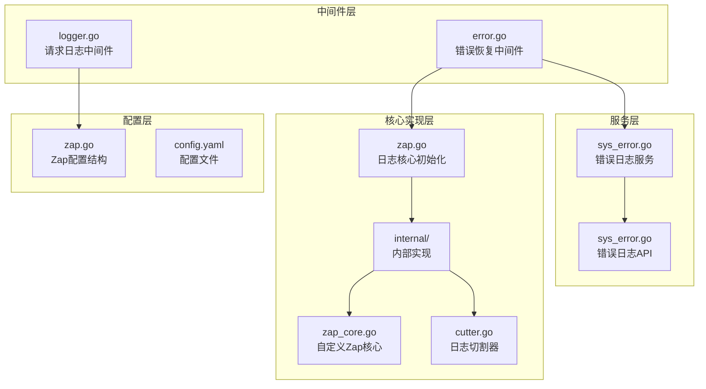
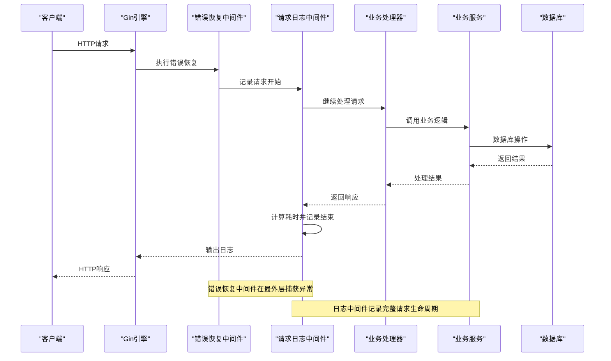
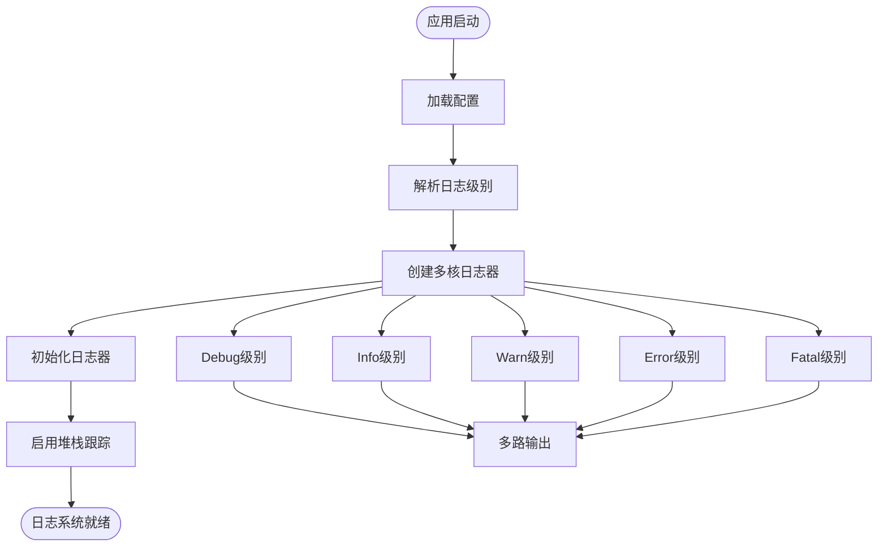
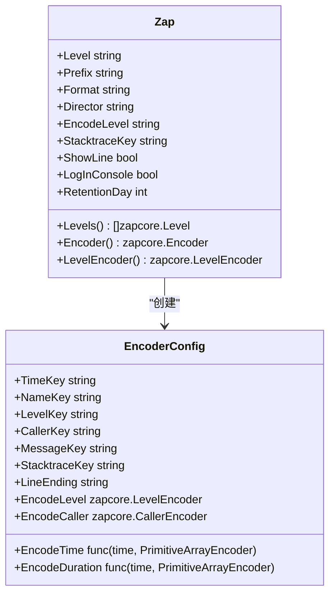
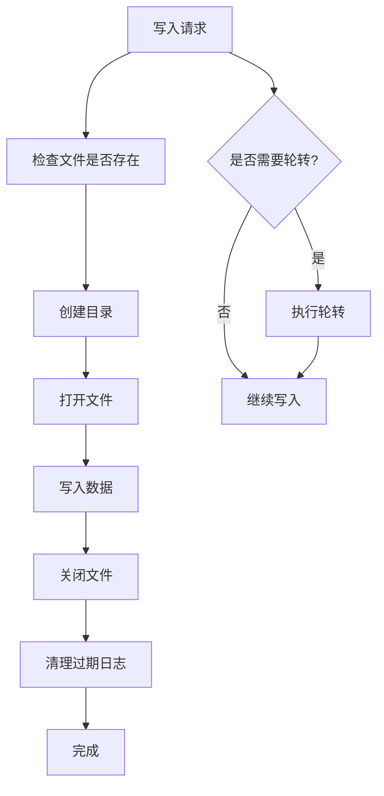
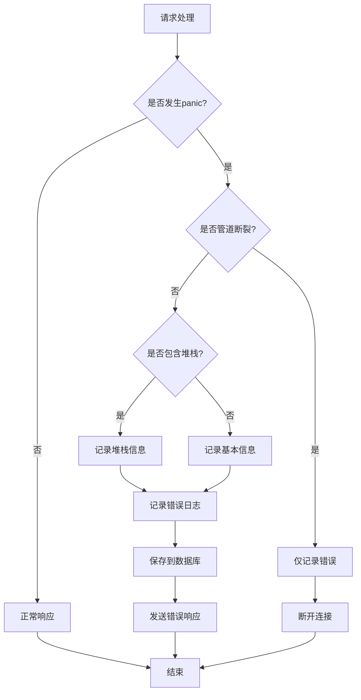
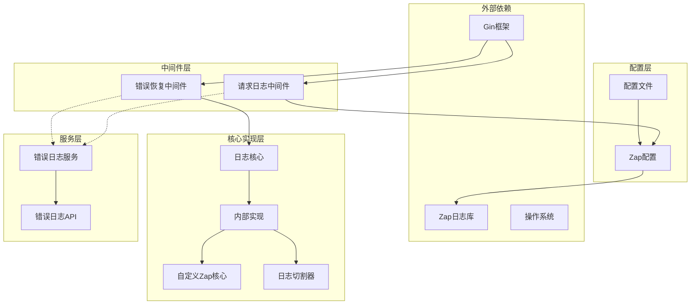

# 请求日志中间件

<cite>
**本文档引用的文件**
- [server/middleware/logger.go](file://server/middleware/logger.go)
- [server/config/zap.go](file://server/config/zap.go)
- [server/core/zap.go](file://server/core/zap.go)
- [server/core/internal/zap_core.go](file://server/core/internal/zap_core.go)
- [server/core/internal/cutter.go](file://server/core/internal/cutter.go)
- [server/middleware/error.go](file://server/middleware/error.go)
- [server/config.yaml](file://server/config.yaml)
- [server/initialize/router.go](file://server/initialize/router.go)
- [server/service/system/sys_error.go](file://server/service/system/sys_error.go)
- [server/api/v1/system/sys_error.go](file://server/api/v1/system/sys_error.go)
</cite>

## 目录
1. [简介](#简介)
2. [项目结构](#项目结构)
3. [核心组件](#核心组件)
4. [架构概览](#架构概览)
5. [详细组件分析](#详细组件分析)
6. [依赖关系分析](#依赖关系分析)
7. [性能考量](#性能考量)
8. [故障排查指南](#故障排查指南)
9. [结论](#结论)

## 简介

请求日志中间件是 Gin-Vue-Admin 项目中的核心组件之一，负责在整个请求生命周期中捕获和记录关键的请求信息。该中间件采用结构化日志设计，能够记录请求开始、处理过程和响应结束的完整信息流，为系统的监控、调试和审计提供了强大的支持。

该中间件基于 Go 标准库的 Gin 框架构建，集成了高性能的日志库 Zap，实现了异步写入、日志切割和错误处理等功能。通过灵活的配置选项，开发者可以根据不同的环境需求调整日志级别、格式和输出目标。

## 项目结构

请求日志中间件及其相关组件在项目中的组织结构如下：



**图表来源**
- [server/middleware/logger.go:1-90](file://server/middleware/logger.go#L1-L90)
- [server/middleware/error.go:1-81](file://server/middleware/error.go#L1-L81)
- [server/config/zap.go:1-72](file://server/config/zap.go#L1-L72)
- [server/core/zap.go:1-37](file://server/core/zap.go#L1-L37)
- [server/core/internal/zap_core.go:1-134](file://server/core/internal/zap_core.go#L1-L134)
- [server/core/internal/cutter.go:1-126](file://server/core/internal/cutter.go#L1-L126)
- [server/service/system/sys_error.go:1-127](file://server/service/system/sys_error.go#L1-L127)
- [server/api/v1/system/sys_error.go:78-200](file://server/api/v1/system/sys_error.go#L78-L200)

**章节来源**
- [server/middleware/logger.go:1-90](file://server/middleware/logger.go#L1-L90)
- [server/config/zap.go:1-72](file://server/config/zap.go#L1-L72)
- [server/core/zap.go:1-37](file://server/core/zap.go#L1-L37)

## 核心组件

### 请求日志中间件 (Logger)

请求日志中间件是整个日志系统的核心组件，负责捕获请求的完整生命周期信息。其主要特点包括：

- **结构化日志格式**：采用 JSON 格式输出，包含时间、路径、查询参数、请求体、客户端 IP、用户代理、错误信息、处理耗时等字段
- **可插拔扩展**：支持自定义过滤器、关键字脱敏、鉴权信息附加和自定义输出
- **性能优化**：只在必要时读取请求体，避免不必要的内存消耗
- **错误处理**：自动捕获并记录请求过程中的错误信息

### Zap 日志配置

Zap 是一个高性能的日志库，提供了丰富的配置选项：

- **多级别支持**：支持 Debug、Info、Warn、Error、DPanic、Panic、Fatal 等多个日志级别
- **灵活编码器**：支持 JSON 和控制台两种输出格式，可配置级别编码器的颜色和大小写
- **文件切割**：自动按级别和日期切割日志文件，支持日志保留策略
- **异步写入**：通过多核机制实现高效的异步日志写入

### 自定义错误处理

错误恢复中间件与日志系统深度集成，能够在发生 panic 时：

- 区分"管道断裂"等可忽略的网络错误和真正的业务错误
- 记录完整的请求信息和堆栈跟踪
- 将错误信息自动入库，便于后续分析和处理

**章节来源**
- [server/middleware/logger.go:14-39](file://server/middleware/logger.go#L14-L39)
- [server/config/zap.go:8-18](file://server/config/zap.go#L8-L18)
- [server/middleware/error.go:20-80](file://server/middleware/error.go#L20-L80)

## 架构概览

请求日志中间件在整个系统架构中的位置和作用如下：



**图表来源**
- [server/initialize/router.go:36-117](file://server/initialize/router.go#L36-L117)
- [server/middleware/logger.go:41-78](file://server/middleware/logger.go#L41-L78)
- [server/middleware/error.go:21-79](file://server/middleware/error.go#L21-L79)

该架构确保了：

1. **完整的请求跟踪**：从请求到达到最后响应返回的全过程都被记录
2. **错误处理的完整性**：所有异常都会被捕获并记录
3. **性能的最优性**：中间件按需执行，避免不必要的开销
4. **可扩展性**：支持自定义过滤和输出格式

## 详细组件分析

### 日志结构设计

请求日志中间件定义了完整的日志结构，每个字段都有明确的含义和用途：

```mermaid
classDiagram
class LogLayout {
+Time time.Time
+Metadata map[string]interface{}
+Path string
+Query string
+Body string
+IP string
+UserAgent string
+Error string
+Cost time.Duration
+Source string
}
class Logger {
+Filter func(*gin.Context) bool
+FilterKeyword func(*LogLayout) bool
+AuthProcess func(*gin.Context, *LogLayout)
+Print func(LogLayout)
+Source string
+SetLoggerMiddleware() gin.HandlerFunc
}
class DefaultLogger {
+SetLoggerMiddleware() gin.HandlerFunc
}
Logger <|-- DefaultLogger
Logger --> LogLayout : "创建"
```

**图表来源**
- [server/middleware/logger.go:14-39](file://server/middleware/logger.go#L14-L39)
- [server/middleware/logger.go:28-39](file://server/middleware/logger.go#L28-L39)

#### 字段详细说明

| 字段名 | 类型 | 含义 | 用途 |
|--------|------|------|------|
| Time | time.Time | 日志记录时间 | 用于时间序列分析和排序 |
| Metadata | map[string]interface{} | 自定义元数据 | 存储业务相关的额外信息 |
| Path | string | 请求路径 | 用于路由分析和性能统计 |
| Query | string | 查询参数 | 用于参数分析和安全审计 |
| Body | string | 请求体内容 | 用于业务数据记录（可选） |
| IP | string | 客户端IP地址 | 用于访问统计和安全分析 |
| UserAgent | string | 用户代理信息 | 用于客户端分析 |
| Error | string | 错误信息 | 用于异常追踪和诊断 |
| Cost | time.Duration | 处理耗时 | 用于性能监控和优化 |
| Source | string | 服务标识 | 用于多服务环境区分 |

### 日志级别管理

Zap 日志库提供了灵活的日志级别管理机制：



**图表来源**
- [server/core/zap.go:15-36](file://server/core/zap.go#L15-L36)
- [server/config/zap.go:21-31](file://server/config/zap.go#L21-L31)

#### 级别解析机制

日志级别从字符串转换为具体的 Zap 级别，并生成从该级别到致命级别的完整级别序列：

- **级别解析**：将配置中的字符串级别解析为 zapcore.Level
- **级别序列**：从解析的级别开始，生成 Debug 到 Fatal 的完整序列
- **多核创建**：为每个级别创建独立的日志核心
- **多路输出**：使用 tee 机制将日志同时输出到多个目标

### Zap 配置详解

Zap 配置结构提供了丰富的配置选项：



**图表来源**
- [server/config/zap.go:8-54](file://server/config/zap.go#L8-L54)

#### 配置选项说明

| 配置项 | 类型 | 默认值 | 说明 |
|--------|------|--------|------|
| level | string | "info" | 日志级别，支持 debug、info、warn、error 等 |
| prefix | string | "" | 时间前缀，用于格式化输出 |
| format | string | "console" | 输出格式，支持 "json" 和 "console" |
| director | string | "log" | 日志文件目录 |
| encode-level | string | "LowercaseLevelEncoder" | 级别编码器，支持多种编码方式 |
| stacktrace-key | string | "stacktrace" | 堆栈跟踪键名 |
| show-line | bool | false | 是否显示调用行号 |
| log-in-console | bool | false | 是否同时输出到控制台 |
| retention-day | int | -1 | 日志保留天数，小于等于0表示不清理 |

### 日志切割与存储

日志切割器实现了智能的日志文件管理和清理机制：



**图表来源**
- [server/core/internal/cutter.go:58-95](file://server/core/internal/cutter.go#L58-L95)

#### 切割策略

日志文件按照以下规则进行切割：

- **按级别切割**：每个日志级别对应独立的文件
- **按日期切割**：支持按日期格式化的文件名
- **自定义格式**：支持业务相关的自定义格式参数
- **自动清理**：根据配置的保留天数自动清理过期文件

### 错误处理与日志入库

错误恢复中间件与日志系统深度集成，实现了完整的错误处理流程：



**图表来源**
- [server/middleware/error.go:21-79](file://server/middleware/error.go#L21-L79)

#### 错误分类处理

系统能够智能地区分不同类型的错误：

- **网络错误**：如"管道断裂"、"连接被对端重置"等，属于正常的网络行为，不记录为严重错误
- **业务错误**：应用程序的异常情况，需要详细记录和处理
- **系统错误**：底层系统错误，需要特别关注和处理

**章节来源**
- [server/middleware/logger.go:41-78](file://server/middleware/logger.go#L41-L78)
- [server/core/internal/zap_core.go:63-129](file://server/core/internal/zap_core.go#L63-L129)
- [server/middleware/error.go:21-79](file://server/middleware/error.go#L21-L79)

## 依赖关系分析

请求日志中间件的依赖关系体现了清晰的分层架构：



**图表来源**
- [server/middleware/logger.go:11-12](file://server/middleware/logger.go#L11-L12)
- [server/middleware/error.go:13-17](file://server/middleware/error.go#L13-L17)
- [server/config/zap.go:3-6](file://server/config/zap.go#L3-L6)
- [server/core/zap.go:8-11](file://server/core/zap.go#L8-L11)

### 关键依赖关系

1. **Gin 框架依赖**：中间件必须依赖 Gin 框架提供的上下文和中间件机制
2. **Zap 日志库依赖**：高性能日志记录功能的基础
3. **配置系统依赖**：动态配置管理，支持运行时调整
4. **数据库依赖**：错误日志的持久化存储
5. **文件系统依赖**：日志文件的读写和管理

### 循环依赖检测

经过分析，系统中没有发现循环依赖关系：

- 中间件层只依赖配置层和核心层，不反向依赖
- 配置层只依赖外部库，不依赖业务层
- 核心层依赖配置层，但不依赖业务层
- 服务层独立于中间件层，通过接口进行通信

**章节来源**
- [server/middleware/logger.go:1-12](file://server/middleware/logger.go#L1-L12)
- [server/middleware/error.go:1-18](file://server/middleware/error.go#L1-L18)
- [server/core/zap.go:1-11](file://server/core/zap.go#L1-L11)

## 性能考量

请求日志中间件在设计时充分考虑了性能因素，采用了多种优化策略：

### 内存优化

1. **按需读取请求体**：只有在自定义过滤器返回 false 时才读取原始请求体，避免不必要的内存消耗
2. **缓冲区复用**：使用 bytes.Buffer 复用内存，减少垃圾回收压力
3. **字符串优化**：合理使用字符串拼接和格式化，避免过多的内存分配

### I/O 优化

1. **异步写入**：通过 Zap 的多核机制实现异步日志写入
2. **文件句柄复用**：日志切割器复用文件句柄，减少文件操作开销
3. **批量写入**：尽可能批量写入日志数据，减少系统调用次数

### CPU 优化

1. **条件过滤**：通过自定义过滤器避免对不需要记录的请求进行处理
2. **延迟计算**：只在需要时才进行耗时的操作，如 JSON 序列化
3. **缓存机制**：对常用的配置和对象进行缓存

### 配置优化建议

根据不同的使用场景，建议调整以下配置：

- **开发环境**：设置 `level: debug`，`show-line: true`，便于调试
- **测试环境**：设置 `level: info`，`format: json`，便于日志分析
- **生产环境**：设置 `level: warn`，`log-in-console: false`，减少 I/O 开销

**章节来源**
- [server/middleware/logger.go:47-51](file://server/middleware/logger.go#L47-L51)
- [server/config/zap.go:21-31](file://server/config/zap.go#L21-L31)
- [server/config.yaml:10-19](file://server/config.yaml#L10-L19)

## 故障排查指南

### 常见问题及解决方案

#### 日志不输出问题

**问题描述**：请求日志中间件没有输出任何日志

**可能原因**：
1. 中间件未正确注册到 Gin 引擎
2. 日志级别设置过高
3. 输出目标配置错误

**解决方案**：
1. 检查路由初始化代码，确认中间件已正确注册
2. 调整配置文件中的日志级别
3. 验证日志目录权限和磁盘空间

#### 日志格式异常

**问题描述**：日志输出格式不符合预期

**可能原因**：
1. 编码器配置错误
2. 时间格式配置问题
3. 字段序列化错误

**解决方案**：
1. 检查 `encode-level` 配置项
2. 验证 `prefix` 和 `format` 设置
3. 确认 JSON 序列化过程

#### 性能问题

**问题描述**：系统性能下降，怀疑是日志中间件导致

**可能原因**：
1. 请求体过大，影响日志记录性能
2. 日志级别过低，产生大量日志
3. 文件系统 I/O 压力过大

**解决方案**：
1. 实现自定义过滤器，避免记录大体积请求
2. 调整日志级别到合适的水平
3. 优化日志切割策略，减少文件操作

### 调试技巧

1. **临时提高日志级别**：在调试时将日志级别设置为 debug，获取更详细的日志信息
2. **使用自定义过滤器**：针对特定的请求进行日志记录，减少干扰信息
3. **检查日志文件**：定期检查日志文件的大小和数量，确保正常运行
4. **监控系统资源**：观察 CPU、内存和磁盘 I/O 使用情况

### 监控指标

建议关注以下关键指标：

- **日志吞吐量**：每秒记录的日志条数
- **日志大小**：单条日志的平均大小
- **写入延迟**：日志写入的平均延迟
- **错误率**：日志写入失败的比例
- **磁盘使用率**：日志目录的磁盘占用情况

**章节来源**
- [server/middleware/logger.go:71-76](file://server/middleware/logger.go#L71-L76)
- [server/core/internal/cutter.go:108-125](file://server/core/internal/cutter.go#L108-L125)
- [server/config.yaml:10-19](file://server/config.yaml#L10-L19)

## 结论

请求日志中间件作为 Gin-Vue-Admin 项目的重要组成部分，展现了优秀的架构设计和实现质量。通过结构化的日志格式、灵活的配置选项和高性能的实现机制，该中间件为系统的监控、调试和维护提供了强有力的支持。

### 主要优势

1. **完整的生命周期记录**：从请求开始到响应结束的全过程都被精确记录
2. **灵活的扩展性**：支持自定义过滤、脱敏和输出格式
3. **高性能实现**：通过异步写入和按需处理优化性能
4. **完善的错误处理**：与错误恢复中间件深度集成，确保异常情况的完整记录
5. **智能的日志管理**：自动切割和清理日志文件，避免磁盘空间问题

### 最佳实践建议

1. **合理配置日志级别**：根据不同环境调整日志级别，平衡调试需求和性能影响
2. **实施敏感信息保护**：使用关键字过滤机制对敏感数据进行脱敏处理
3. **监控日志系统健康**：定期检查日志文件状态和系统资源使用情况
4. **优化日志格式**：根据实际需求调整日志字段，避免不必要的信息冗余
5. **建立日志分析流程**：制定标准化的日志分析和处理流程

该日志中间件的设计充分体现了现代 Web 应用对可观测性的要求，为构建可靠、可维护的企业级应用奠定了坚实的基础。