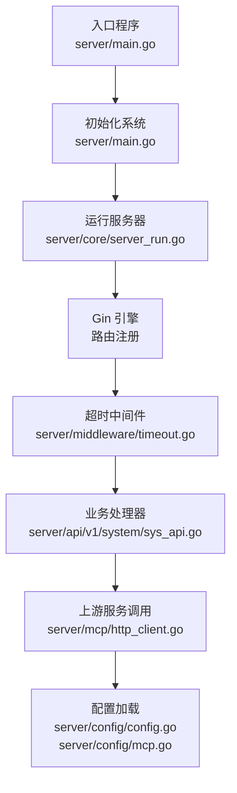
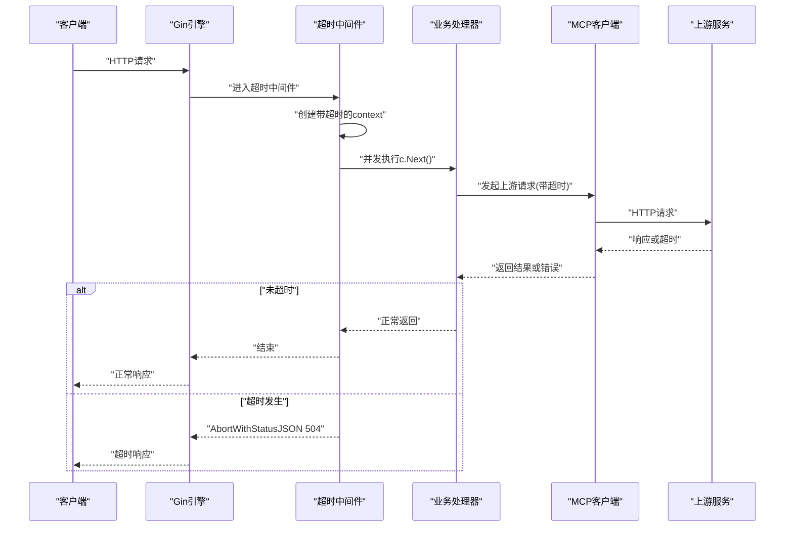
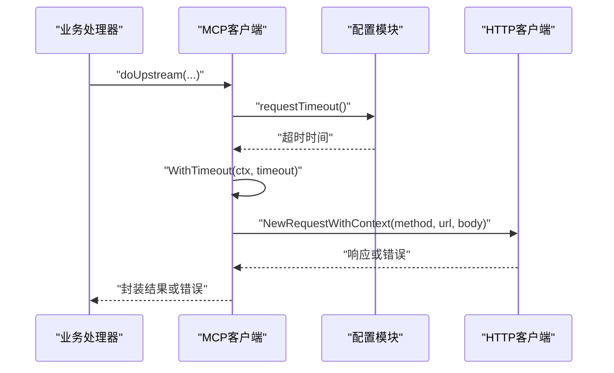
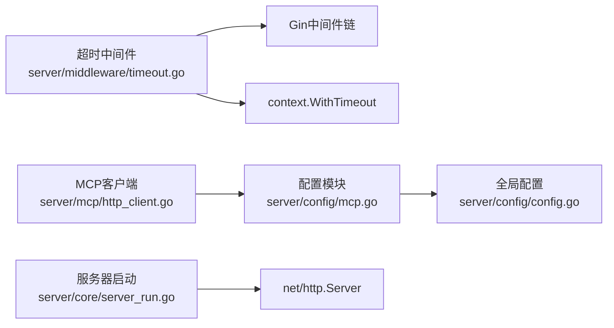

# 超时控制中间件

<cite>
**本文档引用的文件**
- [server/middleware/timeout.go](file://server/middleware/timeout.go)
- [server/mcp/http_client.go](file://server/mcp/http_client.go)
- [server/config/mcp.go](file://server/config/mcp.go)
- [server/core/server_run.go](file://server/core/server_run.go)
- [server/router/system/sys_api.go](file://server/router/system/sys_api.go)
- [server/api/v1/system/sys_api.go](file://server/api/v1/system/sys_api.go)
- [server/config/config.go](file://server/config/config.go)
- [server/main.go](file://server/main.go)
</cite>

## 目录
1. [简介](#简介)
2. [项目结构](#项目结构)
3. [核心组件](#核心组件)
4. [架构总览](#架构总览)
5. [详细组件分析](#详细组件分析)
6. [依赖关系分析](#依赖关系分析)
7. [性能考量](#性能考量)
8. [故障排查指南](#故障排查指南)
9. [结论](#结论)

## 简介
本技术文档围绕 Gin-Vue-Admin 项目中的“超时控制中间件”展开，系统性阐述请求超时机制的实现原理与最佳实践。重点包括：
- 基于 context 的超时控制与 goroutine 管理
- 资源清理策略与 panic 恢复
- 超时配置建议（不同接口类型与负载均衡考虑）
- 超时后的资源释放与错误响应处理
- 防范超时攻击与避免资源泄露的策略

该中间件通过在 Gin 上下文中嵌入带超时的 context，并在协程中安全执行后续处理流程，结合带缓冲的完成通道与 panic 捕获，确保在超时发生时能够及时终止处理并返回统一的超时响应。

## 项目结构
与超时控制相关的核心位置如下：
- 中间件实现：server/middleware/timeout.go
- 上游服务调用与请求超时：server/mcp/http_client.go
- 配置模型：server/config/mcp.go、server/config/config.go
- 服务器启动与读写超时：server/core/server_run.go
- 路由与处理器示例：server/router/system/sys_api.go、server/api/v1/system/sys_api.go
- 入口程序：server/main.go



图表来源
- [server/main.go:30-35](file://server/main.go#L30-L35)
- [server/core/server_run.go:21-30](file://server/core/server_run.go#L21-L30)
- [server/middleware/timeout.go:13-55](file://server/middleware/timeout.go#L13-L55)
- [server/api/v1/system/sys_api.go:18-46](file://server/api/v1/system/sys_api.go#L18-L46)
- [server/mcp/http_client.go:55-61](file://server/mcp/http_client.go#L55-L61)
- [server/config/config.go:38-40](file://server/config/config.go#L38-L40)
- [server/config/mcp.go:3-18](file://server/config/mcp.go#L3-L18)

章节来源
- [server/main.go:30-35](file://server/main.go#L30-L35)
- [server/core/server_run.go:21-30](file://server/core/server_run.go#L21-L30)
- [server/middleware/timeout.go:13-55](file://server/middleware/timeout.go#L13-L55)
- [server/api/v1/system/sys_api.go:18-46](file://server/api/v1/system/sys_api.go#L18-L46)
- [server/mcp/http_client.go:55-61](file://server/mcp/http_client.go#L55-L61)
- [server/config/config.go:38-40](file://server/config/config.go#L38-L40)
- [server/config/mcp.go:3-18](file://server/config/mcp.go#L3-L18)

## 核心组件
- 超时中间件：基于 context.WithTimeout 创建带超时的上下文，替换请求上下文；使用 goroutine 并发执行后续处理；通过带缓冲的 done 和 panicChan 避免 goroutine 泄漏；在 ctx.Done() 触发时返回统一的超时响应。
- 上游服务调用：在 MCP 工具中，通过 requestTimeout() 读取配置并创建带超时的 context，再发起 HTTP 请求，确保上游调用不会无限阻塞。
- 配置模型：MCP 结构体包含 RequestTimeout 字段，用于控制上游请求超时时间；全局配置结构体 Server 包含 MCP 字段。
- 服务器启动：initServer 函数设置 http.Server 的 ReadTimeout 与 WriteTimeout，作为网络层的超时保障。

章节来源
- [server/middleware/timeout.go:13-55](file://server/middleware/timeout.go#L13-L55)
- [server/mcp/http_client.go:55-61](file://server/mcp/http_client.go#L55-L61)
- [server/config/mcp.go:3-18](file://server/config/mcp.go#L3-L18)
- [server/config/config.go:38-40](file://server/config/config.go#L38-L40)
- [server/core/server_run.go:21-30](file://server/core/server_run.go#L21-L30)

## 架构总览
下图展示了从客户端请求到业务处理、上游调用及超时控制的整体流程：



图表来源
- [server/middleware/timeout.go:13-55](file://server/middleware/timeout.go#L13-L55)
- [server/api/v1/system/sys_api.go:18-46](file://server/api/v1/system/sys_api.go#L18-L46)
- [server/mcp/http_client.go:75-120](file://server/mcp/http_client.go#L75-L120)

## 详细组件分析

### 超时中间件实现原理
- context 超时控制：使用 WithTimeout 创建带超时的 context，并将其赋给请求对象，使后续处理链共享该超时语义。
- goroutine 管理：在 goroutine 中执行 c.Next()，避免阻塞主线程；使用带缓冲的 done 通道确保 goroutine 正常退出时能被 select 接收，防止泄漏。
- panic 恢复：在 goroutine 内部捕获 panic，并通过 panicChan 传递，主流程在 select 中检测到后重新抛出，保证错误传播一致性。
- 超时响应：当 ctx.Done() 被触发时，设置 Connection: close 并返回统一的 504 超时响应，确保客户端与网关正确处理连接关闭。

```mermaid
flowchart TD
Start(["进入中间件"]) --> Ctx["创建带超时的context"]
Ctx --> Replace["替换请求上下文"]
Replace --> Go["并发执行c.Next()"]
Go --> Select{"select等待"}
Select --> |panicChan| Reraise["重新抛出panic"]
Select --> |done| Normal["正常返回"]
Select --> |ctx.Done()| Timeout["设置Connection: close<br/>返回504超时"]
Reraise --> End(["结束"])
Normal --> End
Timeout --> End
```

图表来源
- [server/middleware/timeout.go:13-55](file://server/middleware/timeout.go#L13-L55)

章节来源
- [server/middleware/timeout.go:13-55](file://server/middleware/timeout.go#L13-L55)

### 上游服务调用的超时控制
- 配置驱动：requestTimeout() 从全局配置读取 MCP.RequestTimeout，默认值为 15 秒；若配置无效则回退到默认值。
- 超时传播：使用 WithTimeout 创建带超时的 context，并在 HTTP 请求中通过 NewRequestWithContext 注入，确保网络层调用受控。
- 错误处理：对上游响应的状态码与业务码进行校验，非 2xx 或业务码非 0 的情况返回错误；同时对读取响应体、反序列化等步骤进行错误包装，便于定位问题。



图表来源
- [server/mcp/http_client.go:55-61](file://server/mcp/http_client.go#L55-L61)
- [server/mcp/http_client.go:107-110](file://server/mcp/http_client.go#L107-L110)
- [server/mcp/http_client.go:120-153](file://server/mcp/http_client.go#L120-L153)
- [server/config/mcp.go:11](file://server/config/mcp.go#L11)

章节来源
- [server/mcp/http_client.go:55-61](file://server/mcp/http_client.go#L55-L61)
- [server/mcp/http_client.go:107-110](file://server/mcp/http_client.go#L107-L110)
- [server/mcp/http_client.go:120-153](file://server/mcp/http_client.go#L120-L153)
- [server/config/mcp.go:11](file://server/config/mcp.go#L11)

### 服务器层面的读写超时
- initServer 设置 http.Server 的 ReadTimeout 与 WriteTimeout，作为网络层的兜底超时保护，避免长时间占用连接导致资源耗尽。
- 优雅关闭：通过 context.WithTimeout 控制 Shutdown 的最长等待时间，确保在收到信号后有界时间内完成关闭。

章节来源
- [server/core/server_run.go:21-30](file://server/core/server_run.go#L21-L30)
- [server/core/server_run.go:50-57](file://server/core/server_run.go#L50-L57)

### 路由与处理器示例
- 路由注册：系统路由示例展示了如何在路由组上挂载中间件，业务处理器负责具体的数据处理与调用。
- 处理器行为：处理器内部可进一步调用上游服务，上游服务同样受其自身的超时控制约束。

章节来源
- [server/router/system/sys_api.go:10-35](file://server/router/system/sys_api.go#L10-L35)
- [server/api/v1/system/sys_api.go:18-46](file://server/api/v1/system/sys_api.go#L18-L46)

## 依赖关系分析
- 超时中间件依赖 Gin 的中间件机制与 context 包，通过替换请求上下文实现超时传播。
- 上游服务调用依赖全局配置模块，配置字段来自 MCP 结构体，最终由全局 Server 结构体承载。
- 服务器启动依赖 net/http 与信号处理，确保在超时或关闭时有界资源回收。



图表来源
- [server/middleware/timeout.go:13-55](file://server/middleware/timeout.go#L13-L55)
- [server/mcp/http_client.go:55-61](file://server/mcp/http_client.go#L55-L61)
- [server/config/mcp.go:3-18](file://server/config/mcp.go#L3-L18)
- [server/config/config.go:38-40](file://server/config/config.go#L38-L40)
- [server/core/server_run.go:21-30](file://server/core/server_run.go#L21-L30)

章节来源
- [server/middleware/timeout.go:13-55](file://server/middleware/timeout.go#L13-L55)
- [server/mcp/http_client.go:55-61](file://server/mcp/http_client.go#L55-L61)
- [server/config/mcp.go:3-18](file://server/config/mcp.go#L3-L18)
- [server/config/config.go:38-40](file://server/config/config.go#L38-L40)
- [server/core/server_run.go:21-30](file://server/core/server_run.go#L21-L30)

## 性能考量
- 超时粒度与负载均衡
  - 短请求（如查询、鉴权）：建议设置较短超时（如 3–10 秒），避免排队过长。
  - 中等复杂度请求（如批量查询、聚合）：建议 10–30 秒，结合上游服务超时与数据库连接池配置。
  - 长耗时请求（如导出、报表生成）：建议 30–120 秒或更长，并配合异步任务与轮询接口。
  - 负载均衡场景：前端网关或反向代理应设置合理的超时上限，避免与后端超时产生不一致；后端中间件超时应小于网关超时，确保网关能及时感知后端超时。
- 资源与并发
  - 使用带缓冲的 done 与 panicChan，避免 goroutine 泄漏；在超时路径中尽早 Abort，减少资源占用。
  - 上游调用的超时与重试策略需平衡成功率与资源消耗，避免雪崩效应。
- 服务器层兜底
  - ReadTimeout 与 WriteTimeout 作为网络层超时保护，建议与业务超时策略协同设置，避免极端情况下连接长期占用。

## 故障排查指南
- 常见问题
  - 超时频繁：检查上游服务健康状况、数据库连接池、第三方接口可用性；适当提高超时阈值并增加重试与熔断。
  - 资源泄露：确认中间件是否正确使用带缓冲通道与 defer cancel；确保 Abort 后不再继续写入响应。
  - 错误传播：若业务处理器内发生 panic，中间件会捕获并通过 panicChan 传递；检查日志中是否有未捕获的异常。
- 关键检查点
  - 中间件：确认 ctx.Done() 是否被触发、done 与 panicChan 是否被正确接收。
  - 上游调用：核对配置中的 RequestTimeout 是否生效、HTTP 请求是否正确注入了带超时的 context。
  - 服务器：确认 ReadTimeout 与 WriteTimeout 设置合理，避免与中间件超时冲突。

章节来源
- [server/middleware/timeout.go:13-55](file://server/middleware/timeout.go#L13-L55)
- [server/mcp/http_client.go:55-61](file://server/mcp/http_client.go#L55-L61)
- [server/core/server_run.go:21-30](file://server/core/server_run.go#L21-L30)

## 结论
本项目通过“超时中间件 + 上游调用超时 + 服务器层超时”的三层防护，实现了对请求生命周期的可控与可观测。实践中应结合接口类型与负载特征设定合理的超时阈值，并配套完善的资源清理与错误处理策略，以有效防范超时攻击与资源泄露，提升系统的稳定性与用户体验。